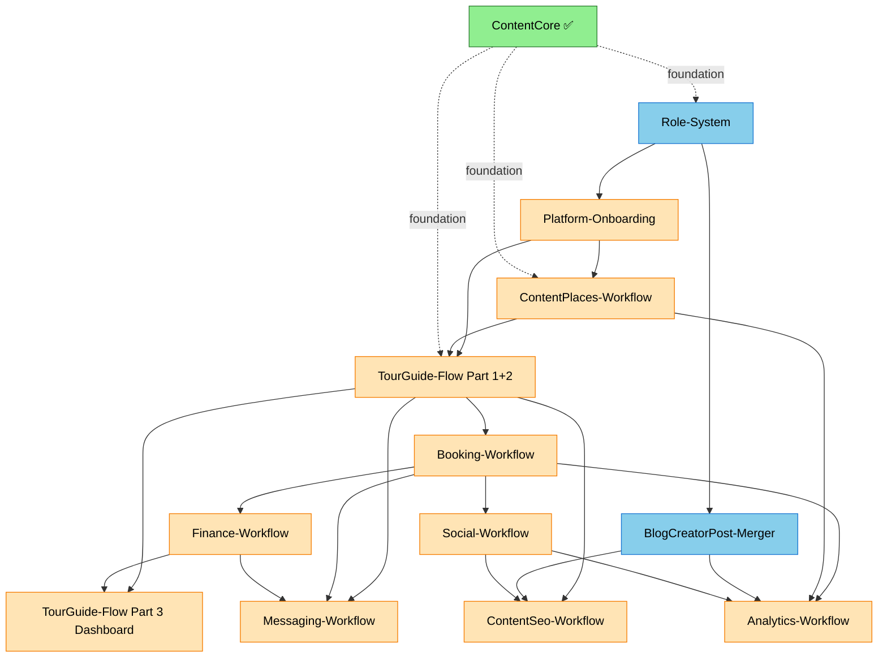

# YallaJo Implementation Roadmap

**Source plans:** 13 files in `Agents/Plans/`
**Status as of last update:** ContentCore-Workflow.md ✅ COMPLETE | 26 ContentPlaces/Tours/Blogs gaps ✅ CLOSED | 14 entities optimized out of DB

---

## 1. Executive Summary

13 plans organized into **9 execution phases** ordered by dependency. Total scope: **~700-800 new files**, **~250-300 modified files**, **est. 350-450 hours engineering effort**.

| Status | Count |
|--------|-------|
| ✅ Completed | 1 (ContentCore) |
| 🟢 Ready to start | 2 (Role-System, BlogCreatorPost-Merger) |
| 🟡 Blocked by deps | 9 |
| 📄 Informational | 1 (CrossDocumentAnalysisReport) |

---

## 2. Dependency Graph



---

## 3. Phase Execution Sequence

### ✅ Phase 0 — Foundation (COMPLETE)

| Plan | Status | Effort | Notes |
|------|--------|--------|-------|
| **ContentCore-Workflow.md** | ✅ DONE | — | AttachmentLimits, EntityTag events, Language endpoints, throws fixed |
| Entity Optimization | ✅ DONE | — | 14 entities removed, 5 migrations generated |
| 26 module gaps | ✅ DONE | — | ContentPlaces (11) + ContentBlogs (7) + ContentTours (8) |

**Foundation is in place. Proceed to Phase 1.**

---

### 🟢 Phase 1 — Authorization Foundation (BLOCKING ALL OTHERS)

| Plan | Effort | Files | Why first |
|------|--------|-------|-----------|
| **Role-System.md** | ~6-8h | ~10-15 | Provider + Creator roles must exist before any onboarding/approval flow can assign them |

**What this delivers:**
- Add `Provider` and `Creator` roles to `AppRoles`
- 4 new event handlers in Security.Infrastructure:
  - `ProviderApprovedAssignRoleHandler` → Provider (or TourGuide if IndependentGuide)
  - `CreatorApprovedAssignRoleHandler` → Creator
  - `AgencyGuideAffiliatedAssignRoleHandler` → TourGuide
  - `EmailVerifiedUpgradeRoleHandler` → Guest → User
- Updated `DefaultRoles` (Guest on signup, User on email verification)
- Role seeding migration

**Risk:** LOW (additive only, no breaking changes)

**Unblocks:** Platform-Onboarding, BlogCreatorPost-Merger, TourGuide-Flow, ContentPlaces

---

### 🟡 Phase 2 — Identity & Onboarding

| Plan | Effort | Files | Depends on |
|------|--------|-------|------------|
| **Platform-Onboarding-Workflow.md** | ~24-32h | ~75-95 | Role-System |

**What this delivers:**
- 6 onboarding flows (A-F): Tourist, Provider Application, Post-Approval Automation, Tourist→Provider Upgrade, Agency Guide Roster, Creator Application
- 3 new entities: `AgencyAffiliation`, `AgencyInvitation`, `AgencyApplication`
- 19 new endpoints (8 agency roster + 5 guide↔agency + 2 agency public + 4 dashboard)
- `BusinessOwner = 5` added to ProviderType enum
- Type-specific auto-creation on approval (IndependentGuide → auto-create TourGuide profile)
- Unified provider dashboard with type-specific sections

**Risk:** MEDIUM (cross-module integration, agency roster bidirectional flow)

**Unblocks:** ContentPlaces-Workflow, TourGuide-Flow

---

### 🟢 Phase 3 — Content Modernization (Parallel Track A)

These two plans can run in **parallel** with Phase 2 (no overlap).

#### 3a. BlogCreatorPost-Merger.md

| Effort | Files | Depends on |
|--------|-------|------------|
| ~20-28h | ~84 (69 deleted + 15 new) | Role-System (Creator role) |

**What this delivers:**
- DELETE entire CreatorPost subsystem (~69 files: entity, enums, 30 command handlers, 10 query handlers, EF config, events, endpoints)
- EXTEND Blog entity with: SubmittedAt, ReviewedAt, ReviewedByAdminId, RejectionReason, FeaturedAt, FeaturedByAdminId, FeaturedUntil, ReportCount, ReactionCount, CommentCount
- New BlogStatus: `Draft=0, PendingReview=1, Published=2, Rejected=3, Archived=4, Hidden=5, Removed=6`
- 60-day soft-delete + hard-delete background services for Blog and CreatorProfile
- 7 new CreatorProfile CRUD endpoints (admin edit, self-delete, avatar/cover dedicated uploads, public blogs listing)
- Computed `IsFeatured` (replaces bool with `FeaturedAt != null && (FeaturedUntil == null || FeaturedUntil > now)`)

**Risk:** HIGH (deletes 69 files, cross-module event consumers, navigation property changes)

**Unblocks:** ContentSeo (Creator EntityType), Analytics (Blog stats)

#### 3b. ContentPlaces-Workflow.md

| Effort | Files | Depends on |
|--------|-------|------------|
| ~10-14h | ~18-22 | Platform-Onboarding (BusinessOwner type) |

**What this delivers:**
- `Business.PlaceId` becomes REQUIRED (was nullable) — forces Place discovery flow
- ProviderType → BusinessType enforced mapping (new `Activity = 7` BusinessType)
- Self-service business attachment system reuses polymorphic AccessibilityFeature (EntityType=1)
- Multi-business-per-place rule: 1 per (BusinessType, Place, Provider) triple
- Hybrid staff model: platform users OR name+role entries

**Risk:** MEDIUM (database migration — ALTER COLUMN SET NOT NULL on Business.PlaceId)

**Unblocks:** TourGuide-Flow (PlaceId enforcement on tours)

---

### 🟡 Phase 4 — TourGuide Multi-Guide System (Parts 1+2)

| Plan | Effort | Files | Depends on |
|------|--------|-------|------------|
| **TourGuide-Flow.md** (Parts 1+2 only) | ~50-65h | ~70-85 | Role-System, Platform-Onboarding, ContentPlaces |

**What this delivers (Part 1 — Multi-Guide Tour Model):**
- 6 new entities: `GuideApplication`, `TourProposal`, `GuideTourOffering`, `GuideSchedule`, `GuidePricingTier`, `GuideAvailabilityBlock`
- 3 tour creation paths: Provider/Agency, Admin platform, Guide proposal
- Trust tier system: `GuideTrustTier { New=0, Bronze=1, Silver=2, Gold=3 }`
- Private tour variant per offering
- Exclusive tour designation (guide-proposed)
- `Tour.PlaceId` becomes REQUIRED (decision #12)

**What this delivers (Part 2 — Profile Alignment):**
- Extend `TourGuide` entity with: Slug, DisplayName, AvatarUrl, CoverImageUrl, ApplicationId, LinkedProviderId, TrustTier, Status, CompletedTourCount, ReportCount
- `TourGuideStatus { Active=0, Suspended=1, Deactivated=2 }`
- Convert ALL throws to Result pattern
- 12 new/modified endpoints (public, self-management, admin)

**Risk:** HIGH (large surface area, modifies existing TourGuide assignment system)

**Unblocks:** Booking-Workflow, Messaging notification types, ContentSeo (TourGuide EntityType)

---

### 🟡 Phase 5 — Booking & Payment Joint Track

These two are tightly coupled and should be sequenced as **5a then 5b** (but designed together).

#### 5a. Booking-Workflow.md

| Effort | Files | Depends on |
|--------|-------|------------|
| ~70-85h | ~82-96 new + ~35 modified | TourGuide-Flow Parts 1+2 |

**What this delivers (10 workflow phases A-J):**
- **A**: Slot generation (60-day rolling background service from GuideSchedule)
- **B**: Discovery (3 paths: Tour→Guide→Slots / Tour→AllSlots / Guide→Tours)
- **C**: Booking creation (validation chain, GuidePricingTier, SlotLock)
- **D**: Discount pipeline (tour auto + guide promotions + promo code, max 2 stackable, min 5 JOD)
- **E**: Payment (IPaymentGateway interface, webhook-driven)
- **F**: Guide confirmation (24h window, agency owner can also confirm)
- **G**: Post-booking (check-in, completion, escrow trigger)
- **H**: Cancellation (3-tier refund snapshotted at booking)
- **I**: Join requests (48h TTL, creates separate booking)
- **J**: Suspension (auto-cancel + 100% refund)
- New entities: `GuideDiscount`, `JoinRequest` (full domain methods)
- TourBooking adds: `GuideId`, `IsPrivate`, `JoinedFromBookingId`
- 9 background services
- 31 endpoints

**Risk:** HIGH (state machine, cross-module event chains, payment gateway abstraction)

#### 5b. Finance-Workflow.md

| Effort | Files | Depends on |
|--------|-------|------------|
| ~60-80h | ~100-130 new + ~35 modified | Booking-Workflow |

**What this delivers (9 phases):**
1. Auth gate cleanup (8 handlers)
2. Unified `PaymentMethod` entity (replaces ProviderBankAccount, supports bank + JoMoPay + OrangeMoney + ZainCash)
3. Agency split logic (2 payouts per agency booking — agency 20% / guide 80% of post-platform remainder)
4. Full Dispute lifecycle rewrite (admin-only resolution)
5. Credit Note entity + Monthly Statement (DTO + on-demand PDF, NOT a table)
6. GuideEarning per-booking tracking
7. Fix all domain entity throws → Result pattern
8. Provider/Guide payout dashboard endpoints
9. AdminFinanceDashboard endpoints

**Defers post-MVP:** Loyalty, Referral, Subscription, Discount CRUD (lives in Booking)

**Risk:** HIGH (money handling, agency split math, dispute state machine)

**Unblocks:** TourGuide-Flow Part 3 (dashboard wires Finance queries)

---

### 🟡 Phase 6 — Social, Messaging, TourGuide Dashboard (Parallel Track)

These three can be implemented in parallel after Phase 5.

#### 6a. Social-Workflow.md

| Effort | Files | Depends on |
|--------|-------|------------|
| ~32-42h | ~64-76 new + ~43 modified | Booking-Workflow (booking-verified reviews) |

**What this delivers:**
- 17 decisions locked (booking-verified reviews, half-star ratings, 3-report auto-hide)
- `ReviewHelpfulVote` + `UserModerationRecord` entities
- Warn+TempBan system (3-strike auto-escalation, Security enforces bans globally)
- ReportableEntityType: add `TourGuide=5`, remove CreatorPost
- FavoriteEntityType: add `Blog=3, TourGuide=4`
- Single provider reply per review (entity owner + admin)
- Delete AccessibilityReview dead code (already done)
- HybridCache 5-min TTL with tag invalidation
- Final 29 endpoints

**Risk:** MEDIUM (cross-module booking verification, ban enforcement integration)

#### 6b. TourGuide-Flow.md (Part 3 — Dashboard)

| Effort | Files | Depends on |
|--------|-------|------------|
| ~40-55h | ~36-50 (after entity optimization) | Booking + Finance |

**What this delivers:**
- 11 dashboard sections: Overview, My Tours, Calendar, Bookings, Earnings & Payouts, Analytics, My Applications, My Proposals, Reviews, Trust Tier Progress, Notifications
- **NO new financial entities** (uses Finance.PaymentMethod, Finance.Payout, Finance.GuideEarning)
- **NO new notification entity** (uses Messaging.Notification with new types 40-49)
- **NO new review response entity** (uses Social.Review.AddReply())
- ~35 endpoints across 6 groups
- Payout cycle: auto weekly + manual on-demand (min 20 JOD)

**Risk:** MEDIUM (heavy cross-module queries, but no new tables)

#### 6c. Messaging-Workflow.md

| Effort | Files | Depends on |
|--------|-------|------------|
| ~28-38h | ~46 new + ~31 modified | TourGuide-Flow, Booking, Finance |

**What this delivers:**
- 16 decisions locked
- 10 new TourGuide notification types (40-49)
- SLA monitoring: 75% warn → 100% breach + auto-escalate
- Digest batching (per-category frequency: instant/daily/weekly)
- Email: SMTP transactional + Cloud (IMarketingEmailSender)
- Push: Gateway-agnostic IPushProvider
- 5 new ticket categories (PayoutIssue, CommissionDispute, GuideScheduleIssue, TourApprovalHelp, DocumentVerification)
- Auth gate cleanup (21 endpoints)
- `DateTime.UtcNow` → `TimeProvider` (6 occurrences)
- Notification gets 5 new columns (digest tracking) instead of new DigestQueueItem table

**Risk:** MEDIUM (SLA enforcement, cross-module event consumption)

---

### 🟡 Phase 7 — Discovery & Recommendations

#### 7a. ContentSeo-Workflow.md

| Effort | Files | Depends on |
|------|--------|--------|------------|
| ~12-16h | ~24 new + ~11 modified | TourGuide-Flow, BlogCreatorPost-Merger, Social-Workflow |

**What this delivers:**
- SeoEntityType expansion: `TourGuide=4`, `Creator=5`
- 6 new endpoints (4 dead permissions wired)
- Schema.org AggregateRating auto-generated from Social `ReviewAggregateUpdatedIntegrationEvent`
- WeatherAPI.com full implementation
- Redirect full update (target + status + active)
- Sitemap admin endpoints (Read + Delete + Priority override)
- 7 new integration event handlers (3 TourGuide + 3 Creator + 1 Social rating)

**Risk:** LOW (cleanest module, additive changes)

#### 7b. Analytics-Workflow.md

| Effort | Files | Depends on |
|------|--------|--------|------------|
| ~40-55h | ~56 new + ~22 modified | All content + booking + social modules |

**What this delivers:**
- 14 decisions locked
- CQRS fix: 15 endpoints bypass CQRS → proper Command/Query handlers
- Full collaborative filtering (item-item co-occurrence + PMI + time decay)
- Nightly matrix recomputation (03:00 UTC)
- **CollaborativeScoreMatrix is NOT a table** — DTO + HybridCache (24h TTL)
- Dedicated guide dashboard analytics suite
- GDPR data export endpoint
- Wire UserExcludedEntity as hard exclusion in scoring
- Blended scoring: 40% Collaborative + 35% Content + 25% Popularity
- 7 new feature catalog entries (16 new permissions)
- Audit trail identity spoofing fix

**Risk:** HIGH (15 CQRS rewrites, recommendation algorithm change)

---

### 📄 Phase 8 — Cross-Cutting Verification

| Plan | Status |
|------|--------|
| **CrossDocumentAnalysisReport.md** | All 6 contradictions ✅ RESOLVED in plans |

Informational document. No implementation needed — already addressed by plan decisions:
- CONTRADICTION-1 (Commission model): Revenue-tier only, GuideTrustTier non-financial perks (Finance Decision #2)
- CONTRADICTION-2 (Review eligibility): Booking-verified only (Social Decision #15)
- CONTRADICTION-3 (Rating granularity): Half-star (Social Decision #16)
- CONTRADICTION-4 (Report threshold): 3 reports auto-hide (Social Decision #17)
- CONTRADICTION-5 (ProviderType): Unified with BusinessOwner=5 (Onboarding Decision #1)
- CONTRADICTION-6 (Refund policy): 3-tier per-tour snapshot (Booking Decision)

---

## 4. Effort Summary

| Phase | Plans | Est. Hours | Files New | Files Modified |
|-------|-------|-----------|-----------|----------------|
| 0 | ContentCore + Gaps + Optimization | ✅ | — | — |
| 1 | Role-System | 6-8 | 10-15 | — |
| 2 | Platform-Onboarding | 24-32 | 75-95 | — |
| 3a | BlogCreatorPost-Merger | 20-28 | 15 new + 69 deleted | ~25 |
| 3b | ContentPlaces-Workflow | 10-14 | 18-22 | — |
| 4 | TourGuide-Flow P1+P2 | 50-65 | 70-85 | — |
| 5a | Booking-Workflow | 70-85 | 82-96 | 35 |
| 5b | Finance-Workflow | 60-80 | 100-130 | 35 |
| 6a | Social-Workflow | 32-42 | 64-76 | 43 |
| 6b | TourGuide-Flow P3 | 40-55 | 36-50 | — |
| 6c | Messaging-Workflow | 28-38 | 46 | 31 |
| 7a | ContentSeo-Workflow | 12-16 | 24 | 11 |
| 7b | Analytics-Workflow | 40-55 | 56 | 22 |
| **TOTAL** | **13 plans** | **392-518h** | **~600-700** | **~200-250** |

At **40h/week** for a single engineer: **~10-13 weeks** (~2.5-3 months).
With **2-3 engineers working in parallel** on independent tracks: **~5-7 weeks**.

---

## 5. Critical Path

```
Role-System → Platform-Onboarding → TourGuide P1+P2 → Booking → Finance → TourGuide P3
   (8h)            (32h)                (65h)         (85h)    (80h)        (55h)
```

**Critical path: ~325 hours** (~8 weeks for single engineer, ~4 weeks for 2 engineers).

Non-critical (parallel-eligible) work: BlogCreatorPost-Merger, ContentPlaces, Social, Messaging, ContentSeo, Analytics.

---

## 6. Parallelization Opportunities

### Wave 1 (after Phase 1)
- **Track A**: Platform-Onboarding (Engineer 1)
- **Track B**: BlogCreatorPost-Merger (Engineer 2)

### Wave 2 (after Phase 2 + 3a)
- **Track A**: ContentPlaces-Workflow (Engineer 1)
- **Track B**: ContentSeo prep (Engineer 2, awaiting TourGuide for full launch)

### Wave 3 (after Phase 3)
- **Track A**: TourGuide-Flow Parts 1+2 (Engineer 1+2 joint)

### Wave 4 (after Phase 4)
- **Track A**: Booking-Workflow (Engineer 1)
- **Track B**: TourGuide-Flow Part 3 design + skeleton (Engineer 2)

### Wave 5 (after Phase 5a)
- **Track A**: Finance-Workflow (Engineer 1)
- **Track B**: Social-Workflow (Engineer 2)
- **Track C**: Messaging-Workflow (Engineer 3, if available)

### Wave 6 (after Phase 6)
- **Track A**: ContentSeo final wiring (Engineer 1)
- **Track B**: Analytics-Workflow (Engineer 2)

---

## 7. Risk Register

| Risk | Likelihood | Impact | Mitigation |
|------|------------|--------|------------|
| Role-System breaks existing auth | LOW | HIGH | Additive only; existing role assignments unchanged |
| BlogCreatorPost-Merger data loss | MEDIUM | HIGH | No production data confirmed; clean drop OK |
| Business.PlaceId NOT NULL migration fails | MEDIUM | HIGH | Backfill script + transactional migration |
| Booking state machine race conditions | HIGH | HIGH | Comprehensive integration tests, idempotency on webhooks |
| Finance agency split math errors | MEDIUM | CRITICAL | Property-based testing on commission calculations |
| TourGuide Part 3 cross-module query perf | MEDIUM | MEDIUM | HybridCache on all aggregations, denormalized read models |
| Analytics 15 CQRS rewrites break behavior | HIGH | MEDIUM | Snapshot tests before/after, gradual rollout |
| Messaging SLA enforcement loops | LOW | MEDIUM | Bounded retry, dead-letter queue |
| Webhook idempotency holes | MEDIUM | HIGH | Inbox deduplication via gateway event ID |
| Cross-module event handler explosions | HIGH | MEDIUM | Outbox/Inbox pattern enforced, integration test matrix |

---

## 8. Cross-Cutting Standards (Apply Throughout)

All phases must adhere to these existing rules from `Agents/agent-context.md`:

1. **No `IsAuthenticated` / `currentUser.UserId is null` checks in handlers** — endpoint-level `MustHavePermission` only
2. **No `AppRoles.HighestPrivilegeLevel` admin bypass** in handlers — role hierarchy in endpoints
3. **Result pattern everywhere** — no throws in command/query handlers (constructor fail-fast guards exempt)
4. **Per-module PermissionCatalog** — never reuse permissions across modules
5. **Domain event handlers never call SaveChanges** — use Outbox/Inbox for cross-module
6. **ICurrentUser only for ownership/self-checks** — never as auth gate

These were enforced via 26 gap fixes across ContentPlaces/Tours/Blogs and 8 in ContentCore. New code MUST follow these patterns from day 1.

---

## 9. Migration Strategy

Each phase generates 1-3 EF migrations. Recommended order:
1. **Generate migration** at end of each phase using `dotnet ef migrations add <PhaseName>` from `YallaJo.Api` startup project
2. **Review SQL** before applying (especially `ALTER COLUMN`, `DROP TABLE`)
3. **Apply to dev**, run integration tests, then promote
4. **Backup production** before any `DROP TABLE` migration (Phase 3a especially)

Required migrations (in order):
- Phase 1: `AddProviderAndCreatorRoles`
- Phase 2: `AddAgencyAffiliation`, `AddBusinessOwnerProviderType`
- Phase 3a: `MergeBlogCreatorPost` (drops 5-7 tables, adds 8 columns)
- Phase 3b: `BusinessPlaceIdRequired` (NOT NULL constraint), `AddBusinessTypeActivity`
- Phase 4: `AddTourGuideSystem` (6 new tables + extend TourGuide), `TourPlaceIdRequired`
- Phase 5a: `AddGuideDiscount`, `ExtendTourBookingWithGuide`, `AddJoinRequestMethods`
- Phase 5b: `UnifiedPaymentMethod`, `DisputeRewrite`, `AddCreditNote`, `AddGuideEarning`
- Phase 6a: `AddReviewHelpfulVote`, `AddUserModerationRecord`
- Phase 6c: `AddDigestColumnsToNotification`
- Phase 7a: `AddSeoEntityTypeExpansion`, `AddWeatherDataPersistence`
- Phase 7b: `AnalyticsCqrsCleanup`, `AddGdprDeletionTracking`

---

## 10. Recommended Starting Point

**Begin immediately with Phase 1 (Role-System.md)** — it's the foundation for 9 of 10 remaining plans, low risk, additive only, and ~6-8 hours to complete.

After Role-System, **fork into parallel tracks**:
- One developer on BlogCreatorPost-Merger (independent module)
- One developer on Platform-Onboarding (blocks TourGuide chain)

This maximizes throughput while keeping critical path moving.

---

## 11. Quick Reference Table

| # | Plan | Phase | Status | Est. Hours | Critical Path |
|---|------|-------|--------|-----------|---------------|
| 1 | Role-System.md | 1 | 🟢 Ready | 6-8 | YES |
| 2 | Platform-Onboarding-Workflow.md | 2 | 🟡 Blocked | 24-32 | YES |
| 3 | BlogCreatorPost-Merger.md | 3a | 🟢 Ready (after #1) | 20-28 | NO |
| 4 | ContentPlaces-Workflow.md | 3b | 🟡 Blocked | 10-14 | NO |
| 5 | TourGuide-Flow.md (P1+P2) | 4 | 🟡 Blocked | 50-65 | YES |
| 6 | Booking-Workflow.md | 5a | 🟡 Blocked | 70-85 | YES |
| 7 | Finance-Workflow.md | 5b | 🟡 Blocked | 60-80 | YES |
| 8 | Social-Workflow.md | 6a | 🟡 Blocked | 32-42 | NO |
| 9 | TourGuide-Flow.md (P3 Dashboard) | 6b | 🟡 Blocked | 40-55 | YES |
| 10 | Messaging-Workflow.md | 6c | 🟡 Blocked | 28-38 | NO |
| 11 | ContentSeo-Workflow.md | 7a | 🟡 Blocked | 12-16 | NO |
| 12 | Analytics-Workflow.md | 7b | 🟡 Blocked | 40-55 | NO |
| 13 | CrossDocumentAnalysisReport.md | 8 | ✅ Resolved | — | — |
| — | ContentCore-Workflow.md | 0 | ✅ DONE | — | — |

---

**End of Roadmap.** Next action: Begin Phase 1 (Role-System.md).
