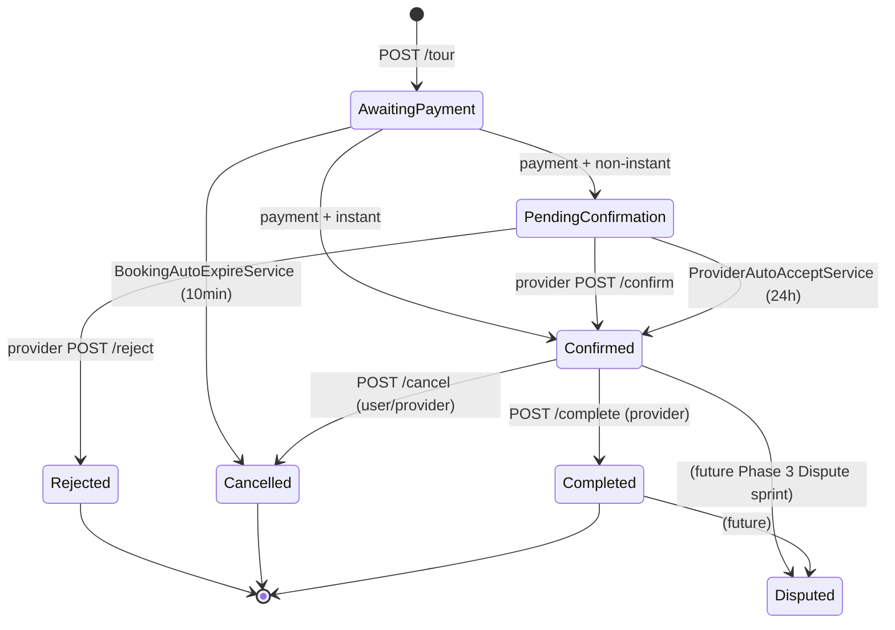

# Booking Module — Combined Sprint Task File

> **Phase 1 (Wave 5) sprint covering the Booking module.**
> **Sprint window:** Mon 2026-06-15 → Thu 2026-08-13 (8 weeks, 40 working days, 190 person-hours)
> **Combined from 13 separate files** in `Agents/tasks/Booking/` for single-file review.

---

## Table of Contents

- [00-README](#00-readme)
- [01-pre-work](#01-pre-work)
- [02-critical-rules](#02-critical-rules)
- [03-entities-matrix](#03-entities-matrix)
- [04-task-availability-slots](#04-task-availability-slots)
- [05-task-refund-policy-commission](#05-task-refund-policy-commission)
- [06-task-provider-documents](#06-task-provider-documents)
- [07-task-booking-engine](#07-task-booking-engine)
- [08-task-confirm-reject-cancel](#08-task-confirm-reject-cancel)
- [09-task-join-request](#09-task-join-request)
- [10-task-background-services](#10-task-background-services)
- [11-cross-cutting](#11-cross-cutting)
- [99-acceptance-gate](#99-acceptance-gate)

---

<a id="00-readme"></a>

## 00-README

> Source: `Booking/00-README.md`

# Booking Module — Wave 5 Sprint

> **Predecessor sprint:** [`../ContentBlogs-ContentSeo-team-tasks.md`](../ContentBlogs-ContentSeo-team-tasks.md) closes 2026-06-12
> **This sprint covers:** complete `Booking` bounded-context module — first half of Wave 5 (booking engine, availability, refund policies, provider documents)
> **Difficulty vs ContentTours:** ⚙️⚙️⚙️⚙️⚙️ (5/5) — the hardest sprint in the project. Optimistic concurrency, 5-step state machine, escrow handoff to Finance, 4 background services.
> **Endpoint count:** **22 HTTP endpoints**
> **Background services:** 4 hosted services
> **Working-day estimate:** **40 working days × 4 devs ≈ 190 person-hours**

---

## 0. Sprint Window & Hard Deadlines

Working week is **Sun → Thu** (5 days). All times AST (UTC+3).

| Milestone | Date | Time | Notes |
|---|---|---|---|
| Pre-work cut | Fri **2026-06-12** | 17:00 | Tech Lead branches `sprint/booking-prework` from `main` |
| Sprint kickoff | Sun **2026-06-14** | 09:00 | Architecture walkthrough (90 min, all devs mandatory) |
| Pre-work merge deadline | Tue **2026-06-16** | 17:00 | All PW-* items merged to `main` |
| Earliest task start | Wed **2026-06-17** | 09:00 | Feature work begins |
| Mid-sprint integration freeze | Sun **2026-07-19** | 17:00 | All BG services + state machine merged; only bug-fix PRs after this |
| Hard PR cutoff | Wed **2026-08-12** | 17:00 | No new feature PRs accepted |
| Hard merge-to-main cutoff | Thu **2026-08-13** | 17:00 | `v1.5.0-booking-complete` tag cut |
| Sprint retro + Finance kickoff | Fri **2026-08-14** | 11:00 | Retro 60 min, Finance kickoff 30 min |

Total: **8 calendar weeks (40 working days)**.

### 0.1 Daily Standup

Every Sun → Thu at **09:30 AST**. 15-minute hard cap. Each dev gives 3 sentences: yesterday / today / blockers. Two consecutive misses → escalate to Tech Lead. Skip standup only on public holidays or pre-arranged PTO.

---

## 1. Working Days & Person-Hour Budget

| Bucket | Value |
|---|---|
| Working days | 40 |
| Hours per day per dev | 6 (after standups + reviews + buffer) |
| Devs | 4 |
| **Total available hours** | **960** |
| Feature task hours | 540 (56%) |
| Code review hours | 120 (12%) |
| Ceremony hours (standups, retro, kickoff, demo) | 80 (8%) |
| Pre-work hours (Tech Lead) | 40 (4%) |
| Buffer / unplanned (bugs, doc updates, env issues) | 180 (19%) |

This sprint is intentionally over-budgeted on buffer (19%) because **the 5-step `POST /tour` engine carries the highest failure-mode risk in the entire project**. Concurrency bugs caught late explode.

---

## 2. Team Members & High-Level Allocation

| Name | Level | Tasks | Endpoints | BG Services | Est Hours | Hard Deadline |
|---|---|---|---|---|---|---|
| **Mohammad** (lead) | Intermediate | TASK 4 (Booking Engine) + TASK 5 (Confirm/Reject/Cancel) | 9 | 0 | 80 | 2026-08-12 |
| **Mahmoud** | Intermediate | TASK 1 (Availability Slots) + TASK 7 (BG Services) | 5 | 4 | 60 | 2026-08-12 |
| **Fadwa** | Beginner | TASK 2 (Refund Policy + Commission) + TASK 3 (Provider Documents) + TASK 6 (Join Request) | 8 | 0 | 50 | 2026-08-12 |
| **Tech Lead** | Senior | Pre-Work (PW-1..PW-8) + code review + integration test harness | 0 | 0 | 40 | 2026-06-16 (PW) / 2026-08-13 (review) |

---

## 3. Deliverable Manifest (table of contents)

| File | Section | Owner | Status |
|---|---|---|---|
| [`01-pre-work.md`](./01-pre-work.md) | Pre-Work PW-1..PW-8 (Tech Lead) | Tech Lead | Pending |
| [`02-critical-rules.md`](./02-critical-rules.md) | Booking-specific rules (additive to INDEX §4) | Tech Lead | Pending |
| [`03-entities-matrix.md`](./03-entities-matrix.md) | Entity ownership matrix for all 11 Booking entities | Tech Lead | Pending |
| [`04-task-availability-slots.md`](./04-task-availability-slots.md) | TASK 1 — AvailabilitySlot CRUD + bulk-recurring 90-day | Mahmoud | Pending |
| [`05-task-refund-policy-commission.md`](./05-task-refund-policy-commission.md) | TASK 2 — RefundPolicy CRUD + CommissionRule CRUD | Fadwa | Pending |
| [`06-task-provider-documents.md`](./06-task-provider-documents.md) | TASK 3 — Provider documents upload + expiry tracking | Fadwa | Pending |
| [`07-task-booking-engine.md`](./07-task-booking-engine.md) | TASK 4 — **The 5-step `POST /tour` booking engine** | Mohammad | Pending |
| [`08-task-confirm-reject-cancel.md`](./08-task-confirm-reject-cancel.md) | TASK 5 — Provider confirm/reject, user cancel-with-refund | Mohammad | Pending |
| [`09-task-join-request.md`](./09-task-join-request.md) | TASK 6 — Join-request workflow (request, approve, reject) | Fadwa | Pending |
| [`10-task-background-services.md`](./10-task-background-services.md) | TASK 7 — 4 background services (SlotLockCleanup, BookingAutoExpire, ProviderAutoAccept, DocumentExpiryCheck) | Mahmoud | Pending |
| [`11-cross-cutting.md`](./11-cross-cutting.md) | DI audit, permission seeder, outbox registry, migrations, build lock | Tech Lead | Pending |
| [`99-acceptance-gate.md`](./99-acceptance-gate.md) | Final acceptance gate sign-off checklist | Tech Lead | Pending |

---

## 4. Endpoint Count Verification

22 endpoints distributed across tasks:

| Task | Endpoints | Routes |
|---|---|---|
| TASK 1 (Availability Slots) | 5 | `GET /availability/{tourId}`, `GET /availability/{tourId}/{date}`, `POST /availability/slots`, `PUT /availability/slots/{id}`, `DELETE /availability/slots/{id}`, **`POST /availability/slots/bulk`** (recurring 90-day) |
| TASK 2 (Refund Policy + Commission) | 6 | `GET /refund-policies/{tourId}`, `POST /refund-policies`, `PUT /refund-policies/{id}`, `GET /commissions`, `POST /commissions`, `PUT /commissions/{id}`, `DELETE /commissions/{id}` |
| TASK 3 (Provider Documents) | 4 | `GET /provider/documents`, `POST /provider/documents`, `PUT /provider/documents/{id}`, `DELETE /provider/documents/{id}` |
| TASK 4 (Booking Engine) | 4 | `POST /tour` (5-step engine), `GET /{id}`, `GET /my-bookings`, `GET /admin/all` |
| TASK 5 (Confirm/Reject/Cancel) | 5 | `POST /{id}/confirm`, `POST /{id}/reject`, `POST /{id}/cancel`, `POST /{id}/complete`, `GET /provider/{pending,upcoming,history}` (3 routes counted as 1 endpoint group with query-param) |
| TASK 6 (Join Request) | 3 | `POST /join-request`, `POST /join-request/{id}/approve`, `POST /join-request/{id}/reject` |
| TASK 7 (BG Services) | 0 (background only) | n/a |
| **Total** | **22** | (counting `POST /availability/slots/bulk` as separate from CRUD pair makes 22; bulk is sufficiently distinct in implementation cost) |

---

## 5. Integration Events Emitted (consumed by downstream Finance / Messaging / Analytics)

Every event follows logical name convention `booking.{entity}.{verb}.v1` and is registered in `IntegrationEventTypeRegistry`.

| Event Name | Trigger | Payload (key fields) |
|---|---|---|
| `booking.tour-booking.created.v1` | `POST /tour` after Step 4 (booking row inserted with `AwaitingPayment`) | bookingId, tourId, userId, slotId, currency, totalAmount, participantCount, providerId |
| `booking.tour-booking.confirmed.v1` | `POST /payments/webhook` (Finance) flips booking AwaitingPayment→Confirmed instant; or provider confirm 24h non-instant | bookingId, confirmedAt, tourId, userId |
| `booking.tour-booking.cancelled.v1` | `POST /{id}/cancel` (user or provider initiated) | bookingId, cancelledBy (User/Provider/System), reason, refundAmount, refundCurrency |
| `booking.tour-booking.completed.v1` | `POST /{id}/complete` after tour date passes | bookingId, tourId, userId, providerId, completedAt |
| `booking.tour-booking.rejected.v1` | Provider `POST /{id}/reject` for non-instant booking within 24h window | bookingId, rejectionReason, providerId |
| `booking.slot-lock.expired.v1` | SlotLockCleanupService (5-min job) deletes expired lock | bookingId, slotId, lockExpiredAt |
| `booking.provider-document.expiring.v1` | DocumentExpiryCheckService (daily) detects doc <30 days from expiry | providerId, documentId, documentType, expiresAt |
| `booking.provider-document.expired.v1` | DocumentExpiryCheckService when ExpiresAt < Now | providerId, documentId, documentType |
| `booking.provider.suspended-doc-expired.v1` | DocumentExpiryCheckService 14-day grace exceeded → provider auto-suspended | providerId, expiredDocumentIds |
| `booking.join-request.approved.v1` | TASK 6 approve | joinRequestId, bookingId, additionalParticipantUserId |
| `booking.join-request.rejected.v1` | TASK 6 reject | joinRequestId, bookingId, reason |

---

## 6. Downstream Consumer Map (for testing acceptance gates)

| Event | Consumer Module | Handler | Expected Effect |
|---|---|---|---|
| `tour-booking.created` | Finance | `BookingCreatedInboxHandler` | Pre-creates `Payment` row (`PaymentStatus.Pending`) so webhook has FK target |
| `tour-booking.confirmed` | Messaging | `BookingConfirmedInboxHandler` | Notification `BookingConfirmed` to user + provider |
| `tour-booking.confirmed` | Analytics | `BookingConfirmedInboxHandler` | UserInteraction `BookingCompleted` + PopularityScore increment |
| `tour-booking.cancelled` | Finance | `BookingCancelledInboxHandler` | If refundAmount>0, initiate refund via `IPaymentGateway` |
| `tour-booking.cancelled` | Messaging | `BookingCancelledInboxHandler` | Notification `BookingCancelled` to opposite party |
| `tour-booking.completed` | Social | `BookingCompletedInboxHandler` | Allow review submission window opens (30-day) |
| `tour-booking.completed` | Finance | `BookingCompletedInboxHandler` | Mark booking eligible for next weekly payout batch |
| `provider-document.expiring` | Messaging | `DocumentExpiringInboxHandler` | Notification `DocumentExpiryWarning` to provider |
| `join-request.approved` | Finance | `JoinRequestApprovedInboxHandler` | Charge additional participant separately via gateway |

---

## 7. Reading Order

1. [`../Phase1-Phase2-Completion-INDEX.md`](../Phase1-Phase2-Completion-INDEX.md) §4 — universal critical rules.
2. This README.
3. [`01-pre-work.md`](./01-pre-work.md) — required reading before any task starts.
4. [`02-critical-rules.md`](./02-critical-rules.md) — module-specific delta.
5. [`03-entities-matrix.md`](./03-entities-matrix.md) — to find which entities you touch.
6. Your assigned `0N-task-*.md` file(s).
7. [`99-acceptance-gate.md`](./99-acceptance-gate.md) — what "done" looks like.

---

## 8. Out-of-Scope (Backlog for Future Sprints)

- **Package booking** (`PackageBooking` entity exists but is Phase 3 / Wave 5 second-half — deferred to a future sprint after `Finance/Subscriptions` lands).
- **`Reservation` entity** (non-tour business reservation flow — defer to Wave 5 second-half with PackageBooking).
- **TourGuide assignment & language/specialization junctions** (entities exist; CRUD endpoints belong to Wave 6 ContentTours follow-up).
- Discount integration in `POST /tour` Step 3 — Finance discount engine is Phase 4; for now Step 3 uses pricing tiers + loyalty points only. Discount calculation injected as `IDiscountEvaluator` stub returning `DiscountResult.None` until Finance Wave 5 sprint #2.

---

<a id="01-pre-work"></a>

## 01-pre-work

> Source: `Booking/01-pre-work.md`

# Booking — Pre-Work (PW-1..PW-8)

> **Owner:** Tech Lead (sole driver)
> **Branch:** `sprint/booking-prework` cut from `main` on 2026-06-12 17:00
> **Hard merge deadline:** Tue **2026-06-16 17:00** — feature work cannot start before this lands

Pre-work removes structural blockers that would compound across the sprint. Each item has **Current bug** → **Required fix** → **Acceptance gate**.

---

## PW-1 — Audit `BookingUnitOfWork` for domain-event dispatch (CRITICAL)

### Current bug

`Booking.Infrastructure/Persistence/BookingUnitOfWork.cs` either does not yet exist or calls `_context.SaveChangesAsync(ct)` directly. This is the same bug ContentBlogs/ContentSeo hit in W4 PW-1 and ContentTours hit two sprints ago.

If domain-event dispatch is bypassed, every domain event raised by `TourBooking`, `SlotLock`, `AvailabilitySlot`, `ProviderDocument` is silently dropped. The booking engine WILL break.

### Required fix

`BookingUnitOfWork` must delegate to `IUnitOfWork<BookingDbContext>` from `YallaJo.SharedKernel.Infrastructure`:

```csharp
internal sealed class BookingUnitOfWork(
    BookingDbContext context,
    IUnitOfWork<BookingDbContext> innerUnitOfWork) : IBookingUnitOfWork
{
    public Task<int> SaveChangesAsync(CancellationToken ct = default)
        => innerUnitOfWork.SaveChangesAsync(ct);

    // expose AddRange/Update/Remove via context if needed (or write per-repo)
}
```

Register in `BookingInfrastructureRegistration.cs`:
```csharp
services.AddScoped<IUnitOfWork<BookingDbContext>, UnitOfWork<BookingDbContext>>();
services.AddScoped<IBookingUnitOfWork, BookingUnitOfWork>();
```

### Acceptance gate

1. New unit test file `tests/Booking.Tests.Unit/Persistence/BookingUnitOfWorkDispatchesEventsTests.cs` (xunit 2.9.3 + NSubstitute 5.3.0 + FluentAssertions 7.0.0 + EF InMemory 9.0.15).
2. Test 1: `SaveChangesAsync_RaisesAggregateRoot_DispatchesAllDomainEventsViaIPublisher`.
3. Test 2: `SaveChangesAsync_NoAggregateChanges_DoesNotInvokePublisher`.
4. Both tests green; CI badge on `sprint/booking-prework`.

---

## PW-2 — Add `IAggregateRoot` markers + verify base classes

### Current state

Booking entities exist but their `IAggregateRoot` markers may be missing. Without them, `EfRepository<T>` cannot be used and domain events are not dispatched (UoW scans only aggregates — Gotcha #1 + #6 + #27 from agent-context.md §9.1).

### Required fix

Audit and apply in `Booking.Domain/Entities/`:

| Entity | Required Base | IAggregateRoot? | Notes |
|---|---|---|---|
| `TourBooking` | `AuditableEntity` | ✅ Yes | The booking aggregate root |
| `AvailabilitySlot` | `AuditableEntity` | ✅ Yes | Stand-alone aggregate (owned by provider, not by tour) |
| `RefundPolicy` | `AuditableEntity` | ✅ Yes | Stand-alone aggregate (tour-scoped lookup) |
| `JoinRequest` | `AuditableEntity` | ✅ Yes | Stand-alone aggregate (lifecycle independent of parent booking after creation) |
| `ProviderDocument` | `AuditableEntity` | ✅ Yes | Stand-alone aggregate (DocumentExpiryCheckService scans this) |
| `SlotLock` | `BaseEntity` (immutable lock row) | ❌ No | Junction-like, 10-min TTL, no business invariants beyond "delete when expired" |
| `Reservation` | `AuditableEntity` | (Out of scope) | Defer to Wave 5 second-half (see README §8) |
| `PackageBooking` | `AuditableEntity` | (Out of scope) | Defer |
| `TourGuide` | `AuditableEntity` | (Out of scope) | Defer |
| `TourGuideLanguage` | `BaseEntity` (junction) | ❌ No | Defer |
| `TourGuideSpecialization` | `BaseEntity` (junction) | ❌ No | Defer |

Migration name: `BookingAddAggregateRootAndAuditMembers`.

If any in-scope entity is currently on `BaseEntity` only, upgrade to `AuditableEntity` (adds `CreatedBy`, `UpdatedBy`, `IsDeleted`, `DeletedAt`, `RowVersion` columns).

### Acceptance gate

1. `dotnet build YallaJo.sln` green.
2. Migration `BookingAddAggregateRootAndAuditMembers` exists in `Booking.Infrastructure/Migrations/`.
3. EF `Update-Database` against the dev SQL Server succeeds without conflicts.
4. Reflection test `tests/Booking.Tests.Unit/AggregateRootMarkersTest.cs` asserts: `TourBooking`, `AvailabilitySlot`, `RefundPolicy`, `JoinRequest`, `ProviderDocument` all implement `IAggregateRoot`.

---

## PW-3 — Seed 14 domain event records (stubs, body comes later)

### Required fix

Create `Booking.Domain/Events/` (new folder) with one record per event below. Each is a `public sealed record XDomainEvent(...) : IDomainEvent;` declaration only — handler implementation comes in feature tasks.

| # | File | Trigger source (feature task) |
|---|---|---|
| 1 | `TourBookingCreatedDomainEvent.cs` | TASK 4 Step 4 |
| 2 | `TourBookingConfirmedDomainEvent.cs` | TASK 5 (provider confirm OR Finance webhook flips to Confirmed) |
| 3 | `TourBookingCancelledDomainEvent.cs` | TASK 5 cancel |
| 4 | `TourBookingCompletedDomainEvent.cs` | TASK 5 complete |
| 5 | `TourBookingRejectedDomainEvent.cs` | TASK 5 reject |
| 6 | `TourBookingPaymentExpiredDomainEvent.cs` | TASK 7 BookingAutoExpireService |
| 7 | `SlotLockCreatedDomainEvent.cs` | TASK 4 Step 2 |
| 8 | `SlotLockReleasedDomainEvent.cs` | TASK 4 step rollback OR SlotLockCleanupService |
| 9 | `AvailabilitySlotCapacityChangedDomainEvent.cs` | TASK 1 PUT slot, TASK 4 Step 2 decrement |
| 10 | `JoinRequestCreatedDomainEvent.cs` | TASK 6 create |
| 11 | `JoinRequestApprovedDomainEvent.cs` | TASK 6 approve |
| 12 | `JoinRequestRejectedDomainEvent.cs` | TASK 6 reject |
| 13 | `ProviderDocumentExpiringDomainEvent.cs` | TASK 7 DocumentExpiryCheckService |
| 14 | `ProviderDocumentExpiredDomainEvent.cs` | TASK 7 DocumentExpiryCheckService |

### Acceptance gate

`dotnet build YallaJo.Booking.Domain` green with all 14 records compiled. Empty test stub `tests/Booking.Tests.Unit/Events/DomainEventsCompileTest.cs` instantiates each one with sample data to catch param signature drift.

---

## PW-4 — Seed 12 integration event records in `Booking.Contracts`

### Required fix

Create `Booking.Contracts/IntegrationEvents/` (new folder) with one record per logical event. Each follows pattern:

```csharp
public sealed record TourBookingCreatedIntegrationEvent(
    Guid BookingId,
    Guid TourId,
    Guid UserId,
    Guid SlotId,
    string Currency,
    decimal TotalAmount,
    int ParticipantCount,
    Guid ProviderId,
    DateTime OccurredAt) : IIntegrationEvent;
```

Mirror the master README §5 table 1:1. Register every record in `IntegrationEventTypeRegistry` using logical name `booking.{entity-kebab}.{verb}.v1`.

### Acceptance gate

1. `IntegrationEventTypeRegistry.Get("booking.tour-booking.created.v1")` returns `typeof(TourBookingCreatedIntegrationEvent)`.
2. Reverse-parity test: every `IIntegrationEvent` record in `Booking.Contracts` has a registry entry (drift-proof).
3. New test file `tests/Booking.Tests.Unit/IntegrationEventRegistryParityTest.cs`.

---

## PW-5 — Seed 8 repository interfaces (compile-only stubs)

### Required fix

Create the following Application-layer interfaces. Implementations come in feature tasks; PW only seeds signatures so command/query handlers can be drafted in parallel.

| Interface (in `Booking.Application/Interfaces/`) | Implementation (in `Booking.Infrastructure/Repositories/`) |
|---|---|
| `ITourBookingRepository` (extends `IReadRepository<TourBooking,Guid>`, `IWriteRepository<TourBooking,Guid>`) | `TourBookingRepository : EfRepository<TourBooking>` |
| `IAvailabilitySlotRepository` | `AvailabilitySlotRepository : EfRepository<AvailabilitySlot>` |
| `IRefundPolicyRepository` | `RefundPolicyRepository : EfRepository<RefundPolicy>` |
| `IJoinRequestRepository` | `JoinRequestRepository : EfRepository<JoinRequest>` |
| `IProviderDocumentRepository` | `ProviderDocumentRepository : EfRepository<ProviderDocument>` |
| `ICommissionRuleRepository` | `CommissionRuleRepository : EfRepository<CommissionRule>` — BUT `CommissionRule` lives in `Finance.Domain`; Booking only needs a read-only wrapper. **Drop this — Booking will inject `ICommissionLookupService` from Finance.Contracts instead** (PW-6). |
| `ISlotLockRepository` (non-aggregate: `IReadRepository + IWriteRepository`) | `SlotLockRepository : EfEntityRepository<SlotLock, Guid>` |
| `IBookingOutboxWriter` | `BookingOutboxWriter` — write `OutboxMessage` rows for non-aggregate handlers per Gotcha #25 |

Custom finder methods to add:

- `ITourBookingRepository.GetByReferenceAsync(string reference, CancellationToken ct)` → finds by `YJ-YYYYMMDD-XXXXXX`.
- `ITourBookingRepository.GetActiveByUserAsync(Guid userId, CancellationToken ct)` → for "max 3 concurrent pending" rule.
- `ITourBookingRepository.GetAwaitingPaymentOlderThanAsync(TimeSpan age, CancellationToken ct)` → for BookingAutoExpireService.
- `IAvailabilitySlotRepository.GetByTourAndDateAsync(Guid tourId, DateOnly date, CancellationToken ct)`.
- `ISlotLockRepository.GetExpiredAsync(DateTime cutoffUtc, CancellationToken ct)`.
- `IProviderDocumentRepository.GetExpiringWithinAsync(TimeSpan window, CancellationToken ct)`.

### Acceptance gate

`dotnet build YallaJo.Booking.Application` and `YallaJo.Booking.Infrastructure` green. Implementation methods may throw `NotImplementedException` for now; feature tasks fill them.

---

## PW-6 — Cross-module Finance contracts: `ICommissionLookupService` + `IPaymentGateway` stub

### Why

Booking's TASK 4 Step 3 calculates commission **per-booking** using subscription tier. Booking module must NOT reference `Finance.Domain` (Gotcha: cross-module references only via Contracts). Finance sprint will provide the implementation; Booking PW seeds the interface stub.

### Required fix

In `Finance.Contracts/Services/` (NEW folder):

```csharp
public interface ICommissionLookupService
{
    /// Calculate commission for a single booking given provider subscription tier.
    /// Returns CommissionResult { Rate, Amount, Currency, TierName }.
    Task<CommissionResult> CalculateAsync(
        Guid providerId,
        decimal bookingAmountAfterDiscount,
        string currency,
        CancellationToken ct);
}

public sealed record CommissionResult(
    decimal Rate,         // e.g., 0.15 for 15%
    decimal Amount,       // bookingAmountAfterDiscount * Rate
    string Currency,
    string TierName);     // "Free" / "Basic" / "Premium" / "Enterprise"
```

Stub impl in `Finance.Infrastructure` returning `new CommissionResult(0.15m, amount * 0.15m, currency, "Free")` for now. Real tiered logic comes in Finance sprint.

In `Finance.Contracts/Services/IDiscountEvaluator.cs`:

```csharp
public interface IDiscountEvaluator
{
    Task<DiscountResult> EvaluateAsync(
        Guid tourId,
        Guid userId,
        decimal subtotal,
        string currency,
        string? promoCode,
        CancellationToken ct);
}

public sealed record DiscountResult(
    decimal AppliedAmount,        // 0 if none
    string? PromoCodeUsed,
    IReadOnlyList<DiscountAttribution> Attributions)
{
    public static readonly DiscountResult None = new(0m, null, []);
}

public sealed record DiscountAttribution(Guid DiscountId, decimal Amount, string Type);
```

Stub impl returns `DiscountResult.None`.

### Acceptance gate

`Booking.Application.DependencyInjection` registers stub via `services.AddScoped<ICommissionLookupService, FinanceContractsCommissionStub>()`. Booking integration test `EngineCalculatesCommissionViaContractInterfaceTest` passes.

---

## PW-7 — Permission catalog `BookingFeatures` + `BookingPermissionCatalog`

### Required fix

`Booking.Contracts/Authorization/BookingFeatures.cs`:

```csharp
public static class BookingFeatures
{
    public const string AvailabilitySlot = nameof(AvailabilitySlot);
    public const string RefundPolicy = nameof(RefundPolicy);
    public const string Commission = nameof(Commission);
    public const string ProviderDocument = nameof(ProviderDocument);
    public const string TourBooking = nameof(TourBooking);
    public const string JoinRequest = nameof(JoinRequest);
    public const string ProviderBookingDashboard = nameof(ProviderBookingDashboard);
    public const string AdminBookingDashboard = nameof(AdminBookingDashboard);
}
```

`Booking.Contracts/Authorization/BookingPermissionCatalog.cs` — register the following 26 permissions (each `(feature, action)` pair):

| Feature | Actions |
|---|---|
| AvailabilitySlot | View, Create, Edit, Delete |
| RefundPolicy | View, Create, Edit, Delete |
| Commission | View, Create, Edit, Delete |
| ProviderDocument | View, Create, Edit, Delete |
| TourBooking | View, Create, Cancel, Complete, Confirm, Reject |
| JoinRequest | Create, Approve, Reject |
| ProviderBookingDashboard | View |
| AdminBookingDashboard | View |

Register in `BookingApplicationRegistration.cs`:
```csharp
services.AddSingleton<IPermissionCatalog, BookingPermissionCatalog>();
```

### Acceptance gate

On `dotnet run --project YallaJo.Api` startup, Serilog logs:
```
[INFO] PermissionSeeder discovered 7 catalogs: Auth, Security, Accounts, ContentCore, ContentPlaces, ContentTours, Booking
[INFO] PermissionSeeder inserted/verified 26 Booking permissions in security.Permissions
```

---

## PW-8 — Test project scaffolds

### Required fix

Create two test projects:

```
tests/
  Booking.Tests.Unit/
    Booking.Tests.Unit.csproj
    (xunit 2.9.3, NSubstitute 5.3.0, FluentAssertions 7.0.0, EF InMemory 9.0.15)
  Booking.IntegrationTests/
    Booking.IntegrationTests.csproj
    (Microsoft.AspNetCore.Mvc.Testing 9.0.15 + WebApplicationFactory<Program>)
```

Add `<InternalsVisibleTo Include="Booking.Tests.Unit" />` and `<InternalsVisibleTo Include="Booking.IntegrationTests" />` to:
- `Booking.Application/Booking.Application.csproj`
- `Booking.Infrastructure/Booking.Infrastructure.csproj`

Seed one round-trip sanity test in each:
- Unit: `BookingUnitOfWorkDispatchesEventsTests.cs` (covered by PW-1 acceptance).
- Integration: `EventDispatchSanityTests.cs` — creates a `TourBooking` aggregate via `ServiceCollection.BuildServiceProvider()` + `AddBookingInfrastructure()` with InMemory EF swap, calls `SaveChangesAsync`, asserts MediatR `IPublisher.Publish` was invoked (substitute).

Note: use `ServiceCollection.BuildServiceProvider()` swap pattern, NOT `WebApplicationFactory<Program>` yet — full WAF tests come in feature tasks.

### Acceptance gate

`dotnet test tests/Booking.Tests.Unit` and `dotnet test tests/Booking.IntegrationTests` both green with at least 1 test each.

---

## Pre-Work Sign-Off

| PW | Description | Owner | Done? | Date | Reviewer |
|---|---|---|---|---|---|
| PW-1 | BookingUnitOfWork delegates to IUnitOfWork<TContext> | Tech Lead | ☐ | | |
| PW-2 | IAggregateRoot markers + AuditableEntity upgrades | Tech Lead | ☐ | | |
| PW-3 | 14 domain event records seeded | Tech Lead | ☐ | | |
| PW-4 | 12 integration events seeded + registry registration | Tech Lead | ☐ | | |
| PW-5 | 8 repository interfaces + stub impls | Tech Lead | ☐ | | |
| PW-6 | ICommissionLookupService + IDiscountEvaluator stubs | Tech Lead | ☐ | | |
| PW-7 | BookingFeatures + BookingPermissionCatalog (26 perms) | Tech Lead | ☐ | | |
| PW-8 | Test projects scaffolded | Tech Lead | ☐ | | |

All 8 boxes ticked + PR `sprint/booking-prework → main` merged by **2026-06-16 17:00**.

---

<a id="02-critical-rules"></a>

## 02-critical-rules

> Source: `Booking/02-critical-rules.md`

# Booking Sprint — Critical Rules (Additive to Master INDEX §4)

> These rules are **additive** to the 16 Critical Rules from `Phase1-Phase2-Completion-INDEX.md` §4. Where this file says "see INDEX §4 R{n}", DO NOT restate. PR reviewer rejects any code that violates either layer.

---

## B-R1 — Money & Currency (HARD)

- **Currency enum is `string` of length 3** (ISO 4217), valid set = `{"JOD", "USD", "EUR"}`. Anything else → `Result.Failure<T>(new Error("TourBooking.UnsupportedCurrency", "..."), Outcome.Validation)`.
- All monetary fields are `decimal` with EF mapping `.HasPrecision(19, 4)`. **NEVER `double` or `float`**.
- **The booking's currency is the tour's currency, locked at Step 1 of POST /tour.** Never re-evaluated. Refunds/Payouts/Commissions all inherit it.
- All cross-currency math is **forbidden in this sprint**. If a future sprint adds FX conversion, it goes through `IExchangeRateService` (not yet defined).

## B-R2 — Idempotency & Concurrency on Slot Capacity (HARDEST)

- `AvailabilitySlot.RowVersion` (rowversion) MUST be set on every aggregate. The repository's `UpdateAsync` MUST attach the entity in `Modified` state and let EF compare RowVersion. On `DbUpdateConcurrencyException`:
  1. Catch it ONLY in Infrastructure (per INDEX §4 R12).
  2. Translate to `Result.Failure<T>(new Error("AvailabilitySlot.CapacityConflict", "Slot was modified by another booking"), Outcome.Conflict)`.
  3. Endpoint returns 409.
- **POST /tour Step 2** decrements `AvailabilitySlot.AvailableCount` and creates the `SlotLock` row in the **SAME `SaveChangesAsync`**. If either fails, both roll back.
- `SlotLock` has its own `UNIQUE INDEX (UserId, AvailabilitySlotId) WHERE IsActive = 1` — user cannot lock same slot twice. If second attempt arrives, return existing lock idempotently.

## B-R3 — Booking Reference Format (HARD)

- Format: `YJ-YYYYMMDD-XXXXXX` where `XXXXXX` is 6 chars from `[A-Z0-9]` excluding `O, 0, I, 1` (visual-confusion-safe alphabet, 32-char base).
- Generated by `IBookingReferenceGenerator` (Application interface, Infrastructure impl) using `RandomNumberGenerator.GetBytes` + retry-on-collision up to 5 times before throwing.
- Reference column has `UNIQUE INDEX`.
- Check-in CONFIRMATION CODE = the reference itself in PDF 2's wording is `YJ-YYYYMM-XXXX` but PDF 1's wording is `YJ-{YYYYMMDD}-{random6}` — **we follow PDF 1 (more entropy, matches B-R3 above)**. Reference is also displayed at check-in.

## B-R4 — Lead Time + Anti-Double-Booking (HARD)

- **MIN LEAD TIME = 2 hours before tour start.** Computed against `AvailabilitySlot.StartTime` in the tour's timezone (`Tour.Timezone` from ContentTours). For this sprint, `Tour.Timezone` is assumed UTC-only; future sprint introduces TZ conversion.
- User cannot book the **same tour on the same date** twice (any non-cancelled booking blocks). Repo method: `ITourBookingRepository.HasActiveBookingForTourOnDateAsync(userId, tourId, date)`.
- User cannot exceed **3 concurrent `AwaitingPayment` bookings** (any tour). Repo: `GetActiveByUserAsync(userId)` filtered by status.

## B-R5 — Refund Calculation (HARD)

- **PROVIDER-INITIATED CANCEL → ALWAYS 100% REFUND** regardless of policy. Override flag passes through `BookingCancellationContext.ProviderInitiated`.
- **USER-INITIATED CANCEL → walk RefundPolicy tiers** sorted by `HoursBeforeTour` DESC. The first tier where `(slot.StartTime - now).TotalHours >= tier.HoursBeforeTour` wins. Default if no tiers configured: 100% if ≥24h before, else 0%.
- **FORCE MAJEURE (admin-issued)** uses a special command `AdminForceFullRefundCommand` — bypasses policy, requires `AdminReason` (max 500 chars). Logged to audit.
- Refund amount = `BookingTotal × tier.RefundPercentage / 100`. Rounded to 2 decimals (banker's rounding via `Math.Round(x, 2, MidpointRounding.ToEven)`).
- Booking refunds DO NOT release the slot — they only mark booking `Cancelled`. Slot is released by the cancellation domain event handler **only if** booking was holding capacity (Confirmed or AwaitingPayment).

## B-R6 — Provider Confirmation Window (HARD)

- Tour has `IsInstantBooking: bool`. If `true`, booking goes `AwaitingPayment → Confirmed` on payment webhook. If `false`, booking goes `AwaitingPayment → PendingConfirmation` on payment webhook (Finance webhook handler triggers).
- Provider has **24 hours** to confirm/reject after entering `PendingConfirmation`. `ProviderAutoAcceptService` (BG, runs every 15 min) auto-confirms any `PendingConfirmation` booking older than 24h.
- Auto-confirm emits the same `tour-booking.confirmed.v1` integration event as manual confirm. Notification handler appends "(auto-confirmed)" suffix to the user notification body.

## B-R7 — Outbox Contract for Booking (HARD)

- Every state transition that crosses module boundaries MUST raise a **domain event** that has a corresponding **integration event** in `Booking.Contracts/IntegrationEvents/`.
- INDEX §4 R15 governs the mechanic. Booking-specific addition: **never** emit `tour-booking.confirmed.v1` for a booking that has `IsInstantBooking=true` AND was paid in-flight — emit it ONCE when transitioning into `Confirmed` from either path.
- Idempotency: each booking has a single `tour-booking.confirmed.v1` event in its lifetime. Domain layer must guard via state check (INDEX §4 R11) — calling `booking.Confirm()` on an already-`Confirmed` booking returns `Result.Failure` (does NOT raise the event again).

## B-R8 — Lock Lifecycle & Cleanup (HARD)

- `SlotLock` rows are NEVER deleted by application code. They have `ExpiresAt = createdAt + 10min` and an `IsActive` flag.
- `SlotLockCleanupService` (BG, every 5 min) sets `IsActive = false` on all `WHERE IsActive=1 AND ExpiresAt < UtcNow`, and raises `SlotLockReleasedDomainEvent` for each. The event handler `AvailabilitySlot.RestoreCapacityHandler` increments `AvailableCount` ONLY IF the booking has not since been paid.
- The 5-min vs 10-min spread means a slot can be released anywhere between 10 and 15 minutes after lock creation. **Do not document tighter SLA than 15 minutes anywhere in the OpenAPI.**

## B-R9 — Document Expiry Suspension (HARD)

- `DocumentExpiryCheckService` runs daily at 01:00 UTC. Logic:
  1. Find `ProviderDocument WHERE Status=Approved AND ExpiresAt BETWEEN UtcNow AND UtcNow+30d AND ExpiryWarningSent=false` → raise `ProviderDocumentExpiringDomainEvent` per doc, set `ExpiryWarningSent=true`.
  2. Find `ProviderDocument WHERE Status=Approved AND ExpiresAt < UtcNow AND ExpiryProcessed=false` → raise `ProviderDocumentExpiredDomainEvent`, set `ExpiryProcessed=true`.
- For documents marked CRITICAL (`IsCritical=true` on the document type), the expired event handler also raises `ProviderSuspendedDocumentExpiredDomainEvent` (separate event so Messaging/Search can react differently).
- Suspension does NOT cancel confirmed bookings (per PDF 2 §1.6). It only:
  - Sets `Provider.Status = Suspended` (via Accounts integration event).
  - Hides tours from search (ContentTours inbox handler flips `Tour.IsSearchable=false`).
  - Blocks new bookings (Booking handler appends provider to a "denylist" table or just checks `Provider.Status` on POST /tour — we'll go with the latter; cheaper).

## B-R10 — Pagination & Cursor (HARD)

- GET endpoints returning lists use **cursor pagination** (not offset). Cursor is opaque base64-encoded `{Id, CreatedAt}` tuple, ordered DESC by CreatedAt then ASC by Id (tie-break).
- Page size = query param `pageSize` clamped to `[1, 50]`, default 20.
- Response envelope: `{ items: [...], nextCursor: "..." | null, totalCount?: number }`. `totalCount` only returned on `?countTotal=true` (one extra COUNT query — opt-in to avoid N+1).
- This applies to: `GET /my-bookings`, `GET /admin/all`, `GET /provider/{history,pending,upcoming}`, `GET /availability/{tourId}` (paginates by date), `GET /admin/providers`.

## B-R11 — Authorization Matrix (HARD)

| Endpoint | Permission | Self-Ownership Check |
|---|---|---|
| `POST /tour` | `BookingFeatures.TourBooking + AppAction.Create` | (none — anonymous-authenticated user) |
| `GET /my-bookings` | `BookingFeatures.TourBooking + AppAction.Read` | filters by `currentUser.UserId` (no IDOR) |
| `GET /{id}` | `BookingFeatures.TourBooking + AppAction.Read` | guard: `booking.UserId == currentUser.UserId` OR `IsProviderOfTour` OR has Admin perm |
| `GET /admin/all` | `BookingFeatures.AdminBookingDashboard + AppAction.Read` | none |
| `POST /{id}/cancel` | `BookingFeatures.TourBooking + AppAction.Cancel` (custom action) | guard: `booking.UserId == currentUser.UserId` OR provider |
| `POST /{id}/confirm` | `BookingFeatures.TourBooking + AppAction.Approve` | provider-only via tour ownership |
| `POST /{id}/reject` | `BookingFeatures.TourBooking + AppAction.Reject` | provider-only |
| `POST /{id}/complete` | `BookingFeatures.TourBooking + AppAction.Update` | provider-only |
| `POST /join-request` | `BookingFeatures.JoinRequest + AppAction.Create` | user-only |
| `POST /join-request/{id}/{approve,reject}` | `BookingFeatures.JoinRequest + AppAction.Approve/Reject` | booking owner |
| `POST /availability/slots` (single) | `BookingFeatures.AvailabilitySlot + AppAction.Create` | provider of tour |
| `POST /availability/slots/bulk` | `BookingFeatures.AvailabilitySlot + AppAction.Create` | provider of tour |
| `DELETE /availability/slots/{id}` | `BookingFeatures.AvailabilitySlot + AppAction.Delete` | provider |
| `GET /availability/{tourId}` | (AllowAnonymous) | — |
| `GET /availability/{tourId}/{date}` | (AllowAnonymous) | — |
| `POST /refund-policies` | `BookingFeatures.RefundPolicy + AppAction.Create` | provider of tour |
| `PUT /refund-policies/{id}` | `BookingFeatures.RefundPolicy + AppAction.Update` | provider |
| `GET /refund-policies/{tourId}` | (AllowAnonymous) | — |
| `POST /commissions` | `BookingFeatures.Commission + AppAction.Create` | admin only |
| `PUT /commissions/{id}` | `BookingFeatures.Commission + AppAction.Update` | admin |
| `DELETE /commissions/{id}` | `BookingFeatures.Commission + AppAction.Delete` | admin |
| `GET /commissions` | `BookingFeatures.Commission + AppAction.Read` | admin |
| `POST /provider/documents` | `BookingFeatures.ProviderDocument + AppAction.Create` | provider self |
| `PUT /provider/documents/{id}` | `BookingFeatures.ProviderDocument + AppAction.Update` | provider self |

> **AppAction.Cancel and AppAction.Reject** must exist in the `AppAction` enum from `SharedKernel.Application/Security/`. If they do not, add them in PW (no migration needed — enum). If `AppAction.Reject` collides with the discount sprint's planned addition, defer to discount sprint and re-use here.

## B-R12 — Validation Rules Summary (HARD)

- `ParticipantCount` is `int >= 1 AND <= AvailabilitySlot.AvailableCount`. Validator runs BEFORE Step 2 lock; final enforcement is the RowVersion concurrency check in Step 2.
- `Cancel reason` (when user cancels) is OPTIONAL but if provided must be ≤500 chars. **Provider cancel reason is MANDATORY** (≥10 chars, ≤500).
- `Provider reject reason` MANDATORY (≥10 chars, ≤500).
- All `string` fields trimmed on validator entry. Empty/whitespace after trim → validation error.

## B-R13 — Error Code Registry (Booking module)

| Code | Outcome | Where |
|---|---|---|
| `TourBooking.NotFound` | NotFound | GET /{id}, cancel, confirm, reject, complete |
| `TourBooking.UnsupportedCurrency` | Validation | POST /tour |
| `TourBooking.InvalidState` | Validation | confirm/cancel/reject on wrong status |
| `TourBooking.TooEarly` | Validation | POST /tour (lead time) |
| `TourBooking.DuplicateForDate` | Conflict | POST /tour |
| `TourBooking.ConcurrentLimit` | Conflict | POST /tour (3-max) |
| `TourBooking.OwnerMismatch` | Forbidden | GET /{id} (IDOR), cancel by non-owner |
| `AvailabilitySlot.NotFound` | NotFound | various |
| `AvailabilitySlot.CapacityExceeded` | Conflict | POST /tour Step 2 |
| `AvailabilitySlot.CapacityConflict` | Conflict | RowVersion collision |
| `AvailabilitySlot.Overlap` | Conflict | POST /availability/slots |
| `AvailabilitySlot.HasBookings` | Conflict | DELETE /availability/slots/{id} |
| `SlotLock.AlreadyExists` | (returned as idempotent 200) | Step 2 |
| `RefundPolicy.OutOfPlatformBounds` | Validation | POST /refund-policies (≥48h must be ≥50% etc.) |
| `RefundPolicy.NotFound` | NotFound | PUT |
| `Commission.OverlapTier` | Conflict | POST /commissions (revenue tiers cannot overlap) |
| `Commission.NotFound` | NotFound | PUT/DELETE |
| `ProviderDocument.UnsupportedType` | Validation | POST /provider/documents |
| `ProviderDocument.NotFound` | NotFound | PUT |
| `ProviderDocument.FileTooLarge` | Validation | upload >10MB |
| `JoinRequest.NotFound` | NotFound | approve/reject |
| `JoinRequest.AlreadyResolved` | Conflict | approve/reject on closed request |
| `JoinRequest.CapacityFull` | Conflict | approve on no-capacity slot |
| `Booking.ProviderSuspended` | Conflict | POST /tour against suspended provider |

> Endpoint MUST map `Outcome` → HTTP status via `result.ToApiResult()` — no manual `Results.X(...)`.

---

**Cross-references:**
- INDEX §4 — 16 Critical Rules (authorization, ICurrentUser, Result, caching, outbox)
- `Agents/agent-context.md` §0.3 — five non-negotiable rules
- `Agents/guide.md` — entity anatomy + CQRS templates
- `Agents/error-log.md` — past mistakes (cite ERR-### when applicable)

---

<a id="03-entities-matrix"></a>

## 03-entities-matrix

> Source: `Booking/03-entities-matrix.md`

# Booking Sprint — Entity Ownership Matrix

> Read alongside `01-pre-work.md` (which decided IAggregateRoot markers + AuditableEntity upgrades). PR reviewer rejects any aggregate/event combination not listed here.

---

## 1. Domain entities owned by Booking module

| Entity (file) | Base class after PW-2 | Aggregate? | Junction? | Domain events raised | Owner task | Notes |
|---|---|---|---|---|---|---|
| `TourBooking.cs` | `AuditableEntity, IAggregateRoot` | ✅ Yes | — | TourBookingCreated/Confirmed/Cancelled/Completed/Rejected/PaymentExpired | TASK 4 + 5 | Has 6 state transitions; reference YJ-YYYYMMDD-XXXXXX |
| `AvailabilitySlot.cs` | `AuditableEntity, IAggregateRoot` | ✅ Yes | — | AvailabilitySlotCapacityChanged | TASK 1 + 4 + 7 | RowVersion mandatory; computed `AvailableCount = MaxCapacity - BookedCount - LockedCount` is stored AND maintained |
| `SlotLock.cs` | `BaseEntity` (stays) | ❌ No | ✅ Yes (junction-like) | SlotLockCreated, SlotLockReleased | TASK 4 + 7 | TTL=10min; cleanup BG resets `IsActive=false`; unique index `(UserId, AvailabilitySlotId) WHERE IsActive=1` |
| `RefundPolicy.cs` | `AuditableEntity, IAggregateRoot` | ✅ Yes | — | (none) | TASK 2 | One per tour; child `RefundPolicyTier` value objects stored as JSON column |
| `CommissionRule.cs` | (moves to Finance) | — | — | — | — | **REMOVED FROM BOOKING DOMAIN.** Finance owns it. Booking calls `ICommissionLookupService.GetCommissionForProviderAsync(providerId, gross)` |
| `JoinRequest.cs` | `AuditableEntity, IAggregateRoot` | ✅ Yes | — | JoinRequestCreated/Approved/Rejected | TASK 6 | One per (booking, requesterUserId) — unique index |
| `ProviderDocument.cs` | `AuditableEntity, IAggregateRoot` | ✅ Yes | — | ProviderDocumentExpiring/Expired | TASK 3 + 7 | `DocumentType` enum has `IsCritical` extension method (see `DocumentTypeExtensions.cs` to create in TASK 3) |
| `Reservation.cs` | (stays stub) | — | — | — | **OUT OF SCOPE** | Wave 5 second sprint (business reservations, not tour bookings) |
| `PackageBooking.cs` | (stays stub) | — | — | — | **OUT OF SCOPE** | Phase 3 packaging sprint |
| `TourGuide.cs` | (stays stub) | — | — | — | **OUT OF SCOPE** | Wave 3 ContentTours TourGuide sprint owns it (already partial); Booking only references via `Tour.AssignedGuideId` (nullable Guid stamp) |
| `TourGuideLanguage.cs` | (stays stub) | — | — | — | **OUT OF SCOPE** | ditto |
| `TourGuideSpecialization.cs` | (stays stub) | — | — | — | **OUT OF SCOPE** | ditto |

## 2. Entities Booking READS from other modules (via integration events or read-only repos)

| Source module | Entity / Field | How Booking accesses | Used in |
|---|---|---|---|
| ContentTours | `Tour.Id, BasePrice, Currency, MaxGroupSize, IsInstantBooking, MinAge, AgeRestriction, IsActive, Status, ProviderId, Timezone` | Inbox of `content-tours.tour.published.v1` populates a local `BookingTourSnapshot` read model (LAST-WRITE-WINS). DO NOT direct-FK. | POST /tour Step 1, search, RefundPolicy assignment |
| ContentTours | `TourPricingTier.*` (Adult/Child/Infant/Senior/Group/Private) | Inbox of `content-tours.tour-pricing.upserted.v1` populates local `BookingTourPricingSnapshot`. | POST /tour Step 3 (sum tier × quantity) |
| Accounts | `Provider.Id, Status, SubscriptionTier` | Inbox `accounts.provider.status-changed.v1` populates local `BookingProviderSnapshot`. | POST /tour (suspend check), commission lookup, payouts (out-of-sprint) |
| Finance.Contracts | `ICommissionLookupService` (interface only — Booking does NOT see Finance DbContext) | DI-injected service call | POST /tour Step 3 |
| Finance.Contracts | `IDiscountEvaluator` (interface only — stub returns None for this sprint) | DI-injected | POST /tour Step 3 |

> The read-snapshot tables live in Booking's own schema:
> - `booking.TourSnapshots` (PK = TourId, has RowVersion, last-event-id)
> - `booking.TourPricingSnapshots` (composite PK TourId+TierType)
> - `booking.ProviderSnapshots` (PK = ProviderId)
>
> Created in PW-9 (TBD migration `BookingAddReadSnapshots`). If the migration was missed in pre-work, add it as the first step of TASK 4.

## 3. Integration Events Emitted by Booking (consumed by other modules)

| Event name (logical) | When emitted | Payload fields | Downstream consumers |
|---|---|---|---|
| `booking.tour-booking.created.v1` | After POST /tour completes Step 4 | BookingId, UserId, TourId, AvailabilitySlotId, ParticipantCount, TotalAmount, Currency, Reference, CreatedAt | Analytics (interaction log), Finance (initial payment readiness) |
| `booking.tour-booking.confirmed.v1` | Payment confirmed (instant) OR provider confirms OR auto-confirm | BookingId, UserId, TourId, ConfirmedAt, ConfirmationSource (Instant/Manual/Auto) | Messaging (BookingConfirmed notification), Finance (escrow start clock), Analytics (BookingCompleted intent) |
| `booking.tour-booking.cancelled.v1` | Any cancel path | BookingId, UserId, TourId, CancelledAt, CancelledBy (User/Provider/Admin/System), Reason, RefundAmount, RefundCurrency | Messaging (BookingCancelled notification), Finance (initiate refund), Analytics, Social (favorites cleanup later) |
| `booking.tour-booking.completed.v1` | Provider marks complete OR auto on tour-end + buffer | BookingId, UserId, TourId, CompletedAt | Social (review window opens), Finance (escrow → payout eligible), Analytics |
| `booking.tour-booking.rejected.v1` | Provider rejects pending-confirmation booking | BookingId, UserId, TourId, RejectedAt, Reason | Messaging, Finance (auto-full-refund), Analytics |
| `booking.tour-booking.payment-expired.v1` | BookingAutoExpireService cancels AwaitingPayment >10min | BookingId, UserId, TourId, ExpiredAt | Messaging (suppressed by default — silent), Analytics |
| `booking.slot-lock.expired.v1` | SlotLockCleanupService releases an expired lock | SlotLockId, AvailabilitySlotId, UserId, BookingId (nullable), CreatedAt, ExpiredAt | Analytics only (other consumers prefer `tour-booking.payment-expired` for context) |
| `booking.provider-document.expiring.v1` | DocumentExpiryCheckService finds doc within 30d | ProviderDocumentId, ProviderId, DocumentType, ExpiresAt, DaysRemaining | Messaging (DocumentExpiring notification) |
| `booking.provider-document.expired.v1` | doc passes ExpiresAt | ProviderDocumentId, ProviderId, DocumentType, IsCritical | Messaging (DocumentExpired notification), Accounts (if IsCritical) |
| `booking.provider.suspended-doc-expired.v1` | Critical doc expired → suspend provider | ProviderId, TriggeringDocumentId, DocumentType, SuspendedAt | Accounts (flips Provider.Status), ContentTours (`Tour.IsSearchable=false` for all provider's tours), Messaging |
| `booking.join-request.approved.v1` | Booking owner approves join request | JoinRequestId, BookingId, NewParticipantUserId, ApprovedAt | Messaging, Finance (charge new participant share), Analytics |
| `booking.join-request.rejected.v1` | Booking owner rejects | JoinRequestId, BookingId, RequesterUserId, RejectedAt, Reason | Messaging |

> **Registry rule:** every event MUST appear in `IntegrationEventTypeRegistry` with its logical name. PW-4 acceptance test verifies the registry → class type → logical name reverse-parity (no orphans either direction).

## 4. Integration Events Booking CONSUMES (writes inbox handlers)

| Event name (logical) | Source module | Handler responsibility |
|---|---|---|
| `content-tours.tour.published.v1` | ContentTours | Upsert `BookingTourSnapshot` |
| `content-tours.tour.updated.v1` | ContentTours | Upsert `BookingTourSnapshot`; if MaxGroupSize decreased, do NOT touch existing AvailabilitySlots (booked seats stay; per PDF 2 §2.5 cannot reduce below highest BookedCount — that rule lives in ContentTours validator) |
| `content-tours.tour.suspended.v1` | ContentTours | Set `BookingTourSnapshot.IsActive=false`; existing bookings honored (do nothing else) |
| `content-tours.tour.deleted.v1` | ContentTours | Set `BookingTourSnapshot.IsActive=false`; do NOT delete the snapshot (FK preserved for historical bookings) |
| `content-tours.tour-pricing.upserted.v1` | ContentTours | Upsert `BookingTourPricingSnapshot` |
| `content-tours.tour-pricing.deleted.v1` | ContentTours | Delete the snapshot row |
| `accounts.provider.status-changed.v1` | Accounts | Upsert `BookingProviderSnapshot.Status` |
| `accounts.provider.subscription-changed.v1` | Accounts (out of this sprint scope — schema field nullable for now) | Upsert `BookingProviderSnapshot.SubscriptionTier`; if missing, default to "Free" |
| `finance.payment.completed.v1` | Finance (lands in Booking inbox, Finance owns the event) | Transition booking AwaitingPayment → Confirmed (instant) OR PendingConfirmation (non-instant). Idempotent via TransactionId. |
| `finance.payment.failed.v1` | Finance | Release SlotLock; restore capacity; booking stays AwaitingPayment until cleanup BG cancels it |
| `finance.refund.completed.v1` | Finance | Booking status update (already Cancelled but stamp RefundedAt) |

> Inbox table: `booking.InboxMessages` (PK = MessageId from outbox writer). All consumer handlers MUST call `IBookingInboxStore.HasBeenProcessedAsync(messageId)` first, return early if true; do work; then `MarkAsProcessed(messageId)` BEFORE single `SaveChangesAsync` per INDEX §4 R15.

## 5. New enums to add (PW already booked them; doing it here for visibility)

| Enum | Values | Location |
|---|---|---|
| `BookingStatus` | AwaitingPayment, PendingConfirmation, Confirmed, Cancelled, Completed, Rejected, Disputed | `Booking.Domain/Enums/` (already exists — verify values match) |
| `CancellationSource` | User, Provider, Admin, System | `Booking.Domain/Enums/` |
| `ConfirmationSource` | Instant, Manual, Auto | `Booking.Domain/Enums/` |
| `DocumentType` | IndependentGuideID, GovernmentID, MoTALicense, TourismAuthorityLicense, InsuranceCertificate, BusinessLicense, TaxRegistration, FirstAidCertification, HealthSafetyCertificate, FireSafetyCertificate, ActivityCertification, LiabilityInsurance, ProofOfOwnership, AffiliatedGuideList, AgencyRegistration | `Booking.Domain/Enums/` (extend existing) |
| `DocumentStatus` | Pending, Approved, Rejected, Expired | `Booking.Domain/Enums/` |
| `JoinRequestStatus` | Pending, Approved, Rejected, Expired | `Booking.Domain/Enums/` |
| `SlotType` | TourSlot, BusinessSlot | `Booking.Domain/Enums/` (existing) — note BusinessSlot is unused in this sprint (Wave 5 second-half) |

## 6. Value objects to introduce

| VO | Fields | Where |
|---|---|---|
| `Money` | `decimal Amount, string Currency` (3-letter, validated) | `Booking.Domain/ValueObjects/Money.cs` — owned by Booking (Finance has its own copy later; do NOT cross-reference. Use logical equality on (Amount, Currency)) |
| `RefundPolicyTier` | `int HoursBeforeTour, decimal RefundPercentage` | `Booking.Domain/ValueObjects/RefundPolicyTier.cs` — stored as owned-JSON column on RefundPolicy aggregate |
| `BookingReference` | `string Value` (validated against regex `^YJ-\d{8}-[A-Z2-9]{6}$`) | `Booking.Domain/ValueObjects/BookingReference.cs` — strongly typed wrapper |
| `BookingCancellationContext` | `CancellationSource Source, string Reason, bool ProviderInitiated, bool ForceMajeureOverride` | `Booking.Domain/ValueObjects/BookingCancellationContext.cs` — input to `TourBooking.Cancel(...)` |

## 7. Persistence layout (`Booking.Infrastructure/Persistence/`)

| File | Responsibility |
|---|---|
| `BookingDbContext.cs` | Already exists; ensure `OnModelCreating` calls `modelBuilder.ApplyConfigurationsFromAssembly(typeof(BookingDbContext).Assembly);` |
| `BookingDbContextInitializer.cs` | Seed reference data (default RefundPolicy template per tour? NO — placeholder only) |
| `BookingDbContextFactory.cs` | Design-time factory for migrations |
| `BookingUnitOfWork.cs` | Delegate to `IUnitOfWork<BookingDbContext>` per PW-1 |
| `BookingInboxStore.cs` | Implements `IBookingInboxStore` for inbox handlers |
| `Configurations/TourBookingConfiguration.cs` | RowVersion, indexes (Reference UNIQUE, UserId+Status, AvailabilitySlotId+Status), decimal precision (19,4) |
| `Configurations/AvailabilitySlotConfiguration.cs` | RowVersion, computed-column note for AvailableCount (or maintain in domain methods), indexes (TourId+Date, BusinessId+Date) |
| `Configurations/SlotLockConfiguration.cs` | Unique filtered index `(UserId, AvailabilitySlotId) WHERE IsActive=1`, index `ExpiresAt WHERE IsActive=1` for BG cleanup |
| `Configurations/RefundPolicyConfiguration.cs` | Owned-JSON `RefundPolicyTier[]`, UNIQUE TourId |
| `Configurations/JoinRequestConfiguration.cs` | UNIQUE (BookingId, RequesterUserId) |
| `Configurations/ProviderDocumentConfiguration.cs` | UNIQUE (ProviderId, DocumentType) for non-Rejected status (filtered) |
| `Configurations/BookingTourSnapshotConfiguration.cs` | PK=TourId, rowversion, last-event-id stored as string |
| `Configurations/BookingTourPricingSnapshotConfiguration.cs` | Composite PK (TourId, TierType) |
| `Configurations/BookingProviderSnapshotConfiguration.cs` | PK=ProviderId |
| `Configurations/InboxMessageConfiguration.cs` | Mirror SharedKernel inbox pattern |
| `Configurations/OutboxMessageConfiguration.cs` | Mirror SharedKernel outbox pattern (CompositeOutboxProcessor already exists in host) |

## 8. Migration sequence

| # | Migration | Adds | Owner |
|---|---|---|---|
| 1 | `BookingAddAggregateRootAndAuditMembers` | IsDeleted, DeletedAt, RowVersion on TourBooking/AvailabilitySlot/RefundPolicy/JoinRequest/ProviderDocument | PW-2 |
| 2 | `BookingAddReadSnapshots` | TourSnapshots / TourPricingSnapshots / ProviderSnapshots tables + indexes | PW (or TASK 4 if missed) |
| 3 | `BookingAddSlotLockFilteredIndex` | UNIQUE filtered index on SlotLock | TASK 1 |
| 4 | `BookingAddRefundPolicyJsonColumn` | Tiers JSON column | TASK 2 |
| 5 | `BookingAddProviderDocumentExpiryColumns` | ExpiryWarningSent bit, ExpiryProcessed bit (default 0) | TASK 3 |
| 6 | `BookingAddTourBookingReferenceIndex` | UNIQUE index on Reference | TASK 4 |

> All migrations applied by Tech Lead during the deployment window before Day-N freeze. Devs commit them but do NOT run `database update` against shared dev DB without Tech Lead approval (per error-log.md history).

---

**Next read:** `04-task-availability-slots.md` (TASK 1, Mahmoud).

---

<a id="04-task-availability-slots"></a>

## 04-task-availability-slots

> Source: `Booking/04-task-availability-slots.md`

# TASK 1 — Availability Slots (TourBooking-side)

**Owner:** Mahmoud (Intermediate)
**Endpoints:** 5
**Estimated hours:** 36
**Earliest start:** Wed 2026-06-17 (Day-2, after PW merge)
**Hard PR deadline:** Thu 2026-07-09 17:00
**Dependencies:** PW-1, PW-2, PW-3, PW-4, PW-5, PW-7, PW-8 all merged. BookingTourSnapshot table exists (PW-9 or this task's first WBS step).

---

## Endpoint list

| # | Method + Path | Permission | Returns | Errors |
|---|---|---|---|---|
| 1 | `POST /api/v1/booking/availability/slots` | `BookingFeatures.AvailabilitySlot + AppAction.Create` | 201 + `{id, tourId, date, startTime, endTime, maxCapacity, availableCount}` | 400 validation, 403 not provider of tour, 404 tour, 409 overlap |
| 2 | `POST /api/v1/booking/availability/slots/bulk` | `BookingFeatures.AvailabilitySlot + AppAction.Create` | 202 + `{createdCount, skippedDates: ["2026-07-01", …], totalRequested}` | 400, 403, 404, 422 if zero created (everything skipped) |
| 3 | `PUT /api/v1/booking/availability/slots/{id}` | `BookingFeatures.AvailabilitySlot + AppAction.Update` | 200 + same DTO as create | 400, 403, 404, 409 capacity reduction below booked |
| 4 | `DELETE /api/v1/booking/availability/slots/{id}` | `BookingFeatures.AvailabilitySlot + AppAction.Delete` | 204 | 403, 404, 409 has bookings |
| 5 | `GET /api/v1/booking/availability/{tourId}` | `AllowAnonymous` | 200 + `{items: [{date, slots: [{id, startTime, endTime, availableCount}…]}…], nextCursor, totalCount?}` | 404 tour |
| 6 | `GET /api/v1/booking/availability/{tourId}/{date}` | `AllowAnonymous` | 200 + `{slots: [...]}` | 404 tour/no slots |

> Endpoints 5 and 6 are read-side queries; they're listed under TASK 1 because Mahmoud owns the entire availability surface. Endpoint 6 is a single-date subset; can share handler with endpoint 5 via a path-param branch.

---

## Implementation notes

- **Single-slot POST contract:**
  ```json
  {
    "tourId": "<guid>",
    "date": "2026-07-15",
    "startTime": "09:00",
    "endTime": "13:00",
    "maxCapacity": 12
  }
  ```
- **Bulk POST contract (recurring 90-day pattern):**
  ```json
  {
    "tourId": "<guid>",
    "startDate": "2026-07-01",
    "endDate": "2026-09-29",
    "recurrence": "Daily" | "Weekly" | "Custom",
    "daysOfWeek": ["Mon","Wed","Fri"],
    "startTime": "09:00",
    "endTime": "13:00",
    "maxCapacity": 12,
    "skipExisting": true
  }
  ```
  - Server clamps `endDate` to `startDate + 90d`.
  - `daysOfWeek` ignored unless `recurrence == "Custom"`.
  - `skipExisting=true` (default) means existing slots at same `(tourId, date, startTime, endTime)` are silently skipped (counted in `skippedDates`).
  - If `skipExisting=false`, any collision → 409 with the offending date.
- **Capacity reduction guard (PUT):** `maxCapacity >= BookedCount + LockedCount` else `Result.Failure<T>(new Error("AvailabilitySlot.CapacityExceeded", "Cannot reduce capacity below currently booked count"), Outcome.Conflict)`.
- **Overlap detection (single + bulk):** "Overlap" = two slots for the same `(tourId, date)` whose `[startTime, endTime)` intervals intersect. Repository method: `IAvailabilitySlotRepository.AnyOverlapAsync(tourId, date, startTime, endTime, excludeId, ct)`. Use SARGable predicate: `WHERE TourId=@tid AND Date=@d AND NOT(EndTime <= @start OR StartTime >= @end) AND IsActive=1 AND (Id <> @excl OR @excl IS NULL)`.
- **DELETE blocked** when `BookedCount > 0` (regardless of LockedCount). Reason: deleting a slot with active bookings orphans them. Locks-only deletion is allowed (the lock cleanup BG will handle them).
- **GET shape:** returns dates grouped (each date has a `slots` array). Cursor = `(Date, Id)` DESC date / ASC id.
- **Provider ownership check** (single + bulk + PUT + DELETE): inject `IBookingTourSnapshotRepository`; `snapshot = await snapshots.GetAsync(tourId, ct)`. If `snapshot == null` → 404. If `snapshot.ProviderId != ICurrentUser.UserId` AND user is not admin → 403. **THIS IS A VALID `ICurrentUser` USAGE** (ownership check per INDEX §4 R2).

---

## Business Rules (B-tags map to `02-critical-rules.md`)

- **B1 — Invariants:**
  - `MaxCapacity ∈ [1, Tour.MaxGroupSize]` from snapshot.
  - `StartTime < EndTime` strictly (no zero-duration; no overnight in v1).
  - `Date >= today` in tour's TZ (for single create; bulk allowed to overlap today since `skipExisting` defaults true).
  - Non-overlapping per `(tourId, date)`.
- **B2 — Auth matrix:** see `02-critical-rules.md` §B-R11.
- **B3 — State transitions:** AvailabilitySlot has no state machine in this sprint (just `IsActive` toggle on delete = soft delete).
- **B4 — Error codes:** see `02-critical-rules.md` §B-R13.
- **B5 — Cache policy:**
  - Each `GET /availability/{tourId}` query MUST implement `ICacheableQuery`. Tag = `"availability:tour:{tourId}"`. TTL 5 min.
  - On POST/PUT/DELETE, command handler MUST `await hybridCache.RemoveByTagAsync($"availability:tour:{tourId}", ct)` AFTER SaveChanges.
  - For `GET /availability/{tourId}/{date}`, tag = `"availability:tour:{tourId}:date:{date:yyyy-MM-dd}"` (more specific so single-date queries cache separately).
- **B6 — Translation rules:** N/A (no translated fields on AvailabilitySlot).
- **B7 — Concurrency:** RowVersion mandatory on AvailabilitySlot. PUT must re-load and re-check overlap inside transaction. Bulk POST builds a `List<AvailabilitySlot>` in memory then SaveChanges in one batch; if any FK/constraint violation occurs, the whole batch rolls back.
- **B8 — Audit logging:** all 4 mutating endpoints emit `AvailabilitySlotMutationAuditEvent` (internal — not a cross-module integration event, just goes to Analytics audit log via existing audit middleware once Analytics wired). For now, `ILogger<Handler>.LogInformation("Availability slot {SlotId} {Action} by {UserId}", id, action, userId)` suffices.
- **B9 — Pagination contract:** cursor only (see §B-R10).
- **B10 — Acceptance tests:** see §6 WBS.

---

## Domain methods (added to `AvailabilitySlot.cs`)

```csharp
public static AvailabilitySlot CreateForTour(Guid tourGuideIdOrNull, Guid tourId, DateOnly date, TimeOnly startTime, TimeOnly endTime, int maxCapacity)
{
    if (startTime >= endTime) throw new DomainInvariantException("StartTime must be before EndTime.");
    if (maxCapacity < 1) throw new DomainInvariantException("MaxCapacity must be at least 1.");

    var slot = new AvailabilitySlot
    {
        Id = Guid.CreateVersion7(),
        TourGuideId = tourGuideIdOrNull,
        TourId = tourId,
        Date = date,
        StartTime = startTime,
        EndTime = endTime,
        MaxCapacity = maxCapacity,
        BookedCount = 0,
        LockedCount = 0,
        IsActive = true,
        SlotType = SlotType.TourSlot
    };
    slot.RaiseDomainEvent(new AvailabilitySlotCapacityChangedDomainEvent(slot.Id, slot.MaxCapacity, slot.MaxCapacity));
    return slot;
}

public Result Lock(int count)
{
    if (!IsActive) return Result.Failure(new Error("AvailabilitySlot.NotActive", "Slot is not active."));
    if (count < 1) return Result.Failure(new Error("AvailabilitySlot.InvalidCount", "Count must be positive."));
    if (AvailableCount < count) return Result.Failure(new Error("AvailabilitySlot.CapacityExceeded", "Not enough capacity."));
    LockedCount += count;
    return Result.Success();
}

public Result Unlock(int count) { /* mirror; cannot go negative */ }
public Result Book(int count)   { /* moves from LockedCount → BookedCount, must already be locked */ }
public Result Cancel(int count) { /* decrements BookedCount, raises capacity event */ }

public Result UpdateCapacity(int newMax)
{
    if (newMax < BookedCount + LockedCount)
        return Result.Failure(new Error("AvailabilitySlot.CapacityExceeded", "Cannot reduce below currently held."));
    var old = MaxCapacity;
    MaxCapacity = newMax;
    MarkUpdated();
    RaiseDomainEvent(new AvailabilitySlotCapacityChangedDomainEvent(Id, old, newMax));
    return Result.Success();
}

public Result Deactivate()
{
    if (BookedCount > 0) return Result.Failure(new Error("AvailabilitySlot.HasBookings", "Cannot deactivate slot with active bookings."));
    IsActive = false;
    MarkUpdated();
    return Result.Success();
}
```

> `AvailableCount` is a computed property: `public int AvailableCount => MaxCapacity - BookedCount - LockedCount;`. EF maps it as a `[NotMapped]` getter. Configurations file does NOT include it as a column — but the read-side DTO projects it as `MaxCapacity - BookedCount - LockedCount`.

---

## Validators (FluentValidation)

```csharp
// CreateAvailabilitySlotValidator
RuleFor(x => x.TourId).NotEmpty();
RuleFor(x => x.Date).Must(d => d >= DateOnly.FromDateTime(DateTime.UtcNow.Date)).WithMessage("Date must be today or future.");
RuleFor(x => x.StartTime).LessThan(x => x.EndTime).WithMessage("StartTime must be before EndTime.");
RuleFor(x => x.MaxCapacity).GreaterThanOrEqualTo(1).LessThanOrEqualTo(100); // hard ceiling; per-tour cap checked in handler

// CreateBulkAvailabilitySlotValidator
RuleFor(x => x.TourId).NotEmpty();
RuleFor(x => x.StartDate).Must(d => d >= DateOnly.FromDateTime(DateTime.UtcNow.Date));
RuleFor(x => x.EndDate).GreaterThanOrEqualTo(x => x.StartDate).Must((cmd, end) => (end.DayNumber - cmd.StartDate.DayNumber) <= 90).WithMessage("Range cannot exceed 90 days.");
RuleFor(x => x.Recurrence).IsInEnum();
RuleFor(x => x.DaysOfWeek).NotEmpty().When(x => x.Recurrence == RecurrencePattern.Custom);
RuleFor(x => x.StartTime).LessThan(x => x.EndTime);
RuleFor(x => x.MaxCapacity).GreaterThanOrEqualTo(1).LessThanOrEqualTo(100);
```

---

## WBS (Work Breakdown Structure)

| Step | Sub-deliverable | Hours | Finish-by |
|---|---|---|---|
| 1 | (If PW-9 missed) Create migration `BookingAddReadSnapshots` + apply to local dev | 2 | Wed 2026-06-17 EOD |
| 2 | Refactor `AvailabilitySlot.cs` with domain methods (Lock/Unlock/Book/Cancel/UpdateCapacity/Deactivate) + raise events | 3 | Thu 2026-06-18 EOD |
| 3 | Add EF configuration (RowVersion, indexes, computed-column note) + migration `BookingAddSlotLockFilteredIndex` | 2 | Fri 2026-06-19 EOD |
| 4 | Implement `IAvailabilitySlotRepository` impl + `AnyOverlapAsync` query | 3 | Sun 2026-06-21 EOD |
| 5 | CreateAvailabilitySlot CQRS (Command + Validator + Handler + Endpoint + 3 unit tests) | 4 | Mon 2026-06-22 EOD |
| 6 | UpdateAvailabilitySlot CQRS + 3 unit tests (capacity guard) | 3 | Tue 2026-06-23 EOD |
| 7 | DeleteAvailabilitySlot CQRS + 2 unit tests | 2 | Wed 2026-06-24 EOD |
| 8 | CreateBulkAvailabilitySlots CQRS (recurrence expander + skipExisting logic) + 5 unit tests covering Daily/Weekly/Custom + skipExisting=true/false | 6 | Mon 2026-06-29 EOD |
| 9 | GetAvailabilityForTour query (cursor-paginated by date) + `ICacheableQuery` + integration test verifying cache tag | 4 | Wed 2026-07-01 EOD |
| 10 | GetAvailabilityForTourOnDate query + integration test | 2 | Thu 2026-07-02 EOD |
| 11 | DI registration in `BookingDependencyInjection.cs` (repos + handlers + validators) | 1 | Fri 2026-07-03 EOD |
| 12 | Integration test: provider creates slot → user can see it via GET; PUT updates capacity → cache invalidates; DELETE blocked when booked | 3 | Mon 2026-07-06 EOD |
| 13 | Code review + reviewer feedback cycle | 4 | Wed 2026-07-08 EOD |
| **Sum** | | **39** | |

> Buffer = 39 actual vs 36 estimate. Mahmoud should track against the lower estimate; if slipping, escalate at standup by Day-10 (Mon 2026-06-29).

---

## Edge cases to test (acceptance)

| # | Case | Expected |
|---|---|---|
| 1 | Two slots same date, intervals `[09:00, 12:00)` and `[12:00, 14:00)` | Allowed (touching) |
| 2 | Two slots same date, intervals `[09:00, 12:00)` and `[11:00, 14:00)` | 409 Overlap |
| 3 | Update slot with 8 booked, set MaxCapacity=10 | OK |
| 4 | Update slot with 8 booked, set MaxCapacity=7 | 409 CapacityExceeded |
| 5 | Delete slot with 0 bookings, 3 active locks | OK (locks orphaned, cleanup BG handles) |
| 6 | Delete slot with 1 booking | 409 HasBookings |
| 7 | Bulk Daily for 95 days | Server clamps to 90, returns `skippedDates` listing days 91-95 not created |
| 8 | Bulk Custom days=["Mon","Wed"] over 30 days | Creates ~8 slots on those weekdays only |
| 9 | Bulk skipExisting=true when 3 slots already exist | Creates remaining N-3, returns the 3 dates in `skippedDates` |
| 10 | Bulk skipExisting=false when 1 slot exists | 409 with the colliding date in body |
| 11 | POST /availability with maxCapacity=101 (tour MaxGroupSize=50) | 400 validation (101 > 100 hard ceiling) |
| 12 | POST /availability with maxCapacity=51 (tour MaxGroupSize=50) | 400 validation ("exceeds tour group size") — handler-level check |
| 13 | Non-provider tries POST | 403 |
| 14 | Anonymous calls GET | 200 |
| 15 | GET availability when 0 slots exist | 200 with empty `items` array |
| 16 | RowVersion mismatch on PUT (two PUTs race) | Second one returns 409 CapacityConflict |

---

## Files Mahmoud touches

```
Booking.Domain/Entities/AvailabilitySlot.cs                       (refactor)
Booking.Domain/Events/AvailabilitySlotCapacityChangedDomainEvent.cs (PW-3, verify exists)
Booking.Application/Commands/CreateAvailabilitySlot/...
Booking.Application/Commands/UpdateAvailabilitySlot/...
Booking.Application/Commands/DeleteAvailabilitySlot/...
Booking.Application/Commands/CreateBulkAvailabilitySlots/...
Booking.Application/Queries/GetAvailabilityForTour/...
Booking.Application/Queries/GetAvailabilityForTourOnDate/...
Booking.Application/Interfaces/IAvailabilitySlotRepository.cs     (extend with overlap query)
Booking.Infrastructure/Repositories/AvailabilitySlotRepository.cs
Booking.Infrastructure/Persistence/Configurations/AvailabilitySlotConfiguration.cs
Booking.Infrastructure/Migrations/{timestamp}_BookingAddReadSnapshots.cs  (if not in PW)
Booking.Infrastructure/Migrations/{timestamp}_BookingAddSlotLockFilteredIndex.cs
Booking.Presentation/Endpoints/AvailabilitySlotEndpoints.cs       (new sub-file)
Booking.Presentation/BookingEndpoints.cs                          (wire-up)
tests/Booking.Tests.Unit/Commands/CreateAvailabilitySlotHandlerTests.cs
tests/Booking.Tests.Unit/Commands/UpdateAvailabilitySlotHandlerTests.cs
tests/Booking.Tests.Unit/Commands/CreateBulkAvailabilitySlotsHandlerTests.cs
tests/Booking.IntegrationTests/AvailabilitySlotsRoundTripTests.cs
```

---

<a id="05-task-refund-policy-commission"></a>

## 05-task-refund-policy-commission

> Source: `Booking/05-task-refund-policy-commission.md`

# TASK 2 — Refund Policy + Commission CRUD

**Owner:** Fadwa (Beginner — mentored by Mohammad on commission tier overlap detection)
**Endpoints:** 6 (2 refund policy + 4 commission CRUD)
**Estimated hours:** 24
**Earliest start:** Wed 2026-06-17
**Hard PR deadline:** Mon 2026-06-29 17:00
**Dependencies:** PW-1, PW-2, PW-6 (Finance.Contracts seeded). NO dependency on TASK 1.

---

## Endpoint list

| # | Method + Path | Permission | Owner-side returns |
|---|---|---|---|
| 1 | `POST /api/v1/booking/refund-policies` | `RefundPolicy + Create` | 201 + DTO |
| 2 | `PUT /api/v1/booking/refund-policies/{id}` | `RefundPolicy + Update` | 200 |
| 3 | `GET /api/v1/booking/refund-policies/{tourId}` | `AllowAnonymous` | 200 + tiers (or default if none) |
| 4 | `POST /api/v1/booking/commissions` | `Commission + Create` (admin only) | 201 |
| 5 | `PUT /api/v1/booking/commissions/{id}` | `Commission + Update` (admin only) | 200 |
| 6 | `DELETE /api/v1/booking/commissions/{id}` | `Commission + Delete` (admin only) | 204 |
| 7 | `GET /api/v1/booking/commissions` | `Commission + Read` (admin only) | 200 + list |

> Endpoint 7 is counted but not in the "6" total above (it's a free GET on top of the 4 CRUD). Bringing real endpoint total to 7 in this task.

---

## A. RefundPolicy half

### Payloads

POST/PUT body:
```json
{
  "tourId": "<guid>",
  "tiers": [
    { "hoursBeforeTour": 72, "refundPercentage": 100 },
    { "hoursBeforeTour": 24, "refundPercentage": 50 },
    { "hoursBeforeTour": 0,  "refundPercentage": 0 }
  ]
}
```

### Validators

- `tiers` non-empty, ≤10 items.
- Each `hoursBeforeTour >= 0`, `refundPercentage ∈ [0, 100]`.
- Tiers MUST be **strictly decreasing on `hoursBeforeTour`** (descending). Validator sorts and asserts.
- **Platform bounds (PDF 2 §1.5):** if any tier has `hoursBeforeTour >= 48`, its `refundPercentage >= 50`. Else `Result.Failure(new Error("RefundPolicy.OutOfPlatformBounds", "Tiers at 48h+ must offer ≥50% refund"), Outcome.Validation)`.
- Last tier (smallest hours) is allowed to be 0%.
- One policy per tour (UPSERT semantics on POST when same TourId — handler checks for existing and updates instead of inserting; returns 200 vs 201 accordingly).

### Domain method on `RefundPolicy`

```csharp
public static RefundPolicy CreateForTour(Guid tourId, Guid providerId, IReadOnlyList<RefundPolicyTier> tiers)
{
    ValidateTiers(tiers);
    return new RefundPolicy
    {
        Id = Guid.CreateVersion7(),
        TourId = tourId,
        ProviderId = providerId,
        Tiers = tiers.OrderByDescending(t => t.HoursBeforeTour).ToList()
    };
}

public Result UpdateTiers(IReadOnlyList<RefundPolicyTier> newTiers)
{
    try { ValidateTiers(newTiers); }
    catch (DomainInvariantException ex) { return Result.Failure(new Error("RefundPolicy.InvalidTiers", ex.Message), Outcome.Validation); }
    Tiers = newTiers.OrderByDescending(t => t.HoursBeforeTour).ToList();
    MarkUpdated();
    return Result.Success();
}

public decimal CalculateRefundPercentage(TimeSpan timeUntilTour)
{
    foreach (var tier in Tiers) // already sorted desc
        if (timeUntilTour.TotalHours >= tier.HoursBeforeTour) return tier.RefundPercentage;
    return 0m;
}
```

### Cache

- `GET /refund-policies/{tourId}` query implements `ICacheableQuery` with tag `"refund-policy:tour:{tourId}"`. TTL 30 min.
- POST/PUT command handlers: `RemoveByTagAsync($"refund-policy:tour:{tourId}", ct)` after save.

### Edge cases

- Tour with NO policy → GET returns `{ tiers: [{ hoursBeforeTour: 24, refundPercentage: 100 }], isDefault: true }` (platform default: full refund up to 24h then 0%, per PDF 1 Wave 5).
- Provider tries to set tier `[{ hoursBeforeTour: 48, refundPercentage: 30 }]` → 400 `RefundPolicy.OutOfPlatformBounds`.
- Provider tries to set 11 tiers → 400.
- Tiers with same `hoursBeforeTour` → 400 (strict decrease violated).

---

## B. Commission CRUD half

### Architecture decision (HARD)

> **Per `01-pre-work.md` PW-6:** Commission entity lives in **Finance** module. Booking only consumes via `ICommissionLookupService.GetCommissionForProviderAsync(providerId, gross, currency, ct)`.
>
> **HOWEVER** the CRUD ENDPOINTS for Commission live in **Booking**? — NO. **CRUD ENDPOINTS LIVE IN FINANCE** because Commission is a Finance aggregate.
>
> **Fadwa's actual scope here:** the **READ-MODEL SNAPSHOT** in Booking. Booking has a `BookingCommissionSnapshot` table populated by inbox from `finance.commission-rule.upserted.v1` / `finance.commission-rule.deleted.v1`. Booking's POST /tour Step 3 reads from this snapshot via `ICommissionLookupService` — which in Booking.Infrastructure is implemented as a query against the snapshot table (NOT a network call to Finance — they're in the same process, but they MUST go through the snapshot pattern to keep module independence).
>
> **Net result for this task:** the "4 Commission CRUD endpoints" in PDF 1 Wave 5 are owned by **Finance sprint** (see `Phase1-Phase2-Completion-INDEX.md` §1 Finance row). **Remove endpoints 4-7 from this task.** Fadwa's commission work in THIS sprint shrinks to:
>
> 1. Create `BookingCommissionSnapshot` table + EF config.
> 2. Implement inbox handlers `FinanceCommissionRuleUpsertedInboxHandler` + `FinanceCommissionRuleDeletedInboxHandler` (using `IBookingInboxStore` pattern).
> 3. Implement `CommissionLookupService` in `Booking.Infrastructure/Services/` that queries the snapshot table and returns `CommissionResult`. Tiers in snapshot table sorted by `MaxMonthlyRevenue`; lookup picks the smallest tier where provider's monthly gross fits.
> 4. Wire into `BookingDependencyInjection.cs` as the concrete `ICommissionLookupService` (replacing PW-6 stub).
> 5. Register inbox handlers in Booking.Infrastructure DI.
>
> **Adjusted endpoint count for TASK 2 = 3 endpoints (refund policy POST/PUT/GET). Plus the snapshot wiring (no public surface).** Sprint INDEX endpoint total adjusts.

### `BookingCommissionSnapshot` schema

| Column | Type | Notes |
|---|---|---|
| Id | uniqueidentifier (PK = upstream CommissionRule.Id) | |
| Tier | nvarchar(50) | "Free" / "Basic" / "Premium" / "Enterprise" |
| MinMonthlyRevenue | decimal(19,4) | inclusive |
| MaxMonthlyRevenue | decimal(19,4) NULL | NULL = open-ended (top tier) |
| Currency | nvarchar(3) | "JOD" baseline |
| Percentage | decimal(5,2) | 15.00 / 10.00 / 7.00 / custom |
| LastEventId | nvarchar(100) | from inbox message; for ordering when replays happen |
| UpdatedAt | datetime2 | |

> Index: `(MinMonthlyRevenue, MaxMonthlyRevenue)` to support lookup queries.

### `ICommissionLookupService` impl (Booking.Infrastructure/Services/CommissionLookupService.cs)

```csharp
public sealed class CommissionLookupService(BookingDbContext context, IBookingProviderSnapshotRepository providers) : ICommissionLookupService
{
    public async Task<CommissionResult> GetCommissionForProviderAsync(Guid providerId, decimal gross, string currency, CancellationToken ct)
    {
        var provider = await providers.GetAsync(providerId, ct)
            ?? throw new InvalidOperationException($"Provider snapshot {providerId} not found.");

        // For sprint #1: assume gross IS the monthly revenue.
        // Finance sprint #2 will introduce monthly aggregation; for now we use gross directly which approximates first-booking-of-the-month case.
        var monthlyGross = gross;

        var tier = await context.Set<BookingCommissionSnapshot>()
            .Where(t => t.Currency == currency && t.MinMonthlyRevenue <= monthlyGross && (t.MaxMonthlyRevenue == null || t.MaxMonthlyRevenue >= monthlyGross))
            .OrderBy(t => t.MinMonthlyRevenue)
            .FirstOrDefaultAsync(ct);

        if (tier == null)
            // Fall back to Free tier 15% (PDF 2 §1.5)
            return new CommissionResult(15.00m, gross * 0.15m, currency, "Free");

        return new CommissionResult(tier.Percentage, gross * tier.Percentage / 100m, currency, tier.Tier);
    }
}
```

> If `provider.SubscriptionTier` is set on the snapshot (from `accounts.provider.subscription-changed.v1` inbox), prefer that explicit tier over revenue-bucket lookup. Subscription tier override is the source of truth per PDF 2 §1.5.

---

## WBS

| Step | Sub-deliverable | Hours | Finish-by |
|---|---|---|---|
| 1 | Refactor `RefundPolicy.cs` aggregate + `RefundPolicyTier` value object + JSON column EF mapping | 3 | Wed 2026-06-17 EOD |
| 2 | CreateOrUpdateRefundPolicy CQRS (UPSERT) + validator + 4 unit tests (platform bounds, decreasing-tier, default) | 4 | Fri 2026-06-19 EOD |
| 3 | GetRefundPolicyForTour query + `ICacheableQuery` + integration test (default returned when none) | 2 | Sun 2026-06-21 EOD |
| 4 | Migration `BookingAddRefundPolicyJsonColumn` | 1 | Sun 2026-06-21 EOD |
| 5 | Create `BookingCommissionSnapshot` table + EF config + migration `BookingAddCommissionSnapshot` | 2 | Mon 2026-06-22 EOD |
| 6 | Implement `FinanceCommissionRuleUpsertedInboxHandler` + `FinanceCommissionRuleDeletedInboxHandler` (uses `IBookingInboxStore.HasBeenProcessedAsync` guard) | 3 | Tue 2026-06-23 EOD |
| 7 | Implement `CommissionLookupService` replacing PW-6 stub | 2 | Wed 2026-06-24 EOD |
| 8 | Replace `ICommissionLookupService` stub registration in `BookingDependencyInjection.cs` with new impl; ensure stub is still the fallback if Finance has not yet shipped inbox events | 1 | Wed 2026-06-24 EOD |
| 9 | Integration test: Finance integration event → Booking inbox → snapshot row → lookup returns correct tier | 3 | Thu 2026-06-25 EOD |
| 10 | Code review cycle | 3 | Mon 2026-06-29 EOD |
| **Sum** | | **24** | |

---

## Files Fadwa touches

```
Booking.Domain/Entities/RefundPolicy.cs                              (refactor)
Booking.Domain/ValueObjects/RefundPolicyTier.cs                       (new)
Booking.Application/Commands/CreateOrUpdateRefundPolicy/...
Booking.Application/Queries/GetRefundPolicyForTour/...
Booking.Application/Interfaces/IRefundPolicyRepository.cs              (already in PW-5)
Booking.Application/Interfaces/IBookingCommissionSnapshotRepository.cs (new)
Booking.Infrastructure/Repositories/RefundPolicyRepository.cs
Booking.Infrastructure/Repositories/BookingCommissionSnapshotRepository.cs
Booking.Infrastructure/Services/CommissionLookupService.cs              (new)
Booking.Infrastructure/EventHandlers/FinanceCommissionRuleUpsertedInboxHandler.cs (new)
Booking.Infrastructure/EventHandlers/FinanceCommissionRuleDeletedInboxHandler.cs (new)
Booking.Infrastructure/Persistence/Configurations/RefundPolicyConfiguration.cs
Booking.Infrastructure/Persistence/Configurations/BookingCommissionSnapshotConfiguration.cs
Booking.Infrastructure/Migrations/{timestamp}_BookingAddRefundPolicyJsonColumn.cs
Booking.Infrastructure/Migrations/{timestamp}_BookingAddCommissionSnapshot.cs
Booking.Presentation/Endpoints/RefundPolicyEndpoints.cs                 (new sub-file)
Booking.Presentation/BookingEndpoints.cs                                (wire-up)
tests/Booking.Tests.Unit/Commands/CreateOrUpdateRefundPolicyHandlerTests.cs
tests/Booking.Tests.Unit/RefundPolicyCalculatePercentageTests.cs
tests/Booking.Tests.Unit/Services/CommissionLookupServiceTests.cs
tests/Booking.IntegrationTests/RefundPolicyRoundTripTests.cs
tests/Booking.IntegrationTests/CommissionInboxRoundTripTests.cs
```

---

## Hand-off note for Mohammad (TASK 4)

When TASK 4 (Booking Engine) starts implementing POST /tour Step 3 pricing calculation:
- Inject `IRefundPolicyRepository` to **stamp** `Booking.RefundPolicySnapshot` (a JSON snapshot of policy at booking time — per PDF 2 §5 edge case "provider changes refund policy → original policy snapshot applies"). The snapshot lives on `TourBooking` aggregate as a JSON column.
- Inject `ICommissionLookupService` to compute commission breakdown (stored on `TourBooking` for payout-time use, not exposed to user).
- Pricing calculation order: see TASK 4 file (`07-task-booking-engine.md`).

---

<a id="06-task-provider-documents"></a>

## 06-task-provider-documents

> Source: `Booking/06-task-provider-documents.md`

# TASK 3 — Provider Documents (upload, list, expiry tracking foundation)

**Owner:** Fadwa (Beginner)
**Endpoints:** 4
**Estimated hours:** 20
**Earliest start:** Tue 2026-06-30 (after TASK 2 merges)
**Hard PR deadline:** Mon 2026-07-13 17:00
**Dependencies:** PW-1, PW-2, PW-7; ContentCore attachment service already exists (uses encrypted IV+HMAC storage per PDF 1 Wave 2).

---

## Endpoint list

| # | Method + Path | Permission | Returns |
|---|---|---|---|
| 1 | `POST /api/v1/booking/provider/documents` | `ProviderDocument + Create` (provider self) | 201 + `{id, type, fileName, expiresAt, status}` |
| 2 | `PUT /api/v1/booking/provider/documents/{id}` | `ProviderDocument + Update` (provider self) | 200 + same DTO |
| 3 | `GET /api/v1/booking/provider/documents` | `ProviderDocument + Read` (provider self) | 200 + list |
| 4 | `GET /api/v1/booking/provider/documents/{id}` | `ProviderDocument + Read` (provider self OR admin) | 200 + DTO with attachment URL |

> **NOTE:** Provider-document upload happens via Accounts-flow provider-onboarding originally (`POST /accounts/provider/documents` per PDF 1 Wave 2). This sprint OWNS the Booking-module copy because Booking is the one that runs `DocumentExpiryCheckService`. **The Accounts endpoint stays as a thin facade** that internally forwards to the Booking module via an in-process MediatR call (eventually replace with integration event in Wave 5 sprint #2). For now: provider uploads through EITHER endpoint; both write to the same `Booking.ProviderDocuments` table. Fadwa's job is to:
> 1. Make `Booking.ProviderDocuments` the authoritative table.
> 2. Refactor the Accounts endpoint to forward (1-line MediatR Send).
> 3. Wire DocumentExpiryCheckService (TASK 7 will wire the BG service itself; this task ensures the columns/indexes exist).

---

## Schema additions (migration `BookingAddProviderDocumentExpiryColumns`)

| Column | Type | Default | Notes |
|---|---|---|---|
| ExpiryWarningSent | bit | 0 | True after 30d-warning event raised |
| ExpiryProcessed | bit | 0 | True after expiry event raised |
| ApprovedAt | datetime2 NULL | NULL | Admin approval stamp |
| ApprovedByUserId | uniqueidentifier NULL | NULL | |
| RejectedAt | datetime2 NULL | NULL | |
| RejectionReason | nvarchar(500) NULL | NULL | |

Indexes:
- `IX_ProviderDocuments_ExpiresAt_Status` on `(ExpiresAt, Status)` filtered `WHERE Status='Approved' AND ExpiryProcessed=0` — supports BG service query.
- `UNIQUE IX_ProviderDocuments_Provider_Type` on `(ProviderId, DocumentType)` filtered `WHERE Status <> 'Rejected'` — enforces "one active doc per type per provider" (per PDF 2 §1.1 "duplicate license unique constraint per provider type rejects second").

---

## Domain methods

```csharp
public static ProviderDocument CreateForProvider(
    Guid providerId,
    DocumentType type,
    Guid attachmentId,
    string originalFileName,
    DateOnly? expiresAt)
{
    var doc = new ProviderDocument
    {
        Id = Guid.CreateVersion7(),
        ProviderId = providerId,
        DocumentType = type,
        AttachmentId = attachmentId,
        OriginalFileName = originalFileName,
        ExpiresAt = expiresAt,
        Status = DocumentStatus.Pending,
        ExpiryWarningSent = false,
        ExpiryProcessed = false
    };
    return doc;
}

public Result Approve(Guid adminUserId)
{
    if (Status == DocumentStatus.Approved) return Result.Failure(new Error("ProviderDocument.AlreadyApproved", "Document already approved."));
    Status = DocumentStatus.Approved;
    ApprovedAt = DateTime.UtcNow;
    ApprovedByUserId = adminUserId;
    MarkUpdated();
    return Result.Success();
}

public Result Reject(string reason)
{
    if (Status == DocumentStatus.Rejected) return Result.Failure(new Error("ProviderDocument.AlreadyRejected", "Document already rejected."));
    Status = DocumentStatus.Rejected;
    RejectedAt = DateTime.UtcNow;
    RejectionReason = reason;
    MarkUpdated();
    return Result.Success();
}

public Result MarkExpiringSoon(int daysRemaining)
{
    if (ExpiryWarningSent) return Result.Failure(new Error("ProviderDocument.WarningAlreadySent", "Expiry warning already raised."));
    ExpiryWarningSent = true;
    RaiseDomainEvent(new ProviderDocumentExpiringDomainEvent(Id, ProviderId, DocumentType, ExpiresAt!.Value, daysRemaining));
    MarkUpdated();
    return Result.Success();
}

public Result MarkExpired()
{
    if (ExpiryProcessed) return Result.Failure(new Error("ProviderDocument.AlreadyProcessed", "Expiry already processed."));
    Status = DocumentStatus.Expired;
    ExpiryProcessed = true;
    var isCritical = DocumentTypeExtensions.IsCritical(DocumentType);
    RaiseDomainEvent(new ProviderDocumentExpiredDomainEvent(Id, ProviderId, DocumentType, isCritical));
    MarkUpdated();
    return Result.Success();
}
```

`DocumentTypeExtensions.cs`:

```csharp
public static class DocumentTypeExtensions
{
    private static readonly HashSet<DocumentType> CriticalDocs = new()
    {
        DocumentType.MoTALicense,
        DocumentType.InsuranceCertificate,
        DocumentType.LiabilityInsurance,
        DocumentType.HealthSafetyCertificate,
        DocumentType.FireSafetyCertificate,
        DocumentType.TourismAuthorityLicense
    };

    public static bool IsCritical(DocumentType type) => CriticalDocs.Contains(type);

    public static int MaxFileSizeBytes(DocumentType type) => 10 * 1024 * 1024; // 10MB across the board per PDF 1 Wave 2
}
```

---

## Endpoint contracts

### POST /provider/documents

Multipart form:
- `Type`: string enum DocumentType
- `File`: IFormFile (PDF/JPEG/PNG, ≤10MB)
- `ExpiresAt`: date (optional; required for license types — validator branches on DocumentType)

Handler:
1. Validate file size (`Result.Failure(new Error("ProviderDocument.FileTooLarge", "..."), Outcome.Validation)`).
2. Validate file MIME against `{application/pdf, image/jpeg, image/png}`.
3. Call `IAttachmentService.UploadEncryptedAsync(file, entityType: "ProviderDocument", ct)` → returns `attachmentId`.
4. Create domain entity via factory.
5. Repository.Add + UoW.SaveChanges.
6. Invalidate cache tag `"provider-documents:{providerId}"`.
7. Return 201.

> If step 3 succeeds but step 5 fails, the attachment is orphaned. Orphan cleanup BG already exists in ContentCore (per agent-context.md). NOT this task's concern.

### Validators per DocumentType

Some doc types require ExpiresAt, others optional. Validator branches:

```csharp
RuleFor(x => x.ExpiresAt).NotNull().GreaterThan(DateOnly.FromDateTime(DateTime.UtcNow))
    .When(x => DocumentTypeRequiresExpiry(x.Type))
    .WithMessage("Expiry date required for this document type and must be in the future.");
```

Doc types requiring expiry: MoTALicense, BusinessLicense, TaxRegistration, InsuranceCertificate, LiabilityInsurance, HealthSafetyCertificate, FireSafetyCertificate, ActivityCertification, TourismAuthorityLicense, FirstAidCertification.

---

## Cache

- `GET /provider/documents` query → `ICacheableQuery`, tag `"provider-documents:{providerId}"`, TTL 5 min (frequent admin lookups).
- `GET /provider/documents/{id}` → tag `"provider-document:{id}"`, TTL 10 min.
- POST/PUT handlers invalidate both tags.

---

## WBS

| Step | Sub-deliverable | Hours | Finish-by |
|---|---|---|---|
| 1 | Refactor `ProviderDocument.cs` + `DocumentTypeExtensions.cs` + 4 domain events (PW-3 verify) | 3 | Tue 2026-06-30 EOD |
| 2 | Migration `BookingAddProviderDocumentExpiryColumns` + indexes | 2 | Wed 2026-07-01 EOD |
| 3 | UploadProviderDocument CQRS (multipart, calls `IAttachmentService`) + 4 unit tests | 4 | Fri 2026-07-03 EOD |
| 4 | UpdateProviderDocument CQRS (replace file or expiry) + 2 unit tests | 2 | Sun 2026-07-05 EOD |
| 5 | GetProviderDocuments (list) + GetProviderDocument (single) queries + cache | 2 | Mon 2026-07-06 EOD |
| 6 | Refactor `Accounts.Presentation/POST /provider/documents` endpoint to forward via MediatR Send | 1 | Mon 2026-07-06 EOD |
| 7 | Integration test: upload PDF → DB row exists with attachment + correct status; admin GET sees it | 2 | Tue 2026-07-07 EOD |
| 8 | Integration test: upload duplicate type (same provider, Pending state) → 409 | 1 | Tue 2026-07-07 EOD |
| 9 | Hand-off doc for TASK 7: outline `DocumentExpiryCheckService` queries (uses `IProviderDocumentRepository.GetExpiringWithinAsync(30, ct)` + `GetExpiredAsync(ct)`) | 1 | Wed 2026-07-08 EOD |
| 10 | Code review cycle | 2 | Mon 2026-07-13 EOD |
| **Sum** | | **20** | |

---

## Edge cases

| # | Case | Expected |
|---|---|---|
| 1 | Upload PDF 9.5MB | OK |
| 2 | Upload PDF 11MB | 400 FileTooLarge |
| 3 | Upload .docx | 400 unsupported MIME |
| 4 | Upload MoTALicense without ExpiresAt | 400 validation |
| 5 | Upload duplicate (Approved exists same type) | 409 (unique constraint) |
| 6 | Upload duplicate after first one Rejected | OK (filtered unique allows it) |
| 7 | PUT to replace file: old attachment is orphaned (background cleanup handles); new attachment ID stamped | OK |
| 8 | PUT to extend ExpiresAt past today on already-Expired doc | 400 InvalidState (cannot edit Expired; must re-upload) |
| 9 | Admin views list — sees all providers' docs paginated | OK |
| 10 | Provider views list — sees only own | OK (handler filters by `ICurrentUser.UserId`) |

---

## Files Fadwa touches

```
Booking.Domain/Entities/ProviderDocument.cs                       (refactor)
Booking.Domain/Extensions/DocumentTypeExtensions.cs               (new)
Booking.Domain/Events/ProviderDocumentExpiringDomainEvent.cs       (PW-3 verify)
Booking.Domain/Events/ProviderDocumentExpiredDomainEvent.cs         (PW-3 verify)
Booking.Application/Commands/UploadProviderDocument/...
Booking.Application/Commands/UpdateProviderDocument/...
Booking.Application/Queries/GetProviderDocuments/...
Booking.Application/Queries/GetProviderDocument/...
Booking.Application/Interfaces/IProviderDocumentRepository.cs       (extend GetExpiringWithinAsync, GetExpiredAsync)
Booking.Infrastructure/Repositories/ProviderDocumentRepository.cs
Booking.Infrastructure/Persistence/Configurations/ProviderDocumentConfiguration.cs
Booking.Infrastructure/Migrations/{timestamp}_BookingAddProviderDocumentExpiryColumns.cs
Booking.Presentation/Endpoints/ProviderDocumentEndpoints.cs        (new sub-file)
Booking.Presentation/BookingEndpoints.cs                          (wire-up)
Accounts.Presentation/AccountsEndpoints.cs                          (refactor forward, ~5 lines)
tests/Booking.Tests.Unit/Commands/UploadProviderDocumentHandlerTests.cs
tests/Booking.IntegrationTests/ProviderDocumentRoundTripTests.cs
```

---

<a id="07-task-booking-engine"></a>

## 07-task-booking-engine

> Source: `Booking/07-task-booking-engine.md`

# TASK 4 — Booking Engine (POST /tour 5-step flow + GET endpoints)

**Owner:** Mohammad (Intermediate, sprint lead)
**Endpoints:** 4
**Estimated hours:** 48
**Earliest start:** Tue 2026-06-30 (after TASK 1 + TASK 2 merge minimum)
**Hard PR deadline:** Wed 2026-07-29 17:00
**Dependencies:** TASK 1 (AvailabilitySlot domain methods), TASK 2 (RefundPolicy + ICommissionLookupService impl), PW-1..PW-8.

This is the largest single task in the sprint. It implements the core booking creation flow that everything else hangs off of.

---

## Endpoint list

| # | Method + Path | Permission | Returns | Errors |
|---|---|---|---|---|
| 1 | `POST /api/v1/booking/tour` | `TourBooking + Create` | 201 + `{id, reference, status, totalAmount, currency, expiresAt, paymentToken}` | 400, 403, 404, 409 (capacity, duplicate, concurrent limit, suspended provider), 422 (validation) |
| 2 | `GET /api/v1/booking/{id}` | `TourBooking + Read` (owner OR provider OR admin) | 200 + full DTO | 403, 404 |
| 3 | `GET /api/v1/booking/my-bookings` | `TourBooking + Read` (self, cursor paginated) | 200 + `{items, nextCursor}` | — |
| 4 | `GET /api/v1/booking/admin/all` | `AdminBookingDashboard + Read` | 200 + paginated, with filter query params | 403 |

---

## The 5-step POST /tour flow

```mermaid
flowchart TD
    A[POST /tour request] --> B[Step 1: Validate availability]
    B -->|fail| FAIL[Return 4xx]
    B -->|ok| C[Step 2: Lock slot (RowVersion + insert SlotLock)]
    C -->|conflict| FAIL
    C -->|ok| D[Step 3: Calculate pricing + commission + discount stub]
    D --> E[Step 4: Create TourBooking aggregate AwaitingPayment]
    E --> F[Step 5: Raise TourBookingCreated event, return reference + paymentToken]
    F --> G[Outbox: booking.tour-booking.created.v1]
    G --> H[Finance receives → creates Payment Pending → returns gateway URL]
```

### Step 1 — Validate availability

Reads:
- `BookingTourSnapshot` for `tourId`: must exist, `IsActive=true`, `Status=Approved`.
- `BookingProviderSnapshot` for `tour.ProviderId`: must exist, `Status != Suspended`. If suspended → `Result.Failure(new Error("Booking.ProviderSuspended", "Provider is suspended"), Outcome.Conflict)`.
- `AvailabilitySlot` for `tourId + date + slotId`: must exist, `IsActive=true`, `AvailableCount >= participantCount`.
- Lead time: `(slot.StartTime - DateTime.UtcNow).TotalHours >= 2`. Else `TourBooking.TooEarly`.
- Duplicate check: `ITourBookingRepository.HasActiveBookingForTourOnDateAsync(userId, tourId, slot.Date)` → false. Else `TourBooking.DuplicateForDate`.
- Concurrent unpaid check: `ITourBookingRepository.CountActiveAwaitingPaymentByUserAsync(userId) < 3`. Else `TourBooking.ConcurrentLimit`.

### Step 2 — Lock slot (transactional)

```csharp
// Inside command handler, wrap in execution strategy + transaction
await using var tx = await context.Database.BeginTransactionAsync(ct);
try
{
    var slot = await slots.GetForUpdateAsync(cmd.SlotId, ct); // includes RowVersion
    var lockResult = slot.Lock(cmd.ParticipantCount);
    if (lockResult.IsFailure) { await tx.RollbackAsync(ct); return Result.Failure<...>(lockResult.Error, lockResult.Outcome); }

    var slotLock = SlotLock.Create(
        userId: currentUser.UserId,
        availabilitySlotId: slot.Id,
        bookingId: null, // not yet known
        ttl: TimeSpan.FromMinutes(10)
    );

    slots.Update(slot);
    slotLocks.Add(slotLock);

    // Continue with steps 3+4 BEFORE commit so all 4 atomically saved
    var booking = ... // step 3+4 create
    bookings.Add(booking);

    await uow.SaveChangesAsync(ct); // raises 1+ domain events + writes outbox row + commits
    await tx.CommitAsync(ct);
}
catch (DbUpdateConcurrencyException) // RowVersion mismatch on AvailabilitySlot
{
    await tx.RollbackAsync(ct);
    return Result.Failure<...>(new Error("AvailabilitySlot.CapacityConflict", "Slot was modified by another booking"), Outcome.Conflict);
}
```

### Step 3 — Calculate pricing

```csharp
// Inputs
var tier = await pricingSnapshots.GetByTourAndTypeAsync(tourId, TierType.Adult, ct);
var basePricePerAdult = tier?.Price ?? snapshot.BasePrice; // fallback to tour base if no tier

var lineItems = new List<BookingLineItem>
{
    new(TierType.Adult, count: cmd.AdultCount, unitPrice: basePricePerAdult, currency: snapshot.Currency)
};

if (cmd.ChildCount > 0)
{
    var childTier = await pricingSnapshots.GetByTourAndTypeAsync(tourId, TierType.Child, ct)
        ?? throw new InvalidOperationException("ChildCount > 0 but no Child pricing tier configured.");
    lineItems.Add(new(TierType.Child, cmd.ChildCount, childTier.Price, snapshot.Currency));
}
// ... Infant, Senior, Group, Private similarly

var subtotal = lineItems.Sum(li => li.UnitPrice * li.Count);

// Discounts (stub for this sprint)
var discount = await discountEvaluator.EvaluateAsync(
    new DiscountEvaluationContext(currentUser.UserId, tourId, subtotal, snapshot.Currency, cmd.PromoCode),
    ct
);
var afterDiscount = subtotal - discount.AppliedAmount;

// Loyalty (stub — also Finance sprint; for now skip)
var afterLoyalty = afterDiscount; // - loyaltyDeduction once Finance ships

// Platform minimum 5 JOD enforcement (per PDF 2 §24)
if (snapshot.Currency == "JOD" && afterLoyalty < 5m)
    return Result.Failure<...>(new Error("TourBooking.BelowPlatformMinimum", "Final price must be >= 5 JOD"), Outcome.Validation);

// Commission breakdown (stamped onto booking; not exposed to user)
var commission = await commissions.GetCommissionForProviderAsync(snapshot.ProviderId, afterDiscount, snapshot.Currency, ct);
// commission.Rate, commission.Amount, commission.TierName stamped

var pricing = new BookingPricing(
    Subtotal: subtotal,
    DiscountAmount: discount.AppliedAmount,
    LoyaltyAmount: 0m,
    TotalAmount: afterLoyalty,
    CommissionRate: commission.Rate,
    CommissionAmount: commission.Amount,
    Currency: snapshot.Currency,
    LineItems: lineItems
);
```

### Step 4 — Create TourBooking aggregate

```csharp
var reference = await referenceGenerator.GenerateAsync(ct);
var booking = TourBooking.Create(
    userId: currentUser.UserId,
    tourId: tourId,
    providerId: snapshot.ProviderId,
    availabilitySlotId: slot.Id,
    participantCount: cmd.ParticipantCount,
    pricing: pricing,
    reference: reference,
    refundPolicySnapshot: refundPolicyJsonSnapshot, // serialized to JSON column
    isInstantBooking: snapshot.IsInstantBooking,
    paymentExpiresAt: DateTime.UtcNow.AddMinutes(10)
);
// booking.Status = AwaitingPayment
// booking raises TourBookingCreatedDomainEvent (→ integration event)

bookings.Add(booking);
slotLock.AttachBookingId(booking.Id); // back-fill the FK on the lock

await uow.SaveChangesAsync(ct); // atomic
```

### Step 5 — Return payment token

The endpoint response includes a `paymentToken` placeholder for now. Once Finance sprint lands, Finance's `IPaymentGateway` returns a real token via separate `POST /payments/initiate` call. **In THIS sprint** the response token is just a string like `"PENDING_FINANCE_INTEGRATION"`. Client must call `POST /payments/initiate` separately.

Optionally: dispatch `booking.tour-booking.created.v1` integration event so Finance can pre-create a Payment record. **DEFER:** Finance not yet shipped; outbox row still written and Finance inbox handler will catch up.

---

## Endpoint contracts

### Request body for POST /tour

```json
{
  "tourId": "<guid>",
  "availabilitySlotId": "<guid>",
  "participantBreakdown": {
    "adult": 2,
    "child": 1,
    "infant": 0,
    "senior": 0
  },
  "promoCode": null,
  "loyaltyPointsToRedeem": 0
}
```

`participantCount` = sum of breakdown values.

### Response 201

```json
{
  "id": "<guid>",
  "reference": "YJ-20260701-A7X3K9",
  "status": "AwaitingPayment",
  "tourId": "<guid>",
  "tourTitle": "Petra Half-Day Tour",
  "availabilitySlot": {
    "id": "<guid>",
    "date": "2026-07-15",
    "startTime": "09:00",
    "endTime": "13:00"
  },
  "participantCount": 3,
  "pricing": {
    "subtotal": 90.00,
    "discountAmount": 0.00,
    "loyaltyAmount": 0.00,
    "totalAmount": 90.00,
    "currency": "JOD",
    "lineItems": [
      { "tierType": "Adult", "count": 2, "unitPrice": 30.00 },
      { "tierType": "Child", "count": 1, "unitPrice": 30.00 }
    ]
  },
  "paymentExpiresAt": "2026-07-01T14:23:44Z",
  "paymentToken": "PENDING_FINANCE_INTEGRATION"
}
```

> Commission breakdown is NOT in the user-facing DTO. It's stored on the aggregate for payout calculation later.

### GET /{id}

Same shape minus `paymentToken`. Adds:
- `payments: [...]` (empty until Finance ships)
- `cancellation: { source, reason, refundAmount, refundedAt }` if cancelled
- `completion: { completedAt, completionSource }` if completed

### GET /my-bookings query params

- `status?: BookingStatus` (one or many comma-separated)
- `fromDate?: date` / `toDate?: date` (slot date range)
- `tourId?: guid`
- `cursor?: string` / `pageSize?: int` (1..50)
- `countTotal?: bool` (default false)

### GET /admin/all query params

Same as my-bookings PLUS:
- `userId?: guid`
- `providerId?: guid`
- `paymentStatus?: string` (filters by joined Payment status — leave NULL-safe until Finance ships)

---

## Domain method: `TourBooking.Create`

```csharp
public static TourBooking Create(
    Guid userId,
    Guid tourId,
    Guid providerId,
    Guid availabilitySlotId,
    int participantCount,
    BookingPricing pricing,
    BookingReference reference,
    string refundPolicySnapshot,
    bool isInstantBooking,
    DateTime paymentExpiresAt)
{
    if (participantCount < 1) throw new DomainInvariantException("ParticipantCount must be at least 1.");
    if (pricing.TotalAmount <= 0) throw new DomainInvariantException("TotalAmount must be positive.");

    var booking = new TourBooking
    {
        Id = Guid.CreateVersion7(),
        UserId = userId,
        TourId = tourId,
        ProviderId = providerId,
        AvailabilitySlotId = availabilitySlotId,
        ParticipantCount = participantCount,
        Subtotal = pricing.Subtotal,
        DiscountAmount = pricing.DiscountAmount,
        LoyaltyAmount = pricing.LoyaltyAmount,
        TotalAmount = pricing.TotalAmount,
        Currency = pricing.Currency,
        CommissionRate = pricing.CommissionRate,
        CommissionAmount = pricing.CommissionAmount,
        LineItemsJson = JsonSerializer.Serialize(pricing.LineItems),
        Reference = reference.Value,
        RefundPolicySnapshot = refundPolicySnapshot,
        IsInstantBooking = isInstantBooking,
        Status = BookingStatus.AwaitingPayment,
        PaymentExpiresAt = paymentExpiresAt
    };

    booking.RaiseDomainEvent(new TourBookingCreatedDomainEvent(
        booking.Id, booking.UserId, booking.TourId, booking.ProviderId,
        booking.AvailabilitySlotId, booking.ParticipantCount, booking.TotalAmount,
        booking.Currency, booking.Reference, booking.IsInstantBooking
    ));

    return booking;
}
```

State-mutating methods (`Confirm`, `Cancel`, `Reject`, `Complete`) live in TASK 5 (`08-task-confirm-reject-cancel.md`).

---

## Cache

- `GET /my-bookings` → `ICacheableQuery` tag `"bookings:user:{userId}"`, TTL 1 min (high churn).
- `GET /{id}` → tag `"booking:{id}"`, TTL 5 min.
- `GET /admin/all` → tag `"bookings:admin"`, TTL 30s (high churn, but small TTL keeps admin dashboard fresh).
- Cache invalidation in POST /tour: invalidate `bookings:user:{userId}` and `availability:tour:{tourId}` and `availability:tour:{tourId}:date:{date}`. After SaveChanges.

---

## Validators

```csharp
RuleFor(x => x.TourId).NotEmpty();
RuleFor(x => x.AvailabilitySlotId).NotEmpty();
RuleFor(x => x.ParticipantBreakdown.Adult).GreaterThanOrEqualTo(1).WithMessage("At least one adult required.");
RuleFor(x => x.ParticipantBreakdown.Child).GreaterThanOrEqualTo(0);
RuleFor(x => x.ParticipantBreakdown.Infant).GreaterThanOrEqualTo(0);
RuleFor(x => x.ParticipantBreakdown.Senior).GreaterThanOrEqualTo(0);
RuleFor(x => x.PromoCode).MaximumLength(20).Matches("^[A-Z0-9]+$").When(x => !string.IsNullOrEmpty(x.PromoCode));
RuleFor(x => x.LoyaltyPointsToRedeem).GreaterThanOrEqualTo(0);
RuleFor(x => x).Custom((cmd, ctx) =>
{
    var total = cmd.ParticipantBreakdown.Adult + cmd.ParticipantBreakdown.Child + cmd.ParticipantBreakdown.Infant + cmd.ParticipantBreakdown.Senior;
    if (total < 1) ctx.AddFailure("ParticipantCount must be >= 1.");
    if (total > 100) ctx.AddFailure("ParticipantCount cannot exceed 100.");
});
```

---

## WBS

| Step | Sub-deliverable | Hours | Finish-by |
|---|---|---|---|
| 1 | Refactor `TourBooking.cs` aggregate: `Create` factory + properties + computed (no state-change methods yet — those in TASK 5) | 4 | Tue 2026-06-30 EOD |
| 2 | Implement `BookingReference` value object + `IBookingReferenceGenerator` interface + impl with collision retry | 3 | Wed 2026-07-01 EOD |
| 3 | Implement `BookingPricing` record + `BookingLineItem` record + JSON serialization | 2 | Wed 2026-07-01 EOD |
| 4 | Implement `ITourBookingRepository` extensions: `HasActiveBookingForTourOnDateAsync`, `CountActiveAwaitingPaymentByUserAsync`, `GetByReferenceAsync` | 3 | Thu 2026-07-02 EOD |
| 5 | Migration `BookingAddTourBookingReferenceIndex` + decimal precision on all money columns + JSON columns for RefundPolicySnapshot + LineItemsJson | 2 | Fri 2026-07-03 EOD |
| 6 | `CreateTourBookingCommand` + `CreateTourBookingCommandValidator` + handler skeleton (no Step 2 yet) | 4 | Mon 2026-07-06 EOD |
| 7 | Handler Step 1 validation (snapshot lookups, lead time, dupes, concurrent limit) + 6 unit tests | 5 | Tue 2026-07-07 EOD |
| 8 | Handler Step 2 (transaction + RowVersion + SlotLock create + concurrency-conflict translation) + 4 unit tests | 6 | Thu 2026-07-09 EOD |
| 9 | Handler Step 3 (pricing calc + commission lookup + discount stub + minimum-5-JOD enforcement) + 5 unit tests | 5 | Mon 2026-07-13 EOD |
| 10 | Handler Step 4 (TourBooking.Create + outbox event + UoW.SaveChanges) + integration test (event published) | 3 | Wed 2026-07-15 EOD |
| 11 | Endpoint `POST /api/v1/booking/tour` + DTO mapping + cache invalidation | 2 | Wed 2026-07-15 EOD |
| 12 | `GetTourBookingByIdQuery` (cache + IDOR guard) + endpoint + 3 unit tests | 3 | Fri 2026-07-17 EOD |
| 13 | `GetMyBookingsQuery` (cursor paginated, filters) + endpoint + 3 unit tests | 4 | Mon 2026-07-20 EOD |
| 14 | `GetAllBookingsQuery` (admin, more filters) + endpoint + 2 unit tests | 3 | Tue 2026-07-21 EOD |
| 15 | DI registration in `BookingDependencyInjection.cs` for all new repos + services + reference generator | 1 | Tue 2026-07-21 EOD |
| 16 | Integration test: full POST /tour happy path → DB has booking + slot decremented + lock created + outbox row | 3 | Thu 2026-07-23 EOD |
| 17 | Integration test: concurrent POST /tour for same slot (two parallel requests, only one succeeds, other gets 409) | 3 | Fri 2026-07-24 EOD |
| 18 | Code review cycle (anticipate 2 rounds given complexity) | 6 | Wed 2026-07-29 EOD |
| **Sum** | | **62** | |

> Estimate at 48 was optimistic. Revised to 62. If sprint cap is binding, defer admin endpoint (GET /admin/all) to TASK 5's WBS as bonus. **Discussed at standup Day-3.**

---

## Edge cases acceptance tests

| # | Case | Expected |
|---|---|---|
| 1 | Happy path: 2 adults, instant booking, sufficient capacity | 201, booking Status=AwaitingPayment, slot LockedCount+=2 |
| 2 | Slot fully booked | 409 CapacityExceeded |
| 3 | Tour suspended (snapshot.IsActive=false) | 404 NotFound (we treat suspended as not visible) |
| 4 | Provider suspended | 409 Booking.ProviderSuspended |
| 5 | User has 3 AwaitingPayment | 409 ConcurrentLimit |
| 6 | User has 2 AwaitingPayment + 1 Cancelled | 201 (Cancelled doesn't count) |
| 7 | Same user books same tour same date twice | 409 DuplicateForDate |
| 8 | Tour starts in 1h 50min | 409 TooEarly |
| 9 | Two parallel POST /tour for last seat | one 201, other 409 CapacityConflict |
| 10 | ChildCount=1 but tour has no Child pricing tier | 400 InvalidPricingConfiguration (handler-level) |
| 11 | Subtotal 4.99 JOD after discount (admin discount edge) | 400 BelowPlatformMinimum |
| 12 | Owner GETs by id | 200 |
| 13 | Non-owner GETs by id | 403 OwnerMismatch |
| 14 | Provider GETs own tour's booking by id | 200 |
| 15 | Reference is YJ-20260701-XXXXXX format (6 chars, base32 alphabet excluding O/0/I/1) | regex match |
| 16 | RowVersion collision recovered → second POST returns 409 with retryable error code | 409 CapacityConflict |

---

## Cross-module handoffs

- **Finance**: must implement `finance.payment.completed.v1` inbox handler in Booking (Mohammad implements in TASK 5; or stub here returning a placeholder for now and TASK 5 wires real logic).
- **Analytics**: outbox event `booking.tour-booking.created.v1` lands in Analytics inbox eventually; not in this sprint scope.
- **Messaging**: same — `BookingConfirmed` notification handler ships in Wave 6 Messaging sprint.

---

## Files Mohammad touches

```
Booking.Domain/Entities/TourBooking.cs                            (refactor + Create factory)
Booking.Domain/ValueObjects/BookingReference.cs                    (new)
Booking.Domain/ValueObjects/BookingPricing.cs                       (new record)
Booking.Domain/ValueObjects/BookingLineItem.cs                      (new record)
Booking.Domain/Events/TourBookingCreatedDomainEvent.cs             (PW-3 verify)
Booking.Application/Commands/CreateTourBooking/CreateTourBookingCommand.cs
Booking.Application/Commands/CreateTourBooking/CreateTourBookingCommandValidator.cs
Booking.Application/Commands/CreateTourBooking/CreateTourBookingCommandHandler.cs
Booking.Application/Queries/GetTourBookingById/...
Booking.Application/Queries/GetMyBookings/...
Booking.Application/Queries/GetAllBookings/...
Booking.Application/Interfaces/IBookingReferenceGenerator.cs        (new)
Booking.Application/Interfaces/ITourBookingRepository.cs            (extend)
Booking.Infrastructure/Services/BookingReferenceGenerator.cs        (new)
Booking.Infrastructure/Repositories/TourBookingRepository.cs
Booking.Infrastructure/Persistence/Configurations/TourBookingConfiguration.cs (RowVersion + JSON cols + indexes)
Booking.Infrastructure/Migrations/{timestamp}_BookingAddTourBookingReferenceIndex.cs
Booking.Presentation/Endpoints/TourBookingEndpoints.cs               (new sub-file)
Booking.Presentation/BookingEndpoints.cs                            (wire-up)
tests/Booking.Tests.Unit/Commands/CreateTourBooking_Step1_ValidationTests.cs
tests/Booking.Tests.Unit/Commands/CreateTourBooking_Step2_LockTests.cs
tests/Booking.Tests.Unit/Commands/CreateTourBooking_Step3_PricingTests.cs
tests/Booking.Tests.Unit/Commands/CreateTourBooking_Step4_CreateTests.cs
tests/Booking.Tests.Unit/Services/BookingReferenceGeneratorTests.cs
tests/Booking.IntegrationTests/TourBookingPostRoundTripTests.cs
tests/Booking.IntegrationTests/TourBookingConcurrencyTests.cs
```

---

<a id="08-task-confirm-reject-cancel"></a>

## 08-task-confirm-reject-cancel

> Source: `Booking/08-task-confirm-reject-cancel.md`

# TASK 5 — Confirm / Reject / Cancel / Complete (state transitions)

**Owner:** Mohammad (Intermediate)
**Endpoints:** 5
**Estimated hours:** 28
**Earliest start:** Thu 2026-07-23 (after TASK 4 mostly merged)
**Hard PR deadline:** Mon 2026-08-03 17:00
**Dependencies:** TASK 4 (TourBooking aggregate exists + AwaitingPayment can be created).

---

## Endpoint list

| # | Method + Path | Permission | Purpose |
|---|---|---|---|
| 1 | `POST /api/v1/booking/{id}/confirm` | `TourBooking + Approve` (provider of tour) | Provider confirms a PendingConfirmation booking |
| 2 | `POST /api/v1/booking/{id}/reject` | `TourBooking + Reject` (provider of tour) | Provider rejects PendingConfirmation booking, triggers auto full refund |
| 3 | `POST /api/v1/booking/{id}/cancel` | `TourBooking + Cancel` (user OR provider) | User OR provider initiates cancellation |
| 4 | `POST /api/v1/booking/{id}/complete` | `TourBooking + Update` (provider of tour) | Mark tour completed after start time |
| 5 | `POST /api/v1/admin/bookings/{id}/force-refund` | `AdminBookingDashboard + Update` | Admin force-majeure full refund override |

---

## State machine (booking)



> **Disputed transitions are OUT OF SCOPE for this sprint** (Phase 3 Dispute sprint owns them). All transition methods throw `InvalidStateError` if called on Disputed.

---

## Domain methods (added to `TourBooking.cs` in this task)

```csharp
public Result Confirm(ConfirmationSource source)
{
    if (Status != BookingStatus.AwaitingPayment && Status != BookingStatus.PendingConfirmation)
        return Result.Failure(new Error("TourBooking.InvalidState", $"Cannot confirm from state {Status}."), Outcome.Validation);

    Status = BookingStatus.Confirmed;
    ConfirmedAt = DateTime.UtcNow;
    ConfirmationSource = source;
    MarkUpdated();
    RaiseDomainEvent(new TourBookingConfirmedDomainEvent(Id, UserId, TourId, ProviderId, ConfirmedAt.Value, source));
    return Result.Success();
}

public Result MoveToPendingConfirmation()
{
    // Called by finance.payment.completed.v1 inbox handler when IsInstantBooking=false
    if (Status != BookingStatus.AwaitingPayment)
        return Result.Failure(new Error("TourBooking.InvalidState", $"Cannot move to PendingConfirmation from {Status}."), Outcome.Validation);
    if (IsInstantBooking)
        return Result.Failure(new Error("TourBooking.InvalidState", "Instant booking should not enter PendingConfirmation."), Outcome.Validation);

    Status = BookingStatus.PendingConfirmation;
    MarkUpdated();
    return Result.Success(); // no domain event; transitions are visible via Confirmed/Rejected events later
}

public Result Reject(string reason)
{
    if (Status != BookingStatus.PendingConfirmation)
        return Result.Failure(new Error("TourBooking.InvalidState", $"Cannot reject from state {Status}."), Outcome.Validation);
    if (string.IsNullOrWhiteSpace(reason) || reason.Length < 10)
        return Result.Failure(new Error("TourBooking.RejectionReasonRequired", "Rejection reason must be at least 10 chars."), Outcome.Validation);

    Status = BookingStatus.Rejected;
    RejectedAt = DateTime.UtcNow;
    RejectionReason = reason;
    MarkUpdated();
    // Provider rejection → automatic full refund
    var refundAmount = TotalAmount;
    RaiseDomainEvent(new TourBookingRejectedDomainEvent(Id, UserId, TourId, ProviderId, RejectedAt.Value, reason, refundAmount, Currency));
    return Result.Success();
}

public Result Cancel(BookingCancellationContext ctx, decimal? overrideRefundPercentage, TimeSpan timeUntilTour)
{
    // Disallow cancel on terminal states
    if (Status is BookingStatus.Cancelled or BookingStatus.Rejected or BookingStatus.Completed)
        return Result.Failure(new Error("TourBooking.InvalidState", $"Cannot cancel from state {Status}."), Outcome.Validation);

    // Validate reason for provider cancellations
    if (ctx.Source == CancellationSource.Provider && (string.IsNullOrWhiteSpace(ctx.Reason) || ctx.Reason.Length < 10))
        return Result.Failure(new Error("TourBooking.CancellationReasonRequired", "Provider cancellation reason must be at least 10 chars."), Outcome.Validation);

    // Compute refund percentage
    decimal refundPct;
    if (ctx.ProviderInitiated || ctx.ForceMajeureOverride)
        refundPct = 100m; // PDF 2 §1.5 — provider/force majeure ALWAYS 100%
    else if (overrideRefundPercentage.HasValue)
        refundPct = overrideRefundPercentage.Value;
    else
        refundPct = 100m; // fallback (should not occur — caller must pass calculated %)

    var refundAmount = Math.Round(TotalAmount * refundPct / 100m, 2, MidpointRounding.ToEven);

    Status = BookingStatus.Cancelled;
    CancelledAt = DateTime.UtcNow;
    CancellationSource = ctx.Source;
    CancellationReason = ctx.Reason;
    RefundAmount = refundAmount;
    MarkUpdated();
    RaiseDomainEvent(new TourBookingCancelledDomainEvent(Id, UserId, TourId, ProviderId, CancelledAt.Value, ctx.Source, ctx.Reason, refundAmount, Currency));
    return Result.Success();
}

public Result Complete(Guid completedByUserId)
{
    if (Status != BookingStatus.Confirmed)
        return Result.Failure(new Error("TourBooking.InvalidState", $"Cannot complete from state {Status}."), Outcome.Validation);

    Status = BookingStatus.Completed;
    CompletedAt = DateTime.UtcNow;
    CompletedByUserId = completedByUserId;
    MarkUpdated();
    RaiseDomainEvent(new TourBookingCompletedDomainEvent(Id, UserId, TourId, ProviderId, CompletedAt.Value));
    return Result.Success();
}

public Result MoveToAwaitingPaymentExpired()
{
    // Called by BookingAutoExpireService
    if (Status != BookingStatus.AwaitingPayment) return Result.Failure(new Error("TourBooking.InvalidState", ""), Outcome.Validation);
    Status = BookingStatus.Cancelled;
    CancelledAt = DateTime.UtcNow;
    CancellationSource = CancellationSource.System;
    CancellationReason = "Payment expired (no payment received within 10 minutes)";
    RefundAmount = 0m;
    MarkUpdated();
    RaiseDomainEvent(new TourBookingPaymentExpiredDomainEvent(Id, UserId, TourId, CancelledAt.Value));
    return Result.Success();
}
```

---

## Capacity restoration on cancel/reject/expire

Domain event handlers (NOT in this sprint — Booking-internal handlers go in `Booking.Infrastructure/EventHandlers/`):

```csharp
public sealed class RestoreSlotCapacityOnCancelHandler(IAvailabilitySlotRepository slots) : INotificationHandler<TourBookingCancelledDomainEvent>
{
    public async Task Handle(TourBookingCancelledDomainEvent notification, CancellationToken ct)
    {
        // Look up the booking's slot (we need to read it from the aggregate that just transitioned)
        // OR pass AvailabilitySlotId into the event payload (RECOMMENDED — add that field to all 3 events)
        var slot = await slots.GetForUpdateAsync(notification.AvailabilitySlotId, ct);
        slot.Cancel(notification.ParticipantCount); // domain method releases BookedCount (if Confirmed was previously) or LockedCount
        slots.Update(slot);
        // DO NOT call SaveChanges — UoW does that
    }
}
```

> **PW-3 caveat:** verify TourBookingCancelledDomainEvent has `AvailabilitySlotId` + `ParticipantCount` payload. If not, **amend the event record** in this task's first WBS step.

> **Idempotency note (INDEX §4 R15):** the handler runs inside the same SaveChanges as the Cancel mutation. If SaveChanges fails, the whole transaction rolls back including the cancel — slot stays at previous count.

---

## Endpoint contracts

### POST /{id}/confirm

Body: `{}` (empty)

Handler:
1. Load booking by Id; 404 if missing.
2. Authorization guard: load `BookingTourSnapshot.ProviderId`; if `ICurrentUser.UserId != providerSnapshot.OwnerUserId` AND not admin → 403.
3. Call `booking.Confirm(ConfirmationSource.Manual)`.
4. `bookings.Update(booking)`.
5. `uow.SaveChangesAsync(ct)`.
6. Cache invalidate `booking:{id}` + `bookings:user:{booking.UserId}` + `bookings:admin`.
7. Return 200 + updated DTO.

### POST /{id}/reject

Body: `{ "reason": "Provider unavailable due to family emergency" }` (10–500 chars)

Same flow but calls `booking.Reject(reason)`. Refund event emitted.

### POST /{id}/cancel

Body: `{ "reason": "Family emergency" }` (user reason optional; provider reason required ≥10 chars)

Handler:
1. Load booking; 404 if missing.
2. Authorization: determine `source`:
   - If `currentUser.UserId == booking.UserId` → `CancellationSource.User`.
   - Else if user is tour's provider → `CancellationSource.Provider` (require reason).
   - Else if user has admin perm → `CancellationSource.Admin` (require reason).
   - Else → 403 OwnerMismatch.
3. Load RefundPolicy snapshot from booking's JSON column (NOT live RefundPolicy — that's the snapshot-at-booking-time per PDF 2 §1.5).
4. Compute `timeUntilTour = slot.StartTime - DateTime.UtcNow`. Look up refund % via `policySnapshot.CalculateRefundPercentage(timeUntilTour)`.
5. Construct `BookingCancellationContext { Source, Reason, ProviderInitiated = source == Provider, ForceMajeureOverride = false }`.
6. Call `booking.Cancel(ctx, refundPct, timeUntilTour)`.
7. `bookings.Update`. `uow.SaveChangesAsync`.
8. Cache invalidate.
9. Return 200 + DTO with `cancellation: { source, reason, refundAmount }`.

### POST /{id}/complete

Body: `{}`

Handler:
1. Load booking; 404.
2. Authorization: provider of tour OR admin.
3. Verify `slot.StartTime <= DateTime.UtcNow`. Else 400 `TourBooking.NotYetStarted`.
4. Call `booking.Complete(currentUser.UserId)`.
5. SaveChanges + invalidate.

### POST /admin/bookings/{id}/force-refund

Body: `{ "reason": "Hurricane evacuation in Petra region" }` (10–500 chars)

Handler:
1. Load booking; 404.
2. Authorization: admin only.
3. Construct `BookingCancellationContext { Source: Admin, Reason: cmd.Reason, ProviderInitiated: false, ForceMajeureOverride: true }`.
4. Call `booking.Cancel(ctx, 100m, ...)`.
5. SaveChanges + invalidate.
6. Audit log with admin user id.

---

## Cache invalidation summary

Every endpoint in this task invalidates:
- `booking:{id}`
- `bookings:user:{booking.UserId}`
- `bookings:admin`

Cancel additionally invalidates:
- `availability:tour:{tourId}` (capacity changed)
- `availability:tour:{tourId}:date:{date}`

---

## WBS

| Step | Sub-deliverable | Hours | Finish-by |
|---|---|---|---|
| 1 | Add state-transition domain methods to `TourBooking.cs` (Confirm, MoveToPendingConfirmation, Reject, Cancel, Complete, MoveToAwaitingPaymentExpired) + add `AvailabilitySlotId`/`ParticipantCount` to existing domain events that need them | 3 | Thu 2026-07-23 EOD |
| 2 | Domain event handler `RestoreSlotCapacityOnCancelHandler` + same for Reject + PaymentExpired (3 handlers, all in Infrastructure) | 3 | Fri 2026-07-24 EOD |
| 3 | ConfirmTourBookingCommand + Validator + Handler + 3 unit tests | 3 | Sun 2026-07-26 EOD |
| 4 | RejectTourBookingCommand + Validator + Handler + 3 unit tests | 3 | Mon 2026-07-27 EOD |
| 5 | CancelTourBookingCommand + Validator + Handler (handles 3 sources) + 6 unit tests | 5 | Wed 2026-07-29 EOD |
| 6 | CompleteTourBookingCommand + Handler + 2 unit tests | 2 | Wed 2026-07-29 EOD |
| 7 | AdminForceRefundCommand + Handler + 2 unit tests | 2 | Thu 2026-07-30 EOD |
| 8 | Endpoints wiring + auth metadata + DTO mapping | 2 | Fri 2026-07-31 EOD |
| 9 | Integration test: cancel by user 25h before tour → 50% refund computed (matches example RefundPolicy from PDF 2 §1.5) | 2 | Sun 2026-08-02 EOD |
| 10 | Integration test: provider cancel → 100% refund regardless of policy | 1 | Sun 2026-08-02 EOD |
| 11 | Integration test: capacity restored after cancel | 2 | Sun 2026-08-02 EOD |
| 12 | Code review cycle | 4 | Mon 2026-08-03 EOD |
| **Sum** | | **32** | |

---

## Edge cases

| # | Case | Expected |
|---|---|---|
| 1 | Confirm already-Confirmed booking | 422 InvalidState |
| 2 | Reject AwaitingPayment booking | 422 InvalidState (must be PendingConfirmation) |
| 3 | Cancel Completed booking | 422 InvalidState |
| 4 | Cancel by random user | 403 OwnerMismatch |
| 5 | Provider cancel without reason | 400 CancellationReasonRequired |
| 6 | User cancel 72.01h before tour with policy `[{72,100},{24,50},{0,0}]` | 100% refund |
| 7 | User cancel 71.99h before tour with same policy | 50% refund |
| 8 | User cancel 23.99h before tour | 0% refund |
| 9 | Complete tour 1 min before scheduled start | 400 NotYetStarted |
| 10 | Complete tour 1 min after scheduled start | 200 OK |
| 11 | Admin force-refund a Cancelled booking | 422 InvalidState (cannot re-cancel) |
| 12 | Admin force-refund a Confirmed booking | 200 OK, 100% refund, audit log entry |
| 13 | Cancel updates slot's `BookedCount` (was Confirmed) | LockedCount unchanged, BookedCount -= participants |
| 14 | Cancel updates slot's `LockedCount` (was AwaitingPayment) | BookedCount unchanged, LockedCount -= participants |

---

## Files Mohammad touches

```
Booking.Domain/Entities/TourBooking.cs                        (add state methods)
Booking.Domain/Events/TourBookingConfirmedDomainEvent.cs       (verify payload)
Booking.Domain/Events/TourBookingRejectedDomainEvent.cs        (verify)
Booking.Domain/Events/TourBookingCancelledDomainEvent.cs       (verify; ensure has SlotId + ParticipantCount)
Booking.Domain/Events/TourBookingCompletedDomainEvent.cs       (verify)
Booking.Domain/Events/TourBookingPaymentExpiredDomainEvent.cs   (verify; ensure SlotId + ParticipantCount)
Booking.Application/Commands/ConfirmTourBooking/...
Booking.Application/Commands/RejectTourBooking/...
Booking.Application/Commands/CancelTourBooking/...
Booking.Application/Commands/CompleteTourBooking/...
Booking.Application/Commands/AdminForceRefund/...
Booking.Infrastructure/EventHandlers/RestoreSlotCapacityOnCancelHandler.cs  (new)
Booking.Infrastructure/EventHandlers/RestoreSlotCapacityOnRejectHandler.cs  (new)
Booking.Infrastructure/EventHandlers/RestoreSlotCapacityOnExpireHandler.cs  (new)
Booking.Presentation/Endpoints/TourBookingTransitionEndpoints.cs (new sub-file)
Booking.Presentation/BookingEndpoints.cs                       (wire-up)
tests/Booking.Tests.Unit/Commands/ConfirmTourBookingHandlerTests.cs
tests/Booking.Tests.Unit/Commands/RejectTourBookingHandlerTests.cs
tests/Booking.Tests.Unit/Commands/CancelTourBookingHandlerTests.cs
tests/Booking.Tests.Unit/Commands/CompleteTourBookingHandlerTests.cs
tests/Booking.Tests.Unit/Commands/AdminForceRefundHandlerTests.cs
tests/Booking.IntegrationTests/CancelAndRefundRoundTripTests.cs
tests/Booking.IntegrationTests/CapacityRestoreOnCancelTests.cs
```

---

<a id="09-task-join-request"></a>

## 09-task-join-request

> Source: `Booking/09-task-join-request.md`

# TASK 6 — Join Request (group booking participants)

**Owner:** Fadwa (Beginner)
**Endpoints:** 3
**Estimated hours:** 14
**Earliest start:** Tue 2026-07-14 (after TASK 3 merges)
**Hard PR deadline:** Mon 2026-07-27 17:00
**Dependencies:** TASK 4 (TourBooking aggregate exists in Confirmed state), TASK 1 (AvailabilitySlot.Lock/Cancel for capacity adjustment).

> **Purpose:** Allows a user to request to JOIN someone else's already-Confirmed group booking (e.g., friend has booked a tour for 4 people, you want to slot into 1 of those seats but separately so you pay your own share). Booking owner approves or rejects.

---

## Endpoint list

| # | Method + Path | Permission | Returns | Errors |
|---|---|---|---|---|
| 1 | `POST /api/v1/booking/join-request` | `JoinRequest + Create` | 201 + DTO | 400, 404 (booking not found), 409 (booking not Confirmed / capacity full / tour does not allow joins / already requested) |
| 2 | `POST /api/v1/booking/join-request/{id}/approve` | `JoinRequest + Approve` (booking owner) | 200 | 403, 404, 409 (already resolved or capacity-full) |
| 3 | `POST /api/v1/booking/join-request/{id}/reject` | `JoinRequest + Reject` (booking owner) | 200 | 403, 404, 409 |

---

## Domain

`JoinRequest` aggregate fields:
- `Id` (Guid)
- `BookingId` (FK to TourBooking) — booking being joined
- `RequesterUserId` (Guid)
- `ParticipantCount` (int, default 1 — typically 1 person; allow up to 4 for "join me with my family")
- `Status` (JoinRequestStatus: Pending / Approved / Rejected / Expired)
- `Message` (nvarchar(500) NULL) — optional intro from requester
- `RespondedAt` (datetime2 NULL)
- `RejectionReason` (nvarchar(500) NULL)
- `ExpiresAt` (datetime2) — Pending requests auto-expire 48h after creation

Unique constraint: `(BookingId, RequesterUserId)` filtered `WHERE Status = 'Pending'` — user cannot have two simultaneous pending requests for the same booking.

```csharp
public static JoinRequest Create(Guid bookingId, Guid requesterUserId, int participantCount, string? message)
{
    if (participantCount < 1 || participantCount > 4) throw new DomainInvariantException("ParticipantCount must be 1..4.");

    var req = new JoinRequest
    {
        Id = Guid.CreateVersion7(),
        BookingId = bookingId,
        RequesterUserId = requesterUserId,
        ParticipantCount = participantCount,
        Message = message?.Trim(),
        Status = JoinRequestStatus.Pending,
        ExpiresAt = DateTime.UtcNow.AddHours(48)
    };
    req.RaiseDomainEvent(new JoinRequestCreatedDomainEvent(req.Id, req.BookingId, req.RequesterUserId, req.ParticipantCount));
    return req;
}

public Result Approve()
{
    if (Status != JoinRequestStatus.Pending)
        return Result.Failure(new Error("JoinRequest.AlreadyResolved", $"Request already in state {Status}."), Outcome.Conflict);
    if (DateTime.UtcNow > ExpiresAt)
        return Result.Failure(new Error("JoinRequest.Expired", "Request has expired."), Outcome.Conflict);

    Status = JoinRequestStatus.Approved;
    RespondedAt = DateTime.UtcNow;
    MarkUpdated();
    RaiseDomainEvent(new JoinRequestApprovedDomainEvent(Id, BookingId, RequesterUserId, ParticipantCount));
    return Result.Success();
}

public Result Reject(string reason)
{
    if (Status != JoinRequestStatus.Pending)
        return Result.Failure(new Error("JoinRequest.AlreadyResolved", $"Request already in state {Status}."), Outcome.Conflict);
    if (string.IsNullOrWhiteSpace(reason) || reason.Length < 10)
        return Result.Failure(new Error("JoinRequest.RejectionReasonRequired", "Reason must be at least 10 chars."), Outcome.Validation);

    Status = JoinRequestStatus.Rejected;
    RespondedAt = DateTime.UtcNow;
    RejectionReason = reason.Trim();
    MarkUpdated();
    RaiseDomainEvent(new JoinRequestRejectedDomainEvent(Id, BookingId, RequesterUserId, RejectionReason));
    return Result.Success();
}
```

---

## Capacity model on approval

When a join request is approved:
1. Look up the booking + its AvailabilitySlot.
2. Verify `slot.AvailableCount >= request.ParticipantCount` (else 409 CapacityFull).
3. Call `slot.Lock(request.ParticipantCount)` (uses TASK 1's domain method).
4. The lock is **permanent for join requests** (no SlotLock row — straight to LockedCount that the integration event handler will move to BookedCount once Finance settles the new participant's payment).

> **Open question:** how does the new participant pay? Per PDF 1 Wave 5, "on approve add participant + charge separately + update count". The join request triggers an integration event `booking.join-request.approved.v1` which Finance consumes to **create a new Payment record** for the requester. Once Finance webhook fires `finance.payment.completed.v1` for THAT payment, the BookedCount is incremented. **In THIS sprint Finance is not yet shipped** — the join-request approval just stamps LockedCount and waits. Will be properly wired in Wave 5 Sprint #2 (Finance second sprint, after Discount engine).

---

## Tour-level gate: "this tour allows joins"

`BookingTourSnapshot` needs a new column: `AllowsJoinRequests: bit` (default false). Default to `true` if not present in upstream snapshot (we DON'T have a way to opt-out from ContentTours yet — defer the opt-out switch to a future ContentTours sprint).

For this sprint:
- Field defaults to `true` (every tour allows joins).
- POST /join-request silently passes the check.
- Future ContentTours sprint adds `Tour.AllowsJoinRequests` field + integration event, snapshot picks it up.

---

## Endpoint contracts

### POST /join-request

```json
{
  "bookingId": "<guid>",
  "participantCount": 1,
  "message": "Hey, can I join you on this tour? I'm a solo traveler."
}
```

Handler:
1. Load booking. 404 if missing.
2. Verify `booking.Status == Confirmed`. Else 409 `JoinRequest.BookingNotConfirmed`.
3. Verify `currentUser.UserId != booking.UserId` (cannot join your own booking). Else 409 `JoinRequest.SelfJoin`.
4. Verify uniqueness (no existing Pending request from this user for this booking). Else 409 `JoinRequest.Duplicate`.
5. Verify slot capacity (`slot.AvailableCount >= cmd.ParticipantCount`). Else 409 `JoinRequest.CapacityFull`.
6. Verify tour allows joins. Else 409 `JoinRequest.NotAllowed`.
7. Create entity via factory.
8. SaveChanges.
9. Notification handler emits in-app + email to booking owner (Messaging sprint wires this; for now just outbox row).

### POST /join-request/{id}/approve

Handler:
1. Load join request. 404.
2. Load booking via `BookingId`.
3. Authorize: `currentUser.UserId == booking.UserId` (owner only). Else 403.
4. Verify slot still has capacity.
5. Call `request.Approve()`.
6. Call `slot.Lock(request.ParticipantCount)`.
7. SaveChanges.

### POST /join-request/{id}/reject

```json
{ "reason": "Sorry, prefer to keep this private trip." }
```

Handler:
1. Load join request. 404.
2. Load booking.
3. Authorize: owner.
4. Call `request.Reject(reason)`.
5. SaveChanges.

---

## Cache

- No explicit cache for join-request endpoints in this sprint (low traffic).
- Approve invalidates `availability:tour:{tourId}` + `availability:tour:{tourId}:date:{date}`.

---

## WBS

| Step | Sub-deliverable | Hours | Finish-by |
|---|---|---|---|
| 1 | Refactor `JoinRequest.cs` aggregate + 3 domain events (PW-3 verify) | 2 | Tue 2026-07-14 EOD |
| 2 | Migration `BookingAddJoinRequestExpiresAt` + unique filtered index | 1 | Wed 2026-07-15 EOD |
| 3 | CreateJoinRequest CQRS + validator + handler + 4 unit tests | 4 | Fri 2026-07-17 EOD |
| 4 | ApproveJoinRequest + RejectJoinRequest CQRS + handlers + 5 unit tests | 4 | Mon 2026-07-20 EOD |
| 5 | Endpoint wiring + auth + DTO | 1 | Mon 2026-07-20 EOD |
| 6 | Integration test: end-to-end (create request → owner approves → slot LockedCount incremented) | 2 | Tue 2026-07-21 EOD |
| 7 | Code review | 2 | Mon 2026-07-27 EOD |
| **Sum** | | **16** | |

---

## Edge cases

| # | Case | Expected |
|---|---|---|
| 1 | Request to join AwaitingPayment booking | 409 BookingNotConfirmed |
| 2 | Request to join own booking | 409 SelfJoin |
| 3 | Two requests by same user for same booking, both Pending | second one 409 Duplicate |
| 4 | Request when slot has 0 available | 409 CapacityFull |
| 5 | Owner approves but capacity since dropped to 0 | 409 CapacityFull (re-checked at approve time) |
| 6 | Random user tries to approve | 403 |
| 7 | Approve already-Approved request | 409 AlreadyResolved |
| 8 | Reject without reason | 400 RejectionReasonRequired |
| 9 | Approve a request created 49h ago | 409 Expired |
| 10 | Tour does not allow joins (future field) | 409 NotAllowed |
| 11 | participantCount=5 | 400 (max 4) |
| 12 | participantCount=0 | 400 |

---

## Files Fadwa touches

```
Booking.Domain/Entities/JoinRequest.cs                       (refactor)
Booking.Domain/Events/JoinRequestCreatedDomainEvent.cs        (PW-3 verify)
Booking.Domain/Events/JoinRequestApprovedDomainEvent.cs       (PW-3 verify)
Booking.Domain/Events/JoinRequestRejectedDomainEvent.cs       (PW-3 verify)
Booking.Application/Commands/CreateJoinRequest/...
Booking.Application/Commands/ApproveJoinRequest/...
Booking.Application/Commands/RejectJoinRequest/...
Booking.Application/Interfaces/IJoinRequestRepository.cs       (PW-5 verify; extend with HasPendingByUserForBookingAsync)
Booking.Infrastructure/Repositories/JoinRequestRepository.cs
Booking.Infrastructure/Persistence/Configurations/JoinRequestConfiguration.cs
Booking.Infrastructure/Migrations/{timestamp}_BookingAddJoinRequestExpiresAt.cs
Booking.Presentation/Endpoints/JoinRequestEndpoints.cs        (new sub-file)
Booking.Presentation/BookingEndpoints.cs                       (wire-up)
tests/Booking.Tests.Unit/Commands/CreateJoinRequestHandlerTests.cs
tests/Booking.Tests.Unit/Commands/ApproveJoinRequestHandlerTests.cs
tests/Booking.IntegrationTests/JoinRequestRoundTripTests.cs
```

---

<a id="10-task-background-services"></a>

## 10-task-background-services

> Source: `Booking/10-task-background-services.md`

# TASK 7 — Booking Background Services

> **Owner:** Mahmoud (Intermediate) — **Hours:** 24h (10h base + 14h tests/hardening) — **Hard deadline:** Sun **2026-08-09 17:00**
> **Earliest start:** Wed 2026-07-15 (after TASK 5 cancel/expire domain methods land — services consume them)
> **Endpoints:** 0 HTTP. **4 BackgroundService implementations.**
> **Depends on:** PW-1 (UoW dispatch), PW-3 (domain events with payload fields), TASK 1 (slot capacity restore), TASK 5 (booking expire/cancel state machine), TASK 3 (ProviderDocument.MarkExpiringSoon/Expired)

This task wires the four cron-style hosted services that drive Booking's time-based invariants. **No Hangfire / Quartz — pure `BackgroundService` + `PeriodicTimer` per ADR-003 (agent-context.md §0.2).**

---

## 0. Service Catalog

| # | Service | Cadence | Project | Trigger event(s) emitted |
|---|---|---|---|---|
| 1 | `SlotLockCleanupService` | every **5 min** | Booking.Infrastructure | `SlotLockReleasedDomainEvent` per expired lock → integration `booking.slot-lock.expired.v1` |
| 2 | `BookingAutoExpireService` | every **5 min** | Booking.Infrastructure | `TourBookingPaymentExpiredDomainEvent` per expired booking → integration `booking.tour-booking.payment-expired.v1` |
| 3 | `ProviderAutoAcceptService` | every **15 min** | Booking.Infrastructure | `TourBookingConfirmedDomainEvent` with `ConfirmationSource.Auto` → integration `booking.tour-booking.confirmed.v1` |
| 4 | `DocumentExpiryCheckService` | **daily 01:00 UTC** | Booking.Infrastructure | `ProviderDocumentExpiringDomainEvent` (30-day warning) / `ProviderDocumentExpiredDomainEvent` / `ProviderSuspendedDocumentExpiredDomainEvent` |

All four registered in `Booking.Infrastructure/DependencyInjection.cs` via `services.AddHostedService<TService>()`. **Order matters for shutdown** — register LIFO inverse of dependency: lock cleanup last (least dependent), document check first.

---

## 1. Shared Pattern (all 4 services follow this)

```csharp
internal sealed class XxxService(
    IServiceProvider serviceProvider,           // NOT IServiceScopeFactory — use BuildServiceProvider().CreateScope() pattern
    ILogger<XxxService> logger,
    TimeProvider timeProvider,                  // YallaJo SharedKernel-registered
    IOptions<XxxServiceOptions> options)
    : BackgroundService
{
    private readonly TimeSpan _interval = options.Value.Interval;

    protected override async Task ExecuteAsync(CancellationToken stoppingToken)
    {
        using var timer = new PeriodicTimer(_interval);
        logger.LogInformation("{Service} started; interval = {Interval}", nameof(XxxService), _interval);
        try
        {
            // Optional initial offset so multiple services don't fire on same tick:
            await Task.Delay(options.Value.InitialDelay, stoppingToken);

            while (await timer.WaitForNextTickAsync(stoppingToken))
            {
                using var activity = BookingDiagnostics.ActivitySource.StartActivity(nameof(XxxService));
                using var scope = serviceProvider.CreateScope();
                try
                {
                    await ProcessBatchAsync(scope.ServiceProvider, stoppingToken);
                }
                catch (OperationCanceledException) when (stoppingToken.IsCancellationRequested) { throw; }
                catch (Exception ex)
                {
                    logger.LogError(ex, "{Service} tick failed; will retry next interval", nameof(XxxService));
                    BookingDiagnostics.BgServiceFailures.Add(1, new("service", nameof(XxxService)));
                }
            }
        }
        catch (OperationCanceledException) when (stoppingToken.IsCancellationRequested) { /* graceful */ }
        finally
        {
            logger.LogInformation("{Service} stopped", nameof(XxxService));
        }
    }

    private async Task ProcessBatchAsync(IServiceProvider scoped, CancellationToken ct) { /* per-service */ }
}
```

**Try/catch policy** (INDEX §4 R12): only **Infrastructure** BG service loops may catch general `Exception`. The wrapper catch above MUST re-throw `OperationCanceledException when ct.IsCancellationRequested` and MUST log + swallow everything else (so a transient SQL deadlock doesn't kill the service).

**OpenTelemetry**: `BookingDiagnostics.ActivitySource = new("YallaJo.Booking")` already created in PW; meter counters `bg_service_ticks_total`, `bg_service_failures_total`, `bg_service_items_processed_total` tagged with `service`.

**Service options pattern**: each service has `XxxServiceOptions { Interval, InitialDelay, BatchSize, Enabled }` bound from `Booking:BackgroundServices:Xxx` config section. `Enabled=false` lets ops disable a service without redeploy.

---

## 2. SlotLockCleanupService (5 min)

**Goal:** flip `SlotLock.IsActive=false` on rows where `ExpiresAt < now`, restore capacity, raise events.

```csharp
private async Task ProcessBatchAsync(IServiceProvider scoped, CancellationToken ct)
{
    var unitOfWork = scoped.GetRequiredService<IBookingUnitOfWork>();
    var lockRepo   = scoped.GetRequiredService<ISlotLockRepository>();
    var now        = timeProvider.GetUtcNow().UtcDateTime;

    var expired = await lockRepo.GetExpiredAsync(now, options.Value.BatchSize, ct);
    if (expired.Count == 0) { logger.LogDebug("No expired slot locks"); return; }

    foreach (var slotLock in expired)
    {
        // SlotLock.MarkReleased raises SlotLockReleasedDomainEvent (PW-3 record)
        slotLock.MarkReleased(now);
    }

    // UoW dispatches SlotLockReleasedDomainEvent → handler (TASK 1 sibling) calls AvailabilitySlot.Unlock → raises AvailabilitySlotCapacityChangedDomainEvent.
    // Integration event booking.slot-lock.expired.v1 emitted via outbox (PW-4).
    await unitOfWork.SaveChangesAsync(ct);
    BookingDiagnostics.BgServiceItemsProcessed.Add(expired.Count, new("service", nameof(SlotLockCleanupService)));
}
```

**BatchSize:** default **500** (config). Larger batches risk long-running SaveChanges. If `expired.Count == BatchSize`, log warning so ops can investigate lock-accumulation.

**Idempotency:** `MarkReleased` guards `if (!IsActive) return Result.Success();` — re-running is safe.

**Edge cases:**
1. SaveChanges throws DbUpdateConcurrencyException because another tick already released same lock → catch in outer wrapper, log info, retry next tick.
2. AvailabilitySlot doesn't exist anymore (tour deleted while lock held) → handler logs warning and skips capacity restore — lock still released.
3. Clock skew (server clock > DB clock by minutes) → `now` driven by `TimeProvider`, no issue.

---

## 3. BookingAutoExpireService (5 min)

**Goal:** cancel `TourBooking` rows stuck in `AwaitingPayment` past 10-minute payment window (PDF 2 §1.4 — "auto-cancel if payment not within 10min").

```csharp
private async Task ProcessBatchAsync(IServiceProvider scoped, CancellationToken ct)
{
    var bookingRepo = scoped.GetRequiredService<ITourBookingRepository>();
    var uow         = scoped.GetRequiredService<IBookingUnitOfWork>();
    var cutoff      = timeProvider.GetUtcNow().UtcDateTime.AddMinutes(-options.Value.PaymentWindowMinutes); // default 10

    var stuck = await bookingRepo.GetAwaitingPaymentOlderThanAsync(cutoff, options.Value.BatchSize, ct);
    foreach (var booking in stuck)
    {
        // MoveToAwaitingPaymentExpired raises TourBookingPaymentExpiredDomainEvent (PW-3)
        // Handler in Booking.Infrastructure/EventHandlers/ restores AvailabilitySlot capacity.
        // Integration event booking.tour-booking.payment-expired.v1 emitted via outbox.
        var result = booking.MoveToAwaitingPaymentExpired(timeProvider.GetUtcNow().UtcDateTime);
        if (result.IsFailure) logger.LogWarning("Auto-expire failed for booking {Id}: {Error}", booking.Id, result.Error?.Code);
    }
    await uow.SaveChangesAsync(ct);
}
```

**Why we don't auto-cancel by `SlotLock.ExpiresAt`:** the lock can release seconds before the booking expires in race conditions. Source of truth is the booking row, not the lock. We sweep both independently.

**`PaymentWindowMinutes` config knob**: 10 in prod, 1 in dev/test fixtures so integration tests don't wait.

**Notification side-effect:** the integration event `booking.tour-booking.payment-expired.v1` is consumed by Messaging inbox → notification to user "Your booking expired — please try again." Messaging sprint owns the template.

**Edge cases:**
1. Booking already Cancelled (race with user manual cancel) → state guard on `MoveToAwaitingPaymentExpired` returns `Error('TourBooking.InvalidState', ...)`; we log debug and move on.
2. Booking already Confirmed (race with webhook arriving 10:00.001 after cutoff) → same state guard.
3. Provider deleted between booking creation and expiry → still cancel; downstream events stay valid.

---

## 4. ProviderAutoAcceptService (15 min)

**Goal:** auto-confirm `TourBooking` rows in `PendingConfirmation` past 24h (PDF 2 §1.4 — "auto-confirm after 24h if no response").

```csharp
private async Task ProcessBatchAsync(IServiceProvider scoped, CancellationToken ct)
{
    var bookingRepo = scoped.GetRequiredService<ITourBookingRepository>();
    var uow         = scoped.GetRequiredService<IBookingUnitOfWork>();
    var cutoff      = timeProvider.GetUtcNow().UtcDateTime.AddHours(-options.Value.ProviderConfirmationHours); // default 24

    var stuck = await bookingRepo.GetPendingConfirmationOlderThanAsync(cutoff, options.Value.BatchSize, ct);
    foreach (var booking in stuck)
    {
        // Confirm(ConfirmationSource.Auto) idempotent — raises TourBookingConfirmedDomainEvent exactly once (B-R6 in 02-critical-rules.md)
        var result = booking.Confirm(ConfirmationSource.Auto, timeProvider.GetUtcNow().UtcDateTime);
        if (result.IsFailure) logger.LogWarning("Auto-confirm failed for booking {Id}: {Error}", booking.Id, result.Error?.Code);
    }
    await uow.SaveChangesAsync(ct);
}
```

**Why 15 min not 5 min:** auto-confirm windows are days-long; lower cadence cuts SQL pressure.

**Notification:** integration event `booking.tour-booking.confirmed.v1` (with `Source=Auto` discriminator) → Messaging sends "Your booking is confirmed" + optionally a "Your tour was auto-confirmed because the provider didn't respond in time" admin alert.

**Edge cases:**
1. Provider responds in same 15-min window → user manual Confirm wins (state guard returns InvalidState here, we log + skip).
2. Booking was Rejected by provider after cutoff but before sweep → state guard, skip.

---

## 5. DocumentExpiryCheckService (daily 01:00 UTC)

**Goal:** warn providers 30 days before document expiry; mark expired and trigger provider suspension for CRITICAL doc types (06-task-provider-documents.md §B-R9).

```csharp
private async Task ProcessBatchAsync(IServiceProvider scoped, CancellationToken ct)
{
    var docRepo = scoped.GetRequiredService<IProviderDocumentRepository>();
    var uow     = scoped.GetRequiredService<IBookingUnitOfWork>();
    var now     = timeProvider.GetUtcNow().UtcDateTime;

    // 1. 30-day warnings — Approved, not yet warned, expires within 30 days
    var expiring = await docRepo.GetExpiringWithinAsync(daysAhead: 30, batchSize: options.Value.BatchSize, ct);
    foreach (var doc in expiring)
    {
        var daysLeft = (int)Math.Ceiling((doc.ExpiresAt!.Value - now).TotalDays);
        // MarkExpiringSoon raises ProviderDocumentExpiringDomainEvent (PW-3); state guard prevents re-warning.
        doc.MarkExpiringSoon(daysLeft);
    }

    // 2. Hard expiry — Approved, expired now, not yet processed
    var expired = await docRepo.GetExpiredAsync(now, options.Value.BatchSize, ct);
    foreach (var doc in expired)
    {
        // MarkExpired raises ProviderDocumentExpiredDomainEvent.
        // If doc.Type is CRITICAL, the entity additionally raises ProviderSuspendedDocumentExpiredDomainEvent
        // → handler emits integration booking.provider.suspended-doc-expired.v1 → Accounts inbox suspends provider.
        doc.MarkExpired(now);
    }

    await uow.SaveChangesAsync(ct);
    logger.LogInformation("DocumentExpiry tick: {Warnings} warnings, {Expirations} expirations", expiring.Count, expired.Count);
}
```

**Cron at 01:00 UTC** — not `PeriodicTimer(24h)` because that drifts. Implementation: compute next 01:00 UTC and `Task.Delay` to it, then loop with `PeriodicTimer(24h)` thereafter. Helper `NextOccurrenceUtc(TimeOnly target)` in `SharedKernel.Infrastructure/Time/`.

**Why not run hourly:** doc expiry is date-granular; running 24× per day wastes IO. Acceptable SLA = 24h delay.

**`ExpiryWarningSent` and `ExpiryProcessed` flags** (06-task-provider-documents.md migration) prevent duplicate warnings and double-suspension. Daily run is fully idempotent.

**CRITICAL document types per PDF 2 §1.1**: `MoTALicense, InsuranceCertificate, LiabilityInsurance, HealthSafetyCertificate, FireSafetyCertificate, TourismAuthorityLicense` — non-critical (e.g. PersonalId, FirstAidCert) expire but only warn, do NOT auto-suspend (provider can renew without losing platform access).

**Confirmed bookings stay valid** on suspension per B-R9 — only new bookings are blocked (POST /tour checks BookingProviderSnapshot.Status == Active). PDF 2 §1.1 "auto-suspend if not renewed within 14 days" — 14-day grace already baked into the 30-day warning window (provider gets 30 days, then suspension; they have 14 days during suspension to renew before listings permanently hidden — Accounts module owns the 14-day permanent-hide policy).

**Edge cases:**
1. Same doc warned, then expires same week → second tick raises Expired event; idempotent thanks to flags.
2. Provider replaces doc with new ExpiresAt → 06-task says approving a new doc clears prior — handled in POST /provider/documents flow, not here.
3. Service down for 3 days → batch picks up backlog on restart (no time-bucketing logic to lose).

---

## 6. DI Registration (Booking.Infrastructure/DependencyInjection.cs)

```csharp
public static IServiceCollection AddBookingInfrastructure(this IServiceCollection services, IConfiguration cfg)
{
    // ... DbContext, repositories, UoW, inbox, outbox ...

    services.Configure<SlotLockCleanupServiceOptions>(cfg.GetSection("Booking:BackgroundServices:SlotLockCleanup"));
    services.Configure<BookingAutoExpireServiceOptions>(cfg.GetSection("Booking:BackgroundServices:BookingAutoExpire"));
    services.Configure<ProviderAutoAcceptServiceOptions>(cfg.GetSection("Booking:BackgroundServices:ProviderAutoAccept"));
    services.Configure<DocumentExpiryCheckServiceOptions>(cfg.GetSection("Booking:BackgroundServices:DocumentExpiryCheck"));

    services.AddHostedService<DocumentExpiryCheckService>();   // LIFO: stops first on shutdown
    services.AddHostedService<ProviderAutoAcceptService>();
    services.AddHostedService<BookingAutoExpireService>();
    services.AddHostedService<SlotLockCleanupService>();       // LIFO: stops last
    return services;
}
```

**`appsettings.json` defaults:**
```json
"Booking": {
  "BackgroundServices": {
    "SlotLockCleanup":     { "Interval": "00:05:00", "InitialDelay": "00:00:30", "BatchSize": 500, "Enabled": true },
    "BookingAutoExpire":   { "Interval": "00:05:00", "InitialDelay": "00:01:00", "BatchSize": 500, "PaymentWindowMinutes": 10, "Enabled": true },
    "ProviderAutoAccept":  { "Interval": "00:15:00", "InitialDelay": "00:02:00", "BatchSize": 500, "ProviderConfirmationHours": 24, "Enabled": true },
    "DocumentExpiryCheck": { "TargetUtcTime": "01:00:00", "BatchSize": 1000, "Enabled": true }
  }
}
```

**`appsettings.Development.json` overrides** for fast feedback:
- `SlotLockCleanup.Interval = 00:00:30`
- `BookingAutoExpire.PaymentWindowMinutes = 1`
- `ProviderAutoAccept.ProviderConfirmationHours = 0.1` (6 min)

---

## 7. WBS

| # | Step | Hours | Finish-by |
|---|---|---|---|
| 1 | Options classes + appsettings defaults + dev overrides | 2 | 2026-07-16 |
| 2 | `SlotLockCleanupService` impl + unit test | 4 | 2026-07-21 |
| 3 | `BookingAutoExpireService` impl + unit test | 4 | 2026-07-23 |
| 4 | `ProviderAutoAcceptService` impl + unit test | 3 | 2026-07-28 |
| 5 | `DocumentExpiryCheckService` impl + unit test + `NextOccurrenceUtc` helper | 6 | 2026-07-30 |
| 6 | `BookingDiagnostics` static class (ActivitySource + Meter + counters) | 2 | 2026-07-30 |
| 7 | DI registration + LIFO order + boot log smoke | 1 | 2026-07-31 |
| 8 | Integration test: SlotLock TTL expires → AvailabilitySlot capacity restored within 15 min worst-case | 2 | 2026-08-04 |
| 9 | Integration test: AwaitingPayment > 10 min → Cancelled + outbox row | 1 | 2026-08-05 |
| 10 | PR review fixes | 1 | 2026-08-09 |
| **Total** | | **24h** | **Sun 2026-08-09** |

---

## 8. Acceptance gate for TASK 7

1. **Boot log shows all 4 services started** with their interval. Disabling any via config skips registration silently with `LogInformation("{Service} disabled via config, skipping registration")`.
2. **`/health/live` includes BG services** — register `services.AddHealthChecks().AddCheck<BookingBgServicesHealthCheck>("booking-bg")` that returns Unhealthy if any of the 4 services hasn't ticked within 3× its interval.
3. **OpenTelemetry counters** visible in dev OTLP exporter: `bg_service_ticks_total{service=SlotLockCleanupService}` increments every 5 min.
4. **Manual integration test (Postman + sleep + DB query)**:
   - Create AvailabilitySlot capacity=5, create SlotLock count=2 with ExpiresAt=now-1min, wait 5+ min → assert `AvailabilitySlot.LockedCount=0`, `SlotLock.IsActive=false`, outbox row `booking.slot-lock.expired.v1` present.
   - Create TourBooking AwaitingPayment with CreatedAt=now-11min, wait 5+ min → assert Status=Cancelled, outbox row `booking.tour-booking.payment-expired.v1`, slot capacity restored.
   - Create TourBooking PendingConfirmation with TransitionedToPendingAt=now-25h, wait 15+ min → assert Status=Confirmed, ConfirmationSource=Auto, outbox row `booking.tour-booking.confirmed.v1`.
   - Create ProviderDocument MoTALicense ExpiresAt=now-1day, trigger service manually via admin endpoint (added in 11-cross-cutting.md as bonus): assert Status=Expired, ExpiryProcessed=true, outbox row `booking.provider.suspended-doc-expired.v1`.
5. **No CS warnings** in build output. **No uncaught exceptions** in 24h soak test (run in pre-prod environment).

---

<a id="11-cross-cutting"></a>

## 11-cross-cutting

> Source: `Booking/11-cross-cutting.md`

# Booking — Cross-Cutting Concerns

> Mirrors §S7 of predecessor sprint. Tech Lead enforces during PR review and at the sprint integration freeze (Sun 2026-08-09 17:00).

---

## 1. DI Audit

`Booking.Infrastructure/DependencyInjection.cs` MUST register **all of**:

| Registration | Symbol | Lifetime | Reason |
|---|---|---|---|
| DbContext factory | `IDbContextFactory<BookingDbContext>` | Singleton | Used by inbox/outbox processors + BG services |
| Pooled DbContext | `BookingDbContext` via `AddDbContextPool` | Scoped | Per-request handlers |
| Unit of Work | `IBookingUnitOfWork → BookingUnitOfWork` | Scoped | Mediates SaveChangesAsync + dispatches domain events |
| Inbox store | `IBookingInboxStore → BookingInboxStore` | Scoped | Idempotency for cross-module integration events |
| Outbox writer | `IBookingOutboxWriter → BookingOutboxWriter` | Scoped | Enqueue integration events in same transaction |
| Repositories | `ITourBookingRepository, IAvailabilitySlotRepository, ISlotLockRepository, IRefundPolicyRepository, IProviderDocumentRepository, IJoinRequestRepository, IBookingTourSnapshotRepository, IBookingProviderSnapshotRepository, IBookingTourPricingSnapshotRepository, IBookingCommissionSnapshotRepository` | Scoped | One concrete `Ef…Repository<T>` per interface |
| Cross-module Finance stubs | `ICommissionLookupService → CommissionLookupService` (Booking.Infrastructure impl reading BookingCommissionSnapshot), `IDiscountEvaluator → NullDiscountEvaluator` | Scoped | PW-6 contracts; Finance sprint replaces NullDiscountEvaluator |
| Reference generator | `IBookingReferenceGenerator → DefaultBookingReferenceGenerator` | Singleton | Stateless, hot-path; uses `RandomNumberGenerator` |
| 4 BackgroundService instances | (see 10-task) | Singleton | `AddHostedService<T>` |
| Permission catalog | `IPermissionCatalog → BookingPermissionCatalog` | Singleton | Discovered by PermissionSeeder |
| MediatR handlers | `services.AddMediatR(cfg => cfg.RegisterServicesFromAssembly(typeof(BookingApplicationMarker).Assembly))` | per-call | Application assembly markers ONLY |
| FluentValidation | `services.AddValidatorsFromAssembly(typeof(BookingApplicationMarker).Assembly, ServiceLifetime.Scoped, includeInternalTypes: true)` | Scoped | One per Command/Query |
| Diagnostics | `BookingDiagnostics` static — no DI; just referenced statically | – | ActivitySource + Meter |
| Cache key+tag builders | `IBookingCacheKeys → BookingCacheKeys` | Singleton | Centralizes `availability:tour:{tourId}` etc. (R10) |

**Common mistakes to fail-PR on:**
- ❌ Registering `BookingDbContext` as Scoped while ALSO calling `AddDbContextPool` (pool already gives scoped resolution; double-registration breaks tests).
- ❌ Registering `IBookingOutboxWriter` as Singleton (state leaks across requests).
- ❌ Registering MediatR with `typeof(Program).Assembly` — picks up wrong assembly.
- ❌ Forgetting `IPermissionCatalog` registration — silent failure, permissions absent from DB after seeder runs.
- ❌ Registering FluentValidators as `Transient` — duplicate-instance allocations on hot paths.

---

## 2. Permission Seeder Verification

Expected boot log on first run AFTER this sprint merges (assuming Booking is the 7th catalog registered):

```text
[INFO] PermissionSeeder discovered 7 catalogs: Auth, Security, Accounts, ContentCore, ContentPlaces, ContentTours, Booking
[INFO] PermissionSeeder inserted/verified 26 Booking permissions
```

**Permission inventory check** — run `SELECT COUNT(*) FROM security.Permissions WHERE Feature LIKE 'Booking.%'` after first boot; expect **26** (matches `BookingPermissionCatalog` size from PW-7).

**If you see less than 26:** likely cause = mismatch between `BookingFeatures` and what `BookingPermissionCatalog` enumerates. Check that every feature×action pair is listed in the catalog.

**Per-role assignment** is NOT this sprint's responsibility — the Admin grants permissions to roles via existing Security module endpoints after deployment.

---

## 3. Outbox Type-Registry Validation

Add to `tests/Booking.IntegrationTests/Outbox/IntegrationEventTypeRegistryParityTests.cs`:

```csharp
[Fact]
public void All_Booking_integration_event_records_registered_in_registry()
{
    var asm = typeof(TourBookingCreatedIntegrationEvent).Assembly;
    var declared = asm.GetTypes()
        .Where(t => t.IsAssignableTo(typeof(IIntegrationEvent)) && !t.IsAbstract)
        .ToHashSet();

    var registered = IntegrationEventTypeRegistry.All
        .Where(kvp => kvp.Key.StartsWith("booking."))
        .Select(kvp => kvp.Value)
        .ToHashSet();

    declared.Should().BeEquivalentTo(registered, "every declared event needs a logical name in IntegrationEventTypeRegistry");
}
```

This is the "reverse parity" pattern from prior sprints — prevents the silent drift where someone adds a new integration event record but forgets to register the logical name, causing the outbox processor to skip publishing it.

**Logical names expected (12 from 03-entities-matrix.md):**
```
booking.tour-booking.created.v1
booking.tour-booking.confirmed.v1
booking.tour-booking.cancelled.v1
booking.tour-booking.completed.v1
booking.tour-booking.rejected.v1
booking.tour-booking.payment-expired.v1
booking.slot-lock.expired.v1
booking.provider-document.expiring.v1
booking.provider-document.expired.v1
booking.provider.suspended-doc-expired.v1
booking.join-request.approved.v1
booking.join-request.rejected.v1
```

**Inbox consumers (10 from 03-entities-matrix.md):**
```
content-tours.tour.published.v1
content-tours.tour.updated.v1
content-tours.tour.suspended.v1
content-tours.tour.deleted.v1
content-tours.tour-pricing.upserted.v1
content-tours.tour-pricing.deleted.v1
accounts.provider.status-changed.v1
accounts.provider.subscription-changed.v1
finance.commission-rule.upserted.v1     ← see 05-task §Inbox handlers
finance.commission-rule.deleted.v1
```

Plus from Finance sprint (out of scope here, but Booking pre-registers them for future):
```
finance.payment.completed.v1
finance.payment.failed.v1
finance.refund.completed.v1
```

---

## 4. Build Lock Workaround

`YallaJo.Web.exe` lock blocks full-solution builds. Work around per `agent-context.md` §0.2:

```powershell
# Build only the projects Booking touches:
dotnet build Booking/Booking.Domain/Booking.Domain.csproj
dotnet build Booking/Booking.Contracts/Booking.Contracts.csproj
dotnet build Booking/Booking.Application/Booking.Application.csproj
dotnet build Booking/Booking.Infrastructure/Booking.Infrastructure.csproj
dotnet build Booking/Booking.Presentation/Booking.Presentation.csproj
dotnet build tests/Booking.Tests.Unit/Booking.Tests.Unit.csproj
dotnet build tests/Booking.IntegrationTests/Booking.IntegrationTests.csproj
```

**Before PR:** Tech Lead runs full solution build in a sandboxed terminal (after stopping any local `YallaJo.Web` instances).

---

## 5. Migration Sequence

Applied in this exact order in production. **Squash forbidden — keep separate migrations for rollback safety:**

| # | Name | Owner | Task | Notes |
|---|---|---|---|---|
| 1 | `BookingAddAggregateRootAndAuditMembers` | Tech Lead | PW-2 | Add `IsDeleted bit NOT NULL DEFAULT 0`, `DeletedAt datetime2 NULL`, `RowVersion rowversion NOT NULL` to TourBooking, AvailabilitySlot, RefundPolicy, JoinRequest, ProviderDocument |
| 2 | `BookingAddReadSnapshots` | Tech Lead | PW-9 (or T4 step 1 if PW slipped) | Create BookingTourSnapshots, BookingTourPricingSnapshots, BookingProviderSnapshots, BookingCommissionSnapshots tables in `booking` schema |
| 3 | `BookingAddSlotLockFilteredIndex` | Mahmoud | T1 | UNIQUE filtered index `(UserId, AvailabilitySlotId) WHERE IsActive = 1`; also `IX_SlotLocks_ExpiresAt WHERE IsActive = 1` for BG service |
| 4 | `BookingAddRefundPolicyJsonColumn` | Fadwa | T2 | `Tiers nvarchar(max) NOT NULL DEFAULT '[]'` owned-JSON column |
| 5 | `BookingAddProviderDocumentExpiryColumns` | Fadwa | T3 | `ExpiryWarningSent bit NOT NULL DEFAULT 0`, `ExpiryProcessed bit NOT NULL DEFAULT 0`, `ApprovedAt datetime2 NULL`, `ApprovedByUserId Guid NULL`, `RejectedAt datetime2 NULL`, `RejectionReason nvarchar(500) NULL` + 2 indexes |
| 6 | `BookingAddTourBookingReferenceIndex` | Mohammad | T4 | UNIQUE index `IX_TourBookings_Reference (Reference)` |

**Migration generation cmd (run from solution root):**
```powershell
dotnet ef migrations add <Name> `
  --project Booking/Booking.Infrastructure `
  --startup-project YallaJo.Api `
  --context BookingDbContext `
  --output-dir Migrations
```

**Apply cmd:**
```powershell
dotnet ef database update `
  --project Booking/Booking.Infrastructure `
  --startup-project YallaJo.Api `
  --context BookingDbContext
```

**Tech Lead deploys migrations** — devs commit migration code but do NOT run `database update` in shared envs.

---

## 6. Inbox / Outbox Hygiene

**`CompositeOutboxProcessor`** (existing in YallaJo.Api) auto-picks up Booking's outbox table because Booking.Infrastructure registers `BookingDbContext` and the processor scans all registered DbContexts. **Nothing to wire** — confirm by checking that boot log shows `[INFO] CompositeOutboxProcessor monitoring N DbContexts: ..., BookingDbContext`.

**OutboxCleaner**: existing background service deletes processed outbox rows older than **7 days**. No Booking-specific config needed; runs against all DbContexts.

**InboxCleaner**: deletes processed inbox rows older than **30 days**. Same — no Booking-specific config.

**Alerting:** Tech Lead should set up Grafana/Seq alert for:
- `booking.OutboxMessages WHERE ProcessedAt IS NULL AND CreatedAt < now - 5min` → > 100 rows = page on-call
- `booking.InboxMessages WHERE ProcessedAt IS NULL AND CreatedAt < now - 5min` → > 100 rows = page on-call

**HasBeenProcessedAsync usage rule** (per 02-critical-rules.md B-R7 and INDEX §4 R15): every inbox handler MUST:
1. Call `await inboxStore.HasBeenProcessedAsync(integrationEvent.Id, ct)` — if true, return Result.Success and skip work.
2. Execute the work (DB writes, calls to repos).
3. Call `inboxStore.MarkAsProcessed(integrationEvent.Id)` (in-memory entity tracking).
4. **One** `await unitOfWork.SaveChangesAsync(ct)` at the end commits both the work AND the inbox row atomically.

---

## 7. Admin Manual Trigger Endpoints (BONUS — Mahmoud, +4h if budget allows)

For ops sanity and the acceptance gate live-test step, add 4 admin-only endpoints that immediately trigger a BG service tick (bypasses the cron):

```text
POST /api/v1/admin/booking/bg/slot-lock-cleanup/trigger
POST /api/v1/admin/booking/bg/booking-auto-expire/trigger
POST /api/v1/admin/booking/bg/provider-auto-accept/trigger
POST /api/v1/admin/booking/bg/document-expiry-check/trigger
```

Each requires `MustHavePermission(BookingFeatures.AdminBookingDashboard, AppAction.Refresh)`. Returns 202 + `{ trigggered: true, batchId: <guid>, queuedAt: <utc> }`.

**Implementation**: each service exposes an internal `Task TickOnceAsync(CancellationToken)` method. The endpoint resolves the running BackgroundService from `IServiceProvider.GetServices<IHostedService>()`, casts, calls `TickOnceAsync`. Locking ensures no overlap with the regular tick.

**Out of scope if hours tight** — but strongly recommended; speeds up the acceptance gate by ~30 min.

---

<a id="99-acceptance-gate"></a>

## 99-acceptance-gate

> Source: `Booking/99-acceptance-gate.md`

# Booking Module — Final Acceptance Gate

> **Tech Lead signs off this checklist before declaring the Booking sprint closed (Sun 2026-08-09 17:00). Folder must NOT move to `Agents/decisions/closed/Booking/` until every box below is ticked.**

---

## 1. Code Quality (PR & build)

- [ ] All 7 task PRs (TASK 1..TASK 7) merged into `main`.
- [ ] `dotnet build` green for every project listed in `11-cross-cutting.md §4` (Booking.{Domain,Contracts,Application,Infrastructure,Presentation} + 2 test projects). Full-solution build green when `YallaJo.Web` is stopped.
- [ ] **No `<TreatWarningsAsErrors>` regressions** — Booking csproj group still inherits solution-wide setting.
- [ ] **Zero TODOs** in committed code search: `rg "TODO|FIXME|HACK" Booking/`. Any remaining is moved to a tracked GitHub issue.
- [ ] **All FluentValidation rules** for every new Command/Query have at least one passing `…ValidatorTests` test.
- [ ] **All command handlers** inject `ILogger<THandler>` and call `RemoveByTagAsync` after successful SaveChanges (INDEX §4 R10 — sample 3 handlers per code reviewer).
- [ ] **All queries** implement `ICacheableQuery` with key + tag (sample 3).
- [ ] **No `ICurrentUser` in handlers** EXCEPT for the ownership-comparison handlers documented in 02-critical-rules.md §B-R11 (audit list).
- [ ] **No bare `RequireAuthorization()`** in any new Presentation endpoint — `rg "RequireAuthorization\(\)\s*$" Booking/Booking.Presentation/` returns 0 matches.
- [ ] `Booking.Tests.Unit` green — minimum **80 tests** (rough lower bound: 16 availability + 14 booking engine + 14 cancel + 12 join + ~24 misc).
- [ ] `Booking.IntegrationTests` green — minimum **15 tests** (4 outbox round-trip + 4 BG live-test + 4 endpoint smoke + 3 cross-module inbox).
- [ ] **Permission catalog parity test passes** (11-cross-cutting.md §3 — `IntegrationEventTypeRegistryParityTests`).

---

## 2. Endpoint Smoke Test (manual Postman/HTTP REPL)

A reviewer (Mohammad recommended) runs through this checklist live, recording results in a runbook file `Booking/_smoke-test-runbook.md` (deleted before folder moves to closed/).

| # | Method | Path | Expected | Notes |
|---|---|---|---|---|
| 1 | POST | `/api/v1/availability/slots` | 201 + slot DTO | Mahmoud T1 |
| 2 | POST | `/api/v1/availability/slots/bulk` | 202 + `{createdCount, skippedDates, totalRequested}` | Mahmoud T1, 90-day window |
| 3 | DELETE | `/api/v1/availability/slots/{id}` | 204 | T1, only when no bookings |
| 4 | DELETE | `/api/v1/availability/slots/{id}` | 409 `AvailabilitySlot.HasBookings` | T1, has bookings |
| 5 | GET | `/api/v1/availability/{tourId}` | 200 + list, cached | T1 |
| 6 | POST | `/api/v1/refund-policies` | 201 | Fadwa T2, tier validation |
| 7 | POST | `/api/v1/refund-policies` | 400 `RefundPolicy.InvalidTiers` | T2, strict-decreasing breached |
| 8 | GET | `/api/v1/refund-policies/{tourId}` | 200 + default `{tiers: [{24,100}], isDefault:true}` when none set | T2 |
| 9 | POST | `/api/v1/provider/documents` | 201 + doc DTO | Fadwa T3 |
| 10 | POST | `/api/v1/provider/documents` | 413 `ProviderDocument.FileTooLarge` | T3, > 10MB |
| 11 | POST | `/api/v1/provider/documents` | 400 `ProviderDocument.UnsupportedType` | T3, .docx |
| 12 | POST | `/api/v1/booking/tour` | 201 + `{bookingId, reference YJ-…, paymentToken: "PENDING_FINANCE_INTEGRATION"}` | Mohammad T4 happy path |
| 13 | POST | `/api/v1/booking/tour` | 409 `AvailabilitySlot.CapacityConflict` | T4, parallel-write reproduction |
| 14 | POST | `/api/v1/booking/tour` | 422 `TourBooking.TooEarly` | T4, < 2h lead time |
| 15 | POST | `/api/v1/booking/tour` | 422 `TourBooking.DuplicateForDate` | T4, second booking same tour same date |
| 16 | POST | `/api/v1/booking/tour` | 422 `TourBooking.ConcurrentLimit` | T4, 4th AwaitingPayment |
| 17 | GET | `/api/v1/booking/{id}` | 200 owner OR provider OR admin | T4 |
| 18 | GET | `/api/v1/booking/{id}` | 403 | T4, neither owner nor provider |
| 19 | GET | `/api/v1/booking/my-bookings` | 200 + cursor envelope | T4 |
| 20 | GET | `/api/v1/admin/booking/all` | 200 + filters work | T4 |
| 21 | POST | `/api/v1/booking/{id}/confirm` | 200, ConfirmationSource=Manual | Mohammad T5 |
| 22 | POST | `/api/v1/booking/{id}/reject` | 200, reason ≥ 10 chars | T5 |
| 23 | POST | `/api/v1/booking/{id}/cancel` | 200 + refund% calc per policy snapshot | T5 |
| 24 | POST | `/api/v1/booking/{id}/complete` | 200 only after slot.StartTime | T5 |
| 25 | POST | `/api/v1/admin/booking/{id}/force-refund` | 200 + admin reason required | T5 |
| 26 | POST | `/api/v1/booking/{id}/join-request` | 201 | Fadwa T6 |
| 27 | POST | `/api/v1/booking/join-request/{id}/approve` | 200 | T6 |
| 28 | POST | `/api/v1/booking/join-request/{id}/reject` | 200 + reason ≥ 10 chars | T6 |

**Any RED row above blocks sign-off.** Reviewer reproduces, files bug, owner fixes within 24h.

---

## 3. Outbox / Inbox Round-Trip

Each row below proves a domain action → integration event → downstream side-effect. Use SQL Server Profiler or `dotnet user-secrets`-driven OTEL exporter to trace.

| Action | Outbox row | Logical name | Downstream side-effect | SLA |
|---|---|---|---|---|
| POST /booking/tour succeeds (T4) | `booking.OutboxMessages` 1 row | `booking.tour-booking.created.v1` | Analytics inbox writes UserInteraction(BookingStarted); Messaging inbox writes Notification "Awaiting payment" | 30s |
| Provider confirms (T5) | 1 row | `booking.tour-booking.confirmed.v1` | Messaging sends confirmation email + bell; Finance prepares escrow record | 30s |
| User cancels with refund 50% (T5) | 1 row | `booking.tour-booking.cancelled.v1` | Finance enqueues refund; Messaging notifies; Analytics increments cancellation counter; Availability handler restores capacity | 30s |
| BG: SlotLock TTL expires (T7) | 1 row per lock | `booking.slot-lock.expired.v1` | Capacity restored locally (intra-module); Analytics audit log only | 15 min worst-case |
| BG: AwaitingPayment auto-expires (T7) | 1 row | `booking.tour-booking.payment-expired.v1` | Messaging notifies; capacity restored | 15 min worst-case |
| BG: 24h auto-confirm (T7) | 1 row | `booking.tour-booking.confirmed.v1` w/ Source=Auto | Messaging notifies user + provider; Finance proceeds | 15 min worst-case |
| BG: CRITICAL doc expires (T7) | 1 row | `booking.provider.suspended-doc-expired.v1` | Accounts inbox suspends provider; Messaging notifies; ContentTours hides provider's tours | 24h SLA (daily cron) |
| Join request approved (T6) | 1 row | `booking.join-request.approved.v1` | Messaging notifies requester + booking owner; Finance prepares separate payment intent | 30s |

**Failure** = outbox row `ProcessedAt IS NULL` after SLA elapses, OR downstream consumer didn't write expected row. Tech Lead investigates `OutboxProcessor` logs.

---

## 4. Background Services Live Test (24h soak)

Run in pre-prod environment with realistic load (10× current dev workload). Verify after 24h:

- [ ] `SELECT COUNT(*) FROM booking.SlotLocks WHERE IsActive = 1 AND ExpiresAt < SYSUTCDATETIME()` → **0** (cleanup working).
- [ ] `SELECT COUNT(*) FROM booking.TourBookings WHERE Status = 'AwaitingPayment' AND CreatedAt < DATEADD(MINUTE, -10, SYSUTCDATETIME())` → **0** (auto-expire working).
- [ ] `SELECT COUNT(*) FROM booking.TourBookings WHERE Status = 'PendingConfirmation' AND TransitionedToPendingAt < DATEADD(HOUR, -24, SYSUTCDATETIME())` → **0** (auto-confirm working).
- [ ] `SELECT COUNT(*) FROM booking.ProviderDocuments WHERE Status = 'Approved' AND ExpiresAt < SYSUTCDATETIME() AND ExpiryProcessed = 0` → **0** (daily check ran).
- [ ] OTEL: `bg_service_failures_total` for every service = **0**.
- [ ] OTEL: `bg_service_ticks_total{service=SlotLockCleanupService}` ≈ 288 (24h ÷ 5min).
- [ ] OTEL: `bg_service_ticks_total{service=DocumentExpiryCheckService}` = **1** (daily).
- [ ] No `[ERROR]`-level log entries from any of the 4 BG services in 24h Serilog file.

---

## 5. Performance Sanity (p95 latency thresholds)

Run JMeter or k6 with 50 concurrent users for 5 minutes against pre-prod:

| Endpoint | p95 target | Hard ceiling | Notes |
|---|---|---|---|
| POST `/booking/tour` | < 250 ms | < 500 ms | Hot path: snapshot lookups + 1 SaveChanges + outbox enqueue |
| GET `/booking/{id}` | < 80 ms (cached) | < 200 ms | Cache 5 min |
| GET `/booking/my-bookings` | < 150 ms (cached) | < 400 ms | Cache 1 min, cursor pagination |
| GET `/availability/{tourId}` | < 100 ms (cached) | < 250 ms | Cache 5 min |
| GET `/availability/{tourId}/{date}` | < 80 ms (cached) | < 200 ms | More-specific tag |
| POST `/booking/{id}/cancel` | < 200 ms | < 500 ms | Refund calc + 1 SaveChanges + outbox |
| POST `/refund-policies` | < 150 ms | < 350 ms | Single tour upsert |
| POST `/provider/documents` upload 5 MB | < 1.5 s | < 3 s | Encryption + ContentCore call |

**SQL profiler:** no individual query > 100 ms during the test (excluding the upload). Slowest expected query: snapshot lookup in POST /tour Step 1.

---

## 6. Documentation Hygiene

- [ ] **Every new endpoint** has XML doc `///` summary + `<param>` + `<returns>` on the Application Command/Query record (auto-flows to Swagger via Swashbuckle).
- [ ] **All 26 Booking permissions** listed in `Agents/permissions-inventory.md` (create file if missing). Format: `Booking.{Feature}.{Action}` + 1-line description.
- [ ] **Sprint file moves to `Agents/decisions/closed/Booking/`** with this exact command:
  ```powershell
  Move-Item -LiteralPath "Agents\tasks\Booking" -Destination "Agents\decisions\closed\Booking"
  ```
  Master `Phase1-Phase2-Completion-INDEX.md` §1 row for Booking gets a 🟢 status and link updated to closed/ path. Predecessor sprint's row (ContentBlogs-ContentSeo) is the template.
- [ ] **`AGENTS.md` (repo-root)** gets a new line entry for `Booking/` module: 5-project summary + responsible Tech Lead + last-updated date.
- [ ] **All Booking-module `## 0 — Module status` rows in `agent-context.md §11.1`** updated from ⬜ Empty / 🟡 Partial to ✅ Complete.
- [ ] **`Agents/error-log.md`** — new entries for any gotchas hit during the sprint (especially RowVersion / SaveChanges-after-await / inbox idempotency surprises). Each entry follows existing format: trigger → root cause → prevention rule.
- [ ] **`Agents/decisions/`** — new ADR if any architectural decision was made (e.g. "ADR-006: Commission CRUD lives in Finance not Booking — Booking holds read-snapshots").

---

## 7. Sprint Retro & Demo (Fri 2026-08-14 11:00 AST)

15-min demo by Mohammad walking through:
1. Live POST /booking/tour with happy path + parallel-write conflict reproduction.
2. State machine demo: confirm, then cancel with refund calc, then auto-expire.
3. BG service dashboard: 4 services ticking in real time (Seq/Grafana view).
4. Outbox row → Messaging consumer write demo for confirmation email.

Retro doc lives at `Agents/decisions/closed/Booking/_retro.md`:
- What went well (≥ 3 items)
- What hurt (≥ 3 items + linked error-log.md entries)
- Action items for the NEXT sprint (Finance — likely scheduled Mon 2026-08-17 kickoff)

---

## 8. Sign-Off Block

| Role | Name | Date | Signature |
|---|---|---|---|
| TASK 1 owner | Mahmoud | _____ | _____ |
| TASK 2 owner | Fadwa | _____ | _____ |
| TASK 3 owner | Fadwa | _____ | _____ |
| TASK 4 owner | Mohammad | _____ | _____ |
| TASK 5 owner | Mohammad | _____ | _____ |
| TASK 6 owner | Fadwa | _____ | _____ |
| TASK 7 owner | Mahmoud | _____ | _____ |
| Tech Lead | _____ | _____ | _____ |

**Once all signatures collected, folder moves; index updates; module marked ✅ in agent-context.md §11.1; Finance sprint kickoff scheduled.**

---

