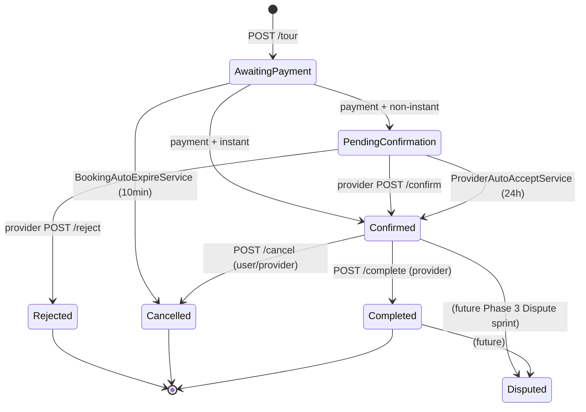

# TASK 5 — Confirm / Reject / Cancel / Complete (state transitions)

**Owner:** Mohammad (Intermediate)
**Endpoints:** 5
**Estimated hours:** 28
**Earliest start:** Thu 2026-07-23 (after TASK 4 mostly merged)
**Hard PR deadline:** Mon 2026-08-03 17:00
**Dependencies:** TASK 4 (TourBooking aggregate exists + AwaitingPayment can be created).

---

## Endpoint list

| # | Method + Path | Permission | Purpose |
|---|---|---|---|
| 1 | `POST /api/v1/booking/{id}/confirm` | `TourBooking + Approve` (provider of tour) | Provider confirms a PendingConfirmation booking |
| 2 | `POST /api/v1/booking/{id}/reject` | `TourBooking + Reject` (provider of tour) | Provider rejects PendingConfirmation booking, triggers auto full refund |
| 3 | `POST /api/v1/booking/{id}/cancel` | `TourBooking + Cancel` (user OR provider) | User OR provider initiates cancellation |
| 4 | `POST /api/v1/booking/{id}/complete` | `TourBooking + Update` (provider of tour) | Mark tour completed after start time |
| 5 | `POST /api/v1/admin/bookings/{id}/force-refund` | `AdminBookingDashboard + Update` | Admin force-majeure full refund override |

---

## State machine (booking)



> **Disputed transitions are OUT OF SCOPE for this sprint** (Phase 3 Dispute sprint owns them). All transition methods throw `InvalidStateError` if called on Disputed.

---

## Domain methods (added to `TourBooking.cs` in this task)

```csharp
public Result Confirm(ConfirmationSource source)
{
    if (Status != BookingStatus.AwaitingPayment && Status != BookingStatus.PendingConfirmation)
        return Result.Failure(new Error("TourBooking.InvalidState", $"Cannot confirm from state {Status}."), Outcome.Validation);

    Status = BookingStatus.Confirmed;
    ConfirmedAt = DateTime.UtcNow;
    ConfirmationSource = source;
    MarkUpdated();
    RaiseDomainEvent(new TourBookingConfirmedDomainEvent(Id, UserId, TourId, ProviderId, ConfirmedAt.Value, source));
    return Result.Success();
}

public Result MoveToPendingConfirmation()
{
    // Called by finance.payment.completed.v1 inbox handler when IsInstantBooking=false
    if (Status != BookingStatus.AwaitingPayment)
        return Result.Failure(new Error("TourBooking.InvalidState", $"Cannot move to PendingConfirmation from {Status}."), Outcome.Validation);
    if (IsInstantBooking)
        return Result.Failure(new Error("TourBooking.InvalidState", "Instant booking should not enter PendingConfirmation."), Outcome.Validation);

    Status = BookingStatus.PendingConfirmation;
    MarkUpdated();
    return Result.Success(); // no domain event; transitions are visible via Confirmed/Rejected events later
}

public Result Reject(string reason)
{
    if (Status != BookingStatus.PendingConfirmation)
        return Result.Failure(new Error("TourBooking.InvalidState", $"Cannot reject from state {Status}."), Outcome.Validation);
    if (string.IsNullOrWhiteSpace(reason) || reason.Length < 10)
        return Result.Failure(new Error("TourBooking.RejectionReasonRequired", "Rejection reason must be at least 10 chars."), Outcome.Validation);

    Status = BookingStatus.Rejected;
    RejectedAt = DateTime.UtcNow;
    RejectionReason = reason;
    MarkUpdated();
    // Provider rejection → automatic full refund
    var refundAmount = TotalAmount;
    RaiseDomainEvent(new TourBookingRejectedDomainEvent(Id, UserId, TourId, ProviderId, RejectedAt.Value, reason, refundAmount, Currency));
    return Result.Success();
}

public Result Cancel(BookingCancellationContext ctx, decimal? overrideRefundPercentage, TimeSpan timeUntilTour)
{
    // Disallow cancel on terminal states
    if (Status is BookingStatus.Cancelled or BookingStatus.Rejected or BookingStatus.Completed)
        return Result.Failure(new Error("TourBooking.InvalidState", $"Cannot cancel from state {Status}."), Outcome.Validation);

    // Validate reason for provider cancellations
    if (ctx.Source == CancellationSource.Provider && (string.IsNullOrWhiteSpace(ctx.Reason) || ctx.Reason.Length < 10))
        return Result.Failure(new Error("TourBooking.CancellationReasonRequired", "Provider cancellation reason must be at least 10 chars."), Outcome.Validation);

    // Compute refund percentage
    decimal refundPct;
    if (ctx.ProviderInitiated || ctx.ForceMajeureOverride)
        refundPct = 100m; // PDF 2 §1.5 — provider/force majeure ALWAYS 100%
    else if (overrideRefundPercentage.HasValue)
        refundPct = overrideRefundPercentage.Value;
    else
        refundPct = 100m; // fallback (should not occur — caller must pass calculated %)

    var refundAmount = Math.Round(TotalAmount * refundPct / 100m, 2, MidpointRounding.ToEven);

    Status = BookingStatus.Cancelled;
    CancelledAt = DateTime.UtcNow;
    CancellationSource = ctx.Source;
    CancellationReason = ctx.Reason;
    RefundAmount = refundAmount;
    MarkUpdated();
    RaiseDomainEvent(new TourBookingCancelledDomainEvent(Id, UserId, TourId, ProviderId, CancelledAt.Value, ctx.Source, ctx.Reason, refundAmount, Currency));
    return Result.Success();
}

public Result Complete(Guid completedByUserId)
{
    if (Status != BookingStatus.Confirmed)
        return Result.Failure(new Error("TourBooking.InvalidState", $"Cannot complete from state {Status}."), Outcome.Validation);

    Status = BookingStatus.Completed;
    CompletedAt = DateTime.UtcNow;
    CompletedByUserId = completedByUserId;
    MarkUpdated();
    RaiseDomainEvent(new TourBookingCompletedDomainEvent(Id, UserId, TourId, ProviderId, CompletedAt.Value));
    return Result.Success();
}

public Result MoveToAwaitingPaymentExpired()
{
    // Called by BookingAutoExpireService
    if (Status != BookingStatus.AwaitingPayment) return Result.Failure(new Error("TourBooking.InvalidState", ""), Outcome.Validation);
    Status = BookingStatus.Cancelled;
    CancelledAt = DateTime.UtcNow;
    CancellationSource = CancellationSource.System;
    CancellationReason = "Payment expired (no payment received within 10 minutes)";
    RefundAmount = 0m;
    MarkUpdated();
    RaiseDomainEvent(new TourBookingPaymentExpiredDomainEvent(Id, UserId, TourId, CancelledAt.Value));
    return Result.Success();
}
```

---

## Capacity restoration on cancel/reject/expire

Domain event handlers (NOT in this sprint — Booking-internal handlers go in `Booking.Infrastructure/EventHandlers/`):

```csharp
public sealed class RestoreSlotCapacityOnCancelHandler(IAvailabilitySlotRepository slots) : INotificationHandler<TourBookingCancelledDomainEvent>
{
    public async Task Handle(TourBookingCancelledDomainEvent notification, CancellationToken ct)
    {
        // Look up the booking's slot (we need to read it from the aggregate that just transitioned)
        // OR pass AvailabilitySlotId into the event payload (RECOMMENDED — add that field to all 3 events)
        var slot = await slots.GetForUpdateAsync(notification.AvailabilitySlotId, ct);
        slot.Cancel(notification.ParticipantCount); // domain method releases BookedCount (if Confirmed was previously) or LockedCount
        slots.Update(slot);
        // DO NOT call SaveChanges — UoW does that
    }
}
```

> **PW-3 caveat:** verify TourBookingCancelledDomainEvent has `AvailabilitySlotId` + `ParticipantCount` payload. If not, **amend the event record** in this task's first WBS step.

> **Idempotency note (INDEX §4 R15):** the handler runs inside the same SaveChanges as the Cancel mutation. If SaveChanges fails, the whole transaction rolls back including the cancel — slot stays at previous count.

---

## Endpoint contracts

### POST /{id}/confirm

Body: `{}` (empty)

Handler:
1. Load booking by Id; 404 if missing.
2. Authorization guard: load `BookingTourSnapshot.ProviderId`; if `ICurrentUser.UserId != providerSnapshot.OwnerUserId` AND not admin → 403.
3. Call `booking.Confirm(ConfirmationSource.Manual)`.
4. `bookings.Update(booking)`.
5. `uow.SaveChangesAsync(ct)`.
6. Cache invalidate `booking:{id}` + `bookings:user:{booking.UserId}` + `bookings:admin`.
7. Return 200 + updated DTO.

### POST /{id}/reject

Body: `{ "reason": "Provider unavailable due to family emergency" }` (10–500 chars)

Same flow but calls `booking.Reject(reason)`. Refund event emitted.

### POST /{id}/cancel

Body: `{ "reason": "Family emergency" }` (user reason optional; provider reason required ≥10 chars)

Handler:
1. Load booking; 404 if missing.
2. Authorization: determine `source`:
   - If `currentUser.UserId == booking.UserId` → `CancellationSource.User`.
   - Else if user is tour's provider → `CancellationSource.Provider` (require reason).
   - Else if user has admin perm → `CancellationSource.Admin` (require reason).
   - Else → 403 OwnerMismatch.
3. Load RefundPolicy snapshot from booking's JSON column (NOT live RefundPolicy — that's the snapshot-at-booking-time per PDF 2 §1.5).
4. Compute `timeUntilTour = slot.StartTime - DateTime.UtcNow`. Look up refund % via `policySnapshot.CalculateRefundPercentage(timeUntilTour)`.
5. Construct `BookingCancellationContext { Source, Reason, ProviderInitiated = source == Provider, ForceMajeureOverride = false }`.
6. Call `booking.Cancel(ctx, refundPct, timeUntilTour)`.
7. `bookings.Update`. `uow.SaveChangesAsync`.
8. Cache invalidate.
9. Return 200 + DTO with `cancellation: { source, reason, refundAmount }`.

### POST /{id}/complete

Body: `{}`

Handler:
1. Load booking; 404.
2. Authorization: provider of tour OR admin.
3. Verify `slot.StartTime <= DateTime.UtcNow`. Else 400 `TourBooking.NotYetStarted`.
4. Call `booking.Complete(currentUser.UserId)`.
5. SaveChanges + invalidate.

### POST /admin/bookings/{id}/force-refund

Body: `{ "reason": "Hurricane evacuation in Petra region" }` (10–500 chars)

Handler:
1. Load booking; 404.
2. Authorization: admin only.
3. Construct `BookingCancellationContext { Source: Admin, Reason: cmd.Reason, ProviderInitiated: false, ForceMajeureOverride: true }`.
4. Call `booking.Cancel(ctx, 100m, ...)`.
5. SaveChanges + invalidate.
6. Audit log with admin user id.

---

## Cache invalidation summary

Every endpoint in this task invalidates:
- `booking:{id}`
- `bookings:user:{booking.UserId}`
- `bookings:admin`

Cancel additionally invalidates:
- `availability:tour:{tourId}` (capacity changed)
- `availability:tour:{tourId}:date:{date}`

---

## WBS

| Step | Sub-deliverable | Hours | Finish-by |
|---|---|---|---|
| 1 | Add state-transition domain methods to `TourBooking.cs` (Confirm, MoveToPendingConfirmation, Reject, Cancel, Complete, MoveToAwaitingPaymentExpired) + add `AvailabilitySlotId`/`ParticipantCount` to existing domain events that need them | 3 | Thu 2026-07-23 EOD |
| 2 | Domain event handler `RestoreSlotCapacityOnCancelHandler` + same for Reject + PaymentExpired (3 handlers, all in Infrastructure) | 3 | Fri 2026-07-24 EOD |
| 3 | ConfirmTourBookingCommand + Validator + Handler + 3 unit tests | 3 | Sun 2026-07-26 EOD |
| 4 | RejectTourBookingCommand + Validator + Handler + 3 unit tests | 3 | Mon 2026-07-27 EOD |
| 5 | CancelTourBookingCommand + Validator + Handler (handles 3 sources) + 6 unit tests | 5 | Wed 2026-07-29 EOD |
| 6 | CompleteTourBookingCommand + Handler + 2 unit tests | 2 | Wed 2026-07-29 EOD |
| 7 | AdminForceRefundCommand + Handler + 2 unit tests | 2 | Thu 2026-07-30 EOD |
| 8 | Endpoints wiring + auth metadata + DTO mapping | 2 | Fri 2026-07-31 EOD |
| 9 | Integration test: cancel by user 25h before tour → 50% refund computed (matches example RefundPolicy from PDF 2 §1.5) | 2 | Sun 2026-08-02 EOD |
| 10 | Integration test: provider cancel → 100% refund regardless of policy | 1 | Sun 2026-08-02 EOD |
| 11 | Integration test: capacity restored after cancel | 2 | Sun 2026-08-02 EOD |
| 12 | Code review cycle | 4 | Mon 2026-08-03 EOD |
| **Sum** | | **32** | |

---

## Edge cases

| # | Case | Expected |
|---|---|---|
| 1 | Confirm already-Confirmed booking | 422 InvalidState |
| 2 | Reject AwaitingPayment booking | 422 InvalidState (must be PendingConfirmation) |
| 3 | Cancel Completed booking | 422 InvalidState |
| 4 | Cancel by random user | 403 OwnerMismatch |
| 5 | Provider cancel without reason | 400 CancellationReasonRequired |
| 6 | User cancel 72.01h before tour with policy `[{72,100},{24,50},{0,0}]` | 100% refund |
| 7 | User cancel 71.99h before tour with same policy | 50% refund |
| 8 | User cancel 23.99h before tour | 0% refund |
| 9 | Complete tour 1 min before scheduled start | 400 NotYetStarted |
| 10 | Complete tour 1 min after scheduled start | 200 OK |
| 11 | Admin force-refund a Cancelled booking | 422 InvalidState (cannot re-cancel) |
| 12 | Admin force-refund a Confirmed booking | 200 OK, 100% refund, audit log entry |
| 13 | Cancel updates slot's `BookedCount` (was Confirmed) | LockedCount unchanged, BookedCount -= participants |
| 14 | Cancel updates slot's `LockedCount` (was AwaitingPayment) | BookedCount unchanged, LockedCount -= participants |

---

## Files Mohammad touches

```
Booking.Domain/Entities/TourBooking.cs                        (add state methods)
Booking.Domain/Events/TourBookingConfirmedDomainEvent.cs       (verify payload)
Booking.Domain/Events/TourBookingRejectedDomainEvent.cs        (verify)
Booking.Domain/Events/TourBookingCancelledDomainEvent.cs       (verify; ensure has SlotId + ParticipantCount)
Booking.Domain/Events/TourBookingCompletedDomainEvent.cs       (verify)
Booking.Domain/Events/TourBookingPaymentExpiredDomainEvent.cs   (verify; ensure SlotId + ParticipantCount)
Booking.Application/Commands/ConfirmTourBooking/...
Booking.Application/Commands/RejectTourBooking/...
Booking.Application/Commands/CancelTourBooking/...
Booking.Application/Commands/CompleteTourBooking/...
Booking.Application/Commands/AdminForceRefund/...
Booking.Infrastructure/EventHandlers/RestoreSlotCapacityOnCancelHandler.cs  (new)
Booking.Infrastructure/EventHandlers/RestoreSlotCapacityOnRejectHandler.cs  (new)
Booking.Infrastructure/EventHandlers/RestoreSlotCapacityOnExpireHandler.cs  (new)
Booking.Presentation/Endpoints/TourBookingTransitionEndpoints.cs (new sub-file)
Booking.Presentation/BookingEndpoints.cs                       (wire-up)
tests/Booking.Tests.Unit/Commands/ConfirmTourBookingHandlerTests.cs
tests/Booking.Tests.Unit/Commands/RejectTourBookingHandlerTests.cs
tests/Booking.Tests.Unit/Commands/CancelTourBookingHandlerTests.cs
tests/Booking.Tests.Unit/Commands/CompleteTourBookingHandlerTests.cs
tests/Booking.Tests.Unit/Commands/AdminForceRefundHandlerTests.cs
tests/Booking.IntegrationTests/CancelAndRefundRoundTripTests.cs
tests/Booking.IntegrationTests/CapacityRestoreOnCancelTests.cs
```
