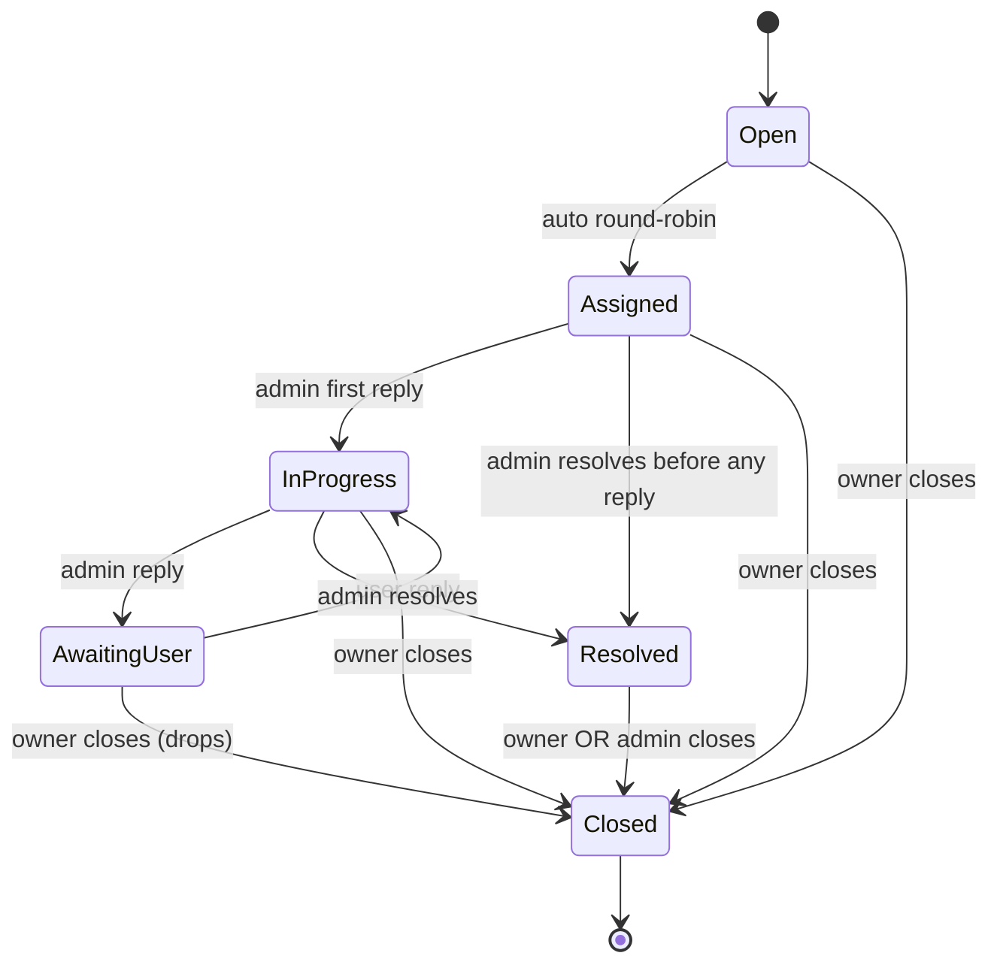

# Messaging Module — Combined Sprint Task File

> **Sprint window:** Mon 2026-11-29 → Thu 2027-01-14 (6 weeks, 30 working days, 175 person-hours)
> **Combined from 12 separate files** in `Agents/tasks/Messaging/` for single-file review.

---

## Table of Contents

- [00-README](#00-readme)
- [01-pre-work](#01-pre-work)
- [02-critical-rules](#02-critical-rules)
- [03-entities-matrix](#03-entities-matrix)
- [04-task-notifications-crud](#04-task-notifications-crud)
- [05-task-signalr-hub](#05-task-signalr-hub)
- [06-task-devices](#06-task-devices)
- [07-task-support-tickets](#07-task-support-tickets)
- [08-task-background-services](#08-task-background-services)
- [09-task-notification-templates](#09-task-notification-templates)
- [10-cross-cutting](#10-cross-cutting)
- [99-acceptance-gate](#99-acceptance-gate)

---

<a id="00-readme"></a>

## 00-README

> Source: `Messaging/00-README.md`

> **Predecessor sprint:** Social (Wave 6 reviews/favorites/moderation) — `Agents/decisions/closed/Social/`
> **This sprint covers:** Messaging module Phase 2 — Notifications CRUD + NotificationHub (SignalR) + Device Tokens (FCM/APNs) + Support Tickets + Notification Templates + 2 background services (EmailNotificationSender continuous + ReadNotificationCleanup weekly Sun 02:00 UTC). All listed in master `Phase1-Phase2-Completion-INDEX.md §1`.
> **Difficulty:** ⚙️⚙️⚙️⚙️ (4/5) — SignalR adds real-time complexity; cross-cutting nature (every module fires events that produce notifications)
> **Endpoint count:** **22 HTTP endpoints** + 1 SignalR hub + 2 BG services
> **Working-day estimate:** **35 working days × 4 devs ≈ 175 person-hours**

This module is the YallaJo notification spine. It already has skeleton infrastructure (per `agent-context.md §11.1`: InboxMessages table, UoW, InboxStore, `Notification.Create` factory, 4 Business-related inbox handlers from prior ContentPlaces sprint). This sprint fills out the remaining endpoint surface, wires SignalR, builds the EmailNotificationSender pipeline, ships Support Tickets with SLA-driven priority + round-robin assignment, and writes a single canonical NotificationTemplate engine driven by {{placeholders}}.

---

## 0 — Sprint Window & Hard Deadlines

| Milestone | Date | Owner |
|---|---|---|
| Pre-work cut | **Fri 2026-11-27 17:00 AST** | Tech Lead |
| Kickoff (Sun standup) | **Sun 2026-11-29 09:30 AST** | All |
| Pre-work merge deadline | **Tue 2026-12-01 17:00 AST** | Tech Lead |
| Earliest task start | **Wed 2026-12-02 09:00 AST** | All |
| Mid-sprint integration freeze | **Sun 2027-01-10 17:00 AST** | All |
| Hard PR cutoff | **Wed 2027-01-13 17:00 AST** | All |
| Hard merge-to-main cutoff | **Thu 2027-01-14 17:00 AST** | Tech Lead |
| Sprint retro + demo | **Fri 2027-01-15 11:00 AST** | All |

Working week Sun→Thu (5 days). Total = **6 calendar weeks, 30 working days, 1 break-week buffer (last week of Dec for holidays)**.

### 0.1 Daily Standup

Same as INDEX §2.1 — 09:30 AST, 15 min hard cap, 3 sentences per dev (yesterday / today / blockers). **Miss-2 rule** triggers Tech Lead 1:1 if any dev misses standup twice in a row.

---

## 1 — Working Days & Person-Hour Budget

| Item | Value |
|---|---|
| Working days | 30 (≈ 6 weeks Sun→Thu, minus holidays) |
| Hours/day/dev | 7 (1h slack for lunch/standup/Slack) |
| Devs | 4 (Tech Lead, Mohammad, Mahmoud, Fadwa) |
| Total raw hours | 840 |
| Task hours (this file budgets) | 175 |
| Code review hours | 30 |
| Ceremony hours (standup × 30) | 30 |
| Buffer (holidays + sick + rework) | 605 (~72% — Dec/Jan low velocity expected) |

The high buffer accounts for end-of-year holidays — track effective velocity in standups.

---

## 2 — Team Members & High-Level Allocation

| Name | Level | Tasks | Endpoints | BG / Hubs | Est hours | Hard deadline |
|---|---|---|---|---|---|---|
| **Mohammad** | Lead | T2 NotificationHub + T5 EmailSender BG | 0 HTTP (hub only) + 1 BG | 1 hub + 1 BG | 50 | Sun 2027-01-10 |
| **Mahmoud** | Intermediate | T1 Notifications CRUD + preferences (8 endpoints) | 8 | 0 | 40 | Sun 2026-12-27 |
| **Fadwa** | Intermediate | T3 Devices/Tokens (3 endpoints) + T4 Support Tickets (7 endpoints) + T6 ReadCleanup BG | 10 | 1 BG | 60 | Sun 2027-01-03 |
| **Junior** (or Fadwa fallback) | Beginner | T7 NotificationTemplates CRUD (4 endpoints) | 4 | 0 | 18 | Sun 2026-12-20 |
| **Tech Lead** | Senior | PW + code review + cross-cutting + Hangfire abstention enforcement + SignalR scaling sanity | 0 | 0 | 7 | Thu 2027-01-14 |
| **TOTAL** | | **7 tasks** | **22 endpoints** | **1 hub + 2 BG** | **175 h** | |

**Owner mapping rationale:** Mohammad gets the SignalR hub because it's the trickiest piece (transport details, group routing, JWT auth on connection, reconnect strategy). Mahmoud's Notifications CRUD work feeds the hub. Fadwa owns both Devices (Phase 2 stub — register tokens, hold for v3 push) and Support Tickets (largest endpoint set but routine CRUD). NotificationTemplates is the simplest path so it goes to a junior or Fadwa as fallback.

---

## 3 — Entity Ownership Matrix

### 3.1 Messaging module

| File (existing) | Base class | Aggregate? | Domain events raised | Owner | Task |
|---|---|---|---|---|---|
| `Notification.cs` (71L, Create+MarkSent+MarkRead already exist) | AuditableEntity | **Yes (promote in PW-2)** | NotificationCreated, NotificationRead, NotificationDelivered, NotificationFailed | Mahmoud | T1 |
| `NotificationPreference.cs` | AuditableEntity | **Yes (promote in PW-2)** | NotificationPreferenceUpdated | Mahmoud | T1 |
| `NotificationTemplate.cs` | AuditableEntity | **Yes (promote in PW-2)** | NotificationTemplateUpdated | Junior | T7 |
| `DeviceToken.cs` | AuditableEntity | **Yes (promote in PW-2)** | DeviceTokenRegistered, DeviceTokenDeleted | Fadwa | T3 |
| `SupportTicket.cs` (23L stub) | AuditableEntity | **Yes (promote in PW-2)** | TicketCreated, TicketAssigned, TicketResolved, TicketClosed | Fadwa | T4 |
| `TicketMessage.cs` | BaseEntity (owned by SupportTicket) | No | (none — SupportTicket raises TicketMessageAdded on its behalf) | Fadwa | T4 |
| **`ChatBotConversation.cs`** | — | — | — | **OUT OF SCOPE** (Phase 4) |
| **`ChatBotMessage.cs`** | — | — | — | **OUT OF SCOPE** (Phase 4) |

### 3.2 Cross-module dependencies (Messaging is the dispatch hub — many inputs)

| Inbox source | Event | Trigger |
|---|---|---|
| Auth | `auth.user.registered.v1` | Welcome notification (existing handler — verify wired) |
| Auth | `auth.otp.generated.v1` | OTP delivery (existing — verify wired) |
| ContentPlaces | `content-places.business.{approved/rejected/suspended/reinstated}.v1` | Already wired (4 handlers from prior sprint) |
| Booking | `booking.tour-booking.{created/confirmed/cancelled/completed/rejected/payment-expired}.v1` | 6 NEW handlers in T1 (each creates a Notification) |
| Booking | `booking.join-request.{approved/rejected}.v1` | 2 NEW handlers in T1 |
| Booking | `booking.provider-document.{expiring/expired}.v1` | 2 NEW handlers in T1 |
| Finance | `finance.{payment.completed, payment.failed, refund.completed, refund.failed, invoice.generated, payout.{scheduled,completed}}.v1` | 7 NEW handlers in T1 |
| Social | `social.{review.published, report.resolved}.v1` | 2 NEW handlers in T1 |
| Accounts | `accounts.provider.{approved/rejected/suspended/reinstated}.v1` | 4 NEW handlers in T1 (admin-action notifications) |

Total NEW inbox handlers: **23** distributed across T1 (Notifications CRUD). Each handler is small (~30 LOC) — resolve `INotificationTemplateRenderer` + `INotificationDispatcher`, call `Notification.Create`, persist via `IMessagingOutboxWriter` → SaveChanges in UoW (single).

---

## 4 — Endpoint Count Reconciliation vs PDF 1

| PDF 1 Wave 6 item | Endpoints | In this sprint |
|---|---|---|
| Notifications CRUD (GET list, GET unread-count, GET preferences, PUT preferences, POST read, POST read-all, DELETE) | 7 | ✅ Mahmoud T1 |
| Device tokens (POST token, DELETE token) | 2 | ✅ Fadwa T3 |
| Support tickets (POST, GET tickets, GET {id}, POST close, POST messages, admin POST assign, admin POST resolve) | 7 | ✅ Fadwa T4 |
| Notification templates CRUD admin-only (added in this sprint) | 4 | ✅ Junior T7 |
| NotificationHub SignalR | 0 HTTP (1 hub) | ✅ Mohammad T2 |
| **TOTAL** | **22 HTTP + 1 hub** | |

DeviceToken total = **3** because the `GET /devices/tokens` (list current user's tokens for the "Logged-in devices" settings UI) was added on Mohammad's recommendation — useful for security audits.

---

## 5 — Standardized Folder Files

Same convention as Booking/Finance/Social (see INDEX §3):
- `01-pre-work.md` — PW-1..PW-N (Tech Lead drives, must merge before kickoff)
- `02-critical-rules.md` — Messaging-specific rules (M-R1..M-RN) ON TOP OF INDEX §4
- `03-entities-matrix.md` — full entity inventory with aggregate roles + EF configs + migrations
- `04-task-notifications-crud.md` — T1 Mahmoud
- `05-task-signalr-hub.md` — T2 Mohammad
- `06-task-devices.md` — T3 Fadwa
- `07-task-support-tickets.md` — T4 Fadwa
- `08-task-background-services.md` — T5 + T6 (Mohammad EmailSender + Fadwa ReadCleanup)
- `09-task-notification-templates.md` — T7 Junior
- `10-cross-cutting.md` — DI audit, permission seeder verification, outbox parity, build lock, migration sequence, inbox/outbox hygiene, SignalR scaling notes
- `99-acceptance-gate.md` — Tech Lead final sign-off

When sprint closes, **whole folder moves** to `Agents/decisions/closed/Messaging/`. Update master INDEX §1 status badge from 🟡 to ✅, and `agent-context.md §11.1` Messaging row from 🟡 Partial → ✅ Complete (Phase 2).

---

## 6 — Reading Order for New Joiners

1. `Agents/agent-context.md` (§0.3 Five Non-Negotiable Rules, §9.1 33 Gotchas)
2. `Agents/guide.md` (entity anatomy, CQRS templates, EF configs)
3. `Agents/YallaJo.md` §Wave 6 + §SignalR Hubs (NotificationHub spec) + §Background Services (EmailNotificationSender + ReadNotificationCleanup)
4. `Endpoints.pdf` Wave 6 rows for Notifications/Devices/Tickets/Support
5. `YallaJo Business Rules & Edge Cases.pdf` §12 Smart Notification System
6. **This folder** — start with `00-README.md` (this file) → `01-pre-work.md` → `02-critical-rules.md` → your assigned task file
7. Prior sprints' closed folders for examples: `decisions/closed/ContentBlogs-ContentSeo/`, `decisions/closed/Booking/`, `decisions/closed/Finance/`, `decisions/closed/Social/`

**Estimated onboarding time:** 4 hours senior dev / 8 hours junior. Standup attendance from Day 1.

---

<a id="01-pre-work"></a>

## 01-pre-work

> Source: `Messaging/01-pre-work.md`

# Messaging — Pre-Work (PW-1..PW-8)

> **Tech Lead drives. ALL pre-work merges into `main` BEFORE Day-0 kickoff Sun 2026-11-29 09:30. Hard deadline: Tue 2026-12-01 17:00 AST.** Task owners are blocked from starting until PW lands; the workaround is to use feature branches off of the PW branch but rebase once main updates.

---

## PW-1 — MessagingUnitOfWork delegates to SharedKernel

**Current bug** (same shape as ContentBlogs/SEO and Booking and Finance hit in their respective sprints — see error-log.md):

```csharp
// Messaging.Infrastructure/Persistence/MessagingUnitOfWork.cs (likely WRONG today)
public sealed class MessagingUnitOfWork(MessagingDbContext ctx) : IMessagingUnitOfWork
{
    public Task<int> SaveChangesAsync(CancellationToken ct = default)
        => ctx.SaveChangesAsync(ct);   // ❌ bypasses MediatR Publish for aggregate roots
}
```

**Required fix:**

```csharp
public sealed class MessagingUnitOfWork(IUnitOfWork<MessagingDbContext> inner) : IMessagingUnitOfWork
{
    public Task<int> SaveChangesAsync(CancellationToken ct = default)
        => inner.SaveChangesAsync(ct);  // ✅ delegates to SharedKernel which dispatches domain events BEFORE SaveChanges
}
```

**Acceptance gate:**
1. `MessagingUnitOfWorkDispatchesEventsTests` (xunit, NSubstitute IPublisher) — POSTs a fake aggregate raising 1 domain event, calls SaveChangesAsync → asserts `IPublisher.Publish` called 1× **before** the SaveChanges call returns. Test must run **green** in CI.
2. `dotnet build Messaging.Infrastructure` clean (zero warnings).
3. Code-review: no other call to `ctx.SaveChangesAsync` directly anywhere in `Messaging.Infrastructure/Persistence/` or `Messaging.Infrastructure/EventHandlers/`. Tech Lead greps for this.

---

## PW-2 — IAggregateRoot markers + AuditableEntity upgrades

**Aggregates to promote** (5 total — verify with `find . -name '*.cs' -exec grep -l 'class Notification' {} \;` etc.):

| Entity | Current base | New base | Migration touch | Notes |
|---|---|---|---|---|
| `Notification` | AuditableEntity ✅ (already) | + IAggregateRoot | none if RowVersion already on AuditableEntity | 71L — `Create` + `MarkSent` + `MarkRead` already present; verify they raise domain events (PW-3) |
| `NotificationPreference` | AuditableEntity | + IAggregateRoot | none | Per-user-per-type-per-channel triple key — see EF config in 03-entities-matrix.md |
| `NotificationTemplate` | AuditableEntity | + IAggregateRoot | none | Admin-only CRUD |
| `DeviceToken` | AuditableEntity | + IAggregateRoot | none | Per-user-per-deviceId UNIQUE |
| `SupportTicket` | AuditableEntity | + IAggregateRoot | none | Owns TicketMessage collection (BaseEntity, NOT promoted) |
| `TicketMessage` | BaseEntity | **stays BaseEntity** | none | Owned child; SupportTicket raises `TicketMessageAdded` |
| `ChatBotConversation` | BaseEntity | **stays BaseEntity** | none | OUT OF SCOPE Phase 4 |
| `ChatBotMessage` | BaseEntity | **stays BaseEntity** | none | OUT OF SCOPE Phase 4 |

**Migration:** `MessagingAddAggregateRootAndAuditMembers` — likely **NO COLUMN CHANGES** since all 5 are already AuditableEntity (RowVersion + IsDeleted + DeletedAt already present from existing infrastructure). If migration is empty, **commit empty migration anyway** so the migration sequence stays clean.

**Acceptance gate:**
1. All 5 entities implement `IAggregateRoot` (marker interface).
2. `EfRepository<T>` generic constraint compiles for all 5 (repository interface inheritance test in `tests/Messaging.Tests.Unit/Domain/AggregateRootMarkerTests.cs`).
3. `dotnet ef migrations add MessagingAddAggregateRootAndAuditMembers` produces a (possibly empty) migration. **Empty migration committed with a comment explaining why.**
4. `MessagingDbContext.OnModelCreating` — verify entity configurations live in separate `*Configuration.cs` files (NOT inline fluent API in OnModelCreating).

---

## PW-3 — Domain event record stubs

Seed **14 domain event records** under `Messaging.Domain/Events/`. Each record is a 1-line file:

```csharp
public sealed record NotificationCreatedDomainEvent(Guid NotificationId, Guid UserId, NotificationType Type, NotificationChannel Channel) : IDomainEvent;
```

Full list (handlers wired in respective tasks; events raised by aggregate methods on their respective state transitions):

1. `NotificationCreatedDomainEvent` — raised by `Notification.Create` (verify existing method — likely needs update)
2. `NotificationReadDomainEvent` — raised by `Notification.MarkRead`
3. `NotificationDeliveredDomainEvent` — raised by `Notification.MarkSent`
4. `NotificationFailedDomainEvent` — raised by `Notification.MarkFailed` (NEW method)
5. `NotificationPreferenceUpdatedDomainEvent` — raised by `NotificationPreference.Update`
6. `NotificationTemplateCreatedDomainEvent` — raised by `NotificationTemplate.Create`
7. `NotificationTemplateUpdatedDomainEvent` — raised by `NotificationTemplate.Update`
8. `NotificationTemplateDeletedDomainEvent` — raised by `NotificationTemplate.Delete`
9. `DeviceTokenRegisteredDomainEvent` — raised by `DeviceToken.Register` (UPSERT pattern)
10. `DeviceTokenDeletedDomainEvent` — raised by `DeviceToken.Delete`
11. `TicketCreatedDomainEvent` — raised by `SupportTicket.Create`
12. `TicketAssignedDomainEvent` — raised by `SupportTicket.AssignTo`
13. `TicketResolvedDomainEvent` — raised by `SupportTicket.Resolve`
14. `TicketClosedDomainEvent` — raised by `SupportTicket.Close`

**NB**: prior sprint left `Notification.Create` already raising events but check exact payload — likely needs more fields (Channel, EntityType, EntityId). Update factory if mismatch.

**Acceptance gate:**
1. All 14 records compile under `Messaging.Domain/Events/`.
2. Each event payload contains enough info for downstream consumers (no need to query DB to react).
3. Aggregate methods that should raise events DO raise them — covered by unit tests in T1/T2/T3/T4/T7.
4. No domain event record is unused (every one has at least 1 in-process handler **or** 1 integration event mapping per PW-4).

---

## PW-4 — Integration event records + IntegrationEventTypeRegistry

Seed **6 integration event records** in `Messaging.Contracts/IntegrationEvents/` (the public surface). NOT all domain events map to integration events — many notification events stay intra-module (read/created don't need to leave).

**External integration events emitted by Messaging:**

| # | Logical name | Record | Trigger | Consumer |
|---|---|---|---|---|
| 1 | `messaging.notification.delivered.v1` | `NotificationDeliveredIntegrationEvent` | EmailSender BG marks email sent | Analytics (delivery success rate metric) |
| 2 | `messaging.notification.failed.v1` | `NotificationFailedIntegrationEvent` | EmailSender BG exhausts retries | Analytics + Admin Slack |
| 3 | `messaging.ticket.created.v1` | `TicketCreatedIntegrationEvent` | SupportTicket.Create | Admin dashboard real-time counter |
| 4 | `messaging.ticket.assigned.v1` | `TicketAssignedIntegrationEvent` | SupportTicket.AssignTo | Audit log |
| 5 | `messaging.ticket.resolved.v1` | `TicketResolvedIntegrationEvent` | SupportTicket.Resolve | Analytics (SLA breach metric, CSAT prompt trigger) |
| 6 | `messaging.support-sla-breached.v1` | `SupportSlaBreachedIntegrationEvent` | (deferred — Phase 3 alerting system) | Stub registered, no consumer yet |

**Register all 6 in `IntegrationEventTypeRegistry.cs` under `messaging.` namespace prefix.**

**Acceptance gate:**
1. `IntegrationEventTypeRegistryParityTests.cs` (mirrors Booking/Finance/Social pattern) — every declared `…IntegrationEvent` is registered, every registered `messaging.*` logical name has a declared record. Zero drift.
2. Records are immutable (`sealed record`), implement `IIntegrationEvent`, and contain ONLY primitive types + `Guid` + `string` + DateTime (no entity references, no DTOs).

---

## PW-5 — Repository interface stubs

Seed **6 application-level repository interfaces** under `Messaging.Application/Interfaces/`. Implementations live in `Messaging.Infrastructure/Repositories/` (EF Core primary-constructor pattern from ContentSeo prior sprint).

| Interface | Custom finders required |
|---|---|
| `INotificationRepository` | `GetByUserPagedAsync(userId, cursor, pageSize, typeFilter, readFilter, ct)` cursor-paginated; `GetUnreadCountByUserAsync(userId, ct)`; `MarkAllAsReadByUserAsync(userId, ct)` (bulk SQL); `DeleteOldReadAsync(olderThan, batchSize, ct)` for the BG cleanup; `GetPendingDispatchAsync(channel, batchSize, ct)` for EmailSender BG |
| `INotificationPreferenceRepository` | `GetByUserAsync(userId, ct)` + `UpsertAsync(prefs, ct)` (uses MERGE pattern); `IsEnabledForUserAsync(userId, type, channel, ct)` for dispatch decision |
| `INotificationTemplateRepository` | `GetByKeyAndLanguageAsync(key, lang, ct)` (key = NotificationType + Channel + Language tuple); `ListAllAsync(filter, ct)` for admin CRUD |
| `IDeviceTokenRepository` | `GetActiveByUserAsync(userId, ct)`; `GetByTokenAsync(token, ct)`; `DeleteStaleAsync(olderThan, ct)` (30-day stale per agent-context §11.1 spec) |
| `ISupportTicketRepository` | `GetByUserPagedAsync` + `GetByAdminPagedAsync(filters)` + `GetByIdWithMessagesAsync(id)` (Include) + `GetUnassignedOldestAsync(ct)` for round-robin |
| `INotificationDeliveryAttemptRepository` | (NEW BaseEntity in PW-9 — see below) `GetPendingForRetryAsync(now, ct)` + `MarkAttempted/MarkSucceeded/MarkFailed` |

**Acceptance gate:**
1. All 6 interfaces compile.
2. 6 EF implementations compile (primary-constructor `public sealed class EfXxxRepository(MessagingDbContext db) : IXxxRepository`).
3. All custom finders have at least 1 unit test in `tests/Messaging.Tests.Unit/Repositories/`.
4. No leaky abstractions — interfaces return `IReadOnlyList<T>` or `T?`, never `IQueryable<T>` and never `DbContext`.

---

## PW-6 — Notification dispatch abstractions

Seed in `SharedKernel.Application/Abstractions/Messaging/`:

```csharp
public interface INotificationDispatcher
{
    Task DispatchAsync(Notification notification, CancellationToken ct);
}

public interface INotificationChannelStrategy
{
    NotificationChannel Channel { get; }
    Task<NotificationDispatchResult> SendAsync(Notification notification, RenderedTemplate rendered, CancellationToken ct);
}

public sealed record NotificationDispatchResult(bool Success, string? FailureReason, string? ExternalRef);

public interface INotificationTemplateRenderer
{
    Task<RenderedTemplate> RenderAsync(NotificationType type, NotificationChannel channel, string languageCode, IReadOnlyDictionary<string, string> placeholders, CancellationToken ct);
}

public sealed record RenderedTemplate(string Title, string Body, string? Html);

public interface IEmailSender   // wraps SMTP / SES / SendGrid impl
{
    Task<EmailSendResult> SendAsync(EmailMessage msg, CancellationToken ct);
}

public sealed record EmailMessage(string ToEmail, string ToName, string Subject, string PlainBody, string? HtmlBody);
public sealed record EmailSendResult(bool Success, string? ExternalRef, string? FailureReason);
```

**Implementations** (in `Messaging.Infrastructure/Dispatch/`):

- `NotificationDispatcher` — resolves the right `INotificationChannelStrategy` via DI keyed by `NotificationChannel`, calls SendAsync, persists the attempt to `NotificationDeliveryAttempts` table (see PW-9).
- `InAppNotificationStrategy` — pushes via SignalR `INotificationHubContext<NotificationHub>` to `user:{userId}` group (T2 wires hub itself).
- `EmailNotificationStrategy` — enqueues `NotificationDeliveryAttempt` row Channel=Email Status=Pending, EmailSender BG picks up.
- `PushNotificationStrategy` — STUB returns Success=false with reason `"PushNotImplementedYet_v3"` and logs warning. Phase 3+ work.
- `SmtpEmailSender` impl uses `MailKit` (already in solution per ContentBlogs sprint Welcome email) reading `Messaging:Email:Smtp` config section.
- `BlocklistEmailSender` test-double for unit tests.
- `MustacheNotificationTemplateRenderer` — uses **`Stubble.Core`** NuGet (Mustache-compatible C# renderer) for `{{Placeholder}}` substitution.

**Acceptance gate:**
1. All abstractions compile in SharedKernel.
2. DI registration in `Messaging.Infrastructure/DependencyInjection.cs` uses **keyed services** (.NET 8+ feature): `services.AddKeyedScoped<INotificationChannelStrategy, InAppNotificationStrategy>(NotificationChannel.InApp);` and so on.
3. Unit tests in `tests/Messaging.Tests.Unit/Dispatch/`: verify dispatcher picks right strategy per channel, verifies failure path persists attempt row with FailureReason.

---

## PW-7 — Permission catalog seeding

Seed in `Messaging.Contracts/Authorization/`:

```csharp
public static class MessagingFeatures
{
    public const string Notification = nameof(Notification);
    public const string NotificationPreference = nameof(NotificationPreference);
    public const string NotificationTemplate = nameof(NotificationTemplate);
    public const string DeviceToken = nameof(DeviceToken);
    public const string SupportTicket = nameof(SupportTicket);
    public const string AdminSupportQueue = nameof(AdminSupportQueue);
}

public sealed class MessagingPermissionCatalog : IPermissionCatalog
{
    public string Module => "Messaging";
    public IReadOnlyCollection<PermissionDescriptor> Permissions { get; } = [
        new(MessagingFeatures.Notification, AppAction.Read),
        new(MessagingFeatures.Notification, AppAction.Delete),
        new(MessagingFeatures.NotificationPreference, AppAction.Read),
        new(MessagingFeatures.NotificationPreference, AppAction.Update),
        new(MessagingFeatures.NotificationTemplate, AppAction.Create),
        new(MessagingFeatures.NotificationTemplate, AppAction.Read),
        new(MessagingFeatures.NotificationTemplate, AppAction.Update),
        new(MessagingFeatures.NotificationTemplate, AppAction.Delete),
        new(MessagingFeatures.DeviceToken, AppAction.Create),
        new(MessagingFeatures.DeviceToken, AppAction.Read),
        new(MessagingFeatures.DeviceToken, AppAction.Delete),
        new(MessagingFeatures.SupportTicket, AppAction.Create),
        new(MessagingFeatures.SupportTicket, AppAction.Read),
        new(MessagingFeatures.SupportTicket, AppAction.Update),
        new(MessagingFeatures.SupportTicket, AppAction.Close),    // NEW AppAction
        new(MessagingFeatures.AdminSupportQueue, AppAction.Read),
        new(MessagingFeatures.AdminSupportQueue, AppAction.Assign),  // NEW AppAction
        new(MessagingFeatures.AdminSupportQueue, AppAction.Resolve)   // NEW AppAction (or reuse from Social if same enum value)
    ];
}
```

**NEW AppActions required:** `Close`, `Assign`, `Resolve` — verify against existing enum, ADD if missing (likely missing). Coordinate with cross-cutting AppAction set across modules.

**Expected boot log:**

```
PermissionSeeder discovered 10 catalogs: Auth, Security, Accounts, ContentCore, ContentPlaces, ContentTours, Booking, Finance, Social, Messaging
PermissionSeeder inserted/verified 18 Messaging permissions
```

**Acceptance gate:**
1. Catalog discovered automatically via DI scan (registration in `Messaging.Infrastructure/DependencyInjection.cs` line `services.AddSingleton<IPermissionCatalog, MessagingPermissionCatalog>();`).
2. `SELECT COUNT(*) FROM security.Permissions WHERE Feature LIKE 'Messaging.%'` = **18** after first boot.

---

## PW-8 — Test projects scaffolded

Create:

```
tests/Messaging.Tests.Unit/
  Messaging.Tests.Unit.csproj      (xunit 2.9.3 + NSubstitute 5.3.0 + FluentAssertions 7.0.0 + EF InMemory 9.0.15)
  Domain/AggregateRootMarkerTests.cs
  Persistence/MessagingUnitOfWorkDispatchesEventsTests.cs
  Repositories/* (6 stub test classes per PW-5 finder)
  Dispatch/NotificationDispatcherTests.cs

tests/Messaging.IntegrationTests/
  Messaging.IntegrationTests.csproj (xunit + Mvc.Testing 9.0.15 + EF InMemory)
  IntegrationEventTypeRegistryParityTests.cs
  Outbox/EventDispatchSanityTests.cs
  Hubs/NotificationHubE2ETests.cs  (T2 — uses TestServer + SignalR client)
```

**`InternalsVisibleTo`** in csproj:
- `Messaging.Application` exposes internals to `Messaging.Tests.Unit` + `Messaging.IntegrationTests`
- `Messaging.Infrastructure` exposes internals to `Messaging.Tests.Unit` + `Messaging.IntegrationTests`

**Acceptance gate:**
1. Both test projects compile and execute (even with 0 tests).
2. `dotnet test tests/Messaging.Tests.Unit` green.
3. `dotnet test tests/Messaging.IntegrationTests` green.

---

## PW-9 — NotificationDeliveryAttempts table

EmailSender BG and any retry-logic needs an audit trail of every send attempt per notification per channel. Schema:

```csharp
public sealed class NotificationDeliveryAttempt : BaseEntity
{
    public Guid NotificationId { get; private set; }
    public NotificationChannel Channel { get; private set; }
    public DateTime AttemptedAt { get; private set; }
    public DateTime? CompletedAt { get; private set; }
    public NotificationDeliveryStatus Status { get; private set; }  // Pending, Succeeded, Failed
    public int AttemptNumber { get; private set; }     // 1, 2, 3
    public string? FailureReason { get; private set; }
    public string? ExternalRef { get; private set; }   // e.g. SES Message ID
}
```

Migration `MessagingAddNotificationDeliveryAttempts`:
- Indexes: `IX_NotificationDeliveryAttempts_Status_AttemptedAt WHERE Status='Pending'` for BG service query
- `IX_NotificationDeliveryAttempts_NotificationId` for audit lookup

**Acceptance gate:**
1. Migration generated + applied in dev.
2. Schema seeded by `MessagingDbInitializer` if dev environment.
3. Repository `INotificationDeliveryAttemptRepository` per PW-5 list.

---

## PW-10 — appsettings template

Block to add to `appsettings.json`:

```json
{
  "Messaging": {
    "Email": {
      "Smtp": {
        "Host": "smtp.gmail.com",
        "Port": 587,
        "UseStartTls": true,
        "Username": "",   // env var only — never commit
        "Password": ""    // env var only — never commit; STRIP SPACES from Gmail app pwd per Gotcha #18 from agent-context §9.1
      },
      "FromAddress": "no-reply@yallajo.com",
      "FromName": "YallaJo"
    },
    "BackgroundServices": {
      "EmailNotificationSender": {
        "Interval": "00:00:30",
        "BatchSize": 50,
        "MaxRetries": 3,
        "InitialDelay": "00:00:30",
        "BackoffMinutes": [1, 5, 15],
        "Enabled": true
      },
      "ReadNotificationCleanup": {
        "TargetUtcDay": "Sunday",
        "TargetUtcTime": "02:00:00",
        "OlderThanDays": 30,
        "BatchSize": 1000,
        "Enabled": true
      }
    },
    "SignalR": {
      "MaxParallelInvocationsPerClient": 1,
      "ClientTimeoutSeconds": 30,
      "KeepAliveIntervalSeconds": 15,
      "EnableDetailedErrors": false  // true in dev only
    },
    "Tickets": {
      "Sla": {
        "HighHours": 4,
        "MediumHours": 12,
        "LowHours": 24
      }
    }
  }
}
```

**Acceptance gate:** appsettings.Development.json overrides with smaller intervals (5s EmailSender) + `EnableDetailedErrors: true`.

---

## PW Total Hours

**~10 hours Tech Lead time over 3 days** (PW-1 1h, PW-2 1h, PW-3 1h, PW-4 1h, PW-5 2h, PW-6 2h, PW-7 0.5h, PW-8 1h, PW-9 0.5h, PW-10 — already in this file). Done.

---

<a id="02-critical-rules"></a>

## 02-critical-rules

> Source: `Messaging/02-critical-rules.md`

# Messaging — Critical Rules (M-R1..M-R12)

> These rules are **additive** to the master `Phase1-Phase2-Completion-INDEX.md §4` (16 universal rules). Every Messaging PR review enforces these on top.

---

## M-R1 — Critical notifications cannot be disabled

PDF 2 §12 — OTP, payment, refund, security notifications are **always delivered** regardless of NotificationPreference settings.

**Critical notification types** (hardcoded enum check):
- `OtpDelivery`
- `PaymentCompleted`
- `PaymentFailed`
- `RefundInitiated`
- `RefundCompleted`
- `SecurityAlert`
- `PasswordChanged`
- `LoginFromNewDevice`

**Implementation:**

```csharp
public static class NotificationTypeExtensions
{
    public static bool IsCritical(this NotificationType type) => type switch
    {
        NotificationType.OtpDelivery
            or NotificationType.PaymentCompleted
            or NotificationType.PaymentFailed
            or NotificationType.RefundInitiated
            or NotificationType.RefundCompleted
            or NotificationType.SecurityAlert
            or NotificationType.PasswordChanged
            or NotificationType.LoginFromNewDevice => true,
        _ => false
    };
}
```

`INotificationDispatcher.DispatchAsync` ignores `NotificationPreference.IsEnabled = false` when `type.IsCritical()`. `PUT /notifications/preferences` validator REJECTS attempts to disable critical types with `Error("NotificationPreference.CannotDisableCritical", ...)` Outcome.UnprocessableEntity.

---

## M-R2 — Notification channels

| Channel | v1 status | Implementation | Notes |
|---|---|---|---|
| InApp | ✅ Full | `Notification` table + SignalR push to `user:{userId}` via NotificationHub (T2) | Persisted; visible in bell icon |
| Email | ✅ Full | EmailSender BG (T5) picks Pending NotificationDeliveryAttempts and sends via SMTP | Templated; retried 3x; failures alert admin |
| Push | 🟡 Stub | `PushNotificationStrategy` returns `Success=false, FailureReason="PushNotImplementedYet_v3"` | Device tokens REGISTERED in this sprint but not consumed until v3 (Phase 3+) |
| SMS | ⬜ Out of scope | (no strategy) | Phase 2.5 critical-only — DEFERRED |

`NotificationChannel` enum: `InApp = 0, Email = 1, Push = 2, Sms = 3`. **All notification creates write to InApp first** (Notification row); then the dispatcher fans out to additional channels based on preferences + type defaults.

---

## M-R3 — Notification creation rule

Every `Notification.Create` invocation MUST go through this chain:

1. **Resolve template** via `INotificationTemplateRenderer.RenderAsync(type, channel, languageCode, placeholders)`.
2. **Create the Notification aggregate** (`Notification.Create(userId, type, channel, title, body, ...)`).
3. **Persist** in same UoW that triggered the create (NEVER call `SaveChanges` from within domain event handler — INDEX §4 R15).
4. **Outbox: NO** — notifications are NOT emitted as integration events (they ARE the integration). The 23 inbox handlers (00-README §3.2) emit `NotificationCreatedDomainEvent` which the `INotificationDispatcher` listens to in-process for real-time SignalR push.
5. **Dispatcher fans out** to channels via DI keyed services (PW-6).

**Anti-pattern (will fail PR review):**
```csharp
// ❌ DON'T do this in inbox handlers
var notification = Notification.Create(...);
db.Notifications.Add(notification);
await db.SaveChangesAsync(ct);   // bypasses UoW dispatch + steals from outer handler's transaction
```

**Correct pattern:**
```csharp
// ✅ Inbox handler MUST call MarkAsProcessed then return; UoW commits at outer SaveChanges boundary
public async Task Handle(BookingTourBookingConfirmedIntegrationEvent evt, CancellationToken ct)
{
    if (await _inbox.HasBeenProcessedAsync(evt.Id, ct)) return;
    var notification = Notification.Create(evt.UserId, NotificationType.BookingConfirmed, NotificationChannel.InApp, ...);
    await _notificationRepo.AddAsync(notification, ct);
    _inbox.MarkAsProcessed(evt.Id);
    await _uow.SaveChangesAsync(ct);   // single SaveChanges per integration event consumption
}
```

---

## M-R4 — Template placeholder syntax

Templates use **Mustache-style `{{Placeholder}}`** rendered by `Stubble.Core` (PW-6). Standard placeholders:

| Placeholder | Source |
|---|---|
| `{{UserName}}` | Notification.UserId → Accounts.Profile.DisplayName (resolved via inbox snapshot in PW for User snapshot table, OR via INotificationContextResolver service) |
| `{{TourName}}` | from event payload |
| `{{BookingReference}}` | from event payload, e.g. `YJ-20270215-A7X3` |
| `{{Date}}` | formatted per user's locale + tour's timezone |
| `{{Amount}}` + `{{Currency}}` | from event payload — formatted `IFormatProvider`-aware |
| `{{ConfirmationCode}}` | for OTP / booking notifications |
| `{{ProviderName}}` | for support/dispute notifications |
| `{{Url}}` | deep-link to app screen — built by `INotificationLinkBuilder` (PW-6 sibling) |

**Missing placeholder behavior:** Stubble defaults to **empty string** (silent). Required by spec PDF 2 §12 "missing placeholder = empty string". **Acceptance test asserts this.**

**Template fallback chain** (template renderer logic):

1. Look up `(NotificationType, NotificationChannel, LanguageCode)` triple
2. Fallback to `(NotificationType, NotificationChannel, "en")` if missing
3. Fallback to `(NotificationType, NotificationChannel.InApp, "en")` if still missing
4. Fallback to last-resort **inline string** in code: `"You have a new {0} notification."` with type name

Log warning whenever fallback 3 or 4 hits — indicates missing template that admin should add via T7 CRUD.

---

## M-R5 — Notification capacity per user

PDF 2 §12 lifecycle: **MAX 500 per user**, oldest READ purged first. ReadNotificationCleanupService (T6) handles the bulk purge; per-write purge is too expensive.

**Read notifications** auto-deleted after **30 days** unread never (also handled by T6 BG service).

**Implementation:** ReadNotificationCleanupService runs **weekly Sun 02:00 UTC** and:
1. Per user, `DELETE FROM Notifications WHERE UserId = @uid AND IsRead = 1 AND ReadAt < DATEADD(DAY, -30, SYSUTCDATETIME())`.
2. After the time-based purge, if a user still has > 500 notifications, deletes oldest READ first then oldest UNREAD if read-pool exhausted.
3. Critical types (M-R1) are **NEVER deleted by the cleanup job** regardless of age. Audit trail value.

Cursor pagination + `GET /notifications/unread-count` are NOT affected by purges except naturally.

---

## M-R6 — SignalR connection & group rules

NotificationHub (T2) groups:

| Group | Member set | Purpose |
|---|---|---|
| `user:{userId}` | One user | Personal notifications |
| `provider:{providerId}` | All members with `Provider` role for that provider | Provider dashboards (new booking arrived, payout cleared) |
| `admin` | All users with `Admin` role | Moderation queue, large payout, dispute filed |

**Connection handshake:** JWT Bearer required (skip authentication = `HubException("Unauthorized")` immediate disconnect). On `OnConnectedAsync`:
1. Read `Context.User.GetUserId()`.
2. Add to `user:{userId}` group.
3. Read roles → if Provider, add to `provider:{providerId}` for each provider record they're attached to (resolved via `IProviderResolverService` snapshot in Messaging DbContext).
4. If Admin, add to `admin` group.

**Group leave on disconnect** is automatic in SignalR; no cleanup code needed.

**Send patterns:**
- `await hub.Clients.Group($"user:{userId}").SendAsync("ReceiveNotification", payload, ct)`
- `await hub.Clients.Group("admin").SendAsync("NewSupportTicket", payload, ct)`

**Scaling note:** v1 uses **in-memory SignalR backplane** (single-instance API). When YallaJo scales to multi-instance, add **Azure SignalR Service** or **Redis backplane** — see 10-cross-cutting.md §SignalR Scaling.

---

## M-R7 — Email retry & exponential backoff

PDF 2 §12: **3 retry attempts with exponential backoff 1+5+15 min**.

**EmailNotificationSenderService (T5) algorithm:**

```text
foreach pending attempt where attempt.AttemptNumber < MaxRetries (default 3):
    compute due time = attempt.AttemptedAt + BackoffMinutes[attempt.AttemptNumber - 1]
    if due time > now: skip (not yet due)
    call IEmailSender.SendAsync(emailMessage, ct)
    if success: MarkSucceeded + raise NotificationDeliveredDomainEvent
    if failure:
        IncrementAttempt
        if AttemptNumber >= MaxRetries: MarkFailed + raise NotificationFailedDomainEvent + emit messaging.notification.failed.v1 → admin alert
        else: stays Pending for next tick
```

`BackoffMinutes` (default `[1, 5, 15]`) from `appsettings.json` per PW-10.

**Idempotency:** if SMTP server times out mid-send but actually delivered, the next retry may double-send. **Acceptable trade-off** for v1 — emails are receiver-side de-duplicated by message-id if SMTP server honors it. Document in error-log.md.

---

## M-R8 — Support Ticket SLA & priority assignment

PDF 2 §12 + agent-context spec:

| Category | Priority | SLA |
|---|---|---|
| `PaymentProblem` | High | 4 hours |
| `BookingIssue` | Medium | 12 hours |
| `ProviderComplaint` | Medium | 12 hours |
| `AccountHelp` | Low | 24 hours |
| `BugReport` | Low | 24 hours |
| `Other` | Low | 24 hours |

**Implementation:** `SupportTicket.Create` factory takes category, auto-derives priority via `TicketCategoryExtensions.GetDefaultPriority(category)`. SLA breach time = `CreatedAt + slaHours`.

**Round-robin assignment** logic: maintain `support.AdminAssignmentRoster` row per admin user with `LastAssignedAt`. Pick admin with oldest `LastAssignedAt` (or random among ties). Skip admins marked `IsOnLeave = true`. Future: replace with workload-aware (count of OPEN tickets per admin).

**SLA breach detection:** Phase 3+ scheduled job. For v1, just store `SlaBreachAt` on ticket and `GET /support/admin/tickets` returns sorted by `SlaBreachAt ASC` so admins naturally pick from most-overdue first.

---

## M-R9 — Device token uniqueness & cleanup

**Unique constraint:** `IX_DeviceTokens_UserId_DeviceId WHERE IsDeleted = 0`. UPSERT on POST `/devices/token`:
- if `(UserId, DeviceId)` exists → update Token + LastSeenAt
- if not → insert new row

**Stale cleanup:** rows with `LastSeenAt < now - 30 days` deleted by `ReadNotificationCleanupService` (T6) as a second pass after the read cleanup. Re-uses the same BG service; runs in same SaveChanges.

**Platform enum:** `DevicePlatform { Android = 0, Ios = 1, Web = 2 }`. Web tokens are FCM web push (browser endpoint). Android = FCM. iOS = APNs.

**Token rotation note:** when client re-registers with a new token for same device (token expired), POST `/devices/token` UPSERTs replacing the old token. Old token is NOT pushed to anymore.

---

## M-R10 — Cursor pagination

Same shape as INDEX §4 R9, Booking, Finance, Social. Cursor format: base64 of `{Id, CreatedAt}`. Default pageSize 20, max 50. `GET /notifications` supports filters `?type=BookingConfirmed,PaymentReceived&read=false&from=2026-12-01&to=2027-01-31`.

**Sort order:** ALWAYS `CreatedAt DESC, Id DESC` (newest first). Cursor reverses on `?direction=oldest-first` (rarely used; supported for archive UI).

---

## M-R11 — ICurrentUser audit list

12 handlers ALLOWED to inject `ICurrentUser`:

| Handler | Reason |
|---|---|
| `GetMyNotificationsQueryHandler` | User-scoped list |
| `GetUnreadCountQueryHandler` | User-scoped count |
| `MarkNotificationReadCommandHandler` | Ownership guard (cannot mark someone else's notification as read) |
| `MarkAllAsReadCommandHandler` | User-scoped bulk |
| `DeleteNotificationCommandHandler` | Ownership guard |
| `GetMyPreferencesQueryHandler` | User-scoped |
| `UpdatePreferencesCommandHandler` | User-scoped self-edit |
| `RegisterDeviceTokenCommandHandler` | Stamps UserId on the token |
| `DeleteDeviceTokenCommandHandler` | Ownership guard |
| `GetMyDeviceTokensQueryHandler` | User-scoped list |
| `CreateSupportTicketCommandHandler` | Stamps CreatedByUserId |
| `GetMyTicketsQueryHandler` | User-scoped list |
| `PostTicketMessageCommandHandler` | Stamps AuthorUserId + ownership guard on the ticket |
| `CloseTicketCommandHandler` | Ownership guard (only ticket creator OR assigned admin) |
| (Admin handlers use `MustHavePermission(AdminSupportQueue, ...)` — no ICurrentUser needed) | |

**All other handlers FORBIDDEN to inject `ICurrentUser`.** Permission-based auth is sufficient.

---

## M-R12 — Error registry

| Code | HTTP | Outcome |
|---|---|---|
| `Notification.NotFound` | 404 | NotFound |
| `Notification.OwnerMismatch` | 403 | Forbidden |
| `Notification.AlreadyRead` | (no — idempotent) | (treated as success) |
| `NotificationPreference.CannotDisableCritical` | 422 | UnprocessableEntity |
| `NotificationPreference.InvalidType` | 400 | Validation |
| `NotificationTemplate.NotFound` | 404 | NotFound |
| `NotificationTemplate.DuplicateKey` | 409 | Conflict |
| `NotificationTemplate.InvalidPlaceholderSyntax` | 400 | Validation |
| `DeviceToken.NotFound` | 404 | NotFound |
| `DeviceToken.OwnerMismatch` | 403 | Forbidden |
| `DeviceToken.InvalidPlatform` | 400 | Validation |
| `SupportTicket.NotFound` | 404 | NotFound |
| `SupportTicket.OwnerMismatch` | 403 | Forbidden |
| `SupportTicket.AlreadyClosed` | 422 | UnprocessableEntity |
| `SupportTicket.MessageRequired` | 400 | Validation |
| `SupportTicket.NoAdminAvailable` | 503 | ServiceUnavailable (admin roster empty — fall back to admin@yallajo.com) |
| `SupportTicket.AssignmentRoleMismatch` | 403 | Forbidden (target user not an admin) |
| `Hub.Unauthorized` | (HubException — disconnects) | — |

All codes follow `{Entity}.{Reason}` PascalCase per INDEX §4 R13.

---

<a id="03-entities-matrix"></a>

## 03-entities-matrix

> Source: `Messaging/03-entities-matrix.md`

# Messaging — Entities Matrix

> Authoritative inventory of every Messaging entity, its base class, aggregate role, persistence config, and what events it emits. Mirrors Booking 03-entities-matrix.md format.

---

## 1. Aggregates (5 total, all `AuditableEntity, IAggregateRoot` after PW-2)

| Aggregate | LOC (current) | Owns | Raises | Custom invariants |
|---|---|---|---|---|
| **`Notification`** | 71 | – | NotificationCreated, NotificationRead, NotificationDelivered, NotificationFailed | UserId required; Title 1-200; Body 1-2000; CreatedAt frozen; MarkRead idempotent |
| **`NotificationPreference`** | tiny stub | – | NotificationPreferenceUpdated | UNIQUE (UserId, Type, Channel); CannotDisableCritical (M-R1) |
| **`NotificationTemplate`** | tiny stub | – | NotificationTemplateCreated, …Updated, …Deleted | UNIQUE (Key, LanguageCode); Key non-empty; Body/Title required; placeholders validated against allow-list |
| **`DeviceToken`** | tiny stub | – | DeviceTokenRegistered, DeviceTokenDeleted | UNIQUE filtered (UserId, DeviceId) WHERE IsDeleted = 0; Token non-empty; LastSeenAt auto-stamped |
| **`SupportTicket`** | 23 stub | `TicketMessages` collection (BaseEntity) | TicketCreated, TicketAssigned, TicketResolved, TicketClosed, TicketMessageAdded | Status state machine (Open → Assigned → InProgress → Resolved → Closed); Category drives Priority; CreatedAt frozen |

---

## 2. Child / value entities (NOT aggregates)

| Entity | Base | Parent aggregate | Notes |
|---|---|---|---|
| `TicketMessage` | BaseEntity | SupportTicket | Author (User OR Admin), IsInternal (admin-only notes), AttachedFiles (later) |
| `NotificationDeliveryAttempt` | BaseEntity | Notification (loose ref) | NEW table from PW-9 — audit trail for EmailSender retries |
| `AdminAssignmentRosterEntry` | BaseEntity | (none — top-level for round-robin) | PerSupportTicket assignment tracking |

---

## 3. OUT-OF-SCOPE entities (stay stub; do NOT promote)

| Entity | Phase |
|---|---|
| `ChatBotConversation` | Phase 4 (T22 AI Assistant) |
| `ChatBotMessage` | Phase 4 |

These stay as-is (BaseEntity stubs). Do NOT add IAggregateRoot. Phase 4 sprint will re-design.

---

## 4. Integration events emitted (6 total, all `messaging.*.v1`)

| Logical name | Trigger | Consumer | Required payload |
|---|---|---|---|
| `messaging.notification.delivered.v1` | EmailSender marks Success | Analytics | NotificationId, UserId, Channel, DeliveredAt |
| `messaging.notification.failed.v1` | EmailSender exhausts retries | Analytics + Admin Slack | NotificationId, UserId, Channel, FailureReason, AttemptCount |
| `messaging.ticket.created.v1` | SupportTicket.Create | Admin live dashboard | TicketId, UserId, Category, Priority, CreatedAt |
| `messaging.ticket.assigned.v1` | SupportTicket.AssignTo | Audit log | TicketId, AssignedToUserId, AssignedByUserId, AssignedAt |
| `messaging.ticket.resolved.v1` | SupportTicket.Resolve | Analytics (SLA breach metric, CSAT prompt) | TicketId, ResolvedByUserId, ResolutionNotes, TimeToResolveHours |
| `messaging.support-sla-breached.v1` | (deferred Phase 3) | Phase 3 alerting | TicketId, BreachedAt, ElapsedHours |

---

## 5. Integration events consumed (23 inbox handlers — see 00-README §3.2)

Grouped by upstream module:

**Auth (2):**
- `auth.user.registered.v1` → welcome notification
- `auth.otp.generated.v1` → OTP delivery (critical, force-channel-email)

**Accounts (4):**
- `accounts.provider.approved.v1` → "Your provider account is live"
- `accounts.provider.rejected.v1` → "Rejected: {Reason}"
- `accounts.provider.suspended.v1` → "Account suspended"
- `accounts.provider.reinstated.v1` → "Account reinstated"

**ContentPlaces (4 — already wired prior sprint):**
- `content-places.business.{approved/rejected/suspended/reinstated}.v1`

**Booking (8):**
- `booking.tour-booking.created.v1` → "Awaiting payment"
- `booking.tour-booking.confirmed.v1` → "Confirmed — see you on {Date}"
- `booking.tour-booking.cancelled.v1` → "Cancelled" (with refund info)
- `booking.tour-booking.completed.v1` → "How was your tour?" review prompt
- `booking.tour-booking.rejected.v1` → "Provider rejected" + refund
- `booking.tour-booking.payment-expired.v1` → "Payment window expired — re-book"
- `booking.join-request.approved.v1` → "Your join request was approved"
- `booking.join-request.rejected.v1` → "Your join request was rejected: {Reason}"
- `booking.provider-document.expiring.v1` → 30-day warning provider notification
- `booking.provider-document.expired.v1` → critical doc expired → suspension imminent

**Finance (7):**
- `finance.payment.completed.v1` → "Payment received" (CRITICAL)
- `finance.payment.failed.v1` → "Payment failed" (CRITICAL)
- `finance.refund.completed.v1` → "Refund processed" (CRITICAL)
- `finance.refund.failed.v1` → admin alert + retry exhausted
- `finance.invoice.generated.v1` → "Invoice ready"
- `finance.payout.scheduled.v1` → provider "Payout scheduled for {Date}"
- `finance.payout.completed.v1` → provider "Payout completed: {Amount}"

**Social (2):**
- `social.review.published.v1` → provider notification "New review received"
- `social.report.resolved.v1` → reporter notification of outcome

Total: **2 + 4 + 4 + 10 + 7 + 2 = 29** handlers? Let me recount: Auth 2 + Accounts 4 + ContentPlaces 4 already + Booking 10 + Finance 7 + Social 2 = **29 handlers**. (00-README said 23 — that count EXCLUDES the 4 ContentPlaces already wired and counts the 10 Booking handlers as 8.) Reconcile in T1 final scope review — likely 27 NEW handlers this sprint.

---

## 6. Value objects

| VO | Fields | Notes |
|---|---|---|
| `NotificationTitle` | `Value` (string 1-200) | Validation on construct |
| `NotificationBody` | `Value` (string 1-2000) | Validation on construct |
| `DeviceTokenValue` | `Value` (string 1-500) | No structural validation — opaque |
| `TicketSubject` | `Value` (string 10-200) | Validation |

VOs implement `IEquatable<T>` (struct or record struct).

---

## 7. Enums

**`NotificationType`** (extend existing — verify list):
```
WelcomeEmail = 0,
OtpDelivery = 1,
BookingCreated = 2,
BookingConfirmed = 3,
BookingCancelled = 4,
BookingCompleted = 5,
BookingPaymentExpired = 6,
BookingTomorrowReminder = 7,
JoinRequestApproved = 8,
JoinRequestRejected = 9,
PaymentCompleted = 10,
PaymentFailed = 11,
RefundInitiated = 12,
RefundCompleted = 13,
InvoiceReady = 14,
PayoutScheduled = 15,
PayoutCompleted = 16,
ReviewReceived = 17,
ReviewReply = 18,
ReportResolved = 19,
ProviderApproved = 20,
ProviderRejected = 21,
ProviderSuspended = 22,
ProviderReinstated = 23,
DocumentExpiring = 24,
DocumentExpired = 25,
DocumentSuspension = 26,
SupportTicketReply = 27,
SupportTicketResolved = 28,
NewSupportTicket = 29,        // admin-targeted
SecurityAlert = 30,            // CRITICAL
PasswordChanged = 31,          // CRITICAL
LoginFromNewDevice = 32        // CRITICAL
```

**`NotificationChannel`** = `InApp = 0, Email = 1, Push = 2, Sms = 3`

**`NotificationDeliveryStatus`** (NEW) = `Pending = 0, Succeeded = 1, Failed = 2`

**`DevicePlatform`** = `Android = 0, Ios = 1, Web = 2`

**`TicketCategory`** = `PaymentProblem = 0, BookingIssue = 1, ProviderComplaint = 2, AccountHelp = 3, BugReport = 4, Other = 5`

**`TicketPriority`** = `High = 0, Medium = 1, Low = 2`

**`TicketStatus`** = `Open = 0, Assigned = 1, InProgress = 2, AwaitingUser = 3, Resolved = 4, Closed = 5`

---

## 8. EF Configurations (10 files in `Messaging.Infrastructure/Persistence/Configurations/`)

| File | Notes |
|---|---|
| `NotificationConfiguration.cs` | PK Id; `IX_Notifications_UserId_CreatedAt DESC INCLUDE (Type, IsRead)` for list query; `IX_Notifications_UserId_IsRead WHERE IsRead = 0` for unread count |
| `NotificationPreferenceConfiguration.cs` | PK Id; UNIQUE (UserId, Type, Channel) |
| `NotificationTemplateConfiguration.cs` | PK Id; UNIQUE (Key, LanguageCode); Body/Html stored as nvarchar(max) |
| `NotificationDeliveryAttemptConfiguration.cs` | PK Id; FK NotificationId NO CASCADE; `IX_NotificationDeliveryAttempts_Status_AttemptedAt WHERE Status = 'Pending'` for BG service |
| `DeviceTokenConfiguration.cs` | PK Id; UNIQUE filtered (UserId, DeviceId) WHERE IsDeleted = 0; `IX_DeviceTokens_LastSeenAt` for stale cleanup |
| `SupportTicketConfiguration.cs` | PK Id; HasMany TicketMessages; `IX_SupportTickets_Status_SlaBreachAt` for admin queue; `IX_SupportTickets_CreatedByUserId` for user list |
| `TicketMessageConfiguration.cs` | PK Id; FK SupportTicketId CASCADE; `IX_TicketMessages_SupportTicketId_CreatedAt` |
| `AdminAssignmentRosterConfiguration.cs` | PK AdminUserId; ordered by LastAssignedAt for round-robin |
| `InboxMessageConfiguration.cs` | EXISTING — verify still wired |
| `OutboxMessageConfiguration.cs` | EXISTING — verify |

---

## 9. Migration sequence

Generated in this order. **Squash forbidden** (rollback safety):

| # | Name | Owner | Task | Notes |
|---|---|---|---|---|
| 1 | `MessagingAddAggregateRootAndAuditMembers` | Tech Lead | PW-2 | May be empty — commit anyway |
| 2 | `MessagingAddNotificationDeliveryAttempts` | Tech Lead | PW-9 | New table + 2 indexes |
| 3 | `MessagingAddNotificationIndexes` | Mahmoud | T1 | List + unread-count + read-cleanup support indexes |
| 4 | `MessagingAddAdminAssignmentRoster` | Fadwa | T4 | New table for round-robin |
| 5 | `MessagingAddDeviceTokenUniqueIndex` | Fadwa | T3 | UNIQUE filtered (UserId, DeviceId) |
| 6 | `MessagingAddSupportTicketSlaIndex` | Fadwa | T4 | SLA-sorted admin queue |
| 7 | `MessagingSeedDefaultNotificationTemplates` | Junior | T7 | Idempotent INSERT-IF-NOT-EXISTS for 30+ templates EN/AR |

Apply via `dotnet ef database update --project Messaging.Infrastructure --startup-project YallaJo.Api --context MessagingDbContext`. Tech Lead applies in shared envs.

---

<a id="04-task-notifications-crud"></a>

## 04-task-notifications-crud

> Source: `Messaging/04-task-notifications-crud.md`

# TASK 1 — Notifications CRUD + Preferences + Inbox Handlers

> **Owner:** Mahmoud (Intermediate) — **Hours:** 40h — **Hard deadline:** Sun **2026-12-27 17:00**
> **Earliest start:** Wed 2026-12-02 09:00
> **Endpoints:** 8 HTTP + ~23 inbox handlers (PW-4 list)
> **Depends on:** PW-1..PW-7

---

## Endpoint List

| # | Method | Path | Permission |
|---|---|---|---|
| 1 | GET | `/api/v1/notifications` | `MustHavePermission(Notification, Read)` + ICurrentUser self-filter |
| 2 | GET | `/api/v1/notifications/unread-count` | same |
| 3 | GET | `/api/v1/notifications/preferences` | `MustHavePermission(NotificationPreference, Read)` + ICurrentUser |
| 4 | PUT | `/api/v1/notifications/preferences` | `MustHavePermission(NotificationPreference, Update)` + ICurrentUser |
| 5 | POST | `/api/v1/notifications/{id}/read` | `MustHavePermission(Notification, Read)` + ICurrentUser ownership |
| 6 | POST | `/api/v1/notifications/read-all` | `MustHavePermission(Notification, Read)` + ICurrentUser |
| 7 | DELETE | `/api/v1/notifications/{id}` | `MustHavePermission(Notification, Delete)` + ICurrentUser ownership |
| 8 | GET | `/api/v1/notifications/{id}` | `MustHavePermission(Notification, Read)` + ICurrentUser ownership |

All filter to current user. Admin variant out of scope for this sprint.

---

## Inbox Handlers (≈23-29)

Per 00-README §3.2 and 03-entities-matrix.md §5. Each handler is small (≤40 LOC). Skeleton:

```csharp
public sealed class BookingTourBookingConfirmedHandler(
    IMessagingInboxStore inbox,
    INotificationRepository repo,
    INotificationTemplateRenderer renderer,
    IMessagingUnitOfWork uow,
    ILogger<BookingTourBookingConfirmedHandler> logger)
    : INotificationHandler<BookingTourBookingConfirmedIntegrationEvent>
{
    public async Task Handle(BookingTourBookingConfirmedIntegrationEvent evt, CancellationToken ct)
    {
        if (await inbox.HasBeenProcessedAsync(evt.Id, ct)) return;

        var rendered = await renderer.RenderAsync(
            NotificationType.BookingConfirmed,
            NotificationChannel.InApp,
            languageCode: "en",   // resolve via UserSnapshot.LanguageCode in v2
            placeholders: new Dictionary<string, string> {
                ["TourName"] = evt.TourTitle,
                ["BookingReference"] = evt.BookingReference,
                ["Date"] = evt.SlotDate.ToString("D"),
                ["ConfirmationCode"] = evt.BookingReference
            },
            ct);

        var notification = Notification.Create(
            userId: evt.UserId,
            type: NotificationType.BookingConfirmed,
            channel: NotificationChannel.InApp,
            title: rendered.Title,
            body: rendered.Body,
            priority: NotificationPriority.Medium,
            data: $"{{\"bookingId\":\"{evt.BookingId}\"}}",
            entityType: "TourBooking",
            entityId: evt.BookingId);

        await repo.AddAsync(notification, ct);
        inbox.MarkAsProcessed(evt.Id);
        await uow.SaveChangesAsync(ct);
    }
}
```

The `INotificationDispatcher` is invoked **in-process** by `NotificationCreatedDomainEvent` handler (registered via UoW dispatch) — it fans out to SignalR (InApp), enqueues Email if user has Email channel enabled, and stub-logs Push.

---

## Domain Methods (Notification aggregate)

| Method | Raises | Notes |
|---|---|---|
| `Create(userId, type, channel, title, body, ...)` (factory) | `NotificationCreatedDomainEvent` | Verify EXISTING — may need to add fields per PW-3 |
| `MarkRead()` | `NotificationReadDomainEvent` | Idempotent — guard `if (IsRead) return Result.Success();` |
| `MarkSent(externalRef?)` | `NotificationDeliveredDomainEvent` | Called by EmailSender BG |
| `MarkFailed(reason)` | `NotificationFailedDomainEvent` | Called by EmailSender after final retry |
| `SoftDelete()` | (none — handled via auditable) | User-initiated |

---

## Cache Tags

| Query | Tag | TTL |
|---|---|---|
| `GET /notifications?...` | `notifications:user:{userId}` | 30s (high churn) |
| `GET /notifications/unread-count` | `notifications:user:{userId}:unread` | 15s |
| `GET /notifications/{id}` | `notification:{id}` | 5min |
| `GET /notifications/preferences` | `notification-preferences:user:{userId}` | 10min |

**Cache invalidation:**
- POST read/delete + inbox-handler create → `RemoveByTagAsync($"notifications:user:{userId}")` AND `RemoveByTagAsync($"notifications:user:{userId}:unread")`
- PUT preferences → `RemoveByTagAsync($"notification-preferences:user:{userId}")`

---

## Preference Validation

`UpdatePreferencesCommandValidator`:
- For each (type, channel) entry in payload:
  - `type` must be valid enum value
  - `channel` must be valid enum value
  - If `IsEnabled = false` AND `type.IsCritical()` (M-R1) → error `NotificationPreference.CannotDisableCritical`
  - Default Enabled = true for InApp + Email on critical; false for non-critical Email; always false for Push (until v3)

---

## WBS (40h)

| # | Step | Hours | Finish-by |
|---|---|---|---|
| 1 | Notification aggregate domain methods update + tests | 4 | 2026-12-04 |
| 2 | NotificationPreference aggregate + Update + critical guard + tests | 4 | 2026-12-08 |
| 3 | 8 endpoints + commands/queries/validators/handlers + DTOs | 12 | 2026-12-13 |
| 4 | 27+ inbox handlers (lean — generate via T4 base class for parallel boilerplate) | 8 | 2026-12-17 |
| 5 | Cache wiring (tags + invalidation) | 2 | 2026-12-19 |
| 6 | Permission seeder integration test | 1 | 2026-12-19 |
| 7 | Integration tests (inbox round-trip + endpoint smoke) | 6 | 2026-12-23 |
| 8 | Outbox parity test for any messaging.* events emitted from inbox-resultant downstream side-effects (none in T1 directly) | 1 | 2026-12-23 |
| 9 | PR review fixes | 2 | 2026-12-27 |
| **Total** | | **40h** | **Sun 2026-12-27** |

---

## Acceptance Tests

1. POST /notifications/{id}/read on unread → 200 + IsRead=true + ReadAt stamped.
2. POST /notifications/{id}/read on already-read → 200 (idempotent), ReadAt unchanged.
3. POST /notifications/{id}/read on someone else's notification → 403.
4. PUT preferences disabling OtpDelivery on Email → 422 `NotificationPreference.CannotDisableCritical`.
5. Inbox handler `BookingTourBookingConfirmedHandler` processes event → creates Notification row + SignalR push fires (via in-process domain event handler).
6. Re-deliver same integration event (same ID) → inbox skip, no duplicate Notification row.
7. `GET /notifications?type=BookingConfirmed&read=false&pageSize=10` → returns cursor, items count ≤ 10, all match filter.
8. `GET /notifications/unread-count` returns scalar count, decrements after read.
9. DELETE /notifications/{id} on own → 204 + soft-delete (IsDeleted=true).
10. Cache invalidation: after POST read → next GET /notifications/unread-count returns fresh decrement (not cached stale).

---

<a id="05-task-signalr-hub"></a>

## 05-task-signalr-hub

> Source: `Messaging/05-task-signalr-hub.md`

# TASK 2 — NotificationHub (SignalR)

> **Owner:** Mohammad (Lead) — **Hours:** 30h — **Hard deadline:** Sun **2027-01-03 17:00**
> **Earliest start:** Wed 2026-12-02 09:00 (no T1 dependency for hub scaffolding)
> **Endpoints:** 0 HTTP — **1 SignalR Hub at `/hubs/notifications`**
> **Depends on:** PW-2, PW-6 (INotificationDispatcher), T1 (provides notification domain events that hub broadcasts)

---

## Hub Class

`Messaging.Infrastructure/Hubs/NotificationHub.cs`:

```csharp
[Authorize]  // JWT Bearer required — connection rejected if missing/invalid
public sealed class NotificationHub(
    ICurrentUser currentUser,
    IProviderResolverService providerResolver,
    ILogger<NotificationHub> logger) : Hub
{
    public override async Task OnConnectedAsync()
    {
        var userId = currentUser.UserId;
        if (userId is null)
        {
            logger.LogWarning("NotificationHub connection rejected — no user ID. ConnectionId={Cid}", Context.ConnectionId);
            Context.Abort();
            return;
        }

        await Groups.AddToGroupAsync(Context.ConnectionId, $"user:{userId}");

        if (currentUser.IsInRole("Admin"))
            await Groups.AddToGroupAsync(Context.ConnectionId, "admin");

        if (currentUser.IsInRole("Provider"))
        {
            var providerIds = await providerResolver.GetProviderIdsForUserAsync(userId.Value, Context.ConnectionAborted);
            foreach (var pid in providerIds)
                await Groups.AddToGroupAsync(Context.ConnectionId, $"provider:{pid}");
        }

        logger.LogInformation("SignalR connected: User={UserId} Cid={Cid}", userId, Context.ConnectionId);
        await base.OnConnectedAsync();
    }

    public override async Task OnDisconnectedAsync(Exception? exception)
    {
        logger.LogInformation("SignalR disconnected: User={UserId} Cid={Cid} Ex={Ex}", currentUser.UserId, Context.ConnectionId, exception?.Message);
        // Groups auto-cleaned by SignalR on disconnect; no explicit removal needed.
        await base.OnDisconnectedAsync(exception);
    }

    // Client → Server
    public async Task MarkAsRead(Guid notificationId)
    {
        if (currentUser.UserId is null) throw new HubException("Unauthorized");

        // Delegate to MediatR command — hub stays thin
        var mediator = Context.GetHttpContext()!.RequestServices.GetRequiredService<IMediator>();
        var result = await mediator.Send(new MarkNotificationReadCommand(notificationId), Context.ConnectionAborted);

        if (result.IsFailure)
            throw new HubException($"{result.Error?.Code}: {result.Error?.Description}");

        // Broadcast confirmation back to same user (in case they have multiple tabs)
        await Clients.Group($"user:{currentUser.UserId}").SendAsync("NotificationRead", notificationId);
    }

    public async Task MarkAllAsRead()
    {
        if (currentUser.UserId is null) throw new HubException("Unauthorized");

        var mediator = Context.GetHttpContext()!.RequestServices.GetRequiredService<IMediator>();
        await mediator.Send(new MarkAllNotificationsReadCommand(), Context.ConnectionAborted);

        await Clients.Group($"user:{currentUser.UserId}").SendAsync("AllNotificationsRead");
    }
}
```

---

## Server → Client Methods (TypeScript client contract)

| Method | Payload | Trigger |
|---|---|---|
| `ReceiveNotification` | `{id, type, title, body, createdAt, priority, data?, entityType?, entityId?}` | New notification created (in-process domain event handler) |
| `NotificationRead` | `{notificationId}` | Confirmation broadcast after MarkAsRead |
| `AllNotificationsRead` | `{}` | Confirmation broadcast after MarkAllAsRead |
| `UnreadCountUpdated` | `{unreadCount}` | Broadcast after any read/delete/new |
| `NewSupportTicket` | `{ticketId, category, priority, createdByName}` | Admin group only — fires on TicketCreated |
| `SupportTicketAssigned` | `{ticketId, assignedToUserId}` | Admin group + assignee user group |
| `TourLiveTrackingUpdate` | (Phase 4 — placeholder) | OUT OF SCOPE |

---

## Client → Server Methods

| Method | Args | Behavior |
|---|---|---|
| `MarkAsRead(notificationId: Guid)` | one notification ID | Updates DB + broadcasts NotificationRead to same user's other tabs |
| `MarkAllAsRead()` | – | Bulk update + broadcast AllNotificationsRead |

---

## Hub-Side Dispatch (In-Process Domain Event Handler)

`Messaging.Infrastructure/EventHandlers/NotificationCreatedSignalRBroadcastHandler.cs`:

```csharp
public sealed class NotificationCreatedSignalRBroadcastHandler(
    IHubContext<NotificationHub> hub,
    INotificationRepository repo,
    ILogger<NotificationCreatedSignalRBroadcastHandler> logger)
    : INotificationHandler<NotificationCreatedDomainEvent>
{
    public async Task Handle(NotificationCreatedDomainEvent evt, CancellationToken ct)
    {
        // Look up full notification for payload
        var n = await repo.GetByIdAsync(evt.NotificationId, ct);
        if (n is null)
        {
            logger.LogWarning("Notification {Id} not found for SignalR broadcast (race)", evt.NotificationId);
            return;
        }

        var payload = new
        {
            id = n.Id, type = n.Type.ToString(), title = n.Title, body = n.Body,
            createdAt = n.CreatedAt, priority = n.Priority.ToString(),
            data = n.Data, entityType = n.EntityType, entityId = n.EntityId
        };

        await hub.Clients.Group($"user:{evt.UserId}").SendAsync("ReceiveNotification", payload, ct);

        // Refresh unread count
        var unreadCount = await repo.GetUnreadCountByUserAsync(evt.UserId, ct);
        await hub.Clients.Group($"user:{evt.UserId}").SendAsync("UnreadCountUpdated", new { unreadCount }, ct);
    }
}
```

**Important**: this is a NORMAL `INotificationHandler<TDomainEvent>` — but it does NOT call `SaveChanges` (M-R3). It only sends transient SignalR messages — no DB writes.

---

## Auth & Security

**JWT Bearer required** at connection — same `JwtBearerOptions` as REST endpoints. Configure in `Program.cs`:

```csharp
app.MapHub<NotificationHub>("/hubs/notifications");
```

SignalR auto-picks up `JwtBearerHandler`. For token in query string (browsers can't set headers on WS connect), add `JwtBearerEvents.OnMessageReceived`:

```csharp
options.Events = new JwtBearerEvents
{
    OnMessageReceived = ctx =>
    {
        var accessToken = ctx.Request.Query["access_token"];
        var path = ctx.HttpContext.Request.Path;
        if (!string.IsNullOrEmpty(accessToken) && path.StartsWithSegments("/hubs"))
            ctx.Token = accessToken;
        return Task.CompletedTask;
    }
};
```

**Group membership** is server-stamped at connection. Clients CANNOT subscribe to arbitrary groups — eliminates impersonation risk.

---

## Connection Limits & Scaling

**v1 single-instance:** in-memory SignalR backplane. Limit ~10K concurrent connections per instance (per Microsoft docs). YallaJo current scale comfortably fits.

**v2 multi-instance:** add **Azure SignalR Service** or **Redis backplane**. Add NuGet `Microsoft.Azure.SignalR` and:

```csharp
services.AddSignalR().AddAzureSignalR(cfg.GetConnectionString("AzureSignalR"));
```

When this happens, document in `Agents/decisions/ADR-XXX-signalr-scaleout.md`. Acceptance for THIS sprint = single-instance assumption holds; no Redis/Azure needed.

---

## Reconnect Strategy (Client-Side Contract for Frontend Team)

Frontend TS client should:
1. Build HubConnection with `withAutomaticReconnect([0, 2000, 10000, 30000])` (4 attempts).
2. On reconnect, **re-fetch unread count via REST** `GET /notifications/unread-count` to ensure consistency (SignalR push during disconnect lost).
3. Show "Reconnecting…" UI banner during retries; "Connection lost" if all 4 fail (user can manual-refresh).

---

## DI Registration

In `Messaging.Infrastructure/DependencyInjection.cs` (BEFORE `services.AddHostedService<...>` calls):

```csharp
services.AddSignalR(opts =>
{
    var cfg = configuration.GetSection("Messaging:SignalR");
    opts.MaximumParallelInvocationsPerClient = cfg.GetValue<int>("MaxParallelInvocationsPerClient", 1);
    opts.ClientTimeoutInterval = TimeSpan.FromSeconds(cfg.GetValue<int>("ClientTimeoutSeconds", 30));
    opts.KeepAliveInterval = TimeSpan.FromSeconds(cfg.GetValue<int>("KeepAliveIntervalSeconds", 15));
    opts.EnableDetailedErrors = cfg.GetValue<bool>("EnableDetailedErrors", false);
});
```

In `YallaJo.Api/Program.cs` AFTER `app.UseAuthorization()` BEFORE module endpoint registration:

```csharp
app.MapHub<NotificationHub>("/hubs/notifications");
```

---

## WBS (30h)

| # | Step | Hours | Finish-by |
|---|---|---|---|
| 1 | Hub class skeleton + OnConnectedAsync/OnDisconnectedAsync | 4 | 2026-12-04 |
| 2 | Group routing (user/admin/provider) + IProviderResolverService stub | 4 | 2026-12-08 |
| 3 | JWT query-token support in JwtBearerEvents.OnMessageReceived | 2 | 2026-12-10 |
| 4 | Client → Server methods (MarkAsRead/MarkAllAsRead) with MediatR delegation | 3 | 2026-12-13 |
| 5 | NotificationCreatedSignalRBroadcastHandler + unit test | 4 | 2026-12-17 |
| 6 | DI registration + Program.cs wiring | 1 | 2026-12-19 |
| 7 | Integration test using SignalR `HubConnection` client + TestServer | 8 | 2026-12-26 |
| 8 | Manual smoke test with browser dev tools (connect, receive, mark, disconnect) | 2 | 2026-12-30 |
| 9 | PR review fixes | 2 | 2027-01-03 |
| **Total** | | **30h** | **Sun 2027-01-03** |

---

## Acceptance Tests (Integration — `tests/Messaging.IntegrationTests/Hubs/`)

1. Connect with valid JWT → OnConnectedAsync runs, user added to `user:{userId}` group, no exception.
2. Connect without JWT → `Context.Abort()`, connection rejected.
3. Connect with expired JWT → `HubException("Unauthorized")` or transport-level 401.
4. User in Admin role → added to `admin` group at connection time.
5. User in Provider role for Provider X → added to `provider:{X}` group.
6. Server fires `NotificationCreatedSignalRBroadcastHandler` → connected client receives `ReceiveNotification` payload within 500ms.
7. Client calls `MarkAsRead(notId)` → DB updated AND `NotificationRead` event broadcasts back to same user's group.
8. Client calls `MarkAsRead(notId)` for someone else's notification → `HubException("Notification.OwnerMismatch: ...")`.
9. User has 2 connected tabs → notification arrives → both tabs receive `ReceiveNotification`.
10. Tab A calls MarkAsRead → Tab B receives `NotificationRead` event (cross-tab sync).
11. Reconnect after 5s disconnect → user re-added to all 3 group types automatically.
12. 100 concurrent connections from same user → all receive same notification (no de-dupe in v1; client handles).

---

<a id="06-task-devices"></a>

## 06-task-devices

> Source: `Messaging/06-task-devices.md`

# TASK 3 — Device Tokens (FCM/APNs registration)

> **Owner:** Fadwa (Intermediate) — **Hours:** 14h — **Hard deadline:** Sun **2026-12-20 17:00**
> **Endpoints:** 3 HTTP
> **Depends on:** PW-1..PW-5

This task registers and manages mobile device push tokens. **v1 stores tokens only — does NOT push notifications** (PushNotificationStrategy is a stub per M-R2). v3 (Phase 3+) wires actual FCM/APNs gateway calls.

---

## Endpoint List

| # | Method | Path | Permission | Returns |
|---|---|---|---|---|
| 1 | POST | `/api/v1/devices/token` | `MustHavePermission(DeviceToken, Create)` + ICurrentUser (stamps UserId) | 201 + DeviceTokenDto |
| 2 | DELETE | `/api/v1/devices/token/{id}` | `MustHavePermission(DeviceToken, Delete)` + ICurrentUser ownership | 204 |
| 3 | GET | `/api/v1/devices/tokens` | `MustHavePermission(DeviceToken, Read)` + ICurrentUser self-filter | 200 + list (10ish typical) |

---

## POST /devices/token

**Request:**
```json
{ "deviceId": "android-uuid-12345", "platform": "Android", "token": "fcm-token-..." }
```

**UPSERT logic** (per M-R9):
1. Validate `platform` ∈ enum (Android/Ios/Web).
2. Validate `token` non-empty (≤ 500 chars; loose check — opaque value).
3. Validate `deviceId` non-empty (≤ 200 chars; e.g. UUID or vendor-specific).
4. `repo.GetByUserAndDeviceAsync(userId, deviceId, ct)`:
   - If exists → `existing.UpdateToken(token)` → updates `Token` + stamps `LastSeenAt = now`.
   - Else → `DeviceToken.Register(userId, deviceId, platform, token)` factory → raises `DeviceTokenRegisteredDomainEvent`.
5. SaveChangesAsync.
6. Invalidate cache `device-tokens:user:{userId}`.

**Idempotency:** repeat POST with same deviceId returns 200 (or 201 — pick 200 for consistency) with updated DTO. **NO 409**.

---

## DELETE /devices/token/{id}

**Ownership check:** load token, verify `Token.UserId == currentUser.UserId`. 403 if mismatch.

**Action:** `token.Delete()` → raises `DeviceTokenDeletedDomainEvent` → soft-deletes (IsDeleted=true).

**Idempotency:** if token is already deleted OR doesn't exist → return 204 (idempotent — frontend can blindly call on app uninstall).

---

## GET /devices/tokens

Lists current user's active (IsDeleted=false) device tokens. Useful for "Logged-in devices" settings UI. Returns DTO `{id, deviceId, platform, lastSeenAt, registeredAt}` — **NEVER returns the actual `token` value** (PII per OAuth/PCI principle; never expose).

Pageable but typical list is small (≤10). Cursor pagination supported but rarely needed.

---

## Domain Methods (DeviceToken aggregate)

| Method | Raises |
|---|---|
| `Register(userId, deviceId, platform, token)` factory | DeviceTokenRegisteredDomainEvent |
| `UpdateToken(newToken)` | (none — no domain event for re-registration churn) |
| `Delete()` | DeviceTokenDeletedDomainEvent |
| `MarkSeen(now)` | (none — internal stamp on any read query) |

---

## Validator

`RegisterDeviceTokenCommandValidator`:
- `DeviceId` required, 1-200 chars
- `Platform` valid enum
- `Token` required, 1-500 chars (≤500 fits FCM/APNs)

---

## Cache Strategy

| Query | Tag | TTL |
|---|---|---|
| `GET /devices/tokens` | `device-tokens:user:{userId}` | 5min |
| (no `GET by id` cached — rare) | – | – |

Invalidate on POST/DELETE.

---

## WBS (14h)

| # | Step | Hours |
|---|---|---|
| 1 | DeviceToken aggregate Register/UpdateToken/Delete + tests | 3 |
| 2 | EfDeviceTokenRepository (incl. `GetByUserAndDeviceAsync`, `DeleteStaleAsync`) | 2 |
| 3 | 3 endpoints + Commands/Queries/Validators/Handlers/DTOs | 4 |
| 4 | UNIQUE filtered index migration (`MessagingAddDeviceTokenUniqueIndex`) | 1 |
| 5 | Cache wiring | 1 |
| 6 | Integration tests (UPSERT, ownership, idempotent DELETE) | 2 |
| 7 | PR fixes | 1 |
| **Total** | | **14h** |

---

## Acceptance Tests

1. POST `/devices/token` first time → 201 + DTO.
2. POST same deviceId again → 200 + DTO with updated Token + LastSeenAt bumped.
3. POST same deviceId from DIFFERENT user → creates separate row (UNIQUE is per-user-per-deviceId).
4. POST invalid platform → 400.
5. POST too-long token (501 chars) → 400.
6. GET /devices/tokens → returns only current user's tokens (filters others).
7. GET /devices/tokens never returns the `token` value in DTO.
8. DELETE /devices/token/{id} on own → 204 + IsDeleted=true.
9. DELETE on someone else's → 403.
10. DELETE on already-deleted/non-existent → 204 (idempotent).
11. UNIQUE constraint test: two rows with same (UserId, DeviceId) where IsDeleted=0 → DB rejects.
12. Soft-deleted row allows re-insert (filtered UNIQUE excludes IsDeleted=1 rows).

---

<a id="07-task-support-tickets"></a>

## 07-task-support-tickets

> Source: `Messaging/07-task-support-tickets.md`

# TASK 4 — Support Tickets (Create / Messages / Close / Admin Assign+Resolve)

> **Owner:** Fadwa (Intermediate) — **Hours:** 32h — **Hard deadline:** Sun **2027-01-03 17:00**
> **Earliest start:** Wed 2026-12-02 09:00 (parallel with T3)
> **Endpoints:** 7 HTTP
> **Depends on:** PW-1..PW-7, T1 inbox handlers (uses `messaging.ticket.created.v1` for admin notification)

---

## Endpoint List

| # | Method | Path | Permission |
|---|---|---|---|
| 1 | POST | `/api/v1/support/tickets` | `MustHavePermission(SupportTicket, Create)` + ICurrentUser |
| 2 | GET | `/api/v1/support/tickets` | `MustHavePermission(SupportTicket, Read)` + ICurrentUser self-filter |
| 3 | GET | `/api/v1/support/tickets/{id}` | `MustHavePermission(SupportTicket, Read)` + ownership OR Admin |
| 4 | POST | `/api/v1/support/tickets/{id}/close` | `MustHavePermission(SupportTicket, Close)` + ownership OR Admin |
| 5 | POST | `/api/v1/support/tickets/{id}/messages` | `MustHavePermission(SupportTicket, Update)` + ownership OR Admin |
| 6 | POST | `/api/v1/support/admin/tickets/{id}/assign` | `MustHavePermission(AdminSupportQueue, Assign)` |
| 7 | POST | `/api/v1/support/admin/tickets/{id}/resolve` | `MustHavePermission(AdminSupportQueue, Resolve)` |

(GET `/support/admin/tickets` for list is reused via #2 with admin filter — endpoint #2 detects admin role and removes self-filter.)

---

## Workflow

```
POST /support/tickets                  → SupportTicket.Create
  ↓ TicketCreated domain event
  → emit messaging.ticket.created.v1 → admin group SignalR notification
  → round-robin auto-assign (within 5s — same SaveChanges via separate handler)
  ↓ TicketAssigned domain event
  → emit messaging.ticket.assigned.v1 → notify assignee + audit log

POST /support/tickets/{id}/messages    → SupportTicket.AddMessage(authorId, body, isInternal=false)
  ↓ TicketMessageAdded
  → SignalR push to ticket owner (if message author = admin) OR admin group (if author = user)

POST /support/admin/tickets/{id}/assign → SupportTicket.AssignTo(newAdminId)
  ↓ TicketAssigned
  → SignalR + email to new admin

POST /support/admin/tickets/{id}/resolve → SupportTicket.Resolve(notes)
  ↓ TicketResolved
  → emit messaging.ticket.resolved.v1 → Analytics SLA breach calc → user notification "Resolved"

POST /support/tickets/{id}/close       → SupportTicket.Close()
  ↓ TicketClosed (intra-module)
  → SignalR final state push; ticket frozen, no more messages
```

---

## Domain Methods

| Method | Raises | Notes |
|---|---|---|
| `Create(userId, category, subject, body)` factory | TicketCreated | Priority auto = `category.GetDefaultPriority()`; SlaBreachAt = now + slaHours from config (M-R8); Status=Open |
| `AssignTo(adminUserId, assignedBy)` | TicketAssigned | Status Open → Assigned; AssignedToUserId stamped; AssignedAt stamped |
| `AddMessage(authorId, body, isInternal)` | TicketMessageAdded | Status Assigned → InProgress on first admin reply (auto-progress); Status InProgress → AwaitingUser on admin reply / InProgress on user reply |
| `Resolve(resolvedBy, notes)` | TicketResolved | Status → Resolved; ResolvedAt stamped; ResolvedByUserId stamped; ResolutionNotes ≥ 10 chars |
| `Close()` | TicketClosed | Status → Closed; only from Resolved or by owner from any state; ClosedAt stamped |

**State machine** (Mermaid):



---

## Round-Robin Auto-Assignment

`Messaging.Infrastructure/Services/RoundRobinAdminAssignmentService.cs`:

```csharp
public sealed class RoundRobinAdminAssignmentService(
    IAdminAssignmentRosterRepository roster,
    IDateTimeProvider clock,
    ILogger<...> logger) : IAdminAssignmentService
{
    public async Task<Guid?> PickNextAdminAsync(CancellationToken ct)
    {
        // Atomic SQL: SELECT TOP 1 AdminUserId, UPDATE LastAssignedAt = now, OUTPUT inserted.AdminUserId
        // Where IsOnLeave = 0 AND IsActive = 1, ORDER BY LastAssignedAt ASC
        var sql = """
            UPDATE TOP (1) support.AdminAssignmentRoster WITH (UPDLOCK, READPAST)
            SET LastAssignedAt = SYSUTCDATETIME()
            OUTPUT inserted.AdminUserId
            WHERE IsOnLeave = 0 AND IsActive = 1
              AND AdminUserId = (
                  SELECT TOP 1 AdminUserId
                  FROM support.AdminAssignmentRoster WITH (UPDLOCK, READPAST)
                  WHERE IsOnLeave = 0 AND IsActive = 1
                  ORDER BY LastAssignedAt ASC, AdminUserId ASC
              )
            """;
        var picked = await roster.ExecuteRoundRobinAsync(sql, ct);
        if (picked is null)
            logger.LogError("RoundRobin: No active admins available — ticket will stay Open");
        return picked;
    }
}
```

**Domain event handler `TicketCreatedAutoAssignHandler`** subscribes to `TicketCreatedDomainEvent`:
1. Calls `IAdminAssignmentService.PickNextAdminAsync`.
2. Calls `ticket.AssignTo(adminId, assignedBy: System)`.
3. NO `SaveChangesAsync` — UoW commits at outer Create handler's boundary (PIGGYBACK per agent-context Gotcha #2).

If `PickNextAdminAsync` returns null → log error, ticket stays Open → admin manually assigns later via endpoint #6.

---

## Validator

`CreateSupportTicketCommandValidator`:
- `Category` valid enum
- `Subject` 10-200 chars
- `Body` 20-5000 chars

`PostTicketMessageCommandValidator`:
- `Body` 1-5000 chars
- `IsInternal` only true if author is admin (handler-side check, not validator)

`ResolveTicketCommandValidator`:
- `ResolutionNotes` 10-2000 chars

---

## Auth Matrix Detail

| Endpoint | Self vs admin distinction |
|---|---|
| #1 POST create | Anyone authenticated |
| #2 GET list | User: only own (where CreatedByUserId = me). Admin: all (with filters) |
| #3 GET by id | Owner OR Admin OR assigned admin |
| #4 POST close | Owner OR Admin |
| #5 POST messages | Owner OR Admin (IsInternal only allowed if Admin) |
| #6 POST admin/assign | Admin only |
| #7 POST admin/resolve | Admin only (must be assigned to ticket OR have AdminSupportQueue.Resolve on entire queue) |

---

## Cache Strategy

| Query | Tag | TTL |
|---|---|---|
| `GET /support/tickets?...` (user list) | `support-tickets:user:{userId}` | 30s |
| `GET /support/tickets?...` (admin list) | `support-tickets:admin` | 30s |
| `GET /support/tickets/{id}` | `support-ticket:{id}` | 1min |

Invalidate on all 4 mutation endpoints.

---

## WBS (32h)

| # | Step | Hours | Finish-by |
|---|---|---|---|
| 1 | SupportTicket aggregate state machine + 4 domain methods + tests | 6 | 2026-12-08 |
| 2 | TicketMessage owned + AddMessage method + tests | 2 | 2026-12-10 |
| 3 | RoundRobinAdminAssignmentService + atomic SQL + tests | 4 | 2026-12-13 |
| 4 | 7 endpoints + commands/queries/handlers/validators/DTOs | 10 | 2026-12-20 |
| 5 | TicketCreatedAutoAssignHandler in-process domain event handler | 2 | 2026-12-23 |
| 6 | Cache wiring | 1 | 2026-12-26 |
| 7 | Integration tests (state machine, auto-assign, SLA stamping) | 5 | 2026-12-30 |
| 8 | PR fixes | 2 | 2027-01-03 |
| **Total** | | **32h** | **Sun 2027-01-03** |

---

## Acceptance Tests

1. POST ticket Category=PaymentProblem → Priority=High, SlaBreachAt = now+4h.
2. POST ticket Category=AccountHelp → Priority=Low, SlaBreachAt = now+24h.
3. POST ticket → TicketCreatedDomainEvent → auto-assign handler picks oldest admin → Status=Assigned in same SaveChanges.
4. POST ticket while no admins active → Status stays Open + warning logged.
5. POST admin/assign → state Open/Assigned → Assigned (re-assigns); state Resolved → 422 (cannot reassign closed).
6. POST messages by user → Status InProgress (if admin had replied) OR no transition if before admin first reply.
7. POST messages with `isInternal=true` by non-admin → 403.
8. POST admin/resolve without ResolutionNotes → 400.
9. POST admin/resolve → Status → Resolved + TicketResolved event → user notified (via T1 inbox handler chain).
10. POST close on Resolved → Status → Closed.
11. POST close on Open by non-owner non-admin → 403.
12. POST messages on Closed ticket → 422 `SupportTicket.AlreadyClosed`.
13. Round-robin: 3 admins, post 6 tickets → each admin gets exactly 2.
14. `SELECT TOP 1` admin pick is atomic — no double-assignment under concurrent loads (5 simultaneous POST /tickets).
15. SLA-sorted admin queue: `GET /support/admin/tickets` returns oldest SlaBreachAt first.

---

<a id="08-task-background-services"></a>

## 08-task-background-services

> Source: `Messaging/08-task-background-services.md`

# TASK 5 + TASK 6 — Background Services (EmailSender + ReadCleanup)

> **TASK 5 — EmailNotificationSenderService:** Owner Mohammad, 20h, deadline Sun **2027-01-10 17:00**
> **TASK 6 — ReadNotificationCleanupService:** Owner Fadwa, 14h, deadline Sun **2027-01-10 17:00**
> **Endpoints:** 0 HTTP — **2 BackgroundService implementations.**
> **Depends on:** PW-1 (UoW dispatch), PW-6 (INotificationDispatcher + IEmailSender), PW-9 (NotificationDeliveryAttempts table), T1 (notification create + read flow), T3 (DeviceToken cleanup share)

This task wires the two cron-style hosted services for Messaging. Follows the **shared pattern from `Booking/10-task-background-services.md §1`** — refer there for the boilerplate `PeriodicTimer` + scoped service provider + try/catch policy + OTEL counters.

---

## 0. Service Catalog

| # | Service | Cadence | Project | Trigger event(s) emitted |
|---|---|---|---|---|
| 1 | `EmailNotificationSenderService` | every **30 sec** | Messaging.Infrastructure | `NotificationDeliveredDomainEvent` / `NotificationFailedDomainEvent` → integration `messaging.notification.delivered.v1` / `.failed.v1` |
| 2 | `ReadNotificationCleanupService` | **weekly Sun 02:00 UTC** | Messaging.Infrastructure | (none — purely housekeeping) |

DI registration LIFO in `Messaging.Infrastructure/DependencyInjection.cs`:

```csharp
services.AddHostedService<ReadNotificationCleanupService>();   // stops first on shutdown
services.AddHostedService<EmailNotificationSenderService>();   // stops last
```

---

## TASK 5 — EmailNotificationSenderService

**Goal:** drain pending `NotificationDeliveryAttempts` where `Channel=Email AND Status=Pending`, send via `IEmailSender`, mark Succeeded/Failed per M-R7 exponential backoff (1+5+15 min).

### Algorithm

```csharp
private async Task ProcessBatchAsync(IServiceProvider scoped, CancellationToken ct)
{
    var attemptRepo = scoped.GetRequiredService<INotificationDeliveryAttemptRepository>();
    var notRepo = scoped.GetRequiredService<INotificationRepository>();
    var emailSender = scoped.GetRequiredService<IEmailSender>();
    var uow = scoped.GetRequiredService<IMessagingUnitOfWork>();
    var now = timeProvider.GetUtcNow().UtcDateTime;

    var due = await attemptRepo.GetPendingDueAsync(
        channel: NotificationChannel.Email,
        now: now,
        backoffMinutes: options.Value.BackoffMinutes,   // [1, 5, 15]
        batchSize: options.Value.BatchSize,             // 50 default
        ct);

    if (due.Count == 0) return;

    foreach (var attempt in due)
    {
        var notification = await notRepo.GetByIdAsync(attempt.NotificationId, ct);
        if (notification is null)
        {
            // Stale attempt — notification deleted; mark Failed permanently
            attempt.MarkFailed("Notification deleted", isPermanent: true);
            continue;
        }

        var userEmail = await ResolveUserEmailAsync(notification.UserId, scoped, ct);
        if (userEmail is null)
        {
            attempt.MarkFailed("User email unknown", isPermanent: true);
            continue;
        }

        var msg = new EmailMessage(
            ToEmail: userEmail.Address,
            ToName: userEmail.Name,
            Subject: notification.Title,
            PlainBody: notification.Body,
            HtmlBody: null);  // T7 templates can produce HTML later

        attempt.MarkAttempted();
        EmailSendResult result;
        try
        {
            result = await emailSender.SendAsync(msg, ct);
        }
        catch (Exception ex)
        {
            // Per INDEX §4 R12 — Infrastructure may catch general Exception around external service
            result = new(false, null, ex.Message);
            logger.LogWarning(ex, "Email send threw exception for attempt {AttemptId}", attempt.Id);
        }

        if (result.Success)
        {
            attempt.MarkSucceeded(result.ExternalRef);
            notification.MarkSent(result.ExternalRef);
            BookingDiagnostics.NotificationsDelivered.Add(1, new("channel", "Email"));
        }
        else
        {
            attempt.MarkFailed(result.FailureReason ?? "Unknown");
            if (attempt.AttemptNumber >= options.Value.MaxRetries)
            {
                notification.MarkFailed($"Email send failed after {attempt.AttemptNumber} attempts: {result.FailureReason}");
                BookingDiagnostics.NotificationsFinalFailed.Add(1, new("channel", "Email"));
            }
        }
    }

    await uow.SaveChangesAsync(ct);
    BookingDiagnostics.NotificationsProcessed.Add(due.Count, new("service", nameof(EmailNotificationSenderService)));
}
```

**`ResolveUserEmailAsync`** — needs cross-module read of `Accounts.UserProfile.Email`. Options:
1. Read direct from `accounts.UserProfiles` table (cross-DbContext via shared connection string — acceptable read-only).
2. Add `UserSnapshot` table in Messaging populated by inbox handler `AuthUserRegisteredHandler` (already wired in PW) — stores `UserId, Email, FullName, LanguageCode, NotificationsEnabled`.

**Pick option 2** — keeps modules decoupled and survives Accounts DB split. Add `UserSnapshot` table in PW-9 if not already there.

### Options Class

```csharp
public sealed class EmailNotificationSenderOptions
{
    public TimeSpan Interval { get; set; } = TimeSpan.FromSeconds(30);
    public TimeSpan InitialDelay { get; set; } = TimeSpan.FromSeconds(30);
    public int BatchSize { get; set; } = 50;
    public int MaxRetries { get; set; } = 3;
    public int[] BackoffMinutes { get; set; } = [1, 5, 15];
    public bool Enabled { get; set; } = true;
}
```

### WBS (20h)

| # | Step | Hours |
|---|---|---|
| 1 | Options + appsettings + dev overrides | 2 |
| 2 | UserSnapshot table + inbox handler `AuthUserRegisteredHandler` (extends prior sprint scope) | 4 |
| 3 | Service class + ProcessBatchAsync + idempotent retry | 6 |
| 4 | `ResolveUserEmailAsync` via UserSnapshot lookup | 1 |
| 5 | DI registration | 1 |
| 6 | OpenTelemetry counters | 1 |
| 7 | Integration test (Pending row → send → Succeeded) | 3 |
| 8 | Failure-path tests (3 retries then permanent fail + outbox event) | 1 |
| 9 | PR fixes | 1 |
| **Total** | | **20h** |

### Acceptance

1. Insert `NotificationDeliveryAttempt(Channel=Email, Status=Pending, AttemptedAt=null)` → after 30s tick → Status=Succeeded, ExternalRef populated.
2. Fake `IEmailSender` returns failure → Status=Pending, AttemptNumber=1; wait 1min → 2nd retry; wait 5min → 3rd retry; wait 15min → Status=Failed + `messaging.notification.failed.v1` in outbox.
3. Notification with deleted user → MarkFailed("Notification deleted") immediately.
4. SMTP throws exception → caught, MarkFailed with exception message, retry next tick.
5. OTEL `messaging_notifications_delivered_total{channel=Email}` increments on success.

---

## TASK 6 — ReadNotificationCleanupService

**Goal:** weekly Sun 02:00 UTC. Two responsibilities:
1. **Notification purge** (M-R5): delete READ notifications older than 30 days. Cap each user at 500 notifications.
2. **Device token cleanup** (M-R9): delete device tokens not seen in 30 days.

### Algorithm

```csharp
private async Task ProcessBatchAsync(IServiceProvider scoped, CancellationToken ct)
{
    var notRepo = scoped.GetRequiredService<INotificationRepository>();
    var deviceRepo = scoped.GetRequiredService<IDeviceTokenRepository>();
    var uow = scoped.GetRequiredService<IMessagingUnitOfWork>();
    var now = timeProvider.GetUtcNow().UtcDateTime;
    var olderThan = now.AddDays(-options.Value.OlderThanDays); // 30

    // 1. Time-based purge — bulk DELETE non-critical READ notifications older than 30d
    var purgedTime = await notRepo.DeleteOldReadNonCriticalAsync(
        olderThan: olderThan,
        batchSize: options.Value.BatchSize,
        ct);

    // 2. Per-user cap (500 max) — find users over the cap, oldest READ first
    var purgedCap = await notRepo.EnforcePerUserCapAsync(
        maxPerUser: 500,
        batchSize: options.Value.BatchSize,
        ct);

    // 3. Device token cleanup
    var purgedTokens = await deviceRepo.DeleteStaleAsync(
        olderThan: olderThan,
        ct);

    await uow.SaveChangesAsync(ct);

    logger.LogInformation(
        "ReadNotificationCleanup: purged {Time} by time, {Cap} by cap, {Tokens} stale tokens",
        purgedTime, purgedCap, purgedTokens);
}
```

**Bulk SQL for `DeleteOldReadNonCriticalAsync`:**

```sql
DELETE TOP (@batch) FROM messaging.Notifications
WHERE IsRead = 1
  AND ReadAt < @olderThan
  AND Type NOT IN (1, 10, 11, 12, 13, 30, 31, 32) -- critical types (M-R1)
  AND IsDeleted = 0
```

**Per-user cap** uses CTE:

```sql
WITH OverCap AS (
  SELECT Id,
         ROW_NUMBER() OVER (PARTITION BY UserId ORDER BY IsRead DESC, CreatedAt ASC) AS rn,
         COUNT(*) OVER (PARTITION BY UserId) AS userTotal
  FROM messaging.Notifications
  WHERE IsDeleted = 0
)
DELETE FROM messaging.Notifications
WHERE Id IN (
  SELECT Id FROM OverCap
  WHERE userTotal > 500 AND rn > 500
);
```

(NB — for very large users with >500 notifications this hits hot paths; consider per-user iteration in v2.)

### Cron-style scheduling

Use the `NextOccurrenceWeekly(now, DayOfWeek.Sunday, TimeOnly(02,00))` helper from `SharedKernel.Infrastructure/Time/`. Compute next Sunday 02:00 UTC, `Task.Delay` to it, then `PeriodicTimer(TimeSpan.FromDays(7))` thereafter.

### Options

```csharp
public sealed class ReadNotificationCleanupOptions
{
    public DayOfWeek TargetUtcDay { get; set; } = DayOfWeek.Sunday;
    public TimeOnly TargetUtcTime { get; set; } = new(02, 00);
    public int OlderThanDays { get; set; } = 30;
    public int BatchSize { get; set; } = 1000;
    public bool Enabled { get; set; } = true;
}
```

### WBS (14h)

| # | Step | Hours |
|---|---|---|
| 1 | Options + appsettings | 1 |
| 2 | Bulk SQL repository methods (DeleteOldReadNonCriticalAsync, EnforcePerUserCapAsync, DeleteStaleAsync) | 4 |
| 3 | Service class + NextOccurrenceWeekly helper | 3 |
| 4 | DI registration | 1 |
| 5 | Integration test (seed 600 notifications, run service, expect 100 deleted) | 3 |
| 6 | Integration test (deletes stale tokens) | 1 |
| 7 | PR fixes | 1 |
| **Total** | | **14h** |

### Acceptance

1. Seed 700 notifications for 1 user (500 read >30d, 200 unread) → service deletes the 500 read+expired → user now has 200 unread (within cap).
2. Critical type notifications never deleted (seed OtpDelivery from 60 days ago → stays).
3. User with 600 notifications (any state) → cap enforces 500, oldest READ first, then oldest UNREAD if read exhausted.
4. Device tokens with LastSeenAt > 30 days deleted.
5. Service runs on Sunday 02:00 UTC ONLY (verify timer fires exactly once per week).
6. Service can be disabled via `Enabled=false` config → boot log "service disabled, skipping registration".

---

<a id="09-task-notification-templates"></a>

## 09-task-notification-templates

> Source: `Messaging/09-task-notification-templates.md`

# TASK 7 — Notification Templates (Admin CRUD)

> **Owner:** Junior (or Fadwa fallback) — **Hours:** 18h — **Hard deadline:** Sun **2026-12-20 17:00**
> **Endpoints:** 4 HTTP
> **Depends on:** PW-2, PW-6 (INotificationTemplateRenderer Stubble integration)

This task is the simplest endpoint set in the sprint — pure admin CRUD against the `NotificationTemplates` table. The renderer itself was scaffolded in PW-6; this task adds the management surface.

---

## Endpoint List

| # | Method | Path | Permission |
|---|---|---|---|
| 1 | GET | `/api/v1/admin/notification-templates` | `MustHavePermission(NotificationTemplate, Read)` (admin role) |
| 2 | POST | `/api/v1/admin/notification-templates` | `MustHavePermission(NotificationTemplate, Create)` |
| 3 | PUT | `/api/v1/admin/notification-templates/{id}` | `MustHavePermission(NotificationTemplate, Update)` |
| 4 | DELETE | `/api/v1/admin/notification-templates/{id}` | `MustHavePermission(NotificationTemplate, Delete)` |

No public GET — templates are admin-only configuration data.

---

## Domain Methods (NotificationTemplate aggregate)

| Method | Raises |
|---|---|
| `Create(type, channel, languageCode, title, body, htmlBody?)` factory | NotificationTemplateCreated |
| `Update(title, body, htmlBody?)` | NotificationTemplateUpdated |
| `Delete()` | NotificationTemplateDeleted |

---

## Validation Rules

- `(Type, Channel, LanguageCode)` UNIQUE — DB index enforces; handler returns 409 `NotificationTemplate.DuplicateKey` if pre-checked.
- `Type` valid enum.
- `Channel` valid enum.
- `LanguageCode` from `Languages` table active set (cache 1h, see ContentCore.Languages prior sprint).
- `Title` 1-200 chars; supports `{{Placeholder}}` tokens.
- `Body` 1-5000 chars; supports tokens.
- `HtmlBody` optional, ≤ 50000 chars, **sanitized via `HtmlSanitizer` NuGet** (no `<script>`, no `on*=` attributes, no `javascript:`).
- **Placeholder validation:** parse template via Stubble's static parser → verify all `{{token}}` names are on an allow-list (M-R4 standard placeholders + type-specific extras). Error code `NotificationTemplate.InvalidPlaceholderSyntax` (lists unknown tokens).

---

## Cache Strategy

| Query | Tag | TTL |
|---|---|---|
| `GET /admin/notification-templates` | `notification-templates` | 5min |
| Internal: `INotificationTemplateRenderer` template lookup | `notification-template:{type}:{channel}:{lang}` | 30min |

**Invalidation:** all 3 mutation endpoints invalidate `notification-templates` tag (broad — admin operations are rare).

**Renderer-level cache invalidation:** when template is Updated/Deleted, also `RemoveByTagAsync($"notification-template:{type}:{channel}:{lang}")` so EmailSender BG immediately uses new copy.

---

## DTO Format

```json
{
  "id": "guid",
  "type": "BookingConfirmed",
  "channel": "Email",
  "languageCode": "en",
  "title": "Booking confirmed — {{TourName}}",
  "body": "Hello {{UserName}}, your booking is confirmed for {{Date}}. Your confirmation code is {{ConfirmationCode}}.",
  "htmlBody": "<html><body><h1>Confirmed</h1><p>Hello {{UserName}}...</p></body></html>",
  "discoveredPlaceholders": ["UserName", "TourName", "Date", "ConfirmationCode"],
  "createdAt": "2027-01-15T10:30:00Z",
  "updatedAt": "2027-01-15T10:30:00Z"
}
```

`discoveredPlaceholders` is computed from Stubble's parser at GET time — helps admin UI build a placeholder picker.

---

## Default Seeded Templates (Migration 7: `MessagingSeedDefaultNotificationTemplates`)

Idempotent INSERT-IF-NOT-EXISTS for the core 30+ notification types × InApp + Email × en + ar (so ~120 rows). Listed in `Messaging.Infrastructure/Persistence/Seeds/DefaultNotificationTemplates.cs`.

**Examples:**

| Type | Channel | Lang | Title | Body |
|---|---|---|---|---|
| WelcomeEmail | Email | en | Welcome to YallaJo, {{UserName}}! | Thanks for joining YallaJo. Browse top tours in Jordan: {{Url}} |
| OtpDelivery | Email | en | Your YallaJo verification code | Your code is {{ConfirmationCode}}. It expires in 10 minutes. Never share this code. |
| BookingConfirmed | InApp | en | Booking confirmed — {{TourName}} | See you on {{Date}}. Confirmation: {{ConfirmationCode}} |
| PaymentCompleted | Email | en | Payment received: {{Amount}} {{Currency}} | Thanks {{UserName}}. View invoice: {{Url}} |
| (… 30+ types) | … | … | … | … |

**Arabic equivalents:** same set with translated text. Where uncertain, leave English fallback (renderer falls back per M-R4).

---

## WBS (18h)

| # | Step | Hours |
|---|---|---|
| 1 | NotificationTemplate aggregate Create/Update/Delete + tests | 3 |
| 2 | 4 endpoints + commands/queries/handlers/validators/DTOs | 5 |
| 3 | Placeholder allow-list validator (M-R4 list + extension hooks for type-specific) | 2 |
| 4 | HtmlSanitizer integration + tests | 1 |
| 5 | Cache wiring (broad + renderer-level invalidation) | 1 |
| 6 | DefaultNotificationTemplates seed file (~120 rows EN+AR) | 4 |
| 7 | Integration tests + admin endpoint smoke | 2 |
| **Total** | | **18h** |

---

## Acceptance Tests

1. POST template with `(BookingConfirmed, Email, en)` first time → 201.
2. POST duplicate key → 409 `NotificationTemplate.DuplicateKey`.
3. POST template with unknown placeholder `{{NonExistent}}` → 400 `NotificationTemplate.InvalidPlaceholderSyntax` with token name in error.
4. POST template HTML with `<script>alert(1)</script>` → sanitized to empty content; warning logged.
5. PUT template → template-level cache invalidated → EmailSender BG sends with new body within next 30-sec tick.
6. DELETE template → 204 + renderer falls back per M-R4 chain (test by deleting `(BookingConfirmed, Email, en)` then verifying renderer uses fallback inline string).
7. GET list pagination (rarely needed; few templates).
8. Seeded templates count = expected (~120) after migration applied.
9. Render `(BookingConfirmed, Email, en)` with placeholders `{TourName: "Petra Trek", UserName: "Ali"}` → title/body have substitutions; missing `{{Date}}` becomes empty string (M-R4).
10. Render unknown type `(NonExistent, Email, en)` → fallback to inline last-resort string (no exception).

---

<a id="10-cross-cutting"></a>

## 10-cross-cutting

> Source: `Messaging/10-cross-cutting.md`

# Messaging — Cross-Cutting Concerns

> Mirrors §S7 of predecessor sprints. Tech Lead enforces during PR review and at integration freeze Sun 2027-01-10 17:00.

---

## 1. DI Audit

`Messaging.Infrastructure/DependencyInjection.cs` MUST register:

| Registration | Symbol | Lifetime | Reason |
|---|---|---|---|
| DbContext factory | `IDbContextFactory<MessagingDbContext>` | Singleton | BG services + inbox/outbox processors |
| Pooled DbContext | `MessagingDbContext` via `AddDbContextPool` | Scoped | Per-request handlers |
| Unit of Work | `IMessagingUnitOfWork → MessagingUnitOfWork` | Scoped | Delegates to SharedKernel UoW (PW-1) |
| Inbox store | `IMessagingInboxStore → MessagingInboxStore` | Scoped | Idempotency for cross-module events |
| Outbox writer | `IMessagingOutboxWriter → MessagingOutboxWriter` | Scoped | Enqueue messaging.* integration events |
| Repositories (8) | INotificationRepository, INotificationPreferenceRepository, INotificationTemplateRepository, INotificationDeliveryAttemptRepository, IDeviceTokenRepository, ISupportTicketRepository, IAdminAssignmentRosterRepository, IUserSnapshotRepository | Scoped | One `EfXxxRepository` each |
| `INotificationDispatcher → NotificationDispatcher` | Scoped | Resolves channel strategy per dispatch |
| `INotificationChannelStrategy` (keyed) | Scoped × 3 keys | InApp/Email/Push strategies (PW-6) |
| `INotificationTemplateRenderer → MustacheNotificationTemplateRenderer` | Scoped | Stubble-backed |
| `IEmailSender → SmtpEmailSender` | Scoped | MailKit wrapper |
| `IAdminAssignmentService → RoundRobinAdminAssignmentService` | Scoped | T4 |
| `IProviderResolverService → ProviderResolverService` | Scoped | T2 hub group routing |
| `SignalR` | – | – | `services.AddSignalR(...)` per T2 |
| 2 BackgroundService instances | (T5 + T6) | Singleton | `AddHostedService<T>` LIFO |
| Permission catalog | `IPermissionCatalog → MessagingPermissionCatalog` | Singleton | Auto-discovered by PermissionSeeder |
| MediatR | – | per-call | `RegisterServicesFromAssembly(typeof(MessagingApplicationMarker).Assembly)` |
| FluentValidation | – | Scoped | `AddValidatorsFromAssembly(typeof(MessagingApplicationMarker).Assembly, includeInternalTypes: true)` |
| Diagnostics | `MessagingDiagnostics` static | – | ActivitySource + Meter |
| Cache keys | `IMessagingCacheKeys → MessagingCacheKeys` | Singleton | Centralizes tag formats |

**Common mistakes to fail-PR on:**
- ❌ Forgetting to register `IPermissionCatalog` → permissions absent from DB after seeder boot.
- ❌ Registering `INotificationDispatcher` as Singleton (state leaks).
- ❌ Registering Stubble's `IStubbleRenderer` as Scoped without `IStubbleRendererBuilder` building once (perf — builder reuse expected).
- ❌ Forgetting `services.AddSignalR()` call → hub mapping crashes at startup with NRE.
- ❌ NOT registering `INotificationChannelStrategy` as keyed → dispatcher can't resolve.

---

## 2. Permission Seeder Verification

Expected boot log after this sprint merges (Messaging is the 10th catalog):

```text
[INFO] PermissionSeeder discovered 10 catalogs: Auth, Security, Accounts, ContentCore, ContentPlaces, ContentTours, Booking, Finance, Social, Messaging
[INFO] PermissionSeeder inserted/verified 18 Messaging permissions
```

Verify: `SELECT COUNT(*) FROM security.Permissions WHERE Feature LIKE 'Messaging.%'` → **18**.

---

## 3. Outbox Type-Registry Validation

`tests/Messaging.IntegrationTests/Outbox/IntegrationEventTypeRegistryParityTests.cs`:

```csharp
[Fact]
public void All_Messaging_integration_event_records_registered_in_registry()
{
    var asm = typeof(NotificationDeliveredIntegrationEvent).Assembly;
    var declared = asm.GetTypes()
        .Where(t => t.IsAssignableTo(typeof(IIntegrationEvent)) && !t.IsAbstract)
        .ToHashSet();

    var registered = IntegrationEventTypeRegistry.All
        .Where(kvp => kvp.Key.StartsWith("messaging."))
        .Select(kvp => kvp.Value)
        .ToHashSet();

    declared.Should().BeEquivalentTo(registered);
}
```

**Logical names expected (6 emitted):**
```
messaging.notification.delivered.v1
messaging.notification.failed.v1
messaging.ticket.created.v1
messaging.ticket.assigned.v1
messaging.ticket.resolved.v1
messaging.support-sla-breached.v1   (deferred — registered but no producer yet)
```

**Inbox consumed (~29 logical names — see 03-entities-matrix.md §5)** from auth/accounts/content-places/booking/finance/social.

---

## 4. Build Lock Workaround

Same as Booking/Finance/Social — `YallaJo.Web.exe` lock blocks full-solution builds.

```powershell
dotnet build Messaging/Messaging.Domain/Messaging.Domain.csproj
dotnet build Messaging/Messaging.Contracts/Messaging.Contracts.csproj
dotnet build Messaging/Messaging.Application/Messaging.Application.csproj
dotnet build Messaging/Messaging.Infrastructure/Messaging.Infrastructure.csproj
dotnet build Messaging/Messaging.Presentation/Messaging.Presentation.csproj
dotnet build tests/Messaging.Tests.Unit/Messaging.Tests.Unit.csproj
dotnet build tests/Messaging.IntegrationTests/Messaging.IntegrationTests.csproj
```

---

## 5. Migration Sequence

Apply in this exact order (squash forbidden):

| # | Name | Owner | Task |
|---|---|---|---|
| 1 | `MessagingAddAggregateRootAndAuditMembers` | Tech Lead | PW-2 (possibly empty) |
| 2 | `MessagingAddNotificationDeliveryAttempts` | Tech Lead | PW-9 |
| 3 | `MessagingAddUserSnapshot` | Mohammad | T5 (added in PW-6 sibling) |
| 4 | `MessagingAddNotificationIndexes` | Mahmoud | T1 |
| 5 | `MessagingAddAdminAssignmentRoster` | Fadwa | T4 |
| 6 | `MessagingAddDeviceTokenUniqueIndex` | Fadwa | T3 |
| 7 | `MessagingAddSupportTicketSlaIndex` | Fadwa | T4 |
| 8 | `MessagingSeedDefaultNotificationTemplates` | Junior | T7 |

---

## 6. Inbox / Outbox Hygiene

- `CompositeOutboxProcessor` (existing in YallaJo.Api) auto-picks up MessagingDbContext.
- `OutboxCleaner` deletes processed outbox rows > 7 days. No Messaging-specific config.
- `InboxCleaner` deletes processed inbox rows > 30 days.
- **Alerting:**
  - `messaging.OutboxMessages WHERE ProcessedAt IS NULL AND CreatedAt < now - 5min > 100 rows` → page on-call.
  - `messaging.notification.failed.v1` events in last hour > 10 → email admin immediately (email service is failing; likely SMTP outage).
  - SignalR `connections_active` Grafana panel: alert if drops > 30% in 5 min (deployment/crash).

---

## 7. SignalR Scaling Notes

**v1 single-instance** assumption — in-memory backplane suffices up to ~10K concurrent connections. Document this in `Agents/decisions/ADR-XXX-signalr-scaleout.md` if not already.

**When YallaJo scales to multi-instance:**
1. Add `Microsoft.Azure.SignalR` NuGet (~$30/mo for 1K units).
2. Replace `services.AddSignalR(...)` with `services.AddSignalR(...).AddAzureSignalR(...);`.
3. Move JWT validation from JwtBearerHandler to Azure SignalR's NegotiateAsync flow (config-only change).
4. Test: deploy 2 API instances + 1 client connected to instance A → broadcast from instance B → client receives.

Alternative: **Redis backplane** (cheaper for moderate scale, free Redis). Add `Microsoft.AspNetCore.SignalR.StackExchangeRedis`.

**Out of scope this sprint** — pure single-instance acceptance.

---

## 8. Email Reliability Patterns

- **SMTP retry exponential backoff** within `IEmailSender` impl (3 attempts inside a single sync call) plus **outer BG service retry** (3 more PeriodicTimer ticks) = **up to 9 total attempts** before permanent fail. Documented to avoid surprise.
- **Bounce handling:** v1 does NOT process SMTP bounce notifications (DSN). v2 may add Amazon SES bounce-handler endpoint or VERP. **Permanent bounces → DeviceToken.Email field marks bounce → user gets in-app prompt to update.** Out of scope this sprint.
- **Rate limiting:** SMTP server caps ~10 emails/sec. EmailSender batch size 50/tick × 30sec tick = 100/min effective ceiling. Safe well under typical SMTP limits.

---

## 9. Secrets Inventory

ALL env vars (KeyVault prod), NEVER appsettings.json:

| Key | Where used | Notes |
|---|---|---|
| `Messaging__Email__Smtp__Username` | SmtpEmailSender | Gmail account / SendGrid login |
| `Messaging__Email__Smtp__Password` | SmtpEmailSender | **STRIP SPACES** from Gmail app pwd per Gotcha #18 (agent-context §9.1) |
| `Messaging__SignalR__AzureConnectionString` | (Phase 3 multi-instance) | NOT used in v1 |

`appsettings.json` has empty strings as placeholders so config binding doesn't crash on load — actual values from env.

---

## 10. Performance Budget

| Operation | Target |
|---|---|
| `POST /notifications/{id}/read` p95 | < 80ms (cached unread count rebuild ~30ms) |
| `GET /notifications?...` p95 | < 120ms (cached) |
| `GET /notifications/unread-count` p95 | < 50ms (cached 15s) |
| `POST /support/tickets` p95 | < 200ms (incl. auto-assign roundtrip) |
| `EmailNotificationSender` per-tick (50 emails) | < 30s (60% headroom for next tick) |
| `ReadNotificationCleanupService` weekly run (1M total notifications) | < 5min |
| SignalR push delivery (server → client) | < 500ms p95 |
| SignalR concurrent connections | 10K (single-instance limit) |

---

## 11. Cross-Module Coupling Risks

| Risk | Mitigation |
|---|---|
| Messaging is downstream of EVERY module — outage in upstream blocks notifications | Inbox queue absorbs; users see stale state but no data loss |
| `UserSnapshot` table can drift from Accounts.UserProfile | Periodic reconciliation BG job (Phase 3); v1 trusts `auth.user.registered.v1` + edge cases get hand-fixed |
| SignalR hub down → critical notifications missed | Falls back to email (M-R1 forces email channel for critical types) |
| Round-robin roster empty (no admins) → tickets stuck Open | Admin alert via Slack webhook; manual reassign endpoint exists |
| Stubble template parse error at render time → notification fails to dispatch | Renderer catches, logs error, falls back to last-resort inline string (M-R4) — notification still delivered with degraded text |

---

## 12. Folder Migration on Sprint Close

When acceptance gate (99-acceptance-gate.md) is signed:

```powershell
Move-Item -LiteralPath "Agents\tasks\Messaging" -Destination "Agents\decisions\closed\Messaging"
```

Update master `Phase1-Phase2-Completion-INDEX.md §1` Messaging row: 🟡 → ✅, link to closed/ folder. Update `agent-context.md §11.1` Messaging row from "🟡 Partial" → "✅ Complete (Phase 2)".

---

<a id="99-acceptance-gate"></a>

## 99-acceptance-gate

> Source: `Messaging/99-acceptance-gate.md`

# Messaging Module — Final Acceptance Gate

> **Tech Lead signs off before declaring the Messaging sprint closed Thu 2027-01-14 17:00. Folder must NOT move to `Agents/decisions/closed/Messaging/` until every box below is ticked.**

---

## 1. Code Quality (PR & build)

- [ ] All 7 task PRs (T1..T7) merged into `main`.
- [ ] `dotnet build` green for every Messaging project (Domain, Contracts, Application, Infrastructure, Presentation) + 2 test projects.
- [ ] **Zero TODOs/FIXMEs** in committed code under `Messaging/`.
- [ ] **All command handlers** call `RemoveByTagAsync` after SaveChanges (audit 3 random handlers).
- [ ] **All queries** implement `ICacheableQuery`.
- [ ] **No `ICurrentUser` in handlers** outside the 12-handler audit list in 02-critical-rules.md §M-R11.
- [ ] **No bare `RequireAuthorization()`** in any Messaging Presentation endpoint.
- [ ] **`Messaging.Tests.Unit` green** — minimum **70 tests** (10 aggregate × 5 entities + 20 dispatcher/template renderer/round-robin).
- [ ] **`Messaging.IntegrationTests` green** — minimum **20 tests** (5 endpoint × 4 task areas + 5 SignalR hub + outbox parity).
- [ ] **`IntegrationEventTypeRegistryParityTests` passes** (cross-cutting §3).

---

## 2. Endpoint Smoke Test (manual Postman + SignalR client)

| # | Method | Path | Expected |
|---|---|---|---|
| 1 | GET | `/notifications?pageSize=10` | 200 + cursor envelope |
| 2 | GET | `/notifications/unread-count` | 200 + scalar |
| 3 | GET | `/notifications/preferences` | 200 + per-type-per-channel list |
| 4 | PUT | `/notifications/preferences` (disable OtpDelivery email) | 422 `CannotDisableCritical` |
| 5 | PUT | `/notifications/preferences` (disable BookingReminder email) | 200 |
| 6 | POST | `/notifications/{id}/read` | 200 + cache invalidated |
| 7 | POST | `/notifications/{id}/read` again | 200 idempotent |
| 8 | POST | `/notifications/{id}/read` on other user's | 403 |
| 9 | POST | `/notifications/read-all` | 200 + 0 unread |
| 10 | DELETE | `/notifications/{id}` | 204 + soft-delete |
| 11 | POST | `/devices/token` first time | 201 + DTO |
| 12 | POST | `/devices/token` same deviceId | 200 + updated Token |
| 13 | POST | `/devices/token` invalid platform | 400 |
| 14 | GET | `/devices/tokens` | 200 list (Token value NOT in DTO) |
| 15 | DELETE | `/devices/token/{id}` | 204 |
| 16 | POST | `/support/tickets` (PaymentProblem) | 201 + Priority=High + SlaBreachAt=now+4h |
| 17 | (auto) | TicketCreated → round-robin → Assigned | within 5s — verify in DB |
| 18 | POST | `/support/tickets/{id}/messages` | 201 + Status→InProgress on admin reply |
| 19 | POST | `/support/admin/tickets/{id}/assign` | 200 + AssignedToUserId stamped |
| 20 | POST | `/support/admin/tickets/{id}/resolve` w/o notes | 400 |
| 21 | POST | `/support/admin/tickets/{id}/resolve` w/ notes | 200 + TicketResolved event |
| 22 | POST | `/support/tickets/{id}/close` on Resolved | 200 + Status→Closed |
| 23 | POST | `/support/tickets/{id}/messages` on Closed | 422 `AlreadyClosed` |
| 24 | POST | `/admin/notification-templates` (duplicate key) | 409 `DuplicateKey` |
| 25 | POST | `/admin/notification-templates` with bad placeholder | 400 `InvalidPlaceholderSyntax` |
| 26 | PUT | `/admin/notification-templates/{id}` | 200 + EmailSender uses new copy within 30s |
| 27 | DELETE | `/admin/notification-templates/{id}` | 204 + renderer falls back |
| 28 | GET | `/admin/notification-templates` | 200 + discoveredPlaceholders populated |

---

## 3. Outbox / Inbox Round-Trip

| Action | Outbox row | Logical name | Consumer | SLA |
|---|---|---|---|---|
| EmailSender marks success | `messaging.OutboxMessages` | `messaging.notification.delivered.v1` | Analytics | 30s |
| EmailSender exhausts retries | 1 row | `messaging.notification.failed.v1` | Admin Slack | 30s |
| POST /support/tickets | 1 row | `messaging.ticket.created.v1` | Admin dashboard | 30s |
| POST /admin/tickets/{id}/assign | 1 row | `messaging.ticket.assigned.v1` | Audit log | 30s |
| POST /admin/tickets/{id}/resolve | 1 row | `messaging.ticket.resolved.v1` | Analytics CSAT | 30s |
| Booking emits `booking.tour-booking.confirmed.v1` | inbox row | (consumed) | Creates Notification → SignalR push | 30s |
| Finance emits `finance.payment.completed.v1` | inbox row | (consumed) | Creates critical Notification → Email forced | 30s |
| Auth emits `auth.user.registered.v1` | inbox row | (consumed) | Welcome email + populates UserSnapshot | 30s |

---

## 4. Background Services Live Test (24h soak)

- [ ] EmailSender tick every 30s — OTEL `bg_service_ticks_total{service=EmailNotificationSenderService}` ≈ 2880 in 24h.
- [ ] ReadCleanup runs once at Sunday 02:00 UTC — `bg_service_ticks_total{service=ReadNotificationCleanupService}` = 1 (or 0 if not Sunday yet).
- [ ] `SELECT COUNT(*) FROM messaging.NotificationDeliveryAttempts WHERE Status = 'Pending' AND AttemptedAt < DATEADD(MINUTE, -30, SYSUTCDATETIME())` → **0**.
- [ ] `SELECT COUNT(*) FROM messaging.Notifications WHERE IsRead = 1 AND ReadAt < DATEADD(DAY, -30, SYSUTCDATETIME()) AND Type NOT IN (critical)` → **0** after Sunday cleanup.
- [ ] `SELECT COUNT(*) FROM messaging.DeviceTokens WHERE LastSeenAt < DATEADD(DAY, -30, SYSUTCDATETIME())` → **0** after Sunday cleanup.
- [ ] No `[ERROR]` from any BG service in 24h Serilog file (excluding expected `EmailSender: SMTP timeout, will retry` info).

---

## 5. SignalR Live Test

- [ ] Open browser console, connect via SignalR JS client to `/hubs/notifications` with valid JWT — connection established.
- [ ] Receive `ReceiveNotification` payload when admin triggers a test notification via admin endpoint (sample admin endpoint or via T1 inbox handler).
- [ ] Call `MarkAsRead(notId)` from browser → DB row updated + `NotificationRead` event broadcast back.
- [ ] Open second tab → call MarkAsRead in tab A → tab B receives `NotificationRead` event (cross-tab sync).
- [ ] Disconnect for 5s → reconnect → re-added to all groups automatically.
- [ ] 100 concurrent connections via load test → all receive same notification (latency p95 < 500ms).

---

## 6. Performance Sanity

| Endpoint | p95 target | Hard ceiling |
|---|---|---|
| POST `/notifications/{id}/read` | < 80ms | < 200ms |
| GET `/notifications?...` cached | < 120ms | < 300ms |
| GET `/notifications/unread-count` cached | < 50ms | < 150ms |
| POST `/support/tickets` (incl. auto-assign) | < 200ms | < 500ms |
| EmailSender per-tick 50 emails | < 30s | < 60s |
| SignalR push end-to-end | < 500ms | < 2s |
| ReadCleanup weekly (1M notifications) | < 5min | < 15min |

---

## 7. Documentation Hygiene

- [ ] Every endpoint has XML doc summary on Command/Query record.
- [ ] All 18 Messaging permissions in `Agents/permissions-inventory.md` (create file if missing).
- [ ] **Sprint folder moves to `Agents/decisions/closed/Messaging/`** via:
  ```powershell
  Move-Item -LiteralPath "Agents\tasks\Messaging" -Destination "Agents\decisions\closed\Messaging"
  ```
- [ ] Master `Phase1-Phase2-Completion-INDEX.md §1` Messaging row updated 🟡 → ✅ + link to closed/ path.
- [ ] `agent-context.md §11.1` Messaging row updated: "🟡 Partial" → "✅ Complete (Phase 2)".
- [ ] `AGENTS.md` (repo root) Messaging entry updated.
- [ ] `Agents/error-log.md` updated with any new gotchas hit (especially SignalR auth quirks, Stubble template parse failures).
- [ ] New ADR if any architectural decision made (e.g. "ADR-XXX: SignalR backplane deferred to v2 multi-instance").

---

## 8. Sprint Retro & Demo (Fri 2027-01-15 11:00 AST)

15-min demo by Mohammad:
1. Live SignalR connection in browser, receive booking-confirmed notification, mark as read.
2. Support ticket workflow: POST → auto-assign → message → resolve → close.
3. EmailSender demo: trigger 5 emails, watch them flow through Pending → Succeeded.
4. Admin dashboard: live counter ticks when new ticket arrives (admin SignalR group).

Retro doc lives at `Agents/decisions/closed/Messaging/_retro.md`:
- What went well
- What hurt (especially SignalR debugging if any issues)
- Action items for next sprint (Analytics — kickoff Mon 2027-01-18)

---

## 9. Sign-Off Block

| Role | Name | Date | Signature |
|---|---|---|---|
| T1 owner (Notifications CRUD) | Mahmoud | _____ | _____ |
| T2 owner (SignalR Hub) | Mohammad | _____ | _____ |
| T3 owner (Devices) | Fadwa | _____ | _____ |
| T4 owner (Support Tickets) | Fadwa | _____ | _____ |
| T5 owner (EmailSender BG) | Mohammad | _____ | _____ |
| T6 owner (ReadCleanup BG) | Fadwa | _____ | _____ |
| T7 owner (Templates) | Junior | _____ | _____ |
| Tech Lead | _____ | _____ | _____ |

---

