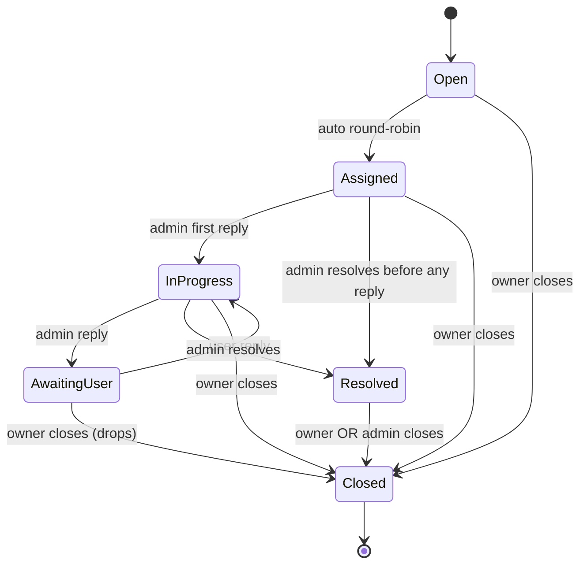

# TASK 4 — Support Tickets (Create / Messages / Close / Admin Assign+Resolve)

> **Owner:** Fadwa (Intermediate) — **Hours:** 32h — **Hard deadline:** Sun **2027-01-03 17:00**
> **Earliest start:** Wed 2026-12-02 09:00 (parallel with T3)
> **Endpoints:** 7 HTTP
> **Depends on:** PW-1..PW-7, T1 inbox handlers (uses `messaging.ticket.created.v1` for admin notification)

---

## Endpoint List

| # | Method | Path | Permission |
|---|---|---|---|
| 1 | POST | `/api/v1/support/tickets` | `MustHavePermission(SupportTicket, Create)` + ICurrentUser |
| 2 | GET | `/api/v1/support/tickets` | `MustHavePermission(SupportTicket, Read)` + ICurrentUser self-filter |
| 3 | GET | `/api/v1/support/tickets/{id}` | `MustHavePermission(SupportTicket, Read)` + ownership OR Admin |
| 4 | POST | `/api/v1/support/tickets/{id}/close` | `MustHavePermission(SupportTicket, Close)` + ownership OR Admin |
| 5 | POST | `/api/v1/support/tickets/{id}/messages` | `MustHavePermission(SupportTicket, Update)` + ownership OR Admin |
| 6 | POST | `/api/v1/support/admin/tickets/{id}/assign` | `MustHavePermission(AdminSupportQueue, Assign)` |
| 7 | POST | `/api/v1/support/admin/tickets/{id}/resolve` | `MustHavePermission(AdminSupportQueue, Resolve)` |

(GET `/support/admin/tickets` for list is reused via #2 with admin filter — endpoint #2 detects admin role and removes self-filter.)

---

## Workflow

```
POST /support/tickets                  → SupportTicket.Create
  ↓ TicketCreated domain event
  → emit messaging.ticket.created.v1 → admin group SignalR notification
  → round-robin auto-assign (within 5s — same SaveChanges via separate handler)
  ↓ TicketAssigned domain event
  → emit messaging.ticket.assigned.v1 → notify assignee + audit log

POST /support/tickets/{id}/messages    → SupportTicket.AddMessage(authorId, body, isInternal=false)
  ↓ TicketMessageAdded
  → SignalR push to ticket owner (if message author = admin) OR admin group (if author = user)

POST /support/admin/tickets/{id}/assign → SupportTicket.AssignTo(newAdminId)
  ↓ TicketAssigned
  → SignalR + email to new admin

POST /support/admin/tickets/{id}/resolve → SupportTicket.Resolve(notes)
  ↓ TicketResolved
  → emit messaging.ticket.resolved.v1 → Analytics SLA breach calc → user notification "Resolved"

POST /support/tickets/{id}/close       → SupportTicket.Close()
  ↓ TicketClosed (intra-module)
  → SignalR final state push; ticket frozen, no more messages
```

---

## Domain Methods

| Method | Raises | Notes |
|---|---|---|
| `Create(userId, category, subject, body)` factory | TicketCreated | Priority auto = `category.GetDefaultPriority()`; SlaBreachAt = now + slaHours from config (M-R8); Status=Open |
| `AssignTo(adminUserId, assignedBy)` | TicketAssigned | Status Open → Assigned; AssignedToUserId stamped; AssignedAt stamped |
| `AddMessage(authorId, body, isInternal)` | TicketMessageAdded | Status Assigned → InProgress on first admin reply (auto-progress); Status InProgress → AwaitingUser on admin reply / InProgress on user reply |
| `Resolve(resolvedBy, notes)` | TicketResolved | Status → Resolved; ResolvedAt stamped; ResolvedByUserId stamped; ResolutionNotes ≥ 10 chars |
| `Close()` | TicketClosed | Status → Closed; only from Resolved or by owner from any state; ClosedAt stamped |

**State machine** (Mermaid):



---

## Round-Robin Auto-Assignment

`Messaging.Infrastructure/Services/RoundRobinAdminAssignmentService.cs`:

```csharp
public sealed class RoundRobinAdminAssignmentService(
    IAdminAssignmentRosterRepository roster,
    IDateTimeProvider clock,
    ILogger<...> logger) : IAdminAssignmentService
{
    public async Task<Guid?> PickNextAdminAsync(CancellationToken ct)
    {
        // Atomic SQL: SELECT TOP 1 AdminUserId, UPDATE LastAssignedAt = now, OUTPUT inserted.AdminUserId
        // Where IsOnLeave = 0 AND IsActive = 1, ORDER BY LastAssignedAt ASC
        var sql = """
            UPDATE TOP (1) support.AdminAssignmentRoster WITH (UPDLOCK, READPAST)
            SET LastAssignedAt = SYSUTCDATETIME()
            OUTPUT inserted.AdminUserId
            WHERE IsOnLeave = 0 AND IsActive = 1
              AND AdminUserId = (
                  SELECT TOP 1 AdminUserId
                  FROM support.AdminAssignmentRoster WITH (UPDLOCK, READPAST)
                  WHERE IsOnLeave = 0 AND IsActive = 1
                  ORDER BY LastAssignedAt ASC, AdminUserId ASC
              )
            """;
        var picked = await roster.ExecuteRoundRobinAsync(sql, ct);
        if (picked is null)
            logger.LogError("RoundRobin: No active admins available — ticket will stay Open");
        return picked;
    }
}
```

**Domain event handler `TicketCreatedAutoAssignHandler`** subscribes to `TicketCreatedDomainEvent`:
1. Calls `IAdminAssignmentService.PickNextAdminAsync`.
2. Calls `ticket.AssignTo(adminId, assignedBy: System)`.
3. NO `SaveChangesAsync` — UoW commits at outer Create handler's boundary (PIGGYBACK per agent-context Gotcha #2).

If `PickNextAdminAsync` returns null → log error, ticket stays Open → admin manually assigns later via endpoint #6.

---

## Validator

`CreateSupportTicketCommandValidator`:
- `Category` valid enum
- `Subject` 10-200 chars
- `Body` 20-5000 chars

`PostTicketMessageCommandValidator`:
- `Body` 1-5000 chars
- `IsInternal` only true if author is admin (handler-side check, not validator)

`ResolveTicketCommandValidator`:
- `ResolutionNotes` 10-2000 chars

---

## Auth Matrix Detail

| Endpoint | Self vs admin distinction |
|---|---|
| #1 POST create | Anyone authenticated |
| #2 GET list | User: only own (where CreatedByUserId = me). Admin: all (with filters) |
| #3 GET by id | Owner OR Admin OR assigned admin |
| #4 POST close | Owner OR Admin |
| #5 POST messages | Owner OR Admin (IsInternal only allowed if Admin) |
| #6 POST admin/assign | Admin only |
| #7 POST admin/resolve | Admin only (must be assigned to ticket OR have AdminSupportQueue.Resolve on entire queue) |

---

## Cache Strategy

| Query | Tag | TTL |
|---|---|---|
| `GET /support/tickets?...` (user list) | `support-tickets:user:{userId}` | 30s |
| `GET /support/tickets?...` (admin list) | `support-tickets:admin` | 30s |
| `GET /support/tickets/{id}` | `support-ticket:{id}` | 1min |

Invalidate on all 4 mutation endpoints.

---

## WBS (32h)

| # | Step | Hours | Finish-by |
|---|---|---|---|
| 1 | SupportTicket aggregate state machine + 4 domain methods + tests | 6 | 2026-12-08 |
| 2 | TicketMessage owned + AddMessage method + tests | 2 | 2026-12-10 |
| 3 | RoundRobinAdminAssignmentService + atomic SQL + tests | 4 | 2026-12-13 |
| 4 | 7 endpoints + commands/queries/handlers/validators/DTOs | 10 | 2026-12-20 |
| 5 | TicketCreatedAutoAssignHandler in-process domain event handler | 2 | 2026-12-23 |
| 6 | Cache wiring | 1 | 2026-12-26 |
| 7 | Integration tests (state machine, auto-assign, SLA stamping) | 5 | 2026-12-30 |
| 8 | PR fixes | 2 | 2027-01-03 |
| **Total** | | **32h** | **Sun 2027-01-03** |

---

## Acceptance Tests

1. POST ticket Category=PaymentProblem → Priority=High, SlaBreachAt = now+4h.
2. POST ticket Category=AccountHelp → Priority=Low, SlaBreachAt = now+24h.
3. POST ticket → TicketCreatedDomainEvent → auto-assign handler picks oldest admin → Status=Assigned in same SaveChanges.
4. POST ticket while no admins active → Status stays Open + warning logged.
5. POST admin/assign → state Open/Assigned → Assigned (re-assigns); state Resolved → 422 (cannot reassign closed).
6. POST messages by user → Status InProgress (if admin had replied) OR no transition if before admin first reply.
7. POST messages with `isInternal=true` by non-admin → 403.
8. POST admin/resolve without ResolutionNotes → 400.
9. POST admin/resolve → Status → Resolved + TicketResolved event → user notified (via T1 inbox handler chain).
10. POST close on Resolved → Status → Closed.
11. POST close on Open by non-owner non-admin → 403.
12. POST messages on Closed ticket → 422 `SupportTicket.AlreadyClosed`.
13. Round-robin: 3 admins, post 6 tickets → each admin gets exactly 2.
14. `SELECT TOP 1` admin pick is atomic — no double-assignment under concurrent loads (5 simultaneous POST /tickets).
15. SLA-sorted admin queue: `GET /support/admin/tickets` returns oldest SlaBreachAt first.
