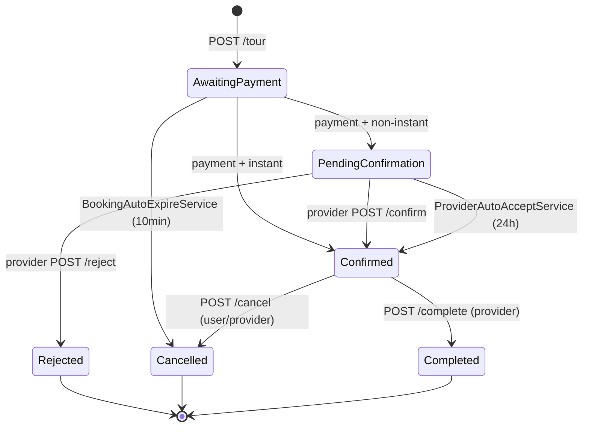

# Mohammad — Booking Sprint Tasks

> **Sprint window:** Mon 2026-06-15 → Thu 2026-08-13
> **Owner:** Mohammad (Intermediate, sprint lead)
> **Tasks:** TASK 4 (Booking Engine) + TASK 5 (Confirm/Reject/Cancel)
> **Total endpoints:** 9
> **Estimated hours:** 80

---

## Table of Contents

- [Sprint Deadlines](#sprint-deadlines)
- [Mohammad's Endpoints](#mohammads-endpoints)
- [Integration Events](#integration-events)
- [Pre-Work Kickoff Briefing](#pre-work-kickoff-briefing)
- [Critical Rules (Booking-Specific)](#critical-rules)
- [TASK 4 — Booking Engine](#task-4--booking-engine)
- [TASK 5 — Confirm / Reject / Cancel / Complete](#task-5--confirm--reject--cancel--complete)

---

## Sprint Deadlines

| Milestone | Date | Time |
|---|---|---|
| Pre-work merge deadline | Tue **2026-06-16** | 17:00 |
| Earliest feature start | Wed **2026-06-17** | 09:00 |
| TASK 4 earliest start | Tue **2026-06-30** | (after TASK 1 + TASK 2 merge) |
| Mid-sprint integration freeze | Sun **2026-07-19** | 17:00 |
| **TASK 4 hard PR deadline** | Wed **2026-07-29** | 17:00 |
| TASK 5 earliest start | Thu **2026-07-23** | (after TASK 4 mostly merged) |
| **TASK 5 hard PR deadline** | Mon **2026-08-03** | 17:00 |
| Hard PR cutoff (all) | Wed **2026-08-12** | 17:00 |
| Hard merge-to-main cutoff | Thu **2026-08-13** | 17:00 |

---

## Mohammad's Endpoints

| Task | # | Method + Path | Permission | Notes |
|---|---|---|---|---|
| TASK 4 | 1 | `POST /api/v1/booking/tour` | `TourBooking + Create` | 5-step engine |
| TASK 4 | 2 | `GET /api/v1/booking/{id}` | `TourBooking + Read` | owner OR provider OR admin |
| TASK 4 | 3 | `GET /api/v1/booking/my-bookings` | `TourBooking + Read` | cursor paginated |
| TASK 4 | 4 | `GET /api/v1/booking/admin/all` | `AdminBookingDashboard + Read` | admin only |
| TASK 5 | 5 | `POST /api/v1/booking/{id}/confirm` | `TourBooking + Approve` | provider of tour |
| TASK 5 | 6 | `POST /api/v1/booking/{id}/reject` | `TourBooking + Reject` | provider of tour |
| TASK 5 | 7 | `POST /api/v1/booking/{id}/cancel` | `TourBooking + Cancel` | user OR provider |
| TASK 5 | 8 | `POST /api/v1/booking/{id}/complete` | `TourBooking + Update` | provider of tour |
| TASK 5 | 9 | `POST /api/v1/admin/bookings/{id}/force-refund` | `AdminBookingDashboard + Update` | admin force-majeure |

---

## Integration Events

Mohammad's tasks emit (all registered in `IntegrationEventTypeRegistry`):

| Logical name | Trigger | Key payload fields |
|---|---|---|
| `booking.tour-booking.created.v1` | TASK 4 Step 4 (booking row inserted, AwaitingPayment) | bookingId, tourId, userId, slotId, currency, totalAmount, participantCount, providerId |
| `booking.tour-booking.confirmed.v1` | TASK 5 provider confirm OR finance webhook (instant) | bookingId, confirmedAt, tourId, userId, confirmationSource |
| `booking.tour-booking.cancelled.v1` | TASK 5 POST /{id}/cancel | bookingId, cancelledBy, reason, refundAmount, refundCurrency |
| `booking.tour-booking.completed.v1` | TASK 5 POST /{id}/complete | bookingId, tourId, userId, providerId, completedAt |
| `booking.tour-booking.rejected.v1` | TASK 5 POST /{id}/reject | bookingId, rejectionReason, providerId |

Downstream consumers:
- `booking.tour-booking.created.v1` → Finance (pre-creates Payment row), Analytics
- `booking.tour-booking.confirmed.v1` → Messaging (notification), Finance (escrow), Analytics
- `booking.tour-booking.cancelled.v1` → Messaging, Finance (initiate refund), Analytics
- `booking.tour-booking.completed.v1` → Social (review window), Finance (payout eligible), Analytics
- `booking.tour-booking.rejected.v1` → Messaging, Finance (auto-full-refund), Analytics

---

## Pre-Work Kickoff Briefing

> Sprint window: 2026-06-15 → 08-13 (Wave 5). Owner: Mohammad.

### What's already wired (do NOT redo)

- `IBookingUnitOfWork` interface + `BookingUnitOfWork` delegate (no domain-event bypass risk).
- 6 aggregates marked `IAggregateRoot`: TourBooking, AvailabilitySlot, RefundPolicy, JoinRequest, ProviderDocument, SlotLock.
- 14 domain event records in `Booking.Domain/Events/` (TourBookingCreated/Confirmed/Cancelled/Completed/Rejected/PaymentExpired, SlotLockCreated/Released, AvailabilitySlotCapacityChanged, JoinRequestCreated/Approved/Rejected, ProviderDocumentExpiring/Expired).
- 12 integration event records in `Booking.Contracts/IntegrationEvents/` registered in `IntegrationEventTypeRegistry` with keys `booking.{aggregate}.{action}.v1`.
- 7 repository interfaces in `Booking.Domain/Repositories/` + 7 EF stubs in `Booking.Infrastructure/Repositories/`: ITourBookingRepository, IAvailabilitySlotRepository, IRefundPolicyRepository, IJoinRequestRepository, IProviderDocumentRepository, ISlotLockRepository, IBookingOutboxWriter.
- `ICommissionLookupService` + `CommissionResult` record in `Finance.Contracts/Services/` (stub `CommissionLookupService` returns Rate=0.10m).
- `BookingFeatures` (8 features) + `BookingPermissionCatalog` (26 perms) registered as `IPermissionCatalog` singleton in DI.
- Test projects: `tests/Booking.Tests.Unit/` + `tests/Booking.IntegrationTests/` in YallaJo.sln, build green.

### Day-0 sprint tasks

1. **Create EF migration** `BookingAddAggregateRootAndAuditMembers` — schema-no-op but locks in the marker change history.
2. **Replace stub `CommissionLookupService`** with the real Finance-side implementation (table-lookup against `CommissionRule` aggregate).
3. **Wire endpoints** under `Booking.Presentation/Endpoints/` — every endpoint must carry `[MustHavePermission(BookingFeatures.X, AppAction.Y)]` or `[AllowAnonymous]`.
4. **Implement repository methods** beyond the stub (the EF stubs ship with empty domain-specific methods; sprint adds query bodies).

### Watchpoints

- `AvailabilitySlot.RowVersion` is the optimistic concurrency token for slot capacity. Use `IAvailabilitySlotRepository.GetByIdWithLockAsync` (already declared) and let EF surface `DbUpdateConcurrencyException` → translate to `Result.Conflict`.
- `BookingOutboxWriter` requires `where TEvent : IIntegrationEvent` — pass strongly-typed integration events; do not stringly invoke.

---

## Critical Rules

> These apply to ALL code Mohammad writes. Violations = PR rejection.

### B-R1 — Money & Currency (HARD)

- Currency is `string` ISO 4217, valid set = `{"JOD", "USD", "EUR"}`. Anything else → `Result.Failure<T>(new Error("TourBooking.UnsupportedCurrency", "..."), Outcome.Validation)`.
- All monetary fields are `decimal` with EF mapping `.HasPrecision(19, 4)`. **NEVER `double` or `float`**.
- The booking's currency is locked at Step 1 from the tour's currency. Never re-evaluated.

### B-R2 — Idempotency & Concurrency on Slot Capacity (HARDEST)

- `AvailabilitySlot.RowVersion` MUST be set on every aggregate. On `DbUpdateConcurrencyException`:
  1. Catch ONLY in Infrastructure.
  2. Translate to `Result.Failure<T>(new Error("AvailabilitySlot.CapacityConflict", "Slot was modified by another booking"), Outcome.Conflict)`.
  3. Endpoint returns 409.
- **POST /tour Step 2** decrements `AvailabilitySlot.AvailableCount` and creates the `SlotLock` row in the **SAME `SaveChangesAsync`**.

### B-R3 — Booking Reference Format (HARD)

- Format: `YJ-YYYYMMDD-XXXXXX` where `XXXXXX` is 6 chars from `[A-Z0-9]` excluding `O, 0, I, 1` (32-char base).
- Generated by `IBookingReferenceGenerator` using `RandomNumberGenerator.GetBytes` + retry-on-collision up to 5 times.
- Reference column has `UNIQUE INDEX`.

### B-R4 — Lead Time + Anti-Double-Booking (HARD)

- **MIN LEAD TIME = 2 hours** before tour start (`AvailabilitySlot.StartTime`).
- User cannot book the **same tour on the same date** twice (any non-cancelled booking blocks).
- User cannot exceed **3 concurrent `AwaitingPayment`** bookings.

### B-R5 — Refund Calculation (HARD)

- **PROVIDER-INITIATED CANCEL → ALWAYS 100% REFUND** regardless of policy.
- **USER-INITIATED CANCEL → walk RefundPolicy tiers** sorted by `HoursBeforeTour` DESC. First tier where `(slot.StartTime - now).TotalHours >= tier.HoursBeforeTour` wins.
- **FORCE MAJEURE (admin)** → `AdminForceFullRefundCommand`, bypasses policy, 100% always.
- Refund amount = `Math.Round(TotalAmount * refundPct / 100m, 2, MidpointRounding.ToEven)`.
- Refund does NOT release slot — slot is released by cancellation domain event handler only if booking held capacity.

### B-R6 — Provider Confirmation Window (HARD)

- `IsInstantBooking=true` → `AwaitingPayment → Confirmed` on payment webhook.
- `IsInstantBooking=false` → `AwaitingPayment → PendingConfirmation` on payment webhook.
- Provider has **24 hours** to confirm/reject before `ProviderAutoAcceptService` auto-confirms.

### B-R7 — Outbox Contract (HARD)

- Every state transition crossing module boundaries MUST raise a domain event with corresponding integration event in `Booking.Contracts/IntegrationEvents/`.
- **Never** emit `tour-booking.confirmed.v1` twice. Domain layer guards via state check.

### B-R10 — Pagination & Cursor (HARD)

- GET list endpoints use **cursor pagination** (not offset). Cursor = opaque base64-encoded `{Id, CreatedAt}` tuple, ordered DESC by CreatedAt then ASC by Id.
- Page size = `pageSize` clamped to `[1, 50]`, default 20.
- Response: `{ items: [...], nextCursor: "..." | null, totalCount?: number }`.

### B-R11 — Authorization Matrix (Mohammad's endpoints)

| Endpoint | Permission | Self-Ownership Check |
|---|---|---|
| `POST /tour` | `TourBooking + Create` | none |
| `GET /my-bookings` | `TourBooking + Read` | filters by `currentUser.UserId` |
| `GET /{id}` | `TourBooking + Read` | `booking.UserId == currentUser.UserId` OR `IsProviderOfTour` OR admin |
| `GET /admin/all` | `AdminBookingDashboard + Read` | none |
| `POST /{id}/cancel` | `TourBooking + Cancel` | `booking.UserId == currentUser.UserId` OR provider |
| `POST /{id}/confirm` | `TourBooking + Approve` | provider of tour |
| `POST /{id}/reject` | `TourBooking + Reject` | provider of tour |
| `POST /{id}/complete` | `TourBooking + Update` | provider of tour |

### B-R12 — Validation Rules (HARD)

- `ParticipantCount >= 1 AND <= AvailabilitySlot.AvailableCount`.
- Cancel reason (user): optional, ≤500 chars. Provider cancel reason: MANDATORY ≥10 chars, ≤500.
- Provider reject reason: MANDATORY ≥10 chars, ≤500.
- All `string` fields trimmed. Empty after trim → validation error.

### B-R13 — Error Codes (Mohammad's tasks)

| Code | Outcome | Where |
|---|---|---|
| `TourBooking.NotFound` | NotFound | GET /{id}, cancel, confirm, reject, complete |
| `TourBooking.UnsupportedCurrency` | Validation | POST /tour |
| `TourBooking.InvalidState` | Validation | confirm/cancel/reject on wrong status |
| `TourBooking.TooEarly` | Validation | POST /tour (lead time) |
| `TourBooking.DuplicateForDate` | Conflict | POST /tour |
| `TourBooking.ConcurrentLimit` | Conflict | POST /tour (3-max) |
| `TourBooking.OwnerMismatch` | Forbidden | GET /{id} (IDOR), cancel by non-owner |
| `TourBooking.BelowPlatformMinimum` | Validation | POST /tour (< 5 JOD) |
| `AvailabilitySlot.NotFound` | NotFound | POST /tour Step 1 |
| `AvailabilitySlot.CapacityExceeded` | Conflict | POST /tour Step 2 |
| `AvailabilitySlot.CapacityConflict` | Conflict | RowVersion collision |
| `Booking.ProviderSuspended` | Conflict | POST /tour |

> Endpoint MUST map Outcome → HTTP via `result.ToApiResult()` — no manual `Results.X(...)`.

---

## TASK 4 — Booking Engine

**Owner:** Mohammad (Intermediate, sprint lead)
**Endpoints:** 4
**Estimated hours:** 48 (WBS revised to 62)
**Earliest start:** Tue 2026-06-30 (after TASK 1 + TASK 2 merge)
**Hard PR deadline:** Wed 2026-07-29 17:00
**Dependencies:** TASK 1 (AvailabilitySlot domain methods), TASK 2 (RefundPolicy + ICommissionLookupService impl), PW-1..PW-8.

This is the largest single task in the sprint. It implements the core booking creation flow that everything else hangs off of.

---

### Endpoint list

| # | Method + Path | Permission | Returns | Errors |
|---|---|---|---|---|
| 1 | `POST /api/v1/booking/tour` | `TourBooking + Create` | 201 + `{id, reference, status, totalAmount, currency, expiresAt, paymentToken}` | 400, 403, 404, 409 (capacity, duplicate, concurrent limit, suspended provider), 422 (validation) |
| 2 | `GET /api/v1/booking/{id}` | `TourBooking + Read` (owner OR provider OR admin) | 200 + full DTO | 403, 404 |
| 3 | `GET /api/v1/booking/my-bookings` | `TourBooking + Read` (self, cursor paginated) | 200 + `{items, nextCursor}` | — |
| 4 | `GET /api/v1/booking/admin/all` | `AdminBookingDashboard + Read` | 200 + paginated, with filter query params | 403 |

---

### The 5-step POST /tour flow

```mermaid
flowchart TD
    A[POST /tour request] --> B[Step 1: Validate availability]
    B -->|fail| FAIL[Return 4xx]
    B -->|ok| C[Step 2: Lock slot (RowVersion + insert SlotLock)]
    C -->|conflict| FAIL
    C -->|ok| D[Step 3: Calculate pricing + commission + discount stub]
    D --> E[Step 4: Create TourBooking aggregate AwaitingPayment]
    E --> F[Step 5: Raise TourBookingCreated event, return reference + paymentToken]
    F --> G[Outbox: booking.tour-booking.created.v1]
    G --> H[Finance receives → creates Payment Pending → returns gateway URL]
```

### Step 1 — Validate availability

Reads:
- `BookingTourSnapshot` for `tourId`: must exist, `IsActive=true`, `Status=Approved`.
- `BookingProviderSnapshot` for `tour.ProviderId`: must exist, `Status != Suspended`. If suspended → `Result.Failure(new Error("Booking.ProviderSuspended", "Provider is suspended"), Outcome.Conflict)`.
- `AvailabilitySlot` for `tourId + date + slotId`: must exist, `IsActive=true`, `AvailableCount >= participantCount`.
- Lead time: `(slot.StartTime - DateTime.UtcNow).TotalHours >= 2`. Else `TourBooking.TooEarly`.
- Duplicate check: `ITourBookingRepository.HasActiveBookingForTourOnDateAsync(userId, tourId, slot.Date)` → false. Else `TourBooking.DuplicateForDate`.
- Concurrent unpaid check: `ITourBookingRepository.CountActiveAwaitingPaymentByUserAsync(userId) < 3`. Else `TourBooking.ConcurrentLimit`.

### Step 2 — Lock slot (transactional)

```csharp
// Inside command handler, wrap in execution strategy + transaction
await using var tx = await context.Database.BeginTransactionAsync(ct);
try
{
    var slot = await slots.GetForUpdateAsync(cmd.SlotId, ct); // includes RowVersion
    var lockResult = slot.Lock(cmd.ParticipantCount);
    if (lockResult.IsFailure) { await tx.RollbackAsync(ct); return Result.Failure<...>(lockResult.Error, lockResult.Outcome); }

    var slotLock = SlotLock.Create(
        userId: currentUser.UserId,
        availabilitySlotId: slot.Id,
        bookingId: null, // not yet known
        ttl: TimeSpan.FromMinutes(10)
    );

    slots.Update(slot);
    slotLocks.Add(slotLock);

    // Continue with steps 3+4 BEFORE commit so all 4 atomically saved
    var booking = ... // step 3+4 create
    bookings.Add(booking);

    await uow.SaveChangesAsync(ct); // raises 1+ domain events + writes outbox row + commits
    await tx.CommitAsync(ct);
}
catch (DbUpdateConcurrencyException) // RowVersion mismatch on AvailabilitySlot
{
    await tx.RollbackAsync(ct);
    return Result.Failure<...>(new Error("AvailabilitySlot.CapacityConflict", "Slot was modified by another booking"), Outcome.Conflict);
}
```

### Step 3 — Calculate pricing

```csharp
// Inputs
var tier = await pricingSnapshots.GetByTourAndTypeAsync(tourId, TierType.Adult, ct);
var basePricePerAdult = tier?.Price ?? snapshot.BasePrice; // fallback to tour base if no tier

var lineItems = new List<BookingLineItem>
{
    new(TierType.Adult, count: cmd.AdultCount, unitPrice: basePricePerAdult, currency: snapshot.Currency)
};

if (cmd.ChildCount > 0)
{
    var childTier = await pricingSnapshots.GetByTourAndTypeAsync(tourId, TierType.Child, ct)
        ?? throw new InvalidOperationException("ChildCount > 0 but no Child pricing tier configured.");
    lineItems.Add(new(TierType.Child, cmd.ChildCount, childTier.Price, snapshot.Currency));
}
// ... Infant, Senior, Group, Private similarly

var subtotal = lineItems.Sum(li => li.UnitPrice * li.Count);

// Discounts (stub for this sprint)
var discount = await discountEvaluator.EvaluateAsync(
    new DiscountEvaluationContext(currentUser.UserId, tourId, subtotal, snapshot.Currency, cmd.PromoCode),
    ct
);
var afterDiscount = subtotal - discount.AppliedAmount;

// Loyalty (stub — Finance sprint; for now skip)
var afterLoyalty = afterDiscount;

// Platform minimum 5 JOD enforcement (per PDF 2 §24)
if (snapshot.Currency == "JOD" && afterLoyalty < 5m)
    return Result.Failure<...>(new Error("TourBooking.BelowPlatformMinimum", "Final price must be >= 5 JOD"), Outcome.Validation);

// Commission breakdown (stamped onto booking; not exposed to user)
var commission = await commissions.GetCommissionForProviderAsync(snapshot.ProviderId, afterDiscount, snapshot.Currency, ct);

var pricing = new BookingPricing(
    Subtotal: subtotal,
    DiscountAmount: discount.AppliedAmount,
    LoyaltyAmount: 0m,
    TotalAmount: afterLoyalty,
    CommissionRate: commission.Rate,
    CommissionAmount: commission.Amount,
    Currency: snapshot.Currency,
    LineItems: lineItems
);
```

### Step 4 — Create TourBooking aggregate

```csharp
var reference = await referenceGenerator.GenerateAsync(ct);
var booking = TourBooking.Create(
    userId: currentUser.UserId,
    tourId: tourId,
    providerId: snapshot.ProviderId,
    availabilitySlotId: slot.Id,
    participantCount: cmd.ParticipantCount,
    pricing: pricing,
    reference: reference,
    refundPolicySnapshot: refundPolicyJsonSnapshot, // serialized to JSON column
    isInstantBooking: snapshot.IsInstantBooking,
    paymentExpiresAt: DateTime.UtcNow.AddMinutes(10)
);
// booking.Status = AwaitingPayment
// booking raises TourBookingCreatedDomainEvent (→ integration event)

bookings.Add(booking);
slotLock.AttachBookingId(booking.Id); // back-fill the FK on the lock

await uow.SaveChangesAsync(ct); // atomic
```

### Step 5 — Return payment token

The endpoint response includes a `paymentToken` placeholder `"PENDING_FINANCE_INTEGRATION"` for now. Once Finance sprint lands, Finance's `IPaymentGateway` returns a real token. Client must call `POST /payments/initiate` separately.

---

### Endpoint contracts

#### Request body for POST /tour

```json
{
  "tourId": "<guid>",
  "availabilitySlotId": "<guid>",
  "participantBreakdown": {
    "adult": 2,
    "child": 1,
    "infant": 0,
    "senior": 0
  },
  "promoCode": null,
  "loyaltyPointsToRedeem": 0
}
```

`participantCount` = sum of breakdown values.

#### Response 201

```json
{
  "id": "<guid>",
  "reference": "YJ-20260701-A7X3K9",
  "status": "AwaitingPayment",
  "tourId": "<guid>",
  "tourTitle": "Petra Half-Day Tour",
  "availabilitySlot": {
    "id": "<guid>",
    "date": "2026-07-15",
    "startTime": "09:00",
    "endTime": "13:00"
  },
  "participantCount": 3,
  "pricing": {
    "subtotal": 90.00,
    "discountAmount": 0.00,
    "loyaltyAmount": 0.00,
    "totalAmount": 90.00,
    "currency": "JOD",
    "lineItems": [
      { "tierType": "Adult", "count": 2, "unitPrice": 30.00 },
      { "tierType": "Child", "count": 1, "unitPrice": 30.00 }
    ]
  },
  "paymentExpiresAt": "2026-07-01T14:23:44Z",
  "paymentToken": "PENDING_FINANCE_INTEGRATION"
}
```

> Commission breakdown is NOT in the user-facing DTO. Stored on aggregate for payout calculation.

#### GET /{id}

Same shape minus `paymentToken`. Adds:
- `payments: [...]` (empty until Finance ships)
- `cancellation: { source, reason, refundAmount, refundedAt }` if cancelled
- `completion: { completedAt, completionSource }` if completed

#### GET /my-bookings query params

- `status?: BookingStatus` (one or many comma-separated)
- `fromDate?: date` / `toDate?: date` (slot date range)
- `tourId?: guid`
- `cursor?: string` / `pageSize?: int` (1..50)
- `countTotal?: bool` (default false)

#### GET /admin/all query params

Same as my-bookings PLUS:
- `userId?: guid`
- `providerId?: guid`
- `paymentStatus?: string`

---

### Domain method: `TourBooking.Create`

```csharp
public static TourBooking Create(
    Guid userId,
    Guid tourId,
    Guid providerId,
    Guid availabilitySlotId,
    int participantCount,
    BookingPricing pricing,
    BookingReference reference,
    string refundPolicySnapshot,
    bool isInstantBooking,
    DateTime paymentExpiresAt)
{
    if (participantCount < 1) throw new DomainInvariantException("ParticipantCount must be at least 1.");
    if (pricing.TotalAmount <= 0) throw new DomainInvariantException("TotalAmount must be positive.");

    var booking = new TourBooking
    {
        Id = Guid.CreateVersion7(),
        UserId = userId,
        TourId = tourId,
        ProviderId = providerId,
        AvailabilitySlotId = availabilitySlotId,
        ParticipantCount = participantCount,
        Subtotal = pricing.Subtotal,
        DiscountAmount = pricing.DiscountAmount,
        LoyaltyAmount = pricing.LoyaltyAmount,
        TotalAmount = pricing.TotalAmount,
        Currency = pricing.Currency,
        CommissionRate = pricing.CommissionRate,
        CommissionAmount = pricing.CommissionAmount,
        LineItemsJson = JsonSerializer.Serialize(pricing.LineItems),
        Reference = reference.Value,
        RefundPolicySnapshot = refundPolicySnapshot,
        IsInstantBooking = isInstantBooking,
        Status = BookingStatus.AwaitingPayment,
        PaymentExpiresAt = paymentExpiresAt
    };

    booking.RaiseDomainEvent(new TourBookingCreatedDomainEvent(
        booking.Id, booking.UserId, booking.TourId, booking.ProviderId,
        booking.AvailabilitySlotId, booking.ParticipantCount, booking.TotalAmount,
        booking.Currency, booking.Reference, booking.IsInstantBooking
    ));

    return booking;
}
```

---

### Cache

- `GET /my-bookings` → `ICacheableQuery` tag `"bookings:user:{userId}"`, TTL 1 min.
- `GET /{id}` → tag `"booking:{id}"`, TTL 5 min.
- `GET /admin/all` → tag `"bookings:admin"`, TTL 30s.
- POST /tour invalidates: `bookings:user:{userId}`, `availability:tour:{tourId}`, `availability:tour:{tourId}:date:{date}`.

---

### Validators

```csharp
RuleFor(x => x.TourId).NotEmpty();
RuleFor(x => x.AvailabilitySlotId).NotEmpty();
RuleFor(x => x.ParticipantBreakdown.Adult).GreaterThanOrEqualTo(1).WithMessage("At least one adult required.");
RuleFor(x => x.ParticipantBreakdown.Child).GreaterThanOrEqualTo(0);
RuleFor(x => x.ParticipantBreakdown.Infant).GreaterThanOrEqualTo(0);
RuleFor(x => x.ParticipantBreakdown.Senior).GreaterThanOrEqualTo(0);
RuleFor(x => x.PromoCode).MaximumLength(20).Matches("^[A-Z0-9]+$").When(x => !string.IsNullOrEmpty(x.PromoCode));
RuleFor(x => x.LoyaltyPointsToRedeem).GreaterThanOrEqualTo(0);
RuleFor(x => x).Custom((cmd, ctx) =>
{
    var total = cmd.ParticipantBreakdown.Adult + cmd.ParticipantBreakdown.Child + cmd.ParticipantBreakdown.Infant + cmd.ParticipantBreakdown.Senior;
    if (total < 1) ctx.AddFailure("ParticipantCount must be >= 1.");
    if (total > 100) ctx.AddFailure("ParticipantCount cannot exceed 100.");
});
```

---

### WBS

| Step | Sub-deliverable | Hours | Finish-by |
|---|---|---|---|
| 1 | Refactor `TourBooking.cs` aggregate: `Create` factory + properties + computed (no state-change methods yet — those in TASK 5) | 4 | Tue 2026-06-30 EOD |
| 2 | Implement `BookingReference` value object + `IBookingReferenceGenerator` interface + impl with collision retry | 3 | Wed 2026-07-01 EOD |
| 3 | Implement `BookingPricing` record + `BookingLineItem` record + JSON serialization | 2 | Wed 2026-07-01 EOD |
| 4 | Implement `ITourBookingRepository` extensions: `HasActiveBookingForTourOnDateAsync`, `CountActiveAwaitingPaymentByUserAsync`, `GetByReferenceAsync` | 3 | Thu 2026-07-02 EOD |
| 5 | Migration `BookingAddTourBookingReferenceIndex` + decimal precision on all money columns + JSON columns for RefundPolicySnapshot + LineItemsJson | 2 | Fri 2026-07-03 EOD |
| 6 | `CreateTourBookingCommand` + `CreateTourBookingCommandValidator` + handler skeleton (no Step 2 yet) | 4 | Mon 2026-07-06 EOD |
| 7 | Handler Step 1 validation (snapshot lookups, lead time, dupes, concurrent limit) + 6 unit tests | 5 | Tue 2026-07-07 EOD |
| 8 | Handler Step 2 (transaction + RowVersion + SlotLock create + concurrency-conflict translation) + 4 unit tests | 6 | Thu 2026-07-09 EOD |
| 9 | Handler Step 3 (pricing calc + commission lookup + discount stub + minimum-5-JOD enforcement) + 5 unit tests | 5 | Mon 2026-07-13 EOD |
| 10 | Handler Step 4 (TourBooking.Create + outbox event + UoW.SaveChanges) + integration test (event published) | 3 | Wed 2026-07-15 EOD |
| 11 | Endpoint `POST /api/v1/booking/tour` + DTO mapping + cache invalidation | 2 | Wed 2026-07-15 EOD |
| 12 | `GetTourBookingByIdQuery` (cache + IDOR guard) + endpoint + 3 unit tests | 3 | Fri 2026-07-17 EOD |
| 13 | `GetMyBookingsQuery` (cursor paginated, filters) + endpoint + 3 unit tests | 4 | Mon 2026-07-20 EOD |
| 14 | `GetAllBookingsQuery` (admin, more filters) + endpoint + 2 unit tests | 3 | Tue 2026-07-21 EOD |
| 15 | DI registration in `BookingDependencyInjection.cs` for all new repos + services + reference generator | 1 | Tue 2026-07-21 EOD |
| 16 | Integration test: full POST /tour happy path → DB has booking + slot decremented + lock created + outbox row | 3 | Thu 2026-07-23 EOD |
| 17 | Integration test: concurrent POST /tour for same slot (two parallel requests, only one succeeds, other gets 409) | 3 | Fri 2026-07-24 EOD |
| 18 | Code review cycle (anticipate 2 rounds given complexity) | 6 | Wed 2026-07-29 EOD |
| **Sum** | | **62** | |

> Estimate at 48 was optimistic. Revised to 62. If sprint cap is binding, defer GET /admin/all to TASK 5's WBS as bonus.

---

### Edge cases acceptance tests

| # | Case | Expected |
|---|---|---|
| 1 | Happy path: 2 adults, instant booking, sufficient capacity | 201, Status=AwaitingPayment, slot LockedCount+=2 |
| 2 | Slot fully booked | 409 CapacityExceeded |
| 3 | Tour suspended (snapshot.IsActive=false) | 404 NotFound |
| 4 | Provider suspended | 409 Booking.ProviderSuspended |
| 5 | User has 3 AwaitingPayment | 409 ConcurrentLimit |
| 6 | User has 2 AwaitingPayment + 1 Cancelled | 201 (Cancelled doesn't count) |
| 7 | Same user books same tour same date twice | 409 DuplicateForDate |
| 8 | Tour starts in 1h 50min | 409 TooEarly |
| 9 | Two parallel POST /tour for last seat | one 201, other 409 CapacityConflict |
| 10 | ChildCount=1 but tour has no Child pricing tier | 400 InvalidPricingConfiguration |
| 11 | Subtotal 4.99 JOD after discount | 400 BelowPlatformMinimum |
| 12 | Owner GETs by id | 200 |
| 13 | Non-owner GETs by id | 403 OwnerMismatch |
| 14 | Provider GETs own tour's booking by id | 200 |
| 15 | Reference is YJ-20260701-XXXXXX format (6 chars, base32 excluding O/0/I/1) | regex match |
| 16 | RowVersion collision recovered → second POST returns 409 CapacityConflict | 409 CapacityConflict |

---

### Files Mohammad touches (TASK 4)

```
Booking.Domain/Entities/TourBooking.cs                            (refactor + Create factory)
Booking.Domain/ValueObjects/BookingReference.cs                    (new)
Booking.Domain/ValueObjects/BookingPricing.cs                      (new record)
Booking.Domain/ValueObjects/BookingLineItem.cs                     (new record)
Booking.Domain/Events/TourBookingCreatedDomainEvent.cs             (PW-3 verify)
Booking.Application/Commands/CreateTourBooking/CreateTourBookingCommand.cs
Booking.Application/Commands/CreateTourBooking/CreateTourBookingCommandValidator.cs
Booking.Application/Commands/CreateTourBooking/CreateTourBookingCommandHandler.cs
Booking.Application/Queries/GetTourBookingById/...
Booking.Application/Queries/GetMyBookings/...
Booking.Application/Queries/GetAllBookings/...
Booking.Application/Interfaces/IBookingReferenceGenerator.cs        (new)
Booking.Application/Interfaces/ITourBookingRepository.cs            (extend)
Booking.Infrastructure/Services/BookingReferenceGenerator.cs        (new)
Booking.Infrastructure/Repositories/TourBookingRepository.cs
Booking.Infrastructure/Persistence/Configurations/TourBookingConfiguration.cs (RowVersion + JSON cols + indexes)
Booking.Infrastructure/Migrations/{timestamp}_BookingAddTourBookingReferenceIndex.cs
Booking.Presentation/Endpoints/TourBookingEndpoints.cs              (new sub-file)
Booking.Presentation/BookingEndpoints.cs                            (wire-up)
tests/Booking.Tests.Unit/Commands/CreateTourBooking_Step1_ValidationTests.cs
tests/Booking.Tests.Unit/Commands/CreateTourBooking_Step2_LockTests.cs
tests/Booking.Tests.Unit/Commands/CreateTourBooking_Step3_PricingTests.cs
tests/Booking.Tests.Unit/Commands/CreateTourBooking_Step4_CreateTests.cs
tests/Booking.Tests.Unit/Services/BookingReferenceGeneratorTests.cs
tests/Booking.IntegrationTests/TourBookingPostRoundTripTests.cs
tests/Booking.IntegrationTests/TourBookingConcurrencyTests.cs
```

---

## TASK 5 — Confirm / Reject / Cancel / Complete

**Owner:** Mohammad (Intermediate)
**Endpoints:** 5
**Estimated hours:** 28 (WBS revised to 32)
**Earliest start:** Thu 2026-07-23 (after TASK 4 mostly merged)
**Hard PR deadline:** Mon 2026-08-03 17:00
**Dependencies:** TASK 4 (TourBooking aggregate exists + AwaitingPayment can be created).

---

### Endpoint list

| # | Method + Path | Permission | Purpose |
|---|---|---|---|
| 1 | `POST /api/v1/booking/{id}/confirm` | `TourBooking + Approve` (provider of tour) | Provider confirms PendingConfirmation booking |
| 2 | `POST /api/v1/booking/{id}/reject` | `TourBooking + Reject` (provider of tour) | Provider rejects; triggers auto full refund |
| 3 | `POST /api/v1/booking/{id}/cancel` | `TourBooking + Cancel` (user OR provider) | User OR provider initiates cancellation |
| 4 | `POST /api/v1/booking/{id}/complete` | `TourBooking + Update` (provider of tour) | Mark tour completed after start time |
| 5 | `POST /api/v1/admin/bookings/{id}/force-refund` | `AdminBookingDashboard + Update` | Admin force-majeure full refund override |

---

### State machine (booking)



> **Disputed transitions are OUT OF SCOPE** (Phase 3 Dispute sprint owns them). All methods throw `InvalidStateError` if called on Disputed.

---

### Domain methods (added to `TourBooking.cs` in this task)

```csharp
public Result Confirm(ConfirmationSource source)
{
    if (Status != BookingStatus.AwaitingPayment && Status != BookingStatus.PendingConfirmation)
        return Result.Failure(new Error("TourBooking.InvalidState", $"Cannot confirm from state {Status}."), Outcome.Validation);

    Status = BookingStatus.Confirmed;
    ConfirmedAt = DateTime.UtcNow;
    ConfirmationSource = source;
    MarkUpdated();
    RaiseDomainEvent(new TourBookingConfirmedDomainEvent(Id, UserId, TourId, ProviderId, ConfirmedAt.Value, source));
    return Result.Success();
}

public Result MoveToPendingConfirmation()
{
    // Called by finance.payment.completed.v1 inbox handler when IsInstantBooking=false
    if (Status != BookingStatus.AwaitingPayment)
        return Result.Failure(new Error("TourBooking.InvalidState", $"Cannot move to PendingConfirmation from {Status}."), Outcome.Validation);
    if (IsInstantBooking)
        return Result.Failure(new Error("TourBooking.InvalidState", "Instant booking should not enter PendingConfirmation."), Outcome.Validation);

    Status = BookingStatus.PendingConfirmation;
    MarkUpdated();
    return Result.Success(); // no domain event; transitions visible via Confirmed/Rejected events later
}

public Result Reject(string reason)
{
    if (Status != BookingStatus.PendingConfirmation)
        return Result.Failure(new Error("TourBooking.InvalidState", $"Cannot reject from state {Status}."), Outcome.Validation);
    if (string.IsNullOrWhiteSpace(reason) || reason.Length < 10)
        return Result.Failure(new Error("TourBooking.RejectionReasonRequired", "Rejection reason must be at least 10 chars."), Outcome.Validation);

    Status = BookingStatus.Rejected;
    RejectedAt = DateTime.UtcNow;
    RejectionReason = reason;
    MarkUpdated();
    var refundAmount = TotalAmount; // provider rejection → automatic full refund
    RaiseDomainEvent(new TourBookingRejectedDomainEvent(Id, UserId, TourId, ProviderId, RejectedAt.Value, reason, refundAmount, Currency));
    return Result.Success();
}

public Result Cancel(BookingCancellationContext ctx, decimal? overrideRefundPercentage, TimeSpan timeUntilTour)
{
    if (Status is BookingStatus.Cancelled or BookingStatus.Rejected or BookingStatus.Completed)
        return Result.Failure(new Error("TourBooking.InvalidState", $"Cannot cancel from state {Status}."), Outcome.Validation);

    if (ctx.Source == CancellationSource.Provider && (string.IsNullOrWhiteSpace(ctx.Reason) || ctx.Reason.Length < 10))
        return Result.Failure(new Error("TourBooking.CancellationReasonRequired", "Provider cancellation reason must be at least 10 chars."), Outcome.Validation);

    decimal refundPct;
    if (ctx.ProviderInitiated || ctx.ForceMajeureOverride)
        refundPct = 100m; // provider/force majeure ALWAYS 100%
    else if (overrideRefundPercentage.HasValue)
        refundPct = overrideRefundPercentage.Value;
    else
        refundPct = 100m; // fallback

    var refundAmount = Math.Round(TotalAmount * refundPct / 100m, 2, MidpointRounding.ToEven);

    Status = BookingStatus.Cancelled;
    CancelledAt = DateTime.UtcNow;
    CancellationSource = ctx.Source;
    CancellationReason = ctx.Reason;
    RefundAmount = refundAmount;
    MarkUpdated();
    RaiseDomainEvent(new TourBookingCancelledDomainEvent(Id, UserId, TourId, ProviderId, CancelledAt.Value, ctx.Source, ctx.Reason, refundAmount, Currency));
    return Result.Success();
}

public Result Complete(Guid completedByUserId)
{
    if (Status != BookingStatus.Confirmed)
        return Result.Failure(new Error("TourBooking.InvalidState", $"Cannot complete from state {Status}."), Outcome.Validation);

    Status = BookingStatus.Completed;
    CompletedAt = DateTime.UtcNow;
    CompletedByUserId = completedByUserId;
    MarkUpdated();
    RaiseDomainEvent(new TourBookingCompletedDomainEvent(Id, UserId, TourId, ProviderId, CompletedAt.Value));
    return Result.Success();
}

public Result MoveToAwaitingPaymentExpired()
{
    // Called by BookingAutoExpireService
    if (Status != BookingStatus.AwaitingPayment) return Result.Failure(new Error("TourBooking.InvalidState", ""), Outcome.Validation);
    Status = BookingStatus.Cancelled;
    CancelledAt = DateTime.UtcNow;
    CancellationSource = CancellationSource.System;
    CancellationReason = "Payment expired (no payment received within 10 minutes)";
    RefundAmount = 0m;
    MarkUpdated();
    RaiseDomainEvent(new TourBookingPaymentExpiredDomainEvent(Id, UserId, TourId, CancelledAt.Value));
    return Result.Success();
}
```

---

### Capacity restoration on cancel/reject/expire

```csharp
public sealed class RestoreSlotCapacityOnCancelHandler(IAvailabilitySlotRepository slots)
    : INotificationHandler<TourBookingCancelledDomainEvent>
{
    public async Task Handle(TourBookingCancelledDomainEvent notification, CancellationToken ct)
    {
        var slot = await slots.GetForUpdateAsync(notification.AvailabilitySlotId, ct);
        slot.Cancel(notification.ParticipantCount);
        slots.Update(slot);
        // DO NOT call SaveChanges — UoW does that
    }
}
```

> **PW-3 caveat:** verify `TourBookingCancelledDomainEvent` has `AvailabilitySlotId` + `ParticipantCount`. If not, amend the event record in WBS step 1.

---

### Endpoint contracts

#### POST /{id}/confirm

Body: `{}` (empty)

1. Load booking by Id; 404 if missing.
2. Auth guard: `BookingTourSnapshot.ProviderId`; if `ICurrentUser.UserId != providerSnapshot.OwnerUserId` AND not admin → 403.
3. Call `booking.Confirm(ConfirmationSource.Manual)`.
4. `bookings.Update(booking)`.
5. `uow.SaveChangesAsync(ct)`.
6. Cache invalidate `booking:{id}` + `bookings:user:{booking.UserId}` + `bookings:admin`.
7. Return 200 + updated DTO.

#### POST /{id}/reject

Body: `{ "reason": "Provider unavailable due to family emergency" }` (10–500 chars)

Same flow but calls `booking.Reject(reason)`. Refund event emitted.

#### POST /{id}/cancel

Body: `{ "reason": "Family emergency" }` (user optional; provider required ≥10 chars)

1. Load booking; 404.
2. Determine `source`:
   - `currentUser.UserId == booking.UserId` → `CancellationSource.User`.
   - User is tour's provider → `CancellationSource.Provider` (require reason).
   - User has admin perm → `CancellationSource.Admin` (require reason).
   - Else → 403 OwnerMismatch.
3. Load RefundPolicy snapshot from booking's JSON column (snapshot-at-booking-time, NOT live policy).
4. Compute `timeUntilTour = slot.StartTime - DateTime.UtcNow`. Look up refund % via `policySnapshot.CalculateRefundPercentage(timeUntilTour)`.
5. Construct `BookingCancellationContext { Source, Reason, ProviderInitiated = source == Provider, ForceMajeureOverride = false }`.
6. Call `booking.Cancel(ctx, refundPct, timeUntilTour)`.
7. `bookings.Update`. `uow.SaveChangesAsync`. Cache invalidate.
8. Return 200 + DTO with `cancellation: { source, reason, refundAmount }`.

#### POST /{id}/complete

Body: `{}`

1. Load booking; 404.
2. Auth: provider of tour OR admin.
3. Verify `slot.StartTime <= DateTime.UtcNow`. Else 400 `TourBooking.NotYetStarted`.
4. Call `booking.Complete(currentUser.UserId)`.
5. SaveChanges + invalidate.

#### POST /admin/bookings/{id}/force-refund

Body: `{ "reason": "Hurricane evacuation in Petra region" }` (10–500 chars)

1. Load booking; 404.
2. Auth: admin only.
3. Construct `BookingCancellationContext { Source: Admin, Reason: cmd.Reason, ProviderInitiated: false, ForceMajeureOverride: true }`.
4. Call `booking.Cancel(ctx, 100m, ...)`.
5. SaveChanges + invalidate.
6. Audit log with admin user id.

---

### Cache invalidation summary (TASK 5)

Every endpoint invalidates:
- `booking:{id}`
- `bookings:user:{booking.UserId}`
- `bookings:admin`

Cancel additionally invalidates:
- `availability:tour:{tourId}`
- `availability:tour:{tourId}:date:{date}`

---

### WBS

| Step | Sub-deliverable | Hours | Finish-by |
|---|---|---|---|
| 1 | Add state-transition domain methods to `TourBooking.cs` (Confirm, MoveToPendingConfirmation, Reject, Cancel, Complete, MoveToAwaitingPaymentExpired) + verify domain event payloads include SlotId + ParticipantCount | 3 | Thu 2026-07-23 EOD |
| 2 | Domain event handlers: RestoreSlotCapacityOnCancelHandler + RestoreSlotCapacityOnRejectHandler + RestoreSlotCapacityOnExpireHandler (all Infrastructure) | 3 | Fri 2026-07-24 EOD |
| 3 | ConfirmTourBookingCommand + Validator + Handler + 3 unit tests | 3 | Sun 2026-07-26 EOD |
| 4 | RejectTourBookingCommand + Validator + Handler + 3 unit tests | 3 | Mon 2026-07-27 EOD |
| 5 | CancelTourBookingCommand + Validator + Handler (handles 3 sources) + 6 unit tests | 5 | Wed 2026-07-29 EOD |
| 6 | CompleteTourBookingCommand + Handler + 2 unit tests | 2 | Wed 2026-07-29 EOD |
| 7 | AdminForceRefundCommand + Handler + 2 unit tests | 2 | Thu 2026-07-30 EOD |
| 8 | Endpoints wiring + auth metadata + DTO mapping | 2 | Fri 2026-07-31 EOD |
| 9 | Integration test: cancel by user 25h before tour → 50% refund computed | 2 | Sun 2026-08-02 EOD |
| 10 | Integration test: provider cancel → 100% refund regardless of policy | 1 | Sun 2026-08-02 EOD |
| 11 | Integration test: capacity restored after cancel | 2 | Sun 2026-08-02 EOD |
| 12 | Code review cycle | 4 | Mon 2026-08-03 EOD |
| **Sum** | | **32** | |

---

### Edge cases

| # | Case | Expected |
|---|---|---|
| 1 | Confirm already-Confirmed booking | 422 InvalidState |
| 2 | Reject AwaitingPayment booking | 422 InvalidState (must be PendingConfirmation) |
| 3 | Cancel Completed booking | 422 InvalidState |
| 4 | Cancel by random user | 403 OwnerMismatch |
| 5 | Provider cancel without reason | 400 CancellationReasonRequired |
| 6 | User cancel 72.01h before tour with policy `[{72,100},{24,50},{0,0}]` | 100% refund |
| 7 | User cancel 71.99h before tour with same policy | 50% refund |
| 8 | User cancel 23.99h before tour | 0% refund |
| 9 | Complete tour 1 min before scheduled start | 400 NotYetStarted |
| 10 | Complete tour 1 min after scheduled start | 200 OK |
| 11 | Admin force-refund a Cancelled booking | 422 InvalidState |
| 12 | Admin force-refund a Confirmed booking | 200 OK, 100% refund, audit log entry |
| 13 | Cancel updates slot's BookedCount (was Confirmed) | LockedCount unchanged, BookedCount -= participants |
| 14 | Cancel updates slot's LockedCount (was AwaitingPayment) | BookedCount unchanged, LockedCount -= participants |

---

### Files Mohammad touches (TASK 5)

```
Booking.Domain/Entities/TourBooking.cs                        (add state methods)
Booking.Domain/Events/TourBookingConfirmedDomainEvent.cs       (verify payload)
Booking.Domain/Events/TourBookingRejectedDomainEvent.cs        (verify)
Booking.Domain/Events/TourBookingCancelledDomainEvent.cs       (verify; ensure SlotId + ParticipantCount)
Booking.Domain/Events/TourBookingCompletedDomainEvent.cs       (verify)
Booking.Domain/Events/TourBookingPaymentExpiredDomainEvent.cs  (verify; ensure SlotId + ParticipantCount)
Booking.Application/Commands/ConfirmTourBooking/...
Booking.Application/Commands/RejectTourBooking/...
Booking.Application/Commands/CancelTourBooking/...
Booking.Application/Commands/CompleteTourBooking/...
Booking.Application/Commands/AdminForceRefund/...
Booking.Infrastructure/EventHandlers/RestoreSlotCapacityOnCancelHandler.cs  (new)
Booking.Infrastructure/EventHandlers/RestoreSlotCapacityOnRejectHandler.cs  (new)
Booking.Infrastructure/EventHandlers/RestoreSlotCapacityOnExpireHandler.cs  (new)
Booking.Presentation/Endpoints/TourBookingTransitionEndpoints.cs (new sub-file)
Booking.Presentation/BookingEndpoints.cs                       (wire-up)
tests/Booking.Tests.Unit/Commands/ConfirmTourBookingHandlerTests.cs
tests/Booking.Tests.Unit/Commands/RejectTourBookingHandlerTests.cs
tests/Booking.Tests.Unit/Commands/CancelTourBookingHandlerTests.cs
tests/Booking.Tests.Unit/Commands/CompleteTourBookingHandlerTests.cs
tests/Booking.Tests.Unit/Commands/AdminForceRefundHandlerTests.cs
tests/Booking.IntegrationTests/CancelAndRefundRoundTripTests.cs
tests/Booking.IntegrationTests/CapacityRestoreOnCancelTests.cs
```

---

## Cross-module handoffs

- **Finance**: Mohammad implements `finance.payment.completed.v1` inbox handler in Booking in TASK 5 (or stub here, TASK 5 wires real logic).
- **Analytics**: `booking.tour-booking.created.v1` outbox event — Analytics inbox handler ships Wave 6.
- **Messaging**: `BookingConfirmed` notification handler ships Wave 6.

---

*This file covers only Mohammad's tasks (TASK 4 + TASK 5). For team allocation, pre-work details, entity ownership matrix, other team members' tasks, and the final acceptance gate, see `Booking-team-tasks.md`.*
