# YallaJo Security Architecture

### A walkthrough of the security features across the solution

A dual-host ASP.NET Core (.NET 9) modular monolith:

- **YallaJo.Api** — JSON + SignalR API, secured with **JWT Bearer**
- **YallaJo.Web** — MVC Razor frontend, secured with **Cookie auth (BFF pattern)**
- **13 feature modules** on Clean Architecture (Domain / Application / Infrastructure / Contracts / Presentation)

> This deck covers Authentication, Authorization, Transport/HTTP hardening, Input validation, Account & session security, Cryptography, Audit, Privacy/GDPR, dependencies, and known gaps.

<!-- Speaker note: YallaJo is a tours/booking platform. Security is layered: defense-in-depth from the network edge down to per-resource ownership checks. -->

---

## How to turn this `.md` into a PowerPoint

This file is plain Markdown with fenced `mermaid` diagrams. Three easy paths:

1. **Slidev (best for live Mermaid)** — `npm i -g @slidev/cli` then `slidev YallaJo-Security-Presentation.md`; export with `slidev export --format pptx`.
2. **Marp → PPTX** — the frontmatter already has `marp: true`. Use the *Marp for VS Code* extension or `marp YallaJo-Security-Presentation.md --pptx`. (Pre-render Mermaid to images first — see step 3.)
3. **Mermaid → images for any tool** — `npm i -g @mermaid-js/mermaid-cli`, then `mmdc -i diagram.mmd -o diagram.png` and paste into PowerPoint/Google Slides.

> Slides are separated by `---`. Each diagram also renders directly on GitHub.

---

## Security at a Glance

Defense-in-depth — every request crosses multiple independent controls before touching data.

- **Edge**: HTTPS, HSTS, security headers, CSP, CORS, rate limiting
- **Identity**: JWT + refresh rotation, cookie/BFF, OAuth, OTP
- **Access**: role hierarchy + fine-grained permissions + resource ownership
- **Input**: FluentValidation, HTML sanitization, magic-byte file checks
- **Data**: PBKDF2 hashing, CSPRNG tokens, PII/PCI redaction, audit log, GDPR

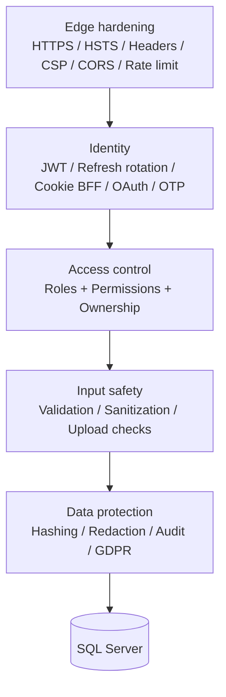

---

## Dual-Host Architecture & Trust Boundaries

The browser never holds a JWT. The **Web BFF** keeps tokens server-side and talks to the API on the user's behalf.

- **Web** issues an opaque, `HttpOnly` cookie; the real JWT/refresh live in a **server-side ticket store**
- **Api** trusts only signed JWTs; it is the single writer to the database
- SignalR hub (`/hubs/tour`) is authenticated over WSS

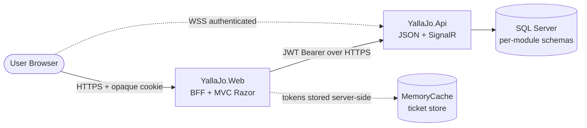

<!-- Speaker note: This BFF split means an XSS on the frontend cannot read the JWT, because it is not in JS-accessible storage or even in the cookie payload. -->

---

## Authentication — Overview

Two mechanisms, one identity model.

- **API**: stateless **JWT Bearer** (HMAC-SHA256)
- **Web**: stateful **cookie** backed by a server-side ticket store
- Shared building blocks: sessions, devices, refresh-token rotation, OAuth, OTP

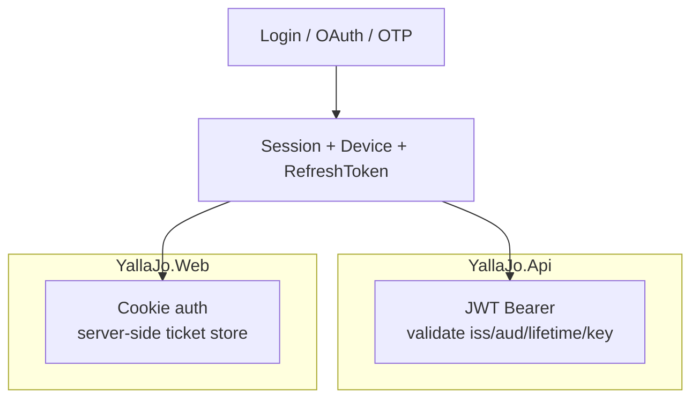

---

## JWT Access Tokens

Short-lived bearer tokens carry identity **and** authorization claims.

- Signed **HMAC-SHA256** with `Jwt:Key`; startup throws if key/issuer/audience missing
- Claims: `sub`, `email`, `jti` (replay id), `iat`, `exp`, `iss`, `aud`, `role`, `Permission.*`, `sid`
- Validation: all parameters validated, `MapInboundClaims=false`, `ClockSkew=30s`
- `RoleClaimType=role`, `NameClaimType=sub`

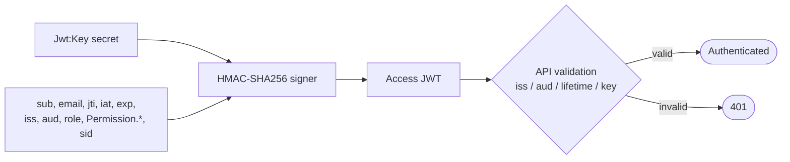

---

## Refresh Token Rotation & Reuse Detection

Long-lived refresh tokens are **rotated on every use** and **hashed at rest**.

- 512-bit CSPRNG token; only its **SHA-256 hash** is stored (plaintext never persisted)
- Each rotation links `ReplacedByTokenId` to form a chain; 30-day expiry
- **Breach detection**: reusing a revoked token revokes the **entire session**

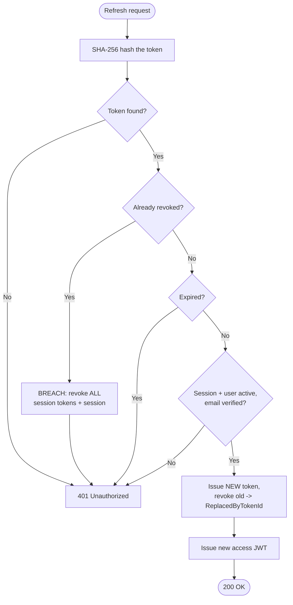

---

## BFF Cookie & Server-Side Ticket Store

The frontend cookie is a **claim check**, not a credential.

- 8h sliding cookie: `HttpOnly`, `Secure` (Always), `SameSite=Lax`, name `YallaJo.Web`
- Cookie holds only a 32-byte opaque key; JWT + refresh live in `MemoryCacheTicketStore`
- Only **4 claims** kept client-side (avoids the 50KB admin-cookie problem); roles/permissions read from the JWT on demand
- `JwtAuthHandler` proactively refreshes tokens within a 30s expiry buffer

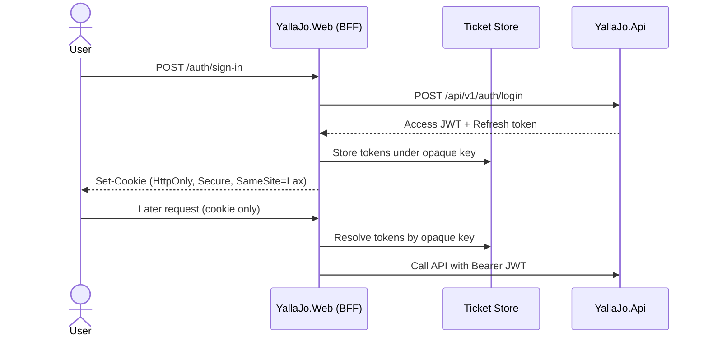

---

## External OAuth + BFF Ticket Protocol

Google & Facebook sign-in, bridged to the API with a **single-use signed ticket**.

- Providers registered only if configured; 10-min intermediate cookie scheme
- Web mints a **120s HMAC-SHA256 ticket** with a `jti` nonce
- API verifies signature, issuer, audience, lifetime, **provider allowlist**, then **consumes the nonce once** (replay defense)

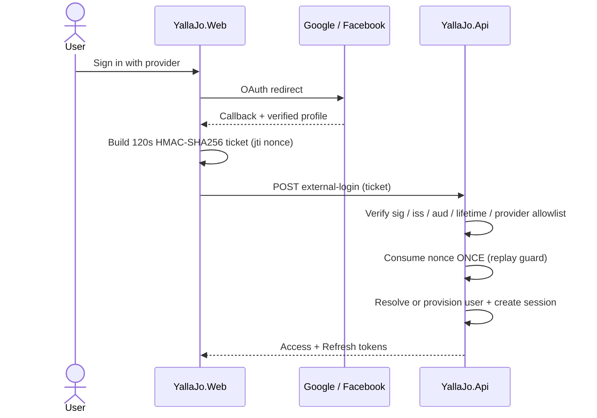

---

## OTP & Email Verification

One-time codes are random, hashed, expiring, and attempt-limited.

- 6-digit code via **CSPRNG**; stored **hashed** (Identity PasswordHasher), 10-min expiry, max 5 attempts
- Dedicated `ActivationToken` and `PasswordResetToken` aggregates with state machines
- Pending email kept in a **DataProtection time-limited encrypted cookie** — no PII in query strings

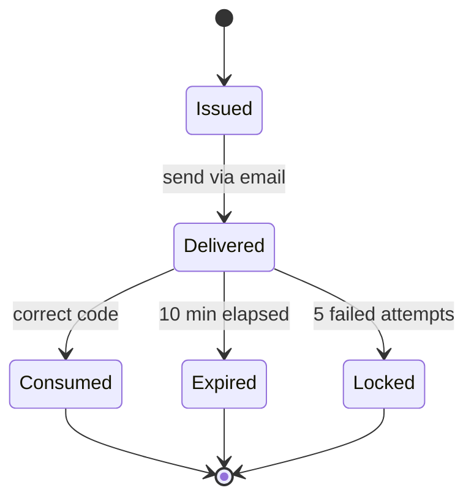

---

## Authorization — Three Layers

Every protected action passes **role → permission → ownership**.

- **Roles**: coarse tiers (`Owner`, `SuperAdmin`, `Admin`, …)
- **Permissions**: fine-grained `Permission.{Feature}.{Action}` claims
- **Ownership**: resource-level check defeats IDOR (`OwnerUserId == currentUser`, admin bypass)

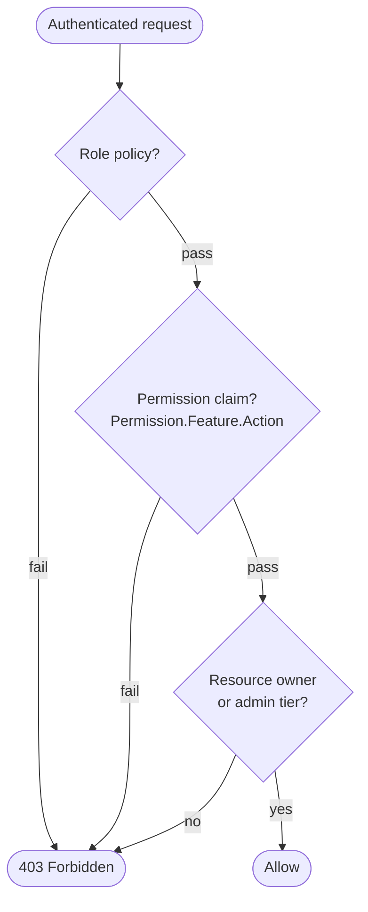

---

## Role Hierarchy & Seeding

Eight privilege tiers; permissions are **seeded idempotently** from code.

- Hierarchy: `Guest < User < TourGuide < Provider < Creator < Admin < SuperAdmin < Owner`
- `RolePermissionMapping` (343 lines) computes each role's permission set
- `SecurityDataSeeder` writes them to the `RoleClaim` table (claim type = `Permission`)

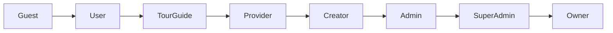

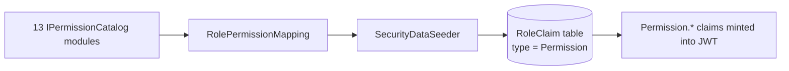

---

## Permission Model & Catalogs

Permissions are declared per module and resolved dynamically.

- One `IPermissionCatalog` per module → ~13 catalogs, ~50 action verbs (`AppAction`)
- `PermissionPolicyProvider` builds an authorization policy on-the-fly for any `Permission.*` name
- Enforced via `MustHavePermissionAttribute` (API) and `RequirePermissionAttribute` (Web)
- View layer: `<permission>` and `<role>` tag helpers hide UI fragments

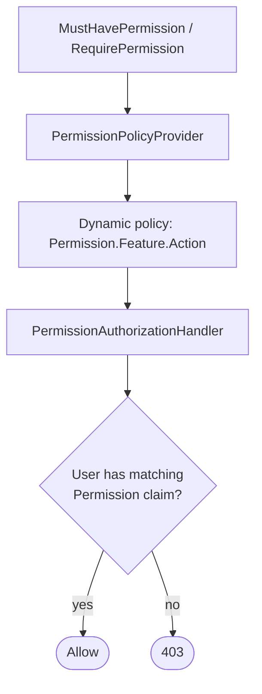

---

## Resource Ownership — IDOR Defense

Owning a row matters as much as having a permission.

- `IEntityOwnershipResolver` fans out per module (Tour, Blog, Place, Review, …)
- `OwnershipGuard.AuthorizeAsync(entityType, id, …)`: admin tier passes; otherwise `OwnerUserId` must match
- Pattern split: `DeleteOwn` (owner) vs `DeleteAny` (admin)

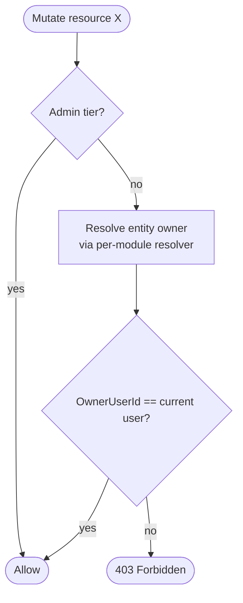

---

## HTTP Security Headers & CSP

Both hosts emit hardened headers; CSP is tuned per host.

- `X-Content-Type-Options: nosniff`, `X-Frame-Options: DENY`, `X-XSS-Protection: 0` (OWASP), `Referrer-Policy`, `Permissions-Policy`
- **API CSP** locked to `default-src 'none'`; **Web CSP** allowlists jQuery, reCAPTCHA, Mapbox with `frame-ancestors 'none'`
- Correlation IDs (`X-Correlation-ID`, `traceparent`) for traceable security logging

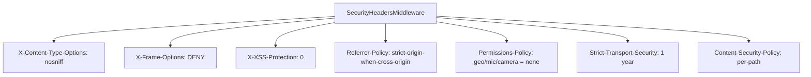

---

## Transport: HSTS, HTTPS & CORS

Encryption in transit plus a strict cross-origin policy.

- `UseHttpsRedirection` on both hosts; `UseHsts` (1-year, includeSubDomains) in production
- **CORS is API-only**: production origins from config, ordered **before** rate limiter & auth so preflight is never throttled or 401'd
- Web is a **same-origin BFF** — no CORS surface by design

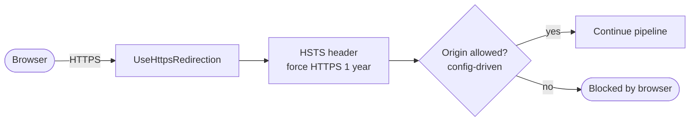

---

## Rate Limiting (Anti-Brute-Force)

The API throttles the sensitive auth endpoints; rejections return **429 JSON**.

- `LoginPolicy` — 10/min per IP
- `OtpPolicy` — 3/min partitioned by email
- `RefreshPolicy` — 20/min per IP
- `RegisterPolicy` — 5/min per IP

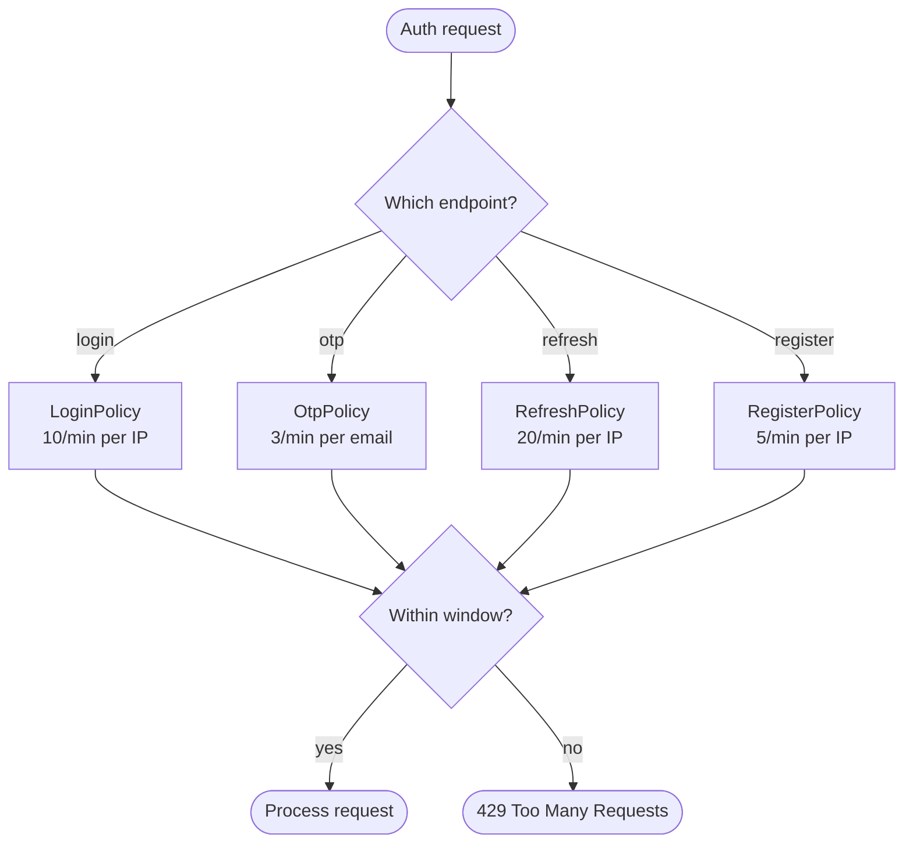

---

## Middleware Pipeline Order (API)

Order is a security control — headers first, auth late, endpoints last.

```mermaid
flowchart LR
    A[ExceptionHandler] --> B[StatusCodePages]
    B --> C[ResponseCompression]
    C --> D[SecurityHeaders]
    D --> E[Serilog request log]
    E --> F[HTTPS redirection]
    F --> G[RequestLocalization]
    G --> H[CORS YallaJoPolicy]
    H --> I[RateLimiter]
    I --> J[Authentication]
    J --> K[Authorization]
    K --> L[Module endpoints]
```

> CORS and rate limiting sit **before** authentication so preflight and throttling work correctly; security headers are emitted **before** anything can short-circuit.

---

## Input Validation — FluentValidation

Every command is validated in the MediatR pipeline **before** it reaches a handler.

- 300+ validators (`AbstractValidator<T>`) run inside `ValidationBehavior`
- Length caps everywhere (email 320, password 8–128, names 100, review 2000)
- Failures aggregate into an RFC 7807 **400 ValidationProblemDetails**

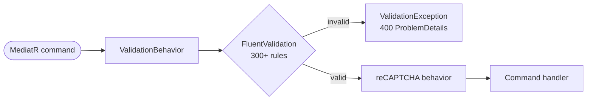

---

## XSS — HTML Sanitization

User-authored HTML (blogs) is sanitized at the BFF trust boundary.

- `HtmlSanitizer` (Ganss.Xss): **36-tag allowlist**
- URI schemes limited to `http`, `https`, `mailto` — **no** `javascript:` / `data:`
- No inline CSS, no data-attributes; sanitized **before** `Html.Raw`

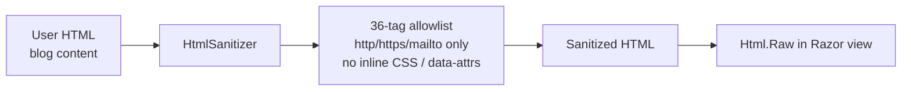

---

## File Upload Security

Uploads are checked by **content**, not by their claimed name.

- **Magic-byte detection** (first 32 bytes): PDF / JPEG / PNG must match
- Requires **type + MIME + extension** to all agree
- IDOR + ownership check first; per-type size caps; **SVG explicitly blocked**

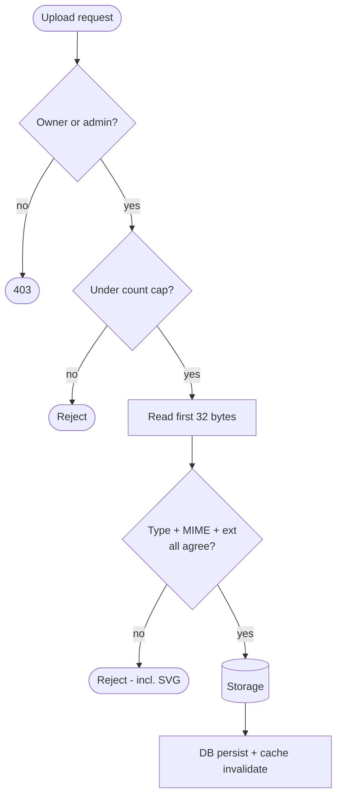

---

## Anti-Abuse — reCAPTCHA & Profanity

Bot and content-abuse defenses.

- **reCAPTCHA v3** server-side verify pipeline (score, action, client IP, timeout) via a MediatR behavior — **currently disabled** (TODO to re-enable on register/login)
- **Profanity filter**: DB-backed blocklist routes flagged reviews to moderation (rule S-R4)

```mermaid
flowchart LR
    subgraph Bot defense
      Token[reCAPTCHA token] --> Verify[Google siteverify<br/>score >= 0.5]
      Verify -- low score --> Forbid([Forbidden])
      Verify -- ok --> Pass([Continue])
    end
    subgraph Content defense
      Review[New review] --> Filter[Blocklist profanity filter]
      Filter -- hit --> Mod[Status = AwaitingModeration]
      Filter -- clean --> Publish[Publish]
    end
```

---

## Account Lifecycle

Only **Active** accounts can authenticate; admins drive every transition.

```mermaid
stateDiagram-v2
    [*] --> Provisioned
    Provisioned --> PendingActivation
    PendingActivation --> Active: activate with token + password
    Active --> Suspended: admin suspend - revoke sessions
    Suspended --> Active: admin reactivate
    Active --> PendingPasswordReset: admin reset
    PendingPasswordReset --> Active: reset complete
    Active --> Archived: admin archive
    Suspended --> Archived
    Archived --> [*]
```

> Suspend, reset, and reassign all **revoke active sessions** as a side effect.

---

## Session & Device Management

Users and admins can see and revoke sessions in real time.

- `Session`: user, device, expiry, `IsRevoked`, IP; `sid` claim ties a JWT to a session
- Operations: list, logout, logout-all, revoke-others, admin force-revoke
- Devices tracked with a **trust** flag — convenience only, **not** 2FA

```mermaid
flowchart TB
    S[Active sessions] --> A1[List sessions]
    S --> A2[Logout current]
    S --> A3[Logout all]
    S --> A4[Revoke other sessions]
    S --> A5[Admin force-revoke user]
    A2 --> R[(Session.IsRevoked = true)]
    A3 --> R
    A4 --> R
    A5 --> R
```

---

## Password Security

Modern hashing, fail-closed verification.

- **PBKDF2-SHA256** via ASP.NET Identity `PasswordHasher` (auto per-user salt, rehash support)
- Verification fails closed on null/empty and on placeholder hashes (`EXTERNAL-ONLY:` for OAuth-only users, `REASSIGNED:` for admin reassignment)
- Domain events emitted: `PasswordChangedEvent`, `PasswordResetEvent`

```mermaid
flowchart LR
    PW[Plaintext password] --> H[PBKDF2-SHA256 + salt]
    H --> Store[(Hash in DB)]
    Login([Login attempt]) --> Verify{Verify against hash}
    Verify -- placeholder hash --> Fail[Return false - fail closed]
    Verify -- mismatch --> Fail
    Verify -- match --> Ok[Authenticated]
    Verify -- needs rehash --> Upgrade[Transparently upgrade hash]
```

---

## Cryptography Inventory

The right primitive for each job — no hand-rolled crypto.

```mermaid
flowchart TB
    subgraph Hashing
      PBKDF2[PBKDF2 - passwords and OTP]
      SHA[SHA-256 - refresh tokens, redaction]
    end
    subgraph Signing
      HMAC[HMAC-SHA256 - JWT, BFF ticket, viewer hash]
    end
    subgraph Randomness
      CSPRNG[RandomNumberGenerator<br/>tokens 512-bit, OTP, booking refs]
    end
```

- Passwords / OTP → **PBKDF2** (and OTP additionally hashed before storage)
- Refresh tokens & PII fingerprints → **SHA-256**
- JWT, OAuth bridge ticket, blog-viewer hashing → **HMAC-SHA256**
- All tokens, OTPs, booking references → **CSPRNG**

---

## Data Protection (ASP.NET DataProtection)

Used to encrypt short-lived, sensitive cookie payloads.

- `ITimeLimitedDataProtector` protects the pending-verification email (15-min TTL, purpose-scoped)
- Tampered / expired / rotated-key payloads simply decrypt to `null` (fail-safe)

```mermaid
flowchart LR
    Email[User email] --> Protect[TimeLimitedDataProtector.Protect<br/>purpose + 15 min]
    Protect --> Cookie[Encrypted cookie<br/>HttpOnly + Secure]
    Cookie --> Unprotect{Unprotect}
    Unprotect -- valid --> Use[Use email]
    Unprotect -- expired/tampered --> Null[Return null - safe]
```

> ⚠️ Gap: the DataProtection **key ring is in-memory** (not persisted) — see the Gaps slide.

---

## Audit Logging

Security-relevant actions are recorded with privacy built in.

- `AuditLog`: user, action, entity, old/new JSON, **hashed IP**, correlation id, timestamp
- Event-driven handlers capture login, password change/reset, session revoke, user create
- Admin UI to view & export; supports **retroactive redaction** with reason + actor

```mermaid
flowchart LR
    Ev[Domain/security events] --> H[Audit event handlers]
    H --> AL[(AuditLog<br/>hashed IP, old/new JSON,<br/>correlation id)]
    AL --> UI[Admin audit UI + export]
    AL --> Redact[Admin retroactive redaction<br/>reason + actor recorded]
```

---

## Sensitive Data Redaction (PII / PCI)

Two redactors keep secrets out of logs and audit trails.

- **Audit redactor**: `email → SHA-256[..16]`, `phone → last 4`, `IP → /24`; hard-redacts password / CVV / card / webhook signature
- **PCI payment redactor** (regex): PAN → keep first 6 + last 4, CVV → `***`, IBAN → country + check only

```mermaid
flowchart LR
    subgraph Audit Redactor
      E[email -> SHA-256 16 hex]
      P[phone -> last 4 visible]
      I[IP -> first 3 octets + .0]
    end
    subgraph PCI Payment Redactor
      PAN[PAN -> first6 + last4]
      CVV[CVV/CVC -> ***]
      IBAN[IBAN -> country + check]
    end
```

---

## GDPR & Privacy

Right-to-be-forgotten with a safety window, plus explicit consent.

- `GdprDeletionRequest` schedules a **hard delete +30 days** (cancellable)
- Daily `GdprCleanupJob`: hard-deletes interactions/preferences, **anonymizes** metrics/cache, auto-anonymizes data older than 365 days
- `MarketingConsent` value object (email digest / push / re-engagement)

```mermaid
flowchart TD
    Req[RequestGdprDeletion] --> Rec[(GdprDeletionRequest<br/>+30 day schedule)]
    Rec --> Cancel{Cancelled in window?}
    Cancel -- yes --> Stop([No-op])
    Cancel -- no --> Job[GdprCleanupJob - daily]
    Job --> Hard[Hard-delete interactions / preferences]
    Job --> Anon[Anonymize metrics / cache]
    Job --> Auto[Auto-anonymize data > 365 days]
```

---

## Concurrency & Tamper Protection

Lost-update and soft-delete safety across all entities.

- `AuditableEntity` carries `RowVersion` (`[Timestamp]`) → SQL Server optimistic concurrency
- Update commands carry the row version; mismatches raise `ConcurrencyException` (409)
- `ISoftDeletable` (`IsDeleted` / `DeletedAt`) — data is hidden, not destroyed; restorable

```mermaid
flowchart LR
    Read[Read entity + RowVersion] --> Edit[User edits]
    Edit --> Save{RowVersion still matches?}
    Save -- yes --> Commit[Update + new RowVersion]
    Save -- no --> Conflict([409 Concurrency conflict])
```

---

## Security NuGet Packages

13 security-relevant packages, all on .NET 9.

| Area | Package | Role |
|---|---|---|
| AuthN | `System.IdentityModel.Tokens.Jwt` 8.17 | Create / validate JWT |
| AuthN | `…Authentication.JwtBearer` 9.0.15 | Bearer middleware (API) |
| AuthN | `…Authentication.Google` / `…Facebook` 9.0 | External OAuth |
| Identity | `Microsoft.Extensions.Identity.Core` 9.0.15 | PBKDF2 hashing, roles |
| Crypto | `…DataProtection` (framework) | Encrypted cookie payloads |
| Validation | `FluentValidation` (+ DI) 12.1.1 | Input validation |
| XSS | `HtmlSanitizer` 9.0.892 | HTML sanitization |
| Resilience | `…Http.Resilience` 9.10 | Retry / circuit breaker |
| Transport | `MailKit` 4.x | TLS email |
| Realtime | `…SignalR.Core` | Authenticated hubs |

> Note: hashing uses framework **PBKDF2** (no third-party BCrypt/Argon2); rate limiting uses the **built-in** limiter (no extra package).

---

## Known Security Gaps

Honest findings to prioritize.

**Critical**
- 🔴 **Secrets committed to source control** — prod DB password, `Jwt.Key`, reCAPTCHA secret, Gmail app password, API keys in `appsettings*.json`
- 🔴 **Prod DB `Encrypt=False`** — credentials/data in plaintext on the wire
- 🔴 **Dev OAuth signing key shipped to prod** (contradicts its own comment)

**High / Medium**
- 🟠 DataProtection **key ring in-memory** (breaks on restart / multi-instance)
- 🟠 **CSRF/antiforgery is opt-in**, not global
- 🟠 **No rate limiting on the Web host** login/register forms
- 🟠 **reCAPTCHA implemented but disabled**
- 🟡 No account lockout, **no 2FA/MFA**, no password history/complexity, no phone-verification enforcement
- 🟡 `MemoryCacheTicketStore` is single-instance (needs Redis to scale)

---

## Recommended Remediations

```mermaid
flowchart TB
    subgraph Now[Immediate]
      S1[Move secrets to user-secrets / env vars / Key Vault]
      S2[Rotate every leaked credential]
      S3[Set prod Encrypt=True + valid cert]
    end
    subgraph Next[Short term]
      N1[Persist DataProtection keys + ProtectKeysWith]
      N2[Global antiforgery for Web]
      N3[Re-enable reCAPTCHA]
      N4[Rate limit Web auth forms]
    end
    subgraph Later[Hardening]
      L1[Add 2FA / MFA]
      L2[Account lockout + password policy]
      L3[Distributed ticket store - Redis]
    end
    Now --> Next --> Later
```

---

## Security Posture — Summary

| Domain | Status |
|---|---|
| Authentication (JWT + rotation + BFF) | ✅ Strong |
| Authorization (roles + permissions + ownership) | ✅ Excellent |
| Transport & headers (HSTS, CSP, CORS) | ✅ Good |
| Input validation & sanitization | ✅ Strong |
| Cryptography primitives | ✅ Good |
| Audit logging | ✅ Excellent |
| GDPR / privacy | ✅ Good |
| **Secrets management** | ❌ **Critical** |
| **Production DB transport** | ❌ **Critical** |
| Data protection key ring | ⚠️ Partial |

**Bottom line:** application-layer security is mature and layered; the urgent work is **operational** — get secrets out of source control and encrypt the production database connection.

---

# Thank You

### Questions?

- Deepest strengths: **refresh-token reuse detection**, **3-layer authorization**, **privacy-aware audit logging**
- Top priority fixes: **secrets management** + **prod DB encryption**

<!-- Speaker note: Offer to walk through a prioritized remediation plan or the secrets-migration fix as a follow-up. -->
