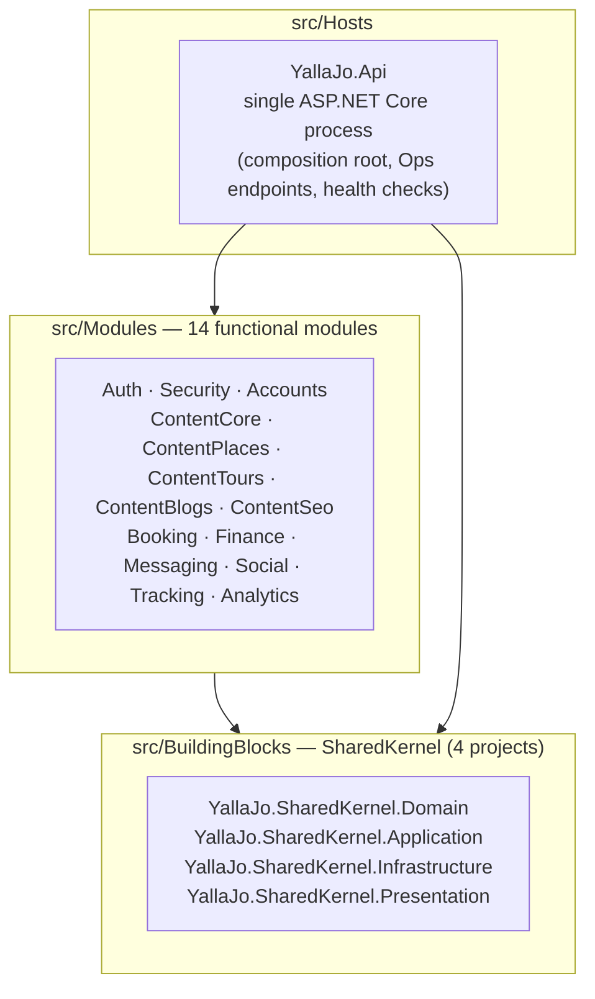
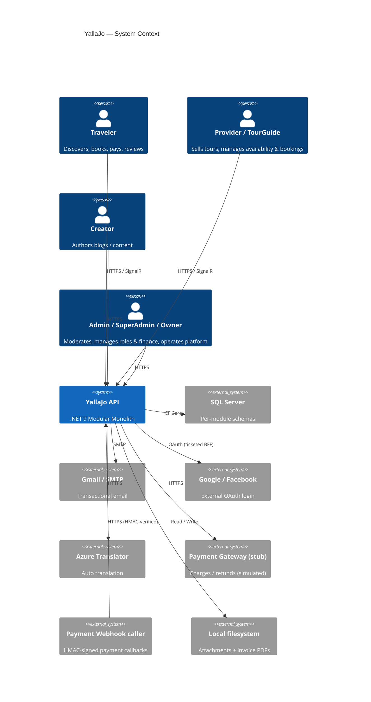
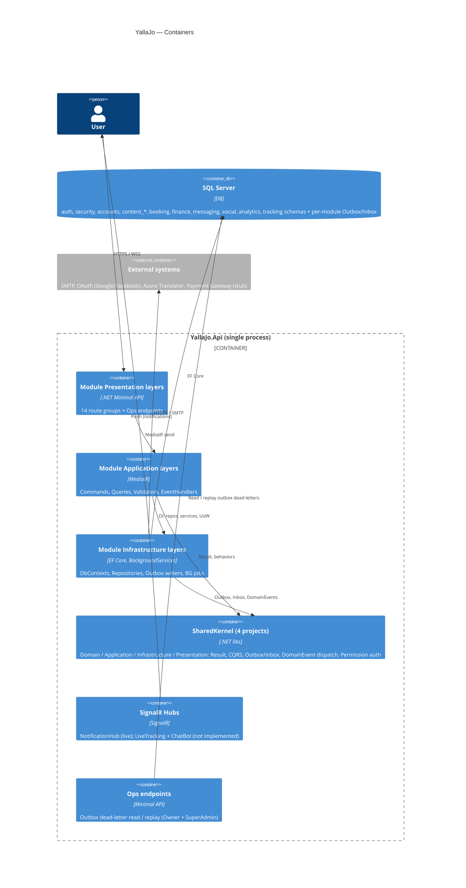
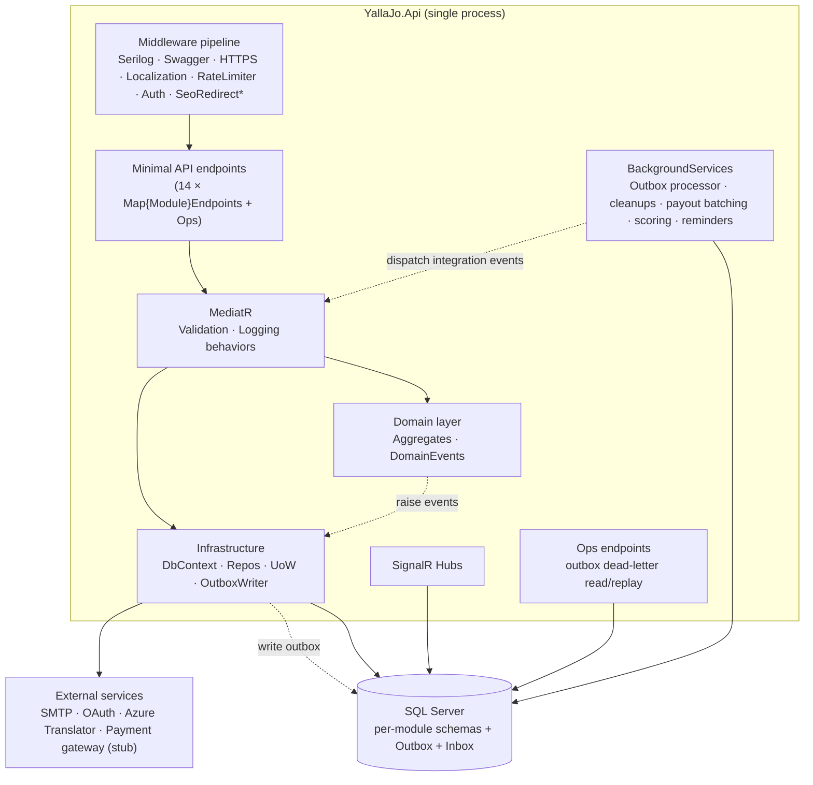

# 01 — System Overview

> **What this document is.** A technical map of the YallaJo system: its solution layout,
> technology stack, architecture, modules, security, and operational machinery — as implemented
> today (post-P0/P1).
>
> **Basis & boundaries.** Derived from the current implementation under `src/`. It **links to,
> rather than duplicates**, the foundation docs: see
> [`00-introduction-purpose-scope.md`](./00-introduction-purpose-scope.md) for *what/why/scope*,
> [`02-actors-and-roles.md`](./02-actors-and-roles.md) for the *authoritative* actor and
> authorization model, and [`03-use-case-model.md`](./03-use-case-model.md) for business use cases.

---

## 1. What YallaJo is

A **tourism and experiences marketplace for Jordan** connecting travelers with local providers,
tour guides, agencies, businesses, and content creators across the journey
**Discover → Book → Pay → Fulfill → Review → Payout**.

**Shape:** a single-deployable **.NET 9 Modular Monolith** (`YallaJo.Api`) composed of 14
functional modules, each owning its own SQL Server schema and communicating asynchronously via a
transactional Outbox/Inbox mechanism.

> Purpose, value, and scope (in/out/limitations) are defined in
> [`00-introduction-purpose-scope.md`](./00-introduction-purpose-scope.md) and are not repeated here.

---

## 2. Solution layout

The solution is organized under `src/` into three areas:

- **`src/Hosts/YallaJo.Api`** — the only runnable process: middleware pipeline, module endpoint
  mapping, Ops surface, health checks, composition root.
- **`src/Modules/<Module>`** — each module is five projects: `Domain`, `Application`, `Contracts`,
  `Infrastructure`, `Presentation`.
- **`src/BuildingBlocks/YallaJo.SharedKernel.*`** — cross-cutting building blocks (4 projects)
  reused by every module: result types and base entities (Domain), CQRS contracts and pipeline
  behaviors (Application), Outbox/Inbox + domain-event dispatch (Infrastructure), and permission
  authorization helpers (Presentation).

---

## 3. Technology stack

| Layer | Technology |
|---|---|
| Runtime | **.NET 9** |
| API style | Minimal API + route groups per module |
| Persistence | EF Core 9 + SQL Server (one DbContext / schema per module) |
| CQRS | MediatR 14 (`ICommand<T>` / `IQuery<T>` returning `Result<T>`) |
| Validation | FluentValidation 12 (pipeline behavior) |
| Auth | JWT Bearer (symmetric key) + **permission-claim** authorization (see §8) |
| Bot protection | Google reCAPTCHA verifier present but **currently disabled** (pipeline behavior commented out) |
| Eventing | Transactional Outbox dispatch via `CompositeOutboxProcessor`; Inbox dedupe via `EfInboxStore` |
| Realtime | SignalR (`NotificationHub` live; LiveTracking + ChatBot hubs not implemented) |
| Background jobs | `BackgroundService` + `PeriodicTimer` (ADR-003: no Hangfire) |
| Logging | Serilog (structured, request logging) |
| Telemetry | OpenTelemetry 1.x (tracing + metrics) |
| Errors | `IExceptionHandler` chain → RFC 7807 ProblemDetails |
| Email | Gmail SMTP (Auth) + generic SMTP (Messaging) |
| Translation | Azure Translator + auto-save decorator |
| PDF | QuestPDF (invoices) |
| Storage | Local filesystem (attachments, invoice PDFs) |
| Payments | `FakePaymentGateway` (stub) — see [risks](./risks/risk-register.md) |

---

## 4. C4 — System Context

> Bot protection (reCAPTCHA) is intentionally omitted as an active relation — the verifier exists
> but the pipeline behavior is disabled.

---

## 5. C4 — Container

---

## 6. The 14 modules at a glance

| Module | Schema | Core responsibility |
|---|---|---|
| **Auth** | `auth` | Login, register, OTP, JWT, sessions, refresh tokens, external OAuth, invitations, password reset |
| **Security** | `security` | Users, roles, claims, permission catalog, role hierarchy, admin audit |
| **Accounts** | `accounts` | User profiles, avatars, provider/agency applications, profile reassignment on auth events |
| **ContentCore** | `content_core` | Languages, Categories, Tags, Specializations, Attachments, Translations |
| **ContentPlaces** | `content_places` | Places, Businesses, BusinessHours/Staff/Amenities, ServiceItems |
| **ContentTours** | `content_tours` | Tours, Schedules, PricingTiers, Packages, Waypoints, TourGuides |
| **ContentBlogs** | `content_blogs` | Blogs, Comments + Reactions, BlogViews, Blog↔Tour links, Creators |
| **ContentSeo** | `content_seo` | SeoMetadata, Redirects, Sitemap, FAQ, Weather cache |
| **Booking** | `booking` | TourBookings, JoinRequests, AvailabilitySlots, SlotLocks, RefundPolicies, ProviderDocuments |
| **Finance** | `finance` | Payments, Invoices, Payouts, Commissions, Subscriptions, Discounts, Loyalty, Disputes |
| **Messaging** | `messaging` | Notifications, templates, device tokens, support tickets |
| **Social** | `social` | Reviews, Favorites, Reports, moderation |
| **Tracking** | `tracking` | Live GPS sessions + location snapshots (domain scaffold only; no API surface) |
| **Analytics** | `analytics` | Interactions, popularity scores, recommendation cache, dashboards, audit log |

Detailed per-module cards: [`03-module-map.md`](./03-module-map.md).

---

## 7. High-level architecture

> *The `SeoRedirect` middleware is wired but currently backed by a **NoOp** lookup
> (`NoopSeoRedirectLookupService`) — it performs no redirects today.

See [`workflows/17-outbox-inbox-eventing.md`](./workflows/17-outbox-inbox-eventing.md) for the
eventing detail.

---

## 8. Authentication & authorization (summary)

Authorization is **permission-claim based**. The authoritative actor catalog, role hierarchy, and
full model live in [`02-actors-and-roles.md`](./02-actors-and-roles.md); this is only a summary.

| Concern | Mechanism |
|---|---|
| Identity | JWT Bearer (symmetric key, `Jwt:Key/Issuer/Audience`) |
| Session | `Session` + `RefreshToken` per device (rotated) |
| Email verify / password reset | `Otp`, `ActivationToken`, `PasswordResetToken` (state-machine entities) |
| External login | Google / Facebook via signed BFF ticket (`ExternalAuthTicket*`, nonce store on HybridCache) |
| Bot protection | reCAPTCHA verifier present but **disabled** (pipeline behavior commented out) |
| Authorization model | Per-module permission catalogs → `RolePermissionMapping` → seeded `RoleClaim`s → JWT `Permission` claims → `MustHavePermissionAttribute` |
| Ownership | Runtime ownership guards in command handlers (DeleteOwn vs DeleteAny, booking lifecycle, agency roster) |
| Audit | `IAdminAuditWriter` → Analytics `AuditLog` |

**Pointer:** roles, the Owner ▸ SuperAdmin ▸ Admin hierarchy, business-role peering, DeleteOwn/DeleteAny,
AgencyRoster ownership, and the Owner+SuperAdmin-only Outbox tier are all defined in
[`02-actors-and-roles.md`](./02-actors-and-roles.md). This document does not restate the hierarchy.

---

## 9. Operational architecture

| Concern | Mechanism / location |
|---|---|
| **Integration-event dispatch** | `CompositeOutboxProcessor` (BackgroundService) polls every module's outbox and dispatches via MediatR — `src/BuildingBlocks/YallaJo.SharedKernel.Infrastructure/BackgroundJobs/` |
| **Inbox idempotency** | `EfInboxStore` dedupes by message id per consumer — `src/BuildingBlocks/YallaJo.SharedKernel.Infrastructure/Inbox/` |
| **Outbox housekeeping** | `OutboxCleanupBackgroundService` prunes processed rows |
| **Dead-letter handling** | Persistent failures → dead-letter; surfaced by `OutboxDeadLetterHealthCheck`; recoverable via the **Ops** endpoints (read + replay), restricted to **Owner + SuperAdmin** — `src/Hosts/YallaJo.Api/Endpoints/OpsEndpoints.cs` |
| **Booking background jobs** | slot-lock cleanup, slot generation, auto-expire, auto-accept, auto-complete, join-request expiry, document-expiry, reminders — `src/Modules/Booking/Booking.Infrastructure/BackgroundServices/` |
| **Finance background jobs** | payout batching, refund retry — `src/Modules/Finance/Finance.Infrastructure/BackgroundServices/` |
| **Analytics processing** | interaction-ingest drain (batched), popularity scoring, metrics aggregation, suggestion refresh, GDPR cleanup, profile/trip-stage updates, email digest — `src/Modules/Analytics/Analytics.Infrastructure/BackgroundServices/` |
| **Other module jobs** | Messaging (email sender, SLA monitor, cleanup), ContentSeo (sitemap, weather pre-fetch), ContentBlogs (creator/blog jobs), Accounts (document/invitation expiry), ContentCore (media processing), Social (rating recalculation, favorites cleanup), Auth (retention/cleanup) |

> All background services use `BackgroundService` + `PeriodicTimer` with no distributed lock; the
> system assumes a single running instance (see [risk register](./risks/risk-register.md)).

---

## 10. External integrations

| Integration | Status | Code reference |
|---|---|---|
| SQL Server | Live | `src/Modules/*/*.Infrastructure/Persistence` |
| Gmail SMTP (Auth emails) | Live | `src/Modules/Auth/Auth.Infrastructure/Services/GmailEmailService.cs` |
| SMTP (Messaging) | Live | `src/Modules/Messaging/Messaging.Infrastructure/Services/SmtpEmailSender.cs` |
| Google / Facebook OAuth | Live (ticketed BFF) | `src/Modules/Auth/Auth.Infrastructure/ExternalAuth/*` |
| Google reCAPTCHA | **Present but disabled** | `src/Modules/Auth/Auth.Infrastructure/Recaptcha/GoogleRecaptchaVerifier.cs` (pipeline behavior commented out) |
| Azure Translator | Live | `src/Modules/ContentCore/ContentCore.Infrastructure/Services/AzureTranslateService.cs` |
| Local file storage | Live | `src/Modules/ContentCore/ContentCore.Infrastructure/Services/LocalFileStorageService.cs`, `src/Modules/Finance/Finance.Infrastructure/Storage/LocalFileInvoiceStorage.cs` |
| QuestPDF (invoices) | Live | `src/Modules/Finance/Finance.Infrastructure/Pdf/QuestPdfInvoiceRenderer.cs` |
| SignalR | Live (NotificationHub only) | `src/Modules/Messaging/Messaging.Presentation/Hubs/NotificationHub.cs` |
| OpenTelemetry | Live | `src/Hosts/YallaJo.Api/Extensions/OpenTelemetryExtensions.cs` |
| Payment gateway | **Stub** | `src/Modules/Finance/Finance.Infrastructure/Gateways/FakePaymentGateway.cs` |
| Weather provider | **Stub (NoOp)** | `src/Modules/ContentSeo/ContentSeo.Infrastructure/Weather/NoOpWeatherProvider.cs` |
| Search Console pinger | **Stub (NoOp)** | `src/Modules/ContentSeo/ContentSeo.Infrastructure/Sitemap/NoOpSearchConsolePinger.cs` |
| SEO redirect lookup | **Stub (NoOp)** | `src/Hosts/YallaJo.Api/Services/NoopSeoRedirectLookupService.cs` |
| Discount evaluator | **Stub (NoOp)** | `src/Modules/Booking/Booking.Infrastructure/Services/NoOpDiscountEvaluator.cs` |
| Push (FCM/APNs) | **Stub** (returns failure) | `src/Modules/Messaging/Messaging.Infrastructure/Services/PushNotificationStrategy.cs` |
| AI chatbot LLM | Not implemented (deferred) | — |

See the [risk register](./risks/risk-register.md) for the implications of each stub.

---

## 11. Production readiness

The current implementation is feature-rich and suitable for development and validation
environments; however, several production-hardening items remain tracked in the
[risk register](./risks/risk-register.md) — most notably the simulated payment gateway, NoOp
integrations, single-instance background-job assumptions, and local-filesystem storage. See
[`00-introduction-purpose-scope.md`](./00-introduction-purpose-scope.md) §3.4.

---

## 12. Cross-references

- Introduction, purpose & scope: [`00-introduction-purpose-scope.md`](./00-introduction-purpose-scope.md)
- Actors, role hierarchy & authorization model: [`02-actors-and-roles.md`](./02-actors-and-roles.md)
- Business use-case model: [`03-use-case-model.md`](./03-use-case-model.md)
- Per-module detail: [`03-module-map.md`](./03-module-map.md)
- Workflows: [`workflows/`](./workflows/)
- Cross-module event catalog: [`eventing/`](./eventing/)
- Risk register: [`risks/`](./risks/)

> **Historical (non-authoritative):** earlier design notes under `../Agents/` (ADRs, endpoint
> catalog, conventions) predate this documentation set and may have drifted. Treat them as
> background only; the `docs/` set is the current source of truth.
