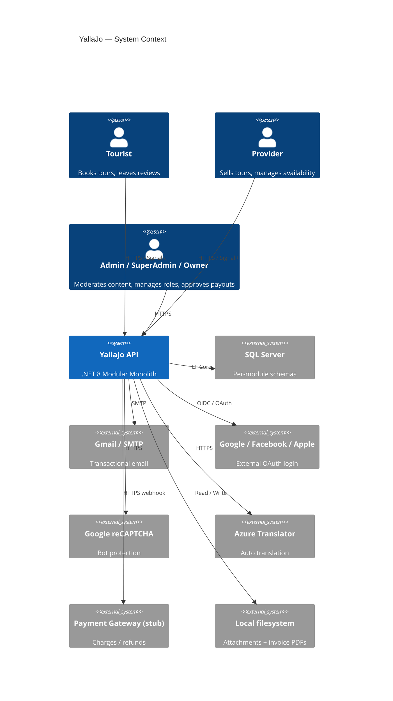
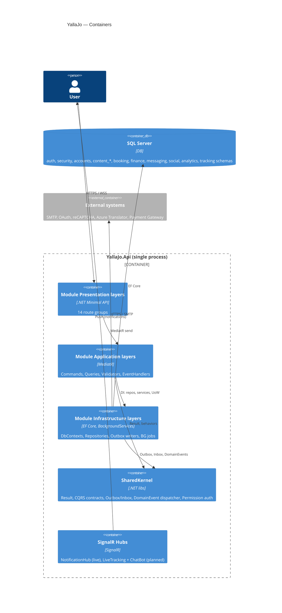
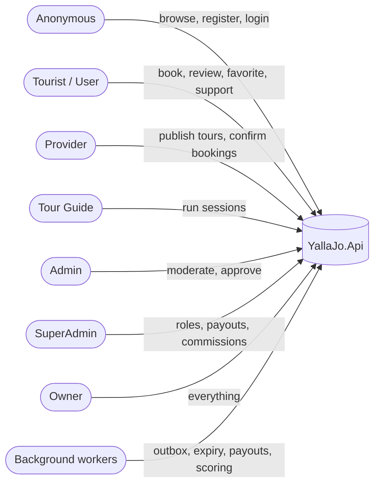
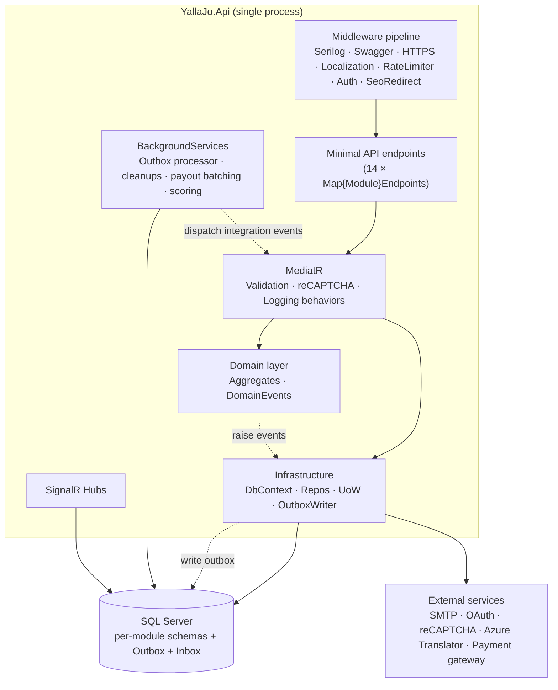

# 01 — System Overview

## What YallaJo is

A **tourism marketplace for Jordan** that connects tourists with local providers (tour operators, independent guides, hotels, activity centers, businesses). It covers the full lifecycle: discovery → booking → payment → fulfillment → review → payout.

**Shape:** single deployable **.NET 8 Modular Monolith** (`YallaJo.Api`) with 14 modules, each with its own SQL Server schema.

---

## Tech stack

| Layer | Technology |
|---|---|
| Runtime | .NET 8 |
| API style | Minimal API + route groups per module |
| Persistence | EF Core + SQL Server (one DbContext per module) |
| CQRS | MediatR (`ICommand<T>` / `IQuery<T>` returning `Result<T>`) |
| Validation | FluentValidation (pipeline behavior) |
| Auth | JWT Bearer (symmetric key) + policy + permission catalog |
| Bot protection | Google reCAPTCHA (pipeline behavior) |
| Eventing | Outbox dispatch via `CompositeOutboxProcessor`; Inbox dedupe via `EfInboxStore` |
| Realtime | SignalR (`NotificationHub` live; tracking + chatbot planned) |
| Background jobs | `BackgroundService` + `PeriodicTimer` (ADR-003: no Hangfire) |
| Logging | Serilog (structured, request logging) |
| Telemetry | OpenTelemetry (tracing + metrics) |
| Errors | `IExceptionHandler` chain → RFC 7807 ProblemDetails |
| Email | Gmail SMTP (Auth) + generic SMTP (Messaging) |
| Translation | Azure Translator + auto-save decorator |
| PDF | QuestPDF (invoices) |
| Storage | Local filesystem (attachments, invoices) |
| Payments | `FakePaymentGateway` (stub) — see [risks](./risks/risk-register.md) |

---

## C4 — System context

---

## C4 — Container view

---

## 14 modules at a glance

| Module | Schema | Core responsibility |
|---|---|---|
| **Auth** | `auth` | Login, register, OTP, JWT, sessions, refresh tokens, external OAuth, invitations, password reset |
| **Security** | `security` | Users, roles, claims, permission catalog, role hierarchy, admin audit |
| **Accounts** | `accounts` | User profiles, avatars, profile reassignment on auth events |
| **ContentCore** | `content_core` | Languages, Categories, Tags, Specializations, Attachments, Translations |
| **ContentPlaces** | `content_places` | Places, Businesses, BusinessHours/Staff/Amenities, ServiceItems |
| **ContentTours** | `content_tours` | Tours, Schedules, PricingTiers, Packages, Waypoints, TourGuides |
| **ContentBlogs** | `content_blogs` | Blogs, Comments + Reactions, BlogViews, Blog↔Tour links |
| **ContentSeo** | `content_seo` | SeoMetadata, Redirects, Sitemap, FAQ, Weather cache |
| **Booking** | `booking` | TourBookings, JoinRequests, AvailabilitySlots, SlotLocks, RefundPolicies, ProviderDocuments |
| **Finance** | `finance` | Payments, Invoices, Payouts, Commissions, Subscriptions, Discounts, Loyalty, Disputes |
| **Messaging** | `messaging` | Notifications, templates, device tokens, support tickets, chatbot |
| **Social** | `social` | Reviews, Favorites, Reports, moderation |
| **Tracking** | `tracking` | Live GPS sessions + location snapshots (scaffolded) |
| **Analytics** | `analytics` | Interactions, popularity scores, recommendation cache, dashboards, audit log |

Detailed cards: [`03-module-map.md`](./03-module-map.md).

---

## Actors & roles

Role hierarchy: `Owner > SuperAdmin > Admin > Provider > User`. Policies live in `Program.cs`; fine-grained checks live in `{Module}PermissionCatalog`.

---

## High-level architecture

See [`workflows/17-outbox-inbox-eventing.md`](./workflows/17-outbox-inbox-eventing.md) for the eventing detail.

---

## Authentication & authorization (summary)

| Concern | Mechanism |
|---|---|
| Identity | JWT Bearer (symmetric key, `Jwt:Key/Issuer/Audience`) |
| Session | `Session` + `RefreshToken` per device (rotated) |
| Email verify / password reset | `Otp`, `ActivationToken`, `PasswordResetToken` (state-machine entities) |
| External login | Google / Facebook / Apple (`ExternalProvider` + nonce store on HybridCache) |
| Bot protection | Google reCAPTCHA pipeline behavior on sensitive commands |
| Role policies | `Owner`, `SuperAdmin`, `Admin` (defined in `Program.cs`) |
| Permissions | Module-scoped catalogs (`AuthPermissionCatalog`, `BookingPermissionCatalog`, …) |
| Ownership | Domain-level guards (`ITourOwnershipService`, `IBlogOwnershipService`, …) |
| Audit | `IAdminAuditWriter` → Analytics `AuditLog` |

---

## External integrations

| Integration | Status | Code reference |
|---|---|---|
| SQL Server | Live | All `*.Infrastructure/Persistence` |
| Gmail SMTP (Auth emails) | Live | `Auth.Infrastructure/Services/GmailEmailService.cs` |
| SMTP (Messaging) | Live | `Messaging.Infrastructure/Services/SmtpEmailSender.cs` |
| Google reCAPTCHA | Live | `Auth.Infrastructure/Recaptcha/GoogleRecaptchaVerifier.cs` |
| Google / Facebook / Apple OAuth | Live (scaffolded) | `Auth.Infrastructure/ExternalAuth/*` |
| Azure Translator | Live | `ContentCore.Infrastructure/Services/AzureTranslateService.cs` |
| Local file storage | Live | `ContentCore.Infrastructure/Services/LocalFileStorageService.cs`, `Finance.Infrastructure/Storage/LocalFileInvoiceStorage.cs` |
| QuestPDF | Live | `Finance.Infrastructure/Pdf/QuestPdfInvoiceRenderer.cs` |
| SignalR | Live (NotificationHub only) | `Messaging.Presentation/Hubs/NotificationHub.cs` |
| OpenTelemetry | Live | `YallaJo.Api/Extensions/OpenTelemetryExtensions.cs` |
| Payment gateway | **Stub** | `Finance.Infrastructure/Gateways/FakePaymentGateway.cs` |
| Weather provider | **Stub** | `ContentSeo.Infrastructure/Weather/NoOpWeatherProvider.cs` |
| Search Console pinger | **Stub** | `ContentSeo.Infrastructure/Sitemap/NoOpSearchConsolePinger.cs` |
| Push (FCM/APNs) | Planned | — |
| AI chatbot LLM | Planned | — |

See [risk register](./risks/risk-register.md) for the implications of each stub.

---

## Cross-references

- Architecture decisions: [`../Agents/decisions/`](../Agents/decisions/) (ADR-001 .. ADR-008)
- Endpoint catalog & business rules: [`../Agents/YallaJo.md`](../Agents/YallaJo.md)
- Code conventions: [`../Agents/guide.md`](../Agents/guide.md)
- Build state & gotchas: [`../Agents/agent-context.md`](../Agents/agent-context.md)
- Patterns: [`../Agents/patterns/`](../Agents/patterns/) (caching, error-handling, polly)
