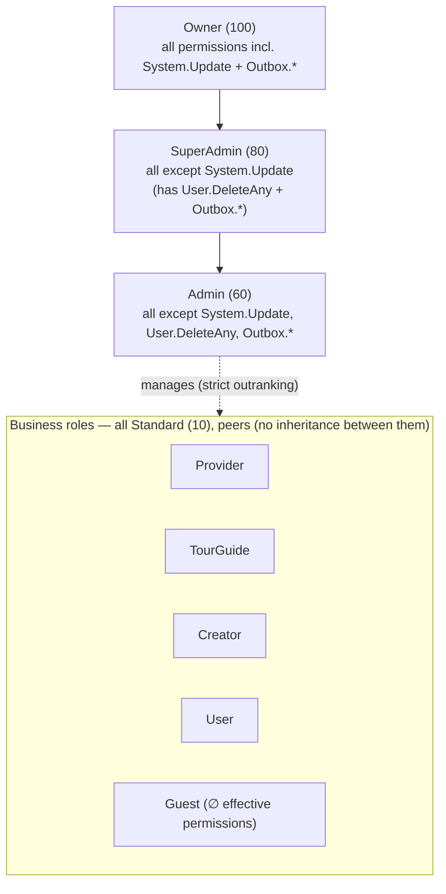

# 02 — Actors & Roles

> **Scope of this document.** Who and what interacts with YallaJo, the role hierarchy,
> and how authorization is actually enforced — reflecting the system **after the P0/P1
> authorization wave**. Every statement here is derived from the current implementation
> (permission catalogs, `RolePermissionMapping`, endpoint attributes, and command-handler
> ownership guards), not from prior drafts.
>
> **Companion docs:** actor → use-case mapping lives in
> [`03-use-case-model.md`](./03-use-case-model.md); cross-module event fan-out lives in
> [`eventing/integration-event-catalog.md`](./eventing/integration-event-catalog.md).

---

## 1. Actor catalog

YallaJo has **eight human roles**, plus **two non-human actors**. **All eight roles are seeded**
(`AppRoles.AllRoles`); seven carry effective permissions, while `Guest` is seeded but resolves
to an empty permission set (see §6). Public/anonymous access is delivered by `AllowAnonymous`,
not by the Guest role.

| # | Actor | Type | Backing role | Permission source |
|---|---|---|---|---|
| 1 | **Public / Anonymous Visitor** | Human (primary) | *(none / `Guest`)* | `AllowAnonymous` |
| 2 | **User / Traveler** | Human (primary) | `User` | Permission claims (`ConsumerPermissions`) + ownership guards |
| 3 | **Provider** | Human (primary) | `Provider` | Claims (`ProviderSelfPermissions` + `ConsumerPermissions` + content CRUD) + ownership guards |
| 4 | **TourGuide** | Human (primary) | `TourGuide` | Claims (`ProviderSelfPermissions` + `ConsumerPermissions` + content CRUD) + ownership guards |
| 5 | **Creator** | Human (primary) | `Creator` | Claims (content CRUD + `Blog.DeleteOwn` + `ConsumerPermissions`) + ownership guards |
| 6 | **Admin** | Human (primary) | `Admin` | All permission claims except `System.Update`, `User.DeleteAny`, `Outbox.*` |
| 7 | **SuperAdmin** | Human (primary) | `SuperAdmin` | All permission claims except `System.Update` |
| 8 | **Owner** | Human (primary) | `Owner` | All permission claims (singleton super-user) |
| 9 | **System / Background Services** | Non-human (secondary) | *(none)* | In-process; runs outside the auth pipeline |
| 10 | **External Payment Webhook** | Non-human (secondary) | *(none)* | HMAC-SHA256 signature validation on an `AllowAnonymous` route |

> Role names and privilege tiers are defined in
> `Security.Contracts/Authorization/AppRoles.cs`. `AllRoles` = `{ SuperAdmin, Admin, Owner,
> Provider, TourGuide, Creator, User, Guest }`.

---

## 2. Role hierarchy & privilege levels

Privilege levels come from `RolePrivilegeLevel` and `AppRoles.GetPrivilegeLevel(...)`:

| Role | Privilege level | Numeric |
|---|---|---|
| Owner | `Owner` | **100** |
| SuperAdmin | `SuperAdmin` | **80** |
| Admin | `Admin` | **60** |
| Provider | `Standard` | **10** |
| TourGuide | `Standard` | **10** |
| Creator | `Standard` | **10** |
| User | `Standard` | **10** |
| Guest | `Standard` | **10** |



**Two things to internalise:**

1. **The administrative tiers form a strict superset chain** — `Owner ⊃ SuperAdmin ⊃ Admin`.
   Each higher tier holds every permission of the tier below it, plus a small, well-defined
   delta (see §4). This is the only place real "inheritance" exists.

2. **Provider / TourGuide / Creator / User / Guest are peers** at `Standard (10)`. None
   outranks another. They differ only in *which* permission sets the role-to-permission
   mapping grants them — not in privilege rank.

### Who can manage whom

Role and user **management** is enforced by strict outranking in
`Security.Application/Authorization/RoleHierarchyService` (an actor must *strictly outrank* a
target to manage it):

- Admin can manage all `Standard` business roles, **but not** other Admins.
- Assigning the `Admin` role requires SuperAdmin; assigning `SuperAdmin` requires Owner.
- `ProtectedRoles = { SuperAdmin, Owner }` and `OwnerOnlyRoles = { Owner, SuperAdmin }`
  receive additional protection.

---

## 3. How authorization is enforced

YallaJo authorizes requests through **four complementary mechanisms**. A single endpoint may
use several at once (e.g. a permission gate *plus* a runtime ownership guard).

| Mechanism | Where | Used for |
|---|---|---|
| **`AllowAnonymous`** | endpoint metadata | Public catalog reads + auth bootstrap |
| **Permission claims** | `MustHavePermissionAttribute(Feature, Action)` → dynamic policy → `PermissionAuthorizationHandler` matching the JWT `Permission` claims | The default gate on ~all authenticated endpoints |
| **Ownership guards** | in command handlers (e.g. `DeleteTourCommandHandler`, `AvailabilitySlotOwnership`, agency handlers, `BlogAuthorHierarchyGuard`) | Row-level "do you own this resource?" checks |
| **HMAC / system validation** | Finance payment webhook (signature verified before parse); background services run in-process with no auth | Non-human actors |

### The permission-claim pipeline

```
IPermissionCatalog (per module)         e.g. Permission.Tour.DeleteOwn
        │  aggregated by
        ▼
RolePermissionMapping.GetPermissionsForRole(role)   role → permission set
        │  seeded as RoleClaim(ClaimType="Permission") by SecurityDataSeeder
        ▼
Login → JWT emits "Permission" claims (user + role claims merged)
        │  enforced by
        ▼
MustHavePermissionAttribute(Feature, Action) → PermissionAuthorizationHandler
```

- Permission strings follow the convention **`Permission.{Feature}.{Action}`**.
- Every enforced permission **must** exist in some `IPermissionCatalog` (validated by the
  `AuthorizationSanity` test suite).
- Roles receive permissions via `RolePermissionMapping` rules (§4), **not** by hand-assigning
  individual claims.

> **Named role policies vs permission claims.** Three named role policies (`Owner`,
> `SuperAdmin`, `Admin`) exist in the host, but authorization is overwhelmingly **permission-claim
> based**. The `Owner`/`SuperAdmin` named policies are effectively unused today; do not model
> authorization around them.

---

## 4. Role → permission model (post-P0/P1)

Source of truth: `Security.Infrastructure/Seeding/RolePermissionMapping.cs`.

### Administrative tiers

| Role | Granted |
|---|---|
| **Owner** | **All** permissions. |
| **SuperAdmin** | All **except** `Permission.System.Update` (owner-only). Retains `User.DeleteAny` and `Outbox.*`. |
| **Admin** | All **except** `System.Update`, `User.DeleteAny`, **and `Outbox.*`** (see §5). |

### Business roles

| Role | Granted (rule) |
|---|---|
| **User** | `User.UpdateSelf` + `ConsumerPermissions` (book/cancel/review/favorite/notifications/own-profile/GDPR/disputes/proposals/become-provider/become-creator). |
| **Provider** | `ConsumerPermissions` **+** `ProviderSelfPermissions` **+** ContentManagement CRUD `{Read, Create, Update, Delete}` **(excluding AgencyRoster)**. *(Provider is a real self-service role after P0/P1.)* |
| **TourGuide** | `ConsumerPermissions` **+** `ProviderSelfPermissions` **+** ContentManagement `{Read, Create, Delete}` (excluding AgencyRoster) **+** `Blog.DeleteOwn`. |
| **Creator** | ContentManagement `{Read, Create, Delete}` (excluding AgencyRoster) **+** `Blog.DeleteOwn` **+** `User.UpdateSelf` **+** `ConsumerPermissions`. |
| **Guest** | Only permissions flagged `IsGuestAccessible` — **today that set is empty** (see §6). |

> `ConsumerPermissions` and `ProviderSelfPermissions` are explicit, named sets in
> `RolePermissionMapping.cs`. The ContentManagement "CRUD sweep" grants business roles
> generic content actions by `(Group, Action)`, but is deliberately **filtered** so that
> `AgencyRoster.*` and the renamed `*.DeleteAny` permissions do **not** leak (see §7, §8).

### Privilege-separation deltas (the whole admin tier hinges on these)

| Permission | Held only by |
|---|---|
| `Permission.System.Update` (system settings) | **Owner** |
| `Permission.User.DeleteAny` (hard-delete user) | **Owner + SuperAdmin** |
| `Permission.Outbox.Read` / `Permission.Outbox.Replay` | **Owner + SuperAdmin** |

Everything else an Admin can do, a SuperAdmin and Owner can also do.

---

## 5. Outbox operations — Owner + SuperAdmin only

The operational outbox dead-letter endpoints (`/api/v1/ops/outbox/...`) enforce
`Permission.Outbox.Read` and `Permission.Outbox.Replay`.

- Registered in the Security permission catalog (feature `Outbox`, group `SystemAccess`).
- Granted to **Owner + SuperAdmin only**. **Admin is explicitly excluded.**
- Mechanism: `RolePermissionMapping.IsOpsOnly(...)` flags `Outbox.*` into `IsSuperAdminOnly`,
  so the Admin branch (which excludes `IsSuperAdminOnly`) drops them, while the SuperAdmin
  branch (excludes only `IsOwnerOnly`) keeps them, and Owner keeps everything.

| Use case | Public | User | Provider | TourGuide | Creator | Admin | SuperAdmin | Owner |
|---|:-:|:-:|:-:|:-:|:-:|:-:|:-:|:-:|
| Read / replay outbox dead-letters | — | — | — | — | — | **✗** | ✅ | ✅ |

---

## 6. Public access & the Guest role

- **Public / anonymous access is delivered exclusively by `AllowAnonymous`** — public catalog
  reads (tours, places, blogs, guides, SEO) and the auth bootstrap (register, login, refresh,
  reset, external login).
- The **`Guest` role is seeded but has no effective permissions.** Its grant is
  "permissions flagged `IsGuestAccessible`", and **no permission descriptor currently sets
  `IsGuestAccessible = true`** — so the resolved Guest permission set is **empty (∅)**.
- **Implication for modelling:** treat "Public Visitor" as an `AllowAnonymous` actor, **not**
  as a Guest-role holder. Do not attribute capabilities to the Guest role unless the
  `IsGuestAccessible` flagging changes.

---

## 7. Ownership model (permission = *may attempt*; guard = *may execute*)

Several capabilities are gated by **a coarse permission** at the endpoint **plus a runtime
ownership guard** in the handler. The permission grants the right to *attempt* the action; the
guard decides whether *this caller* may act on *this resource*. Administrators (or holders of
the corresponding admin permission) bypass the ownership check.

| Resource action | Permission (endpoint gate) | Ownership guard | Admin override |
|---|---|---|---|
| Delete a tour | `Tour.DeleteOwn` | caller is tour creator | admin-tier **or** `Tour.DeleteAny` |
| Delete a place | `Place.DeleteOwn` | caller is place creator | admin-tier **or** `Place.DeleteAny` |
| Delete a blog | `Blog.DeleteOwn` | author-hierarchy guard | admin-tier **or** `Blog.DeleteAny` |
| Self-deactivate guide profile | `TourGuideProfile.DeleteOwn` | caller owns the profile | `TourGuideProfile.DeleteAny` (admin route) |
| Confirm / complete / reject a booking | `TourBooking.{Confirm,Complete,Reject}` | provider owns the tour/booking | `AdminBookingDashboard.{Read,Update}` |
| Approve / reject a join request | `JoinRequest.{Approve,Reject}` | guide / booking owner | `AdminBookingDashboard.{Read,Update}` |
| Invite / remove agency guide | `AgencyRoster.{Create,Delete}` | caller owns the target agency | Admin+ |

> Booking confirm/complete/reject and join-request approve/reject became **owner-scoped with
> admin override** in the P0/P1 wave: the permissions are now part of `ProviderSelfPermissions`
> (so Provider/TourGuide hold them) while the handlers enforce provider/guide ownership and
> Admin+ retains override.

---

## 8. DeleteOwn vs DeleteAny

The P0/P1 wave split overexposed delete permissions into an **owner-scoped** and an
**admin-scoped** variant for `Tour`, `Place`, `Blog`, and `TourGuideProfile`.

| Variant | Who holds it | Meaning |
|---|---|---|
| **`{Feature}.DeleteOwn`** | Provider / TourGuide / Creator (per role) | Delete a resource **you own**; handler enforces ownership. |
| **`{Feature}.DeleteAny`** | **Admin+ only** | Delete **any** resource (platform override / hard moderation). |

- The previous single `{Feature}.Delete` permissions were renamed to `{Feature}.DeleteAny`,
  which removed them from the business-role ContentManagement "Delete" sweep — so business
  roles no longer get blanket delete of other users' content. They receive the owner-scoped
  `DeleteOwn` instead.
- The admin guide-deactivation endpoint uses `TourGuideProfile.DeleteAny`; the self-deactivation
  endpoint uses `TourGuideProfile.DeleteOwn`.

---

## 9. AgencyRoster ownership model

Agency roster management (invite / remove / approve / reject guides) follows the
**permission = may attempt / guard = may execute** principle and was **re-scoped** in P0/P1 so it
no longer leaks to every content role:

- `AgencyRoster.*` permissions are **excluded from the generic ContentManagement CRUD sweep**
  (`RolePermissionMapping.IsAgencyRoster`). They are granted to business roles only via
  `ProviderSelfPermissions` (the agency-owning Provider/TourGuide) and to **Admin+**.
- **Execution is gated by an agency-ownership guard in the command handlers**:
  - `InviteGuideCommandHandler` verifies the caller is an `Agency`-type provider and scopes the
    invitation to the caller's own agency.
  - `RemoveGuideCommandHandler` rejects with `Forbidden` if the affiliation's `AgencyUserId`
    does not match the caller.
- **Net effect:** holding `AgencyRoster.Create/Delete` lets you *attempt* roster changes; the
  guard ensures you can only act on **your own agency**. Admin+ may act platform-wide.

---

## 10. Non-human actors

### System / Background Services
- Run **in-process** as hosted `BackgroundService`s; they are **outside** the HTTP auth
  pipeline (no roles, no permission claims).
- Examples: the outbox processor + cleanup, booking auto-expire / auto-accept / slot-lock
  cleanup / document-expiry, analytics popularity & GDPR jobs, messaging email sender.

### External Payment Webhook
- A single endpoint, `POST /api/v1/payments/webhook`, marked `AllowAnonymous`.
- Authenticated by **HMAC-SHA256 signature verification before the body is parsed** — not by a
  role or permission claim.
- Mutates payment state; downstream effects fan out via the outbox (see the event catalog).

---

## 11. Actor × capability summary

Legend: ✅ full · 🟡 own-scoped (ownership guard) · 🔒 admin-tier · ✗ explicitly denied · — none

| Capability group | Public | User | Provider | TourGuide | Creator | Admin | SAdmin | Owner | System | Webhook |
|---|:-:|:-:|:-:|:-:|:-:|:-:|:-:|:-:|:-:|:-:|
| Public catalog reads | ✅ | ✅ | ✅ | ✅ | ✅ | ✅ | ✅ | ✅ | — | — |
| Auth bootstrap (register/login/reset) | ✅ | ✅ | ✅ | ✅ | ✅ | ✅ | ✅ | ✅ | — | — |
| Own profile / sessions / GDPR | — | 🟡 | 🟡 | 🟡 | 🟡 | ✅ | ✅ | ✅ | — | — |
| Book / cancel / review / favorite | — | 🟡 | 🟡 | 🟡 | 🟡 | 🔒 | 🔒 | 🔒 | — | — |
| Booking lifecycle (confirm/complete/reject, join) | — | — | 🟡 | 🟡 | — | 🔒 | 🔒 | 🔒 | — | — |
| Provider onboarding / slots / offerings / payouts | — | apply | 🟡 | 🟡 | — | 🔒 | 🔒 | 🔒 | — | — |
| Agency roster (invite/remove/approve) | — | — | 🟡 | 🟡 | — | ✅ | ✅ | ✅ | — | — |
| Author content / DeleteOwn | — | proposal | 🟡 | 🟡 | 🟡 | ✅ | ✅ | ✅ | — | — |
| Pay / refund-own / invoice | — | 🟡 | 🟡 | 🟡 | 🟡 | 🔒 | 🔒 | 🔒 | — | — |
| Moderation / approvals / `*.DeleteAny` | — | — | — | — | — | ✅ | ✅ | ✅ | — | — |
| Finance admin / analytics admin / audit | — | — | — | — | — | ✅ | ✅ | ✅ | — | — |
| Hard-delete user (`User.DeleteAny`) | — | — | — | — | — | ✗ | ✅ | ✅ | — | — |
| Outbox dead-letters (`Outbox.*`) | — | — | — | — | — | ✗ | ✅ | ✅ | — | — |
| System settings (`System.Update`) | — | — | — | — | — | ✗ | ✗ | ✅ | — | — |
| Background jobs | — | — | — | — | — | — | — | — | ✅ | — |
| Payment webhook (HMAC) | — | — | — | — | — | — | — | — | — | ✅ |

---

## 12. Code references

| Concern | File |
|---|---|
| Role names + privilege tiers | `Security.Contracts/Authorization/AppRoles.cs` |
| Role → permission mapping (incl. Provider provisioning, DeleteOwn/Any, AgencyRoster, Outbox tier) | `Security.Infrastructure/Seeding/RolePermissionMapping.cs` |
| Permission seeding + audit-only RoleClaim reconciliation | `Security.Infrastructure/Seeding/SecurityDataSeeder.cs` |
| Permission descriptors per module | `{Module}.Contracts/Authorization/{Module}PermissionCatalog.cs` |
| Permission enforcement | `*.SharedKernel.Presentation/Authorization/MustHavePermissionAttribute.cs`, `PermissionAuthorizationHandler.cs` |
| Role-management hierarchy | `Security.Application/Authorization/RoleHierarchyService.cs` |
| Ownership guards | `ContentTours.Application/.../DeleteTourCommandHandler.cs`, `ContentPlaces.Application/.../DeletePlaceCommandHandler.cs`, `Booking.Application/Commands/Common/AvailabilitySlotOwnership.cs`, `Booking.Application/Commands/{ApproveJoinRequest,RejectJoinRequest}/...`, `Accounts.Application/Commands/Agency/{InviteGuide,RemoveGuide}/...`, `ContentBlogs.Application/.../BlogAuthorHierarchyGuard.cs` |
| Outbox ops endpoints | `YallaJo.Api/Endpoints/OpsEndpoints.cs` |
| Payment webhook (HMAC) | `Finance.Application/Commands/ProcessWebhook/` |

---

## 13. Known authorization residuals (see risk register)

These do **not** change the model above but are tracked as known issues:

- A small set of endpoints reference permissions not present in any catalog
  (pre-existing `AuthorizationSanity` offenders) — they are effectively unreachable until
  reconciled.
- **Stale `RoleClaim` rows** may exist in databases seeded before P0/P1 (e.g. old
  `*.Delete`, leaked `AgencyRoster.*`). The seeder runs an **audit-only** reconciliation that
  **logs** stale/missing claims but **deletes nothing**.
- A stale, **unused** `Permission.Place.Delete` constant remains in the Web (BFF) tier; it has
  no consumers and no runtime effect.
