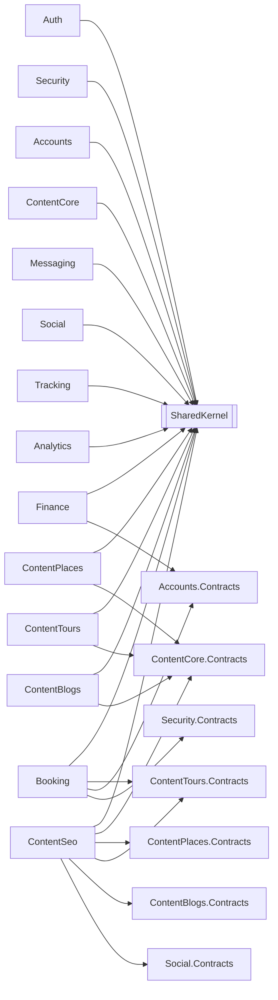
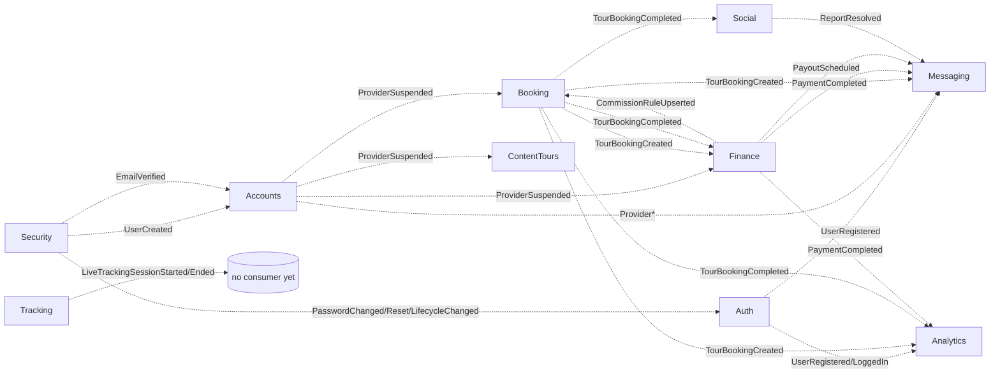

# 03 — Module Map

> **What this document is.** One card per module plus the rules and diagrams for how modules
> relate. Derived from the current implementation under `src/`.
>
> **Boundaries.** It **links to, rather than duplicates**, the foundation docs:
> [`00-introduction-purpose-scope.md`](./00-introduction-purpose-scope.md) (what/why/scope),
> [`01-system-overview.md`](./01-system-overview.md) (stack, host, operational architecture),
> [`02-actors-and-roles.md`](./02-actors-and-roles.md) (authorization model), and
> [`03-use-case-model.md`](./03-use-case-model.md) (business use cases).

---

## 1. Project layout per module

Every module is five projects (layers):

```
{Module}.Domain          Aggregates, entities, value objects, domain events, repository interfaces
{Module}.Application     Commands, Queries, Handlers, Validators, EventHandlers, DTOs, service interfaces
{Module}.Infrastructure  DbContext, EF configurations, repositories, UoW, OutboxWriter, BG services, external service impls
{Module}.Presentation    Minimal API endpoint mappings (Map{Module}Endpoints), SignalR hubs
{Module}.Contracts       Integration events, authorization catalogs, cross-module service interfaces
```

> **Note on "Key aggregates/entities" rows:** the cards below list the most important entities per
> module — a *guide*, not a strict aggregate-root inventory. ADR-007 ties domain-event emission to
> aggregate roots; treat the lists accordingly.

---

## 2. Cross-module communication rules

1. **No shared tables.** Each module owns its own SQL Server schema. Cross-module data is obtained
   through `*.Contracts` service interfaces or locally-held snapshots — never by reading another
   module's tables.
2. **Compile-time coupling is to `*.Contracts` only.** A module may reference another module's
   `Contracts` project (interfaces + integration-event types). It must never reference another
   module's `Domain`, `Application`, or `Infrastructure`.
3. **Runtime collaboration is asynchronous.** Modules collaborate via the transactional
   **Outbox → `CompositeOutboxProcessor` → Inbox** pipeline (at-least-once delivery, consumer-side
   idempotency). See [`workflows/17-outbox-inbox-eventing.md`](./workflows/17-outbox-inbox-eventing.md).
4. **Event ownership.** Every integration event is declared in its **producer's** `*.Contracts`
   (ADR-008 parity); consumers register handlers in their own `Application/EventHandlers`.
5. **Aggregate-root gating.** Only aggregate roots emit domain events (ADR-007); infrastructure
   domain-event handlers translate them into integration events written to the outbox.
6. **One notable synchronous exception.** Booking confirmation after payment is an **in-process
   call** from Finance into Booking, not an outbox event — see
   [`eventing/integration-event-catalog.md`](./eventing/integration-event-catalog.md) (Family A/B).

---

## 3. Dependency overview

### 3.1 Compile-time dependencies

Solid arrows are **compile-time references to `*.Contracts` projects** (or to SharedKernel).
Modules never reference another module's Domain/Application/Infrastructure.



> Legend: `X --> Y.Contracts` = X compile-references Y's Contracts project. `X --> SK` = references
> SharedKernel. Owning Domain/Infra projects are never referenced across module boundaries.

### 3.2 Runtime event flows (selected)

Dashed arrows are **runtime integration events** delivered via Outbox/Inbox.



> Note: `finance.payment.completed.v1` is **not** consumed by Booking — booking confirmation after
> payment is a synchronous in-process call (see §2 rule 6 and the event catalog).

---

## 4. Module cards

### Auth

| | |
|---|---|
| **Purpose** | Identity issuance and credential lifecycle |
| **Schema** | `auth` |
| **Key aggregates/entities** | `Session`, `RefreshToken`, `Device`, `ActivationToken`, `PasswordResetToken`, `Otp`, `ExternalProvider` |
| **Owns** | Login, register, OTP, JWT issuance, session/device lifecycle, refresh-token rotation, external OAuth linking, invitations, password reset |
| **Emits (integration)** | `UserRegistered`, `UserLoggedIn`, `SessionRevoked`, `ActivationTokenIssued`, `PasswordResetTokenIssued` |
| **Consumes** | `EmailVerified`, `PasswordChanged`, `PasswordReset`, `UserLifecycleChanged` (all produced by **Security**) |
| **Background jobs** | `AuthCleanupService`, `AuthRetentionWorker` |
| **External deps** | Gmail SMTP; Google / Facebook OAuth (reCAPTCHA verifier present but disabled) |
| **Dependencies** | SharedKernel only |
| **Status** | **Implemented** |

> External login supports **Google and Facebook** via signed BFF tickets (`/external-providers`,
> `/external-providers/login`). There is **no Apple** provider.

---

### Security

| | |
|---|---|
| **Purpose** | Users, roles, permissions, and admin audit |
| **Schema** | `security` |
| **Key aggregates/entities** | `User`, `Role`, `AdminAuditEntry` |
| **Owns** | User records, role/claim management, role hierarchy, permission catalogs aggregation, admin audit, registration service; owns the `Outbox.Read` / `Outbox.Replay` permissions (Owner + SuperAdmin — see [`02`](./02-actors-and-roles.md)) |
| **Emits (integration)** | `UserCreated`, `EmailVerified`, `PhoneNumberUpdated`, `PasswordChanged`, `PasswordReset`, `UserLifecycleChanged` |
| **Consumes** | `UserRegistered` (Auth) |
| **Background jobs** | — |
| **External deps** | — |
| **Dependencies** | SharedKernel only |
| **Notable services** | `IUserRegistrationService`, `IRoleHierarchyService`, `UserPrivilegeLevelReader`, `IAdminAuditWriter`, `IPasswordHasher` |
| **Status** | **Implemented** |

---

### Accounts

| | |
|---|---|
| **Purpose** | User profiles plus provider and agency onboarding |
| **Schema** | `accounts` |
| **Key aggregates/entities** | `Profile`, `ProviderApplication`, `ProviderDocument`, `AgencyApplication`, `AgencyAffiliation`, `AgencyInvitation` |
| **Owns** | Profile data/avatars; provider onboarding (apply, documents, approval lifecycle); agency rosters (invitations, affiliations); profile creation/reassignment on auth events |
| **Top endpoints** | `/accounts/profile*`; `/provider*` and `/admin/providers/*`; `/agency*` (roster invite/remove/approve) |
| **Emits (integration)** | `ProviderRegistered`, `ProviderApproved`, `ProviderRejected`, `ProviderSuspended`, `ProviderReinstated`, `ProviderStatusChanged`, `ProviderDocumentExpiring`; agency-affiliation events (`AgencyAffiliationCreated/Terminated`, `AgencyGuideAffiliated`) |
| **Consumes** | `UserCreated`, `EmailVerified`, `PhoneNumberUpdated` (Auth/Security) |
| **Background jobs** | `ProviderDocumentExpiryService`, `AgencyInvitationExpiryService` |
| **External deps** | Local file storage (avatars/documents) |
| **Dependencies** | SharedKernel only |
| **Notable services** | `IProfileCreationService`, `IProfileReassignmentService` |
| **Status** | **Implemented** |

> Agency roster operations are owner-scoped: holding `AgencyRoster.*` lets a caller attempt the
> action, and an agency-ownership guard restricts execution to the caller's own agency
> (see [`02`](./02-actors-and-roles.md) §9).

---

### ContentCore

| | |
|---|---|
| **Purpose** | Cross-cutting content primitives reused by Places/Tours/Blogs/Seo |
| **Schema** | `content_core` |
| **Key aggregates/entities** | `Language`, `Category`, `Tag`, `Specialization`, `Attachment` |
| **Owns** | Languages, categories, tags, specializations, attachments/media, translations |
| **Top endpoints** | `/content-core/languages`, `/categories`, `/tags`, `/specializations`, `/attachments`, `/translations` |
| **Emits (integration)** | `LanguageActivated/Deactivated`, `CategoryCreated/Updated/Deleted/Restored`, `AttachmentUploaded/Deleted` |
| **Background jobs** | `MediaProcessingBackgroundService` |
| **External deps** | Azure Translator, local file storage, image/video processing |
| **Dependencies** | SharedKernel only |
| **Notable services** | `ITranslationService` (+ `AutoSaveTranslationService` decorator), `IImageProcessingService`, `IVideoProcessingService`, `ICategoryHierarchyService` |
| **Status** | **Implemented** |

---

### ContentPlaces

| | |
|---|---|
| **Purpose** | Geographic places and business listings |
| **Schema** | `content_places` |
| **Key aggregates/entities** | `Place`, `Business` |
| **Owns** | Places plus business listings and their staff/hours/amenities/service items |
| **Top endpoints** | `/places*`, `/places/nearby`, `/businesses*`, `/businesses/{id}/{hours\|staff}`, `/service-items` |
| **Emits (integration)** | `PlaceCreated/Updated/Deleted`, `BusinessCreated/Approved/Rejected/Suspended/Reinstated/Resubmitted`, `BusinessStaffAdded/Removed`, `ServiceItemCreated/Deleted` |
| **Consumes** | `PlaceTourCountUpdated` (ContentTours) |
| **Background jobs** | — |
| **External deps** | — |
| **Dependencies** | SharedKernel, `ContentCore.Contracts` |
| **Notable services** | `IPlaceExistenceService`, `IPlaceOwnershipService` |
| **Status** | **Implemented** |

---

### ContentTours

| | |
|---|---|
| **Purpose** | Tour catalog, schedules, pricing, packages, guides |
| **Schema** | `content_tours` |
| **Key aggregates/entities** | `Tour`, `TourSchedule`, `TourPricingTier`, `TourPackage`, `TourWaypoint`, `TourGuideProfile` |
| **Owns** | Tour catalog, schedules, pricing tiers, packages, route waypoints, guide assignments/profiles |
| **Top endpoints** | `/tours*`, `/tours/search`, `/tours/{id}/{submit\|schedules\|pricing\|guides\|waypoints\|packages}`, `/tours/admin/{id}/{approve\|reject}`, `/guides*` |
| **Emits (integration)** | `TourCreated/Updated/Submitted/Approved/Rejected/Suspended/Reinstated/Deleted/FeaturedChanged`, `TourScheduleChanged`, `TourPricingTierChanged`, `TourPackage*`, `TourGuideAssigned/Unassigned`, `PlaceTourCountUpdated` |
| **Consumes** | `ProviderSuspended/Reinstated` (Accounts); profile/role info via stub readers (see risks) |
| **Background jobs** | — |
| **External deps** | — |
| **Dependencies** | SharedKernel, `ContentCore.Contracts` |
| **Notable services** | `ITourOwnershipService`, `ITourExistenceService`, `ITourCapacityService`, `IScheduleBookingCountService` |
| **Status** | **Implemented** |

> Deletion is split per the post-P0/P1 model: `Tour.DeleteOwn` (owner) vs `Tour.DeleteAny` (admin);
> likewise `TourGuideProfile.DeleteOwn/DeleteAny` (see [`02`](./02-actors-and-roles.md) §8).

---

### ContentBlogs

| | |
|---|---|
| **Purpose** | Blogs and the content-creator sub-domain |
| **Schema** | `content_blogs` |
| **Key aggregates/entities** | `Blog`, `BlogComment`, `BlogCommentReaction`, `BlogView`, `BlogTour`; **Creators:** `CreatorProfile`, `CreatorApplication`, `CreatorInvitation`, `CreatorFollow`, `CreatorNiche` |
| **Owns** | Blog posts (multi-lang), comments + reactions, blog↔tour linking, views; the Creator sub-domain (profiles, applications, invitations, follows, tiers) and admin creator moderation |
| **Top endpoints** | `/blogs*`, `/blogs/{id}/{publish\|unpublish\|comments\|tours}`, `/blogs/comments/{id}/reactions`, `/blogs/admin/deleted`; `/creators*` and `/blogs/admin/creators/*` (AdminCreatorQueue) |
| **Emits (integration)** | `Blog{Created/Updated/Published/Unpublished/Featured/Unfeatured/Archived/Restored/Deleted}`, `BlogTourLinked/Unlinked`; Creator family (`CreatorApplicationSubmitted/Approved/Rejected/MoreInfoRequested`, `CreatorTierPromoted/Demoted`, `CreatorProfileCreated/Activated/Deactivated/Suspended/Reinstated`, `CreatorInvitationSent/Redeemed/Expired`, `CreatorFollowAdded`) |
| **Consumes** | `LanguageActivated`, `PlaceDeleted`, `TourDeleted` |
| **Background jobs** | `CreatorTierPromotionService`, `CreatorStatsRollupService`, `CreatorInvitationCleanupService`, `BlogCleanupService`, `ProfileCleanupService` |
| **External deps** | — |
| **Dependencies** | SharedKernel, `ContentCore.Contracts` |
| **Notable services** | `IBlogOwnershipService`, `IBlogViewCounter`, `IBlogViewerHashService`, `IBlogAuthorHierarchyGuard`, `IBlogCommentAuthorizationGuard` |
| **Status** | **Implemented** |

> Blog deletion is owner-scoped (`Blog.DeleteOwn`) for Creator/Provider/TourGuide vs admin
> (`Blog.DeleteAny`), enforced with the blog author-hierarchy guard.

---

### ContentSeo

| | |
|---|---|
| **Purpose** | SEO metadata, redirects, sitemap, FAQ, cached weather |
| **Schema** | `content_seo` |
| **Key aggregates/entities** | `SeoMetadata`, `Redirect`, `FaqItem`, `SitemapEntry`, `WeatherCache`, `WeatherDailyBudget` |
| **Owns** | SEO metadata per entity, redirect chains, sitemap, FAQ, cached weather |
| **Top endpoints** | `/seo/metadata/{entityType}/{entityId}`, `/seo/redirects`, `/seo/sitemap.xml`, `/seo/faq`, `/seo/weather/{placeId}` |
| **Emits (integration)** | `SeoMetadataChanged`, `RedirectCreated`, `RedirectChainFlattened`, `FaqItemChanged`, `WeatherBudgetExhausted` |
| **Consumes** | Blog/Place/Tour/Business `Created/Updated/Deleted/Approved/Suspended`; `ReviewAggregateUpdated` (Social) |
| **Background jobs** | `SitemapRegenerationService`, `WeatherPreFetchService` |
| **External deps** | Weather provider (NoOp stub), Search Console pinger (NoOp stub) |
| **Dependencies** | SharedKernel, `ContentCore.Contracts`, `ContentPlaces.Contracts`, `ContentTours.Contracts`, `ContentBlogs.Contracts`, `Social.Contracts` |
| **Status** | **Implemented (with stubs)** |

---

### Booking

| | |
|---|---|
| **Purpose** | Core monetization flow — capacity, locks, bookings, provider documents |
| **Schema** | `booking` |
| **Key aggregates/entities** | `TourBooking`, `AvailabilitySlot`, `SlotLock`, `JoinRequest`, `RefundPolicy`, `ProviderDocument`, `TourGuide` |
| **Owns** | Tour bookings, availability slots and locks, join requests, refund policies, booking-side provider documents |
| **Top endpoints** | `/booking/tour`, `/booking/{id}/{cancel\|confirm\|reject\|complete}`, `/booking/my-bookings`, `/booking/provider/*`, `/booking/availability/{slots\|bulk}`, `/booking/join-requests/{id}/{approve\|reject}`, `/booking/admin/*` |
| **Emits (integration)** | `TourBookingCreated/Confirmed/Cancelled/Completed/Rejected/PaymentExpired`, `JoinRequestCreated/Approved/Rejected`, `AvailabilitySlotCapacityChanged`, `SlotLockCreated/Released`, `ProviderDocumentExpiring/Expired`, `ProviderSuspendedDocumentExpired` |
| **Consumes** | `PaymentCompleted/Failed`, `RefundCompleted/Failed`, `CommissionRuleUpserted/Deleted` (Finance); `ProviderSuspended` (Accounts) |
| **Background jobs** | `SlotLockCleanupService`, `SlotGenerationService`, `SlotCleanupService`, `BookingAutoExpireService`, `ProviderAutoAcceptService`, `BookingAutoCompleteService`, `JoinRequestExpiryService`, `DocumentExpiryCheckService`, `BookingReminderService` |
| **External deps** | — |
| **Dependencies** | SharedKernel, `ContentTours.Contracts`, `Accounts.Contracts`, `Security.Contracts` |
| **Notable services** | `IBookingReferenceGenerator`, `IBookingCommissionLookup`, `IBookingPricingSnapshotReader`, `IBookingProviderSnapshotReader`, `IBookingTourSnapshotReader`, `IDiscountEvaluator`, `ITourGuideOwnershipService` |
| **Status** | **Implemented (with stubs)** |

> Several snapshot readers and the discount evaluator are stubs (`Stub*`, `NoOp*`) — see the
> [risk register](./risks/risk-register.md). Booking confirm/complete/reject and join-request
> approve/reject are owner-scoped with admin override (see [`02`](./02-actors-and-roles.md) §7).

---

### Finance

| | |
|---|---|
| **Purpose** | All money — charges, refunds, invoicing, payouts, commissions |
| **Schema** | `finance` |
| **Key aggregates/entities** | `Payment`, `Invoice`, `Payout`, `CommissionRule`, `Subscription`, `Discount`, `LoyaltyPoints`, `Dispute`, `ProviderBankAccount`, `PaymentExpectation` |
| **Owns** | Charges, refunds, invoicing, payouts, commissions, disputes; subscriptions/loyalty (deferred scaffolding) |
| **Top endpoints** | `/payments/{initiate\|webhook\|refund}`, `/payments/my-payments`, `/payouts/{provider\|admin\|approve\|trigger}`, `/commissions`, `/invoices/{my\|download\|provider}` |
| **Emits (integration)** | `PaymentCompleted/Failed`, `InvoiceGenerated`, `RefundInitiated/Completed/Failed`, `PayoutScheduled/Completed`, `CommissionRuleUpserted/Deleted`, `SubscriptionActivated/Cancelled`, `DisputeOpened` |
| **Consumes** | `TourBookingCreated/Cancelled/Completed/PaymentExpired` (Booking); `ProviderSuspended` (Accounts) |
| **Background jobs** | `PayoutBatchingService`, `RefundRetryService` |
| **External deps** | Payment gateway (`FakePaymentGateway` stub), QuestPDF, local invoice storage |
| **Dependencies** | SharedKernel, `Accounts.Contracts` |
| **Notable services** | `IPaymentGateway`, `IInvoicePdfRenderer`, `IInvoiceStorage`, `IInvoiceNumberGenerator`, `ICommissionLookupService`, `PaymentRedactor` |
| **Status** | **Implemented (with stubs)** |

> The payment webhook is authenticated by HMAC signature; the gateway itself is a stub (no real
> charges) — see the [risk register](./risks/risk-register.md).

---

### Messaging

| | |
|---|---|
| **Purpose** | Outbound communications and support tickets |
| **Schema** | `messaging` |
| **Key aggregates/entities** | `Notification`, `NotificationTemplate`, `DeviceToken`, `SupportTicket`, `AdminAssignmentRoster` |
| **Owns** | In-app, email, and (stubbed) push notifications; notification templates; support tickets and SLA |
| **Top endpoints** | `/messaging/notifications*`, `/messaging/notifications/preferences`, `/messaging/devices/token`, `/messaging/templates`, `/messaging/support/tickets*`, `/hubs/notifications` (SignalR) |
| **Emits (integration)** | `NotificationDelivered/Failed`, `TicketCreated/Assigned`, `SupportTicketResolved`, `SupportSlaBreached` |
| **Consumes** | Auth `UserRegistered`; Accounts `Provider*`; Booking `*Created/Confirmed/Cancelled/Rejected/Completed/JoinRequest*`; Finance `Payment*/Refund*/Payout*/Invoice*`; ContentPlaces `Business*`; Social `ReportResolved` |
| **Background jobs** | `EmailNotificationSenderService`, `ReadNotificationCleanupService`, `SlaMonitoringService`, `NotificationDigestService` |
| **External deps** | SMTP (push FCM/APNs is a stub; AI chatbot deferred) |
| **Dependencies** | SharedKernel only |
| **Notable services** | `INotificationDispatcher`, `INotificationChannelStrategy` (`InApp`, `Email`, `Push`), `INotificationTemplateRenderer` (Mustache), `IEmailSender` |
| **Status** | **Implemented (with stubs)** |

> ChatBot conversation entities are **deferred** (moved to `_Deferred/`; tables removed by
> migration). The `Push` channel strategy is a stub that returns failure.

---

### Social

| | |
|---|---|
| **Purpose** | Reviews, favorites, reports, and moderation |
| **Schema** | `social` |
| **Key aggregates/entities** | `Review`, `ReviewReply`, `ReviewHelpfulVote`, `Report`, `Favorite`, `EntityRatingCache`, `ContentModerationLog`, `UserModerationRecord`; entity snapshots (Tour/Place/Business/BookingEligibility) |
| **Owns** | Reviews + replies + helpful votes, favorites/wishlists, content reports, user moderation (warn/ban), rating aggregation |
| **Top endpoints** | `/social/reviews*` (incl. replies, helpful, admin approve/remove, report), `/social/favorites*`, `/social/reports*`, `/social/moderation/*` |
| **Emits (integration)** | `ReviewPublished`, `ReviewDeleted`, `FavoriteAdded`, `ReportSubmitted`, `ReportResolved`, `RatingRecalculated` |
| **Consumes** | ContentTours `TourCreated/Updated/Deleted`; ContentPlaces `PlaceCreated/Updated/Deleted/BusinessCreated`; Booking `TourBookingCompleted` |
| **Background jobs** | `RatingRecalculationService`, `OrphanedFavoritesCleanupService` |
| **External deps** | — |
| **Dependencies** | SharedKernel only |
| **Notable services** | `IReviewOwnershipService`, profanity/NSFW classifiers (NoOp stubs) |
| **Status** | **Implemented (with stubs)** |

> `ReviewAggregateUpdated` is defined in `Social.Contracts` and consumed by ContentSeo, but is not
> currently emitted by any converter (a known minor parity gap).

---

### Tracking

| | |
|---|---|
| **Purpose** | Live GPS tracking sessions for tours (domain scaffold) |
| **Schema** | `tracking` |
| **Key aggregates/entities** | `LiveTrackingSession`, `LocationSnapshot`, `TourCheckpoint` |
| **Owns** | Live tracking session domain model and location snapshots |
| **Top endpoints** | — (`MapTrackingEndpoints` maps nothing) |
| **Emits (integration)** | `LiveTrackingSessionStarted`, `LiveTrackingSessionEnded` (no consumer registered yet) |
| **Consumes** | — |
| **Background jobs** | — |
| **External deps** | — |
| **Dependencies** | SharedKernel only |
| **Status** | **Scaffold-only** |

> Domain entities, EF persistence, and domain→integration-event outbox converters exist, but there
> is no API surface, commands/queries, or SignalR hub. A live-tracking hub remains unimplemented.

---

### Analytics

| | |
|---|---|
| **Purpose** | Read-side aggregation, recommendations, audit |
| **Schema** | `analytics` |
| **Key aggregates/entities** | `AuditLog`, `UserInteraction`, `PopularityScore`, `EntityPopularitySnapshot`, `RecommendationCache`, `DashboardCache`, `BookingSnapshot`, `PaymentSnapshot`, `UserPreference` |
| **Owns** | Interaction ingest, popularity/trending scoring, recommendation cache, dashboards, admin audit log, GDPR cleanup, boosts/pins/experiments |
| **Top endpoints** | `/analytics/admin/audit-logs*`, `/analytics/admin/{boosts\|pins\|seasonality\|holidays\|experiments\|photogenic}`, dashboard reads, recommendation/interaction reads |
| **Emits (integration)** | `PopularityScoresRecalculated`, `TrendingRefreshed`, `AuditLogEntryRedacted` |
| **Consumes** | Most integration events from every business module |
| **Background jobs** | `InteractionIngestDrainService`, `PopularityScoreCalculationService`, `SuggestionBatchRefreshJob`, `MetricsAggregationJob`, `UserProfileUpdateJob`, `TripStageUpdateJob`, `GdprCleanupJob`, `EmailDigestBackgroundService` |
| **External deps** | — |
| **Dependencies** | SharedKernel only |
| **Notable services** | `IAnalyticsDashboardReader`, `IInteractionIngestQueue`, `IAuditLogRedactor`, `IClientContextProvider` |
| **Status** | **Implemented (with stubs)** |

> Analytics admin operations (boosts, editorial pins, experiments, etc.) are gated by dedicated
> permissions per the post-P0/P1 model; some scoring engines are NoOp stubs.

---

## 5. SharedKernel (cross-cutting)

| Project | Provides |
|---|---|
| `YallaJo.SharedKernel.Domain` | Base entity, aggregate root, domain event, `Result<T>`, errors |
| `YallaJo.SharedKernel.Application` | CQRS contracts (`ICommand`, `IQuery`), pipeline behaviors, abstractions (`IDateTimeProvider`, `ICurrentUser`, `IRequestContext`) |
| `YallaJo.SharedKernel.Infrastructure` | `UnitOfWork`, `CompositeOutboxProcessor`, `OutboxCleanupBackgroundService`, `EfInboxStore`, `MediatRDomainEventDispatcher`, design-time DbContext factory base |
| `YallaJo.SharedKernel.Presentation` | `ToApiResult()`, permission authorization (`MustHavePermissionAttribute`, `PermissionAuthorizationHandler`), common endpoint helpers |

Located under `src/BuildingBlocks/`.

---

## 6. Host / Ops surface

The single runnable process is **`src/Hosts/YallaJo.Api`** — the composition root that wires every
module and exposes operational surfaces. It is not a functional module; it has no schema of its own.

| Concern | Detail |
|---|---|
| **Composition root** | Middleware pipeline (Serilog, localization, rate limiting, auth, exception-handler chain, SeoRedirect*), `Map{Module}Endpoints` wiring |
| **Ops endpoints** | `OpsEndpoints` — outbox dead-letter **read / replay**, gated by `Outbox.Read` / `Outbox.Replay` → **Owner + SuperAdmin only** (see [`02`](./02-actors-and-roles.md) §5) |
| **Health checks** | `OutboxDeadLetterHealthCheck` (and others) under `/health` |
| **Host services** | `NoopSeoRedirectLookupService` (the SeoRedirect middleware is currently inert) |

> *The SeoRedirect middleware is wired but backed by a NoOp lookup — it performs no redirects today.
> Operational machinery (outbox dispatch, dead-letter handling, background jobs) is detailed in
> [`01-system-overview.md`](./01-system-overview.md) §9.

---

## 7. Cross-references

- Introduction, purpose & scope: [`00-introduction-purpose-scope.md`](./00-introduction-purpose-scope.md)
- System overview (stack, host, operations): [`01-system-overview.md`](./01-system-overview.md)
- Actors, role hierarchy & authorization model: [`02-actors-and-roles.md`](./02-actors-and-roles.md)
- Business use-case model: [`03-use-case-model.md`](./03-use-case-model.md)
- Workflows: [`workflows/`](./workflows/)
- Cross-module event catalog: [`eventing/`](./eventing/)
- Risk register: [`risks/`](./risks/)

> **Historical (non-authoritative):** earlier design notes under `../Agents/` (task plans, endpoint
> catalog, ADRs) predate this documentation set and may have drifted — for example, they describe
> Social and the Creator sub-domain as "scaffolded" when they are implemented. Treat `Agents/*` as
> background only; the `docs/` set is the current source of truth.
