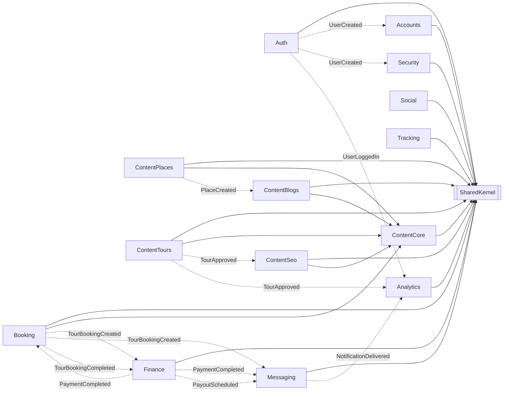

# 03 — Module Map

> One card per module. Order matches the dependency layering: foundational modules first, then content, then transactional, then cross-cutting.

Project layout per module (always 5 layers):

```
{Module}.Domain          Aggregates, entities, value objects, domain events, repository interfaces
{Module}.Application     Commands, Queries, Handlers, Validators, EventHandlers, DTOs, Service interfaces
{Module}.Infrastructure  DbContext, EF configurations, repositories, UoW, OutboxWriter, BG services, external service impls
{Module}.Presentation    Minimal API endpoint mappings (Map{Module}Endpoints), SignalR hubs
{Module}.Contracts       Integration events, authorization catalogs, cross-module service interfaces
```

> **Note on "Key entities" rows:** the cards below list the most important entities per module, not a strict aggregate-root inventory. ADR-007 ties domain-event emission to `IAggregateRoot` — only the Auth card has been spot-verified against `IAggregateRoot` declarations. Treat the other lists as a guide, not as authoritative aggregate-root sets.

---

## Dependency overview



Solid arrows = compile-time references. Dashed = runtime integration events via Outbox/Inbox.

---

## Auth

| | |
|---|---|
| **Schema** | `auth` |
| **Key entities** | `Session`, `RefreshToken`, `ActivationToken`, `PasswordResetToken`, `Otp`, `Device`, `ExternalProvider` (aggregate-root status verified for `Session`, `RefreshToken`, `ActivationToken`, `PasswordResetToken`, `Device`, `ExternalProvider`; others not re-verified) |
| **Owns** | Identity issuance, OTP flows, session lifecycle, external OAuth linking, invitations |
| **Top endpoints** | `/auth/register`, `/auth/login`, `/auth/refresh`, `/auth/logout`, `/auth/verify-email`, `/auth/forgot-password`, `/auth/reset-password`, `/auth/external/{google\|facebook\|apple}`, `/auth/sessions`, `/auth/invites` |
| **Emits (integration)** | `UserRegistered`, `UserLoggedIn`, `SessionRevoked`, `ActivationTokenIssued`, `PasswordResetTokenIssued` |
| **Consumes** | `EmailVerified`, `PasswordChanged`, `UserLifecycleChanged` (all produced by **Security**, see `Security.Contracts/IntegrationEvents/`) |
| **Background jobs** | `AuthCleanupService`, `AuthRetentionWorker` |
| **External deps** | Gmail SMTP, reCAPTCHA, Google/Facebook/Apple OAuth |
| **Notable interfaces** | `ITokenService`, `IOtpService`, `IInviteTokenService`, `IEmailService`, `IRecaptchaVerifier` |

---

## Security

| | |
|---|---|
| **Schema** | `security` |
| **Key entities** | `User`, `Role`, `AdminAuditEntry` |
| **Owns** | Users, role/claim management, role hierarchy, admin audit, registration service |
| **Top endpoints** | `/security/users`, `/security/users/{id}/{status\|roles}`, `/security/roles`, `/security/roles/{id}/claims`, `/security/audit-logs` |
| **Emits** | (events around user lifecycle — see contracts) |
| **Consumes** | `UserRegistered` (Auth) |
| **External deps** | — |
| **Notable services** | `IUserRegistrationService`, `IRoleHierarchyService`, `UserPrivilegeLevelReader`, `IAdminAuditWriter`, `IPasswordHasher` |

---

## Accounts

| | |
|---|---|
| **Schema** | `accounts` |
| **Key entities** | `Profile` |
| **Owns** | User profile data, avatars, profile creation/reassignment on auth events |
| **Top endpoints** | `/accounts/profile`, `/accounts/profile/avatar`, `/accounts/profile/{userId}` |
| **Consumes** | `UserCreated`, `EmailVerified`, `PhoneNumberUpdated` (from Auth/Security) |
| **External deps** | Local file storage (avatars) |
| **Notable services** | `IProfileCreationService`, `IProfileReassignmentService` |

---

## ContentCore

| | |
|---|---|
| **Schema** | `content_core` |
| **Key entities** | `Language`, `Category`, `Tag`, `Specialization`, `Attachment` |
| **Owns** | Cross-cutting content primitives reused by Places/Tours/Blogs/Seo |
| **Top endpoints** | `/content-core/languages`, `/categories`, `/tags`, `/specializations`, `/attachments`, `/translations` |
| **Emits** | `LanguageActivated/Deactivated`, `CategoryCreated/Updated/Deleted/Restored`, `AttachmentUploaded/Deleted` |
| **External deps** | Azure Translator, local file storage, image/video processing |
| **Notable services** | `ITranslationService` (+ `AutoSaveTranslationService` decorator), `IImageProcessingService`, `IVideoProcessingService`, `ICategoryHierarchyService` |

---

## ContentPlaces

| | |
|---|---|
| **Schema** | `content_places` |
| **Key entities** | `Place`, `Business` |
| **Owns** | Geographic places + business listings + their staff/hours/amenities/services |
| **Top endpoints** | `/places`, `/places/{slug}`, `/places/nearby`, `/places/{id}/businesses`, `/businesses`, `/businesses/{id}/hours`, `/businesses/{id}/staff`, `/service-items` |
| **Emits** | `PlaceCreated/Updated/Deleted`, `BusinessCreated/Approved/Rejected/Suspended/Reinstated/Resubmitted`, `BusinessStaffAdded/Removed`, `ServiceItemCreated/Deleted` |
| **Consumes** | `PlaceTourCountUpdated` (from ContentTours) |
| **Notable services** | `IPlaceExistenceService`, `IPlaceOwnershipService` |

---

## ContentTours

| | |
|---|---|
| **Schema** | `content_tours` |
| **Key entities** | `Tour`, `TourSchedule`, `TourPricingTier`, `TourPackage`, `TourWaypoint` |
| **Owns** | Tour catalog, schedules, pricing, packages, route waypoints, guide assignments |
| **Top endpoints** | `/tours`, `/tours/{slug}`, `/tours/search`, `/tours/{id}/{submit\|schedules\|pricing\|guides\|waypoints\|packages\|children-info}`, `/tours/admin/{id}/{approve\|reject}` |
| **Emits** | `TourCreated/Updated/Submitted/Approved/Rejected/Suspended/Reinstated/Deleted/FeaturedChanged`, `TourScheduleChanged`, `TourPricingTierChanged`, `TourPackage*`, `TourGuideAssigned/Unassigned`, `PlaceTourCountUpdated` |
| **Consumes** | Profile / role / availability info via stub services (see risks) |
| **Notable services** | `ITourOwnershipService`, `ITourExistenceService`, `ITourCapacityService`, `IScheduleBookingCountService` |

---

## ContentBlogs

| | |
|---|---|
| **Schema** | `content_blogs` |
| **Key entities** | `Blog`, `BlogComment`, `BlogTour` |
| **Owns** | Blog posts (multi-lang), comments + reactions, blog↔tour linking, views |
| **Top endpoints** | `/blogs`, `/blogs/{slug}`, `/blogs/{id}/{publish\|unpublish\|comments\|tours}`, `/blogs/comments/{commentId}/reactions` |
| **Emits** | `Blog{Created/Updated/Published/Unpublished/Featured/Unfeatured/Archived/Restored/Deleted}`, `BlogTourLinked/Unlinked` |
| **Consumes** | `LanguageActivated`, `PlaceDeleted`, `TourDeleted` |
| **Notable services** | `IBlogOwnershipService`, `IBlogViewCounter`, `IBlogViewerHashService`, `IBlogAuthorHierarchyGuard`, `IBlogCommentAuthorizationGuard` |

---

## ContentSeo

| | |
|---|---|
| **Schema** | `content_seo` |
| **Key entities** | `SeoMetadata`, `Redirect`, `FaqItem`, `SitemapEntry`, `WeatherCache`, `WeatherDailyBudget` |
| **Owns** | SEO metadata per entity, redirect chains, sitemap, FAQ, cached weather |
| **Top endpoints** | `/seo/metadata/{entityType}/{entityId}`, `/seo/redirects`, `/seo/sitemap.xml`, `/seo/faq`, `/seo/weather/{placeId}` |
| **Emits** | `SeoMetadataChanged`, `RedirectCreated`, `RedirectChainFlattened`, `FaqItemChanged`, `WeatherBudgetExhausted` |
| **Consumes** | Blog/Place/Tour/Business `Created/Updated/Deleted/Approved/Suspended` |
| **Background jobs** | `SitemapRegenerationService`, `WeatherPreFetchService` |
| **External deps** | Weather provider (stub), Search Console pinger (stub) |

---

## Booking

| | |
|---|---|
| **Schema** | `booking` |
| **Key entities** | `TourBooking`, `AvailabilitySlot`, `SlotLock`, `JoinRequest`, `RefundPolicy`, `ProviderDocument`, `TourGuide` |
| **Owns** | The core monetization flow — capacity, locks, bookings, provider documents |
| **Top endpoints** | `/booking/tour`, `/booking/{id}/{cancel\|confirm\|reject\|complete}`, `/booking/my-bookings`, `/booking/provider/{pending\|upcoming\|history}`, `/booking/availability/{slots\|bulk}`, `/booking/provider-documents`, `/booking/admin/*` |
| **Emits** | `TourBookingCreated/Confirmed/Cancelled/Completed/Rejected/PaymentExpired`, `JoinRequestCreated/Approved/Rejected`, `AvailabilitySlotCapacityChanged`, `SlotLockCreated/Released`, `ProviderDocumentExpiring/Expired`, `ProviderSuspendedDocumentExpired` |
| **Consumes (via converters)** | `PaymentCompleted/Failed`, `RefundCompleted/Failed` (Finance) |
| **Background jobs** | `SlotLockCleanupService`, `BookingAutoExpireService`, `ProviderAutoAcceptService`, `DocumentExpiryCheckService` |
| **Notable services** | `IBookingReferenceGenerator`, `IBookingCommissionLookup`, `IBookingPricingSnapshotReader`, `IBookingProviderSnapshotReader`, `IBookingTourSnapshotReader`, `IDiscountEvaluator`, `ITourGuideOwnershipService` |

> Several snapshot readers are stubs (`Stub*`) — see [risks](./risks/risk-register.md).

---

## Finance

| | |
|---|---|
| **Schema** | `finance` |
| **Key entities** | `Payment`, `Invoice`, `Payout`, `CommissionRule`, `Subscription`, `Discount`, `LoyaltyPoints`, `Dispute`, `ProviderBankAccount`, `PaymentExpectation` |
| **Owns** | All money: charges, refunds, invoicing, payouts, commissions, subscriptions, disputes, loyalty |
| **Top endpoints** | `/finance/payments/{initiate\|webhook\|refund}`, `/finance/payments/my-payments`, `/finance/payouts/{provider\|admin\|approve\|trigger}`, `/finance/commissions`, `/finance/invoices/{my\|download\|provider}` |
| **Emits** | `PaymentCompleted/Failed`, `InvoiceGenerated`, `RefundInitiated/Completed/Failed`, `PayoutScheduled/Completed`, `CommissionRuleUpserted/Deleted`, `SubscriptionActivated/Cancelled`, `DisputeOpened` |
| **Consumes** | `TourBookingCreated/Cancelled/Completed/PaymentExpired` (Booking) |
| **Background jobs** | `PayoutBatchingService`, `RefundRetryService` |
| **External deps** | Payment gateway (stub), QuestPDF, local invoice storage |
| **Notable services** | `IPaymentGateway`, `IInvoicePdfRenderer`, `IInvoiceStorage`, `IInvoiceNumberGenerator`, `ICommissionLookupService`, `PaymentRedactor` |

---

## Messaging

| | |
|---|---|
| **Schema** | `messaging` |
| **Key entities** | `Notification`, `NotificationTemplate`, `DeviceToken`, `SupportTicket`, `ChatBotConversation`, `AdminAssignmentRoster` |
| **Owns** | All outbound user comms (in-app, email, push) + support tickets + chatbot |
| **Top endpoints** | `/messaging/notifications`, `/messaging/notifications/preferences`, `/messaging/devices/token`, `/messaging/templates`, `/messaging/support/tickets`, `/hubs/notifications` (SignalR) |
| **Emits** | `NotificationDelivered/Failed`, `TicketCreated/Assigned`, `SupportTicketResolved`, `SupportSlaBreached` |
| **Consumes** | Almost everything: Auth `UserRegistered`; Booking `*Created/Confirmed/Cancelled/Rejected/Completed/JoinRequest*`; Finance `Payment*/Refund*/Payout*/Invoice*`; ContentPlaces `Business*`; reports |
| **Background jobs** | `EmailNotificationSenderService`, `ReadNotificationCleanupService` |
| **External deps** | SMTP, (planned: FCM/APNs, LLM provider) |
| **Notable services** | `INotificationDispatcher`, `INotificationChannelStrategy` (`InApp`, `Email`, `Push`), `INotificationTemplateRenderer` (Mustache), `IEmailSender` |

---

## Social

| | |
|---|---|
| **Schema** | `social` |
| **Status** | Scaffolded (entities + plan, endpoints in progress) |
| **Owns** | Reviews, favorites, reports, moderation logs |
| **Reference** | [`../Agents/tasks/Social/`](../Agents/tasks/Social/) |

---

## Tracking

| | |
|---|---|
| **Schema** | `tracking` |
| **Status** | Scaffolded — `LiveTrackingHub` planned per [`../Agents/YallaJo.md`](../Agents/YallaJo.md) |
| **Owns** | Live GPS sessions, location snapshots, 30-day retention |

---

## Analytics

| | |
|---|---|
| **Schema** | `analytics` |
| **Key entities** | `AuditLog`, `UserInteraction`, `PopularityScore`, `EntityPopularitySnapshot`, `RecommendationCache`, `DashboardCache`, `BookingSnapshot`, `PaymentSnapshot`, `UserPreference` |
| **Owns** | Read-side aggregations and analytics for the platform |
| **Top endpoints** | `/analytics/admin/audit-logs`, dashboard reads, interaction ingest |
| **Emits** | `PopularityScoresRecalculated`, `TrendingRefreshed`, `AuditLogEntryRedacted` |
| **Consumes** | Most integration events from every business module |
| **Background jobs** | `InteractionIngestDrainService`, `PopularityScoreCalculationService` (others planned) |
| **Notable services** | `IAnalyticsDashboardReader`, `IInteractionIngestQueue`, `IAuditLogRedactor`, `IClientContextProvider` |

---

## SharedKernel (cross-cutting)

| Project | Provides |
|---|---|
| `YallaJo.SharedKernel.Domain` | Base entity, aggregate root, domain event, `Result<T>`, errors |
| `YallaJo.SharedKernel.Application` | CQRS contracts (`ICommand`, `IQuery`), pipeline behaviors, abstractions (`IDateTimeProvider`, `ICurrentUser`, `IRequestContext`) |
| `YallaJo.SharedKernel.Infrastructure` | `UnitOfWork`, `CompositeOutboxProcessor`, `OutboxCleanupBackgroundService`, `EfInboxStore`, `MediatRDomainEventDispatcher`, design-time DbContext factory base |
| `YallaJo.SharedKernel.Presentation` | `ToApiResult()`, permission authorization, common endpoint helpers |
