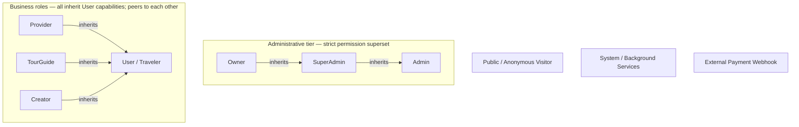
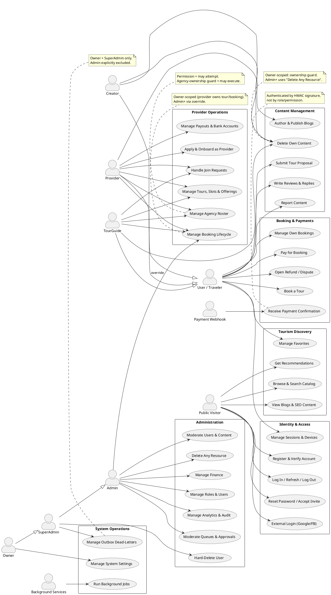

# 03 — Use Case Model

> **Scope.** Business use cases for YallaJo, grouped into packages and mapped to actors,
> reflecting the system **after the P0/P1 authorization wave**. Companion to
> [`02-actors-and-roles.md`](./02-actors-and-roles.md) — read that first for the actor catalog,
> role hierarchy, and authorization model.
>
> This document is **high-level by design**: it describes *business use cases*, not API routes.
> For raw endpoints see the module presentation layers; for cross-module fan-out see
> [`eventing/integration-event-catalog.md`](./eventing/integration-event-catalog.md).

---

## 1. Purpose of the use case model

This model answers three questions for new engineers and stakeholders:

1. **Who** can do **what** in YallaJo (actor → use case).
2. **How capabilities accumulate** through the role hierarchy (generalization).
3. **Where authorization is conditional** — i.e. use cases gated by ownership, admin override,
   tier, or signature rather than by a flat role grant.

It is the bridge between the verified authorization model (`02-actors-and-roles.md`) and the
UML Use Case diagram. It is intentionally stable: it changes only when business capabilities or
the authorization model change — not when individual endpoints are refactored.

---

## 2. Actor generalization

YallaJo has **eight human roles plus two non-human actors**. Generalization exists in **two
separate trees**; the trees are **not** connected to each other.

**Rules (verified against the role-to-permission mapping):**

- **Owner inherits SuperAdmin; SuperAdmin inherits Admin.** Each higher tier holds every
  permission of the tier below, plus a small delta (`System.Update` → Owner only;
  `User.DeleteAny` + `Outbox.*` → Owner + SuperAdmin).
- **Provider, TourGuide, and Creator inherit User capabilities** — each business role is granted
  `ConsumerPermissions`, so every User use case is also available to them. The diagram shows this
  as generalization arrows to `User`, so consumer use cases need not be redrawn per role.
- **Business roles are peers, not a hierarchy.** Provider, TourGuide, Creator, and User all sit
  at privilege level `Standard (10)`. None inherits another; Provider/TourGuide simply add the
  `ProviderSelfPermissions` surface, and Creator adds content authoring.
- **The Admin tree and the User tree are independent.** Admin's reach comes from holding (almost)
  all permission claims, not from inheriting the Consumer set. Do not draw an arrow between them.
- **Public, System, and Webhook do not participate in generalization** — they have no shared
  role basis.
- **Important:** this generalization is **capability inheritance for the use-case model only —
  NOT a privilege hierarchy.** Provider, TourGuide, and Creator are **not** superior to User;
  they sit at the same privilege level (`Standard`, 10) and simply receive additional capability
  sets. The arrows mean "can also perform User's use cases," not "outranks User."

---

## 3 & 4. Use case packages

Seven packages organize the business use cases. Each lists 3–6 high-level use cases.

### P1 — Identity & Access
- Register & Verify Account (OTP)
- Log In / Refresh Session / Log Out
- Reset Password / Accept Invitation
- External Login (Google / Facebook)
- Manage Own Sessions & Devices

### P2 — Tourism Discovery
- Browse & Search Tours / Places / Guides
- View Blogs & SEO Content
- Get Personalized Recommendations
- Manage Favorites / Wishlist

### P3 — Booking & Payments
- Book a Tour
- Manage Own Bookings (view / cancel)
- Pay for Booking
- Open Refund / Dispute
- Receive Payment Confirmation *(webhook)*

### P4 — Provider Operations
- Apply & Onboard as Provider (documents, dashboard)
- Manage Tours, Slots & Offerings *(incl. Delete Own)*
- Manage Booking Lifecycle (confirm / complete / reject)
- Handle Join Requests (approve / reject)
- Manage Payouts & Bank Accounts
- Manage Agency Roster *(agency owner)*

### P5 — Content Management
- Author & Publish Blogs *(Creator)*
- Submit Tour Proposal
- Write Reviews & Replies
- Report Content
- Delete Own Content *(DeleteOwn)*

### P6 — Administration
- Moderate Queues (approve / reject / suspend entities)
- Moderate Users & Content (ban / remove / feature)
- Delete Any Resource *(DeleteAny)*
- Manage Finance (payouts, commissions, KYC)
- Manage Roles & Users *(incl. Hard-Delete User — SuperAdmin+)*
- Manage Analytics & Audit (experiments, redaction)

### P7 — System Operations
- Run Background Jobs (outbox, schedulers)
- Manage Outbox Dead-Letters (read / replay) *(Owner + SuperAdmin)*
- Manage System Settings *(Owner only)*

---

## 5. Actor-to-use-case matrix

Legend: ● direct · (↑) inherited via generalization · 🟡 owner-scoped (ownership guard) ·
🔒 admin-tier / override · ✗ explicitly denied · — none

| Use case (package) | Public | User | Provider | TourGuide | Creator | Admin | SAdmin | Owner | System | Webhook |
|---|:-:|:-:|:-:|:-:|:-:|:-:|:-:|:-:|:-:|:-:|
| Register / Login / Reset (P1) | ● | ● | (↑) | (↑) | (↑) | ● | ● | ● | — | — |
| Manage Sessions & Devices (P1) | — | ● | (↑) | (↑) | (↑) | ● | ● | ● | — | — |
| Browse / Search / Recommend (P2) | ● | ● | (↑) | (↑) | (↑) | ● | ● | ● | — | — |
| Manage Favorites (P2) | — | ● | (↑) | (↑) | (↑) | (↑) | (↑) | (↑) | — | — |
| Book / Manage Bookings / Pay / Dispute (P3) | — | ● | (↑) | (↑) | (↑) | 🔒 | 🔒 | 🔒 | — | — |
| Receive Payment Confirmation (P3) | — | — | — | — | — | — | — | — | — | ● |
| Provider Onboard / Tours / Slots / DeleteOwn (P4) | — | apply | 🟡 | 🟡 | — | 🔒 | 🔒 | 🔒 | — | — |
| Booking Lifecycle + Join Requests (P4) | — | — | 🟡 | 🟡 | — | 🔒 | 🔒 | 🔒 | — | — |
| Manage Agency Roster (P4) | — | — | 🟡 | 🟡 | — | ● | ● | ● | — | — |
| Author Blogs / Delete Own Content (P5) | — | — | (↑) | (↑) | ● | ● | ● | ● | — | — |
| Tour Proposal / Reviews / Reports (P5) | — | ● | (↑) | (↑) | (↑) | ● | ● | ● | — | — |
| Moderate Queues / Users / Delete Any (P6) | — | — | — | — | — | ● | ● | ● | — | — |
| Manage Finance / Analytics / Audit (P6) | — | — | — | — | — | ● | ● | ● | — | — |
| Manage Roles & Users (P6) | — | — | — | — | — | ● | ● | ● | — | — |
| Hard-Delete User (P6) | — | — | — | — | — | ✗ | ● | ● | — | — |
| Run Background Jobs (P7) | — | — | — | — | — | — | — | — | ● | — |
| Manage Outbox Dead-Letters (P7) | — | — | — | — | — | ✗ | ● | ● | — | — |
| Manage System Settings (P7) | — | — | — | — | — | ✗ | ✗ | ● | — | — |

> `(↑)` rows for Admin/SuperAdmin/Owner reflect that they also hold the underlying permission
> claims; they are not part of the User generalization tree but are capable of those actions.
> Provider/TourGuide/Creator `(↑)` rows are inherited from User via generalization.

---

## 6. PlantUML master use case diagram

---

## 7. Notes on owner-scoped & conditional use cases

These use cases are **not** flat role grants. Their authorization is conditional and must be
annotated on the diagram (see the notes in the PlantUML above).

### DeleteOwn vs DeleteAny
- **Delete Own Content** (Provider / TourGuide / Creator) is gated by a `*.DeleteOwn` permission
  **plus** an ownership guard — you may delete only resources you own.
- **Delete Any Resource** (Admin+) uses the `*.DeleteAny` permission — a platform override with
  no ownership restriction. These are two distinct use cases, drawn separately.

### Booking-lifecycle ownership (three senses)
"Ownership" in the booking flow means different things to different actors:
- **User = booking owner** — may view and **cancel their own** booking (and open a refund/dispute
  on it).
- **Provider / TourGuide = service owner** — may **confirm / complete / reject** a booking and
  **approve / reject join requests** for tours/slots **they own**; enforced by the handler's
  ownership guard. These permissions are part of `ProviderSelfPermissions`.
- **Admin+ = operational override** — may act on **any** booking (force-refund, override
  lifecycle) via `AdminBookingDashboard.{Read,Update}`; bypasses ownership. Drawn as the dashed
  `Admin --> Manage Booking Lifecycle : override` association.

### AgencyRoster ownership
- **Manage Agency Roster** (invite / remove / approve / reject guides) follows the
  **permission = *may attempt* / guard = *may execute*** principle. Holding `AgencyRoster.*` lets
  a Provider/TourGuide attempt the action; the agency-ownership guard ensures they can act only
  on **their own agency**. Admin+ may act platform-wide.

### Outbox — Owner + SuperAdmin only
- **Manage Outbox Dead-Letters** (read / replay) is restricted to **Owner + SuperAdmin**.
  **Admin is explicitly excluded.** Attach this use case only to SuperAdmin (inherited by Owner).

### System Settings — Owner only
- **Manage System Settings** is Owner-only. Attach only to Owner.

### Payment webhook — HMAC
- **Receive Payment Confirmation** is performed by the non-human **Payment Webhook** actor and is
  authenticated by **HMAC signature verification**, not by any role or permission. Annotate
  `{HMAC-verified}`.

---

## 8. Use cases to draw separately (later)

These flows have rich internal state machines or wide cross-module fan-out and deserve their own
focused use-case / activity / sequence diagrams rather than expansion inside the master diagram.
Represent each as a **single node** in the master diagram and expand it elsewhere.

| Complex flow | Why it needs its own diagram | Existing reference |
|---|---|---|
| **Book a Tour → Pay → Confirm** | Multi-state lifecycle (AwaitingPayment → PendingConfirmation → Confirmed → Completed), TTL expiry, ownership, webhook, admin override | [`workflows/06-booking-lifecycle.md`](./workflows/06-booking-lifecycle.md) |
| **Provider Onboarding & Approval** | apply → submit docs → admin approve/reject/request-more-docs/suspend/reinstate → role grant; large suspension fan-out | onboarding workflow *(planned)* + [`eventing/integration-event-catalog.md`](./eventing/integration-event-catalog.md) Family C |
| **Refund / Dispute** | user-opened vs admin force-refund; refund-policy %; escrow timing | [`workflows/06-booking-lifecycle.md`](./workflows/06-booking-lifecycle.md) |
| **Content Moderation Workflow** | Draft → Pending → Approved/Published → Hidden/Removed; DeleteOwn vs DeleteAny interplay | moderation workflow *(planned)* |
| **Agency Roster Management** | invite / approve / reject / remove with agency-ownership guard | this doc §7 + agency handlers |

---

## 9. Cross-references

- Actors, role hierarchy, and authorization model: [`02-actors-and-roles.md`](./02-actors-and-roles.md)
- Cross-module event fan-out behind these use cases: [`eventing/integration-event-catalog.md`](./eventing/integration-event-catalog.md)
- Core business flow detail: [`workflows/06-booking-lifecycle.md`](./workflows/06-booking-lifecycle.md)
- Eventing mechanism that powers asynchronous use-case side effects: [`workflows/17-outbox-inbox-eventing.md`](./workflows/17-outbox-inbox-eventing.md)
