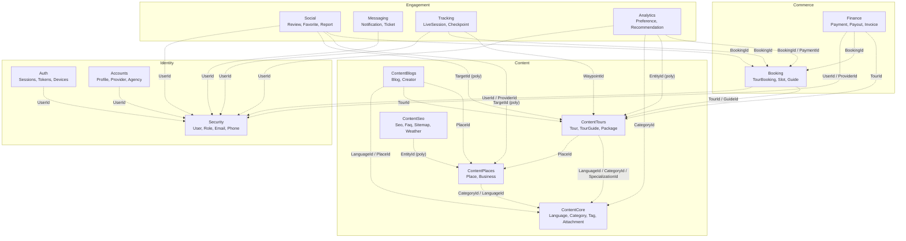

# Master ERD — Module-Level View

This is the **high-level master diagram**. Each node is a **module/schema** (not its
tables). Edges show the **dominant cross-module logical references** — all of which are
**logical only (no DB foreign keys)**, populated via integration events.

> For the exact column-level catalog of these links, see
> [`00-cross-module-logical-links.md`](00-cross-module-logical-links.md).

---

## Module dependency map (logical references)



> **Legend:** every arrow is a **dashed logical reference** (a `Guid` column with **no DB
> foreign key**). `(poly)` = polymorphic reference resolved by an `EntityType`/`TargetType`
> discriminator (the target module shown is the most common target, not the only one).

---

## Master ERD — modules as entities with their shared keys

This `erDiagram` view treats each module as an entity exposing the **identifiers other
modules reference**, with relationship lines summarising the dominant flows.

```mermaid
erDiagram
    SECURITY {
        guid User_Id PK
        guid Role_Id PK
    }
    ACCOUNTS {
        guid Profile_Id PK
        guid ProviderApplication_Id PK
        guid UserId LREF
    }
    AUTH {
        guid Session_Id PK
        guid UserId LREF
    }
    CONTENTCORE {
        guid Language_Id PK
        guid Category_Id PK
        guid Specialization_Id PK
    }
    CONTENTTOURS {
        guid Tour_Id PK
        guid TourGuide_Id PK
        guid PlaceId LREF
    }
    CONTENTPLACES {
        guid Place_Id PK
        guid Business_Id PK
    }
    CONTENTBLOGS {
        guid Blog_Id PK
        guid CreatorProfile_Id PK
    }
    CONTENTSEO {
        guid SeoMetadata_Id PK
    }
    BOOKING {
        guid TourBooking_Id PK
        guid TourGuide_Id PK
        guid UserId LREF
        guid TourId LREF
    }
    FINANCE {
        guid Payment_Id PK
        guid Invoice_Id PK
        guid BookingId LREF
    }
    SOCIAL {
        guid Review_Id PK
        guid TargetId LREF
    }
    MESSAGING {
        guid Notification_Id PK
        guid UserId LREF
    }
    TRACKING {
        guid LiveTrackingSession_Id PK
        guid TourBookingId LREF
    }
    ANALYTICS {
        guid UserPreference_Id PK
        guid EntityId LREF
    }

    SECURITY      ||..o{ ACCOUNTS      : "UserId"
    SECURITY      ||..o{ AUTH          : "UserId"
    SECURITY      ||..o{ BOOKING       : "UserId / ProviderId"
    SECURITY      ||..o{ FINANCE       : "UserId / ProviderId"
    SECURITY      ||..o{ SOCIAL        : "UserId"
    SECURITY      ||..o{ MESSAGING     : "UserId"
    SECURITY      ||..o{ TRACKING      : "UserId"
    SECURITY      ||..o{ ANALYTICS     : "UserId"
    CONTENTCORE   ||..o{ CONTENTTOURS  : "Language/Category/Specialization"
    CONTENTCORE   ||..o{ CONTENTPLACES : "Category/Language"
    CONTENTCORE   ||..o{ CONTENTBLOGS  : "Language"
    CONTENTCORE   ||..o{ ANALYTICS     : "CategoryId"
    CONTENTPLACES ||..o{ CONTENTTOURS  : "PlaceId"
    CONTENTPLACES ||..o{ CONTENTBLOGS  : "PlaceId"
    CONTENTPLACES ||..o{ CONTENTSEO    : "EntityId (poly)"
    CONTENTTOURS  ||..o{ BOOKING       : "TourId / GuideId"
    CONTENTTOURS  ||..o{ CONTENTBLOGS  : "TourId"
    CONTENTTOURS  ||..o{ SOCIAL        : "TargetId (poly)"
    CONTENTTOURS  ||..o{ TRACKING      : "WaypointId"
    CONTENTTOURS  ||..o{ ANALYTICS     : "EntityId (poly)"
    BOOKING       ||..o{ FINANCE       : "BookingId"
    BOOKING       ||..o{ SOCIAL        : "BookingId"
    BOOKING       ||..o{ TRACKING      : "TourBookingId"
    BOOKING       ||..o{ ANALYTICS     : "BookingId"
```

> All `..` (dotted) relationships are **logical references, not DB foreign keys**.
> `LREF` = logical reference column.

---

## Notes

- **Security** is the most-referenced module (`UserId` flows in from nearly every module).
- **ContentCore** is the shared reference-data hub (`Language`, `Category`, `Specialization`).
- **Booking** and **ContentTours** are central to the commerce/engagement flows.
- **Snapshot entities** (e.g. `Booking.TourSnapshot`, `Social.PlaceSnapshot`,
  `Analytics.PaymentSnapshot`, `Messaging.UserSnapshot`) are how modules cache cross-module
  data locally; they appear in the per-module diagrams, not here.
