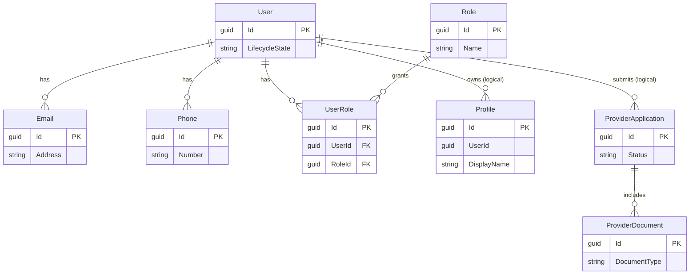
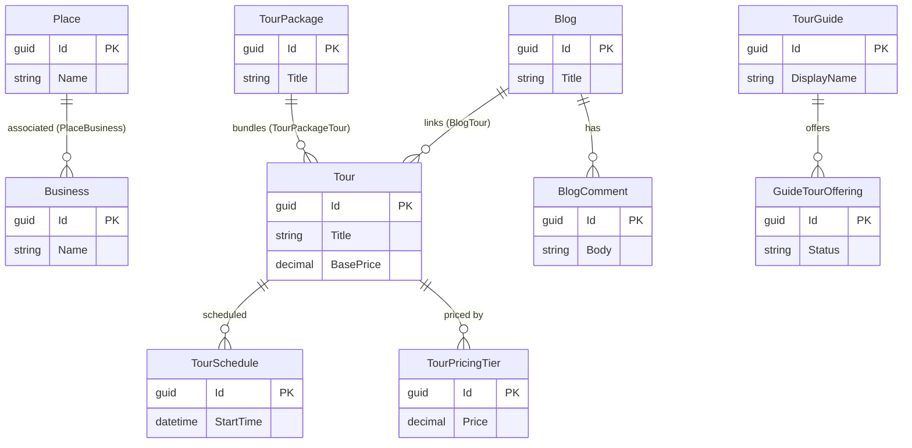
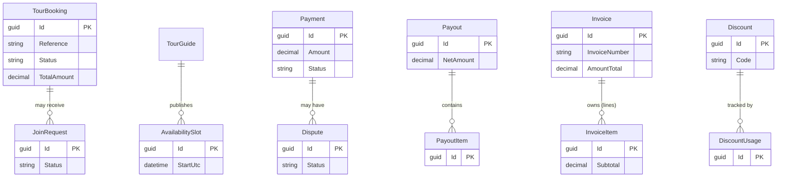
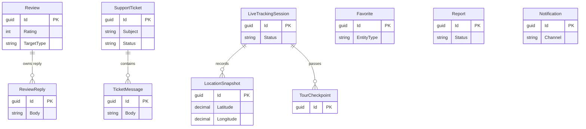

# Simplified ERD (for SRS / PDF)

A **simplified, documentation-friendly** view showing the **core business entities** only.
Infrastructure (Outbox/Inbox), caches, snapshots, and most join/child tables are **omitted**
for clarity. Only primary keys and a few business attributes are shown. Cross-module links
are **not** drawn here (see the master ERD for those).

> Audience: SRS / PDF / non-technical stakeholders.
> For the full technical model, see the per-module diagrams under `modules/`.

---

## Identity & Accounts

---

## Content (Tours, Places, Blogs)

---

## Commerce (Booking & Finance)

---

## Engagement (Social, Messaging, Tracking)

> **Notes for documentation readers:**
> - All modules are isolated by schema; links between modules are *logical* (handled by
>   integration events), not physical foreign keys.
> - Audit fields (`CreatedAt`, `UpdatedAt`), soft-delete (`IsDeleted`), and concurrency
>   (`RowVersion`) exist on most entities but are omitted here for readability.
