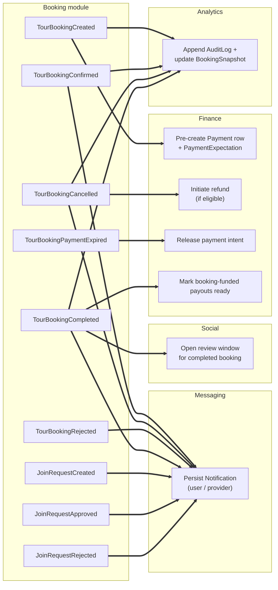
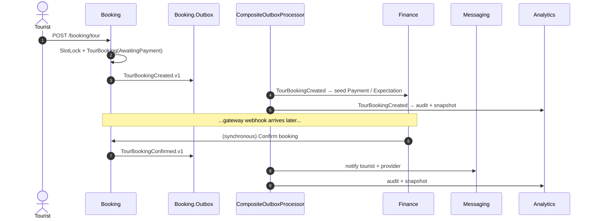
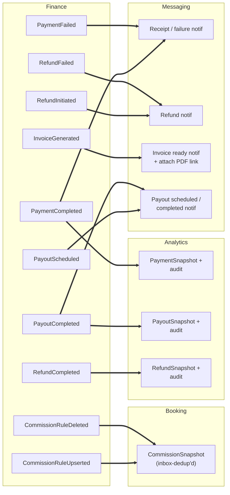
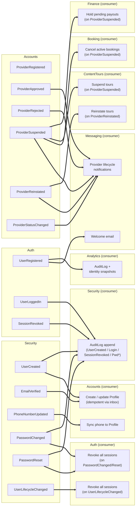
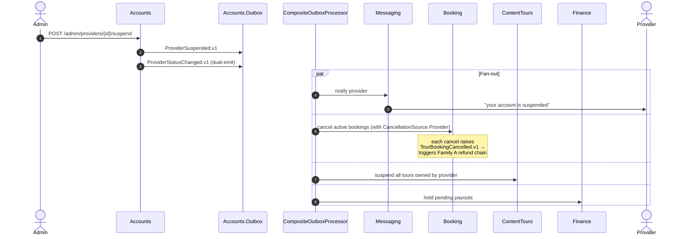

# Integration Event Catalog — Phase A

> **Audience:** new backend engineers trying to answer the question
> *"if I change this event, what breaks?"* — or the reverse,
> *"what fires when X happens in the business?"*
>
> **What this is:** an architecture-oriented map of cross-module communication for the
> three event families that carry the most business weight today. **Ownership, direction,
> and side effects are first-class; payload field lists are not.**
>
> **What this is not:** a payload reference. Field shapes live in the `*.Contracts/IntegrationEvents/*.cs`
> records themselves — link, don't copy.

---

## How this fits into the docs

| You want to know… | Read… |
|---|---|
| **How** the outbox/inbox mechanism works | [`../workflows/17-outbox-inbox-eventing.md`](../workflows/17-outbox-inbox-eventing.md) |
| **What** events exist + **who** publishes/consumes them | **this doc** |
| The full booking state machine that emits these events | [`../workflows/06-booking-lifecycle.md`](../workflows/06-booking-lifecycle.md) |
| Why we use Outbox + Inbox at all | [`../../Agents/decisions/ADR-008-integration-event-registry-parity.md`](../../Agents/decisions/ADR-008-integration-event-registry-parity.md), [`ADR-007`](../../Agents/decisions/ADR-007-aggregate-root-gated-dispatch.md) |
| Gaps in cross-module handler coverage | [`../risks/risk-register.md`](../risks/risk-register.md) → RISK-005 |

---

## Scope — Phase A vs. Phase B

| Phase | Families | Status |
|---|---|---|
| **A (this doc)** | (a) Booking lifecycle · (b) Finance / Payment / Refund / Payout / Commission · (c) Identity bootstrap (Auth → Security → Accounts fan-out) + Provider lifecycle | ✅ catalogued here |
| **B (deferred)** | Content (ContentCore / ContentTours / ContentPlaces / ContentBlogs publication & moderation events) · ContentSeo invalidation · Social (reviews, favorites, reports) · Messaging notification delivery · Analytics audit-log redaction · Tracking live-session events | named in registry, not catalogued here |

Phase A covers **~35 of the ~80 events** registered in
[`IntegrationEventTypeRegistry`](../../YallaJo.SharedKernel.Infrastructure/Abstractions/Integration/IntegrationEventTypeRegistry.cs).
These three families are the ones that touch money, identity, or the
core booking flow — i.e. the ones where a wrong consumer wiring is a production incident.

---

## Conventions used below

### Diagram legend

| Notation | Meaning |
|---|---|
| **Solid arrow** `==>` | At-least-once integration event delivery (Outbox → CompositeOutboxProcessor → Inbox) |
| **Dashed arrow** `-.->` | In-module domain event (synchronous, transactional with `SaveChanges`) — shown only when needed to explain why an integration event is **not** the path used |
| Box label = module + event class | E.g. `Booking · TourBookingCreated` |
| ⚠️ on an arrow | Architecturally notable behavior (e.g. fan-out skew, missing handler, dual-emit) |

### Catalog table columns

| Column | Meaning |
|---|---|
| **Event (logical name)** | The `IntegrationEventTypeRegistry` key — what travels over the outbox |
| **Producer** | Module + the file that constructs the integration event (always under `*.Infrastructure/EventHandlers/*IntegrationConverters.cs` or equivalent) |
| **Consumers → effect** | Each consumer module + a **one-line description of what the consumer does**. The effect is what matters; the payload doesn't |
| **Notes** | Idempotency, fan-out skew, "no consumer", "domain event in disguise", etc. |

---

# Family A — Booking Lifecycle Events

## A.1 — The cross-module picture



## A.2 — Catalog

| Event (logical name) | Producer | Consumers → effect | Notes |
|---|---|---|---|
| `booking.tour-booking.created.v1` | Booking · `TourBookingIntegrationConverters.cs` | **Finance** `BookingTourBookingCreatedHandler` → seeds `PaymentExpectation` + `Payment` row in `AwaitingGateway` state · **Analytics** → `BookingSnapshot` + audit append | Emitted before any money has moved. Slot capacity has already been **locked** synchronously by the originating command. |
| `booking.tour-booking.confirmed.v1` | Booking · `TourBookingIntegrationConverters.cs` | **Messaging** `BookingConfirmedHandler` → traveler + provider notification · **Analytics** → snapshot transition + audit | The `Confirmed` transition itself happens **synchronously** inside the webhook command, not from `PaymentCompleted` — see A.4 ⚠️. |
| `booking.tour-booking.cancelled.v1` | Booking · `TourBookingIntegrationConverters.cs` | **Finance** `BookingTourBookingCancelledHandler` → refund decision (driven by `CancellationSource` + refund %) · **Messaging** `BookingCancelledHandler` · **Analytics** | Slot capacity is restored **synchronously** by the in-module domain handler `RestoreSlotCapacityOnCancelHandler`, NOT by a downstream consumer. Integration consumers only fan out side effects. |
| `booking.tour-booking.rejected.v1` | Booking · `TourBookingIntegrationConverters.cs` | **Messaging** `BookingRejectedHandler` → traveler notification with reason | Slot release is again synchronous via the domain-event handler. |
| `booking.tour-booking.completed.v1` | Booking · `TourBookingIntegrationConverters.cs` | **Finance** `BookingTourBookingCompletedHandler` → flips the booking-funded payments to "payout-ready" + ends escrow window · **Messaging** `BookingCompletedHandler` → request-review notification · **Social** `BookingTourBookingCompletedHandler` → opens the review-eligibility window · **Analytics** | The trigger for the payout chain (Family B). |
| `booking.tour-booking.payment-expired.v1` | Booking · `TourBookingIntegrationConverters.cs` (raised by `BookingAutoExpireService` BG worker) | **Finance** `BookingTourBookingPaymentExpiredHandler` → releases the in-flight `Payment` / `PaymentExpectation` rows | No notification today — bookings that auto-expire are silent. |
| `booking.join-request.created.v1` | Booking · `BookingIntegrationConverters.cs` | **Messaging** `BookingJoinRequestHandlers.JoinRequestCreated` → notifies the booking owner | TASK 6. No Finance side effect; capacity only changes at approval. |
| `booking.join-request.approved.v1` | Booking · `BookingIntegrationConverters.cs` | **Messaging** `BookingJoinRequestHandlers.JoinRequestApproved` → notifies the requester | Slot capacity update on approval is **synchronous**, inside the approve handler (`slot.Book(n)`), NOT via this event. |
| `booking.join-request.rejected.v1` | Booking · `BookingIntegrationConverters.cs` | **Messaging** `BookingJoinRequestHandlers.JoinRequestRejected` → notifies the requester | Carries the optional rejection reason for the notification body. |
| `booking.slot-lock.created.v1` | Booking | (no integration consumer registered) | Registered in `IntegrationEventTypeRegistry`; today only used for telemetry. ⚠️ RISK-005. |
| `booking.slot-lock.released.v1` | Booking | (no integration consumer registered) | Same as above. |
| `booking.availability-slot.capacity-changed.v1` | Booking | **Analytics** `AvailabilitySlotCapacityChangedAuditHandler` → audit log row | Useful for ops investigations into "why did seats appear/disappear". |
| `booking.provider-document.expiring.v1` | Booking (raised by `DocumentExpiryCheckService` BG worker) | **Messaging** → reminder notification to provider (planned, see RISK-005) | Today emitted; messaging consumer is partial. |
| `booking.provider-document.expired.v1` | Booking (raised by `DocumentExpiryCheckService` BG worker) | **Messaging** → escalation notification (planned) | Triggers the document-expired suspension path. |
| `booking.provider.suspended-doc-expired.v1` | Booking | (no current consumer) | Reserved for cross-module reaction to a document-expiry-driven suspension. |

## A.3 — End-to-end booking sequence (one happy path)



## A.4 — Architecturally notable behaviors ⚠️

1. **The `Confirmed` transition is NOT driven by `PaymentCompleted` over the outbox.** Today Finance calls
   into Booking synchronously when the gateway webhook arrives; `TourBookingConfirmed.v1` is the
   *downstream* announcement of that local state change. There is **no** `Booking` handler listening
   for `PaymentCompletedIntegrationEvent`. This means: if the in-process call between Finance and
   Booking fails, the outbox will not retry it. Documented as part of RISK-005.

2. **Slot capacity restoration on cancel/reject lives on the *domain*-event side, not the integration side.**
   `RestoreSlotCapacityOnCancelHandler` listens to `DomainEventNotification<TourBookingCancelledDomainEvent>`
   (in-module, transactional). Integration consumers (Finance refund, Messaging notif) only see the
   *outcome*; they cannot prevent or compete with the capacity release.

3. **`JoinRequest.Approved` is the same pattern** — `slot.Book(participantCount)` is done synchronously
   inside the approve handler. Downstream consumers are notification-only.

4. **`SlotLock` events have no consumers.** They are wired through the outbox for future telemetry
   subscribers but contribute nothing today.

---

# Family B — Finance / Payment / Refund / Payout / Commission

## B.1 — The cross-module picture



## B.2 — Catalog

| Event (logical name) | Producer | Consumers → effect | Notes |
|---|---|---|---|
| `finance.payment.completed.v1` | Finance · `FinanceIntegrationConverters.cs` (after gateway webhook validation) | **Messaging** `PaymentCompletedHandler` → receipt notification · **Analytics** → `PaymentSnapshot` + audit | Booking does **not** consume this — see Family A.4. |
| `finance.payment.failed.v1` | Finance · `FinanceIntegrationConverters.cs` | **Messaging** `PaymentFailedHandler` → "payment failed, retry" notification | No automatic refund path — failed payment never charged. |
| `finance.refund.initiated.v1` | Finance · `FinanceIntegrationConverters.cs` | **Messaging** `RefundInitiatedHandler` → "we're processing your refund" notification | Optimistic notification; the real money movement is the next event. |
| `finance.refund.completed.v1` | Finance · `FinanceIntegrationConverters.cs` | **Analytics** → `RefundSnapshot` + audit | ⚠️ No Messaging consumer for "completed" today — only the initiated/failed transitions notify the user. |
| `finance.refund.failed.v1` | Finance · `FinanceIntegrationConverters.cs` | **Messaging** `RefundFailedHandler` → escalation notification | |
| `finance.invoice.generated.v1` | Finance · `FinanceIntegrationConverters.cs` (after QuestPDF rendering) | **Messaging** `InvoiceGeneratedHandler` → "your invoice is ready" notification with download link | PDF lives on local filesystem — see RISK-009. |
| `finance.payout.scheduled.v1` | Finance · `FinanceIntegrationConverters.cs` (after batch sweep) | **Messaging** `PayoutScheduledHandler` → provider notification | Large payouts (`> LargePayoutThreshold`) require admin approval before this fires. |
| `finance.payout.completed.v1` | Finance · `FinanceIntegrationConverters.cs` | **Messaging** → provider "payout received" notification · **Analytics** → `PayoutSnapshot` + audit | Payment gateway is stubbed (RISK-002) — this is currently emitted but never reflects real bank transfer. |
| `finance.commission-rule.upserted.v1` | Finance · `FinanceIntegrationConverters.cs` | **Booking** `FinanceCommissionRuleUpsertedIntegrationEventHandler` → upserts the local `CommissionSnapshot` (inbox-dedup'd via `IBookingInboxStore`) | Booking never reads Finance tables directly; this snapshot is the contract surface. See TASK 2. |
| `finance.commission-rule.deleted.v1` | Finance · `FinanceIntegrationConverters.cs` | **Booking** `FinanceCommissionRuleDeletedIntegrationEventHandler` → deactivates the `CommissionSnapshot` row | Booking's `SnapshotBookingCommissionLookup` falls back to `BookingCommissionDefaultsOptions.FallbackRate` (0.10m) when no active snapshot exists. |
| `finance.dispute.opened.v1` | Finance | (no current consumer) | Reserved. |
| `finance.subscription.activated.v1` | Finance | (no current consumer) | Reserved — subscriptions are scaffolded. |
| `finance.subscription.cancelled.v1` | Finance | (no current consumer) | Reserved. |

## B.3 — The full money chain (booking → payout)

```mermaid
sequenceDiagram
    autonumber
    actor T as Tourist
    participant BK as Booking
    participant FN as Finance
    participant GW as Payment Gateway (stub)
    participant MSG as Messaging
    participant AN as Analytics
    participant Prov as Provider

    T->>BK: POST /booking/tour
    BK-->>FN: TourBookingCreated.v1 (outbox)
    FN->>FN: seed Payment + PaymentExpectation

    T->>FN: POST /finance/payments/initiate
    FN->>GW: charge
    GW-->>FN: webhook (signed in real life; not today)
    FN->>FN: Payment → Completed
    FN-->>BK: confirm booking (synchronous)
    FN-->>MSG: PaymentCompleted.v1 → receipt
    FN-->>AN: PaymentCompleted.v1 → snapshot

    FN->>FN: render Invoice (QuestPDF)
    FN-->>MSG: InvoiceGenerated.v1 → email link

    Note over BK: ...tour day passes, Provider Completes booking...

    BK-->>FN: TourBookingCompleted.v1
    FN->>FN: mark booking-funded Payments payout-ready

    Note over FN: ...payout sweep BG worker runs...
    FN->>FN: aggregate into Payout
    FN-->>MSG: PayoutScheduled.v1 → provider notif
    FN->>FN: (admin approves if > LargePayoutThreshold)
    FN-->>MSG: PayoutCompleted.v1
    FN-->>AN: PayoutCompleted.v1
    MSG->>Prov: "payout received"
```

## B.4 — Architecturally notable behaviors ⚠️

1. **The commission-rule events are the *only* events in Family B that flow Finance → Booking.**
   Every other Finance event flows Finance → Messaging / Analytics. Commission rules use the **Inbox
   pattern** (`IBookingInboxStore.MarkProcessedAsync`) for idempotency — see TASK 2 implementation.

2. **There is no `RefundCompleted` notification today.** A user gets *Initiated* and *Failed* but
   not "your refund arrived". Listed as a gap, not as broken behavior — surface in RISK-005 follow-up.

3. **`PayoutCompleted` reflects no real bank transfer** while `FakePaymentGateway` (RISK-002) is the gateway.
   Treat it as a logical-only state until a real PSP is integrated.

4. **Subscription and Dispute events are registered but have no consumers.** They are scaffolding for
   future feature flagging — do not assume they imply working flows.

---

# Family C — Identity Bootstrap & Provider Lifecycle

This family covers the **fan-out from a single identity event to ~3-5 modules**. It is the most
asymmetric family in the system — one publisher, many consumers, each doing something different.

## C.1 — The cross-module picture



## C.2 — Catalog

| Event (logical name) | Producer | Consumers → effect | Notes |
|---|---|---|---|
| `security.user.created.v1` | Security · `UserCreatedDomainEventHandler.cs` | **Accounts** `UserCreatedIntegrationEventHandler` → creates `Profile` (inbox-dedup) · **Auth** `UserCreatedIntegrationEventHandler` → bootstraps any auth-side per-user state · **Security** `UserCreatedAuditHandler` → audit row | The single highest-fanout event in the system. |
| `security.user.email-verified.v1` | Security · `EmailVerifiedDomainNotificationHandler.cs` | **Accounts** `EmailVerifiedIntegrationEventHandler` → marks profile email-verified · **Auth** `EmailVerifiedIntegrationEventHandler` → activates the credential | |
| `security.user.phone-updated.v1` | Security · `PhoneNumberUpdatedDomainEventHandler.cs` | **Accounts** `PhoneNumberUpdatedIntegrationEventHandler` → syncs phone onto `Profile` | |
| `security.user.password-changed.v1` | Security · `PasswordChangedDomainEventHandler.cs` | **Auth** `PasswordChangedIntegrationEventHandler` → revokes **all** sessions for the user · **Security** `PasswordChangedAuditHandler` → audit | The session-revocation behavior is critical — covered by `SessionRevocationCacheInvalidationTests`. |
| `security.user.password-reset.v1` | Security · `PasswordResetDomainEventHandler.cs` | **Auth** `PasswordResetIntegrationEventHandler` → revokes all sessions · **Security** `PasswordResetAuditHandler` | Same revocation behavior as above. |
| `security.user.lifecycle-changed.v1` | Security · `AccountLifecycleTransitionedDomainEventHandler.cs` | **Auth** `UserLifecycleChangedIntegrationEventHandler` → revokes all sessions when user becomes inactive/suspended/archived | Single source of truth for "kick the user out". |
| `auth.user.registered.v1` | Auth · `RegisterCommandHandler.cs` (writes to outbox directly) | **Messaging** `AuthUserRegisteredHandler` → welcome email · **Analytics** → registration audit + funnel snapshot | Carries the marketing-attribution context picked up at registration. |
| `auth.user.logged-in.v1` | Auth · `UserLoggedInDomainEventHandler.cs` | **Security** `UserLoggedInAuditHandler` → audit | Could grow more consumers (analytics login funnel). |
| `auth.session.revoked.v1` | Auth · `SessionRevokedDomainEventHandler.cs` | **Security** `SessionRevokedAuditHandler` → audit | Emitted by both user-initiated logout and admin-initiated force-revoke. |
| `accounts.provider.registered.v1` | Accounts · `AccountsIntegrationConverters.cs` (dual-emits `ProviderStatusChanged.v1`) | (no direct consumer — fan-out happens via `ProviderStatusChanged`) | See dual-emit note below. |
| `accounts.provider.approved.v1` | Accounts · `AccountsIntegrationConverters.cs` (dual-emits `ProviderStatusChanged.v1`) | **Messaging** `ProviderApprovedNotificationHandler` → provider welcome notification | |
| `accounts.provider.rejected.v1` | Accounts · `AccountsIntegrationConverters.cs` (dual-emits `ProviderStatusChanged.v1`) | **Messaging** `ProviderRejectedNotificationHandler` → notification with reason | |
| `accounts.provider.suspended.v1` | Accounts · `AccountsIntegrationConverters.cs` (dual-emits `ProviderStatusChanged.v1`) | **Messaging** `ProviderSuspendedNotificationHandler` → notification · **Booking** `ProviderSuspendedCancelBookingsHandler` → cancels active bookings · **ContentTours** `ProviderSuspendedSuspendToursHandler` → hides tours · **Finance** `ProviderSuspendedHoldPayoutsHandler` → holds pending payouts | The most consequential event in this family — touches 4 modules. |
| `accounts.provider.reinstated.v1` | Accounts · `AccountsIntegrationConverters.cs` (dual-emits `ProviderStatusChanged.v1`) | **Messaging** `ProviderReinstatedNotificationHandler` · **ContentTours** `ProviderReinstatedReinstateToursHandler` → un-hides tours | Does **not** auto-uncancel bookings — those are gone. |
| `accounts.provider.status-changed.v1` | Accounts · `AccountsIntegrationConverters.cs` (also emitted standalone for `MoreDocsRequested`) | **Messaging** `ProviderMoreDocsRequestedNotificationHandler` → "we need more documents" notification | Generic transition envelope; specialised handlers usually prefer the typed events above. |

## C.3 — Provider-suspension fan-out (the largest single fan-out today)



## C.4 — Architecturally notable behaviors ⚠️

1. **Dual-emit pattern.** Every `accounts.provider.*` typed event is published **alongside**
   `accounts.provider.status-changed.v1` from `AccountsIntegrationConverters.cs`. Consumers can
   subscribe to whichever shape is more convenient. Be careful when changing one — the other
   carries overlapping intent.

2. **`UserCreatedIntegrationEvent` is the one event with cross-module bootstrap impact.** Profile,
   audit, and Auth-side initialization all key off it. Adding a new module that needs per-user state
   means adding a consumer here. The handler in Accounts is idempotent via the inbox.

3. **Session-revocation is fan-in, not fan-out.** Three different security events (`PasswordChanged`,
   `PasswordReset`, `UserLifecycleChanged`) all converge on Auth side → "revoke all sessions".
   This is a deliberate single-purpose handler — see `SessionRevocationService`.

4. **Provider-suspension is the largest single fan-out** in the system: 4 consumers, three of them
   mutate state. Each downstream mutation itself may emit further integration events
   (e.g. each cancelled booking emits `TourBookingCancelled.v1`, which then triggers Family A
   refund logic). A single admin action can cause **dozens** of outbox messages.

---

# Cross-family operational properties

| Property | How it's enforced |
|---|---|
| **At-least-once delivery** | `CompositeOutboxProcessor` BG worker reads `Pending` outbox rows, dispatches via MediatR, marks `Dispatched`. Failures retry with backoff; permanent failures move to dead-letter. |
| **Idempotency on the consumer side** | Per-module `IInboxStore` (e.g. `IBookingInboxStore`, `IAccountsInboxStore`) — the convention is `MarkProcessedAsync(messageId, ct)` returning `false` if the message was already processed. New consumers should follow this pattern. |
| **Ordering** | **Not guaranteed across producers.** The outbox is processed in per-row insertion order **within a module** but the composite processor interleaves modules. Do not assume `UserCreated` arrives before any other event referencing the same `UserId`. |
| **Schema compatibility** | Logical names embed a `vN` suffix (`booking.tour-booking.created.v1`). Breaking the payload of an existing `vN` is forbidden — bump to `v2` and run both for a deprecation window. ADR-008. |
| **Distributed lock** | None — see RISK-007. The system today assumes a single API instance running the outbox processor. |
| **Registry parity** | Every published event MUST be registered in `IntegrationEventTypeRegistry`. The publisher throws on lookup failure. ADR-008. |

---

# Forward-looking note (Phase B)

The events listed below are registered today but **not** catalogued here. Phase B will cover them
using the same template. Until then, treat the registry as the source of truth for their existence:

- **ContentCore** — language activation, attachment lifecycle, category lifecycle, entity-category links
- **ContentTours** — tour lifecycle (created/updated/submitted/approved/rejected/suspended/reinstated), pricing tier, schedule, guide assignment, package CRUD
- **ContentPlaces** — place + business lifecycle (created/updated/approved/rejected/suspended), service items, business staff
- **ContentBlogs** — blog lifecycle (created/published/unpublished/archived/featured), blog-tour links, blog comments
- **ContentSeo** — FAQ changes, redirect creation + chain flattening, metadata, weather budget
- **Social** — review published/deleted, favorites, report resolution, rating recalculation
- **Messaging** — notification delivery + failure, ticket lifecycle, SLA breach
- **Analytics** — popularity scores, audit redaction, trending refresh
- **Tracking** — live-session start / end

---

## Maintenance contract

When you add a new integration event:

1. Register it in [`IntegrationEventTypeRegistry`](../../YallaJo.SharedKernel.Infrastructure/Abstractions/Integration/IntegrationEventTypeRegistry.cs) (this is enforced at publish time).
2. If it belongs to one of the three Phase A families above, add a row to the catalog table for that family and update its flow diagram.
3. If it belongs to a Phase B family, **leave it for the Phase B pass** — do not pollute this file with shallow entries.
4. If it has **no consumer**, list it that way explicitly. "No consumer" is a documented state, not a bug.
