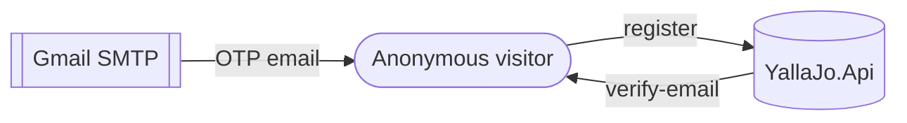
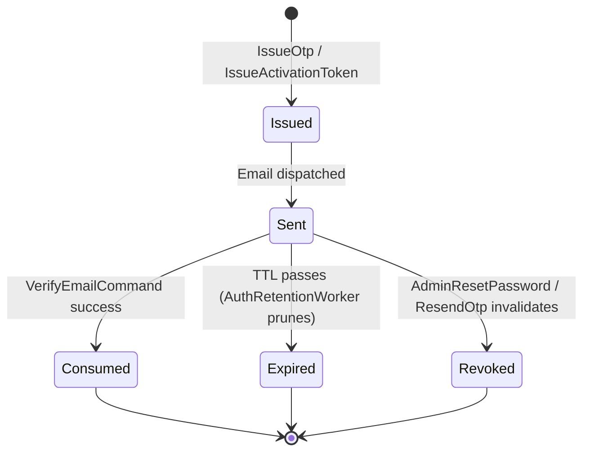

# Workflow 01 — User Onboarding

End-to-end self-service signup: **register → email OTP → verify → profile auto-created → ready to use**.

---

## At a glance

| | |
|---|---|
| **Trigger** | `POST /auth/register` (anonymous) |
| **Owner module** | Auth |
| **Cross-module reach** | Security (user record), Accounts (profile), Messaging (welcome email) |
| **Auth state at end** | Verified email; user can login and receive JWT + Refresh token |
| **Key entities** | `User` (Security), `Otp` (Auth), `ActivationToken` (Auth), `Profile` (Accounts) |

---

## Actors



---

## Sequence

> Reflects the actual code in `Auth.Application/Commands/Register/RegisterCommandHandler.cs` and `VerifyEmail/VerifyEmailCommandHandler.cs`. Profile creation happens **synchronously inline** during register; the `UserCreatedIntegrationEvent` consumer in Accounts is an **idempotent fallback** (creates a profile only if one does not already exist).

```mermaid
sequenceDiagram
    autonumber
    actor U as Visitor
    participant Auth as Auth.Presentation
    participant AuthApp as Auth.Application<br/>(RegisterCommandHandler)
    participant Sec as Security<br/>(IUserRegistrationService)
    participant Acc as Accounts<br/>(IProfileCreationService)
    participant OtpSvc as IOtpService
    participant Email as IEmailService (Gmail)
    participant OB as Auth.Outbox
    participant CO as CompositeOutboxProcessor
    participant IB_A as Accounts.Inbox
    participant AccH as Accounts handler<br/>(UserCreatedIntegrationEventHandler)
    participant IB_M as Messaging.Inbox
    participant Msg as Messaging handler<br/>(AuthUserRegisteredHandler)

    U->>Auth: POST /auth/register {email, password, recaptchaToken}
    Auth->>AuthApp: RegisterCommand (IRecaptchaProtectedCommand)
    Note over AuthApp: ValidationBehavior + RecaptchaValidationBehavior
    AuthApp->>Sec: IUserRegistrationService.RegisterAsync(...)
    Sec-->>AuthApp: Result<Guid> userId (unverified user)
    AuthApp->>Acc: IProfileCreationService.CreateForUserAsync(userId, ...)
    Note right of Acc: Conflict is tolerated (idempotent)
    Acc-->>AuthApp: Result
    AuthApp->>OtpSvc: Generate + Hash OTP
    AuthApp->>OB: outboxWriter.WriteAsync(UserRegisteredIntegrationEvent)
    Note over AuthApp,OB: SaveChangesAsync — OTP row + outbox row commit atomically
    AuthApp->>Email: SendAsync(email, "Verify Your Email", code)
    AuthApp-->>Auth: Result.Created(userId)
    Auth-->>U: 200 OK (check email)

    Note over CO: every ~10s
    CO->>OB: poll Auth outbox
    CO->>IB_M: dispatch UserRegisteredIntegrationEvent → AuthUserRegisteredHandler
    Msg->>Msg: create welcome Notification
    Note over CO,IB_A: Accounts subscribes to UserCreatedIntegrationEvent<br/>(produced by Security, not Auth) — see step below.

    Note over Sec: Separately, when Security creates the user it emits<br/>UserCreatedIntegrationEvent (Security.Contracts).
    CO->>IB_A: dispatch UserCreatedIntegrationEvent → UserCreatedIntegrationEventHandler
    AccH->>AccH: Inbox dedupe; if Profile already exists → skip;<br/>else create Profile (idempotent fallback)

    U->>Auth: POST /auth/verify-email {email, otpCode}
    Auth->>AuthApp: VerifyEmailCommand
    AuthApp->>OtpSvc: Verify(otpCode, otp.CodeHash)
    AuthApp->>AuthApp: Create Device + Session + RefreshToken (tx)
    AuthApp->>Sec: ISecurityService.MarkEmailVerifiedAsync(...)
    Note right of Sec: Security writes EmailVerifiedIntegrationEvent<br/>to its own outbox (Security.Contracts).
    AuthApp-->>U: 200 OK {accessToken, refreshToken, refreshTokenExpiresAt}

    Note over CO: next tick
    CO->>IB_A: dispatch EmailVerifiedIntegrationEvent → Accounts.EmailVerifiedIntegrationEventHandler
```

---

## State — `ActivationToken` / `Otp` lifecycle (verification path)



> Concrete state enums: `ActivationTokenState`, `ActivationTokenDeliveryStatus`, `ActivationTokenRevokedReason` (Auth.Domain).

---

## Side effects (events)

| Event | Producer | Consumer | Handler | Outcome |
|---|---|---|---|---|
| `UserRegisteredIntegrationEvent` | Auth (`Auth.Contracts`) | Messaging | `Messaging.Infrastructure/EventHandlers/AuthUserRegisteredHandler.cs` | Welcome notification |
| `UserCreatedIntegrationEvent` | Security (`Security.Contracts`) | Accounts | `Accounts.Application/EventHandlers/UserCreatedIntegrationEventHandler.cs` | Idempotent: creates `Profile` only if one does not already exist |
| `UserCreatedIntegrationEvent` | Security | Auth | `Auth.Application/EventHandlers/UserCreatedIntegrationEventHandler.cs` | Auth-side reconciliation |
| `ActivationTokenIssuedIntegrationEvent` | Auth | Auth (Infrastructure) | `Auth.Infrastructure/EventHandlers/ActivationEmailDispatchHandler.cs` | Sends/re-sends activation email |
| `EmailVerifiedIntegrationEvent` | Security (`Security.Contracts`) | Accounts | `Accounts.Application/EventHandlers/EmailVerifiedIntegrationEventHandler.cs` | Marks profile email-verified |
| `EmailVerifiedIntegrationEvent` | Security | Auth | `Auth.Application/EventHandlers/EmailVerifiedIntegrationEventHandler.cs` | Internal cleanup |

> The Auth `RegisterCommandHandler` does **not** write `EmailVerifiedIntegrationEvent`. `VerifyEmailCommandHandler` calls `ISecurityService.MarkEmailVerifiedAsync(...)`, and the Security module writes that event to its own outbox.

Delivery mechanism: see [`17-outbox-inbox-eventing.md`](./17-outbox-inbox-eventing.md).

---

## Failure / edge paths

| Scenario | Behavior |
|---|---|
| reCAPTCHA missing/invalid | `RecaptchaValidationBehavior` returns failure → 400 |
| Validation fails | `ValidationExceptionHandler` → 400 with `ProblemDetails` |
| Email already registered | `IUserRegistrationService.RegisterAsync` returns a failed `Result` (Security-side error); `RegisterCommandHandler` propagates it unchanged |
| OTP not found / expired / invalid | `VerifyEmailCommandHandler` returns `OtpErrors.NotFound`, or `Error.Validation("Otp.Expired", ...)` / `("Otp.Invalid", ...)` |
| OTP attempts exhausted | `VerifyEmailCommandHandler` returns `Outcome.TooManyRequests` |
| OTP rate limit | Per business rule (5 / email / hour) — enforced by `Auth.Presentation/RateLimiting/RateLimitPolicies.cs` |
| Email send fails after user is created | `RegisterCommandHandler` invalidates the OTP and returns `Error.Failure("Registration.EmailDeliveryFailed", ...)` (`Outcome.ServerError`). User can call `POST /auth/resend-otp`. |
| Outbox dispatch retry | Standard outbox retry policy + dead-letter (see eventing doc) |
| Profile auto-create fails | Event marked failed in Inbox; re-dispatched on next tick |

---

## Related commands & endpoints

| Endpoint | Command | File |
|---|---|---|
| `POST /auth/register` | `RegisterCommand` | `Auth.Application/Commands/Register/` |
| `POST /auth/verify-email` | `VerifyEmailCommand` | `Auth.Application/Commands/VerifyEmail/` |
| `POST /auth/resend-otp` | `ResendOtpCommand` | `Auth.Application/Commands/ResendOtp/` |
| `POST /auth/activate-account` | `ActivateAccountCommand` | `Auth.Application/Commands/ActivateAccount/` |
| `POST /auth/send-activation-email` | `SendActivationEmailCommand` | `Auth.Application/Commands/SendActivationEmail/` |

Endpoint mappings live in `Auth.Presentation/Endpoints/Registration/` and `Endpoints/Credential/`.

---

## Code references

- `Auth.Application/Commands/Register/RegisterCommandHandler.cs`
- `Auth.Application/Commands/VerifyEmail/VerifyEmailCommandHandler.cs`
- `Auth.Application/Recaptcha/RecaptchaValidationBehavior.cs`
- `Auth.Infrastructure/Services/OtpService.cs`
- `Auth.Infrastructure/Services/GmailEmailService.cs`
- `Auth.Infrastructure/EventHandlers/ActivationEmailDispatchHandler.cs`
- `Security.Application/Services/UserRegistrationService.cs`
- `Accounts.Application/EventHandlers/UserCreatedIntegrationEventHandler.cs`
- `Accounts.Application/Services/ProfileCreationService.cs`
- `Messaging.Infrastructure/EventHandlers/AuthUserRegisteredHandler.cs`

---

## Related risks

- [`RISK-001`](../risks/risk-register.md) — JWT uses symmetric key.
- [`RISK-007`](../risks/risk-register.md) — Outbox dispatch is `PeriodicTimer`-based (no distributed lock).
- See [`../Agents/decisions/ADR-008-integration-event-registry-parity.md`](../../Agents/decisions/ADR-008-integration-event-registry-parity.md) for event registry parity rules.
