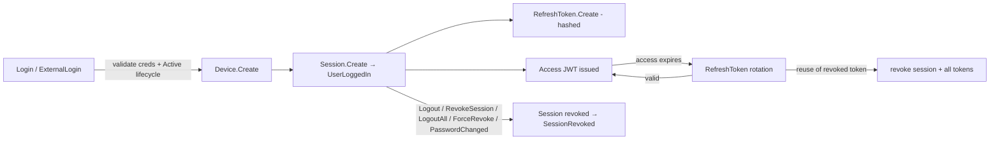
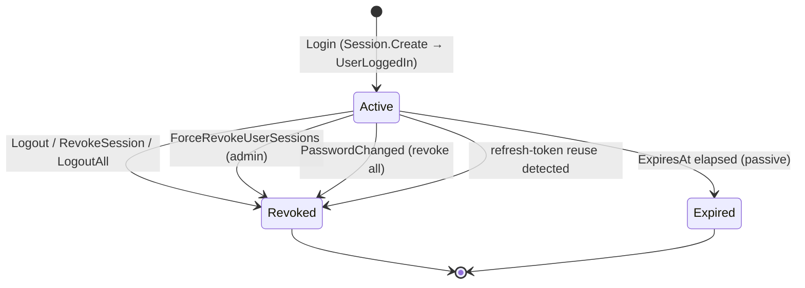
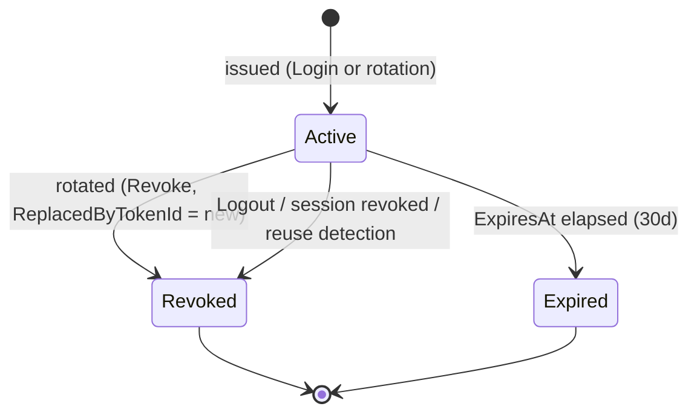
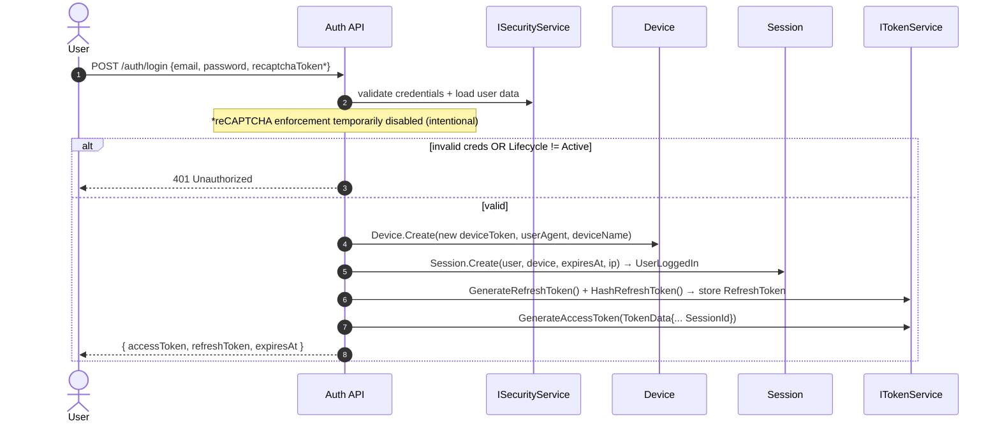

# Workflow 02 — Authentication & Session Lifecycle

The **Auth-owned authentication & session lifecycle**: login, access/refresh token issuance,
refresh-token rotation with reuse detection, device tracking, session revocation, and
logout / logout-all.

> **Scope.** Authentication and sessions, starting at **login** (post-verification). This document
> **references, not duplicates**: registration / OTP / activation ([`01`](./01-user-onboarding.md)),
> password reset ([`03`](./03-password-reset.md), planned), notification delivery
> ([`10`](./10-notifications-fanout.md)), the eventing mechanism
> ([`17`](./17-outbox-inbox-eventing.md)), and the authorization model
> ([`../02-actors-and-roles.md`](../02-actors-and-roles.md)).

---

## At a glance

| | |
|---|---|
| **Trigger** | `Login` (credentials) or `ExternalLogin` (Google/Facebook) |
| **Owner module** | Auth |
| **Cross-module reach** | Security (consumes `UserLoggedIn` / `SessionRevoked`; supplies user data via `ISecurityService`); Auth consumes Security's `PasswordChanged` |
| **Key entities** | `Session`, `RefreshToken`, `Device` |
| **Tokens** | Access JWT (symmetric, `AccessTokenMinutes`); Refresh token (hashed at rest, 30-day TTL, rotating) |
| **Background jobs** | `AuthCleanupService`, `AuthRetentionWorker` |

---

## Actors

| Actor | Role |
|---|---|
| **End User** | Logs in, refreshes, logs out, revokes own sessions, trusts devices |
| **Admin** | Force-revokes another user's sessions (`ForceRevokeUserSessions`) |
| **System / Background** | `AuthCleanupService`, `AuthRetentionWorker` |
| **External OAuth provider** | Google / Facebook (ticketed BFF) — referenced, not detailed here |
| **Security module** | Consumes `UserLoggedIn` / `SessionRevoked`; produces `PasswordChanged` (consumed by Auth) |

---

## Authentication overview



> **reCAPTCHA note.** `LoginCommand` carries a `RecaptchaToken`, but reCAPTCHA enforcement is
> **currently disabled during documentation stabilization and is planned to be re-enabled later**.
> This is an **intentional temporary state**, not a defect.

---

## Token model

| Token | Lifetime | Storage | Notes |
|---|---|---|---|
| **Access (JWT)** | `AccessTokenMinutes` (configurable) | not stored (stateless) | symmetric HS256 (`Jwt:Key`); carries `sub`, roles, permission claims, `SessionId` |
| **Refresh** | **30 days** | **hashed** (`TokenHash`) in `refresh_tokens` | single-use, **rotating**; `ReplacedByTokenId` forms the rotation chain |

> Access-token signing uses a symmetric secret — see [`RISK-001`](../risks/risk-register.md).

---

## `Session` state machine



> Source: `Auth.Domain/Entities/Session.cs` — `UserId`, `DeviceId`, `ExpiresAt`, `IsRevoked`,
> `RevokedAt`, `IpAddress`. `Revoke()` raises `SessionRevokedEvent`. Expiry is passive (checked at
> refresh; expired rows are pruned by `AuthCleanupService`).

---

## `RefreshToken` state machine (rotation)



> Source: `Auth.Domain/Entities/RefreshToken.cs` — `TokenHash`, `SessionId`, `ExpiresAt`,
> `IsRevoked`, `RevokedAt`, `ReplacedByTokenId`. Tokens are single-use; each refresh rotates to a
> new token and revokes the old one.

---

## Login flow



- Login validates credentials and requires `Lifecycle == Active` (via `ISecurityService`), then
  creates a **new `Device` per login**, a `Session` (raising `UserLoggedIn`), a hashed
  `RefreshToken`, and a signed access JWT.
- There is **no concurrent-session limit and no remember-me** option today.

---

## Access-token usage & expiry

The access JWT is stateless and short-lived (`AccessTokenMinutes`); it carries the `SessionId` and
the user's roles + permission claims (the permission-claim model is owned by
[`../02-actors-and-roles.md`](../02-actors-and-roles.md)). When it expires, the client exchanges the
refresh token (below) for a new access token.

---

## Refresh & rotation (with reuse detection)

```mermaid
sequenceDiagram
    autonumber
    actor C as Client
    participant API as RefreshTokenCommandHandler
    participant RT as RefreshToken repo
    participant Sess as Session repo
    participant Sec as ISecurityService
    participant TS as ITokenService

    C->>API: POST /auth/refresh {refreshToken}
    API->>RT: lookup by HashRefreshToken(token)
    alt not found
        API-->>C: 401 invalid/expired
    else found but IsRevoked
        API->>RT: revoke ALL non-revoked tokens for session
        API->>Sess: revoke session
        API-->>C: 401 "Token reuse detected — session terminated"
    else found, valid
        alt expired / session revoked / user not Active / email unverified
            API-->>C: 401
        else ok
            API->>RT: create new RefreshToken (rotate); old.Revoke(replacedBy = new)
            API->>Sess: device.RecordSeen(); session.MarkUpdated()
            API->>TS: GenerateAccessToken(...)
            API-->>C: { newAccessToken, newRefreshToken (30d) }
        end
    end
```

- **Rotation:** each successful refresh issues a new refresh token and revokes the old one
  (`ReplacedByTokenId`).
- **Reuse detection:** presenting an already-revoked refresh token triggers **session-wide
  revocation** (all that session's tokens + the session) and a 401 — a token-theft safeguard.
- Refresh also re-validates account state (email verified, `Lifecycle == Active`).

---

## Logout, revocation & force-revoke

| Command | Sessions revoked | Refresh tokens revoked | Scope |
|---|---|---|---|
| **`Logout`** | the one session owning the presented refresh token | that refresh token | single session (identified by the refresh token) |
| **`RevokeSession(sessionId)`** | the specified session (must be caller's own, else `Forbidden`) | that session's refresh token(s) | single session, self-owned |
| **`LogoutAll`** | all the caller's non-revoked sessions | all the caller's non-revoked refresh tokens | all own sessions |
| **`ForceRevokeUserSessions(userId)`** | all the target user's non-revoked sessions | all target's non-revoked refresh tokens | admin override |

Each revocation raises `SessionRevokedEvent` and invalidates the user's session cache tag.

---

## Device tracking & trusted devices

- A `Device` row is created **per login** (`DeviceToken = new Guid`); it stores `UserAgent`,
  `DeviceName`, `LastSeenAt` (advanced via `RecordSeen()` on refresh).
- `TrustDevice` sets `IsTrusted` / `TrustedAt` (via `Device.Trust()`).
- **Trusted state is recorded only — it has no authentication behavior.** `IsTrusted` is never read
  to skip OTP/2FA or to gate login; trusting a device currently has **no functional effect**.
- Because a new `Device` is created on each login, devices are **not deduplicated** by a stable
  fingerprint, and there is no new-device login detection/notification.

---

## External login

`ExternalLogin` (Google / Facebook, via a signed BFF ticket) authenticates the user and then
creates the same `Device` / `Session` / token set as credential login. The external-provider
ticket/linking detail is out of scope here; this workflow covers only the resulting **session**.

---

## Session security controls

- **Refresh-token rotation + reuse detection** (session-wide revocation on replayed token).
- **Account-state re-check on refresh** (email verified, `Lifecycle == Active`).
- **Password change revokes all sessions** — a password change/reset terminates every active
  session and refresh token for the user, via two paths:
  - `ISessionRevocationService.RevokeAllForUserAsync(reason)` (e.g. `PasswordResetByAdmin`), used by
    reset / admin-reset handlers; and
  - `PasswordChangedIntegrationEventHandler` — Auth consumes Security's `PasswordChanged`
    integration event and revokes all active sessions + refresh tokens.
  (The password-reset *flow* itself is owned by [`03-password-reset.md`](./03-password-reset.md).)
- **Admin force-revoke** of a user's sessions (`ForceRevokeUserSessions`).

---

## Side effects (integration events)

| Event | Direction | Notes |
|---|---|---|
| `UserLoggedInIntegrationEvent` | **emitted** | consumed by **Security** |
| `SessionRevokedIntegrationEvent` | **emitted** | consumed by **Security** |
| `PasswordChangedIntegrationEvent` | **consumed** (from Security) | → revoke all sessions + refresh tokens |

> `UserRegistered`, `ActivationTokenIssued`, `PasswordResetTokenIssued` are emitted by Auth but
> belong to the onboarding / reset flows ([`01`](./01-user-onboarding.md) / `03`).

---

## Background jobs

| Service | Schedule | Effect |
|---|---|---|
| `AuthCleanupService` | `PeriodicTimer`, config-gated | Generic cleanup of expired/used `Otp`s and expired sessions / refresh tokens |
| `AuthRetentionWorker` | periodic | Deletes processed `OutboxMessage` rows older than `ProcessedOutboxRetentionHours` (mitigates plaintext tokens-in-outbox); **dead-lettered rows are preserved** |

`Auth.Infrastructure/BackgroundJobs/`. Single-instance assumption — no distributed lock
([`RISK-007`](../risks/risk-register.md)). Deletion uses `IRetentionDeleteAdapter`
(`EfExecuteDeleteAdapter`).

---

## Authorization, ownership & admin override

| Action | Required |
|---|---|
| Login / refresh / logout | Public/authenticated as applicable (self) |
| List own sessions / revoke own session / logout-all / trust device | Self-scoped (`UserId`) |
| Force-revoke a user's sessions | **Admin+** (`User.UpdateAny` / admin permission) |

Session/device ownership is by `UserId`; `RevokeSession` enforces self-ownership
(`session.UserId != caller → Forbidden`). Authoritative model:
[`../02-actors-and-roles.md`](../02-actors-and-roles.md).

---

## reCAPTCHA (current temporary state)

`LoginCommand` includes a `RecaptchaToken` and a (commented-out) `IRecaptchaProtectedCommand`
marker. **reCAPTCHA enforcement is currently disabled during documentation stabilization and is
planned to be re-enabled later.** This is an **intentional temporary state** — not a risk, bug, or
known gap. The verifier (`GoogleRecaptchaVerifier`) remains wired for re-enablement.

---

## Failure / edge paths

| Path | Behavior |
|---|---|
| Invalid credentials | 401 Unauthorized |
| Account not `Active` | 401 ("account is not currently active") |
| Refresh token not found / expired | 401 invalid/expired |
| Refresh token reuse (revoked token replayed) | Session + all its tokens revoked; 401 "token reuse detected" |
| Session revoked / user inactive at refresh | 401 |
| Revoke another user's session | `Forbidden` (self-ownership enforced) |
| Password change | All sessions + refresh tokens revoked |

---

## Known gaps

- **Trusted devices are recorded but not enforced** — `IsTrusted` has no authentication effect (no
  OTP/2FA bypass, no login gating).
- **No concurrent-session limit and no remember-me** option.
- **No new-device login detection/notification** — a new `Device` row is created per login (devices
  are not deduplicated), and `UserLoggedIn` is consumed only by Security (no security-alert
  notification fan-out).

*(reCAPTCHA is intentionally disabled temporarily and is **not** listed as a gap — see above.)*

---

## Code references

- `Auth.Domain/Entities/{Session,RefreshToken,Device}.cs`
- `Auth.Application/Commands/{Login,ExternalLogin,RefreshToken,Logout,LogoutAll,RevokeSession,ForceRevokeUserSessions,TrustDevice}/`
- `Auth.Application/Interfaces/SessionRevocation/` (`ISessionRevocationService`, `SessionRevocationReason`)
- `Auth.Infrastructure/EventHandlers/PasswordChangedIntegrationEventHandler.cs`
- `Auth.Infrastructure/Services/JwtTokenService.cs` (access JWT; `AccessTokenMinutes`)
- `Auth.Infrastructure/Recaptcha/GoogleRecaptchaVerifier.cs` (wired; enforcement temporarily disabled)
- `Auth.Infrastructure/BackgroundJobs/{AuthCleanupService,AuthRetentionWorker}.cs`
- `Auth.Contracts/IntegrationEvents/{UserLoggedIn,SessionRevoked}IntegrationEvent.cs`

---

## Related risks

- [`RISK-001`](../risks/risk-register.md) — symmetric JWT signing (shared secret; no asymmetric keys / rotation).
- [`RISK-007`](../risks/risk-register.md) — Auth background jobs single-instance (no distributed lock).

---

## Cross-references

- Registration / OTP / activation: [`01-user-onboarding.md`](./01-user-onboarding.md)
- Password reset: [`03-password-reset.md`](./03-password-reset.md) (planned)
- Security notifications: [`10-notifications-fanout.md`](./10-notifications-fanout.md)
- Eventing mechanism: [`17-outbox-inbox-eventing.md`](./17-outbox-inbox-eventing.md)
- Actors & authorization: [`../02-actors-and-roles.md`](../02-actors-and-roles.md)
- Risk register: [`../risks/risk-register.md`](../risks/risk-register.md)
