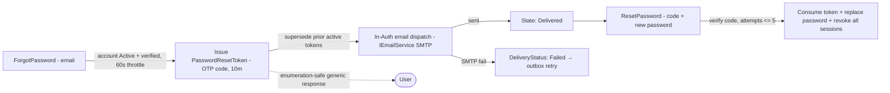
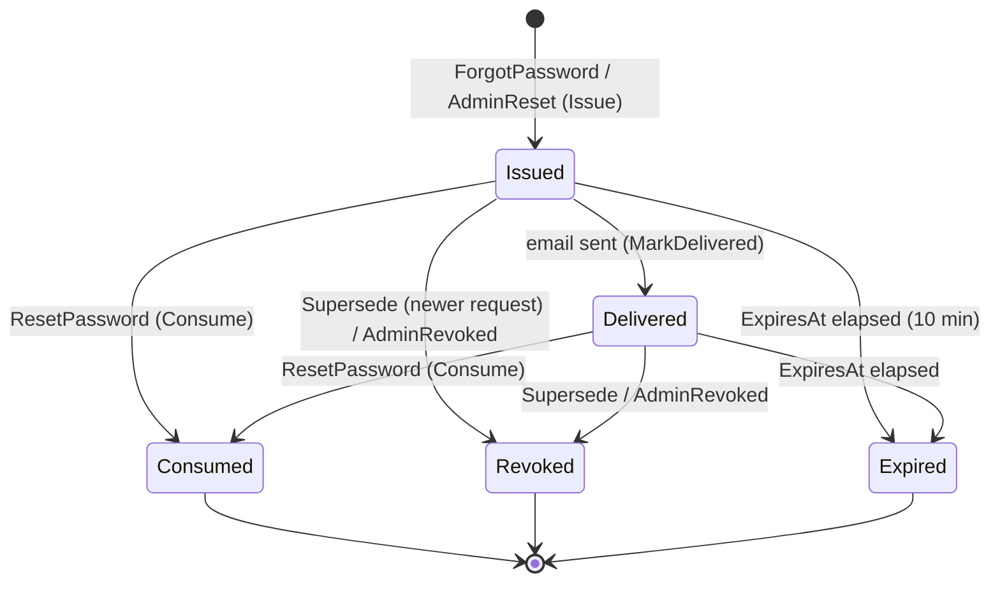
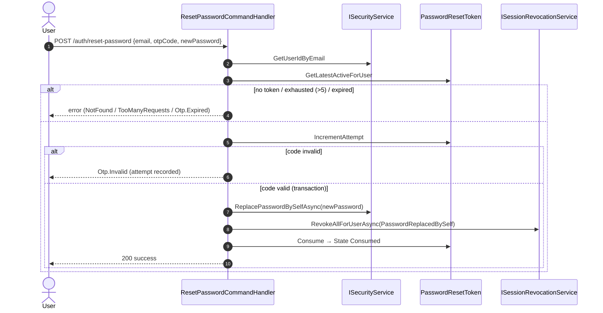

# Workflow 03 — Password Reset

The **Auth-owned password-reset lifecycle**: forgot-password (OTP-code issuance), reset-password
(code verification → password replacement → session revocation), the reset-token state machine, and
the in-Auth email dispatch.

> **Scope.** Password reset only. This document **references, not duplicates**: registration /
> activation OTP ([`01`](./01-user-onboarding.md)), session lifecycle
> ([`02`](./02-authentication-session.md)), notification delivery
> ([`10`](./10-notifications-fanout.md)), the eventing mechanism
> ([`17`](./17-outbox-inbox-eventing.md)), and the authorization model
> ([`../02-actors-and-roles.md`](../02-actors-and-roles.md)).
>
> **Delivery note:** unlike most user-facing emails, the reset-code email is dispatched **inside
> the Auth module** (not through the Messaging fan-out) — see *Integration-event flow*.

---

## At a glance

| | |
|---|---|
| **Trigger** | `ForgotPassword` (request a code) → `ResetPassword` (submit code + new password) |
| **Owner module** | Auth |
| **Cross-module reach** | Security (`ISecurityService` — password replacement, account status) |
| **Key entity** | `PasswordResetToken` (OTP-code based) |
| **Key enums** | `PasswordResetTokenState`, `PasswordResetTokenRevokedReason`, `PasswordResetOrigin`, `PasswordResetTokenDeliveryStatus` |
| **Email delivery** | In-Auth `PasswordResetEmailDispatchHandler` → `IEmailService` (SMTP) |
| **Background jobs** | `AuthCleanupService` (expiry pruning), `AuthRetentionWorker` (outbox purge) |

---

## Actors

| Actor | Role |
|---|---|
| **End User** | Requests a reset code, submits the code + a new password |
| **Admin** | Admin-initiated reset (`AdminResetPassword`, origin `AdminInitiated`); reassignment (origin `Reassignment`) |
| **System / Background** | In-Auth email dispatch; `AuthCleanupService` token expiry pruning |
| **Security module** | Stores the new password; supplies account status / user id |

---

## Reset overview



---

## `PasswordResetTokenState` state machine



> Source: `Auth.Domain/Entities/PasswordResetToken.cs` + enums. `IsTerminal` = Consumed / Revoked /
> Expired. Attempts are capped at `MaxAttempts = 5` (`IsExhausted`).
>
> **`DeliveryStatus` is separate from `State`.** On SMTP failure, `MarkDeliveryFailed()` sets
> `DeliveryStatus = Failed` and `LastSentAt`, but leaves `State = Issued` (non-terminal) so the
> outbox retries delivery. A delivery failure does **NOT** revoke the token.
> `RevokedReason.EmailFailed` is **defined but currently unused** (see *Known gaps*).

---

## Forgot-password flow

```mermaid
sequenceDiagram
    autonumber
    actor U as User
    participant API as ForgotPasswordCommandHandler
    participant Sec as ISecurityService
    participant T as PasswordResetToken
    participant OB as Outbox
    participant DH as PasswordResetTokenIssuedDomainEventHandler
    participant ED as PasswordResetEmailDispatchHandler
    participant SMTP as IEmailService

    U->>API: POST /auth/forgot-password {email}
    API->>Sec: GetAccountStatusByEmail
    alt not found / not Active / not email-verified / within 60s throttle
        API-->>U: 200 generic "If this email exists, a reset code was sent."
    else eligible
        API->>T: supersede prior active tokens; Issue (OTP hash, 10m, origin)
        T->>OB: PasswordResetTokenIssuedEvent (domain)
        OB->>DH: convert → PasswordResetTokenIssuedIntegrationEvent (outbox)
        OB->>ED: deliver integration event (in-Auth, inbox-idempotent)
        ED->>SMTP: SendAsync(code email, copy by Origin)
        alt sent
            ED->>T: MarkDelivered → State Delivered
        else SMTP failure
            ED->>T: MarkDeliveryFailed (DeliveryStatus=Failed); rethrow → outbox retry
        end
        API-->>U: 200 generic message (same as above)
    end
```

- **Enumeration-safe:** the response is always the same generic message, regardless of account
  existence / state.
- **Throttle:** 60 seconds between requests. **Expiry:** 10 minutes. **Supersede:** prior active
  tokens are revoked (`RevokedReason.Superseded`) before a new one is issued.

---

## Reset-password flow



- Code verification uses the OTP primitive (`otpService.Verify(code, TokenHash)`); the reset is
  **OTP-code based**, not a click-link token.
- On success (in one transaction): password replaced via `ISecurityService`, **all sessions +
  refresh tokens revoked** (`SessionRevocationReason.PasswordReplacedBySelf`), token `Consume`d,
  session cache invalidated.

---

## Token model

`PasswordResetToken` is a hashed OTP-code record with an explicit state machine:

| Field | Meaning |
|---|---|
| `TokenHash` | hash of the OTP code (code never stored in plaintext at rest) |
| `DeliveryAddress` | target email |
| `IssuedAt` / `ExpiresAt` | issuance + 10-minute expiry |
| `State` | `Issued / Delivered / Consumed / Revoked / Expired` |
| `DeliveryStatus` | `Pending / Failed` (separate from `State`) |
| `RevokedReason` | `None / Superseded / AdminRevoked / EmailFailed` (EmailFailed unused) |
| `ResetOrigin` | `SelfService / AdminInitiated / Reassignment` |
| `AttemptCount` | verification attempts (cap `MaxAttempts = 5`) |
| `ConsumedAt` / `RevokedAt` / `LastSentAt` | lifecycle timestamps |

---

## Session revocation after reset

A successful reset **revokes all of the user's active sessions and refresh tokens**:
- self-service reset calls `ISessionRevocationService.RevokeAllForUserAsync(PasswordReplacedBySelf)`
  directly in the handler;
- admin-initiated reset also revokes sessions at issue time.

The session mechanics themselves are owned by [`02-authentication-session.md`](./02-authentication-session.md).
(Note: `02` also documents a `PasswordChanged`-integration-event path that revokes sessions; the
**self-service reset uses the direct revocation call**, not that event.)

---

## Integration-event flow (in-Auth delivery)

Unlike the Messaging notification fan-out, the reset-code email is dispatched **within Auth**:

1. `PasswordResetToken.Issue(...)` raises **`PasswordResetTokenIssuedEvent`** (domain event,
   carrying the plain code + delivery address + origin).
2. **`PasswordResetTokenIssuedDomainEventHandler`** converts it to
   **`PasswordResetTokenIssuedIntegrationEvent`** in the Auth outbox.
3. **`PasswordResetEmailDispatchHandler`** (Auth, inbox-idempotent) consumes that integration event
   and sends the email via **`IEmailService` (SMTP)** — copy varies by `Origin`
   (SelfService / AdminInitiated / Reassignment). On success → `MarkDelivered`; on failure →
   `MarkDeliveryFailed` + rethrow for outbox retry.

> This flow does **not** go through [`10-notifications-fanout.md`](./10-notifications-fanout.md);
> there is **no Messaging consumer** for `PasswordResetTokenIssuedIntegrationEvent`.

---

## Admin-initiated & reassignment reset

- **`AdminResetPassword`** (origin `AdminInitiated`): checks eligibility, supersedes prior tokens,
  **issues a `PasswordResetToken`** (so the **user still sets their own new password** via the
  emailed code — it is **not** a direct password replacement), raises the issued event (admin-worded
  email), and **revokes the user's active sessions** immediately.
- **Reassignment** (origin `Reassignment`): runs through the profile-reassignment flow
  (`IProfileReassignmentService`) which issues a reset token tagged with the `Reassignment` origin.
  The reassignment flow itself is an admin/account concern — this document covers only the reset
  token mechanics.

Both admin paths reuse the same in-Auth email dispatch and the same token state machine; only the
email copy and `ResetOrigin` differ.

---

## Side effects (integration events)

| Event | Direction | Notes |
|---|---|---|
| `PasswordResetTokenIssuedEvent` | domain (Auth) | converted by `PasswordResetTokenIssuedDomainEventHandler` |
| `PasswordResetTokenIssuedIntegrationEvent` | integration (Auth) | consumed by **Auth** `PasswordResetEmailDispatchHandler` (no Messaging consumer) |

> Session revocation on reset is performed via `ISessionRevocationService` (direct), not via an
> integration event. The separate `PasswordChanged` event path is documented in `02`.

---

## Background jobs

| Service | Schedule | Effect |
|---|---|---|
| `AuthCleanupService` | `PeriodicTimer`, config-gated | Generic cleanup of expired/terminal reset tokens (codes expire after 10 min) |
| `AuthRetentionWorker` | periodic | Purges processed outbox rows (the plain code travels in the outbox message — security tradeoff; dead-letters preserved) |

`Auth.Infrastructure/BackgroundJobs/`. Single-instance assumption — no distributed lock
([`RISK-007`](../risks/risk-register.md)).

---

## Authorization, ownership & admin override

| Action | Required |
|---|---|
| Forgot password / reset password | Public / self-service (proof = the emailed code; enumeration-safe) |
| Admin-initiated reset | **Admin+** (`User.UpdateAny` / admin permission) |

Reset is self-service and unauthenticated (the OTP code is the proof of control). Admin reset is
gated by admin permission. Authoritative model:
[`../02-actors-and-roles.md`](../02-actors-and-roles.md).

---

## Failure / edge paths

| Path | Behavior |
|---|---|
| Email not found / not active / not verified | Generic success response (enumeration-safe) |
| Request within 60s of a recent one | Generic response; no new token |
| Reset with no active token | NotFound ("request a new code") |
| Attempts exceeded (>5) | TooManyRequests |
| Token expired (>10 min) | `Otp.Expired` |
| Invalid code | `Otp.Invalid` (attempt recorded) |
| SMTP delivery failure | `DeliveryStatus = Failed`; token stays `Issued`; outbox retries (no revoke) |
| Successful reset | Password replaced + all sessions/refresh tokens revoked + token consumed |

---

## Known gaps

- **`RevokedReason.EmailFailed` is defined but unused** — an SMTP delivery failure sets
  `DeliveryStatus = Failed` and **retries via the outbox**; it does **not** revoke the token (the
  token remains `Issued`). No code path sets `State = Revoked` with reason `EmailFailed`.
- The **plain reset code is carried in the outbox message content** (`PasswordResetTokenIssuedIntegrationEvent`),
  mitigated by `AuthRetentionWorker` purge (cross-ref [`02`](./02-authentication-session.md)).

*(These are documented behaviors, not new risks. The single related risk is RISK-007 below.)*

---

## Code references

- `Auth.Domain/Entities/PasswordResetToken.cs`
- `Auth.Domain/Entities/{PasswordResetTokenState,PasswordResetTokenRevokedReason,PasswordResetOrigin,PasswordResetTokenDeliveryStatus}.cs`
- `Auth.Application/Commands/{ForgotPassword,ResetPassword,AdminResetPassword,AdminReassignAccount}/`
- `Auth.Application/Interfaces/SessionRevocation/` (`ISessionRevocationService`, `SessionRevocationReason`)
- `Auth.Infrastructure/EventHandlers/PasswordResetTokenIssuedDomainEventHandler.cs` (domain → integration)
- `Auth.Infrastructure/EventHandlers/PasswordResetEmailDispatchHandler.cs` (in-Auth SMTP dispatch)
- `Auth.Contracts/IntegrationEvents/PasswordResetTokenIssuedIntegrationEvent.cs`
- `Auth.Infrastructure/BackgroundJobs/{AuthCleanupService,AuthRetentionWorker}.cs`

---

## Related risks

- [`RISK-007`](../risks/risk-register.md) — Auth background jobs single-instance (no distributed lock).

---

## Cross-references

- Registration / activation OTP: [`01-user-onboarding.md`](./01-user-onboarding.md)
- Session lifecycle (session revocation mechanics): [`02-authentication-session.md`](./02-authentication-session.md)
- Notification delivery (general): [`10-notifications-fanout.md`](./10-notifications-fanout.md)
- Eventing mechanism: [`17-outbox-inbox-eventing.md`](./17-outbox-inbox-eventing.md)
- Actors & authorization: [`../02-actors-and-roles.md`](../02-actors-and-roles.md)
- Risk register: [`../risks/risk-register.md`](../risks/risk-register.md)
