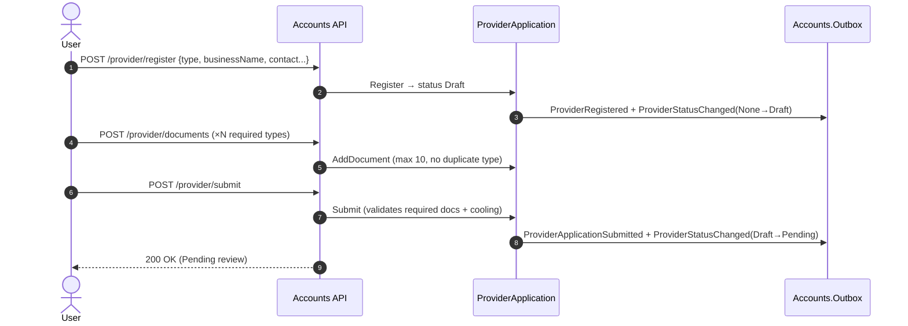
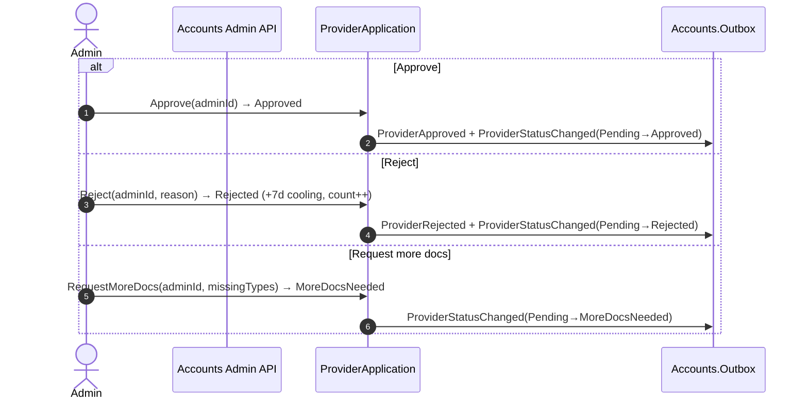
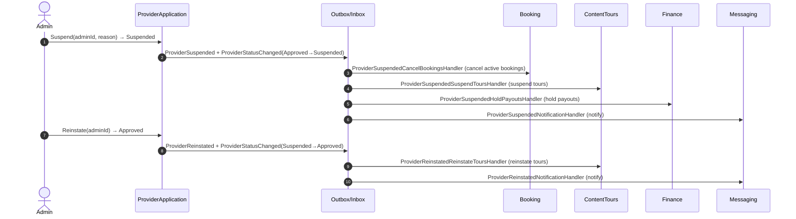

# Workflow 04 — Provider Onboarding & Lifecycle

The **Accounts-side provider lifecycle**: application → documents → admin review → approval /
rejection / more-docs → suspension / reinstatement, plus document expiry and the cross-module
fan-out that enforces these transitions.

> **Scope.** Accounts-owned provider lifecycle. This document **references, not duplicates**:
> booking cancellation detail in [`06-booking-lifecycle.md`](./06-booking-lifecycle.md), payout
> hold detail in [`08-payout-commission.md`](./08-payout-commission.md), agency roster /
> affiliation management in `18-agency-roster.md` (planned), and the authorization model in
> [`../02-actors-and-roles.md`](../02-actors-and-roles.md).

---

## At a glance

| | |
|---|---|
| **Trigger** | `POST /provider/register` (authenticated user) → submit → admin review |
| **Owner module** | Accounts |
| **Cross-module reach** | Security (role on approve), ContentTours (guide profile / tour suspend-reinstate), Booking (cancel on suspend), Finance (hold payouts on suspend), Messaging (notifications) |
| **Key entities** | `ProviderApplication`, `ProviderDocument` |
| **Key enums** | `ProviderApplicationStatus`, `ProviderType`, `DocumentType` |
| **Config** | Document-expiry `PollInterval`, `NotifyDaysBeforeExpiry` |

---

## Actors

| Actor | Role |
|---|---|
| **User → Provider** | Applies, uploads documents, submits, reapplies |
| **Agency** | Same lifecycle via `ProviderType.Agency` (roster mgmt → `18`) |
| **Admin** | Approve / reject / request-more-docs / suspend / reinstate |
| **System / Background** | `ProviderDocumentExpiryService` |
| **Consuming modules** | Security, ContentTours, Booking, Finance, Messaging |

---

## Lifecycle overview

```mermaid
flowchart LR
    Reg[Register: Draft] --> Docs[Add required documents]
    Docs --> Sub[Submit: Pending]
    Sub --> Rev{Admin review}
    Rev -->|Approve| Appr[Approved]
    Rev -->|Reject| Rej[Rejected + 7d cooling]
    Rev -->|Request more docs| More[MoreDocsNeeded]
    More --> Sub
    Rej -->|Reapply (<= 3, after cooling)| Reg
    Appr -->|Suspend| Susp[Suspended]
    Susp -->|Reinstate (admin only)| Appr
    Appr -.->|fan-out| RoleGuideNotify[Security role · ContentTours guide · Messaging]
    Susp -.->|fan-out| CancelHoldNotify[Booking cancel · ContentTours suspend · Finance hold · Messaging]
```

---

## `ProviderApplicationStatus` state machine

```mermaid
stateDiagram-v2
    [*] --> Draft: Register
    Draft --> Pending: Submit (all required docs + no active cooling)
    MoreDocsNeeded --> Pending: Submit (re-submit)
    Pending --> Approved: Approve (admin)
    Pending --> Rejected: Reject (admin; +7d cooling, ReapplicationCount++)
    Pending --> MoreDocsNeeded: RequestMoreDocs (admin)
    Rejected --> Draft: Reapply (<= 3 attempts, after cooling)
    Approved --> Suspended: Suspend (admin)
    Suspended --> Approved: Reinstate (admin only)
    Approved --> [*]
    Rejected --> [*]
```



> Source: `Accounts.Domain/Enums/ProviderApplicationStatus.cs`
> (`Draft, Pending, MoreDocsNeeded, Approved, Rejected, Suspended`).
> Guards (in `ProviderApplication`): `MaxReapplications = 3`, `CoolingPeriodDays = 7`,
> `MaxDocuments = 10`, and per-`ProviderType` required-document sets.
> **Suspended providers are reinstated by Admin only — there is no self-reapply path from
> `Suspended`.**

---

## Application & document submission



Required documents vary by `ProviderType` (e.g. `TourOperator` needs BusinessLicense +
TaxRegistration + TourismAuthorityLicense + InsuranceCertificate; `IndependentGuide` needs
GovernmentId + MotaLicense + TaxIdentificationNumber + InsuranceCertificate). `Submit` fails with
`MissingRequiredDocuments` until the set is complete, and with `CoolingPeriodActive` during a
post-rejection cooling window.

---

## Admin review: approve / reject / request-more-docs



> All three transitions require status `Pending`. `Reject` is blocked once
> `ReapplicationCount >= 3` (`MaxReapplicationsReached`).

---

## Reapplication

A `Rejected` application may `Reapply` → returns to `Draft` (clears rejection reason), subject to
`ReapplicationCount < 3` and the 7-day cooling window. After reaching `Draft`, the normal
submit path applies. There is **no reapply path from `Suspended`** (admin reinstate only).

---

## Approval fan-out

On `ProviderApprovedIntegrationEvent`, three modules react:

```mermaid
sequenceDiagram
    autonumber
    participant OB as Outbox/Inbox
    participant Sec as Security
    participant CT as ContentTours
    participant Msg as Messaging

    OB->>Sec: ProviderApproved → ProviderApprovedAssignRoleHandler
    Note over Sec: IndependentGuide → TourGuide role; else → Provider role (idempotent)
    OB->>CT: ProviderApproved → ProviderApprovedCreateTourGuideHandler (guide profile)
    OB->>Msg: ProviderApproved → ProviderApprovedNotificationHandler (notify applicant)
```

- **Security** assigns the platform role: `ProviderType.IndependentGuide → AppRoles.TourGuide`;
  all other types → `AppRoles.Provider`. Inbox-guarded + idempotent (skips if already held).
- **ContentTours** creates the tour-guide profile.
- **Messaging** notifies the applicant of approval.

---

## Suspension & reinstatement (cross-module fan-out)



- **Suspension is enforced by cross-module fan-out, not by role removal** (see *Provider Status vs
  Provider Role* below). Booking-cancellation detail → [`06-booking-lifecycle.md`](./06-booking-lifecycle.md);
  payout-hold detail → [`08-payout-commission.md`](./08-payout-commission.md).
- **Reinstatement** restores tours (ContentTours) and notifies; **Finance payout-hold release** and
  any booking restoration are governed by those modules (no Accounts-side action beyond the event).

---

## Provider Status vs Provider Role

Provider onboarding involves **two distinct lifecycles owned by different modules**:

- **Provider Status** (Accounts) — the `ProviderApplicationStatus` of the application:
  `Draft → Pending → MoreDocsNeeded → Approved → Rejected → Suspended`. Accounts is the source of
  truth for *where the application stands*.
- **Provider Role** (Security) — the platform role (`Provider`, or `TourGuide` for
  `IndependentGuide`) that grants provider permissions.

**The two synchronize in one direction, at one point only.** On **approval**, Accounts emits
`ProviderApprovedIntegrationEvent`; Security's `ProviderApprovedAssignRoleHandler` assigns the role
(idempotent).

**Verified behavior:**
- `ProviderApproved` → Security **assigns** Provider/TourGuide role.
- `ProviderSuspended` → Security has **no consumer**; the role is **not revoked**.
- `ProviderReinstated` → Security has **no consumer**; nothing to restore (the role was never removed).
- Suspension is enforced through **cross-module fan-out** (Booking cancel, ContentTours suspend,
  Finance hold), not through role/permission changes.

> ### ⚠️ Known Limitation — "Provider Approved ≠ Provider Active"
> Role assignment and the status lifecycle are **separate**. Being **Approved** grants the role;
> being **Suspended** does **not** remove it. A suspended provider therefore **retains their
> Provider/TourGuide role and permissions** and could still reach provider self-service endpoints
> that are not gated by tour/booking/payout state. Authorization-level enforcement of suspension is
> **not implemented**; suspension relies on downstream resource disabling (tours suspended,
> bookings cancelled, payouts held). Treat *Approved* as "role granted", not as "currently active
> and unrestricted". The authoritative role/permission model is in
> [`../02-actors-and-roles.md`](../02-actors-and-roles.md).

---

## Provider document expiry

`ProviderDocumentExpiryService` (Accounts background service, config-gated, `PeriodicTimer`) scans
**Approved** applications for documents whose `ExpiresAt` falls within `NotifyDaysBeforeExpiry`:
- already-expired documents are logged;
- expiring-soon documents emit `ProviderDocumentExpiringIntegrationEvent`.

> **Known gap.** `ProviderDocument` has a nullable `ExpiresAt` (no stored status enum — expiry is
> computed). `ProviderDocumentExpiringIntegrationEvent` is **emitted but currently unconsumed** —
> no module handles it yet (it is intended to drive a Messaging reminder). Until a consumer is
> added, expiring-document notifications are not delivered.

---

## Agency applications

`ProviderType.Agency` is a provider type and uses **this same application lifecycle** (register →
docs → submit → approve/reject/suspend/reinstate); its required documents include
`AffiliatedGuidesList`. On approval an Agency receives the `Provider` role (not `TourGuide`).

> **Agency roster / affiliation management** — inviting, affiliating, and removing guides
> (`AgencyAffiliationCreated/Terminated`, `AgencyGuideAffiliated`, `AgencyInvitationExpiryService`)
> is **out of scope here** and is documented in `18-agency-roster.md` (planned).

---

## Side effects (integration events)

| Event | Producer | Notable consumers |
|---|---|---|
| `ProviderRegisteredIntegrationEvent` | Accounts | (status feed) |
| `ProviderApprovedIntegrationEvent` | Accounts | Security (assign role), ContentTours (guide profile), Messaging (notify) |
| `ProviderRejectedIntegrationEvent` | Accounts | Messaging (notify) |
| `ProviderSuspendedIntegrationEvent` | Accounts | Booking (cancel), ContentTours (suspend), Finance (hold payouts), Messaging (notify) — **not Security** |
| `ProviderReinstatedIntegrationEvent` | Accounts | ContentTours (reinstate), Messaging (notify) — **not Security** |
| `ProviderStatusChangedIntegrationEvent` | Accounts | Messaging (`ProviderMoreDocsRequestedNotificationHandler`) — emitted on **every** transition; single consumer today (a status feed) |
| `ProviderDocumentExpiringIntegrationEvent` | Accounts | **none (emitted, currently unconsumed — see known gap above)** |
| `AgencyAffiliationCreated / Terminated`, `AgencyGuideAffiliated` | Accounts | → see `18-agency-roster.md` |
| `UserCreated`, `EmailVerified`, `PhoneNumberUpdated` | Auth / Security | Accounts (provision/update profile) |

---

## Background jobs

| Service | Schedule | Effect |
|---|---|---|
| `ProviderDocumentExpiryService` | `PeriodicTimer(PollInterval)`, config-gated | Scans approved apps; logs expired docs; emits `ProviderDocumentExpiring` for expiring-soon docs |
| `AgencyInvitationExpiryService` | periodic | Expires agency invitations (detail → `18-agency-roster.md`) |

`Accounts.Infrastructure/BackgroundServices/`. Single-instance assumption — no distributed lock
([`RISK-007`](../risks/risk-register.md)).

---

## Authorization & ownership

| Action | Required |
|---|---|
| Register / submit / reapply / add-replace document | Authenticated user; **own** application (`UserId`) |
| Read own application status | Owner |
| Approve / reject / request-more-docs / suspend / reinstate | **Admin+** (`AdminProviderQueue.*`) |

Authoritative model: [`../02-actors-and-roles.md`](../02-actors-and-roles.md). Permission catalog:
`Accounts.Contracts/Authorization/AccountsPermissionCatalog.cs`. **Admin override:** all review
transitions are admin-only.

---

## Failure / edge paths

| Path | Behavior |
|---|---|
| Submit without all required docs | `MissingRequiredDocuments` |
| Submit during cooling window | `CoolingPeriodActive` |
| Reject after 3 reapplications | `MaxReapplicationsReached` |
| Transition from wrong status | `InvalidStatus` (guards on every transition) |
| Duplicate document type / > 10 docs | `DuplicateDocumentType` / `TooManyDocuments` |
| Approve role-assign: role missing / user missing | Logged, inbox marked processed, no role assigned |
| Suspended provider retains role | Known limitation (see above) |
| `ProviderDocumentExpiring` emitted | No consumer reacts (known gap) |

---

## Code references

- `Accounts.Domain/Entities/ProviderApplication.cs`, `ProviderDocument.cs`
- `Accounts.Domain/Enums/{ProviderApplicationStatus,ProviderType,DocumentType}.cs`
- `Accounts.Application/Commands/Provider/{RegisterProvider,SubmitApplication,AddDocument,ReplaceDocument}/`
- `Accounts.Application/Commands/Admin/{ApproveProvider,RejectProvider,RequestMoreDocs,SuspendProvider,ReinstateProvider}/`
- `Accounts.Infrastructure/EventHandlers/AccountsIntegrationConverters.cs`
- `Accounts.Infrastructure/BackgroundServices/{ProviderDocumentExpiryService,AgencyInvitationExpiryService}.cs`
- `Security.Infrastructure/EventHandlers/ProviderApprovedAssignRoleHandler.cs`
- ContentTours: `ProviderApprovedCreateTourGuideHandler.cs`, `ProviderSuspendedSuspendToursHandler.cs`, `ProviderReinstatedReinstateToursHandler.cs`
- Booking: `ProviderSuspendedCancelBookingsHandler.cs` · Finance: `ProviderSuspendedHoldPayoutsHandler.cs` · Messaging: `Provider*NotificationHandler.cs`

---

## Related risks

- [`RISK-007`](../risks/risk-register.md) — `ProviderDocumentExpiryService` single-instance (no distributed lock).
- [`RISK-009`](../risks/risk-register.md) — provider documents on local filesystem storage.

---

## Cross-references

- Booking cancellation on suspension: [`06-booking-lifecycle.md`](./06-booking-lifecycle.md)
- Payout hold on suspension: [`08-payout-commission.md`](./08-payout-commission.md)
- Agency roster / affiliation: `18-agency-roster.md` (planned)
- Actors & authorization: [`../02-actors-and-roles.md`](../02-actors-and-roles.md)
- Eventing mechanism: [`17-outbox-inbox-eventing.md`](./17-outbox-inbox-eventing.md)
- Risk register: [`../risks/risk-register.md`](../risks/risk-register.md)
