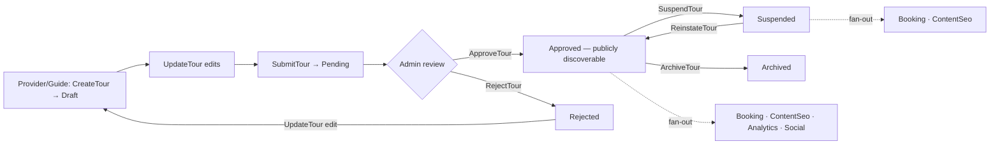
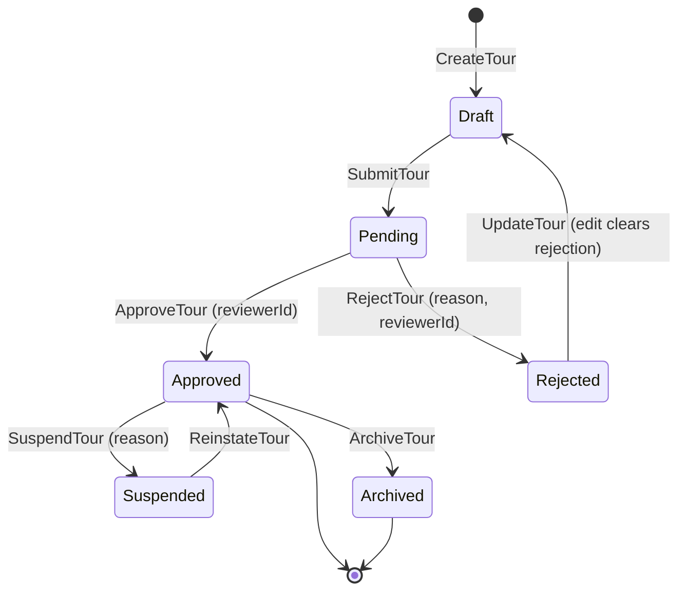
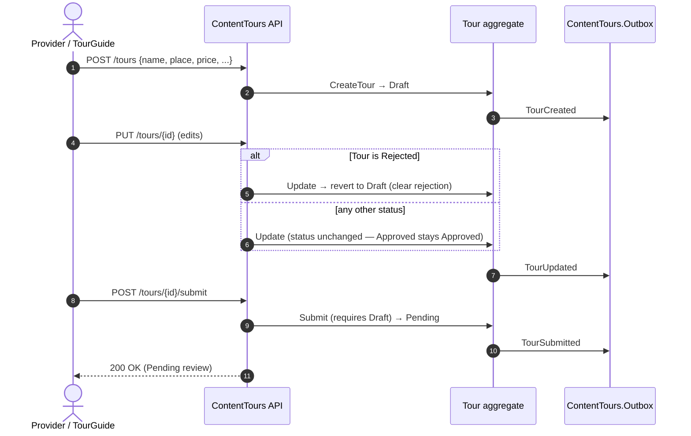
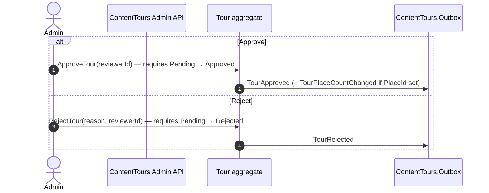
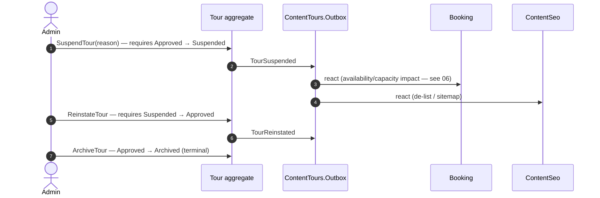

# Workflow 05 — Tour Authoring & Approval

The **ContentTours ownership & moderation view**: how a provider/guide authors a tour, submits it
for review, and how admins approve, reject, suspend, reinstate, or archive it — plus visibility,
featuring, and guide-application availability.

> **Scope.** ContentTours-owned tour **catalog** lifecycle. This document **references, not
> duplicates**: provider onboarding/suspension in [`04-provider-onboarding.md`](./04-provider-onboarding.md),
> booking/availability-slot mechanics in [`06-booking-lifecycle.md`](./06-booking-lifecycle.md),
> payout/commission in [`08-payout-commission.md`](./08-payout-commission.md), agency roster in
> [`18-agency-roster.md`](./18-agency-roster.md), and the authorization model in
> [`../02-actors-and-roles.md`](../02-actors-and-roles.md).

---

## At a glance

| | |
|---|---|
| **Trigger** | `CreateTour` (provider/guide) → `SubmitTour` → admin review |
| **Owner module** | ContentTours |
| **Cross-module reach** | Booking (capacity/availability), ContentSeo (sitemap/SEO), Analytics (popularity), Social (reviews), ContentPlaces (place tour-count) |
| **Key entities** | `Tour` (+ `TourSchedule`, `TourPricingTier`, `TourWaypoint`, `GuideTourOffering`) |
| **Key enums** | `TourStatus` |
| **Background jobs** | None in ContentTours (transitions are command- or event-driven) |

---

## Actors

| Actor | Role |
|---|---|
| **Provider / TourGuide** | Tour author/owner — create, edit, submit, open/close guide applications |
| **Admin** | Approve, reject, suspend, reinstate, archive, feature |
| **Consuming modules** | Booking, ContentSeo, Analytics, Social, ContentPlaces |

---

## Authoring & moderation overview

---

## `TourStatus` state machine

> Source: `ContentTours.Domain/Enums/TourStatus.cs` (`Draft=0, Pending=1, Approved=2, Rejected=3,
> Suspended=4, Archived=5`).
>
> **Edit behavior (verified).** `UpdateTour` reverts **only** a `Rejected` tour back to `Draft`
> (clearing the rejection fields). An **`Approved` tour that is edited remains `Approved`** — there
> is **no** automatic Approved→Draft re-moderation. (The enum's source doc-comment mentions an
> "Update (auto) → Draft" path; the implementation only applies this from `Rejected`.)
>
> **Events (verified).** There is **no universal "status changed" event** — each transition emits
> its own specific event (`TourSubmitted`, `TourApproved`, `TourRejected`, `TourSuspended`,
> `TourReinstated`). `UpdateTour` always emits `TourUpdated`; the Rejected→Draft revert carries
> **no separate status-change event** (it is folded into `TourUpdated`).

---

## Authoring: create → edit → submit

> `Submit` requires status `Draft` (throws `Tour.InvalidTransition` otherwise).

---

## Admin moderation: approve / reject

- Both require status `Pending`. On approval, the tour becomes **publicly discoverable** (see
  *Visibility*) and `TourApproved` fans out to Booking + ContentSeo.

---

## Suspension / reinstatement / archive

> **Provider-driven suspension.** When a provider is suspended, ContentTours **consumes**
> `ProviderSuspended` (handler `ProviderSuspendedSuspendToursHandler`) to suspend that provider's
> tours, and `ProviderReinstated` (`ProviderReinstatedReinstateToursHandler`) to reinstate them.
> The provider lifecycle itself is owned by [`04-provider-onboarding.md`](./04-provider-onboarding.md).

---

## Tour visibility rules

Public discovery requires **`Status == Approved`** (and `!IsDeleted`) — enforced uniformly across
**every** public query handler: `SearchTours`, `ListTours`, `SuggestTours`, `ListFeaturedTours`,
`GetTourBySlug`, `GetTourById` (the by-slug/by-id handlers return not-found unless Approved).

| Status | Public discovery |
|---|---|
| `Approved` | ✅ visible |
| `Draft`, `Pending`, `Rejected`, `Suspended`, `Archived` | ❌ hidden (owner/admin queries only) |

---

## Featuring

`ToggleTourFeatured` (`SetFeatured`) flips `IsFeatured` and emits `TourFeaturedChanged`. Featured
tours surface via `ListFeaturedTours`, which additionally requires `Status == Approved`. (Featuring
does not change `TourStatus`.)

---

## Guide-application availability (`IsOpenForApplications`)

`OpenForApplications()` / `CloseForApplications()` toggle the tour-level `IsOpenForApplications`
flag. `OpenForApplications` requires the tour to be **`Approved`** (throws otherwise).

> **This is guide-application availability, not booking availability.** The flag controls whether
> **TourGuides may apply/offer to run this tour** (the `GuideTourOffering` / guide-proposal domain).
> It does **not** govern traveler booking capacity or availability slots — those are owned by
> [`06-booking-lifecycle.md`](./06-booking-lifecycle.md) (`AvailabilitySlot`, slot locks).

---

## Related but separate: Tour proposals

`TourProposal` is a **separate aggregate** (`TourGuideId`, `GuideUserId`, its own
`TourProposalStatus`, admin-reviewed) with its own command group and events
(`TourProposalSubmitted/Approved/Rejected`). It models a **guide proposing a new tour** for admin
review — distinct from a provider/guide authoring an owned `Tour`.

> **Out of scope for `05`.** It is referenced here only as an adjacent flow; it is a candidate for
> its own future workflow document.

---

## Provider ownership & the "edit clears rejection" rule

- The tour is owned by its creator (`Tour.CreatedByUserId`, resolved via `ITourOwnershipService`).
  Create / edit / submit / open-close-applications are **owner-scoped**.
- **Delete** is split (post-P0/P1): owner deletes via `Tour.DeleteOwn`; admin via `Tour.DeleteAny`
  (see [`../02-actors-and-roles.md`](../02-actors-and-roles.md)).
- **Editing a `Rejected` tour reverts it to `Draft`** so it can be corrected and re-submitted;
  editing an `Approved` tour leaves it `Approved`.

---

## Side effects (integration events)

| Event | Producer | Notable consumers |
|---|---|---|
| `TourCreatedIntegrationEvent` | ContentTours | Analytics, Social, ContentSeo |
| `TourSubmittedIntegrationEvent` | ContentTours | (moderation queue) |
| `TourApprovedIntegrationEvent` | ContentTours | Booking, ContentSeo |
| `TourRejectedIntegrationEvent` | ContentTours | (notify author) |
| `TourSuspendedIntegrationEvent` | ContentTours | Booking, ContentSeo |
| `TourReinstatedIntegrationEvent` | ContentTours | ContentSeo |
| `TourUpdatedIntegrationEvent` | ContentTours | ContentSeo (re-index) |
| `TourFeaturedChangedIntegrationEvent` | ContentTours | ContentSeo / discovery |
| `TourDeletedIntegrationEvent` | ContentTours | Booking, Analytics, Social, ContentSeo |
| `PlaceTourCountUpdatedIntegrationEvent` | ContentTours | ContentPlaces |
| `ProviderSuspended / ProviderReinstated` | Accounts | ContentTours (suspend / reinstate tours) |

---

## Cross-module effects

- **Booking** — reacts to `TourApproved` / `TourSuspended` / `TourDeleted` (tour
  availability/capacity context). Slot mechanics are owned by [`06-booking-lifecycle.md`](./06-booking-lifecycle.md).
- **ContentSeo** — reacts to create/approve/suspend/reinstate/update/delete for sitemap & SEO
  metadata (de-list suspended/deleted tours).
- **Analytics** — reacts to `TourCreated` / `TourDeleted` for popularity/recommendation indexing.
- **Social** — reacts to `TourCreated` / `TourDeleted` for review eligibility/cleanup.
- **ContentPlaces** — reacts to `PlaceTourCountUpdated` (tour count per place).

---

## Background jobs

**None in ContentTours.** Tour lifecycle transitions are command-driven (provider/admin actions)
or event-driven (provider suspension/reinstatement fan-in). Availability-slot generation/cleanup is
owned by Booking — see [`06-booking-lifecycle.md`](./06-booking-lifecycle.md).

---

## Authorization & ownership

| Action | Required |
|---|---|
| Create / edit / submit / open-close applications | Owner (`Tour.Create` / `Tour.Update`); `Tour.CreatedByUserId` |
| Delete own tour | `Tour.DeleteOwn` (owner) |
| Approve / reject / suspend / reinstate / archive | **Admin+** (`Tour.Approve` / `Tour.Reject` / `Tour.Suspend` / `Tour.Reinstate` / `Tour.Archive`) |
| Delete any tour | `Tour.DeleteAny` (Admin+) |
| Feature / unfeature | `Tour.Feature` (Admin+) |

Authoritative model: [`../02-actors-and-roles.md`](../02-actors-and-roles.md). Permission catalog:
`ContentTours.Contracts/Authorization/ContentToursPermissionCatalog.cs`. **Admin override:** all
moderation transitions are admin-only; ownership applies to authoring actions.

---

## Failure / edge paths

| Path | Behavior |
|---|---|
| Submit from non-`Draft` | `Tour.InvalidTransition` (throws) |
| Approve / reject from non-`Pending` | `Tour.InvalidTransition` |
| Suspend from non-`Approved` | `Tour.InvalidTransition` |
| Reinstate from non-`Suspended` | `Tour.InvalidTransition` |
| OpenForApplications on non-`Approved` | throws ("Only approved tours can be opened") |
| Edit an `Approved` tour | stays `Approved` (no re-moderation) |
| Edit a `Rejected` tour | reverts to `Draft` (rejection cleared) |
| Provider suspended | provider's tours suspended via `ProviderSuspended` fan-in |
| `TourStatus` legacy rows | byte-renumber backfill migration required (per enum doc-comment) |

---

## Code references

- `ContentTours.Domain/Entities/Tour.cs` (`Create`, `Update`, `Submit`, `Approve`, `Reject`, `Suspend`, `Reinstate`, `Archive`, `SetFeatured`, `OpenForApplications`, `CloseForApplications`)
- `ContentTours.Domain/Enums/TourStatus.cs`
- `ContentTours.Domain/Events/{TourCreated,TourSubmitted,TourApproved,TourRejected,TourSuspended,TourReinstated,TourUpdated,TourFeaturedChanged,TourPlaceCountChanged}DomainEvent.cs`
- `ContentTours.Application/Commands/Tour/{CreateTour,UpdateTour,SubmitTour,ApproveTour,RejectTour,SuspendTour,ReinstateTour,ArchiveTour,ToggleTourFeatured,OpenForApplications,CloseForApplications,DeleteTour}/`
- `ContentTours.Application/Queries/Tour/{SearchTours,ListTours,SuggestTours,ListFeaturedTours,GetTourBySlug,GetTourById}/` (visibility = `Status == Approved`)
- `ContentTours.Infrastructure/EventHandlers/` (integration converters; `ProviderSuspendedSuspendToursHandler.cs`, `ProviderReinstatedReinstateToursHandler.cs`)
- `ContentTours.Contracts/Authorization/ContentToursPermissionCatalog.cs`

---

## Related risks

- [`RISK-003`](../risks/risk-register.md) — Booking depends on stub snapshot readers for tour pricing/capacity; tour data feeds Booking via those stubs.

---

## Cross-references

- Provider onboarding / suspension: [`04-provider-onboarding.md`](./04-provider-onboarding.md)
- Booking & availability slots: [`06-booking-lifecycle.md`](./06-booking-lifecycle.md)
- Payout & commission: [`08-payout-commission.md`](./08-payout-commission.md)
- Agency roster: [`18-agency-roster.md`](./18-agency-roster.md)
- Actors & authorization: [`../02-actors-and-roles.md`](../02-actors-and-roles.md)
- Eventing mechanism: [`17-outbox-inbox-eventing.md`](./17-outbox-inbox-eventing.md)
- Risk register: [`../risks/risk-register.md`](../risks/risk-register.md)
