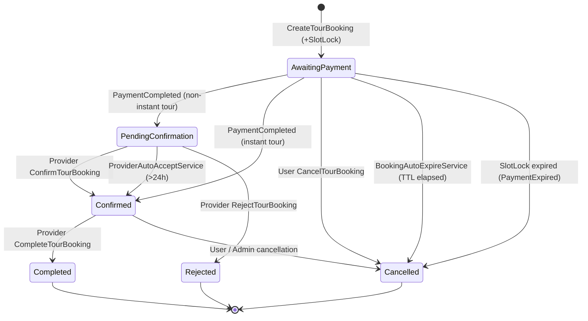
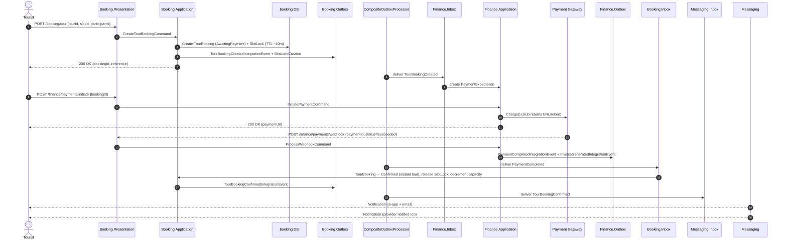
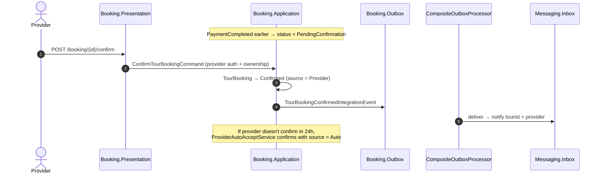
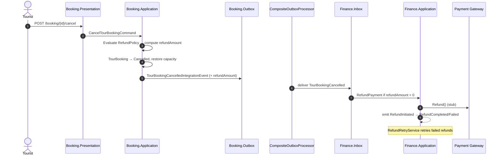

# Workflow 06 — Booking Lifecycle

The **core monetization flow**. From browsing availability to a completed paid booking, including cancellations, timeouts, and provider-confirmed paths.

---

## At a glance

| | |
|---|---|
| **Trigger** | `POST /booking/tour` (authenticated user) |
| **Owner module** | Booking |
| **Cross-module reach** | Finance (payment, invoice, payout), Messaging (notifications), Analytics (snapshots) |
| **Key entities** | `TourBooking`, `SlotLock`, `AvailabilitySlot`, `Reservation`, `PackageBooking`, `RefundPolicy`, `BookingPricing` |
| **Key enums** | `BookingStatus`, `ConfirmationSource`, `CancellationSource`, `SlotType` |

---

## Actors

```mermaid
flowchart LR
    Tourist([Tourist])
    Provider([Provider])
    Admin([Admin])
    Gateway[[Payment Gateway<br/>(stub)]]
    BG[[Background services]]

    Tourist -->|create / cancel| API
    Provider -->|confirm / reject / complete| API
    Admin -->|force refund| API
    Gateway -->|webhook| API
    BG -->|auto-expire / auto-accept / slot cleanup| API
    API[(YallaJo.Api)]
```

---

## `BookingStatus` state machine



> Source enums: `Booking.Domain/Enums/BookingStatus.cs`, `ConfirmationSource.cs`, `CancellationSource.cs`.

---

## Happy-path sequence (instant booking)



---

## Provider-confirmed path (non-instant)



---

## Cancellation & refund



---

## Timeout & background paths

| Background service | Schedule | Effect |
|---|---|---|
| `SlotLockCleanupService` | every ~5 min | Deletes expired `SlotLock` rows; releases capacity |
| `BookingAutoExpireService` | every ~5 min | Cancels `AwaitingPayment` bookings whose TTL elapsed → emits `TourBookingPaymentExpired` |
| `ProviderAutoAcceptService` | every ~15 min | Confirms `PendingConfirmation` bookings older than the configured threshold (~24h) |
| `DocumentExpiryCheckService` | daily | Marks `ProviderDocument` expired/expiring → can suspend provider |

Files in `Booking.Infrastructure/BackgroundServices/`.

---

## Side effects (events)

| Event | Producer | Notable consumers |
|---|---|---|
| `TourBookingCreatedIntegrationEvent` | Booking | Finance (`PaymentExpectation`), Messaging, Analytics |
| `TourBookingConfirmedIntegrationEvent` | Booking | Messaging (notify both parties), Analytics |
| `TourBookingCancelledIntegrationEvent` | Booking | Finance (refund), Messaging, Analytics |
| `TourBookingRejectedIntegrationEvent` | Booking | Finance (refund), Messaging |
| `TourBookingCompletedIntegrationEvent` | Booking | Finance (payout eligibility), Analytics, Social (enables review) |
| `TourBookingPaymentExpiredIntegrationEvent` | Booking | Finance (mark expectation expired), Messaging |
| `SlotLockCreated/Released` | Booking | (internal capacity bookkeeping) |
| `AvailabilitySlotCapacityChanged` | Booking | Cache invalidation |
| `JoinRequestCreated/Approved/Rejected` | Booking | Messaging |
| `PaymentCompletedIntegrationEvent` | Finance | Booking (confirm), Messaging |
| `PaymentFailedIntegrationEvent` | Finance | Booking (stay AwaitingPayment), Messaging |
| `RefundInitiated/Completed/Failed` | Finance | Messaging |

---

## Authorization

| Action | Required |
|---|---|
| Create booking | Authenticated user |
| Cancel own booking | Authenticated user, ownership check |
| Confirm / reject / complete | Provider role + `ITourGuideOwnershipService` / tour ownership |
| Admin force refund | `Admin` policy |
| List all bookings | `Admin` policy |

Permission catalog: `Booking.Contracts/Authorization/BookingPermissionCatalog.cs`.

---

## Code references

- `Booking.Application/Commands/CreateTourBooking/`
- `Booking.Application/Commands/CancelTourBooking/`
- `Booking.Application/Commands/ConfirmTourBooking/`
- `Booking.Application/Commands/RejectTourBooking/`
- `Booking.Application/Commands/CompleteTourBooking/`
- `Booking.Application/Commands/AdminForceRefund/`
- `Booking.Domain/Entities/TourBooking.cs`, `SlotLock.cs`, `AvailabilitySlot.cs`, `RefundPolicy.cs`
- `Booking.Infrastructure/BackgroundServices/{SlotLockCleanupService,BookingAutoExpireService,ProviderAutoAcceptService,DocumentExpiryCheckService}.cs`
- `Booking.Infrastructure/EventHandlers/BookingIntegrationConverters.cs`
- `Booking.Infrastructure/EventHandlers/SlotCapacityRestoreHandlers.cs`
- `Booking.Infrastructure/EventHandlers/TourBookingIntegrationConverters.cs`
- `Finance.Application/EventHandlers/BookingTourBookingCreatedHandler.cs`
- `Finance.Application/EventHandlers/BookingTourBookingCancelledHandler.cs`
- `Finance.Application/EventHandlers/BookingTourBookingCompletedHandler.cs`
- `Finance.Application/Commands/ProcessWebhook/`
- `Messaging.Infrastructure/EventHandlers/Booking*Handler.cs`

---

## Related risks

- [`RISK-002`](../risks/risk-register.md) — `FakePaymentGateway` is a stub; webhook signature verification is not enforced.
- [`RISK-003`](../risks/risk-register.md) — Booking depends on `Stub*SnapshotReader` services for pricing/provider/tour snapshots.
- [`RISK-007`](../risks/risk-register.md) — Background services use `PeriodicTimer` with no distributed lock; scale-out risk.
- [`RISK-008`](../risks/risk-register.md) — `NoOpDiscountEvaluator` ⇒ discounts are not applied.
- [`RISK-011`](../risks/risk-register.md) — Outbox dead-letter exists; reliability hardening still in progress.

Cross-reference: [`../Agents/tasks/Booking/`](../../Agents/tasks/Booking/) for sprint-level task breakdown.
