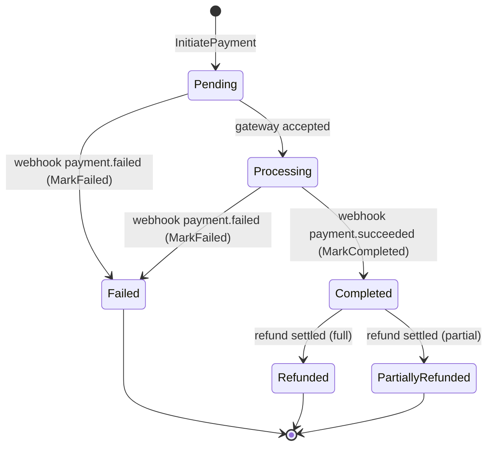
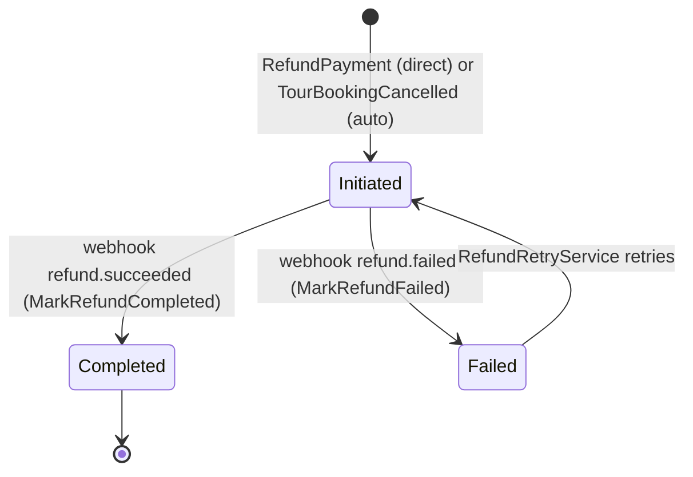
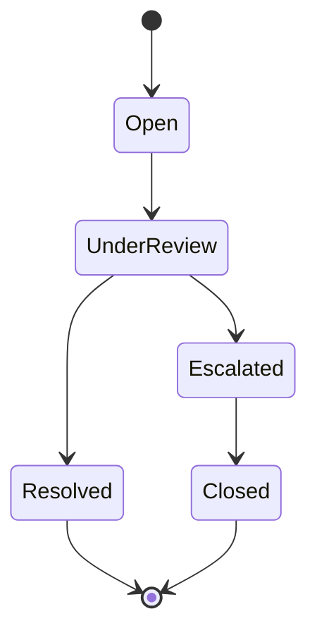
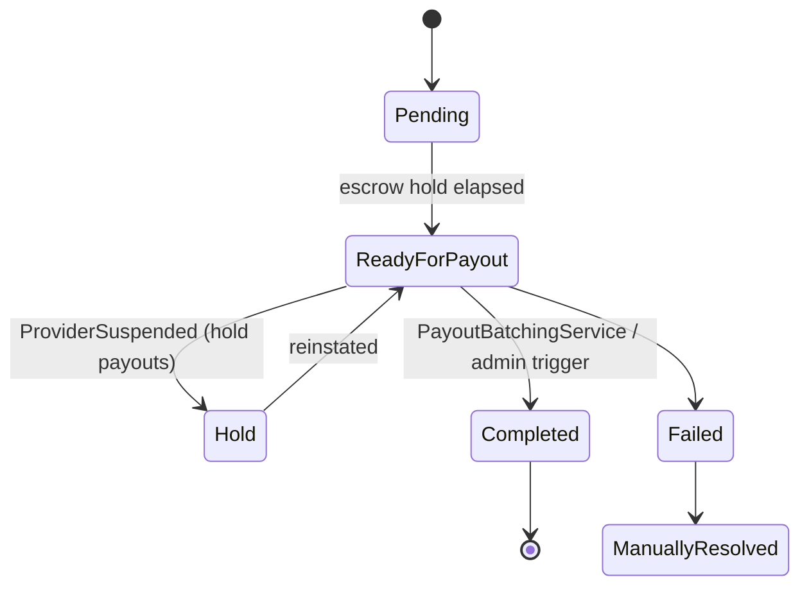

# Workflow 07 — Payment & Refund

The **Finance view** of the money flow: initiating a payment, processing the gateway webhook,
issuing refunds, and the dispute / invoice / payout-eligibility side effects.

> **Scope.** This document covers the Finance module's behavior. It does **not** redraw the
> Booking confirmation flow — payment success and booking confirmation are **decoupled** (see
> §"Payment completion"). For the booking-side lifecycle (instant vs non-instant confirmation,
> capacity conversion, provider/auto-accept) see [`06-booking-lifecycle.md`](./06-booking-lifecycle.md).
> Authorization detail is authoritative in [`../02-actors-and-roles.md`](../02-actors-and-roles.md).
> Loyalty, subscriptions, and discounts are **out of scope / deferred** and only noted where relevant.

---

## At a glance

| | |
|---|---|
| **Trigger** | `POST /payments/initiate` (authenticated user, for an existing booking) |
| **Owner module** | Finance |
| **Cross-module reach** | Booking (expectation seed, cancellation/completion triggers, payment-driven confirmation), Messaging (receipts/refund/invoice notifications), Analytics (snapshots) |
| **Key entities** | `Payment`, `PaymentExpectation`, `Invoice`, `Payout`, `Dispute`, `CommissionRule` |
| **Key enums** | `PaymentStatus`, `PaymentExpectationStatus`, `DisputeStatus`, `PayoutStatus`, `InvoiceStatus` |
| **Gateway** | `IPaymentGateway` → `FakePaymentGateway` (stub; see [`RISK-002`](../risks/risk-register.md)) |

---

## Actors

| Actor | Role in this workflow |
|---|---|
| **User / Traveler** | Initiates payment for own booking; may refund own booking; may open a dispute |
| **Provider** | Payee — completed bookings make payments escrow-eligible for payout |
| **Admin** | Force-refund, dispute resolution, commission rules, payout approve/trigger |
| **External Payment Webhook** | Gateway callbacks (`payment.*`, `refund.*`), authenticated by HMAC |
| **System / Background** | `RefundRetryService`, `PayoutBatchingService` |

---

## Money-flow overview

```mermaid
flowchart LR
    Booking[[Booking: TourBookingCreated]] -->|seed| PE[PaymentExpectation\nAwaitingPayment]
    User([User]) -->|POST /payments/initiate| Pay[Payment\nPending → Processing]
    Pay -->|IPaymentGateway.InitiateAsync| GW[[Payment Gateway (stub)]]
    GW -->|webhook payment.succeeded\nHMAC verified| Done[Payment Completed]
    GW -->|webhook payment.failed| Fail[Payment Failed]
    Done -->|PaymentCompleted event| Bk[[Booking: confirm — see 06]]
    Done -->|InvoiceGenerated| Inv[Invoice Issued]
    Done -->|on TourBookingCompleted| Esc[Escrow eligible → PayoutBatchingService]
    Cancel[[Booking: TourBookingCancelled]] -->|refund| Ref[Refund Payment row]
    User -->|POST /payments/&#123;id&#125;/refund| Ref
    Ref -->|webhook refund.succeeded/failed| RefDone[Refunded / PartiallyRefunded]
    User -->|open| Disp[Dispute Open\n(no consumer)]
```

---

## `PaymentStatus` state machine



> **`PaymentExpectationStatus`** is a separate Finance-local snapshot keyed by `BookingId`:
> `AwaitingPayment → Paid` (on completion) or `→ Cancelled` (on booking expiry/cancel). It is
> seeded from `TourBookingCreated` and provides a deterministic anchor for `/payments/initiate`
> without round-tripping to Booking.
>
> Source enums: `Finance.Domain/Enums/{PaymentStatus,PaymentExpectationStatus}.cs`.

---

## Payment initiation & expectation creation

1. When Booking publishes `TourBookingCreatedIntegrationEvent`, Finance's
   `BookingTourBookingCreatedHandler` materialises a local `PaymentExpectation`
   (`AwaitingPayment`) snapshot for the booking — amount, currency, provider, tour, reference.
2. The user calls `POST /payments/initiate {bookingId}`. `InitiatePaymentCommand` creates a
   `Payment` (`Pending`) and calls `IPaymentGateway.InitiateAsync`, which (in `FakePaymentGateway`)
   returns a deterministic `gw-pay-{paymentId}` transaction id and a return URL.
3. The user is redirected to the gateway; the gateway later calls the webhook (below).

Idempotency: `PaymentExpectation` creation is guarded (skips if one already exists for the booking).

---

## Webhook processing (HMAC + idempotent)

```mermaid
sequenceDiagram
    autonumber
    participant GW as Payment Gateway
    participant API as Finance.Presentation (/payments/webhook)
    participant FGW as IPaymentGateway
    participant FApp as ProcessWebhookCommand
    participant IB as Finance.Inbox
    participant FOB as Finance.Outbox

    GW->>API: POST /payments/webhook (raw body + X-Signature)
    API->>API: EnableBuffering; read raw body
    API->>FGW: VerifyWebhookSignatureAsync(rawBody, headers)  [HMAC-SHA256, BEFORE parse]
    alt signature invalid / missing
        API-->>GW: 400 Payment.WebhookSignatureMismatch
    else valid
        API->>API: parse WebhookEnvelope
        API->>FApp: ProcessWebhookCommand(EventId, EventType, GatewayPaymentId, ...)
        FApp->>IB: HasBeenProcessed(messageId)?  (dedupe by EventId)
        alt already processed
            FApp-->>API: Idempotent = true (no-op)
        else first time
            FApp->>FApp: locate Payment by GatewayTransactionId
            alt payment.succeeded
                FApp->>FApp: Payment.MarkCompleted → emit PaymentCompleted + InvoiceGenerated
            else payment.failed
                FApp->>FApp: Payment.MarkFailed (booking stays AwaitingPayment)
            else refund.succeeded / refund.failed
                FApp->>FApp: MarkRefundCompleted / MarkRefundFailed (see Refund)
            end
            FApp->>IB: MarkAsProcessed(messageId)
            FApp->>FOB: integration events (PaymentCompleted, InvoiceGenerated, ...)
        end
    end
```

- **HMAC is enforced before the body is parsed.** `FakePaymentGateway.VerifyWebhookSignatureAsync`
  validates an `X-Signature: hmac-sha256=<hex>` header with a constant-time compare and rejects
  missing/unsigned requests or an unconfigured secret. (The gateway itself is a stub — see
  [`RISK-002`](../risks/risk-register.md).)
- **Idempotency** is by `EventId` via the Finance inbox; a payment row not yet found returns
  `NotFound` so the gateway/outbox retries.

---

## Payment completion → side effects

On `payment.succeeded`, `Payment.MarkCompleted` runs and Finance emits:

| Side effect | Mechanism |
|---|---|
| **Invoice generation** | `OnPaymentCompletedGenerateInvoiceHandler` → `Invoice` (`Issued`), rendered via QuestPDF to local storage ([`RISK-009`](../risks/risk-register.md)) |
| **Booking confirmation** | `PaymentCompletedIntegrationEvent` is consumed **by Booking** (`PaymentCompletedConfirmBookingHandler`), which — state-guarded — confirms instant bookings or moves non-instant bookings to `PendingConfirmation`. **This is the Booking side; see [`06-booking-lifecycle.md`](./06-booking-lifecycle.md).** Payment completion and booking confirmation are decoupled. |
| **Analytics** | Payment snapshot updated |
| **Notification** | Messaging sends a payment receipt |

> **Decoupling note.** Finance does not call Booking to confirm; it only publishes
> `PaymentCompleted`. A booking is never confirmed *inside* the payment transaction.

---

## Payment failure

On `payment.failed`, `Payment.MarkFailed` records the reason. **Booking behavior is unchanged:**
the booking remains `AwaitingPayment` and is eventually cancelled by `BookingAutoExpireService`
when its TTL elapses (Booking is **not** a consumer of `PaymentFailed`). Messaging may notify the
user of the failure.

---

## `RefundStatus` (logical) state machine



> **Note:** `RefundStatus` here is a **logical workflow representation** for documentation only —
> it is **not a standalone enum** in the codebase. A refund is modeled as a **separate `Payment`
> row** (`PaymentType.Refund`, negative amount, `OriginalPaymentId` set) tracked by the normal
> `PaymentStatus`. When it settles, the original payment is updated to `Refunded` or
> `PartiallyRefunded` via `ApplyRefundCompletion`.

---

## Refund lifecycle

```mermaid
sequenceDiagram
    autonumber
    participant U as User / Admin
    participant Bk as Booking
    participant FApp as Finance.Application
    participant GW as Payment Gateway
    participant FOB as Finance.Outbox

    alt Direct refund
        U->>FApp: POST /payments/&#123;id&#125;/refund (RefundPaymentCommand)
    else Cancellation-driven refund
        Bk->>FApp: TourBookingCancelled (+ refundAmount) → BookingTourBookingCancelledHandler
    end
    FApp->>FApp: create refund Payment row (PaymentType.Refund, OriginalPaymentId)
    FApp->>GW: IPaymentGateway.RefundAsync
    FApp->>FOB: RefundInitiated
    GW-->>FApp: webhook refund.succeeded / refund.failed (HMAC verified)
    alt succeeded
        FApp->>FApp: MarkRefundCompleted + original.ApplyRefundCompletion
        FApp->>FOB: RefundCompleted
    else failed
        FApp->>FApp: MarkRefundFailed
        FApp->>FOB: RefundFailed
        Note over FApp: RefundRetryService retries failed refunds
    end
```



Refund entry points:
- **Direct:** `POST /payments/{id}/refund` — self (own booking) / provider / admin guarded.
- **Cancellation-driven:** `TourBookingCancelled` with `refundAmount > 0` (e.g. user cancel within
  policy, provider rejection = 100%). See [`06-booking-lifecycle.md`](./06-booking-lifecycle.md).

> **Known gap:** refund completion (`RefundCompleted`) currently raises **no traveler
> notification** (see [`RISK-005`](../risks/risk-register.md)).

---

## Dispute lifecycle (Finance-internal)



Disputes are **Finance-internal**. `DisputeOpenedIntegrationEvent` is declared and registered but
**currently has no consumer** — opening a dispute produces no cross-module fan-out (no automatic
notification, booking hold, or payout hold). Tracked under [`RISK-005`](../risks/risk-register.md).

Source enum: `Finance.Domain/Enums/DisputeStatus.cs`.

---

## Invoice generation

On payment completion, `OnPaymentCompletedGenerateInvoiceHandler` creates an `Invoice` (`Issued`),
generates a PDF via QuestPDF, and stores it on the local filesystem
([`RISK-009`](../risks/risk-register.md)). `InvoiceStatus`: `Issued → Cancelled` / `Refunded`.

---

## Payout eligibility & escrow (brief)

When Booking publishes `TourBookingCompletedIntegrationEvent`,
`BookingTourBookingCompletedHandler` stamps `EscrowReleaseEligibleAt` on the matching completed
`Payment` (= `CompletedAt + EscrowOptions.HoldDays`) via `MarkEscrowEligible`. The
`PayoutBatchingService` later batches escrow-eligible payments into payouts.



> Full payout, commission, and escrow detail will be documented in `08-payout-commission.md`.
> `PayoutStatus`: `Pending, ReadyForPayout, Hold, Completed, Failed, ManuallyResolved`.

---

## Side effects (integration events)

| Event | Producer | Notable consumers |
|---|---|---|
| `PaymentCompletedIntegrationEvent` | Finance | Booking (confirm — see 06), Messaging, Analytics, Finance (invoice) |
| `PaymentFailedIntegrationEvent` | Finance | Messaging (**not** Booking) |
| `InvoiceGeneratedIntegrationEvent` | Finance | Messaging |
| `RefundInitiatedIntegrationEvent` | Finance | Messaging (`RefundInitiatedHandler`) |
| `RefundCompletedIntegrationEvent` | Finance | Analytics. **No traveler notification** — Messaging has no `RefundCompleted` handler ([`RISK-005`](../risks/risk-register.md)) |
| `RefundFailedIntegrationEvent` | Finance | Messaging (`RefundFailedHandler`) |
| `PayoutScheduled / PayoutCompleted` | Finance | Messaging, Analytics |
| `DisputeOpenedIntegrationEvent` | Finance | **none (no consumer)** |
| `TourBookingCreated` | Booking | Finance (seed `PaymentExpectation`) |
| `TourBookingCancelled` | Booking | Finance (refund) |
| `TourBookingCompleted` | Booking | Finance (escrow-stamp / payout eligibility) |
| `TourBookingPaymentExpired` | Booking | Finance (mark expectation `Cancelled`) |
| `ProviderSuspended` | Accounts | Finance (hold payouts) |

---

## Background jobs

| Service | Schedule | Effect |
|---|---|---|
| `RefundRetryService` | periodic | Retries refunds in `Failed` state |
| `PayoutBatchingService` | periodic | Batches escrow-eligible payments into payouts |

Files in `Finance.Infrastructure/BackgroundServices/`. Both use `PeriodicTimer` with no
distributed lock — single-instance assumption ([`RISK-007`](../risks/risk-register.md)).

---

## Authorization & ownership

| Action | Required (post-P0/P1 permission-claim model) |
|---|---|
| Initiate payment | `Payment.Create`; own booking |
| Read own payments / invoice | `Payment.Read`; self / provider-self / admin |
| Refund | `Refund.Create`. **User** may refund own booking (consumer); **Admin** force-refund separated in-handler via `AdminFinanceDashboard.*` |
| Payout trigger / approve, commission CRUD | `Payout.*` / `CommissionRule.*` — Admin+ |
| Webhook | **System / HMAC** — `AllowAnonymous` + signature verification (no role/permission) |

Authoritative model: [`../02-actors-and-roles.md`](../02-actors-and-roles.md). Permission catalog:
`Finance.Contracts/Authorization/FinancePermissionCatalog.cs`.

**Admin override:** force-refund (`AdminFinanceDashboard` / `AdminBookingDashboard.Update`),
dispute resolution, payout approval, commission management — all Admin+.

---

## Failure / timeout paths

| Path | Behavior |
|---|---|
| Invalid / missing webhook signature | Rejected (`400`) before parsing; no state change |
| Webhook for unknown gateway payment id | `NotFound` → gateway/outbox retries |
| Duplicate webhook (same `EventId`) | Inbox dedupe → idempotent no-op |
| `payment.failed` | Payment `Failed`; booking stays `AwaitingPayment` → `BookingAutoExpireService` cancels on TTL |
| `refund.failed` | Refund `Failed` → `RefundRetryService` retries |
| Provider suspended | `ProviderSuspended` → payouts moved to `Hold` |
| Discounts | `NoOpDiscountEvaluator` — discounts not applied ([`RISK-008`](../risks/risk-register.md)) |

---

## Code references

- `Finance.Application/Commands/InitiatePayment/`
- `Finance.Application/Commands/ProcessWebhook/`
- `Finance.Application/Commands/RefundPayment/`
- `Finance.Application/EventHandlers/{BookingTourBookingCreated,BookingTourBookingCancelled,BookingTourBookingCompleted,BookingTourBookingPaymentExpired,OnPaymentCompletedGenerateInvoice}Handler.cs`
- `Finance.Presentation/Endpoints/Payment/PaymentEndpoints.cs`
- `Finance.Infrastructure/Gateways/FakePaymentGateway.cs`
- `Finance.Infrastructure/BackgroundServices/{RefundRetryService,PayoutBatchingService}.cs`
- `Finance.Domain/Enums/{PaymentStatus,PaymentExpectationStatus,DisputeStatus,PayoutStatus,InvoiceStatus}.cs`
- Booking-side confirmation: `Booking.Infrastructure/EventHandlers/PaymentCompletedConfirmBookingHandler.cs` (see [`06-booking-lifecycle.md`](./06-booking-lifecycle.md))

---

## Related risks

- [`RISK-002`](../risks/risk-register.md) — `FakePaymentGateway` is a stub (no real charges). Webhook HMAC-SHA256 verification **is** enforced before parse.
- [`RISK-005`](../risks/risk-register.md) — Integration-event coverage gaps: `DisputeOpened` has no consumer; `RefundCompleted` raises no traveler notification.
- [`RISK-007`](../risks/risk-register.md) — Background jobs use `PeriodicTimer` with no distributed lock; scale-out risk.
- [`RISK-008`](../risks/risk-register.md) — `NoOpDiscountEvaluator` ⇒ discounts are not applied.
- [`RISK-009`](../risks/risk-register.md) — Local filesystem storage for invoice PDFs.

---

## Cross-references

- Booking lifecycle (confirmation, capacity, cancellation): [`06-booking-lifecycle.md`](./06-booking-lifecycle.md)
- Actors & authorization model: [`../02-actors-and-roles.md`](../02-actors-and-roles.md)
- Eventing mechanism: [`17-outbox-inbox-eventing.md`](./17-outbox-inbox-eventing.md)
- Cross-module event catalog: [`../eventing/`](../eventing/)
- Risk register: [`../risks/risk-register.md`](../risks/risk-register.md)
