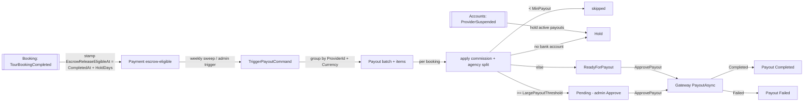
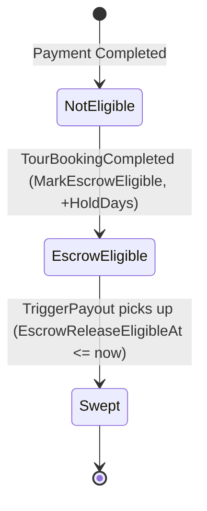
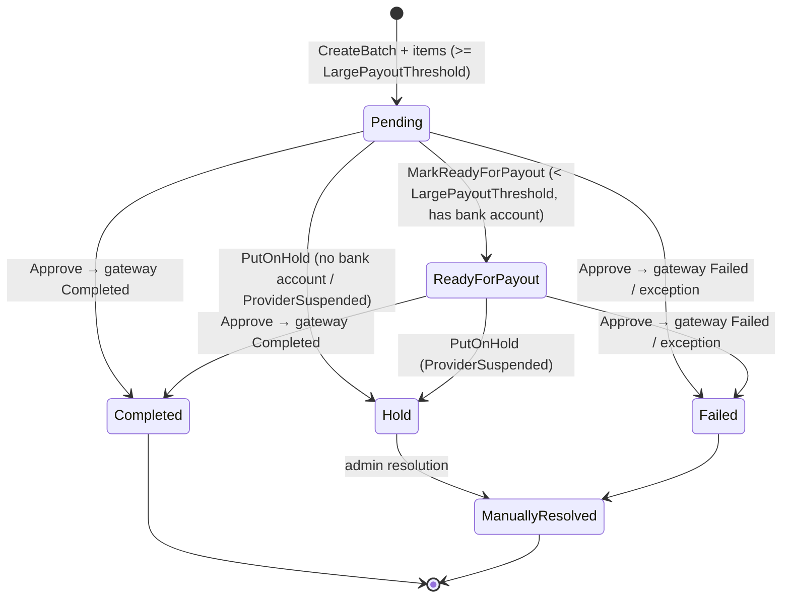
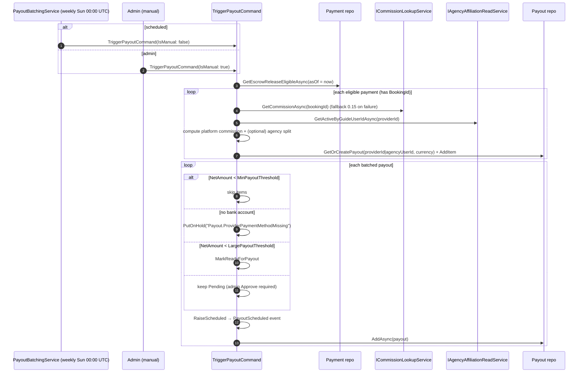
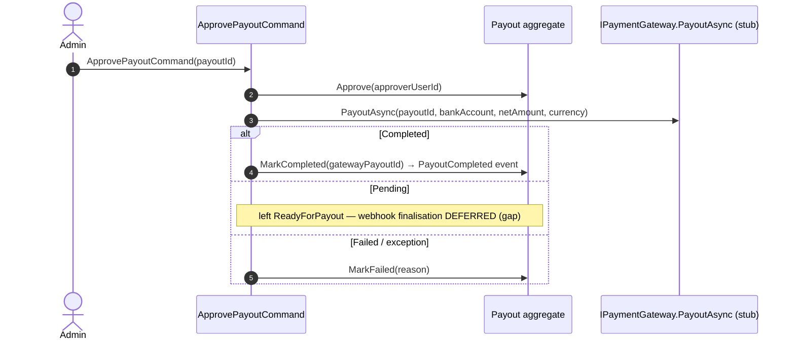

# Workflow 08 — Payout & Commission

The **Finance settlement view**: how completed-booking funds move from escrow through batching,
commission deduction, provider/agency payout, and gateway settlement.

> **Scope.** Finance-owned settlement. This document **starts** where money has already been
> captured. For booking states and the `TourBookingCompleted` trigger see
> [`06-booking-lifecycle.md`](./06-booking-lifecycle.md); for payment initiation, the webhook,
> refunds, disputes, and invoicing see [`07-payment-refund.md`](./07-payment-refund.md). Those are
> referenced, not duplicated. Authorization is authoritative in
> [`../02-actors-and-roles.md`](../02-actors-and-roles.md).

---

## At a glance

| | |
|---|---|
| **Trigger** | `TourBookingCompletedIntegrationEvent` (escrow stamp) → weekly `PayoutBatchingService` or admin trigger |
| **Owner module** | Finance |
| **Cross-module reach** | Booking (`TourBookingCompleted`), Accounts (`ProviderSuspended`, agency affiliation), Messaging (`PayoutScheduled`), Analytics (`PayoutCompleted`) |
| **Key entities** | `Payment` (escrow stamp), `Payout`, `PayoutItem`, `CommissionRule`, `ProviderPaymentMethod` |
| **Key enums** | `PayoutStatus` |
| **Gateway** | `IPaymentGateway.PayoutAsync` → `FakePaymentGateway` (stub; [`RISK-002`](../risks/risk-register.md)) |
| **Config** | `Finance:Payout` (`HoldDays`), `TriggerPayoutOptions` (`MinPayoutThreshold`, `LargePayoutThreshold`), `Finance:BackgroundServices:PayoutBatching` |

---

## Actors

| Actor | Role |
|---|---|
| **Provider / TourGuide** | Payee; views own payouts |
| **Agency** | Payee via active affiliation (commission split) |
| **Admin** | Manual trigger, approve large payouts, resolve holds, manage commission rules |
| **System / Background** | `PayoutBatchingService` (weekly sweep) |
| **External Payout Gateway** | `PayoutAsync` (stub) |

---

## Settlement-flow overview

---

## Escrow lifecycle

When Booking publishes `TourBookingCompletedIntegrationEvent`, the **inbox-guarded**
`BookingTourBookingCompletedHandler` finds the booking's **Completed booking-payment** and stamps
`EscrowReleaseEligibleAt = CompletedAt + HoldDays` via `Payment.MarkEscrowEligible`. The hold
period is the `Finance:Payout` → `HoldDays` knob (default deferred to config). A payment becomes
sweepable once `EscrowReleaseEligibleAt <= now`.

> If no Completed booking-payment exists for the booking, the escrow stamp is skipped (logged);
> the inbox message is still marked processed (idempotent).

---

## `PayoutStatus` state machine

> Source enum `Finance.Domain/Enums/PayoutStatus.cs`:
> `Pending, ReadyForPayout, Hold, Completed, Failed, ManuallyResolved`.
> Aggregate transitions: `MarkReadyForPayout`, `PutOnHold`, `Approve`, `MarkCompleted`, `MarkFailed`.

---

## Payout batching & eligibility sweep

- The weekly **`PayoutBatchingService`** (Sunday 00:00 UTC, `PeriodicTimer(7d)`) and the admin
  trigger call the **same** `TriggerPayoutCommand` (DRY).
- Payouts are grouped by `(ProviderId, Currency)` over a 7-day period window.

---

## Commission calculation

Per eligible payment (per booking):

1. **Platform commission** = `gross × commissionRate`, where `commissionRate` comes from
   `ICommissionLookupService.GetCommissionAsync(bookingId)` (falls back to **0.15** on lookup
   failure — see [`RISK-003`](../risks/risk-register.md)).
2. **`postPlatformNet`** = `gross − platformCommission`.
3. **Agency split** — if the guide has an **active agency affiliation**
   (`IAgencyAffiliationReadService.GetActiveByGuideUserIdAsync`):
   - `agencyAmount = postPlatformNet × (affiliation.CommissionPercentage / 100)`
   - `guideAmount = postPlatformNet − agencyAmount`
   - The **guide** payout records commission `= platformCommission + agencyAmount`; a **separate
     agency** payout (keyed by `affiliation.AgencyUserId`) records the `agencyAmount`.
   - If **no** affiliation: the provider receives `postPlatformNet`, commission = `platformCommission`.

> Rounding is banker's rounding (`MidpointRounding.ToEven`, 2 dp). Agency roster management itself
> is covered in the planned `18-agency-roster.md`; this section documents only the **payout split math**.

---

## Provider payout approval & gateway settlement

> **Current implementation gap.** When the gateway returns `Pending`, the payout is left in
> `ReadyForPayout` and a settlement webhook would finalise it — **that webhook path is not yet
> implemented** ("deferred to Phase 3" in code). With the current `FakePaymentGateway`, `PayoutAsync`
> returns `Completed` immediately, so this gap is latent. See [`RISK-005`](../risks/risk-register.md).

---

## Payout holds & provider-suspension impact

- **Missing bank account** → batching puts the payout on `Hold` (`Payout.ProviderPaymentMethodMissing`).
- **Provider suspended** → `ProviderSuspendedHoldPayoutsHandler` (inbox-guarded) puts all the
  provider's `Pending`/`ReadyForPayout` payouts on `Hold`. `Completed`/`Failed`/already-`Hold`
  payouts are untouched. (The booking-side cancellation fan-out of suspension is in
  [`06-booking-lifecycle.md`](./06-booking-lifecycle.md).)
- Holds are cleared by admin resolution (`ManuallyResolved`).

---

## Payout failures & retry

- Gateway `Failed` or a thrown exception during `ApprovePayout` → `MarkFailed(reason)`.
- There is **no automatic payout-retry background service** (unlike refunds, which have
  `RefundRetryService` — see [`07-payment-refund.md`](./07-payment-refund.md)). Failed payouts are
  resolved by admin re-trigger / `ManuallyResolved`.

---

## Commission rules (`CommissionRule`)

`CommissionRule` is a **tier-based** model: `Tier`, `MinMonthlyRevenue`, `MaxMonthlyRevenue?`,
`Currency`, `Percentage`, `IsActive`, `Notes`.

| Operation | Command | Permission |
|---|---|---|
| Create | `CreateCommissionRule` | `CommissionRule.Create` (Admin+) |
| Update | `UpdateCommissionRule` | `CommissionRule.Update` (Admin+) |
| Delete (deactivate) | `DeleteCommissionRule` | `CommissionRule.Delete` (Admin+) |

Changes emit `CommissionRuleUpserted` / `CommissionRuleDeleted`, consumed by **Booking** to refresh
its commission snapshots used in booking pricing. (Booking only *consumes* these — see
[`06-booking-lifecycle.md`](./06-booking-lifecycle.md).)

---

## Admin payout operations

| Action | Mechanism |
|---|---|
| Manual payout run | `TriggerPayoutCommand(IsManual: true)` |
| Approve a (large/Pending) payout | `ApprovePayoutCommand` → gateway settlement |
| Hold resolution | `ManuallyResolved` |
| Commission rule CRUD | Create/Update/Delete commands above |

---

## Side effects (integration events)

| Event | Producer | Notable consumers |
|---|---|---|
| `TourBookingCompletedIntegrationEvent` | Booking | Finance (escrow stamp), Analytics, Social |
| `ProviderSuspendedIntegrationEvent` | Accounts | Finance (hold payouts), Booking (cancel) |
| `PayoutScheduledIntegrationEvent` | Finance | Messaging (`PayoutScheduledHandler`) |
| `PayoutCompletedIntegrationEvent` | Finance | Analytics |
| `CommissionRuleUpserted / CommissionRuleDeleted` | Finance | Booking (commission snapshot) |

---

## Background jobs

| Service | Schedule | Effect |
|---|---|---|
| `PayoutBatchingService` | weekly, Sunday 00:00 UTC (`PeriodicTimer(7d)`, config-gated) | Delegates to `TriggerPayoutCommand` to sweep escrow-eligible payments into payouts |

`Finance.Infrastructure/BackgroundServices/`. Single-instance assumption — no distributed lock
([`RISK-007`](../risks/risk-register.md)).

---

## Authorization & ownership

| Action | Required |
|---|---|
| View own payouts | `Payout.Read`; provider/agency self / admin |
| Trigger / approve payout, resolve hold | `Payout.Trigger` / `Payout.Approve` / `AdminFinanceDashboard` — Admin+ |
| Commission rule CRUD | `CommissionRule.{Create,Update,Delete}` — Admin+ |

Authoritative model: [`../02-actors-and-roles.md`](../02-actors-and-roles.md). Permission catalog:
`Finance.Contracts/Authorization/FinancePermissionCatalog.cs`. **Admin override:** manual trigger,
large-payout approval, hold resolution.

---

## Failure / edge paths

| Path | Behavior |
|---|---|
| No escrow-eligible payments | Sweep returns `(0,0,0,0)` no-op |
| Commission lookup fails | Fallback rate `0.15` (logged) |
| Net < `MinPayoutThreshold` | Items skipped |
| No default bank account | Payout `Hold` |
| Net ≥ `LargePayoutThreshold` | Stays `Pending` (admin Approve) |
| Gateway `Pending` | Left `ReadyForPayout`; webhook finalisation deferred (gap) |
| Gateway `Failed` / exception | `MarkFailed`; admin resolves |
| Provider suspended | Active payouts → `Hold` |

---

## Code references

- `Finance.Application/Commands/TriggerPayout/TriggerPayoutCommandHandler.cs`
- `Finance.Application/Commands/ApprovePayout/ApprovePayoutCommandHandler.cs`
- `Finance.Application/Commands/{CreateCommissionRule,UpdateCommissionRule,DeleteCommissionRule}/`
- `Finance.Application/EventHandlers/BookingTourBookingCompletedHandler.cs` (escrow stamp; `EscrowOptions`)
- `Finance.Infrastructure/EventHandlers/ProviderSuspendedHoldPayoutsHandler.cs`
- `Finance.Infrastructure/BackgroundServices/PayoutBatchingService.cs`
- `Finance.Domain/Entities/{Payout,PayoutItem,CommissionRule,Payment}.cs`
- `Finance.Domain/Enums/PayoutStatus.cs`
- `Finance.Contracts/Services/ICommissionLookupService.cs`, `Accounts.Contracts` agency affiliation reader

---

## Related risks

- [`RISK-002`](../risks/risk-register.md) — payout gateway is the `FakePaymentGateway` stub (`PayoutAsync` returns instant Completed; no real transfer).
- [`RISK-003`](../risks/risk-register.md) — commission lookup falls back to `0.15` on failure (stub commission lookup).
- [`RISK-005`](../risks/risk-register.md) — payout `Pending`→webhook finalisation deferred (not implemented).
- [`RISK-007`](../risks/risk-register.md) — `PayoutBatchingService` single-instance (`PeriodicTimer`, no distributed lock).

---

## Cross-references

- Booking lifecycle (completion trigger, suspension cancel): [`06-booking-lifecycle.md`](./06-booking-lifecycle.md)
- Payment, webhook, refund, dispute, invoice: [`07-payment-refund.md`](./07-payment-refund.md)
- Actors & authorization: [`../02-actors-and-roles.md`](../02-actors-and-roles.md)
- Eventing mechanism: [`17-outbox-inbox-eventing.md`](./17-outbox-inbox-eventing.md)
- Risk register: [`../risks/risk-register.md`](../risks/risk-register.md)
