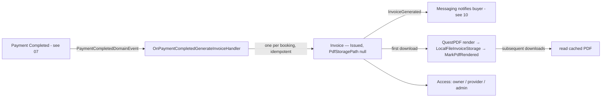
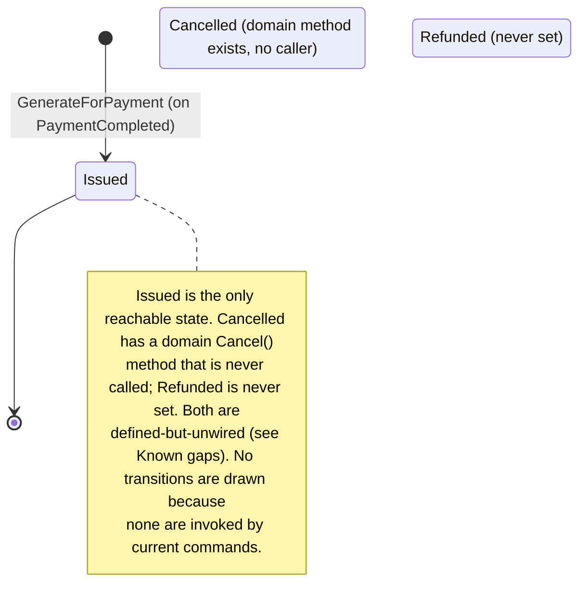
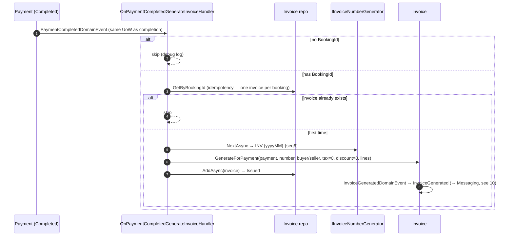
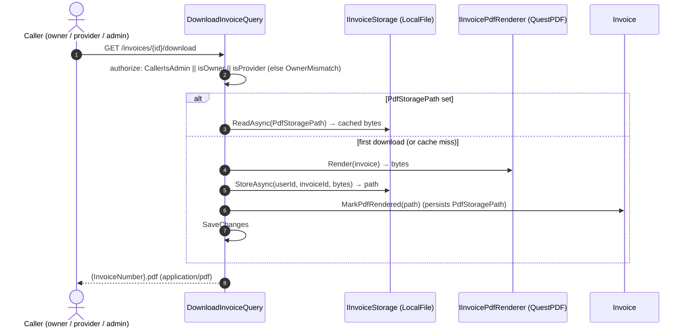

# Workflow 09 — Invoicing

The **Finance invoice lifecycle view**: how a completed payment generates an invoice, how it is
numbered, lazily rendered to PDF, stored, accessed, and delivered.

> **Scope.** Finance-owned invoice lifecycle. This document **references, not duplicates**: the
> booking lifecycle ([`06`](./06-booking-lifecycle.md)), payment/refund lifecycle
> ([`07`](./07-payment-refund.md)), payout lifecycle ([`08`](./08-payout-commission.md)),
> notification delivery ([`10`](./10-notifications-fanout.md)), the eventing mechanism
> ([`17`](./17-outbox-inbox-eventing.md)), and the authorization model
> ([`../02-actors-and-roles.md`](../02-actors-and-roles.md)).

---

## At a glance

| | |
|---|---|
| **Trigger** | `PaymentCompletedDomainEvent` (payment marked Completed) |
| **Owner module** | Finance |
| **Cross-module reach** | Messaging (invoice-generated notification, via `10`) |
| **Key entities** | `Invoice`, `InvoiceItem`, `InvoiceNumberCounter` |
| **Key enums** | `InvoiceStatus` |
| **Key services** | `IInvoiceNumberGenerator` (`SqlInvoiceNumberGenerator`), `IInvoicePdfRenderer` (`QuestPdfInvoiceRenderer`), `IInvoiceStorage` (`LocalFileInvoiceStorage`) |
| **Background jobs** | None |

---

## Actors

| Actor | Role |
|---|---|
| **End User / Traveler** | Buyer; views & downloads own invoices |
| **Provider** | Seller; views & downloads invoices for own bookings |
| **Admin** | Views/downloads any invoice (via admin flag) |
| **System** | `OnPaymentCompletedGenerateInvoiceHandler` (in-process, same UoW as payment completion) |

---

## Invoicing overview

---

## Invoice model

| Field group | Members |
|---|---|
| Links | `PaymentId`, `BookingId`, `UserId` (buyer), `ProviderId` (seller) |
| Identity | `InvoiceNumber` (`INV-{yyyyMM}-{seq6}`), `Status`, `Currency`, `IssuedAt` |
| Amounts | `AmountSubtotal`, `AmountTax`, `AmountDiscount`, `AmountTotal` (+ `InvoiceItem` lines) |
| Parties | `BuyerName`, `BuyerEmail`, `SellerName`, `SellerTaxId` |
| PDF | `PdfStoragePath` (nullable; populated lazily on first download) |

- `Invoice.GenerateForPayment(...)` requires `payment.Status == Completed`; child `InvoiceItem`
  rows carry the line items.
- **Known gap (inline):** buyer/seller fields are currently **placeholders** ("Customer", empty
  email, "YallaJo Provider"), and **tax = 0 / discount = 0** are hardcoded — cross-module
  enrichment (Accounts user/provider snapshots) is deferred.

---

## `InvoiceStatus` state machine

> Source: `Finance.Domain/Enums/InvoiceStatus.cs` (`Issued=0, Cancelled=1, Refunded=2`).

---

## Generation: PaymentCompleted → invoice

- The handler runs **in the same unit of work** as payment completion (not a separate inbox
  consumer), so the invoice is persisted in the same transaction.
- **Idempotent:** one invoice per booking (skips if one already exists).
- The triggering payment lifecycle is owned by [`07-payment-refund.md`](./07-payment-refund.md).

---

## Invoice numbering

`SqlInvoiceNumberGenerator` produces **`INV-{yyyyMM}-{seq6}`** using an EF Core tracked,
per-month `InvoiceNumberCounter` with optimistic concurrency (sequence resets per UTC month).

---

## PDF rendering & storage (lazy + cached)

PDF generation is **lazy** — no PDF is produced at invoice creation (`PdfStoragePath` starts null):

- **First download** renders via QuestPDF, stores through `LocalFileInvoiceStorage`, and persists
  the path via `MarkPdfRendered`. **Subsequent downloads** read the cached file.
- Storage is the **local filesystem** ([`RISK-009`](../risks/risk-register.md)).

---

## Invoice delivery & notification

Invoice creation emits `InvoiceGeneratedIntegrationEvent`, consumed by **Messaging**
(`InvoiceGeneratedHandler`) to notify the buyer. Channels/preferences for that notification are
owned by [`10-notifications-fanout.md`](./10-notifications-fanout.md) — not re-detailed here.

---

## Invoice access

| Endpoint | Purpose |
|---|---|
| `GET /invoices/my-invoices` | Buyer's own invoices |
| `GET /invoices/provider/my-invoices` | Provider's invoices (own bookings) |
| `GET /invoices/{id}` | Single invoice (authorized) |
| `GET /invoices/{id}/download` | PDF download (lazy render + cache) |

- **Shared endpoints** — there are **no dedicated admin invoice endpoints**.
- Authorization: `MustHavePermission(Invoice, Read|Download)` + in-handler check
  `CallerIsAdmin || isOwner || isProvider`, where `CallerIsAdmin = HasPermission("Permission.AdminFinanceDashboard.Read")`,
  `isOwner = invoice.UserId == caller`, `isProvider = invoice.ProviderId == callerProviderId`.
  Unauthorized → `Invoice.OwnerMismatch`.

---

## Refund impact on invoices

**None today.** A refund does **not** mutate the invoice — there is no credit note, negative
invoice, or status change. Refunds are modeled as a separate negative `Payment` row in
[`07-payment-refund.md`](./07-payment-refund.md); `InvoiceStatus.Refunded` is never set.

---

## Side effects (integration events)

| Event | Type | Consumers |
|---|---|---|
| `InvoiceGeneratedDomainEvent` | domain | converted to integration event (`FinanceIntegrationConverters`) |
| `InvoiceGeneratedIntegrationEvent` | integration | Messaging (`InvoiceGeneratedHandler` → notify buyer, see `10`) |

- **Consumed (internal domain event, not integration):** `PaymentCompletedDomainEvent` drives
  invoice generation in-process (same UoW).

---

## Background jobs

**None.** Invoice generation is synchronous within the payment-completion transaction; PDF
rendering happens on-demand at the first download. (Payout batching / refund retry are owned by
[`08`](./08-payout-commission.md) / [`07`](./07-payment-refund.md).)

---

## Authorization, ownership & admin access

| Action | Required |
|---|---|
| List own invoices | `Invoice.Read`; self-scoped (`UserId`) |
| List provider invoices | `Invoice.Read`; provider-scoped (`ProviderId`) |
| Read / download an invoice | `Invoice.Read` / `Invoice.Download` + (`CallerIsAdmin` ∥ owner ∥ provider) |

Admin access is a **shared-endpoint flag** (`AdminFinanceDashboard.Read`) that bypasses the
owner/provider check — not a separate endpoint. Authoritative model:
[`../02-actors-and-roles.md`](../02-actors-and-roles.md). Permission catalog:
`Finance.Contracts/Authorization/FinancePermissionCatalog.cs`.

---

## Failure / edge paths

| Path | Behavior |
|---|---|
| Payment completed without `BookingId` | Invoice generation skipped |
| Invoice already exists for booking | Skipped (idempotent — one per booking) |
| Payment not found | Logged warning; no invoice |
| Download by non-owner/non-provider/non-admin | `Invoice.OwnerMismatch` (Forbidden) |
| First download | Render → store → persist path → SaveChanges |
| Cache miss (path set but bytes null) | Re-render lazily |
| Refund occurs | No invoice change (see Refund impact) |
| `Cancel()` / `Refunded` | Defined in domain but unwired (Known gaps) |

---

## Known gaps

- **`Cancelled`** has a domain `Cancel()` method but **no caller**; **`Refunded`** is **never set**.
  Both are defined-but-unwired — `Issued` is the only reachable state, and there is no invoice
  cancellation / credit-note / refund-impact flow today.
- Buyer/seller fields are **placeholders** and **tax = 0 / discount = 0** are hardcoded
  (cross-module enrichment deferred).

*(These are documented behaviors, not new risks. The single related risk is RISK-009 below.)*

---

## Code references

- `Finance.Domain/Entities/{Invoice,InvoiceItem}.cs`
- `Finance.Domain/Enums/InvoiceStatus.cs`
- `Finance.Infrastructure/Persistence/InvoiceNumberCounter.cs`
- `Finance.Application/EventHandlers/OnPaymentCompletedGenerateInvoiceHandler.cs`
- `Finance.Application/Queries/{GetMyInvoices,GetProviderInvoices,GetInvoiceById,DownloadInvoice}/`
- `Finance.Application/Interfaces/{IInvoiceNumberGenerator,IInvoicePdfRenderer,IInvoiceStorage}.cs`
- `Finance.Infrastructure/{SqlInvoiceNumberGenerator,QuestPdfInvoiceRenderer,LocalFileInvoiceStorage}.cs` (+ `InvoiceRepository.cs`)
- `Finance.Infrastructure/EventHandlers/FinanceIntegrationConverters.cs` (InvoiceGenerated → integration event)
- `Finance.Presentation/Endpoints/.../InvoiceEndpoints.cs`
- `Finance.Contracts/Authorization/FinancePermissionCatalog.cs`

---

## Related risks

- [`RISK-009`](../risks/risk-register.md) — invoice PDFs stored on the local filesystem (`LocalFileInvoiceStorage`); PDF rendering is local (QuestPDF).

---

## Cross-references

- Payment & refund (trigger + refund handling): [`07-payment-refund.md`](./07-payment-refund.md)
- Booking lifecycle (`BookingId` linkage): [`06-booking-lifecycle.md`](./06-booking-lifecycle.md)
- Payout & commission: [`08-payout-commission.md`](./08-payout-commission.md)
- Invoice notification delivery: [`10-notifications-fanout.md`](./10-notifications-fanout.md)
- Eventing mechanism: [`17-outbox-inbox-eventing.md`](./17-outbox-inbox-eventing.md)
- Actors & authorization: [`../02-actors-and-roles.md`](../02-actors-and-roles.md)
- Risk register: [`../risks/risk-register.md`](../risks/risk-register.md)
