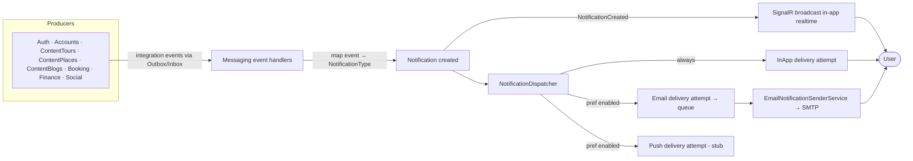
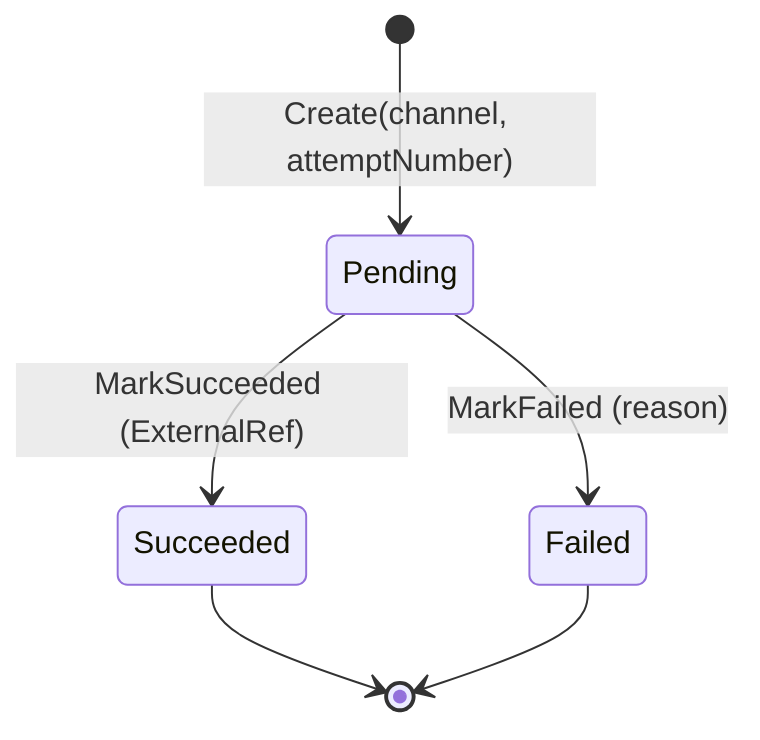
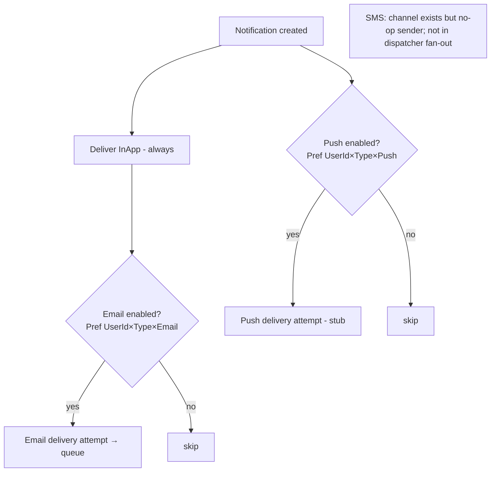
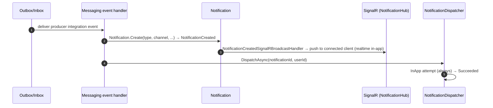
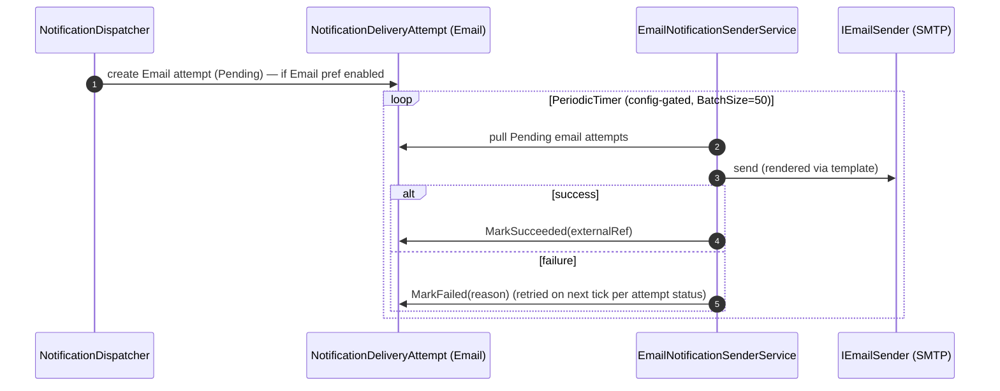

# Workflow 10 — Notifications Fan-out

The **Messaging / notification fan-out view**: how cross-module integration events become per-user
notifications, fan out across channels (in-app / email / push / sms), and progress through their
delivery lifecycle.

> **Scope.** Messaging-owned. This document covers **what happens after** a business event reaches
> Messaging. It **references, not duplicates** the producing workflows
> ([`04`](./04-provider-onboarding.md), [`05`](./05-tour-authoring-approval.md),
> [`06`](./06-booking-lifecycle.md), [`07`](./07-payment-refund.md),
> [`08`](./08-payout-commission.md), [`18`](./18-agency-roster.md)) and the delivery mechanism in
> [`17-outbox-inbox-eventing.md`](./17-outbox-inbox-eventing.md). Authorization model:
> [`../02-actors-and-roles.md`](../02-actors-and-roles.md).

---

## At a glance

| | |
|---|---|
| **Trigger** | Any consumed integration event (45 across 8 producer modules) → notification |
| **Owner module** | Messaging |
| **Cross-module reach (producers)** | Auth/Security, Accounts, ContentTours, ContentPlaces, ContentBlogs, Booking, Finance, Social |
| **Key entities** | `Notification`, `NotificationDeliveryAttempt`, `NotificationPreference`, `NotificationTemplate`, `DeviceToken` |
| **Key enums** | `NotificationType`, `NotificationChannel`, `NotificationPriority`, `NotificationDeliveryStatus` |
| **Channels** | InApp (always), Email (preference), Push (preference, stub), SMS (no-op) |

---

## Actors

| Actor | Role |
|---|---|
| **End User / Traveler** | Recipient; reads notifications, manages preferences & device tokens |
| **Provider / TourGuide / Creator / Agency** | Recipients of role-specific notifications |
| **Admin** | Manages notification templates; support-queue visibility |
| **System / Background** | `EmailNotificationSenderService`, `NotificationDigestService`, `ReadNotificationCleanupService`, `SlaMonitoringService` |
| **External** | SMTP (email); Push/SMS providers (stub / no-op) |

---

## Fan-out overview

---

## Notification model

| Entity | Role |
|---|---|
| **`Notification`** | The per-user notification (overall lifecycle): `UserId`, `Type`, `Channel` (origin), `Priority`, `Title`/`Body`/`Data`, `IsRead`/`ReadAt`, `SentAt`, `ExternalRef`, `FailureReason`, `EntityType`/`EntityId` |
| **`NotificationDeliveryAttempt`** | Child of `Notification` (FK `NotificationId`); **per-channel, per-attempt** delivery record: `Channel`, `AttemptNumber`, `Status` (`NotificationDeliveryStatus`), `AttemptedAt`/`CompletedAt`, `FailureReason`, `ExternalRef` |
| **`NotificationPreference`** | `(UserId × NotificationType × Channel) → IsEnabled` |
| **`NotificationTemplate`** | Channel/type template rendered via Mustache (`INotificationTemplateRenderer`) |
| **`DeviceToken`** | Registered push tokens per user |

- **`Notification` = overall lifecycle**; **`NotificationDeliveryAttempt` = per-channel delivery & retry lifecycle.**
- Enums: `NotificationChannel` (`InApp, Push, Email, Sms`); `NotificationPriority` (`Low, Medium, High, Critical`); `NotificationDeliveryStatus` (`Pending, Succeeded, Failed`); `NotificationType` (~50 values, several flagged **CRITICAL**: OtpDelivery, EmailVerification, PasswordChanged, Payment/Refund events, SecurityAlert, LoginFromNewDevice).

---

## Notification lifecycle state machines

**Notification (overall):**

```mermaid
stateDiagram-v2
    [*] --> Created: Create (NotificationCreated → SignalR broadcast)
    Created --> Sent: MarkSent (SentAt; NotificationDelivered)
    Created --> Failed: MarkFailed (FailureReason; NotificationFailed)
    Sent --> [*]
    Failed --> [*]
    note right of Created
        Read is an independent flag:
        MarkRead → IsRead/ReadAt (NotificationRead, domain-only)
    end note
```

**NotificationDeliveryAttempt (per channel):**

> All `Notification` transitions (`MarkSent`/`MarkRead`/`MarkFailed`) are idempotent. The
> per-channel attempt `Status` drives the email retry loop (see *Delivery, retry & failure*).

---

## Event → notification mapping

Messaging consumes **45 distinct integration events** across **42 handlers**, each mapping a
producer event to a `NotificationType` and creating a `Notification`. Grouped by producer (see the
owning workflow for the event's business meaning):

| Producer (workflow) | Example events → NotificationType |
|---|---|
| Auth / Security | `UserRegistered` → WelcomeEmail; OTP/security types |
| Accounts ([`04`](./04-provider-onboarding.md)) | `ProviderApproved/Rejected/Suspended/Reinstated/StatusChanged` |
| Agency ([`18`](./18-agency-roster.md)) | `AgencyAffiliationCreated` |
| ContentTours ([`05`](./05-tour-authoring-approval.md)) | `GuideApplicationApproved/Rejected`, `NewGuideApplication`, `TourProposalApproved/Rejected` |
| ContentPlaces | `BusinessApproved/Rejected/Suspended/Reinstated` |
| ContentBlogs | `Blog Published/Featured/Rejected/Removed/SubmittedForReview`; `Creator*` (application, tier, profile, invitation) |
| Booking ([`06`](./06-booking-lifecycle.md)) | `TourBookingConfirmed/Cancelled/Completed/Rejected`, `JoinRequestCreated/Approved/Rejected` |
| Finance ([`07`](./07-payment-refund.md), [`08`](./08-payout-commission.md)) | `PaymentCompleted/Failed`, `RefundInitiated/Failed`, `PayoutScheduled`, `InvoiceGenerated` |
| Social | `ReportResolved` |
| Support | `SupportTicketResolved` |

> **Known gap (inline):** `RefundCompleted` is **not** consumed — there is no refund-completion
> notification today (cross-ref [`07-payment-refund.md`](./07-payment-refund.md)).

---

## Channel fan-out & preferences

- **One `Notification` → many channels.** `NotificationDispatcher` delivers **InApp first
  (unconditionally)**, then fans out to **Email** and **Push**, each gated by
  `IsEnabledForUserAsync(userId, type, channel)`. Every channel delivery creates a
  `NotificationDeliveryAttempt`.
- **SMS** is a defined channel with a **no-op sender** (`NoOpSmsSender`) and is **not** in the
  dispatcher fan-out loop.

---

## In-app notification flow

> In-app realtime delivery is via **SignalR** (`NotificationHub`), triggered by the
> `NotificationCreated` domain event — see [`01-system-overview.md`](../01-system-overview.md).

---

## Email notification flow

---

## Push & SMS channels

- **Push** — `PushNotificationStrategy` is a **stub** (returns failure; no FCM/APNs). Push attempts
  are created when preference-enabled but do not deliver.
- **SMS** — `NoOpSmsSender`; the `Sms` channel exists in the enum but is **not** dispatched.

(See [`RISK-004`](../risks/risk-register.md).)

---

## Delivery, retry & failure behavior

- **In-app** delivers synchronously in the dispatcher (one attempt).
- **Email** is queued as a `Pending` `NotificationDeliveryAttempt` and drained by
  `EmailNotificationSenderService` in batches; a failed attempt's `Status=Failed` drives retry on
  subsequent ticks.
- **Permanent failure** sets the parent `Notification.FailureReason` via `MarkFailed` →
  `NotificationFailed`.
- Per-channel outcome is recorded on the attempt (`Succeeded`/`Failed`, `ExternalRef`,
  `FailureReason`, `AttemptNumber`).

---

## Notification templates

`NotificationTemplate` provides per-type/channel content rendered via Mustache
(`INotificationTemplateRenderer`). Admins manage templates (CRUD). Template selection maps from
`NotificationType` + channel.

---

## User notification preferences

- Granularity: **`UserId × NotificationType × Channel` → `IsEnabled`** (default enabled).
- The dispatcher consults preferences for **Email** and **Push** fan-out (InApp is unconditional).
- **Critical rule:** **critical notification types cannot be disabled** — `NotificationPreference`
  throws if a user attempts to disable a CRITICAL type (e.g. OtpDelivery, PasswordChanged,
  Payment/Refund, SecurityAlert).

---

## Side effects (events) & producers

**Emitted by Messaging:**

| Event | Type | Consumers |
|---|---|---|
| `NotificationCreatedDomainEvent` | domain only | SignalR broadcast handler (in-app realtime) |
| `NotificationReadDomainEvent` | domain only | (none) |
| `NotificationDeliveredIntegrationEvent` | integration | **none (emitted, currently unconsumed)** |
| `NotificationFailedIntegrationEvent` | integration | **none (emitted, currently unconsumed)** |

> **Known gap (inline):** `NotificationDelivered` / `NotificationFailed` integration events are
> emitted for parity/observability but have **no consumer** today.

**Consumed:** 45 producer integration events (see *Event → notification mapping*).

---

## Background jobs

| Service | Schedule | Effect |
|---|---|---|
| `EmailNotificationSenderService` | `PeriodicTimer`, config-gated, `BatchSize=50` | Drains Pending email delivery attempts → SMTP; marks Succeeded/Failed |
| `NotificationDigestService` | periodic | Batched digest notifications |
| `ReadNotificationCleanupService` | periodic | Prunes old read notifications |
| `SlaMonitoringService` | periodic | Support-ticket SLA (see `11-support-tickets.md`, planned) |

`Messaging.Infrastructure/BackgroundServices/`. Single-instance assumption — no distributed lock
([`RISK-007`](../risks/risk-register.md)).

---

## Authorization, ownership & admin visibility

| Action | Required |
|---|---|
| List / read / mark-read own notifications | Self-scoped (`UserId`) |
| Manage own preferences / device tokens | Self-scoped |
| Notification template CRUD | **Admin+** (`NotificationTemplate.*`) |

Notifications are owned by their recipient `UserId`; there is no cross-user notification read
surface. Admin visibility is template/support-queue oriented. Authoritative model:
[`../02-actors-and-roles.md`](../02-actors-and-roles.md).

---

## Failure / edge paths

| Path | Behavior |
|---|---|
| No channel strategy registered | Logged, channel skipped |
| Email delivery fails | Attempt `Failed`; retried on next sender tick |
| Push delivery | Stub returns failure (attempt `Failed`) |
| SMS | No-op (not dispatched) |
| Preference disabled (non-critical) | Email/Push skipped; InApp still delivered |
| Attempt to disable a critical type | Rejected (throws) |
| `RefundCompleted` event | No notification (known gap) |
| `NotificationDelivered`/`Failed` integration events | No consumer (known gap) |

---

## Code references

- `Messaging.Domain/Entities/{Notification,NotificationDeliveryAttempt,NotificationPreference,NotificationTemplate,DeviceToken}.cs`
- `Messaging.Domain/Enums/{NotificationType,NotificationChannel,NotificationPriority,NotificationDeliveryStatus}.cs`
- `Messaging.Infrastructure/Services/NotificationDispatcher.cs` (InApp-first + preference fan-out)
- `Messaging.Infrastructure/Services/{InAppNotificationStrategy,EmailNotificationStrategy,PushNotificationStrategy,SmtpEmailSender,NoOpSmsSender}.cs`
- `Messaging.Infrastructure/BackgroundServices/{EmailNotificationSenderService,NotificationDigestService,ReadNotificationCleanupService,SlaMonitoringService}.cs`
- `Messaging.Infrastructure/EventHandlers/` (42 producer-event handlers; `MessagingIntegrationConverters.cs`; `NotificationCreatedSignalRBroadcastHandler.cs`)
- `Messaging.Contracts/IntegrationEvents/{NotificationDelivered,NotificationFailed}IntegrationEvent.cs`

---

## Related risks

- [`RISK-004`](../risks/risk-register.md) — Push (stub) and SMS (no-op) channels not delivered.
- [`RISK-007`](../risks/risk-register.md) — Messaging background services single-instance (no distributed lock).

---

## Cross-references

- Producing workflows: [`04`](./04-provider-onboarding.md), [`05`](./05-tour-authoring-approval.md), [`06`](./06-booking-lifecycle.md), [`07`](./07-payment-refund.md), [`08`](./08-payout-commission.md), [`18`](./18-agency-roster.md)
- Eventing mechanism: [`17-outbox-inbox-eventing.md`](./17-outbox-inbox-eventing.md)
- Actors & authorization: [`../02-actors-and-roles.md`](../02-actors-and-roles.md)
- Risk register: [`../risks/risk-register.md`](../risks/risk-register.md)
