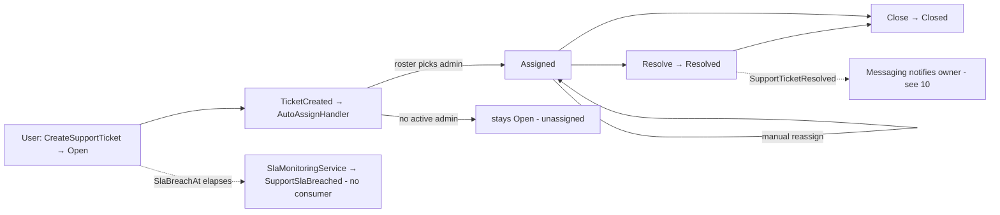
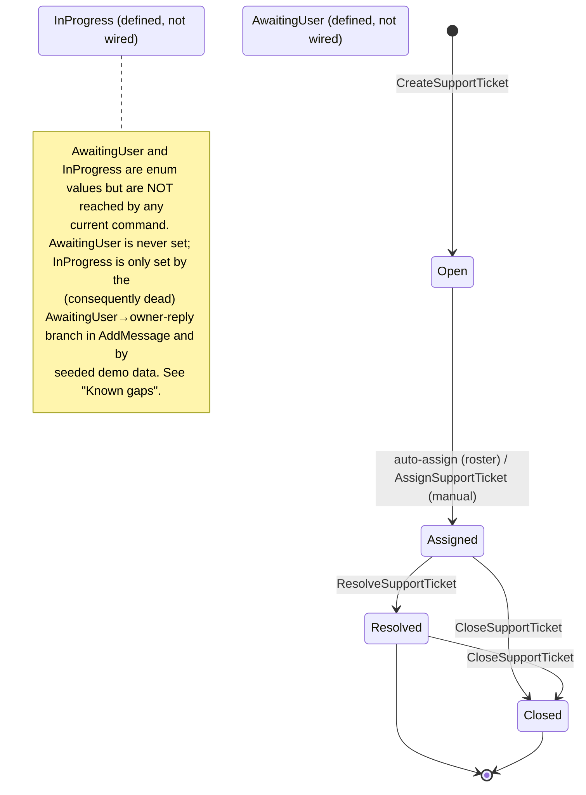

# Workflow 11 — Support Tickets

The **support ticket lifecycle view** (Messaging-owned): how a user opens a ticket, how it is
auto-assigned and worked, resolved, and closed, and how SLA breaches are detected.

> **Scope.** Messaging-owned ticket lifecycle. This document **references, not duplicates**: the
> user-facing notification delivery in [`10-notifications-fanout.md`](./10-notifications-fanout.md),
> the delivery mechanism in [`17-outbox-inbox-eventing.md`](./17-outbox-inbox-eventing.md), and the
> authorization model in [`../02-actors-and-roles.md`](../02-actors-and-roles.md).

---

## At a glance

| | |
|---|---|
| **Trigger** | `CreateSupportTicket` (authenticated user) |
| **Owner module** | Messaging |
| **Cross-module reach** | Analytics (ticket metrics), Notifications fan-out (`10`, resolution/assignment notices) |
| **Key entities** | `SupportTicket`, `TicketMessage`, `AdminAssignmentRoster` |
| **Key enums** | `TicketStatus`, `TicketCategory`, `TicketPriority` |
| **Background jobs** | `SlaMonitoringService` |

---

## Actors

| Actor | Role |
|---|---|
| **End User / Traveler** | Opens tickets, posts messages, closes own ticket |
| **Support Admin / Staff** | Assigned via roster; (re)assign, post messages (incl. internal), resolve |
| **Admin** | Support-queue visibility, manual reassignment |
| **System / Background** | `TicketCreatedAutoAssignHandler` (auto-assign), `SlaMonitoringService` (SLA breach detection) |

---

## Lifecycle overview



---

## `TicketStatus` state machine



> Source: `Messaging.Domain/Enums/TicketStatus.cs`
> (`Open=0, Assigned=1, InProgress=2, AwaitingUser=3, Resolved=4, Closed=5`).
> `Resolve` is permitted from any non-Closed/non-Resolved state; `Close` is idempotent and
> terminal. `Open` remains unassigned if the roster has no active admin.

---

## SLA model

At creation, priority is **derived from category**, and the SLA deadline (`SlaBreachAt`) is set from
that priority:

| Category | Derived priority | SLA duration |
|---|---|---|
| `PaymentProblem` | High | 4 hours |
| `BookingIssue`, `ProviderComplaint` | Medium | 12 hours |
| *(other categories)* | Low | 24 hours |

`SlaBreachAt = createdAt + SlaDuration(priority)`. Breaches are detected by `SlaMonitoringService`
(see *SLA monitoring*).

---

## Ticket lifecycle (create → auto-assign → resolve → close)

```mermaid
sequenceDiagram
    autonumber
    actor U as User
    participant API as Messaging API
    participant T as SupportTicket
    participant OB as Outbox/Inbox
    participant AA as TicketCreatedAutoAssignHandler
    participant R as AdminAssignmentRoster
    actor S as Support Staff

    U->>API: POST /support/tickets {category, subject, body}
    API->>T: Create → Open (priority + SlaBreachAt derived) → TicketCreated
    T->>OB: TicketCreated (→ Analytics)
    OB->>AA: handle TicketCreated
    AA->>R: pick next admin (IsActive && !IsOnLeave, OrderBy LastAssignedAt)
    alt active admin available
        AA->>T: AssignTo(admin, system, now) → Assigned → TicketAssigned (→ Analytics)
        AA->>R: RecordAssignment(now)
    else none available
        AA-->>AA: log; ticket stays Open (unassigned)
    end
    opt manual reassignment
        S->>API: POST /support/tickets/{id}/assign {adminUserId}
        API->>T: AssignTo(adminUserId, assignedBy, now) → TicketAssigned
    end
    U->>API: POST /support/tickets/{id}/messages (PostTicketMessage)
    API->>T: AddMessage(...) → TicketMessagePosted (domain-only)
    S->>API: POST /support/tickets/{id}/resolve {notes}
    API->>T: Resolve → Resolved → SupportTicketResolved
    OB->>OB: Messaging notifies owner (see 10)
    U->>API: POST /support/tickets/{id}/close
    API->>T: Close → Closed → TicketClosed (domain-only)
```

- **Auto-assignment** is automatic on creation: `TicketCreatedAutoAssignHandler` consumes
  `TicketCreated`, picks the least-recently-assigned active admin from `AdminAssignmentRoster`
  (round-robin via `OrderBy(LastAssignedAt)`), assigns the ticket (`assignedByUserId = system`),
  and records the assignment to advance the rotation.
- **Manual (re)assignment** is the `AssignSupportTicket` command with an explicit `AdminUserId`.

---

## Assignment & the admin roster

- `AdminAssignmentRoster` is the round-robin pool: `AdminUserId`, `FullName`, `LastAssignedAt`,
  `IsActive`, `IsOnLeave`.
- Selection: active + not-on-leave, ordered by `LastAssignedAt` (least recent first);
  `RecordAssignment(now)` advances the rotation.
- `SupportTicket.AssignTo` rejects assignment of an already `Resolved`/`Closed` ticket.

---

## Conversation (TicketMessage)

`PostTicketMessage` → `SupportTicket.AddMessage(authorUserId, body, isInternal, ...)` appends a
`TicketMessage` and raises `TicketMessagePosted` (domain-only). Staff messages may be **internal**
(`isInternal = true`), hidden from the user.

> The domain contains a branch that flips `AwaitingUser → InProgress` when the **owner** replies —
> but since no code ever sets `AwaitingUser`, this branch is currently unreachable (see *Known
> gaps*).

---

## SLA monitoring

`SlaMonitoringService` (Messaging background service, config-gated, `PeriodicTimer`) periodically
finds tickets whose `SlaBreachAt` has elapsed (and are not resolved/closed) and emits
`SupportSlaBreachedIntegrationEvent` per breach.

> **Known gap (inline):** `SupportSlaBreached` is **emitted but currently unconsumed** — no module
> reacts (no escalation, reassignment, or breach notification today).

---

## Support notifications

User-facing support notifications are produced by the **notification fan-out** workflow, not here:
- `SupportTicketResolved` is consumed by Messaging's notification handler to notify the ticket owner
  (delivery channels/preferences are owned by [`10-notifications-fanout.md`](./10-notifications-fanout.md)).
- Assignment/creation surface to Analytics; no dedicated user notification on `TicketAssigned`
  beyond what `10` defines.

---

## Side effects (integration events)

| Event | Type | Consumers |
|---|---|---|
| `TicketCreatedIntegrationEvent` | integration | Analytics (also drives `TicketCreatedAutoAssignHandler` via the domain event) |
| `TicketAssignedIntegrationEvent` | integration | Analytics |
| `SupportTicketResolvedIntegrationEvent` | integration | Messaging (notify owner — see `10`) |
| `SupportSlaBreachedIntegrationEvent` | integration | **none (emitted, currently unconsumed)** |
| `TicketMessagePostedDomainEvent` | **domain only** | (no integration event, no fan-out) |
| `SupportTicketClosedDomainEvent` | **domain only** | (no integration event, no fan-out) |

> Auto-assignment is driven by the `TicketCreated` **domain** event (`TicketCreatedAutoAssignHandler`),
> in addition to the `TicketCreated` **integration** event consumed by Analytics.

---

## Background jobs

| Service | Schedule | Effect |
|---|---|---|
| `SlaMonitoringService` | `PeriodicTimer`, config-gated | Detects `SlaBreachAt` breaches → emits `SupportSlaBreached` (no consumer today) |

`Messaging.Infrastructure/BackgroundServices/`. Single-instance assumption — no distributed lock
([`RISK-007`](../risks/risk-register.md)).

---

## Authorization, ownership & admin override

| Action | Required |
|---|---|
| Create ticket / post message on own / close own / read own | Self-scoped (`SupportTicket.*`; `CreatedByUserId`) |
| View any ticket / support queue | Admin scope, widened in-handler via `HasPermission("Permission.AdminSupportQueue.Read")` |
| Assign / reassign / resolve | **Admin / support staff** (`AdminSupportQueue.*`) |

Ticket ownership is by `CreatedByUserId`; admin/staff scope is widened in-handler (e.g.
`GetSupportTicketById(..., isAdmin)`). Internal staff messages are not shown to the user.
Authoritative model: [`../02-actors-and-roles.md`](../02-actors-and-roles.md). Permission catalog:
`Messaging.Contracts/Authorization/MessagingPermissionCatalog.cs`.

---

## Failure / edge paths

| Path | Behavior |
|---|---|
| No active admin in roster | Auto-assign no-op; ticket stays `Open` (unassigned) |
| Assign an already Resolved/Closed ticket | Rejected (`Ticket.AlreadyClosed`) |
| Resolve an already Resolved/Closed ticket | Rejected (`Ticket.AlreadyResolved` / `AlreadyClosed`) |
| Close an already Closed ticket | Idempotent no-op |
| SLA breach | `SupportSlaBreached` emitted but unconsumed (known gap) |
| `AwaitingUser` / `InProgress` | Defined enum values but unreachable by current commands (known gaps) |
| Ticket closed / message posted | Domain-only; no integration event / no cross-module fan-out |

---

## Known gaps

- **`AwaitingUser` is never set** by any command/domain method; the `AwaitingUser → InProgress`
  branch in `AddMessage` is therefore dead. **`InProgress`** is reached only by that dead branch and
  by seeded demo data. Both states are effectively unreachable in normal operation.
- **`SupportSlaBreached`** is emitted but **unconsumed** — SLA breaches trigger no escalation or
  notification today.
- **`TicketClosed` / `TicketMessagePosted`** are domain-only — closing a ticket or posting a message
  produces no integration event and no cross-module fan-out.

*(These are documented behaviors, not new risks. The single related risk is RISK-007 below.)*

---

## Code references

- `Messaging.Domain/Entities/{SupportTicket,TicketMessage,AdminAssignmentRoster}.cs`
- `Messaging.Domain/Enums/{TicketStatus,TicketCategory,TicketPriority}.cs`
- `Messaging.Application/Commands/{CreateSupportTicket,AssignSupportTicket,PostTicketMessage,ResolveSupportTicket,CloseSupportTicket}/`
- `Messaging.Infrastructure/EventHandlers/TicketCreatedAutoAssignHandler.cs`
- `Messaging.Infrastructure/BackgroundServices/SlaMonitoringService.cs`
- `Messaging.Domain/Repositories/IAdminAssignmentRosterRepository.cs`
- `Messaging.Presentation/Endpoints/.../SupportTicketEndpoints.cs`
- `Messaging.Contracts/Authorization/MessagingPermissionCatalog.cs`

---

## Related risks

- [`RISK-007`](../risks/risk-register.md) — `SlaMonitoringService` single-instance (`PeriodicTimer`, no distributed lock).

---

## Cross-references

- Notification delivery (resolution/assignment notices): [`10-notifications-fanout.md`](./10-notifications-fanout.md)
- Eventing mechanism: [`17-outbox-inbox-eventing.md`](./17-outbox-inbox-eventing.md)
- Actors & authorization: [`../02-actors-and-roles.md`](../02-actors-and-roles.md)
- Risk register: [`../risks/risk-register.md`](../risks/risk-register.md)
