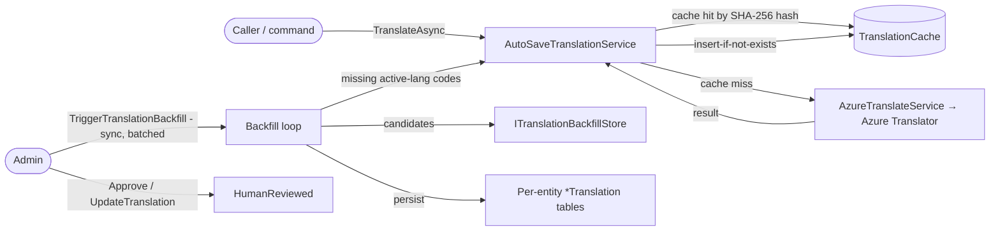
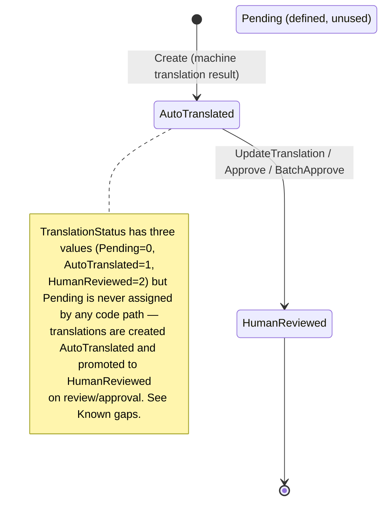
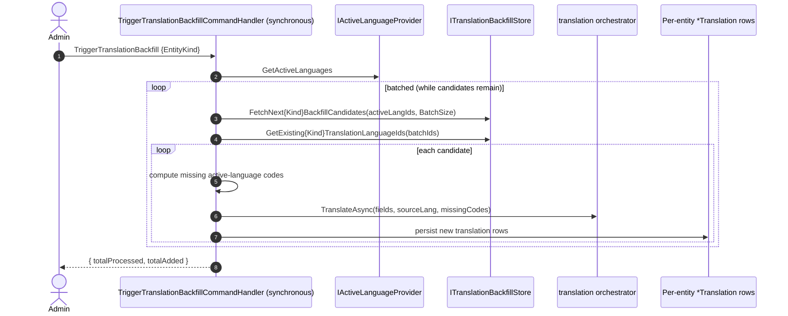

# Workflow 12 — Content Translation Pipeline

The **ContentCore translation pipeline view**: languages, the Azure-backed translate-and-cache
service, per-entity translation tables, admin-triggered backfill, and the human-review status model.

> **Scope.** ContentCore-owned translation pipeline. This document **references, not duplicates**
> the content lifecycles ([`05`](./05-tour-authoring-approval.md),
> [`15`](./15-blog-publishing-comments.md)), SEO ([`13`](./13-seo-sitemap-redirects.md)), the
> eventing mechanism ([`17`](./17-outbox-inbox-eventing.md)), and the authorization model
> ([`../02-actors-and-roles.md`](../02-actors-and-roles.md)).

---

## At a glance

| | |
|---|---|
| **Trigger** | On-demand translate commands; admin backfill; language lifecycle commands |
| **Owner module** | ContentCore (languages, cache, Azure service, backfill orchestration) |
| **Cross-module reach** | Per-entity translation tables live in the owning content modules |
| **Key entities** | `Language`, `TranslationCache`, 9 per-entity `*Translation` tables |
| **Key enum** | `TranslationStatus` (Pending, AutoTranslated, HumanReviewed) |
| **External** | Azure Translator (`AzureTranslateService`) — real; throws if unconfigured |
| **Background jobs** | None for translation (only `MediaProcessingBackgroundService`, out of scope) |

---

## Actors

| Actor | Role |
|---|---|
| **Admin / Translator** | Manage languages; trigger backfill; review / approve translations; on-demand translate |
| **Content authors** | Author source content (translations derive from it) |
| **System** | Translate-and-cache decorator (synchronous, on-demand); no background translation loop |
| **External** | Azure Translator API |

---

## Translation pipeline overview



---

## Language lifecycle

`Language` (`Code`, `Name`, `NativeName`, `IsRtl`, `IsActive`) is managed by admin commands:
`CreateLanguage`, `UpdateLanguage`, `ActivateLanguage`, `DeactivateLanguage`, `DeleteLanguage`.

- `ActivateLanguage` emits **`LanguageActivatedIntegrationEvent`**; `DeactivateLanguage` emits
  **`LanguageDeactivatedIntegrationEvent`**.
- Consumers of `LanguageActivated` (e.g. ContentTours, ContentPlaces, ContentSeo) react with
  source-language (`"en"`) handling / locale setup.
- **There is no `Language.IsDefault` flag** — see *Fallback & default language*.

---

## `TranslationStatus` model



> Source: `ContentCore.Domain/Enums/TranslationStatus.cs`. Both `TranslationCache` and the per-entity
> translation tables default to `AutoTranslated`; `UpdateTranslation` / `Approve` set
> `HumanReviewed`.

---

## Translate-and-cache flow

```mermaid
sequenceDiagram
    autonumber
    participant C as Caller
    participant Svc as ITranslationService (= AutoSaveTranslationService)
    participant Repo as ITranslationCacheRepository
    participant Az as AzureTranslateService

    C->>Svc: TranslateAsync(text, from, to)
    Svc->>Repo: FindCachedAsync(text, from, to)  [hash = SHA-256(from|to|text)]
    alt cache hit
        Repo-->>Svc: cached TranslatedText
    else cache miss
        Svc->>Az: TranslateAsync (Azure Translator HTTP)
        alt API failure
            Az-->>Svc: Result.Failure (propagated to caller)
        else success
            Az-->>Svc: TranslationResult
            Svc->>Repo: TryAddCacheEntryAsync (insert-if-not-exists; dedup-safe)
            Note over Svc,Repo: cache write is auxiliary — never fails the caller's primary transaction
        end
    end
    Svc-->>C: TranslationResult
```

- `ITranslationService` is registered as **`AutoSaveTranslationService` decorating
  `AzureTranslateService`** — every translation is **cache-first** and machine results are persisted
  (insert-if-not-exists) so the same text is never translated twice.
- `DetectLanguageAsync` / `GetSupportedLanguagesAsync` pass through to Azure.

---

## Batch translation

`BatchTranslateAsync` (and the `BatchTranslate` command) splits inputs into **cached** vs
**uncached**, calls Azure only for the uncached set, and persists each new result to the cache —
minimizing API calls. `BatchApproveTranslations` promotes many cache entries to `HumanReviewed`.

---

## Entity translation backfill



- Backfill is **admin-triggered, fully synchronous, and batched** — the command handler loops over
  candidate batches until none remain. **There is no queue and no background worker.**
- **`ITranslationBackfillStore` is a candidate-fetch data source only** (`FetchNext…Candidates` /
  `GetExisting…TranslationLanguageIds`); nothing drains it asynchronously.
- It is **`EntityKind`-routed** over ContentCore taxonomy (Tag / Specialization / Category); an
  unknown kind returns `Backfill.InvalidKind`.

---

## Per-entity translations & the translation cache

Translations are stored in **two distinct ways**:

**1. Per-entity translation tables (9)** — the localized fields for each content type:

| Module | Translation tables |
|---|---|
| ContentCore | `CategoryTranslation`, `TagTranslation`, `SpecializationTranslation` |
| ContentTours | `TourTranslation`, `TourPricingTierTranslation` |
| ContentPlaces | `PlaceTranslation`, `BusinessTranslation` |
| ContentBlogs | `BlogTranslation` |
| ContentSeo | `FaqItemTranslation` |

Each carries a `TranslationStatus` and is read at query time to serve localized content.

**2. `TranslationCache` (infrastructure)** — a **generic text-to-text dedup cache** keyed by
`SHA-256(from|to|text)`, populated by `AutoSaveTranslationService`. It is **not** the per-entity
localized content — it ensures the same raw text is never sent to the API twice. It stores
`OriginalText`/`TranslatedText`/`FromLanguage`/`ToLanguage`/`Confidence`/`Status` and optional
`EntityType`/`EntityId`/`FieldName` links.

---

## Human review & approval

- `UpdateTranslation` — edits a translation and sets `HumanReviewed`.
- `ApproveTranslation` / `BatchApproveTranslations` — promote machine translations to
  `HumanReviewed` (quality gate).
- Admin tooling (`TranslateText`, `BatchTranslate`) supports on-demand translation outside the
  automatic content-field path.

---

## Fallback & default language

- **English (`"en"`) is the source/default language by convention** — hard-coded as
  `SourceLanguageCode = "en"` in the per-module `LanguageActivatedIntegrationEventHandler`s and
  seeded as the English language. **There is no `Language.IsDefault` flag.**
- **Read-time fallback:** query handlers resolve the requested language and, when no specific
  translation is resolved, fall back to **default-language content** (e.g. ContentBlogs uses a
  `DefaultLanguageMarker = "default"`), ultimately serving the source ("en") content.
- Changing the source/default language would require code changes (see *Known gaps*).

---

## Side effects (integration events)

| Event | Direction | Notes |
|---|---|---|
| `LanguageActivatedIntegrationEvent` | **emitted** | consumed by content modules (locale setup / source-language handling) |
| `LanguageDeactivatedIntegrationEvent` | **emitted** | consumed by content modules |

- Translation results themselves are **not** integration events (the cache + per-entity tables are
  internal/read-model state).
- **Consumes:** none for the translation pipeline itself (translation is command-driven /
  decorator-cached). Activating a language may prompt admins to run a backfill for the new language.

---

## Background jobs

**None for translation.** Translation is on-demand (commands) plus the auto-save cache; backfill is
a synchronous admin command. ContentCore's only background service is
`MediaProcessingBackgroundService` (media processing — out of scope here).

---

## Authorization, ownership & admin override

| Action | Required |
|---|---|
| Language CRUD (create/update/activate/deactivate/delete) | **Admin+** (`Language.*`) |
| Translate / batch-translate / update / approve / batch-approve / backfill | **Admin+** (`Translation.*`) |
| Read localized content | Public (served via the owning entity's localized fields) |

Languages, the translation cache, and per-entity translations are platform/admin-level (no per-user
ownership). Authoritative model: [`../02-actors-and-roles.md`](../02-actors-and-roles.md). Permission
catalog: `ContentCore.Contracts/Authorization/ContentCorePermissionCatalog.cs`.

---

## Failure / edge paths

| Path | Behavior |
|---|---|
| Azure not configured | `AzureTranslateService` throws (`SubscriptionKey`/`Region` required) |
| Azure API failure | `Result.Failure` propagated to caller; nothing cached |
| Cache write conflict (duplicate hash) | `TryAddCacheEntryAsync` skips (insert-if-not-exists); caller unaffected |
| Repeated identical translation | Served from cache (no API call) |
| Backfill with unknown `EntityKind` | `Backfill.InvalidKind` |
| Missing translation at read time | Falls back to default-language ("en") content |
| Language deactivated | `LanguageDeactivated` emitted; content modules adjust |

---

## Known gaps

- **`TranslationStatus.Pending` is defined but unused** — translations are created `AutoTranslated`
  and promoted to `HumanReviewed`; no code path assigns `Pending`.
- **No configurable default language** — English (`"en"`) is the source/default by convention
  (hard-coded across handlers/seeding); there is no `Language.IsDefault` flag, so changing the
  source language requires code changes.
- **Backfill is scoped to ContentCore taxonomy** (Tag / Specialization / Category via
  `ITranslationBackfillStore`); other content types' translations are produced via the on-demand
  translate-and-cache path and their own flows rather than this backfill command.

*(These are documented behaviors, not new risks. The related risk is RISK-007 below; the Azure
Translator dependency is a real integration, not a NoOp stub.)*

---

## Code references

- `ContentCore.Domain/Entities/{Language,TranslationCache,Category,Tag,Specialization}.cs` (+ `CategoryTranslation`, `TagTranslation`, `SpecializationTranslation`)
- `ContentCore.Domain/Enums/TranslationStatus.cs`
- `ContentCore.Application/Commands/Language/{CreateLanguage,UpdateLanguage,ActivateLanguage,DeactivateLanguage,DeleteLanguage}/`
- `ContentCore.Application/Commands/Translation/{TranslateText,BatchTranslate,ApproveTranslation,BatchApproveTranslations,UpdateTranslation,TriggerTranslationBackfill}/`
- `ContentCore.Application/Interfaces/ITranslationBackfillStore.cs`
- `ContentCore.Infrastructure/Services/{AzureTranslateService,AutoSaveTranslationService}.cs`
- `ContentCore.Infrastructure/Persistence/TranslationBackfillStore.cs`
- Per-entity tables: `ContentTours.Domain/Entities/{TourTranslation,TourPricingTierTranslation}.cs`, `ContentPlaces.Domain/Entities/{PlaceTranslation,BusinessTranslation}.cs`, `ContentBlogs.Domain/Entities/BlogTranslation.cs`, `ContentSeo.Domain/Entities/FaqItemTranslation.cs`
- `ContentCore.Contracts/IntegrationEvents/{LanguageActivated,LanguageDeactivated}IntegrationEvent.cs`
- `ContentCore.Contracts/Authorization/ContentCorePermissionCatalog.cs`

---

## Related risks

- [`RISK-007`](../risks/risk-register.md) — `MediaProcessingBackgroundService` single-instance (ContentCore's only background job; translation has none).

---

## Cross-references

- Tour authoring (translatable source): [`05-tour-authoring-approval.md`](./05-tour-authoring-approval.md)
- Blog publishing (translatable source): [`15-blog-publishing-comments.md`](./15-blog-publishing-comments.md)
- SEO / FAQ (FaqItem translations; `LanguageActivated` consumer): [`13-seo-sitemap-redirects.md`](./13-seo-sitemap-redirects.md)
- Eventing mechanism: [`17-outbox-inbox-eventing.md`](./17-outbox-inbox-eventing.md)
- Actors & authorization: [`../02-actors-and-roles.md`](../02-actors-and-roles.md)
- Risk register: [`../risks/risk-register.md`](../risks/risk-register.md)
