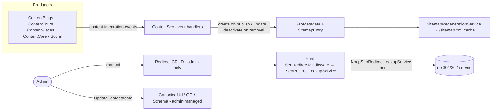
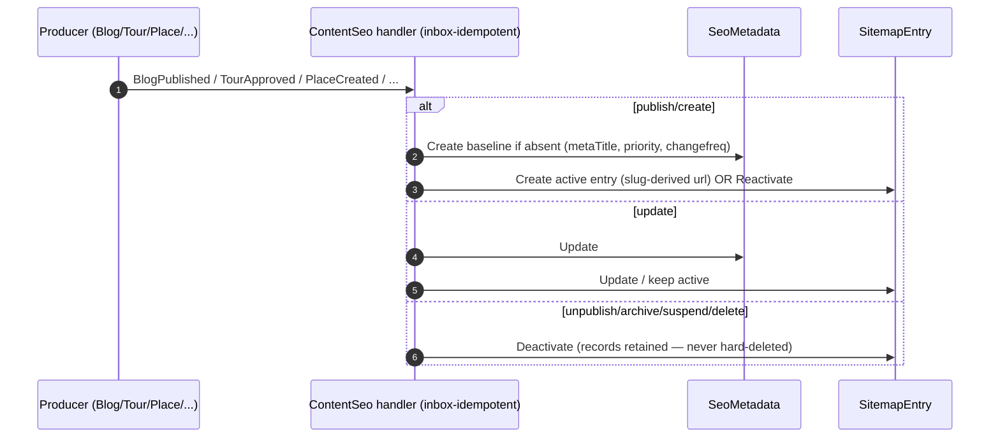
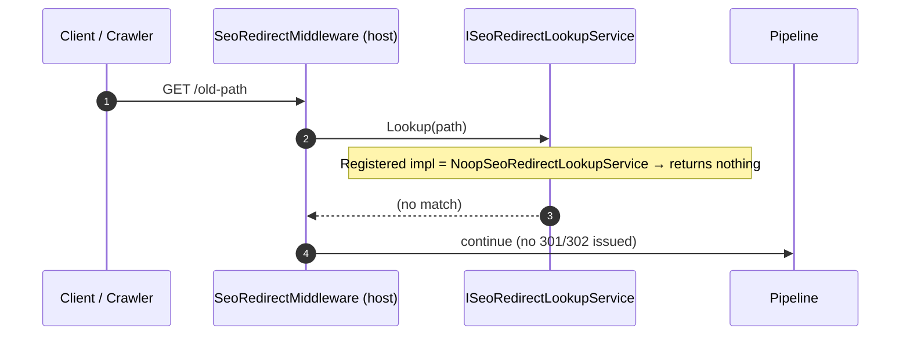

# Workflow 13 — SEO, Sitemap & Redirects

The **ContentSeo view**: SEO metadata projection, canonical URLs, sitemap generation, and the
redirect lifecycle (creation, chain-flattening, and HTTP resolution).

> **Scope.** ContentSeo-owned SEO/sitemap/redirect read model. This document **references, not
> duplicates** the content producers ([`05`](./05-tour-authoring-approval.md),
> [`15`](./15-blog-publishing-comments.md)), the parallel analytics read model
> ([`16`](./16-analytics-popularity.md)), and the eventing mechanism
> ([`17`](./17-outbox-inbox-eventing.md)). Authorization model:
> [`../02-actors-and-roles.md`](../02-actors-and-roles.md).

---

## At a glance

| | |
|---|---|
| **Trigger** | Content integration events (~21); admin SEO/redirect/sitemap commands |
| **Owner module** | ContentSeo (+ Host for redirect middleware & `/sitemap.xml`) |
| **Cross-module reach (producers)** | ContentBlogs, ContentTours, ContentPlaces, ContentCore, Social |
| **Key entities** | `SeoMetadata`, `SitemapEntry`, `Redirect`, `FaqItem`, `WeatherCache` |
| **Key enum** | `SeoEntityType` (Place, Tour, Business, Blog, TourGuide, Creator) |
| **Background jobs** | `SitemapRegenerationService`, `WeatherPreFetchService` |

---

## Actors

| Actor | Role |
|---|---|
| **Admin** | Manage SEO metadata, redirects, FAQ; trigger sitemap regeneration |
| **Public / Crawler** | Fetch `/sitemap.xml`, FAQ; (intended) follow redirects |
| **System / Background** | `SitemapRegenerationService`, `WeatherPreFetchService`, host `SeoRedirectMiddleware` |
| **Producing modules** | ContentBlogs, ContentTours, ContentPlaces, ContentCore, Social |

---

## SEO overview

---

## Domain model

| Entity | Role |
|---|---|
| `SeoMetadata` | Per-entity SEO: `MetaTitle`, `MetaDescription`, **`CanonicalUrl`** (admin), OG tags, `SchemaMarkup`, `SitemapPriority`, `SitemapChangeFrequency` (keyed by `SeoEntityType` + `EntityId`) |
| `SitemapEntry` | Sitemap row: `url` (slug-derived), `entityType`, `entityId`, `changeFrequency`, `priority`, `isActive`, `lastModified` |
| `Redirect` | `OldUrl → NewUrl`, `StatusCode` (301/302), `IsActive`, `HitCount` |
| `FaqItem` (+ translations) | Per-entity FAQ content |
| `WeatherCache` / `WeatherDailyBudget` | Cached weather (adjacent feature) |

`SeoEntityType`: `Place=0, Tour=1, Business=2, Blog=3, TourGuide=4, Creator=5`.

---

## SEO metadata & sitemap projection

ContentSeo consumes ~21 content events and projects them into `SeoMetadata` + `SitemapEntry`:

**Projection rules (verified):**

| Producer event(s) | Effect |
|---|---|
| `BlogPublished` (priority 0.6, monthly), `TourCreated/Approved`, `PlaceCreated`, `BusinessCreated`, `CreatorProfileActivated`, `TourGuideActivated` | **Create** baseline `SeoMetadata` (if absent) + **create/reactivate** `SitemapEntry` |
| `BlogUpdated`, `PlaceUpdated`, `CreatorProfileUpdated`, `TourGuideProfileUpdated` | **Update** metadata / sitemap entry |
| `BlogUnpublished`, `BlogArchived`, `BlogDeleted`, `TourSuspended`, `TourDeleted`, `PlaceDeleted`, `CreatorProfileDeactivated`, `TourGuideDeactivated` | **Deactivate** the `SitemapEntry` |
| `LanguageActivated` | locale handling |
| `ReviewAggregateUpdated` | handler exists but the event is **never emitted** — dead consumer (see *Known gaps*) |

> **SEO records are never hard-deleted.** Removal events **deactivate** sitemap entries (audit
> trail + analytics history). All handlers are inbox-idempotent.

---

## Canonical URLs & slugs

- **`CanonicalUrl` is admin-managed** — set and validated **only** through the
  `UpdateSeoMetadata` / `UpsertSeoMetadata` commands (`UpdateSitemapHints(priority, changefreq,
  canonicalUrl)`, regex-validated). Event-projection handlers do **not** set it; it defaults null.
- **Sitemap URLs are slug-derived** from the producing event (e.g. `/blog/{slug}`) and are
  independent of `CanonicalUrl`.
- These are **two separate sources of truth**: the slug-derived sitemap URL (event-projected) vs
  the canonical URL (admin-set on `SeoMetadata`).

---

## Sitemap generation & refresh

`SitemapRegenerationService` regenerates the sitemap **every 6 hours** (00:00, 06:00, 12:00, 18:00
UTC) via `RenderAndCacheAsync`, building the XML from active `SitemapEntry` rows and caching it. The
public **`/sitemap.xml`** is mapped at the host root (anonymous); an admin **regenerate** endpoint
triggers an on-demand rebuild.

> Search-engine notification (`ISearchConsolePinger`) is wired but **NoOp**
> (`NoOpSearchConsolePinger`) — see *Known gaps*.

---

## Redirect lifecycle

```mermaid
stateDiagram-v2
    [*] --> Active: CreateRedirect (admin; 301/302 only) → RedirectCreated
    Active --> Inactive: Deactivate → RedirectDeactivated
    Inactive --> Active: Activate
    Active --> Active: Update (NewUrl / StatusCode) → RedirectUpdated
    Active --> Active: RewriteTo (chain-flatten A→B→C ⇒ A→C) → RedirectChainFlattened
    Active --> [*]: soft-delete (IsDeleted)
```

> Source: `ContentSeo.Domain/Entities/Redirect.cs` — `OldUrl`, `NewUrl`, `StatusCode` (**301/302
> only**), `IsActive`, `HitCount`. `IncrementHit()` is fire-and-forget (no event). Chain-flattening
> rewrites A→B→C into A→C (`RewriteTo`, `RedirectChainFlattened`).

### Redirect creation

Redirects are **created manually by admins** via `CreateRedirectCommand` (validates 301/302,
flattens chains on creation). **There is no automatic redirect creation** — content slug changes do
**not** generate redirects (see *Known gaps*).

---

## Redirect resolution (HTTP)

The host wires `SeoRedirectMiddleware` (`app.UseMiddleware<SeoRedirectMiddleware>()`), but the
registered `ISeoRedirectLookupService` is **`NoopSeoRedirectLookupService`** — so **runtime redirect
resolution is inert**: the middleware runs but never serves a 301/302. The `Redirect` entity, admin
CRUD, and chain-flattening are real and persisted; only the HTTP-time *resolution* is stubbed (see
*Known gaps*).

---

## Blog / Tour / Place / Guide / Creator SEO integration

| Producer | Workflow | SEO effect |
|---|---|---|
| ContentBlogs (Blog, Creator profile) | [`15`](./15-blog-publishing-comments.md) | `SeoEntityType.Blog` / `Creator` metadata + sitemap |
| ContentTours (Tour, TourGuide) | [`05`](./05-tour-authoring-approval.md) | `SeoEntityType.Tour` / `TourGuide` metadata + sitemap |
| ContentPlaces (Place, Business) | — | `SeoEntityType.Place` / `Business` metadata + sitemap |
| ContentCore | — | `LanguageActivated` (locale) |

ContentSeo only **projects** these into SEO records — the content lifecycles themselves are owned by
the referenced workflows.

---

## Search indexing

Search-engine indexing notification is abstracted behind `ISearchConsolePinger`, registered as
**`NoOpSearchConsolePinger`** (logs only; pings nothing). No real Search Console / IndexNow
integration exists today (see *Known gaps*).

---

## Weather & FAQ (adjacent features)

ContentSeo also owns **FAQ** (`FaqItem` + translations; admin CRUD, public read; emits
`FaqItemChanged`) and **cached weather** (`WeatherCache` / `WeatherDailyBudget`, refreshed by
`WeatherPreFetchService`; emits `WeatherBudgetExhausted`). These are adjacent to the SEO core and
are documented only briefly here.

---

## Side effects (integration events)

**Emitted by ContentSeo — all currently unconsumed:**

| Event | Producer | Consumers |
|---|---|---|
| `SeoMetadataChangedIntegrationEvent` | ContentSeo | **none (emitted, unconsumed)** |
| `RedirectCreatedIntegrationEvent` | ContentSeo | **none (emitted, unconsumed)** |
| `RedirectChainFlattenedIntegrationEvent` | ContentSeo | **none (emitted, unconsumed)** |
| `FaqItemChangedIntegrationEvent` | ContentSeo | **none (emitted, unconsumed)** |
| `WeatherBudgetExhaustedIntegrationEvent` | ContentSeo | **none (emitted, unconsumed)** |

**Consumed (~21):** ContentBlogs `Blog{Published/Updated/Unpublished/Archived/Deleted}`,
`CreatorProfile{Activated/Deactivated/Updated}`; ContentTours `Tour{Created/Approved/Suspended/Deleted}`,
`TourGuide{Activated/Deactivated/ProfileUpdated}`; ContentPlaces `Place{Created/Updated/Deleted}`,
`BusinessCreated`; ContentCore `LanguageActivated`; Social `ReviewAggregateUpdated` (**dead — never
emitted**).

---

## Background jobs

| Service | Schedule | Effect |
|---|---|---|
| `SitemapRegenerationService` | every 6h (00/06/12/18 UTC) | Rebuilds + caches `/sitemap.xml` from active entries |
| `WeatherPreFetchService` | `PeriodicTimer` | Pre-fetches weather (provider is a NoOp stub) |

`ContentSeo.Infrastructure/BackgroundServices/`. Single-instance assumption — no distributed lock
([`RISK-007`](../risks/risk-register.md)).

---

## Authorization, ownership & admin override

| Action | Required |
|---|---|
| Read `/sitemap.xml`, FAQ, (intended) redirect following | Public / anonymous |
| SEO metadata CRUD | **Admin+** (`SeoMetadata.*`) |
| Redirect CRUD / sitemap regenerate | **Admin+** (`Redirect.*` / sitemap) |
| FAQ CRUD | **Admin+** (`FaqItem.*`) |

SEO records are platform-level (no per-user ownership). Authoritative model:
[`../02-actors-and-roles.md`](../02-actors-and-roles.md). Permission catalog:
`ContentSeo.Contracts/Authorization/ContentSeoPermissionCatalog.cs`.

---

## Failure / edge paths

| Path | Behavior |
|---|---|
| Content published | Baseline `SeoMetadata` + active `SitemapEntry` created |
| Content deleted/archived/suspended/unpublished | `SitemapEntry` **deactivated** (never hard-deleted) |
| Content slug changed | Sitemap URL updated; **no redirect auto-created** (known gap) |
| Redirect created with non-301/302 | Rejected (`StatusCode` must be 301/302) |
| Redirect chain A→B→C | Flattened to A→C on creation / `RewriteTo` |
| Inbound request to an old URL | Middleware runs but resolution is **NoOp** — no 301/302 served (known gap) |
| Sitemap regeneration | Rebuilt every 6h; search-engine ping is NoOp |

---

## Known gaps

- **Redirect HTTP resolution is inert** — the host `SeoRedirectMiddleware` is wired but
  `ISeoRedirectLookupService` resolves to **`NoopSeoRedirectLookupService`**, so no 301/302 is ever
  served at runtime ([`RISK-004`](../risks/risk-register.md)).
- **No automatic slug-change → redirect** — redirects are admin/manual only; a content slug change
  does not create a redirect, so old URLs are not auto-redirected.
- **Search Console pinger is NoOp** — `NoOpSearchConsolePinger` logs but performs no real
  search-engine notification; the weather provider is likewise a NoOp stub
  ([`RISK-004`](../risks/risk-register.md)).
- **All five ContentSeo emitted events are unconsumed** — `SeoMetadataChanged`, `RedirectCreated`,
  `RedirectChainFlattened`, `FaqItemChanged`, `WeatherBudgetExhausted` (observability/parity only).
- **`ReviewAggregateUpdated` consumer is dead** — the handler exists but the event is never emitted
  by Social (see [`14`](./14-reviews-moderation.md)).

*(These are documented behaviors; the related risks are RISK-004 and RISK-007 below.)*

---

## Code references

- `ContentSeo.Domain/Entities/{SeoMetadata,SitemapEntry,Redirect,FaqItem,WeatherCache,WeatherDailyBudget}.cs`
- `ContentSeo.Domain/Enums/SeoEntityType.cs`
- `ContentSeo.Application/Commands/{SeoMetadata,Redirect,Sitemap,FaqItem,Weather}/`
- `ContentSeo.Infrastructure/EventHandlers/` (~21 consumers + Redirect/SeoMetadata/Faq domain converters)
- `ContentSeo.Infrastructure/BackgroundServices/{SitemapRegenerationService,WeatherPreFetchService}.cs`
- `ContentSeo.Infrastructure/Services/NoOpSearchConsolePinger.cs`
- Host: `YallaJo.Api/Middleware/SeoRedirectMiddleware.cs`, `YallaJo.Api/Services/{ISeoRedirectLookupService,NoopSeoRedirectLookupService}.cs`
- `ContentSeo.Contracts/IntegrationEvents/{SeoMetadataChanged,RedirectCreated,RedirectChainFlattened,FaqItemChanged,WeatherBudgetExhausted}IntegrationEvent.cs`
- `ContentSeo.Contracts/Authorization/ContentSeoPermissionCatalog.cs`

---

## Related risks

- [`RISK-004`](../risks/risk-register.md) — NoOp services: `NoopSeoRedirectLookupService` (redirect resolution inert), `NoOpSearchConsolePinger` (no search-engine ping), weather provider stub.
- [`RISK-007`](../risks/risk-register.md) — ContentSeo background jobs single-instance (no distributed lock).

---

## Cross-references

- Tour authoring (SEO source events): [`05-tour-authoring-approval.md`](./05-tour-authoring-approval.md)
- Blog publishing (SEO source events): [`15-blog-publishing-comments.md`](./15-blog-publishing-comments.md)
- Analytics & popularity (parallel read model): [`16-analytics-popularity.md`](./16-analytics-popularity.md)
- Eventing mechanism: [`17-outbox-inbox-eventing.md`](./17-outbox-inbox-eventing.md)
- Actors & authorization: [`../02-actors-and-roles.md`](../02-actors-and-roles.md)
- Risk register: [`../risks/risk-register.md`](../risks/risk-register.md)
