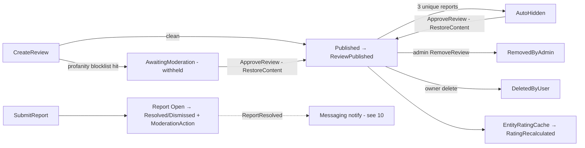

# Workflow 14 — Reviews & Moderation

The **Social reviews & moderation lifecycle view**: how travelers review tours/places/businesses,
how ratings aggregate, how reports drive auto-hiding, and how admins moderate (approve / remove /
restore, warn / ban).

> **Scope.** Social-owned reviews + moderation. This document **references, not duplicates**: tour
> authoring/approval ([`05`](./05-tour-authoring-approval.md)), notification delivery
> ([`10`](./10-notifications-fanout.md)), analytics/popularity ([`16`](./16-analytics-popularity.md)),
> the eventing mechanism ([`17`](./17-outbox-inbox-eventing.md)), and the authorization model
> ([`../02-actors-and-roles.md`](../02-actors-and-roles.md)).

---

## At a glance

| | |
|---|---|
| **Trigger** | `CreateReview` (one per target); report / moderation actions |
| **Owner module** | Social |
| **Cross-module reach** | Analytics (review/rating events), ContentPlaces (rating cache), ContentSeo (rating metadata), Messaging (report-resolved notification) |
| **Key entities** | `Review`, `ReviewReply`, `ReviewHelpfulVote`, `Report`, `ContentModerationLog`, `UserModerationRecord`, `EntityRatingCache`, `ProfanityBlocklistEntry` |
| **Key enums** | `ReviewStatus`, `ReportStatus`, `ModerationAction`, `ReviewDeletionSource`, `ReviewTargetType` |
| **Moderation inputs** | `BlocklistProfanityFilter` (active); `AlwaysSafeNsfwClassifier` (inert) |
| **Background jobs** | `RatingRecalculationService`, `OrphanedFavoritesCleanupService` |

---

## Actors

| Actor | Role |
|---|---|
| **End User / Traveler** | Creates/edits/deletes own review, replies, helpful-votes, submits reports |
| **Admin / Moderator** | Approves / removes / restores reviews, resolves reports, warns / bans / unbans users |
| **System / Background** | `RatingRecalculationService`, `OrphanedFavoritesCleanupService`; `BlocklistProfanityFilter` at create time |
| **Consuming modules** | Analytics, ContentPlaces, ContentSeo, Messaging |

---

## Reviews & moderation overview



---

## `ReviewStatus` state machine

```mermaid
stateDiagram-v2
    [*] --> Published: CreateReview (clean) → ReviewPublished
    [*] --> AwaitingModeration: CreateReview (profanity detected; no publish event)
    AwaitingModeration --> Published: ApproveReview (Restore → RestoreContent)
    Published --> AutoHidden: 3 unique reports (HideIfReportThresholdReached)
    AutoHidden --> Published: ApproveReview (Restore → RestoreContent)
    Published --> RemovedByAdmin: RemoveReview
    RemovedByAdmin --> Published: Restore (RestoreContent)
    Published --> DeletedByUser: owner DeleteReview
    AwaitingModeration --> DeletedByUser: owner DeleteReview
    DeletedByUser --> [*]
    RemovedByAdmin --> [*]
```



> Source: `Social.Domain/Enums/ReviewStatus.cs`
> (`Published=0, AwaitingModeration=1, AutoHidden=2, RemovedByAdmin=3, DeletedByUser=4`).
> A review created with a **profanity hit** starts in `AwaitingModeration`, is flagged
> (`ProfanityFlagged = true`), and **does not** raise `ReviewPublished` until approved.

---

## Review creation

```mermaid
sequenceDiagram
    autonumber
    actor U as User
    participant API as CreateReviewCommandHandler
    participant PF as IProfanityFilter (BlocklistProfanityFilter)
    participant Rv as Review
    participant OB as Outbox
    participant Rate as Rating recalculation

    U->>API: POST /social/reviews {targetType, targetId, rating, content}
    API->>API: validate rating + eligibility (one review per target; IsVerifiedBooking)
    API->>PF: ContainsProfanity(content/title)
    alt profanity detected
        API->>Rv: Review.Create(profanityDetected=true) → AwaitingModeration (flagged, NO publish event)
    else clean
        API->>Rv: Review.Create(profanityDetected=false) → Published → ReviewPublished
        Rv->>OB: ReviewPublished (→ Analytics)
        Rv->>Rate: triggers EntityRatingCache recalculation → RatingRecalculated
    end
    API-->>U: 200 (status reflects profanity outcome)
```

- **Profanity moderation is active** — `BlocklistProfanityFilter` checks content + title against
  `ProfanityBlocklistEntry` rows. A hit withholds the review in `AwaitingModeration` for moderator
  approval. (NSFW classification is inert — see *Known gaps*.)
- One review per (user, target); `IsVerifiedBooking` marks reviews backed by a completed booking.

---

## Review editing & deletion

- **Edit** (owner): `Review.Edit(...)` updates content/title/rating and stamps `LastEditedAt`.
- **Delete**: `Review.Delete(ReviewDeletionSource, ...)` — `User` (owner self-delete →
  `DeletedByUser`), `Admin` (→ via admin path), or `System`. Emits `ReviewDeleted` (→ Analytics)
  and triggers rating recalculation.

---

## Replies & helpful votes

- **Replies:** `AddReviewReply` / `UpdateReviewReply` / `DeleteReviewReply` (`ReviewReply`, authored
  and owner-scoped; admins may remove).
- **Helpful votes:** `AddHelpfulVote` / `RemoveHelpfulVote` (`ReviewHelpfulVote`; maintains
  `HelpfulVoteCount`). Self-scoped, one vote per user per review.

---

## Rating model & aggregation

- `EntityRatingCache` holds the aggregated average rating + count per target entity.
- Recalculation runs on review changes and via `RatingRecalculationService`, emitting
  **`RatingRecalculatedIntegrationEvent`** (→ Analytics, ContentPlaces) and updating the cache.
- Social is the **authoritative source of an entity's rating**; Analytics' *use* of ratings for
  popularity/trending is owned by [`16-analytics-popularity.md`](./16-analytics-popularity.md).

---

## Reporting & auto-hide

```mermaid
sequenceDiagram
    autonumber
    actor U as Reporter
    participant API as SubmitReportCommandHandler
    participant Rep as Report
    participant Rv as Review
    actor Adm as Admin

    U->>API: POST /social/reports {entityType, entityId, reason}
    API->>Rep: Report.Create → Open ; ReportSubmitted
    API->>Rv: IncrementReportCount
    alt unique reports >= AutoHideThreshold (3)
        API->>Rv: HideIfReportThresholdReached → AutoHidden
    end
    Adm->>API: ResolveReport(action) → Resolved / Dismissed
    Note over API: ModerationAction = Dismiss / RemoveContent / RestoreContent / WarnUser / BanUser / UnbanUser
    API-->>Adm: ReportResolved (→ Messaging notify, see 10)
```

> Source: `Social.Domain/Enums/ReportStatus.cs` (`Open → UnderReview → Resolved / Dismissed`).
> **Auto-hide threshold = 3** unique reports (`SubmitReportCommandHandler.AutoHideThreshold`).

---

## Admin moderation

| Action | Command | Effect |
|---|---|---|
| Approve / restore a withheld or hidden review | `ApproveReview` | `AwaitingModeration` / `AutoHidden` → `Published` via `Review.Restore` (logs `RestoreContent`); rejects already-Published or deleted reviews |
| Remove a review | `RemoveReview` | → `RemovedByAdmin` |
| Resolve a report | `ResolveReport` | `Resolved` / `Dismissed` + a `ModerationAction` |
| Warn / Ban / Unban a user | `WarnUser` / `BanUser` / `UnbanUser` | records a `UserModerationRecord` |

Every moderation decision writes a `ContentModerationLog` (`ModerationAction`,
moderator, target, notes). `ModerationAction`: `Dismiss, RemoveContent, WarnUser, BanUser,
RestoreContent, UnbanUser`.

---

## Visibility rules

| Status | Publicly visible |
|---|---|
| `Published` | ✅ |
| `AwaitingModeration`, `AutoHidden`, `RemovedByAdmin`, `DeletedByUser` | ❌ (withheld / hidden / removed) |

Only `Published` reviews surface in public listings and contribute to the public rating; the other
states are withheld pending moderation, hidden by reports, or removed/deleted.

---

## Side effects (integration events)

| Event | Producer | Consumers |
|---|---|---|
| `ReviewPublishedIntegrationEvent` | Social | Analytics |
| `ReviewDeletedIntegrationEvent` | Social | Analytics |
| `ReportSubmittedIntegrationEvent` | Social | — |
| `ReportResolvedIntegrationEvent` | Social | Messaging (notify — see `10`) |
| `RatingRecalculatedIntegrationEvent` | Social | Analytics, ContentPlaces |
| `FavoriteAddedIntegrationEvent` | Social | (favorites — adjacent) |
| `ReviewAggregateUpdatedIntegrationEvent` | **no producer** | ContentSeo (consumer exists but receives nothing — see *Known gaps*) |

- **Consumes:** Tour / Place / Business `Created/Updated/Deleted` (target snapshots);
  `TourBookingCompleted` (verified-booking eligibility).

---

## Background jobs

| Service | Schedule | Effect |
|---|---|---|
| `RatingRecalculationService` | `PeriodicTimer`, config-gated | Recomputes `EntityRatingCache`; emits `RatingRecalculated` |
| `OrphanedFavoritesCleanupService` | periodic | Prunes favorites whose target no longer exists |

`Social.Infrastructure/BackgroundServices/`. Single-instance assumption — no distributed lock
([`RISK-007`](../risks/risk-register.md)).

---

## Authorization, ownership & admin override

| Action | Required |
|---|---|
| Create / edit / delete own review, reply, helpful-vote, submit report | Self-scoped (`UserId`) |
| Approve / remove / restore review, resolve report, warn / ban / unban | **Admin+** (`AdminModerationQueue.*`) |

Reviews/replies/votes are owned by their author; admin moderation bypasses ownership and is logged
in `ContentModerationLog`. Authoritative model:
[`../02-actors-and-roles.md`](../02-actors-and-roles.md). Permission catalog:
`Social.Contracts/Authorization/SocialPermissionCatalog.cs`.

---

## Failure / edge paths

| Path | Behavior |
|---|---|
| Second review for same target | Rejected (one review per target) |
| Profanity blocklist hit | Review created `AwaitingModeration` (flagged, withheld) |
| 3rd unique report | Review `AutoHidden` |
| Approve an already-Published review | `Review.AlreadyPublished` (Conflict) |
| Approve a deleted/removed review | `Review.AlreadyDeleted` (Conflict) |
| Report resolution | `Resolved`/`Dismissed` + `ModerationAction`; `ReportResolved` notification |
| NSFW content | Not screened (classifier inert — see Known gaps) |

---

## Known gaps

- **`ReviewAggregateUpdatedIntegrationEvent` has no producer** — it is declared and **consumed by
  ContentSeo**, but **never emitted** by Social. Rating propagation actually flows via
  `RatingRecalculatedIntegrationEvent`; the ContentSeo `ReviewAggregateUpdated` handler is
  effectively dead.
- **NSFW classification is inert** — `INsfwClassifier` is registered as `AlwaysSafeNsfwClassifier`
  (always returns safe) and is **not wired into review creation**. Only the **profanity** filter
  (`BlocklistProfanityFilter`) actively moderates content.

*(These are documented behaviors, not new risks. The single related risk is RISK-007 below.)*

---

## Code references

- `Social.Domain/Entities/{Review,ReviewReply,ReviewHelpfulVote,Report,ContentModerationLog,UserModerationRecord,EntityRatingCache,ProfanityBlocklistEntry}.cs`
- `Social.Domain/Enums/{ReviewStatus,ReportStatus,ModerationAction,ReviewDeletionSource,ReviewTargetType,ReportReason,ReportableEntityType}.cs`
- `Social.Application/Commands/{CreateReview,EditReview,DeleteReview,ApproveReview,RemoveReview,AddReviewReply,UpdateReviewReply,DeleteReviewReply,AddHelpfulVote,RemoveHelpfulVote,SubmitReport,ResolveReport,WarnUser,BanUser,UnbanUser}/`
- `Social.Infrastructure/Services/{BlocklistProfanityFilter,AlwaysSafeNsfwClassifier}.cs`
- `Social.Infrastructure/BackgroundServices/{RatingRecalculationService,OrphanedFavoritesCleanupService}.cs`
- `Social.Infrastructure/EventHandlers/SocialIntegrationConverters.cs`
- `Social.Contracts/IntegrationEvents/{ReviewPublished,ReviewDeleted,ReportSubmitted,ReportResolved,RatingRecalculated,ReviewAggregateUpdated,FavoriteAdded}IntegrationEvent.cs`
- `Social.Contracts/Authorization/SocialPermissionCatalog.cs`

---

## Related risks

- [`RISK-007`](../risks/risk-register.md) — Social background jobs single-instance (`PeriodicTimer`, no distributed lock).

---

## Cross-references

- Tour authoring & approval (review targets): [`05-tour-authoring-approval.md`](./05-tour-authoring-approval.md)
- Notification delivery (report-resolved notices): [`10-notifications-fanout.md`](./10-notifications-fanout.md)
- Analytics & popularity (use of ratings): [`16-analytics-popularity.md`](./16-analytics-popularity.md)
- Eventing mechanism: [`17-outbox-inbox-eventing.md`](./17-outbox-inbox-eventing.md)
- Actors & authorization: [`../02-actors-and-roles.md`](../02-actors-and-roles.md)
- Risk register: [`../risks/risk-register.md`](../risks/risk-register.md)
