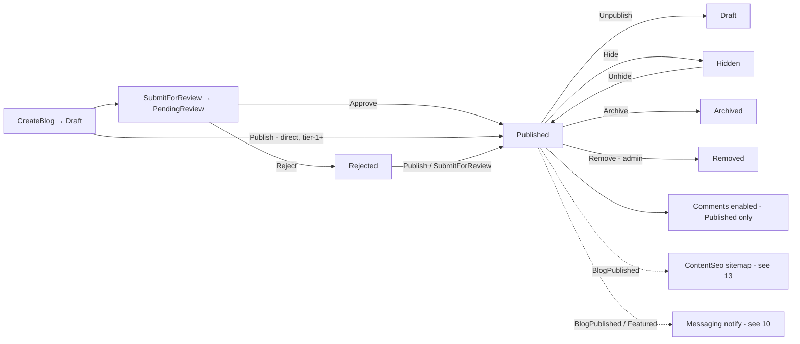
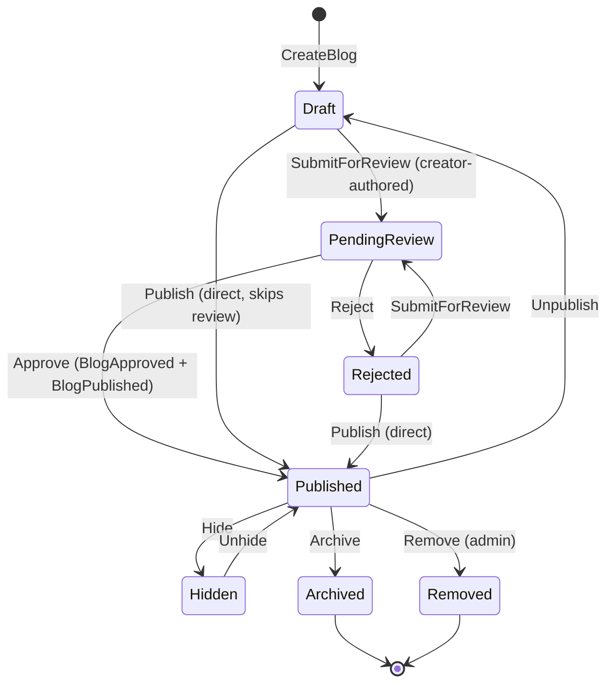
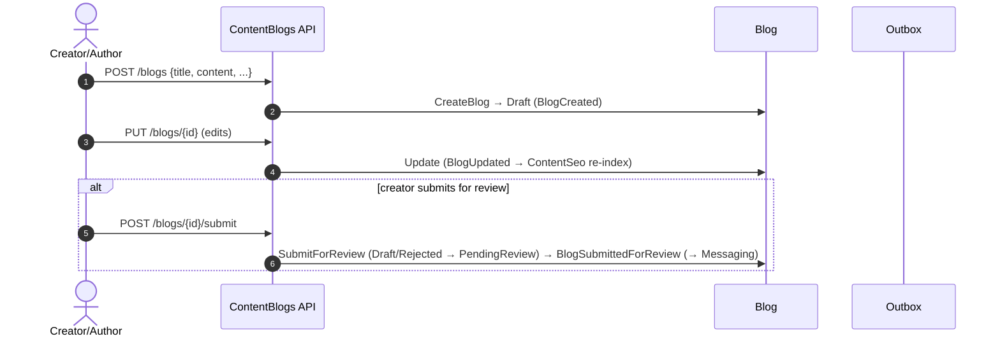

# Workflow 15 — Blog Publishing & Comments

The **ContentBlogs blog-publishing & comments lifecycle view**: blog draft → review → publish
moderation, comment threads + reactions, and view tracking.

> **Scope.** ContentBlogs-owned blogs + comments. This document **references, not duplicates**: SEO
> sitemap/redirects ([`13`](./13-seo-sitemap-redirects.md)), analytics/popularity
> ([`16`](./16-analytics-popularity.md)), notification delivery
> ([`10`](./10-notifications-fanout.md)), the eventing mechanism
> ([`17`](./17-outbox-inbox-eventing.md)), and the authorization model
> ([`../02-actors-and-roles.md`](../02-actors-and-roles.md)). The **Creator sub-domain**
> (applications, profiles, tiers, invitations) is out of scope here.

---

## At a glance

| | |
|---|---|
| **Trigger** | `CreateBlog` (author) → submit/publish moderation; `CreateBlogComment` (reader) |
| **Owner module** | ContentBlogs |
| **Cross-module reach** | ContentSeo (sitemap/SEO), Messaging (creator notifications) |
| **Key entities** | `Blog`, `BlogComment`, `BlogCommentReaction`, `BlogTour`, `BlogTranslation`, `BlogView` |
| **Key enums** | `BlogStatus`, `ReactionType`, `BlogViewerKind` |
| **Two axes** | `BlogStatus` (lifecycle) **and** `IsDeleted` (soft-delete) — independent |
| **Background jobs** | `BlogCleanupService` |

---

## Actors

| Actor | Role |
|---|---|
| **Creator / Author** | Create/edit/submit/delete own blog; link tours |
| **End User / Reader** | Comment, reply, react, view |
| **Admin / Moderator** | Approve / reject / publish / unpublish / feature / hide / archive / remove / restore; moderate comments |
| **System / Background** | `BlogCleanupService`; view counter (`IBlogViewCounter` + `IBlogViewerHashService`) |
| **Consuming modules** | ContentSeo, Messaging |

---

## Blog & comments overview



---

## `BlogStatus` state machine (lifecycle axis)



> Source: `ContentBlogs.Domain/Enums/BlogStatus.cs`
> (`Draft=0, PendingReview=1, Published=2, Rejected=3, Archived=4, Hidden=5, Removed=6`).
>
> - **`Approve`** = `PendingReview → Published` (moderation; emits `BlogApproved` + `BlogPublished`).
> - **`Publish`** = `Draft`/`Rejected → Published` — a **direct publish that skips PendingReview**
>   (admin / tier-1+; emits `BlogPublished` only).
> - **`Unpublish`** = `Published → Draft`.
> - `Archive` is valid from any status except `Archived`/`Removed`; `Remove` from any non-deleted
>   except `Removed`.

---

## Soft-delete axis (`IsDeleted`)

Soft-delete is **independent of `BlogStatus`**:

- `DeleteBlog` sets `IsDeleted = true` (the EF query filter then hides the row); the blog's
  `Status` is **unchanged**.
- **`Restore`** clears `IsDeleted`/`DeletedAt` (un-delete) and emits `BlogRestored`; it **does not
  change `Status`** — the blog returns at whatever lifecycle status it held before deletion.
- A blog therefore has two orthogonal dimensions: *lifecycle* (`BlogStatus`) and *existence*
  (`IsDeleted`).

---

## Authoring: create → submit



> `SubmitForReview` requires `AuthoredByCreatorId` (creator-authored). Admin/tier-1+ may instead use
> `Publish` to go straight to `Published`.

---

## Moderation

| Action | Command | Transition |
|---|---|---|
| Approve | `ApproveBlog` | PendingReview → Published |
| Reject | `RejectBlog` | PendingReview → Rejected |
| Publish (direct) | `PublishBlog` | Draft/Rejected → Published |
| Unpublish | `UnpublishBlog` | Published → Draft |
| Feature / Unfeature | `FeatureBlog` / `UnfeatureBlog` | flag on Published |
| Hide / Unhide | `HideBlog` / `UnhideBlog` | Published ↔ Hidden |
| Archive | `ArchiveBlog` | → Archived |
| Remove | `RemoveBlog` | → Removed |
| Soft-delete / Restore | `DeleteBlog` / `RestoreBlog` | `IsDeleted` toggle (status unchanged) |

Each emits the matching integration event (see *Side effects*). Owner edits/deletes are gated by
`IBlogAuthorHierarchyGuard`; admin actions bypass ownership.

---

## Edit & delete

- **Edit** (owner): `UpdateBlog` updates title/slug/content/meta; emits `BlogUpdated`.
- **Delete** (owner `Blog.DeleteOwn` / admin `Blog.DeleteAny`): soft-delete (`IsDeleted = true`),
  emits `BlogDeleted`; restorable via `RestoreBlog` within the retention window.

---

## Comment lifecycle

```mermaid
sequenceDiagram
    autonumber
    actor U as User
    participant API as ContentBlogs API
    participant Cm as BlogComment

    U->>API: POST /blogs/{id}/comments {content, parentCommentId?}
    API->>Cm: Create (requires Blog.Status == Published; thread via ParentCommentId) → BlogCommentCreated (domain-only)
    U->>API: POST /blogs/comments/{id}/reactions {Like|Helpful|Insightful}
    API->>Cm: AddOrReplaceReaction → BlogCommentReactionChanged (domain-only)
    U->>API: PUT /blogs/comments/{id} (owner edit)
    API->>Cm: Edit → BlogCommentUpdated (domain-only)
    U->>API: DELETE /blogs/comments/{id}
    API->>Cm: IBlogCommentAuthorizationGuard → Redact ("[deleted]") → BlogCommentDeleted (domain-only)
```

- Comments require the blog to be **`Published`** (creation throws otherwise) and support **threaded
  replies** (`ParentCommentId`).
- **Reactions:** `Like`, `Helpful`, `Insightful` (one per user per comment; maintains
  `LikeCount`/reaction counters).
- **Soft-delete (redaction):** `Redact()` replaces content with `[deleted]` (`IsContentRedacted`),
  keeping the row visible in threads; redacted comments cannot be reacted to.

---

## Comment moderation

Comment deletion/removal is authorized by **`IBlogCommentAuthorizationGuard`** (owner OR
admin/author-hierarchy) and results in **redaction** (`Redact()`), which is idempotent. There is no
separate comment status enum — a comment is either active or redacted.

---

## View tracking

`TrackBlogView` increments the blog `ViewCount` via `IBlogViewCounter`, de-duplicating viewers
through `IBlogViewerHashService` (a **hashed** viewer fingerprint — privacy-preserving, no raw PII)
and recording `BlogView` rows tagged `BlogViewerKind` (`Authenticated` / `Anonymous`). View
tracking is **ContentBlogs-internal**; it produces no integration event.

---

## Blog ↔ tour linking

`LinkBlogTours` / `UnlinkBlogFromTour` manage `BlogTour` associations and emit
`BlogTourLinked` / `BlogTourUnlinked`.

> **Known gap (inline):** `BlogTourLinked` / `BlogTourUnlinked` are **emitted but currently
> unconsumed** — no module reacts to blog↔tour link changes.

---

## Visibility rules

| Status / flag | Publicly visible |
|---|---|
| `Published` (and `IsDeleted == false`) | ✅ |
| `Draft`, `PendingReview`, `Rejected`, `Hidden`, `Archived`, `Removed` | ❌ |
| `IsDeleted == true` | ❌ (excluded by query filter) |

Only `Published`, non-deleted blogs surface publicly and accept comments.

---

## SEO interactions

`BlogPublished` / `BlogUpdated` / `BlogDeleted` are consumed by **ContentSeo** for sitemap and SEO
metadata maintenance. The SEO handling itself is owned by
[`13-seo-sitemap-redirects.md`](./13-seo-sitemap-redirects.md) — not detailed here.

---

## Analytics interactions

ContentBlogs maintains its **own** view/reaction counters internally; **Analytics does not consume
any blog integration event**. Blog popularity is therefore tracked in-module (view counting), not
via the Analytics popularity pipeline ([`16`](./16-analytics-popularity.md)).

---

## Side effects (integration events)

| Event | Producer | Consumers |
|---|---|---|
| `BlogCreatedIntegrationEvent` | ContentBlogs | ContentSeo / discovery |
| `BlogUpdatedIntegrationEvent` | ContentBlogs | ContentSeo |
| `BlogSubmittedForReviewIntegrationEvent` | ContentBlogs | Messaging |
| `BlogPublishedIntegrationEvent` | ContentBlogs | ContentSeo, Messaging |
| `BlogUnpublishedIntegrationEvent` | ContentBlogs | ContentSeo |
| `BlogRejectedIntegrationEvent` | ContentBlogs | Messaging |
| `BlogFeaturedIntegrationEvent` / `BlogUnfeaturedIntegrationEvent` | ContentBlogs | Messaging / discovery |
| `BlogArchivedIntegrationEvent` / `BlogRemovedIntegrationEvent` | ContentBlogs | Messaging / ContentSeo |
| `BlogRestoredIntegrationEvent` | ContentBlogs | ContentSeo |
| `BlogDeletedIntegrationEvent` | ContentBlogs | ContentSeo |
| `BlogTourLinkedIntegrationEvent` / `BlogTourUnlinkedIntegrationEvent` | ContentBlogs | **none (emitted, unconsumed)** |
| Blog **comment / reaction / view** domain events | ContentBlogs | **domain-only — no integration events, no external consumers** |

- **Consumes:** `LanguageActivated` (translations), `PlaceDeleted`, `TourDeleted` (link/place cleanup).

---

## Background jobs

| Service | Schedule | Effect |
|---|---|---|
| `BlogCleanupService` | **daily, 02:00 UTC** | **Hard-deletes** soft-deleted blogs where `DeletedAt + 60 days < now` (`RetentionDays = 60`); `Blog` rows only; **emits no events** (logs a count) |

`ContentBlogs.Infrastructure/BackgroundServices/`. Single-instance assumption — no distributed lock
([`RISK-007`](../risks/risk-register.md)).

> Creator sub-domain jobs (`CreatorTierPromotionService`, `CreatorStatsRollupService`,
> `CreatorInvitationCleanupService`, `ProfileCleanupService`) are **out of scope** for `15`.

---

## Authorization, ownership & admin override

| Action | Required |
|---|---|
| Create / edit / submit / delete own blog, link tours, comment / react / view | Self-scoped (`AuthorId` / `UserId`) |
| Delete own blog | `Blog.DeleteOwn` (author-hierarchy guard) |
| Approve / reject / publish / unpublish / feature / hide / archive / remove / restore | **Admin+** (`Blog.*`) |
| Delete any blog / moderate comments | `Blog.DeleteAny` / comment authorization guard |

Blogs are owned by `AuthorId`; comments by `UserId`. Edits/deletes are gated by
`IBlogAuthorHierarchyGuard` (blogs) and `IBlogCommentAuthorizationGuard` (comments). Authoritative
model: [`../02-actors-and-roles.md`](../02-actors-and-roles.md). Permission catalog:
`ContentBlogs.Contracts/Authorization/ContentBlogsPermissionCatalog.cs`.

---

## Failure / edge paths

| Path | Behavior |
|---|---|
| Submit a non-Draft/non-Rejected blog | `Blog.InvalidTransitionToReview` |
| Submit a non-creator-authored blog | `Blog.NotCreatorAuthored` |
| Approve/Reject a non-PendingReview blog | InvalidTransition |
| Publish a non-Draft/non-Rejected blog | InvalidTransition |
| Unpublish a non-Published blog | InvalidTransition |
| Comment on a non-Published blog | rejected (blog must be Published) |
| React to a redacted comment | rejected (`BlogComment.Redacted`) |
| Restore a non-deleted blog | InvalidTransition |
| Soft-deleted blog > 60 days | hard-deleted by `BlogCleanupService` |
| Blog↔tour link change | event emitted but unconsumed (known gap) |

---

## Known gaps

- **`BlogTourLinked` / `BlogTourUnlinked` are emitted but unconsumed** — no module reacts to
  blog↔tour link changes.
- **Comment / reaction / view events are domain-only** — no integration events and no external
  consumers (e.g. there is no comment-reply notification via Messaging; counters are maintained
  in-module).

*(These are documented behaviors, not new risks. The single related risk is RISK-007 below.)*

---

## Code references

- `ContentBlogs.Domain/Entities/{Blog,BlogComment,BlogCommentReaction,BlogTour,BlogTranslation,BlogView}.cs`
- `ContentBlogs.Domain/Enums/{BlogStatus,ReactionType,BlogViewerKind}.cs`
- `ContentBlogs.Domain/Events/{BlogCommentCreated,BlogCommentUpdated,BlogCommentDeleted,BlogCommentReactionChanged}DomainEvent.cs`
- `ContentBlogs.Application/Commands/Blog/{CreateBlog,UpdateBlog,SubmitBlogForReview,ApproveBlog,RejectBlog,PublishBlog,UnpublishBlog,FeatureBlog,UnfeatureBlog,HideBlog,UnhideBlog,ArchiveBlog,RemoveBlog,RestoreBlog,DeleteBlog,LinkBlogTours,UnlinkBlogFromTour,TrackBlogView}/`
- `ContentBlogs.Application/Commands/BlogComment/{CreateBlogComment,UpdateBlogComment,DeleteBlogComment,AddOrReplaceBlogCommentReaction,RemoveBlogCommentReaction}/`
- `ContentBlogs.Application/Authorization/{IBlogAuthorHierarchyGuard,IBlogCommentAuthorizationGuard}` ; `IBlogViewCounter`, `IBlogViewerHashService`
- `ContentBlogs.Infrastructure/BackgroundServices/BlogCleanupService.cs`
- `ContentBlogs.Contracts/IntegrationEvents/Blog*IntegrationEvent.cs`
- `ContentBlogs.Contracts/Authorization/ContentBlogsPermissionCatalog.cs`

---

## Related risks

- [`RISK-007`](../risks/risk-register.md) — `BlogCleanupService` single-instance (no distributed lock).

---

## Cross-references

- SEO sitemap & redirects (blog SEO handling): [`13-seo-sitemap-redirects.md`](./13-seo-sitemap-redirects.md)
- Analytics & popularity (no blog fan-out): [`16-analytics-popularity.md`](./16-analytics-popularity.md)
- Notification delivery (blog moderation notices): [`10-notifications-fanout.md`](./10-notifications-fanout.md)
- Eventing mechanism: [`17-outbox-inbox-eventing.md`](./17-outbox-inbox-eventing.md)
- Actors & authorization: [`../02-actors-and-roles.md`](../02-actors-and-roles.md)
- Risk register: [`../risks/risk-register.md`](../risks/risk-register.md)
