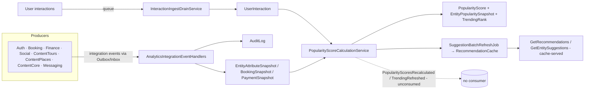
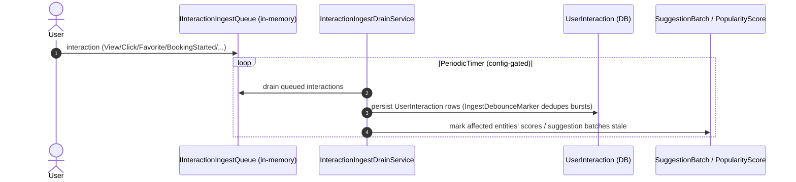
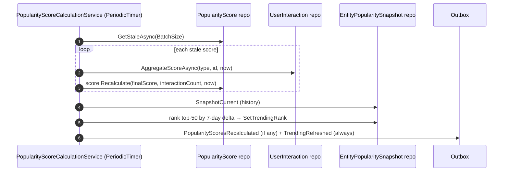

# Workflow 16 — Analytics & Popularity

The **Analytics read-model view**: how cross-module events project into snapshots and interactions,
how popularity/trending is scored, how recommendations and dashboards are built, and the GDPR /
audit / retention machinery.

> **Scope.** Analytics is a **read-model / projection module**. This document **references, not
> duplicates** the producing workflows
> ([`05`](./05-tour-authoring-approval.md), [`06`](./06-booking-lifecycle.md),
> [`07`](./07-payment-refund.md), [`08`](./08-payout-commission.md), [`09`](./09-invoicing.md),
> [`14`](./14-reviews-moderation.md), [`15`](./15-blog-publishing-comments.md)) and the eventing
> mechanism ([`17`](./17-outbox-inbox-eventing.md)). Authorization model:
> [`../02-actors-and-roles.md`](../02-actors-and-roles.md).

---

## At a glance

| | |
|---|---|
| **Trigger** | Cross-module integration events (~31) + user interactions |
| **Owner module** | Analytics |
| **Cross-module reach (producers)** | Auth, Booking, Finance, Social, ContentTours, ContentPlaces, ContentCore, Messaging |
| **Key entities** | `PopularityScore`, `EntityPopularitySnapshot`, `UserInteraction`, `EntityAttributeSnapshot`, `SuggestionBatch`, `RecommendationCache`, `DashboardCache`, `AuditLog`, `Experiment`, `BoostPackage`, `EditorialPin`, `GdprDeletionRequest`, `UserPreference`, `TripArc` |
| **Key enums** | `EntityType`, `InteractionType`, `TripStage`, `SuggestionContext` |
| **Background jobs** | 8 (see *Background jobs*) |

---

## Actors

| Actor | Role |
|---|---|
| **End User** | Generates interactions; reads recommendations; manages preferences / exclusions / GDPR erase |
| **Admin** | Boosts, editorial pins, seasonality, holidays, experiments, photogenic flags; audit export / redact |
| **System / Background** | The 8 analytics jobs (ingest, scoring, suggestions, metrics, profile, trip-stage, GDPR, digest) |
| **Producing modules** | Auth, Booking, Finance, Social, ContentTours, ContentPlaces, ContentCore, Messaging |

---

## Read-model overview

---

## Domain model

| Group | Entities |
|---|---|
| Popularity | `PopularityScore` (score + trending rank), `EntityPopularitySnapshot` (history for 7-day delta) |
| Interactions | `UserInteraction`, `IngestDebounceMarker` |
| Projections | `EntityAttributeSnapshot`, `BookingSnapshot`, `PaymentSnapshot` |
| Recommendations | `SuggestionBatch` (staleness), `RecommendationCache` (results), `SuggestionMetric` |
| Profiles | `UserPreference`, `UserPreferredCategory`, `TripArc`, `UserExcludedEntity` |
| Admin/curation | `BoostPackage`, `EditorialPin`, `SeasonalityRule`, `HolidayCalendar`, `Experiment`, `ExperimentAssignment`, `SponsoredClickEvent` |
| Governance | `AuditLog`, `GdprDeletionRequest` |
| Read models | `DashboardCache` |

Enums: `EntityType` (Tour/Place/Business/Category), `InteractionType` (View, Click, AddToFavorite,
BookingStarted, BookingCompleted, ReviewSubmitted, Bookmark, NotInterested, …), `TripStage`
(None/Pre/JustLanded/MidTrip/LastDay/PostTrip), `SuggestionContext`.

---

## Event → projection mapping

A single consumer file (`AnalyticsIntegrationEventHandlers.cs`) projects ~31 producer events:

| Producer (workflow) | Events → projection |
|---|---|
| Auth | `UserRegistered` → user profile seed |
| ContentTours ([`05`](./05-tour-authoring-approval.md)) | `TourCreated/Updated/Deleted` → `EntityAttributeSnapshot` (Tour); mark suggestion batches stale |
| ContentPlaces | `PlaceCreated/Updated/Deleted`, `BusinessCreated/...` → snapshots |
| Booking ([`06`](./06-booking-lifecycle.md)) | `TourBookingCreated/Confirmed/Cancelled/Completed` → `BookingSnapshot`; booking interactions |
| Finance ([`07`](./07-payment-refund.md), [`08`](./08-payout-commission.md), [`09`](./09-invoicing.md)) | `PaymentCompleted/Failed`, `RefundCompleted` → `PaymentSnapshot` |
| Social ([`14`](./14-reviews-moderation.md)) | `ReviewPublished/Deleted`, `RatingRecalculated` → rating snapshot inputs |
| Messaging | `TicketCreated/Assigned` → support metrics |

> Snapshots feed both the scoring inputs (rating multiplier) and recommendation candidate
> attributes. **Note:** ContentBlogs does **not** feed Analytics (blog view counting is in-module —
> see [`15`](./15-blog-publishing-comments.md)).

---

## Interaction ingest pipeline

---

## Popularity & trending scoring

**Scoring formula** (`UserInteractionRepository.AggregateScoreAsync`):

- **Window:** interactions in the **last 90 days**.
- **Weighted, recency-decayed sum** — each interaction contributes
  `weight × 0.5^(ageDays / 30)` (**30-day half-life decay**):

  | Interaction | Weight |
  |---|---|
  | View | 1 |
  | Click | 2 |
  | AddToFavorite | 5 |
  | BookingStarted | 8 |
  | BookingCompleted | 15 |
  | ReviewSubmitted | 4 |

- **Rating multiplier:** when the entity has **≥ 3 reviews** and an average rating, every component
  is multiplied by `1 + (AverageRating / 10)` (e.g. 4.5★ → ×1.45); otherwise ×1.
- `finalScore = (View + Click + Favorite + BookingStarted + BookingCompleted + Review) scores`.

**Trending:** per `EntityType` (Tour/Place/Business/Category), entities are ranked by their
**7-day score delta** (current score minus the score ~7 days ago from `EntityPopularitySnapshot`;
new entities seed delta = `score × 0.5`); the **top 50** receive a `TrendingRank`.

> Only **stale** scores are recomputed each cycle (`GetStaleAsync(BatchSize)`).

---

## Recommendations & suggestions

Recommendations are **batch-generated and cache-served**:

- **`SuggestionBatch`** — a staleness tracker per `(SourceKind, SourceId, Context)`. Event handlers
  `MarkStale()` batches when the underlying entities change.
- **`SuggestionBatchRefreshJob`** (`PeriodicTimer`, `RefreshIntervalMinutes`) — finds stale batches
  and sends `RefreshSuggestionBatchCommand`; the handler rebuilds the **`RecommendationCache`** rows
  (the computed recommendation results).
- **Reads are cache-served:** `GetEntitySuggestionsQuery` (by batch) and `GetRecommendationsQuery`
  (by user) read `RecommendationCache`, layered with HybridCache (`ICacheableQuery`, ~5–30 min).
  There is **no per-request on-demand generation** — generation is the batch job's responsibility.
- **`SuggestionMetric`** records suggestion performance (impressions/clicks); `MetricsAggregationJob`
  rolls these into summary tables.

---

## Dashboards & metrics

`DashboardCache` holds pre-computed dashboard read models; `MetricsAggregationJob` aggregates
`SuggestionMetric` (and related) into summary tables for admin dashboards.

---

## Trip-stage & user-profile derivation

- `UserProfileUpdateJob` maintains `UserPreference` / `UserPreferredCategory` from interaction
  history.
- `TripStageUpdateJob` derives a user's `TripArc` / `TripStage`
  (`None/Pre/JustLanded/MidTrip/LastDay/PostTrip`) to contextualize recommendations.

---

## Admin analytics operations

Admin-only curation + governance (dedicated permissions per the post-P0/P1 model):

| Area | Entity | Permission |
|---|---|---|
| Boost packages / CPC bids | `BoostPackage` / `SponsoredClickEvent` | `BoostPackage.{Create,Delete}` |
| Editorial pins | `EditorialPin` | `EditorialPin.{Create,Delete}` |
| Seasonality rules | `SeasonalityRule` | `SeasonalityRule.{Create,Delete}` |
| Holiday calendar | `HolidayCalendar` | `HolidayCalendar.Create` |
| Photogenic flag | `EntityAttributeSnapshot` | `Photogenic.Update` |
| A/B experiments | `Experiment` | `Experiment.{Create,Update,Delete}` |
| Audit log | `AuditLog` | `AuditLog.Read` / `AuditLog.Export` / `AuditLog.Redact` |

### Experiment lifecycle (string status — no enum)

`Experiment.Status` is a plain **`string`** (no `ExperimentStatus` enum); methods drive the
transitions:

| From | Method | To |
|---|---|---|
| (created) | — | `Draft` |
| `Draft` / `Paused` | `Start()` | `Running` |
| `Running` | `Pause()` | `Paused` |
| `Running` | `Complete()` | `Completed` |

`IsRunning(now)` is true only when `Status == "Running"` **and** `now ∈ [StartsAt, ExpiresAt)`.
Status values are convention-based strings (see *Known gaps*).

---

## GDPR & retention

- **`GdprCleanupJob`** processes `GdprDeletionRequest`s and **anonymizes / hard-deletes user
  interactions older than 365 days** (`ExecuteDeleteAsync`).
- **`UserExcludedEntity`** lets users exclude entities from their recommendations.
- Users may erase their own analytics data (GDPR self-erase).

---

## Side effects (integration events)

**Emitted by Analytics — all currently unconsumed:**

| Event | Producer | Consumers |
|---|---|---|
| `PopularityScoresRecalculatedIntegrationEvent` | Analytics | **none (emitted, unconsumed)** |
| `TrendingRefreshedIntegrationEvent` | Analytics | **none (emitted, unconsumed)** |
| `AuditLogEntryRedactedIntegrationEvent` | Analytics | **none (emitted, unconsumed)** |

**Consumed:** ~31 producer integration events (see *Event → projection mapping*), all handled in
`AnalyticsIntegrationEventHandlers.cs`.

> The three emitted events are produced for observability/parity but have **no consumer** today —
> see *Known gaps*.

---

## Background jobs

| Service | Schedule | Effect |
|---|---|---|
| `InteractionIngestDrainService` | `PeriodicTimer` | Drains queued interactions → `UserInteraction`; marks scores/batches stale |
| `PopularityScoreCalculationService` | `PeriodicTimer` | Recomputes stale `PopularityScore`s; refreshes trending; emits events |
| `SuggestionBatchRefreshJob` | `PeriodicTimer` | Rebuilds stale `RecommendationCache` via `RefreshSuggestionBatchCommand` |
| `MetricsAggregationJob` | `PeriodicTimer` | Aggregates `SuggestionMetric` into summary tables |
| `UserProfileUpdateJob` | `PeriodicTimer` | Updates `UserPreference` / `UserPreferredCategory` |
| `TripStageUpdateJob` | `PeriodicTimer` | Derives `TripArc` / `TripStage` |
| `GdprCleanupJob` | `PeriodicTimer` | Processes deletion requests; anonymizes interactions > 365 days |
| `EmailDigestBackgroundService` | weekly, **Mondays 09:00 UTC** | Email digest for users with `MarketingConsent.EmailDigest` |

`Analytics.Infrastructure/BackgroundServices/`. Single-instance assumption — no distributed lock
([`RISK-007`](../risks/risk-register.md)).

---

## Authorization, ownership & admin override

| Action | Required |
|---|---|
| Read own recommendations / manage own preferences / exclusions / GDPR erase | Self-scoped (`UserId`) |
| Boosts / pins / seasonality / holidays / experiments / photogenic | **Admin+** (dedicated permissions above) |
| Audit log read / export / redact | **Admin+** (`AuditLog.*`) |

Interactions, preferences, and recommendations are per-user. Authoritative model:
[`../02-actors-and-roles.md`](../02-actors-and-roles.md). Permission catalog:
`Analytics.Contracts/Authorization/AnalyticsPermissionCatalog.cs`.

---

## Failure / edge paths

| Path | Behavior |
|---|---|
| No stale scores | Scoring cycle recomputes nothing; still refreshes trending |
| New entity (no 7-day history) | Trending delta seeded at `score × 0.5` |
| Entity with < 3 reviews | Rating multiplier = 1 (no boost) |
| Recommendation cache empty | Read returns empty until the batch job rebuilds it |
| Interaction burst | `IngestDebounceMarker` dedupes |
| GDPR request | Interactions anonymized/hard-deleted; > 365-day interactions purged |
| Analytics emitted events | No consumer reacts (known gap) |

---

## Known gaps

- **All three Analytics emitted events are unconsumed** — `PopularityScoresRecalculated`,
  `TrendingRefreshed`, and `AuditLogEntryRedacted` are produced for observability/parity but no
  module consumes them.
- **`Experiment.Status` is an unconstrained `string`** (no `ExperimentStatus` enum); values
  (`Draft/Running/Paused/Completed`) are convention-based.
- **Phase-2 projection TODOs:** `EntityAttributeSnapshot.CategoryIdsJson` is not populated
  (ContentCore does not emit `EntityCategoryAssigned`); `TourUpdatedIntegrationEvent` does not carry
  full snapshot fields — both are deferred enrichments.

*(These are documented behaviors, not new risks. The single related risk is RISK-007 below.)*

---

## Code references

- `Analytics.Domain/Entities/{PopularityScore,EntityPopularitySnapshot,UserInteraction,EntityAttributeSnapshot,BookingSnapshot,PaymentSnapshot,SuggestionBatch,RecommendationCache,SuggestionMetric,DashboardCache,AuditLog,Experiment,BoostPackage,EditorialPin,SeasonalityRule,HolidayCalendar,GdprDeletionRequest,UserPreference,TripArc,UserExcludedEntity,IngestDebounceMarker}.cs`
- `Analytics.Domain/Enums/{EntityType,InteractionType,TripStage,SuggestionContext}.cs`
- `Analytics.Infrastructure/EventHandlers/AnalyticsIntegrationEventHandlers.cs` (~31 consumers)
- `Analytics.Infrastructure/Repositories/UserInteractionRepository.cs` (`AggregateScoreAsync` — weights + decay + rating multiplier)
- `Analytics.Infrastructure/BackgroundServices/{InteractionIngestDrainService,PopularityScoreCalculationService,SuggestionBatchRefreshJob,MetricsAggregationJob,UserProfileUpdateJob,TripStageUpdateJob,GdprCleanupJob,EmailDigestBackgroundService}.cs`
- `Analytics.Application/Commands/RefreshSuggestionBatch/`
- `Analytics.Application/Queries/{GetRecommendations,GetEntitySuggestions,GetSuggestionBatches}/`
- `Analytics.Contracts/IntegrationEvents/{PopularityScoresRecalculated,TrendingRefreshed,AuditLogEntryRedacted}IntegrationEvent.cs`
- `Analytics.Contracts/Authorization/AnalyticsPermissionCatalog.cs`

---

## Related risks

- [`RISK-007`](../risks/risk-register.md) — the 8 Analytics background jobs are single-instance (`PeriodicTimer`, no distributed lock).

---

## Cross-references

- Producing workflows: [`05`](./05-tour-authoring-approval.md), [`06`](./06-booking-lifecycle.md), [`07`](./07-payment-refund.md), [`08`](./08-payout-commission.md), [`09`](./09-invoicing.md), [`14`](./14-reviews-moderation.md), [`15`](./15-blog-publishing-comments.md)
- Eventing mechanism: [`17-outbox-inbox-eventing.md`](./17-outbox-inbox-eventing.md)
- Actors & authorization: [`../02-actors-and-roles.md`](../02-actors-and-roles.md)
- Risk register: [`../risks/risk-register.md`](../risks/risk-register.md)
