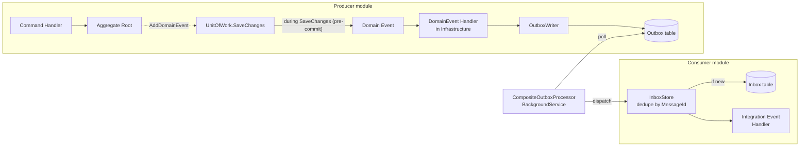
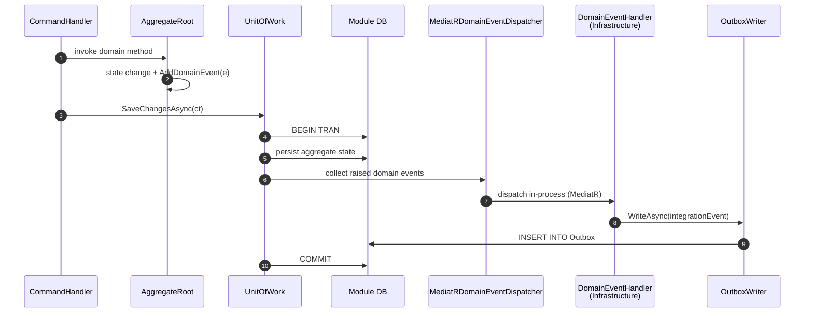
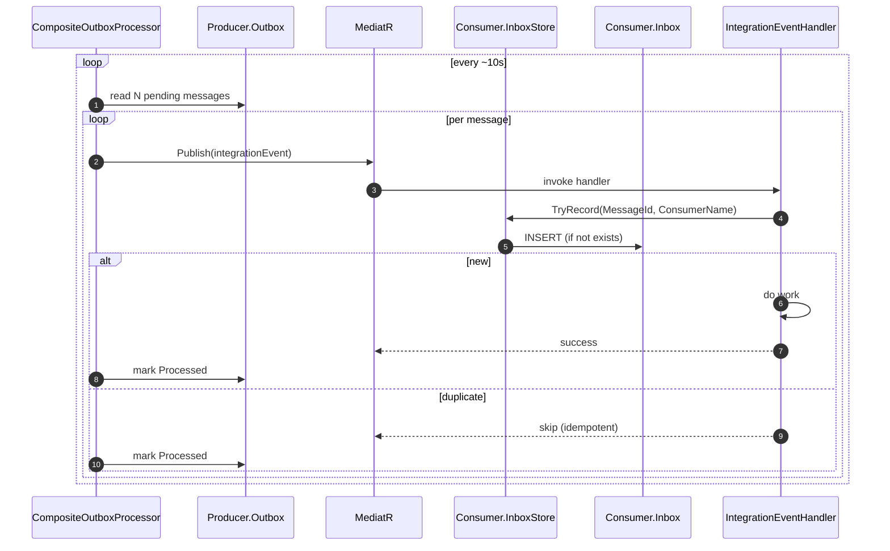
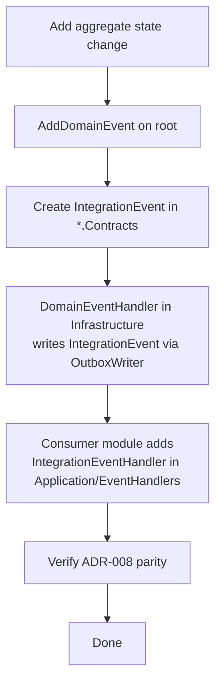

# Workflow 17 — Outbox / Inbox Eventing (Mechanism)

How **integration events** flow between modules. This is the underlying mechanism every other workflow relies on.

> **Looking for the catalog of who publishes / who consumes each event?**
> → [`../eventing/integration-event-catalog.md`](../eventing/integration-event-catalog.md) (Phase A: Booking, Finance, Identity).
>
> ADRs: [`ADR-002`](../../Agents/decisions/ADR-002-cqrs-mediatr.md) · [`ADR-006`](../../Agents/decisions/ADR-006-per-module-uow-delegate.md) · [`ADR-007`](../../Agents/decisions/ADR-007-aggregate-root-gated-dispatch.md) · [`ADR-008`](../../Agents/decisions/ADR-008-integration-event-registry-parity.md)

---

## Two kinds of events

| | Domain Event | Integration Event |
|---|---|---|
| **Scope** | Within the owning module | Across module boundaries |
| **Defined in** | `{Module}.Domain/Events` | `{Module}.Contracts/IntegrationEvents` |
| **Raised by** | Aggregate root (`AddDomainEvent`) | Domain event handler in `{Module}.Infrastructure/EventHandlers` writes to outbox |
| **Dispatched by** | `MediatRDomainEventDispatcher` immediately after `SaveChanges` | `CompositeOutboxProcessor` (BackgroundService, every ~10s) |
| **Delivery guarantee** | In-process, transactional | At-least-once (outbox+inbox dedupe) |
| **Allowed direction** | Same module only | Any module |

ADR-007: only **aggregate roots** can emit domain events.

---

## End-to-end mechanism



Key invariants:

1. `OutboxWriter` writes the integration event **in the same DB transaction** as the aggregate change (transactional outbox).
2. `CompositeOutboxProcessor` polls **every module's outbox** and dispatches via MediatR.
3. `InboxStore` records the `MessageId` per consumer to enforce **idempotency** (at-least-once → effectively once).
4. Dispatch failures stay in outbox; persistent failures go to **dead-letter** (`OutboxDeadLetterDto`, `OutboxDeadLetterHealthCheck`).

---

## Sequence — producer side



Result: aggregate state + outbox row are **atomic**. If commit fails, no event leaks.

---

## Sequence — consumer side



If a handler throws, the outbox row stays `Pending` with incremented attempt count; eventually moved to dead-letter per `OutboxConstants` and `OutboxMessageStatus`.

---

## Where things live

| Concern | File |
|---|---|
| Composite processor (drives all modules) | `YallaJo.SharedKernel.Infrastructure/BackgroundJobs/CompositeOutboxProcessor.cs` |
| Per-tick processor logic | `YallaJo.SharedKernel.Infrastructure/BackgroundJobs/OutboxProcessor.cs` |
| Outbox housekeeping | `YallaJo.SharedKernel.Infrastructure/BackgroundJobs/OutboxCleanupBackgroundService.cs`, `Outbox/OutboxCleaner.cs` |
| Outbox model | `YallaJo.SharedKernel.Infrastructure/Outbox/OutboxMessage.cs`, `OutboxMessageStatus.cs` |
| Domain event dispatch | `YallaJo.SharedKernel.Infrastructure/Events/MediatRDomainEventDispatcher.cs` |
| Inbox dedupe | `YallaJo.SharedKernel.Infrastructure/Inbox/EfInboxStore.cs`, `Inbox/InboxMessage.cs` |
| Per-module outbox writer | `{Module}.Infrastructure/Persistence/*OutboxWriter.cs` (or `Repositories/*OutboxWriter.cs`) |
| Per-module inbox store | `{Module}.Infrastructure/Persistence/*InboxStore.cs` |
| Activity / tracing | `YallaJo.SharedKernel.Infrastructure/BackgroundJobs/OutboxActivitySource.cs`, `Outbox/TraceContextHelpers.cs` |
| Health | `YallaJo.Api/HealthChecks/OutboxDeadLetterHealthCheck.cs` |

---

## ADR-008 — Integration event registry parity

Every integration event must be **declared in `{Module}.Contracts`** and have **matching producer + consumer registrations** so it is impossible to publish an event with no contract or to consume a contract that no producer publishes.

```mermaid
flowchart LR
    A[*.Contracts/IntegrationEvents/*.cs<br/>(type)] --> B[Producer module<br/>emits via OutboxWriter]
    A --> C[Consumer module<br/>registers IntegrationEventHandler]
    B -. ADR-008 parity check .- C
```

See coverage tracking: [`../../Agents/event-handler-coverage-report.md`](../../Agents/event-handler-coverage-report.md).

---

## Failure modes

| Failure | Effect | Mitigation |
|---|---|---|
| Producer commit fails before outbox insert | Nothing leaks (atomic) | Transactional outbox |
| Outbox processor crash mid-batch | Unprocessed rows remain `Pending` | Re-polled next tick |
| Consumer handler throws | Outbox row retried (attempt++), eventually dead-letter | Health check + manual replay |
| Duplicate delivery | Inbox dedupe skips it | `EfInboxStore` |
| Multiple API instances both poll | **No distributed lock today** — risk of double-processing if scaled out | See [`RISK-007`](../risks/risk-register.md) |
| Schema drift between Contracts and handlers | Caught by ADR-008 parity registry / build | Registry parity tests |

---

## Operational signals

- **Trace**: `OutboxActivitySource` emits Activities per dispatch; correlate via `TraceContextHelpers` (parent trace stored on outbox row).
- **Health**: `/health` includes `OutboxDeadLetterHealthCheck`.
- **Cleanup**: `OutboxCleanupBackgroundService` prunes processed rows per `OutboxCleanupOptions`.

---

## When you write a new feature



Templates: [`../../Agents/templates/`](../../Agents/templates/) (`DomainEvent.cs.template`, etc.).

---

## Related workflows

- [`01-user-onboarding.md`](./01-user-onboarding.md) — concrete producer/consumer hops (`UserRegistered`, `EmailVerified`).
- [`06-booking-lifecycle.md`](./06-booking-lifecycle.md) — heaviest user of cross-module events.

## Related risks

- [`RISK-007`](../risks/risk-register.md) — Background jobs use `PeriodicTimer` with no distributed lock.
- [`RISK-011`](../risks/risk-register.md) — Outbox hardening in progress (`outbox-hardening-implementation-plan.md`).
- [`RISK-005`](../risks/risk-register.md) — Integration event parity gaps tracked in `event-handler-coverage-report.md`.
