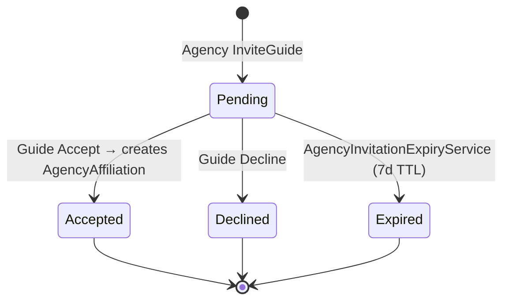
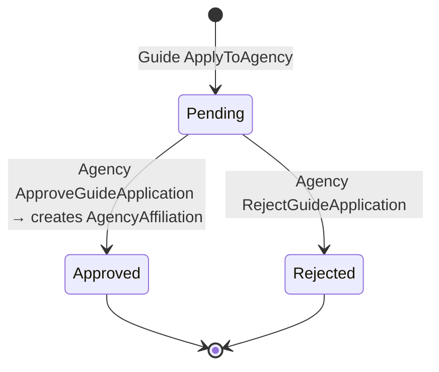
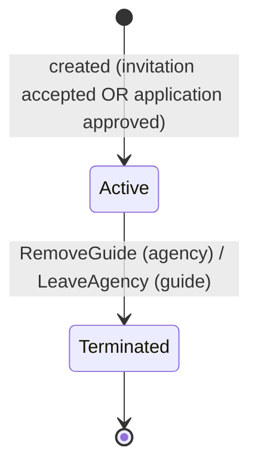
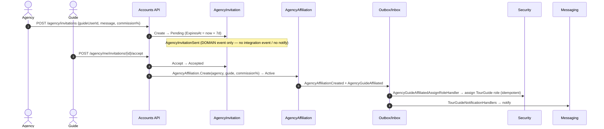
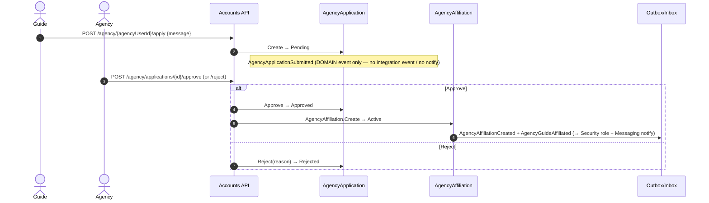

# Workflow 18 — Agency Roster & Affiliations

The **Agency membership & affiliation view** (Accounts-owned): how an Agency builds its guide
roster — via **invitations** it sends and **applications** guides submit — and how affiliations
form, grant the TourGuide role, and terminate.

> **Scope.** Roster building between an **Agency** and **IndependentGuides**. This document
> **references, not duplicates**: agency-becomes-a-provider onboarding in
> [`04-provider-onboarding.md`](./04-provider-onboarding.md), the payout commission split in
> [`08-payout-commission.md`](./08-payout-commission.md), booking detail in
> [`06-booking-lifecycle.md`](./06-booking-lifecycle.md), and the authorization model in
> [`../02-actors-and-roles.md`](../02-actors-and-roles.md).
>
> **Boundary:** `04` = *Agency becomes a provider*; **`18` = *Guide joins an agency*.**

---

## At a glance

| | |
|---|---|
| **Trigger** | Agency `InviteGuide`, or Guide `ApplyToAgency` |
| **Owner module** | Accounts |
| **Cross-module reach** | Security (TourGuide role on affiliation), Messaging (affiliation notification); Finance (`08` — affiliation commission split, reference only) |
| **Key entities** | `AgencyInvitation`, `AgencyApplication`, `AgencyAffiliation` |
| **Key enums** | `AgencyInvitationStatus`, `AgencyApplicationStatus`, `AgencyAffiliationStatus` |
| **Config** | `AgencyInvitationExpiryService` (`Enabled`, `PollInterval`); invitation TTL = 7 days |

---

## Actors

| Actor | Role |
|---|---|
| **Agency** | Provider of type `Agency`; sends invitations, approves/rejects applications, removes guides |
| **IndependentGuide** | Accepts/declines invitations, applies to agencies, leaves an agency |
| **Admin** | Platform-wide override |
| **System / Background** | `AgencyInvitationExpiryService` |
| **Consuming modules** | Security (role), Messaging (notify) |

---

## Roster overview (two affiliation entry paths)

```mermaid
flowchart LR
    subgraph Invitation path (agency-initiated)
        Inv[Agency: InviteGuide → AgencyInvitation Pending]
        Inv -->|Guide Accept| AffA[AgencyAffiliation Active]
        Inv -->|Guide Decline| Dec[Declined]
        Inv -->|7d TTL| Exp[Expired]
    end
    subgraph Application path (guide-initiated)
        App[Guide: ApplyToAgency → AgencyApplication Pending]
        App -->|Agency Approve| AffB[AgencyAffiliation Active]
        App -->|Agency Reject| Rej[Rejected]
    end
    AffA -.->|fan-out| RoleNotify[Security: TourGuide role · Messaging: notify]
    AffB -.->|fan-out| RoleNotify
    AffA -->|RemoveGuide / LeaveAgency| Term[Terminated]
    AffB -->|RemoveGuide / LeaveAgency| Term
```

---

## `AgencyInvitationStatus` state machine



> Source: `Accounts.Domain/Enums/AgencyInvitationStatus.cs` (`Pending, Accepted, Declined, Expired`).
> Transitions are guarded to `Pending` only (idempotent no-op otherwise). TTL `ExpiryDays = 7`.

## `AgencyApplicationStatus` state machine



> Source: `Accounts.Domain/Enums/AgencyApplicationStatus.cs` (`Pending, Approved, Rejected`).

## `AgencyAffiliationStatus` state machine



> Source: `Accounts.Domain/Enums/AgencyAffiliationStatus.cs` (`Active, Terminated`). An affiliation
> carries `CommissionPercentage`, `JoinedAt`, and `TerminatedAt/By/Reason`.

---

## Invitation flow (agency-initiated)



> Decline (`/decline`) → `Declined`; no response within 7 days → `Expired` (see *Invitation expiry*).

---

## Application flow (guide-initiated)



---

## Affiliation creation fan-out

The `AgencyAffiliationCreated` domain event (raised by **both** entry paths) is converted into
**two** integration events:
- `AgencyAffiliationCreatedIntegrationEvent` → **Messaging** notifies the guide.
- `AgencyGuideAffiliatedIntegrationEvent` → **Security** (`AgencyGuideAffiliatedAssignRoleHandler`)
  assigns the **TourGuide** role to the guide (idempotent).

> The affiliation's `CommissionPercentage` is later used by the payout split — see
> [`08-payout-commission.md`](./08-payout-commission.md). It is **not** recomputed here.

---

## Guide removal & affiliation termination

```mermaid
sequenceDiagram
    autonumber
    actor Actor as Agency (RemoveGuide) / Guide (LeaveAgency)
    participant API as Accounts API
    participant Aff as AgencyAffiliation
    participant OB as Outbox/Inbox

    Actor->>API: DELETE /agency/guides/{guideUserId}  (or)  DELETE /guides/me/agency
    API->>Aff: Terminate(byUserId, reason) → Terminated
    Aff->>OB: AgencyAffiliationTerminated
    Note over OB: emitted but currently UNCONSUMED — no module reacts
```

- **`RemoveGuide`** (agency-owner action) and **`LeaveAgency`** (guide self-action) both call
  `AgencyAffiliation.Terminate`.

> ### ⚠️ Known Limitation — "Affiliation Terminated ≠ TourGuide Role Removed"
> `AgencyAffiliationTerminatedIntegrationEvent` is **emitted but currently unconsumed** — no module
> handles it. In particular, **Security does not revoke the TourGuide role** when an affiliation is
> terminated, and Finance does not adjust commission on termination. A guide removed from (or
> leaving) an agency **retains their TourGuide role**. This mirrors the role-retention behavior
> documented for provider suspension in [`04-provider-onboarding.md`](./04-provider-onboarding.md).
> The authoritative role/permission model is in [`../02-actors-and-roles.md`](../02-actors-and-roles.md).

---

## Invitation expiry

`AgencyInvitationExpiryService` (Accounts background service, config-gated, `PeriodicTimer`)
fetches pending invitations past their 7-day TTL (`GetPendingExpiredAsync`) and calls
`invitation.Expire()` (→ `Expired`).

> **No integration event is emitted on expiry** — expiry is a local status change only; neither the
> agency nor the guide receives an expiry notification.

---

## Agency membership status (vs Provider status/role)

- `18` owns the **guide ↔ agency** relationship (`AgencyAffiliationStatus`: Active/Terminated) and
  the guide's **TourGuide role** grant on affiliation.
- The **agency itself** is a provider (`ProviderType.Agency`) whose onboarding status/role lifecycle
  is owned by [`04-provider-onboarding.md`](./04-provider-onboarding.md) — not repeated here.

---

## Side effects (integration events)

| Event | Producer | Notable consumers |
|---|---|---|
| `AgencyAffiliationCreatedIntegrationEvent` | Accounts | Messaging (`TourGuideNotificationHandlers`) |
| `AgencyGuideAffiliatedIntegrationEvent` | Accounts | Security (`AgencyGuideAffiliatedAssignRoleHandler` → TourGuide role) |
| `AgencyAffiliationTerminatedIntegrationEvent` | Accounts | **none (emitted, currently unconsumed)** |
| `AgencyInvitationSentDomainEvent` | Accounts (domain) | **domain-only — no integration event / no notify** |
| `AgencyApplicationSubmittedDomainEvent` | Accounts (domain) | **domain-only — no integration event / no notify** |

---

## Background jobs

| Service | Schedule | Effect |
|---|---|---|
| `AgencyInvitationExpiryService` | `PeriodicTimer(PollInterval)`, config-gated | Expires pending invitations past the 7-day TTL (`invitation.Expire()`); **no event emitted** |

`Accounts.Infrastructure/BackgroundServices/`. Single-instance assumption — no distributed lock
([`RISK-007`](../risks/risk-register.md)).

---

## Authorization & ownership

| Action | Required |
|---|---|
| Invite guide / remove guide / approve-reject application | `AgencyRoster.*` **+ agency-owner guard** (caller must own the target agency) |
| Accept / decline invitation, apply to agency, leave agency | `GuideAgency.*`; guide's own user |
| Public agency listing / detail | `AllowAnonymous` (`AgencyPublicEndpoints`) |
| Available-guides / sent-invitations lists | `AgencyRoster.Read` |

**Ownership model** ("permission = *may attempt*; guard = *may execute*", per
[`../02-actors-and-roles.md`](../02-actors-and-roles.md) §9): `InviteGuideCommandHandler` requires
the caller to be an `Agency` provider; `RemoveGuideCommandHandler` rejects if
`affiliation.AgencyUserId != caller`. **Admin override:** Admin+ may manage rosters platform-wide.
Permission catalog: `Accounts.Contracts/Authorization/AccountsPermissionCatalog.cs`.

---

## Failure / edge paths

| Path | Behavior |
|---|---|
| Accept/Decline a non-pending invitation | Idempotent no-op (guarded to `Pending`) |
| Approve/Reject a non-pending application | Idempotent no-op (guarded to `Pending`) |
| Invitation not responded within 7 days | `Expired` by background service (no notification) |
| RemoveGuide by non-owning agency | `Forbidden` (agency-owner guard) |
| Terminate an already-terminated affiliation | Idempotent no-op |
| Affiliation terminated | TourGuide role retained (Known Limitation) |
| Invitation/application submitted | No cross-module notification (domain-only events) |

---

## Code references

- `Accounts.Domain/Entities/{AgencyInvitation,AgencyApplication,AgencyAffiliation}.cs`
- `Accounts.Domain/Enums/{AgencyInvitationStatus,AgencyApplicationStatus,AgencyAffiliationStatus}.cs`
- `Accounts.Application/Commands/Agency/{InviteGuide,AcceptInvitation,DeclineInvitation,ApplyToAgency,ApproveGuideApplication,RejectGuideApplication,RemoveGuide,LeaveAgency}/`
- `Accounts.Infrastructure/EventHandlers/AgencyIntegrationConverters.cs`
- `Accounts.Infrastructure/BackgroundServices/AgencyInvitationExpiryService.cs`
- `Accounts.Presentation/Endpoints/Agency/{AgencyEndpoints,AgencyPublicEndpoints,GuideAgencyEndpoints}.cs`
- `Security.Infrastructure/EventHandlers/AgencyGuideAffiliatedAssignRoleHandler.cs`
- `Messaging.Infrastructure/EventHandlers/TourGuideNotificationHandlers.cs`

---

## Related risks

- [`RISK-007`](../risks/risk-register.md) — `AgencyInvitationExpiryService` single-instance (no distributed lock).

---

## Cross-references

- Agency-as-provider onboarding: [`04-provider-onboarding.md`](./04-provider-onboarding.md)
- Payout commission split (affiliation %): [`08-payout-commission.md`](./08-payout-commission.md)
- Booking lifecycle: [`06-booking-lifecycle.md`](./06-booking-lifecycle.md)
- Actors & authorization: [`../02-actors-and-roles.md`](../02-actors-and-roles.md)
- Eventing mechanism: [`17-outbox-inbox-eventing.md`](./17-outbox-inbox-eventing.md)
- Risk register: [`../risks/risk-register.md`](../risks/risk-register.md)
